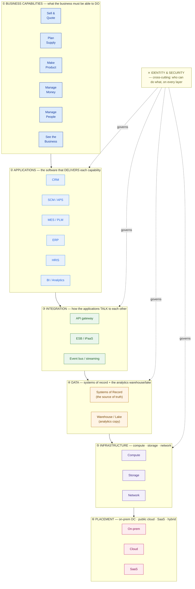
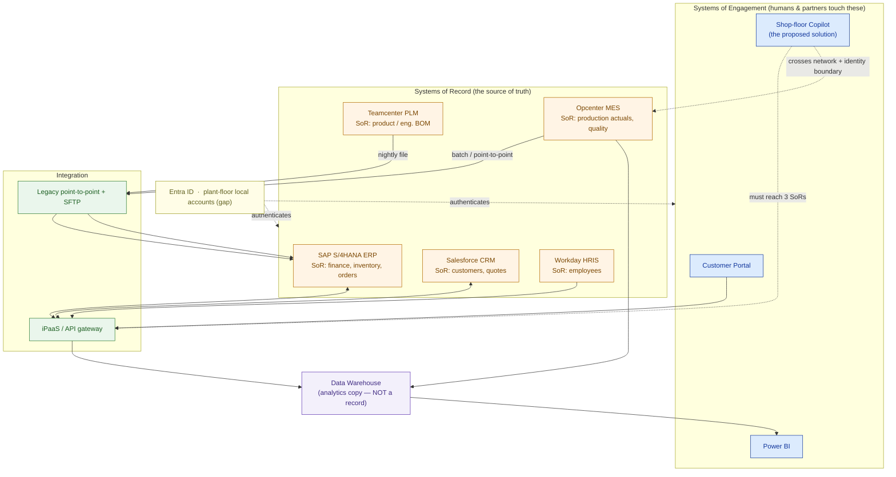

# How Enterprise IT Fits Together

> You can't architect a solution for an estate you can't map. Learn to read the enterprise stack before you draw a single box.

**Type:** Learn
**Track:** AI, Data & Infrastructure Solution Architect (Presales)
**Prerequisites:** None (entry lesson)
**Time:** ~3h
**Lab:** —
**Ship It:** Enterprise IT landscape diagram

## The Problem

You are two hours into a first discovery workshop at a mid-size manufacturer. The VP of Operations says the magic words every SA loves to hear: *"We want an AI copilot for the shop floor — ask it 'why is Line 3 behind schedule?' and get a straight answer."* You nod, and in your head you're already sketching a slick PoC: a chatbot, a vector database, a six-week timeline. You quote it before lunch.

Then the build starts, and the estate bites back. "Behind schedule" is not one number in one database. The *plan* lives in a supply-chain planning tool. The *production orders* live in the ERP. The *actual machine output and downtime* live in a manufacturing execution system on an isolated plant network that nobody in the room could name. The *quality holds* that stopped Line 3 live in yet another app. There is no clean API layer — apps talk through overnight file drops and a decade-old integration bus that one contractor understands. And every one of those systems has its own login, because the identity story is "Active Directory, mostly, except the shop-floor systems." Your six-week copilot is now a nine-month integration project you already priced at PoC rates. The deal is underwater before the kickoff.

This is the failure mode of an SA who can't map an IT estate. You propose solutions that don't integrate because you treated each application as an island. You miss identity and security because you never drew the layer that cuts across everything. You promise to read "the data" as if there's one source of truth, when in reality every fact has an *owner system* — and reading it from the wrong one gives you stale or contradictory answers. The single most common rookie mistake underneath all of this is confusing a **business capability** ("make product", "manage customers") with the **application that happens to deliver it** today — so you design for the org chart of software instead of the work the business actually does. This lesson gives you the map. Once you can read an enterprise stack the way a mechanic reads an exploded-parts diagram, discovery stops being guesswork and your proposals start landing on the first pass.

## The Concept

An enterprise's IT is not a pile of apps. It's a **layered stack**, and every layer answers a different question. An architect who can name the layers — and knows which layer a given fact, integration, or risk lives in — can walk into any customer and orient in minutes. Here is the whole model on one page.



Read it **top-down for discovery** (start from what the business does, drill to how it's built) and **bottom-up for design** (place the workload on infrastructure, wire it through integration, expose it as a capability). The layers, in the SA's own words:

1. **Business capabilities** — the verbs of the enterprise: *sell, plan, make, ship, invoice, hire, report*. These are stable. They existed before the current software and will outlive it. You anchor discovery here.
2. **Applications** — the packaged or custom software that *implements* a capability today: ERP, CRM, SCM, MES, HRIS, BI (glossary below). This is what customers *name* when you ask what they have — but the name is an implementation detail.
3. **Integration** — the wiring between apps: REST/SOAP APIs, an enterprise service bus (ESB) or its cloud successor iPaaS, event streams, and — be honest — nightly file transfers. **This is the layer rookies forget, and it's where most of the effort in any real solution actually goes.**
4. **Data** — where facts live. Split it in your head: **systems of record** (the authoritative source for a data domain) versus the **warehouse/lake** (a *copy* consolidated for analytics). Reporting reads the copy; transactions read the record.
5. **Infrastructure** — the compute, storage, and network the apps run on. At architect altitude you size and place this; you don't administer it.
6. **Placement** — on-prem data center, public cloud, SaaS, or a hybrid mix. The same app can live in any of these, which changes cost, latency, and who holds the keys.
7. **Identity & Security** — *cross-cutting*, not a layer you can skip to. Every arrow between two boxes is also an authentication and authorization decision. If your diagram has no identity story, it is not finished.

### Business capability ≠ the app that delivers it

This is the distinction that separates architects from order-takers. A **capability** is *what* the business must be able to do; an **application** is *how* it's done right now. "Manage customer relationships" is a capability. Salesforce is one app that delivers it. Tomorrow it could be Dynamics, or two apps, or a custom portal — the capability doesn't move. When you map to capabilities, you design solutions that survive an app swap and you spot the *gaps* (a capability with no owning app) and the *overlaps* (three apps fighting over one capability). When you map only to apps, you inherit the customer's accidental sprawl and bake it into your proposal.

```
   CAPABILITY (stable, business-owned)          APPLICATION (changeable, IT-owned)
   ─────────────────────────────────           ──────────────────────────────────
   "Manage customer relationships"      ⇄       Salesforce  (could be Dynamics, HubSpot…)
   "Run the plant"                      ⇄       Opcenter MES (could be Ignition, custom…)
   "Keep the books"                     ⇄       SAP S/4HANA  (could be Oracle, NetSuite…)

   One capability may be split across several apps, or one app may cover several
   capabilities. The map is many-to-many — that mismatch is where the work hides.
```

### Systems of record vs systems of engagement

Every fact in the enterprise has exactly one **system of record (SoR)** — the authoritative owner of that data domain. Employees? The HRIS. Inventory levels? The ERP. Machine downtime? The MES. Around those sit **systems of engagement (SoE)** — the portals, apps, dashboards, and (increasingly) AI copilots that people actually *touch*. The SoE is where the experience is; the SoR is where the truth is. Confuse the two and you build a beautiful copilot answering from stale data.

| | **System of Record (SoR)** | **System of Engagement (SoE)** |
|---|---|---|
| **Question it answers** | "What is the authoritative value?" | "How does a human interact with it?" |
| **Examples** | ERP, HRIS, MES, PLM, core banking | Portal, mobile app, CRM UI, BI dashboard, AI copilot |
| **Change rate** | Slow, governed, high-integrity | Fast, experimental, UX-driven |
| **Owns the data?** | **Yes** — the source of truth | No — it reads/writes *through* the SoR |
| **What breaks if you're wrong** | Corrupt truth, compliance failure | Bad experience, stale answers |
| **Where AI copilots plug in** | As a *consumer* via integration | This is what you're usually building |

The architect's rule: **your new solution is almost always a system of engagement, and its value is only as good as its wiring to the systems of record underneath.** That's why the integration and data layers, not the shiny UI, decide whether the deal succeeds.

Here's the same stack as an **estate map** — the sketch you'll actually draw on a whiteboard, with identity running up the spine:

```
                          ┌───────────────────────────────────────────────────┐
   CROSS-CUTTING          │        IDENTITY & SECURITY   (who can do what)     │
   spans every layer ───▶ │   directory · SSO · RBAC · secrets · segmentation  │
                          └───────────────────────────────────────────────────┘
   ┌──────────────────────────────────────────────────────────────────────────┐
 ① │ BUSINESS CAPABILITY    Sell   Plan   Make   Ship   Pay    Hire   Report   │
   └────────┬─────────────────────────────────────────────────────────────────┘
            │  a capability is delivered BY an app — never confuse the two
   ┌────────▼─────────────────────────────────────────────────────────────────┐
 ② │ APPLICATION             CRM    APS    MES    WMS    ERP    HRIS   BI       │
   └────────┬─────────────────────────────────────────────────────────────────┘
   ┌────────▼─────────────────────────────────────────────────────────────────┐
 ③ │ INTEGRATION       API gateway · ESB / iPaaS · event bus · files / SFTP    │
   └────────┬─────────────────────────────────────────────────────────────────┘
   ┌────────▼─────────────────────────────────────────────────────────────────┐
 ④ │ DATA         Systems of Record ───ETL / CDC──▶ Warehouse / Lake ──▶ BI    │
   └────────┬─────────────────────────────────────────────────────────────────┘
   ┌────────▼─────────────────────────────────────────────────────────────────┐
 ⑤ │ INFRASTRUCTURE          compute · storage · network                       │
   └────────┬─────────────────────────────────────────────────────────────────┘
   ┌────────▼─────────────────────────────────────────────────────────────────┐
 ⑥ │ PLACEMENT               on-prem DC   ·   public cloud   ·   SaaS          │
   └──────────────────────────────────────────────────────────────────────────┘
```

## Design It

Let's map a real-shaped estate. **Meridian Gearworks** is a fictional mid-size manufacturer of industrial gearboxes: ~1,200 employees, three plants, sells to OEMs and distributors. They want the shop-floor copilot from The Problem. Your job in discovery is not to design the copilot yet — it's to **draw the landscape it must live in**, so you can scope honestly. Work the layers in order.

### Step 1 — List the business capabilities (not the apps)

Before you ask "what software do you run?", ask "what does the business *do*?" You get a clean, MECE-ish list that the app sprawl will later attach to:

```
Sell & Quote → Design Product → Plan Supply → Procure → Make → Ship → Invoice → Support → Hire & Pay → Report
```

Ten capabilities. Notice none of them is a product name. This list is your checklist for the rest of discovery: every capability must map to *something*, and any capability with no owning system is a finding.

### Step 2 — Map each capability to the application that delivers it

Now overlay the software. Ask "which system does the work for each capability, and where does it run?"

| Capability | Application | Placement | Record or engagement? |
|---|---|---|---|
| Sell & Quote / Support | **Salesforce CRM** | SaaS | Engagement (front) + record for customers/quotes |
| Design Product | **Teamcenter PLM** | On-prem | **Record** — engineering BOM, CAD |
| Plan Supply | **Kinaxis (APS)** | SaaS | Engagement — planning, reads from ERP |
| Procure / Make orders / Invoice | **SAP S/4HANA ERP** | On-prem | **Record** — finance, inventory, procurement |
| Make (execute on the floor) | **Opcenter MES** | On-prem (plant network) | **Record** — production execution, machine + quality data |
| Ship / Warehouse | **ERP WM module** | On-prem | Record — stock movements |
| Hire & Pay | **Workday HRIS** | SaaS | **Record** — employees |
| Report | **Power BI + a data warehouse** | Cloud | Engagement — analytics copy, *not* a record |

Immediately you can see things the VP never mentioned: PLM and MES are the systems the copilot most needs, they live on **isolated on-prem plant networks**, and two of the "obvious" data sources (the warehouse, Power BI) are *copies*, not truth.

### Step 3 — Mark the system of record for each data domain

Draw a one-line ledger of *who owns what fact*. This is the single most valuable artifact in the whole map, because it tells your future solution where to read.

```
DATA DOMAIN           SYSTEM OF RECORD        DO NOT read this from…
─────────────────────────────────────────────────────────────────────
Customer & quote      Salesforce CRM          the data warehouse (lags a day)
Product / eng. BOM    Teamcenter PLM          the ERP (has a stale manufacturing BOM)
Inventory & finance   SAP S/4HANA ERP         Power BI (aggregated, no line detail)
Production actuals    Opcenter MES            the ERP (only sees planned, not actual)
Employees             Workday HRIS            Active Directory (identities, not HR truth)
```

The copilot's question — *"why is Line 3 behind schedule?"* — now decomposes cleanly: the **plan** comes from Kinaxis, the **released orders** from SAP, and the **actual output and downtime** from Opcenter MES. Three record systems, three integrations. That is the honest scope, and you found it in one table.

### Step 4 — Draw the integration layer (how the apps actually talk)

Ask the question rookies skip: *"when Salesforce needs an inventory number, how does it get it — today?"* At Meridian the answer is a mix, and the mix is the risk:

- Salesforce ⇄ SAP: a modern **iPaaS** (managed connectors, near-real-time).
- SAP ⇄ Opcenter MES: a **legacy point-to-point** interface plus nightly batch.
- PLM → ERP: **SFTP file drops** of the BOM, once per shift.
- Everything → Warehouse: overnight **ETL**.

So a "real-time" copilot sitting on top of MES data that only lands in reachable systems *once a shift* is physically impossible without new integration. You just converted a vague feeling of risk into a concrete line item.

### Step 5 — Add infrastructure, placement, and the identity spine

Finally, note where things run and how access works — because every arrow you drew is also a security boundary.

- **Placement:** ERP/PLM/MES on-prem (two of them on segmented plant networks with no direct internet route); CRM/HRIS/APS are SaaS; the warehouse and any new copilot would be cloud.
- **Identity:** corporate apps federate to **Entra ID (Azure AD)**; the plant-floor MES uses **local accounts** — a classic gap. Your copilot will need a service identity that can reach *across* that boundary, which is a security review, not a checkbox.

Put it together and the estate map falls out of the five steps:



Same discovery, completely different proposal. Instead of "a six-week chatbot", you now scope "a system of engagement that integrates three systems of record across a segmented plant network and an identity gap" — and you price it, stage it, and win it because the customer can see you understand their estate better than they do.

## Compare It

Three established frames formalize the map you just drew. You don't need to *do* full enterprise architecture as a presales SA — you need to know which frame to reach for in which conversation.

| Frame | What it gives you | Reach for it when… |
|---|---|---|
| **TOGAF (BDAT layers)** | Splits architecture into **B**usiness, **D**ata, **A**pplication, **T**echnology domains — almost exactly the layered stack above. Comprehensive, formal, heavy. | The customer *has* an enterprise-architecture team and speaks TOGAF; align your map to BDAT so it drops into their repository. |
| **C4 model** | Four zoom levels — **Context → Container → Component → Code**. The **Context** ("System Context") diagram is the perfect one-pager for "how does our new thing fit with everything around it?" | Any discovery or HLD. The C4 Context diagram *is* the estate map for a single solution — use it to show your solution surrounded by the SoRs it touches. |
| **Gartner Pace-Layering** | Classifies apps as **Systems of Record** (slow, stable) / **Differentiation** (medium) / **Innovation** (fast). Reinforces SoR vs SoE. | Explaining *why* the copilot moves fast but the ERP can't — and why you integrate rather than replace. |

And the vendors: most mid-to-large enterprises are anchored on one of a few **application platforms**, and recognizing the anchor tells you most of the estate before you even ask.

| Vendor stack | Anchors the estate around… | What it means for your integration story |
|---|---|---|
| **SAP** (S/4HANA, BTP) | The **ERP** as the gravitational center — finance, inventory, procurement, often production planning. | The SoR is SAP. Integrate via SAP BTP / OData APIs; respect that SAP guards the transactional truth. |
| **Salesforce** (Sales/Service Cloud, MuleSoft) | The **customer** — CRM as the front and often the integration layer (MuleSoft *is* their iPaaS). | Great APIs, SaaS-first. The customer record is Salesforce; watch for it drifting from the ERP's version. |
| **Microsoft Dynamics 365 + Power Platform** | A **blended** ERP+CRM on Azure, tightly coupled to Entra ID, Power BI, and Fabric. | Identity and analytics come "for free" via Azure; integration leans on Power Platform connectors. |

The "it depends" a customer will actually ask: *"Should we replace the old app or integrate with it?"* Your map answers it. If the app is a **system of record** with years of embedded truth (ERP, MES), you integrate — ripping it out is a multi-year program, not your PoC. If it's a **system of engagement** (a tired portal, a spreadsheet), you can replace it, because it owns no truth. The layered map is what lets you give that answer with confidence in the room.

## Ship It

This lesson ships a reusable **Enterprise IT Landscape Diagram** — the deliverable you produce in the first days of any engagement, and the foundation every later artifact (HLD, integration design, migration plan) builds on. Both files live in [`outputs/`](../outputs/):

- **[`template-enterprise-landscape.md`](../outputs/template-enterprise-landscape.md)** — a fill-in-the-blank template: a Mermaid estate-map skeleton plus four tables (capability→app, system-of-record ledger, integration inventory, and identity/placement notes). Hand it to a colleague and they can run a discovery workshop from it.
- **[`example-meridian-gearworks-landscape.md`](../outputs/example-meridian-gearworks-landscape.md)** — the template fully worked for Meridian Gearworks, so the skeleton isn't abstract. It's the artifact you'd attach to the discovery report.

The point of shipping this early: a landscape diagram both an engineer and an executive can read is the cheapest trust you'll ever buy in a deal. It says *we understood your estate before we sold you anything.*

## Exercises

1. **(Easy)** Take the estate map drawn for Meridian and label every box as either a **system of record** or a **system of engagement**. For the shop-floor copilot, write one sentence naming the three systems of record it must read from and which layer (integration) decides whether it's feasible.
2. **(Medium)** Re-map the template for a *different* customer: a **mid-size hospital**. List five business capabilities, name a plausible application for each (hint: the EHR is the anchor SoR the way ERP is for a manufacturer), and mark the systems of record. Note where the identity/security layer is most sensitive and why.
3. **(Hard)** Extend Meridian's map into a **decision**: the customer also asks whether to replace their aging Teamcenter PLM. Using the systems-of-record rule and the pace-layering frame from Compare It, write a half-page recommendation — replace vs integrate — that names the risk of each path and the estate evidence behind your call. Save it alongside your worked example; you'll reuse this reasoning in the Phase 1 Discovery capstone.

## Key Terms

| Term | What people say | What it actually means |
|------|-----------------|------------------------|
| Business capability | "A feature" | A stable thing the business must be able to *do* (sell, make, invoice), independent of the software that delivers it today. You anchor discovery here, not on app names. |
| System of Record (SoR) | "The database" | The single authoritative owner of a data domain (ERP owns inventory, HRIS owns employees). Every fact has exactly one; read truth from here, not from a copy. |
| System of Engagement (SoE) | "The app" | The portal/dashboard/copilot a human touches. It owns *no* truth — it reads/writes through the SoR. Your new solution is almost always one of these. |
| Integration layer | "The APIs" | The wiring between apps — APIs, ESB/iPaaS, events, and (honestly) file drops. Where most of the real effort lives, and the layer rookies forget to scope. |
| ERP | "The finance system" | The transactional backbone (finance, inventory, procurement, orders) — usually the estate's gravitational center and its biggest system of record. |
| MES | "Factory software" | Manufacturing Execution System — the system of record for what *actually* happened on the plant floor (output, downtime, quality), often on an isolated network. |
| ESB / iPaaS | "Middleware" | The plumbing that lets apps talk. ESB is the on-prem classic; iPaaS (MuleSoft, Boomi) is its cloud successor. Its absence is why "real-time" quotes go wrong. |
| Landscape / estate | "Their IT" | The full layered map — capabilities, apps, integration, data, infra, placement, identity — of what a customer runs. Mapping it *is* the SA's first job. |

## Further Reading

- [The C4 model for visualising software architecture](https://c4model.com/) — the Context diagram is the exact "our solution amid its neighbours" one-pager this lesson teaches; learn it once and use it in every HLD.
- [TOGAF Standard — Architecture Development Method](https://pubs.opengroup.org/architecture/togaf-standard/) — the formal BDAT layering (Business/Data/Application/Technology) your estate map mirrors; skim it so you can align to a customer's EA team.
- [Gartner: Pace-Layered Application Strategy](https://www.gartner.com/en/documents/1485116) — the systems-of-record vs differentiation vs innovation split that tells you what to integrate versus what to replace.
- [Geoffrey Moore — Systems of Engagement and the Future of Enterprise IT](https://www.aiim.org/) (AIIM) — the report that named the SoR-vs-SoE distinction now central to how AI copilots plug into enterprises.
- [SAP S/4HANA product overview](https://www.sap.com/products/erp/s4hana.html) and the [Salesforce Architecture Center](https://architect.salesforce.com/) — read one page of each so you recognize the two most common estate anchors on sight.
