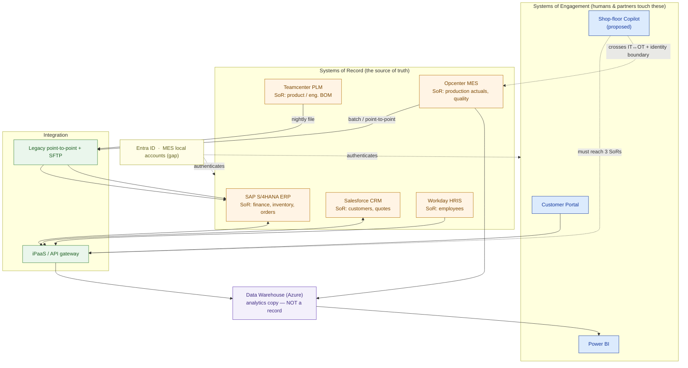

# Enterprise IT Landscape — Meridian Gearworks (worked example)

> This is `template-enterprise-landscape.md` filled in for a fictional customer. It shows what "good" looks like: the map plus the findings that turn a vague ask into an honest, winnable scope.

**Customer:** Meridian Gearworks (fictional)  ·  **Industry:** Discrete manufacturing (industrial gearboxes)
**Prepared by:** SA — Presales  ·  **Date:** 2026-07-04  ·  **Opportunity:** "Shop-Floor Copilot" PoC → rollout  ·  **Version:** v0.2

**Company shape:** ~1,200 employees · 3 plants · sells to OEMs + distributors.
**The ask (verbatim):** *"An AI copilot for the shop floor — ask it 'why is Line 3 behind schedule?' and get a straight answer."*

---

## 1. Business capabilities (the verbs, not the apps)

```
Sell & Quote → Design Product → Plan Supply → Procure → Make → Ship → Invoice → Support → Hire & Pay → Report
```

Ten capabilities, zero product names. This is the checklist §2 must satisfy.

## 2. Capability → application map

| Capability | Application | Placement | SoR or SoE? | Owner / SME |
|---|---|---|---|---|
| Sell & Quote / Support | Salesforce CRM | SaaS | SoE front + **SoR** for customers/quotes | Sales Ops |
| Design Product | Teamcenter PLM | On-prem | **SoR** — engineering BOM, CAD | Engineering |
| Plan Supply | Kinaxis (APS) | SaaS | SoE — reads plan inputs from ERP | Supply Chain |
| Procure / Orders / Invoice | SAP S/4HANA ERP | On-prem | **SoR** — finance, inventory, procurement | Finance / IT |
| Make (execute on floor) | Opcenter MES | On-prem (plant OT net) | **SoR** — production actuals, machine + quality | Plant IT / OT |
| Ship / Warehouse | SAP WM module | On-prem | SoR — stock movements | Logistics |
| Hire & Pay | Workday HRIS | SaaS | **SoR** — employees | HR |
| Report | Power BI + data warehouse | Cloud (Azure) | SoE — analytics copy, **not** a record | BI team |

**Findings from the mapping:** the copilot's most-needed systems (PLM, MES) sit on **isolated plant networks**; the two "obvious" data sources (warehouse, Power BI) are **copies**, not truth.

## 3. System-of-record ledger (who owns which fact)

```
DATA DOMAIN            SYSTEM OF RECORD        DO NOT read this from…
────────────────────────────────────────────────────────────────────
Customer & quote       Salesforce CRM          the data warehouse (lags a day)
Product / eng. BOM     Teamcenter PLM          the ERP (stale manufacturing BOM)
Inventory & finance    SAP S/4HANA ERP         Power BI (aggregated, no line detail)
Production actuals     Opcenter MES            the ERP (sees planned, not actual)
Employees              Workday HRIS            Active Directory (identities, not HR truth)
```

**Decomposing the copilot's question** *"why is Line 3 behind schedule?"*:
- **Plan** → Kinaxis (APS)
- **Released orders** → SAP S/4HANA
- **Actual output & downtime** → Opcenter MES

→ Three systems of record, three integrations. That is the true scope.

## 4. Integration inventory (how the apps talk — today)

| From | To | Mechanism | Freshness | Risk |
|---|---|---|---|---|
| Salesforce | SAP S/4HANA | iPaaS (managed connectors) | Near real-time | L |
| SAP S/4HANA | Opcenter MES | Legacy point-to-point + batch | Nightly / per-shift | **H** |
| Teamcenter PLM | SAP S/4HANA | SFTP file drop (BOM) | Once per shift | **H** |
| Kinaxis | SAP S/4HANA | iPaaS | Hourly | M |
| All sources | Data warehouse | ETL | Overnight | M |
| Opcenter MES | Data warehouse | Batch export | Nightly | M |

**Cap on freshness:** the copilot's answer can only be as fresh as the **slowest** hop to its SoRs. Today, MES data reaches reachable systems roughly **once per shift** → a truly "real-time" copilot is impossible without *new* integration straight to MES.

## 5. Identity & placement (the cross-cutting spine)

- **Directory / SSO:** Corporate apps (Salesforce, Workday, Kinaxis, Power BI) federate to **Entra ID**. Plant-floor **Opcenter MES uses local accounts** — outside SSO.
- **Network boundaries:** ERP, PLM, MES on-prem; MES + one PLM node on **segmented OT plant networks** with no direct internet route.
- **Identity/security gap:** the copilot needs a **service identity that can cross the IT↔OT boundary** to read MES — a security review, not a checkbox.
- **Placement summary:** SoRs are mostly on-prem; SoEs (CRM, HRIS, BI) and any new copilot are cloud. The new solution will live in Azure and must reach *into* the plants.

---

## 6. The estate map



### ASCII fallback

```
   IDENTITY & SECURITY  Entra ID (corp)  |  MES local accounts (gap)  ── spans all
   ─────────────────────────────────────────────────────────────────────────────
 ① CAPABILITY    Sell   Design  Plan   Procure Make   Ship   Pay    Report
 ② APPLICATION   SF-CRM Teamctr Kinaxis  SAP    Opcntr SAP-WM Workday PowerBI
 ③ INTEGRATION   iPaaS (SF↔SAP, Kinaxis↔SAP)  ·  legacy P2P + SFTP (PLM/MES↔SAP)
 ④ DATA          SoRs: SF · SAP · Teamcenter · Opcenter · Workday ──ETL──▶ DW ─▶ BI
 ⑤ INFRASTRUCTURE  on-prem DC (ERP/PLM/MES)  ·  Azure (DW, copilot)
 ⑥ PLACEMENT     on-prem + segmented OT plant nets  ·  SaaS  ·  Azure
```

---

## 7. Findings & implications

| # | Finding | Layer | Implication for the solution | Severity |
|---|---|---|---|---|
| 1 | MES data reaches reachable systems only ~once/shift | Integration | "Real-time" copilot needs a **new direct MES integration** | **High** |
| 2 | MES on segmented OT net, local accounts (not Entra ID) | Identity | Cross-boundary **service identity + security review** required | **High** |
| 3 | Warehouse & Power BI are copies, not SoRs | Data | Copilot must read actuals from **MES**, not the warehouse | Medium |
| 4 | ERP holds *planned*, MES holds *actual* production | Data | Answering "behind schedule" needs **both** joined | Medium |
| 5 | PLM→ERP is a per-shift SFTP file | Integration | BOM-dependent answers lag; note in expectations | Medium |

**One-line scope statement:**
> The **Shop-Floor Copilot** is a *system of engagement* that must integrate **three systems of record** (Kinaxis plan, SAP orders, Opcenter MES actuals) across a **segmented OT network and an identity gap** — the integration and security work, not the chatbot, is the real driver of effort, timeline, and price.

**So what (the pivot this map buys you):** instead of quoting "a 6-week chatbot", the honest, winnable scope is a phased engagement — Phase 1: MES integration + IT↔OT identity + a read-only copilot over plan/order/actual; Phase 2: quality holds and predictive alerts. You price it correctly and you win it because the customer sees you understood their estate before you sold anything.
