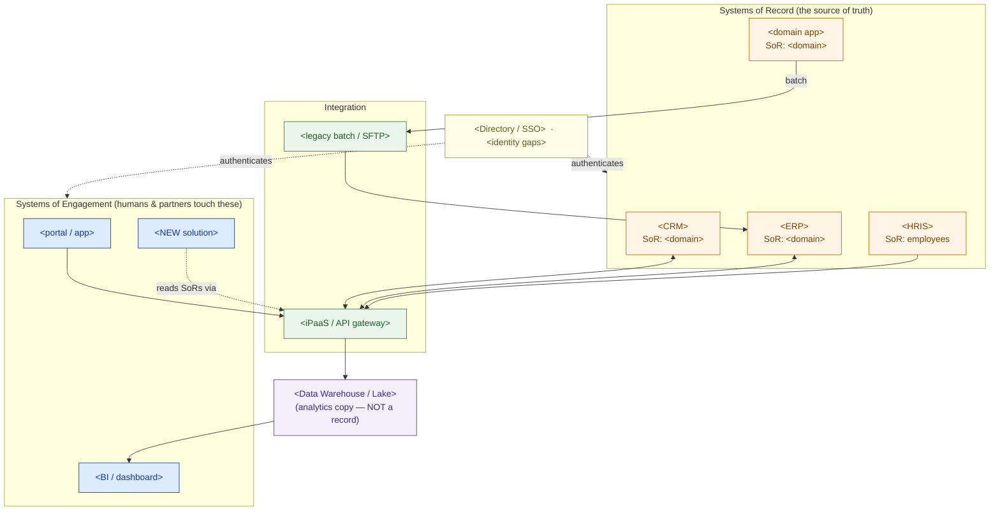

# Enterprise IT Landscape — Discovery Template

> Fill this in during (and just after) a discovery workshop. It is the first artifact of any engagement and the foundation for the HLD, integration design, and migration plan that follow. An executive should grasp the diagram; an engineer should trust the tables.

**Customer:** `<company>`  ·  **Industry:** `<industry>`  ·  **Prepared by:** `<SA name>`  ·  **Date:** `<YYYY-MM-DD>`
**Engagement / opportunity:** `<deal or project name>`  ·  **Version:** `<v0.1 draft>`

---

## How to use this template

Work the layers **top-down** (business → placement). Do not start from the app list the customer hands you — start from what the business *does*, then attach the apps.

1. **Capabilities** — list what the business must be able to *do* (verbs), before any product names.
2. **Applications** — map each capability to the app that delivers it today, and where it runs.
3. **System-of-record ledger** — for each data domain, name the single authoritative owner.
4. **Integration inventory** — record how each pair of apps actually talks (API, iPaaS, batch, file, none).
5. **Identity & placement** — note the directory/SSO story and any network/identity gaps.
6. **Draw the map** — fill the Mermaid skeleton and list the findings.

Legend for every diagram/table below: **SoR** = system of record (owns the truth) · **SoE** = system of engagement (a human touches it) · **iPaaS/ESB** = integration middleware.

---

## 1. Business capabilities (the verbs, not the apps)

> List 8–12. Each must map to something in §2, or it's a gap finding.

```
<Capability 1> → <Capability 2> → <Capability 3> → <…> → <Capability n>
```

## 2. Capability → application map

| Capability | Application (product) | Placement (on-prem / SaaS / cloud) | SoR or SoE? | Owner / SME |
|---|---|---|---|---|
| `<capability>` | `<app>` | `<placement>` | `<SoR / SoE>` | `<name / team>` |
| `<capability>` | `<app>` | `<placement>` | `<SoR / SoE>` | `<name / team>` |
| `<…>` | | | | |

*Findings to flag:* capabilities with **no** owning app (gaps) · one capability split across **many** apps (overlap/sprawl).

## 3. System-of-record ledger (who owns which fact)

> The most valuable table here. It tells any future solution where to read truth — and where NOT to.

```
DATA DOMAIN            SYSTEM OF RECORD        DO NOT read this from…
────────────────────────────────────────────────────────────────────
<customer/CRM data>    <app>                   <the wrong copy + why>
<financial/inventory>  <app>                   <…>
<product / BOM>        <app>                   <…>
<production actuals>   <app>                   <…>
<employees / HR>       <app>                   <…>
<…>                    <…>                     <…>
```

## 4. Integration inventory (how the apps talk — today)

| From | To | Mechanism (API / iPaaS / ESB / event / batch / SFTP / none) | Freshness (real-time / hourly / nightly) | Risk |
|---|---|---|---|---|
| `<app A>` | `<app B>` | `<mechanism>` | `<freshness>` | `<L/M/H + note>` |
| `<app>` | `<warehouse>` | `<ETL / CDC>` | `<freshness>` | `<…>` |
| `<…>` | | | | |

*Rule of thumb:* the freshness a new "real-time" solution can achieve is capped by the **slowest** integration between it and its systems of record.

## 5. Identity & placement (the cross-cutting spine)

- **Directory / SSO:** `<Entra ID / Okta / AD / …>` — which apps federate, which use local accounts.
- **Network boundaries:** `<segmented plant/OT network? DMZ? no internet route?>`
- **Identity/security gaps:** `<apps outside SSO, shared accounts, OT↔IT gap, …>`
- **Placement summary:** `<what's on-prem, what's SaaS, what's cloud, and why it matters for a new solution>`

---

## 6. The estate map (Mermaid skeleton)

> Replace the placeholder nodes. Keep engagement systems on top, records in the middle, integration + data below, identity to the side. Delete rows you don't need.



### ASCII fallback (for docs/email that can't render Mermaid)

```
   IDENTITY & SECURITY  (who can do what)  ──────────── spans every layer
   ────────────────────────────────────────────────────────────────────
 ① CAPABILITY    <cap>  <cap>  <cap>  <cap>  <cap>  <cap>  <cap>
 ② APPLICATION   <CRM>  <APS>  <MES>  <WMS>  <ERP>  <HRIS> <BI>
 ③ INTEGRATION   <api gateway · iPaaS/ESB · events · batch/SFTP>
 ④ DATA          <Systems of Record> ──ETL/CDC──▶ <Warehouse/Lake> ─▶ BI
 ⑤ INFRASTRUCTURE  compute · storage · network
 ⑥ PLACEMENT     on-prem DC  ·  public cloud  ·  SaaS
```

---

## 7. Findings & implications (what the map tells us)

| # | Finding | Layer | Implication for the solution | Severity |
|---|---|---|---|---|
| 1 | `<e.g. two SoRs disagree on customer data>` | Data | `<must pick authoritative source / add MDM>` | `<H/M/L>` |
| 2 | `<e.g. target data only lands nightly>` | Integration | `<"real-time" ask needs new integration>` | `<…>` |
| 3 | `<e.g. OT network + local accounts>` | Identity | `<security review; service identity across boundary>` | `<…>` |

**One-line scope statement (fill in):**
> The proposed `<solution>` is a **system of engagement** that must integrate `<n>` systems of record (`<list>`) across `<the key constraint: network / identity / freshness>` — which is the real driver of effort and cost.

---

*Worked example: see `example-meridian-gearworks-landscape.md` in this folder.*
