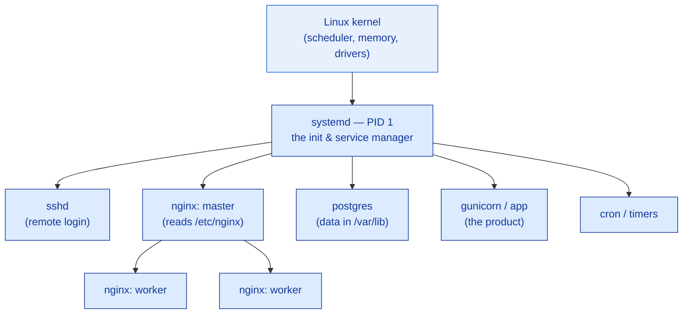

# Linux You Can Read (Not Script)

> You are not the sysadmin. But in discovery, the box is the customer's ground truth — and if you can't read a `df`, a `top`, a service unit, and a log line, you will mis-size the deal or miss the bottleneck the customer is paying you to find.

**Type:** Learn
**Track:** AI, Data & Infrastructure Solution Architect (Presales)
**Prerequisites:** [0.1 How Enterprise IT Fits Together](../../01-enterprise-it-landscape/docs/en.md)
**Time:** ~4h
**Lab:** read real logs/configs inside a container (copy-run)
**Ship It:** Linux-for-architects cheat sheet

## The Problem

You are three days into a discovery for a mid-size logistics company. Their flagship order-tracking app "falls over every afternoon," and they want you to propose either a bigger server, a move to the cloud, or a redesign — and to price it. The engineer who actually runs the box is on leave. What you get is what you *always* get in discovery: read-only SSH to one server, or a support bundle someone zipped up, and forty-five minutes on a call. Nobody is going to write you a report. The server *is* the report — if you can read it.

You run three commands. `df -h` says the root disk is 97% full. `top` shows a load average of 11.8 on a 4-core machine, but the CPUs are 74% *idle-waiting* on I/O, not busy computing. `free -h` shows 200 MB free out of 8 GB and swap almost entirely consumed. One line in the kernel log reads `Out of memory: Killed process 4123 (python3)`. In ninety seconds you know something the customer's own team hadn't articulated: **this is not a CPU problem, so buying a faster processor — or "just move it to a bigger cloud instance" — is the wrong recommendation.** It is a memory-and-disk problem, and the fix is cheaper and more precise than what they were about to spend money on.

That is the entire skill. You are not here to tune the kernel, patch packages, or write the fix — that is the customer's engineer or the delivery team. You are here to **read state and reason about capacity and failure**, because getting this wrong has a price tag: over-size and you inflate the Bill of Materials with hardware nobody needs and lose the deal on cost; under-size and you propose something that falls over in production and lose the account on trust. This lesson teaches you to read Linux the way an architect reads it — five surfaces (filesystem, processes/services, and the CPU / memory / disk / network meters) plus configs and logs — and to turn what you read into a one-paragraph sizing recommendation you can defend.

## The Concept

An architect reads a Linux box through five windows. Learn where each one lives and what "bad" looks like, and you can walk into any discovery and form an opinion.

### 1. The filesystem: everything is a file, in a place that means something

Linux has one tree rooted at `/`, and the **Filesystem Hierarchy Standard (FHS)** puts predictable things in predictable places. You do not need to memorise all of it — you need the four directories where the customer's *truth* lives: config, logs, data, and the kernel/process view.

```
/                         the single root of everything
├── etc/                  CONFIG lives here — text files you can read
│   ├── fstab             which disks mount where (capacity/topology)
│   ├── nginx/nginx.conf  the web server's designed capacity
│   ├── hosts             static name → IP overrides
│   └── systemd/system/   service definitions (units)  ← how things start
├── var/
│   ├── log/              LOGS live here — syslog, messages, app & access logs
│   └── lib/              DATA lives here — postgres, mysql, docker, app state
├── opt/                  vendor / third-party apps dropped in as a bundle
├── home/                 human user home directories
├── usr/                  installed programs & libraries (/usr/bin, /usr/local)
├── proc/  &  sys/        VIRTUAL — the live kernel & per-process state
│                         (/proc/loadavg, /proc/meminfo, /proc/<pid>/…)
├── dev/                  devices — block disks appear as /dev/sda, /dev/nvme0n1
├── boot/                 the kernel & bootloader
└── tmp/                  scratch space, wiped on reboot
```

The reflex to build: **config in `/etc`, logs in `/var/log`, data in `/var/lib`, live state in `/proc`.** When a customer says "where does the app keep its data?", the answer is almost always a directory under `/var/lib` or `/opt` or a mounted volume — and *how big that directory is and how fast its disk is* becomes a line in your sizing.

### 2. Processes and services: PID 1 is the parent of everything

A running program is a **process** with a numeric **PID** and a **parent** (PPID). One process starts another, so they form a tree — and the root of the tree, PID 1, is the **init system**. On every modern enterprise distro that is **systemd**. Systemd is also the *service manager*: the things a customer cares about — the database, the web server, the app — run as **services** (systemd calls them *units*, defined in `/etc/systemd/system/*.service`) that systemd starts at boot, restarts on failure, and reports the health of.



The one command that ties it together is `systemctl status <service>`. It packs the whole service picture into one screen — read it top to bottom:

```
● nginx.service - A high performance web server
     Loaded: loaded (/etc/systemd/system/nginx.service; enabled)   ← starts on boot
     Active: active (running) since Mon 2026-07-04 09:01:12; 5h ago ← state + uptime
   Main PID: 3210 (nginx)                                          ← the process to trace
     Memory: 118.4M  (max: 512.0M)                                 ← usage vs a cap it can hit
      Tasks: 5 (limit: 4915)
     CGroup: /system.slice/nginx.service
             ├─3210 nginx: master process
             └─3211 nginx: worker process
Jul 04 14:31:03 app01 nginx[3210]: upstream timed out (110) …      ← last log lines, inline
```

Six facts an architect extracts from that: it's **enabled** (survives a reboot), **running** (not the cause of *this* outage on its own), its **PID** (to follow in `top`), its **memory vs. a configured cap** (a service pinned against `max:` will be OOM-restarted), and the **recent log lines** that hint at the real problem — here, a timeout waiting on a *backend*, which points you upstream. `systemctl list-units --failed` is the fastest "what's broken here?" you can run. You are reading, not restarting — but a `failed` unit, or one flapping against its memory cap, is often *why the customer's afternoon outage happens*.

One more thing to recognise in `top`/`ps`: the process **state** column. `R` = running/runnable, `S` = sleeping (normal, idle), `D` = **uninterruptible sleep** (stuck waiting on I/O — a pile of `D` processes is the disk-bound signature), `Z` = zombie (finished but not reaped). A database sitting in `D` while load climbs is disk telling you it's the bottleneck.

### 3. The four resource meters: CPU, memory, disk, network

This is where sizing lives. Each resource has a "how full is it" number and a signature of what saturation looks like.

**CPU — read the load average against the core count.** `uptime` (or the top line of `top`) prints three numbers: `load average: 11.84, 10.02, 8.41` — the average number of processes wanting the CPU over the last 1, 5, and 15 minutes. The rule of thumb: **load ≈ number of cores means fully used; load ≫ cores means saturated.** But a high load does not always mean "buy more CPU" — Linux counts processes stuck waiting on disk as part of load too. So always cross-check the `%wa` (I/O-wait) figure in `top`. High load + high `%wa` + low actual CPU usage = the box is **disk-bound, not CPU-bound**, and more vCPUs won't help.

**Memory — read `available`, never `free`.** The classic beginner mistake, and the one that costs money in sizing. `free -h` shows `total`, `used`, `free`, and `buff/cache`. Linux deliberately uses otherwise-idle RAM as disk cache, so `free` is almost always small — that is *healthy*, not a problem. The number that matters is **`available`**: how much memory a new workload could actually get. And the alarm bell is **swap**: if swap is filling up, the box has run out of real RAM and is paging to disk, which is 1000× slower — the symptom the customer feels as "it gets slow, then it dies."

```
        MEMORY, THE WAY LINUX MEANS IT (a healthy 8 GB box)
   ┌──────────────────────────────────────────────────────────┐
   │  used by apps     │  buff/cache (reclaimable)  │  free    │
   │  ███████████████  │  ▒▒▒▒▒▒▒▒▒▒▒▒▒▒▒▒▒▒▒▒▒▒▒▒  │  ░░░░░   │
   └──────────────────────────────────────────────────────────┘
        └──────────────── available ≈ free + most of cache ────┘
   "free is low" is NORMAL.  "available is low AND swap is filling" = trouble.
```

**Disk — two questions: how full, and how fast.** `df -h` answers *how full* (capacity, `Use%`) — and note `df -i` for **inodes**, because a disk can be "0% full" of bytes yet out of inodes (millions of tiny files) and still fail writes. A root filesystem over ~90% is a ticking bomb: logs can't rotate, the app crashes when it hits 100%. *How fast* is `iostat -xz 1` (from the `sysstat` package): watch `%util` (a disk pinned near 100% is the bottleneck) and `await` (average wait per I/O in ms — single-digit for SSD, tens is suspicious, hundreds is a stall). Disk speed is measured in **IOPS** (operations/second) and latency, and it is the resource architects under-estimate most often.

**Network — what's listening and what's flowing.** `ss -tulpn` lists every open/listening TCP/UDP port and the process behind it — instantly showing you which services are exposed and on which ports. `ip a` shows the addresses and NICs. For a discovery you rarely need throughput numbers off one box, but you do need to know *which ports the app depends on* (that becomes firewall and load-balancer input later in the track).

### 4. Reading a config vs. reading a log — designed capacity vs. observed reality

Two kinds of text file carry most of the signal, and they answer different questions.

A **config file** tells you the system's *designed* capacity — what the previous engineer intended. In `nginx.conf`, `worker_processes auto;` and `worker_connections 1024;` set the ceiling on concurrent connections; a database config sets a `max_connections` or a connection-pool size; a systemd unit can cap memory with `MemoryMax=` or file handles with `LimitNOFILE=`. These numbers are the customer's *intended* scale, and you compare them against what you actually observe.

A **log file** tells you *observed reality* — what actually happened. A log line has a shape: `timestamp  host  service[pid]:  LEVEL  message`. You skim for the levels that matter (`ERROR`, `WARN`, `Killed`, `timed out`, `No space left`) and a few fingerprints every architect should recognise on sight:

| What you see in the log | What it actually means | Sizing/architecture implication |
|-------------------------|------------------------|---------------------------------|
| `Out of memory: Killed process …` | Kernel OOM-killer freed RAM by killing a process | Under-provisioned memory → add RAM or cap the workload |
| `No space left on device` | A filesystem hit 100% | Grow the disk / offload logs / add capacity |
| `Too many open files` | Hit the file-descriptor limit (`LimitNOFILE`) | Config limit too low for the concurrency |
| `upstream timed out (110…)` / `502`/`504` | The backend didn't answer in time | Backend saturated or down — the *cause* is upstream, not nginx |
| `connection pool exhausted` | App ran out of DB connections | Pool/`max_connections` too small for load |

### 5. When you can't get a shell: what to ask for

In real discovery you often *won't* get SSH — security won't grant an outsider a login on a production box. That doesn't stop you reading it; it changes *how* you get the read-out. Ask the customer's engineer for one of:

- **A support bundle / diagnostic dump** — RHEL/SUSE ship `sosreport`, Ubuntu has `sos report`; these package configs, logs, and resource snapshots into one archive built exactly for someone else to read.
- **The output of a named list of commands** — hand them the 15-command cheat sheet from *Ship It* and ask them to paste the output. It's non-invasive, read-only, and costs them five minutes.
- **A screenshot of `top`, `df -h`, and `free -h` during the bad window** — the afternoon, in this case. State *when* you need it captured; a healthy 3 a.m. snapshot hides the problem you're chasing.

The skill is identical either way — you're reading the same five surfaces. Only the delivery mechanism differs. Knowing precisely what to ask for (and that it's cheap and safe for them to provide) is itself a mark of an architect who has done this before.

## Design It

You've been handed a support bundle for **`app01`**, the logistics customer's struggling order-tracking server: a `top` snapshot, `df -h`, and a log excerpt. It is a **4 vCPU / 8 GB** VM. Your job is to read it, name the bottleneck, and write the sizing recommendation. First, warm up by reading a *real* box in a container so the commands aren't abstract.

### Lab (copy-run): read a real box in 5 minutes

You don't administer anything here — you only run read-only commands and *interpret* the output. Everything is disposable.

```bash
# 1) A generic Linux userland — read the filesystem + resource meters
docker run -it --rm ubuntu:24.04 bash
#   ...then, inside the container:
cat /etc/os-release        # which distro & version is this?
uname -r                   # kernel version — note it matches the HOST kernel
nproc                      # how many CPU cores are visible
cat /proc/loadavg          # the raw load average the meters read from
free -h                    # memory: watch "available", not "free"
df -h                      # disk capacity per filesystem
ps aux                     # every process, its PID, %CPU, %MEM
exit
```

```bash
# 2) A REAL service with a REAL config and REAL logs — nginx
docker run -d --name lab-nginx -p 8080:80 nginx:latest
docker exec -it lab-nginx bash -c 'grep -E "worker_processes|worker_connections" /etc/nginx/nginx.conf'
#   → the DESIGNED capacity: worker_processes auto;  worker_connections 1024;
curl -s localhost:8080 >/dev/null                 # generate a log line
docker logs lab-nginx | tail -3                    # READ the access/error log
docker stats --no-stream lab-nginx                 # live CPU / MEM of the service
docker top lab-nginx                               # its process tree (master + workers)
docker rm -f lab-nginx                             # clean up — nothing persists
```

You just did the whole job in miniature: read the config (designed capacity), read the log (observed reality), read the resource meters (current state). Now apply it to `app01`.

### Step 1: Read the `top` and separate CPU from I/O from memory

```
top - 14:32:07 up 87 days,  load average: 11.84, 10.02, 8.41    ← load 11.8 on 4 cores = ~3× oversubscribed
Tasks: 214 total,   1 running, 213 sleeping
%Cpu(s):  9.2 us,  4.1 sy,  0.0 ni, 12.3 id, 73.8 wa,  0.4 hi   ← 73.8% I/O-WAIT, CPUs mostly idle → NOT cpu-bound
MiB Mem :   7822.0 total,    201.5 free,   6903.2 used,  717.3 buff/cache   ← almost no cache left
MiB Swap:   2048.0 total,     48.0 free,   2000.0 used                       ← swap ~98% used → RAM exhausted

  PID USER      PR  NI    VIRT    RES   S  %CPU  %MEM     TIME+ COMMAND
 2891 postgres  20   0 6120400   5.1g  D   6.3  66.8   402:15 postgres      ← one process holds 66.8% of RAM, stuck in D (disk wait)
 4123 appuser   20   0  980100   410m  R   3.1   5.2    51:07 python3       ← the app (later OOM-killed)
```

The load of 11.84 *looks* like a CPU emergency, but the CPU line says the cores are 73.8% **waiting on I/O** and only ~13% actually computing. The load is high because processes are queued behind slow disk, not behind the CPU. Meanwhile `available` memory is effectively zero and swap is 98% consumed — the box is paging to disk to survive. Postgres alone is holding 5.1 GB (66.8%) and is stuck in state `D` (uninterruptible disk sleep). **The chain is: too little RAM → swapping → disk thrash → I/O-wait → high load.** CPU is a symptom, not the cause.

### Step 2: Read `df -h` for the second constraint

```
Filesystem      Size  Used Avail Use% Mounted on
/dev/sda1        49G   47G  1.8G  97% /                      ← root 97% full = imminent failure
/dev/sdb1       200G  180G   20G  91% /var/lib/postgresql    ← data disk 91% and climbing
tmpfs           3.9G     0  3.9G   0% /dev/shm
```

Root is at 97% — logs can't rotate and the next burst of writes crashes the app. The Postgres data volume is at 91% and growing. This is a **capacity** problem stacked on top of the memory problem.

### Step 3: Read the log for the confirming evidence

```
Jul 04 14:29:51 app01 kernel: Out of memory: Killed process 4123 (python3) total-vm:980100kB
Jul 04 14:30:12 app01 postgres[2891]: LOG:  could not write to file "base/pgsql_tmp…": No space left on device
Jul 04 14:31:03 app01 nginx[3210]: *884 upstream timed out (110: Connection timed out) while reading response header
```

Three lines, three confirmations: the OOM-killer is actively killing the app (the "falls over"), Postgres can't write because a disk is full, and nginx is timing out waiting on that struggling backend (the "gets slow" the *users* see). The customer's symptom and the machine's state now line up.

### Step 4: Write the one-paragraph recommendation

> **`app01` is memory-bound and disk-constrained, not CPU-bound.** The 4 vCPUs are ~74% idle-waiting on I/O; the real ceiling is RAM (swap is 98% consumed, Postgres alone needs 5.1 GB) and disk capacity (root 97%, data volume 91%). **Recommendation:** (1) raise memory from 8 GB to **24 GB** so the Postgres working set plus the app fit in RAM without swapping — this single change should collapse the I/O-wait and drop the load toward the 4-core line; (2) move the Postgres data directory to a **larger, higher-IOPS SSD volume** and grow (or offload logs from) the root disk before it hits 100%; (3) **do not** add vCPUs or scale out to multiple app nodes yet — the bottleneck is a single vertical resource, and horizontal scaling would multiply cost without touching the cause. **Sanity check:** Postgres's resident memory (5.1 GB) already exceeds available RAM, and swap is fully consumed — a textbook memory-starvation signature, so the memory-first diagnosis is well-supported. Re-measure load and `%wa` after the RAM increase before considering any further scaling.

That paragraph is the deliverable of the discovery. It is cheaper than what the customer was about to buy, it is defensible line-by-line against the evidence, and it demonstrates you can read their environment better than they documented it.

## Compare It

"Linux" is not one thing on the ground. As an architect you'll meet two big families and a couple of specialists, and the differences you must recognise are the **package manager** and **where the logs and configs sit** — because that's what changes when you SSH into an unfamiliar box.

| Family | Members | Package manager | Typical logs | Where you meet it |
|--------|---------|-----------------|--------------|-------------------|
| **RHEL / Red Hat** | RHEL, Rocky, AlmaLinux, CentOS Stream, Fedora, Amazon Linux, Oracle Linux | `dnf` / `yum` (`.rpm`) | `/var/log/messages`, `journalctl` | Banks, government, telco, regulated enterprise — bought for paid support & long lifecycles; SELinux + firewalld on by default |
| **Debian / Ubuntu** | Debian, Ubuntu (LTS) | `apt` / `apt-get` (`.deb`) | `/var/log/syslog`, `journalctl` | Startups, cloud-default images, most tutorials; AppArmor + ufw |
| **SUSE** | SLES, openSUSE | `zypper` (`.rpm`) | `/var/log/messages`, `journalctl` | SAP landscapes especially |
| **Alpine** | Alpine Linux | `apk` | container stdout | Tiny container base images (~5 MB) |

The trap to avoid: quoting a config path or a package command in a proposal without knowing the family. Telling a Red Hat shop to `apt install` marks you as someone who doesn't work in their world. When in doubt, `cat /etc/os-release` first — it names the distro and version on any box.

And the point that makes this lesson matter for the whole track: **Linux is always there, under every abstraction you'll sell.**

```
WHERE LINUX HIDES (and you can always drop to the same read commands)
┌──────────────────────────────────────────────────────────────────────┐
│  Cloud VM (EC2 / Azure VM / GCE)   → an Ubuntu or Amazon-Linux guest   │
│  Container (Docker / Kubernetes)   → a distro userland on the HOST     │
│                                       kernel (Alpine/Ubuntu/Debian/UBI)│
│  Kubernetes node                   → a Linux box running kubelet       │
│  "Serverless" / PaaS               → your code in a Linux sandbox      │
│  Appliance (firewall, NAS, LB)     → a locked-down Linux inside        │
│  GPU / AI server                   → Linux + NVIDIA drivers            │
└──────────────────────────────────────────────────────────────────────┘
```

A managed database, a Kubernetes pod, a SaaS box, an AI inference server — peel back the marketing and there is a Linux process, a `/var/log`, and a set of resource meters. The abstraction changes *who* runs the box; it never changes the fact that reading it looks the same. On the GPU/AI servers you'll size later in this track, the one extra meter is **`nvidia-smi`** — the same idea (utilisation, memory used vs. total) applied to the accelerator.

**One honest caveat — meters can lie inside a container.** In the lab you ran `free -h` inside a container and saw the *host's* 8 GB, not the container's limit — because classic tools like `top` and `free` read the host's `/proc`, not the cgroup cap that actually bounds the container. So a pod "with a 2 GB limit" can show 32 GB of RAM and get OOM-killed at 2 GB with plenty apparently "free." When you're reading a containerised workload, trust the **cgroup limit** (Kubernetes requests/limits, `docker stats`, or `/sys/fs/cgroup/…`) over the raw meter. It's the single most common misread in modern discovery — and knowing it separates an architect from someone quoting the wrong number off a screenshot.

## Ship It

This lesson ships the **Linux-for-Architects Cheat Sheet** to [`outputs/`](../outputs/): the ~15 read-only commands that reveal a server's state, each annotated with *what it tells you* and *what a bad value looks like*, plus a blank "one-server read" worksheet — and a worked example that reads `app01` end-to-end into a sizing recommendation.

- **[`outputs/template-linux-for-architects-cheatsheet.md`](../outputs/template-linux-for-architects-cheatsheet.md)** — the reusable cheat sheet + discovery worksheet. Print it, keep it in your discovery kit, hand it to a colleague.
- **[`outputs/example-reading-app01.md`](../outputs/example-reading-app01.md)** — the same worksheet filled in for the struggling logistics server, ending in the defensible one-paragraph recommendation from *Design It*.

Every command on the sheet is **read-only**. You are diagnosing, not administering — the cheat sheet deliberately contains nothing that changes the box.

## Exercises

1. **(Easy)** Run the copy-run lab. From the `ubuntu:24.04` container, record three numbers: core count (`nproc`), the `available` memory from `free -h`, and the kernel version (`uname -r`). Then run `uname -r` on your host. Explain in one sentence why the container's kernel version equals the host's — and what that tells you about the difference between a container and a VM.
2. **(Medium)** You're given a *different* server's readout: `load average: 0.8, 0.9, 0.7` on **8 cores**, `%wa 0.1`, memory `available` 9 GB of 16 GB, swap 0 used, `df -h` root at 45% — but the app logs are full of `upstream timed out` and `connection pool exhausted`, and `nginx.conf` sets a small `worker_connections` while the app config caps the DB pool at 10. The hardware meters look healthy. Write the one-paragraph recommendation: is this a hardware-sizing problem or a configuration problem, and what do you tell the customer *not* to buy?
3. **(Hard)** Take the `app01` recommendation you produced in *Design It* and turn it into the first row of a **compute sizing note** (the deliverable you'll formalise in Phase 2 — [Compute & Virtualization](../../../02-infrastructure-architecture/01-compute-and-virtualization/docs/en.md)). State the current spec (4 vCPU / 8 GB / 250 GB), the target spec with your justification per resource, and one explicit assumption a customer could challenge (e.g. "24 GB assumes the Postgres working set is ~6 GB; confirm with the DBA"). Give a sanity-check range, not a single number.

## Key Terms

| Term | What people say | What it actually means |
|------|-----------------|------------------------|
| Load average | "CPU usage" | Average number of processes wanting to run **or** stuck waiting on I/O, over 1/5/15 min. Compare to core count; cross-check `%wa` before blaming the CPU. |
| `available` memory | "free RAM" | What a new workload could actually get. Linux uses spare RAM as cache, so `free` is normally small; `available` is the real headroom. |
| Swap | "extra memory" | Disk used as overflow when RAM runs out. Swap *filling up* is a red flag — the box is paging to disk ~1000× slower than RAM. |
| I/O wait (`%wa`) | "the CPU is busy" | The CPU is **idle, waiting on disk/network**. High `%wa` with high load = disk-bound, not CPU-bound — more vCPUs won't help. |
| IOPS / `await` | "disk speed" | I/O operations per second and the ms latency per operation. The capacity meter architects under-size most. |
| systemd unit | "a service" | The file (`/etc/systemd/system/*.service`) and running state that defines how a service starts, restarts, and is capped. Read with `systemctl status`. |
| FHS | "the folders" | The Filesystem Hierarchy Standard: config in `/etc`, logs in `/var/log`, data in `/var/lib`, live kernel state in `/proc`. |
| OOM-killer | "the app crashed" | The kernel killing a process to reclaim RAM when memory is exhausted. A log line that directly proves under-provisioned memory. |
| Process state `D` | "it's hung" | Uninterruptible sleep — a process blocked waiting on I/O (disk/network). A cluster of `D` processes while load climbs is the disk-bound fingerprint. |
| Support bundle (`sosreport`) | "the logs" | A single archive of configs, logs, and resource snapshots a customer generates for you — how you read a box in discovery without a shell of your own. |

## Further Reading

- [Filesystem Hierarchy Standard 3.0](https://refspecs.linuxfoundation.org/FHS_3.0/fhs/index.html) — the canonical map of what lives where. Skim the directory summaries once and `/etc` vs `/var` stops being a guess.
- [Brendan Gregg — *Linux Performance*](https://www.brendangregg.com/linuxperf.html) and his "USE Method" — the definitive way to reason about which resource is saturated; the discipline behind this lesson's four-meter model.
- [`man 5 proc`](https://man7.org/linux/man-pages/man5/proc.5.html) — where `/proc/loadavg`, `/proc/meminfo`, and every meter actually reads from. Proof that "read the box" is literally reading files.
- [Red Hat: *What is systemd?*](https://www.redhat.com/en/topics/linux/what-is-systemd) — the service/init model in plain language, from the vendor whose distro you'll meet in most regulated enterprises.
- [`free` and the "available" column explainer (`man free`)](https://man7.org/linux/man-pages/man1/free.1.html) — the one-page cure for the "free is low = problem" mistake that inflates sizing.
