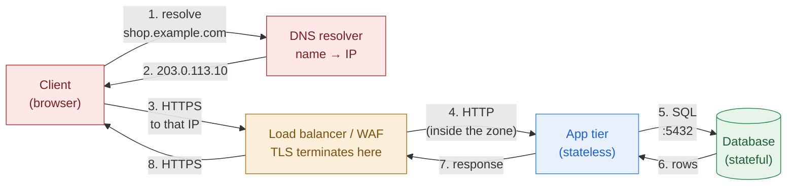
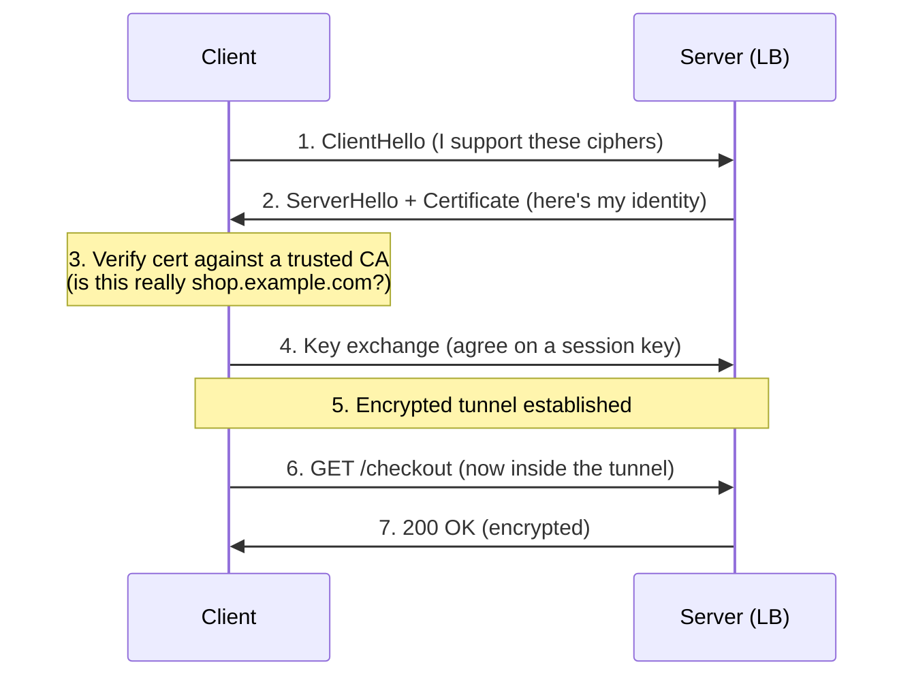
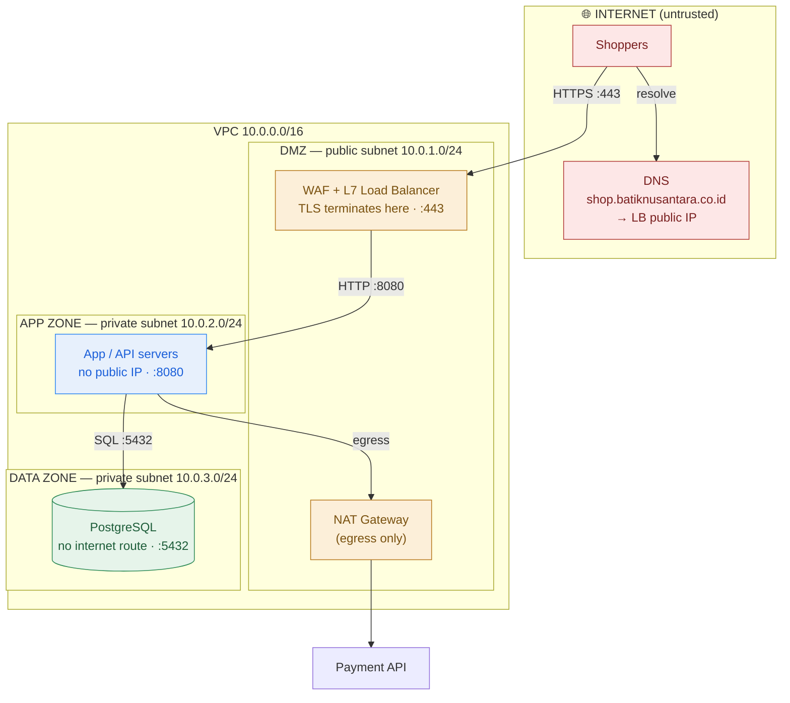

# Networking Mental Models

> Every architecture is boxes and arrows. If you can't defend the *arrows* — how they connect, how fast, and who is allowed through — you're drawing pictures, not designs.

**Type:** Learn
**Track:** AI, Data & Infrastructure Solution Architect (Presales)
**Prerequisites:** [0.2 Linux You Can Read](../../02-linux-you-can-read/docs/en.md)
**Time:** ~4h
**Lab:** trace a request with `curl -v` / browser devtools
**Ship It:** Annotated network diagram

## The Problem

You're on a whiteboard in front of a retail customer's architecture review board. You've drawn three neat boxes — *web*, *app*, *database* — with arrows between them, and you're feeling good. Then the customer's security lead leans forward and asks four questions in a row: *"Where does TLS terminate? What's the public DNS name and who resolves it? Which of those boxes can reach the internet outbound? And is that a Layer 4 or Layer 7 load balancer, because our WAF rules depend on it."* You don't have answers. The room goes quiet. The deal doesn't die in that meeting, but your credibility does — and the incumbent vendor in the corner is smiling.

Every solution you will ever architect — a private cloud, a data lakehouse, an AI inference platform — is ultimately **boxes connected by arrows over a network**. The boxes are the easy part; anyone can name "web server" and "database." The **arrows** are where architecture actually lives: an arrow implies a route, a port, a protocol, a latency budget, an encryption boundary, and a firewall rule that someone must approve. An SA who can't reason about the arrows ships designs that don't connect (the app can't reach the DB across zones), that are slow (a request crosses regions three times), or that fail security review (no zones, plaintext traffic, database wide open to the internet).

You do **not** need to configure a router, subnet a network by hand, or memorize the OSI seven layers to be a great architect. You need enough of a mental model to *draw and defend* a network design: to place a security boundary in the right spot, to say where TLS begins and ends, to name the DNS record a customer will type, to pick L4 vs L7 load balancing on purpose, and to remember that traffic goes *out* as well as *in*. This lesson installs that model, then makes you watch a single web request walk down the entire stack — DNS → TCP → TLS → HTTP — with your own eyes.

## The Concept

Networking has a hundred protocols and a thousand acronyms. An architect needs roughly eight ideas. We'll build them in the order a request actually uses them.

### 1. The layered model — everything is a stack

Network people say "Layer 3" and "Layer 7" constantly. They're referring to the **TCP/IP model**: each layer does one job and hands off to the next, so you can reason about one concern at a time. You don't implement these layers — you *locate* problems in them.

```
LAYER            WHAT IT DOES                     THE UNIT      "WHERE IT BREAKS"
──────────────────────────────────────────────────────────────────────────────
Application  ██  HTTP, TLS, DNS, gRPC             message       wrong URL, cert error, 500
                 → what your app speaks
Transport    ██  TCP (reliable) / UDP (fast)      segment       port closed, connection reset
                 → ports, connections, delivery   (port 443)
Internet     ██  IP addressing + routing          packet        no route, wrong subnet, dropped
                 → "which machine, which network" (10.0.2.9)
Link         ██  the physical/virtual wire        frame         cable, NIC, VLAN misconfig
──────────────────────────────────────────────────────────────────────────────
                 An architect lives at the TOP two layers.
                 "L4" = Transport (IP + port). "L7" = Application (HTTP/URL).
```

The two labels you must own: **L4 = Transport** (an IP address plus a port, e.g. `10.0.2.9:443` — no idea what's inside) and **L7 = Application** (the HTTP request itself — it can read the URL, headers, and hostname). Almost every "L4 vs L7" argument in the rest of your career reduces to *"does this box need to read the contents, or just forward the connection?"*

### 2. DNS — turning names into addresses

Humans type `shop.example.com`; machines route to `203.0.113.10`. **DNS (Domain Name System)** is the distributed phone book that translates one to the other, and it's the *first* thing that happens on every request — before a single byte of your app's traffic moves.

| Record | Answers the question | Example |
|--------|----------------------|---------|
| **A / AAAA** | "What IPv4 / IPv6 address is this name?" | `shop.example.com → 203.0.113.10` |
| **CNAME** | "This name is an alias for another name" | `shop → lb-1234.elb.aws.com` |
| **MX** | "Where does email for this domain go?" | mail servers |
| **TXT** | "Arbitrary metadata" (domain verification, SPF) | `v=spf1 ...` |
| **NS** | "Which servers are authoritative for this zone?" | delegation |

Two architect-level facts. First, **DNS has a TTL (time-to-live)** — a cache duration. Set it low (60s) before a migration so clients pick up the new IP quickly; set it high (24h) normally to reduce lookups. Forgetting to lower TTL *before* a cutover is a classic migration outage. Second, DNS is a control point: **weighted, latency-based, or geo DNS** is how you do global load balancing and blue/green cutovers — you change who the name resolves to.

### 3. The request path — one arrow, unpacked

Put DNS, load balancing, and the tiers together and a single browser request looks like this:



Notice what the colours are already telling you: the client and DNS live in the **hostile public internet** (red), the load balancer sits at a **guarded edge** (amber), the app is in a **private zone** (blue), and the database is in the **most protected zone** (green) and *never* talks to the client directly. That colour story is the security design — we make it explicit in step 6.

### 4. HTTP → HTTPS: the TLS handshake

Plain **HTTP** sends everything in the clear — anyone on the path reads passwords and card numbers. **HTTPS is HTTP inside a TLS tunnel**: before any HTTP flows, client and server do a **TLS handshake** that proves the server's identity (via a certificate) and agrees on encryption keys.



Three things an architect must be able to say out loud:

- **The certificate proves identity.** It's issued by a **Certificate Authority (CA)** the client already trusts, and it's bound to the DNS name. A mismatched or expired cert is the single most common "the site is down" incident — and it's a *networking/DNS* problem, not an app bug.
- **TLS terminates somewhere specific.** "Termination" = where the tunnel is decrypted. Terminate at the **load balancer / WAF** so it can inspect and route (common), or pass encrypted traffic all the way to the app (**end-to-end / re-encryption**) when compliance demands it. *"Where does TLS terminate?"* is a design decision you own, not an accident.
- **mTLS** (mutual TLS) means *both* sides present certs — the pattern behind zero-trust service meshes, where every service proves who it is.

### 5. Load balancing: L4 vs L7

A **load balancer (LB)** spreads traffic across many identical backends so you get scale (add servers) and availability (drop a dead one). The only distinction you must defend is the layer it operates at:

| | **L4 load balancer** | **L7 load balancer** |
|---|----------------------|----------------------|
| Sees | IP + port only (`10.0.2.9:443`) | Full HTTP: URL, headers, cookies, hostname |
| Can route by | connection, source IP | path (`/api` vs `/img`), host, header |
| Can do TLS termination | no (passes it through) | yes (reads the request) |
| Can host a **WAF** | no | **yes** — a Web Application Firewall inspects HTTP for attacks |
| Latency / cost | lower, simpler | slightly higher, far more flexible |
| Typical names | AWS NLB, HAProxy (TCP mode), IPVS | AWS ALB, Nginx, Envoy, F5, Cloudflare |

The rule of thumb: **use L7 at the edge** (you want TLS termination, path routing, and a WAF for the public internet) and **L4 deeper inside** when you just need raw throughput to spread TCP connections. Conflating the two — putting a WAF requirement on an L4 device, or paying L7 overhead for internal database traffic — is a giveaway that the architect doesn't understand their own diagram.

### 6. Firewalls, security groups & security zones

A **firewall** allows or denies traffic by rule (source, destination, port, protocol). In the cloud the per-resource version is called a **security group** — a default-deny allowlist attached to each VM/service ("allow 443 from the LB; allow 5432 only from the app tier"). But the *architecture* isn't the rules; it's the **zones** the rules create. You group resources by trust level and only allow traffic to step **one zone inward**:

```
   INTERNET (untrusted)                                    Anyone, anywhere
        │  :443 only
        ▼
 ┌───────────────────────────── DMZ / EDGE ZONE ─────────────────────────────┐
 │   WAF + L7 Load Balancer         [ public subnet — has a public IP ]       │
 │   • TLS terminates here  • only :443 inbound from internet                 │
 └──────────────────────────────────┬────────────────────────────────────────┘
        │  allow :8080 from DMZ only  │
        ▼                             ▼
 ┌───────────────────────────── APP ZONE (private) ──────────────────────────┐
 │   App / API servers              [ private subnet — NO public IP ]         │
 │   • only reachable from the LB   • outbound to internet via NAT only       │
 └──────────────────────────────────┬────────────────────────────────────────┘
        │  allow :5432 from APP only  │
        ▼                             ▼
 ┌───────────────────────────── DATA ZONE (private) ─────────────────────────┐
 │   Database / storage             [ private subnet — NO public IP,         │
 │   • only reachable from App zone   NO internet route at all ]              │
 └────────────────────────────────────────────────────────────────────────────┘

   Rule of the zones: traffic may cross ONE boundary inward, on ONE port.
   The database can never be reached from the internet — not even in one hop.
```

This "layered inward" pattern — **DMZ → app → data**, each more trusted and less reachable than the last — is the backbone of every enterprise network design, on-prem or cloud. When a security reviewer scans your diagram, this is the *first* thing they look for. No zones = automatic rejection.

### 7. Subnets & CIDR — at a reading level

You will *read* addresses like `10.0.1.0/24` on every cloud diagram; you rarely have to *design* them. Here's the whole reading model:

- A **subnet** is a slice of a private network — a room in the building. Resources in the same subnet talk freely; crossing subnets goes through routing + firewall rules.
- **CIDR notation** `10.0.0.0/16` means "an address block." The **/number is how many bits are fixed** — a bigger number is a *smaller* block. `/16` ≈ 65,000 addresses (a whole VPC), `/24` ≈ 256 addresses (one subnet), `/32` = a single host.
- **Private ranges** (`10.x`, `172.16–31.x`, `192.168.x`) are internal-only; they never appear on the public internet. Seeing `10.0.x.x` on a diagram instantly tells you "this is inside, private."
- The pattern you'll see 90% of the time: one **VPC** `10.0.0.0/16`, split into **public subnets** (have a route to the internet) and **private subnets** (don't), often duplicated across two or three availability zones for resilience.

That's enough. If someone hands you `10.0.2.0/24`, you can say "a ~250-host private subnet" and move on.

### 8. Egress, NAT & private connectivity

Architects obsess over traffic coming *in* and forget traffic going *out*. But your private app servers still need to fetch OS patches, call a payment API, or pull a container image — that's **egress** (outbound). Since they have no public IP, they route outbound through a **NAT gateway**: a one-way door that lets internal hosts reach the internet but blocks the internet from reaching *in*. Forgetting egress is why a "finished" design mysteriously can't download updates.

The other half is connecting *two private networks* without touching the public internet:

- **VPN (site-to-site)** — an encrypted tunnel over the public internet joining your office/data-center network to your cloud VPC. Cheap, quick, but rides the public internet (variable latency).
- **Dedicated private link** — a physical/private circuit (AWS **Direct Connect**, Azure **ExpressRoute**, GCP **Interconnect**): predictable latency and bandwidth, for hybrid or heavy data transfer. More expensive, weeks to provision.
- **VPC peering / PrivateLink** — connect two cloud networks (or reach a SaaS/managed service) over the provider's backbone so traffic never hits the internet at all.

When a customer says *"our data cannot traverse the public internet"* — a common regulatory line — you reach for one of these, and knowing which one (and its cost/lead-time) is the difference between a credible answer and hand-waving.

### Lab: Trace a Real Request (DNS → TCP → TLS → HTTP)

Don't take the request path on faith — watch it. `curl -v` narrates every layer we just described. Run this on any machine with `curl`:

```bash
curl -v https://example.com -o /dev/null
```

Read the output against the stack. You'll see, in order:

```
*   Trying 93.184.216.34:443...          ← DNS already resolved the name to an IP (step 2)
* Connected to example.com (...) port 443 ← TCP handshake done: Transport layer up (L4)
* ALPN: offers h2
* TLSv1.3 (OUT), TLS handshake, ClientHello   ← the TLS handshake begins (step 4)
* TLSv1.3 (IN),  TLS handshake, Certificate    ← server presents its certificate
* SSL certificate verify ok.                    ← the cert chained to a trusted CA
* using HTTP/2
> GET / HTTP/2                             ← only NOW does HTTP flow — inside the tunnel
> Host: example.com
< HTTP/2 200                              ← the application-layer response (L7)
```

Then prove DNS is a separate step by resolving the name yourself:

```bash
# Just the name → address lookup (the phone-book lookup, no app traffic)
nslookup example.com        # or:  dig +short example.com
```

Now open your **browser devtools → Network tab**, reload any HTTPS site, and click the first request. Expand **Timing**: you'll see the exact same phases broken out as *DNS Lookup → Initial connection → SSL → Waiting (TTFB) → Content Download*. That is DNS → TCP → TLS → HTTP, measured in milliseconds, on a real page. You now have the whole request path in front of you — and a latency budget you can point at when a customer asks "why is it slow?"

## Design It

Let's turn the model into a deliverable. Scenario: **Batik Nusantara**, an Indonesian retailer, is launching a customer web portal (`shop.batiknusantara.co.id`). Public shoppers browse and check out; the app is a stateless web/API tier; orders and customers live in a managed PostgreSQL database. The security team requires TLS in transit and *"the database must never be reachable from the internet."* Produce an annotated network diagram, one decision at a time.

### Step 1: Name the actors and the flows

List every box and every arrow *before* drawing. Boxes: shoppers (internet), DNS, WAF+LB, app servers, database, plus an egress path for patching. Flows: shopper→LB (HTTPS 443), LB→app (HTTP 8080), app→DB (SQL 5432), app→internet (egress, e.g. payment API). Naming the flows now stops you from drawing an arrow you can't justify later.

### Step 2: Draw the zones

Apply the DMZ → app → data model. **DMZ (public subnet):** the WAF + L7 load balancer — the *only* thing with a public IP. **App zone (private subnet):** the app/API servers — no public IP. **Data zone (private subnet):** PostgreSQL — no public IP and *no internet route at all*. This satisfies the "database not reachable from the internet" requirement structurally, not just by a firewall rule.

### Step 3: Place DNS and TLS termination

The DNS record `shop.batiknusantara.co.id` (an A record, or a CNAME to the LB's hostname) resolves to the **load balancer's public IP** — never to an app or DB. **TLS terminates at the WAF/LB** so it can run WAF rules and route by path; traffic from LB to app rides the private zone. Label both on the diagram — these are the two questions the security lead asked in *The Problem*.

### Step 4: Choose load-balancer types on purpose

At the edge, an **L7 load balancer** (so we get TLS termination + WAF + path routing for `/api` vs static assets). Internal app→DB traffic needs no LB. Annotate the edge box "L7 (WAF + TLS)" so no one mistakes it for an L4 pass-through.

### Step 5: Lock down egress and resilience

App servers reach the payment API outbound through a **NAT gateway** (one-way door); the database has no egress at all. Spread the subnets across **two availability zones** so one zone failing doesn't take the portal down. The finished, defensible diagram:



Every arrow is now justified, every box sits in a zone, TLS and DNS are labelled, the LB type is explicit, and egress is handled. That is a diagram you can *defend*, not just present.

## Compare It

The concepts above are universal; the **words change** between cloud and on-prem, and part of your job is speaking both dialects in one proposal (hybrid deals are the norm). Same idea, different vendor noun:

| Concept | Cloud (AWS example) | On-prem / traditional | When the distinction matters in a proposal |
|---------|---------------------|------------------------|--------------------------------------------|
| Network boundary | **VPC** | Physical LAN + **VLANs** | Cloud VPCs are software-defined and instant; VLANs need switch config and a network team's change window. |
| Subnet segmentation | **Subnet** (public/private) | **VLAN** / IP subnet | Same reading model; on-prem, crossing VLANs may mean a firewall appliance in the path. |
| Per-host firewall | **Security group** (stateful, default-deny) | Host firewall + **hardware firewall** (Palo Alto, Fortinet) | Cloud SGs are free and per-resource; a physical NGFW is a capex line item and a throughput bottleneck to size. |
| Network-wide filtering | **NACL** + firewall | Perimeter **firewall** appliance | On-prem often has one big choke-point firewall; cloud pushes policy to every resource. |
| Load balancer | **ALB (L7) / NLB (L4)** | **F5 BIG-IP**, Citrix, HAProxy | On-prem LBs are licensed hardware/VMs to size and pay for; cloud LBs are pay-per-use — a real TCO difference. |
| Outbound access | **NAT Gateway** | NAT on the firewall / proxy | Cloud NAT gateways bill per-GB — a surprise line item for chatty egress workloads. |
| Global edge / caching | **CloudFront (CDN)** + Route 53 | Hardware caches, GSLB | A **CDN** cuts latency and origin load for global users; often the cheapest performance win in a proposal. |
| Private site-to-site link | **Direct Connect** / VPN | MPLS / leased line / IPsec VPN | Dedicated links have **weeks of lead time and monthly cost** — flag them early or your timeline is fiction. |

Two takeaways for a deal. First, **the architecture diagram is portable, the pricing is not**: the same three-tier zoned design costs almost nothing to draw in a VPC and a six-figure hardware refresh on-prem — so the *diagram* wins the technical review while the *word choice and TCO* win the commercial one. Second, **naming the on-prem equivalent out loud** ("your VLAN becomes a VPC subnet, your F5 becomes an ALB") is how you make a cloud migration feel safe to an infrastructure team that's protective of the gear they know.

## Ship It

This lesson ships two reusable artifacts in [`outputs/`](../outputs/):

- **[`template-annotated-network-diagram.md`](../outputs/template-annotated-network-diagram.md)** — the **Annotated Network Diagram** template: a fill-in Mermaid skeleton for the DMZ → app → data pattern, a colour **legend** (public / edge / app / data), and a **"must-label" checklist** every network diagram has to pass before it leaves your laptop — security zones, TLS termination point, DNS name, LB type (L4/L7), egress path, and CIDR/subnet labels. Paste it into any HLD.
- **[`example-annotated-network-diagram-batik.md`](../outputs/example-annotated-network-diagram-batik.md)** — the template filled in for the Batik Nusantara three-tier portal from *Design It*, with the checklist ticked off and a one-paragraph rationale for each design decision, so the template isn't abstract.

Together they turn "draw a network diagram" from a blank-page problem into a checklist you can hand a colleague — and a diagram that survives a security review.

## Exercises

1. **(Easy)** Run `curl -v https://example.com -o /dev/null` and, from the output alone, point to the exact line where (a) TCP connected, (b) the TLS handshake started, (c) the certificate was verified, and (d) the first HTTP request was sent. In one sentence, explain why the HTTP request appears *after* the certificate line.
2. **(Medium)** Take the Batik Nusantara diagram and add a **second application** — an internal admin portal that must be reachable *only* from the company office, never from the public internet. Redraw the relevant part: which zone does it go in, how do office staff reach it (hint: not the public LB), and what changes about DNS and connectivity? Use `outputs/template-annotated-network-diagram.md` and tick the checklist.
3. **(Hard)** A healthcare customer states: *"Patient data cannot traverse the public internet, and TLS must be end-to-end — no device may decrypt traffic in the middle."* Redesign the three-tier diagram to satisfy both constraints. Explain where TLS now terminates (and why the edge WAF's job changes), and pick the private-connectivity primitive (VPN / Direct Connect / PrivateLink) you'd propose for the hospital's on-prem systems to reach the app — justify it against latency and lead-time. Combine this with the security-zone thinking from this lesson and defend any deviation from the standard "terminate at the LB" pattern.

## Key Terms

| Term | What people say | What it actually means |
|------|-----------------|------------------------|
| L4 vs L7 | "Both just balance load" | L4 forwards an IP+port connection blind; L7 reads the HTTP request (URL, host, headers) so it can route by path, terminate TLS, and host a WAF. The choice decides what the box *can* do. |
| TLS termination | "The site uses HTTPS" | The specific place where the encrypted tunnel is decrypted — usually the load balancer/WAF. A design decision you own; "where does TLS terminate?" has one correct answer per architecture. |
| DNS | "The internet address" | A distributed name→IP lookup that runs *first*, before any app traffic, with a cacheable TTL. It's also a control point for migrations and global load balancing. |
| Security group | "A firewall rule" | A stateful, default-deny allowlist attached to a cloud resource. The *rules* aren't the design — the **zones** they create (DMZ→app→data) are. |
| DMZ | "The public part" | A guarded edge zone where internet-facing things (WAF, LB) live, isolated from the private app and data zones so a breach at the edge can't reach the database. |
| Egress / NAT | "Internet access" | *Outbound* traffic from private hosts (patches, API calls) via a one-way NAT gateway. Forgetting it is why "finished" designs can't reach the outside. |
| CIDR / subnet | "The IP range" | `10.0.1.0/24` = a private address block; bigger /number = smaller block. You read these off diagrams far more than you design them. |
| Private connectivity | "A VPN to the cloud" | A family — site-to-site VPN (cheap, over internet), Direct Connect/ExpressRoute (dedicated, weeks of lead time), PrivateLink/peering (provider backbone). Picking the right one answers "no public internet" requirements. |

## Further Reading

- [Cloudflare Learning: *What is DNS?* and *What happens in a TLS handshake?*](https://www.cloudflare.com/learning/) — the clearest vendor-neutral explainers of the two protocols every request depends on; 10 minutes each and you can whiteboard them.
- [AWS: *VPC and subnet basics*](https://docs.aws.amazon.com/vpc/latest/userguide/how-it-works.html) — the canonical mental model for cloud networking (VPC, subnets, route tables, NAT, security groups); read it once and the Azure/GCP equivalents map straight across.
- [Mozilla Developer Network: *Populating the page — how browsers work*](https://developer.mozilla.org/en-US/docs/Web/Performance/How_browsers_work) — what your devtools Network tab is actually showing, layer by layer, so you can read a waterfall and defend a latency budget.
- [OWASP: *Web Application Firewall*](https://owasp.org/www-community/Web_Application_Firewall) — what a WAF at the L7 edge does and doesn't protect against, so you can place one credibly in a security review.
