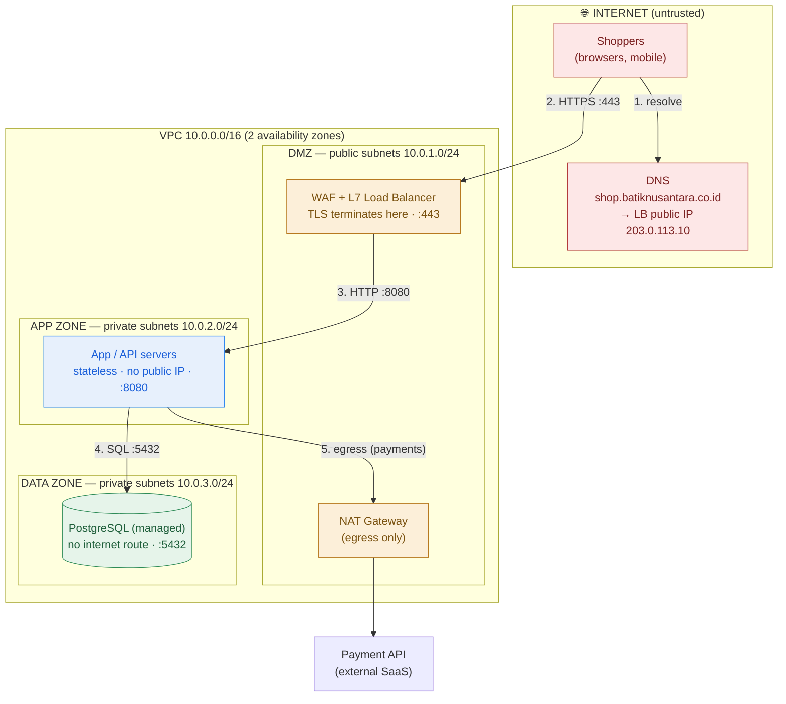

# Annotated Network Diagram — Batik Nusantara Customer Portal (Worked Example)

> **Customer:** Batik Nusantara, an Indonesian retailer launching an online customer portal.
> **Ask:** public shoppers browse and check out; stateless web/API tier; managed PostgreSQL for orders and customers.
> **Security requirements:** TLS in transit; *"the database must never be reachable from the internet."*

This is [`template-annotated-network-diagram.md`](./template-annotated-network-diagram.md) filled in, with the checklist ticked and a one-line rationale per decision.

---

## The diagram

**Legend:** 🔴 Internet (untrusted) · 🟠 DMZ/edge (guarded) · 🔵 App zone (private) · 🟢 Data zone (most protected). Every arrow is `protocol :port`, crossing one zone inward.

## Checklist — all ticked

- [x] **Security zones** — DMZ → app → data, three private subnets, trust increasing inward.
- [x] **TLS termination** — at the WAF/L7 LB (`:443`), so WAF rules and path routing can run.
- [x] **DNS name** — `shop.batiknusantara.co.id` → the LB's public IP `203.0.113.10` (an A record; a CNAME to the LB hostname also works).
- [x] **LB type** — **L7** (HTTP-aware) to get TLS termination + WAF + `/api` vs static path routing.
- [x] **Arrows labelled** — HTTPS :443, HTTP :8080, SQL :5432, egress each shown.
- [x] **Egress** — app tier reaches the payment API outbound via NAT gateway; DB has no egress.
- [x] **CIDR / subnets** — VPC `10.0.0.0/16`; public `/24`, app `/24`, data `/24`.
- [x] **Public-IP inventory** — only the WAF/LB (and NAT) have public IPs; app and DB have none.
- [x] **Resilience** — subnets duplicated across 2 availability zones; the LB spreads traffic across app servers in both.
- [x] **Private connectivity** — not needed for v1 (no on-prem systems in scope); noted for the record.

## Design rationale (one line each)

1. **DNS → LB, never to app/DB.** The public name resolves only to the edge; internal hosts are unaddressable from the internet, which is the structural half of the "DB not reachable" requirement.
2. **TLS terminates at the WAF/LB** so it can inspect HTTP for attacks and route by path; LB→app traffic stays inside the private VPC. (If Batik later needs card-data compliance, we'd re-encrypt LB→app — see the healthcare variant in the lesson's hard exercise.)
3. **L7 at the edge, no LB internally.** The WAF is only meaningful on an HTTP-aware (L7) device; app→DB is a single direct connection, no balancer needed.
4. **Database in a private subnet with no internet route** and a security group allowing `:5432` *only* from the app tier — so it's unreachable from the internet even in one hop. This is the requirement met by *architecture*, not just a firewall rule.
5. **Egress via NAT.** App servers fetch OS patches and call the payment API outbound through a one-way NAT gateway; nothing on the internet can initiate a connection inward.
6. **Two availability zones** so a single zone failure doesn't take the portal down — cheap insurance the customer's ops team will expect to see.

## What this buys you in the room

When the security lead asks the four questions from the lesson — *where does TLS terminate, what's the DNS name and who resolves it, which boxes have egress, is this L4 or L7* — every answer is already **on the diagram**. That is the difference between presenting a picture and defending a design.
