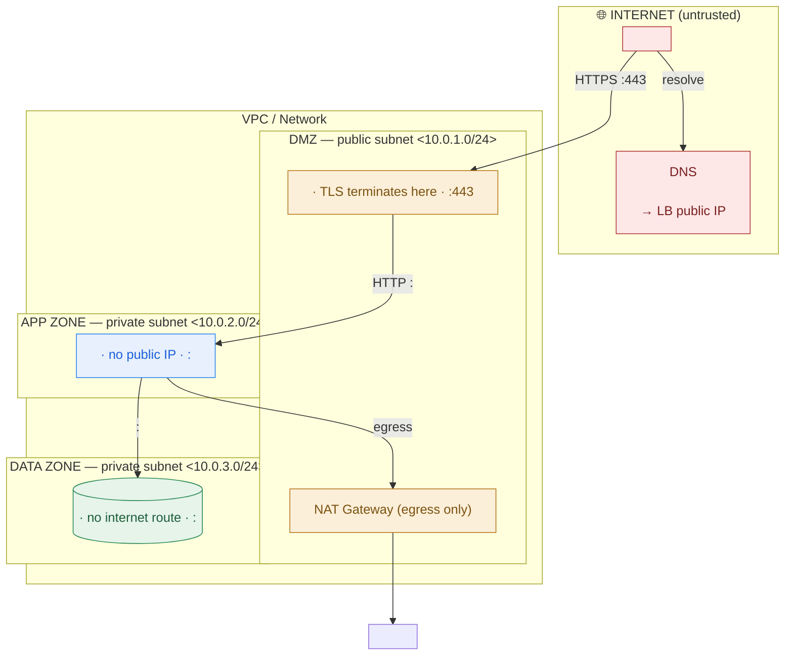

# Annotated Network Diagram — Template

> Use this for any internet-facing (or internal) application before it goes into an HLD or a whiteboard review. Fill the skeleton, keep the legend, and **do not ship the diagram until every box in the checklist is ticked.** A diagram that fails the checklist fails a security review.

---

## 1. Fill-in Mermaid skeleton (DMZ → app → data)

Replace every `<...>` and delete tiers you don't have. Keep the four colour classes so zones read at a glance.

## 2. Legend (paste under every diagram)

| Colour | Zone | Trust level | What lives here |
|--------|------|-------------|-----------------|
| 🔴 Red | **Internet** | Untrusted | Users, DNS, anything you don't control |
| 🟠 Amber | **DMZ / edge** | Guarded | WAF, load balancer, NAT — the only things with a public IP |
| 🔵 Blue | **App zone** (private) | Trusted | Stateless app/API servers — no public IP; egress via NAT |
| 🟢 Green | **Data zone** (private) | Most protected | Databases/storage — no public IP, no internet route at all |

**Arrow convention:** every arrow is labelled `<protocol> :<port>` and points *one zone inward*. If you can't label an arrow's protocol and port, you don't understand it yet — don't draw it.

## 3. The "must-label" checklist

A network diagram is not done until all of these are visible **on the diagram itself** (not just in your head):

- [ ] **Security zones** drawn as boundaries (DMZ → app → data), each more trusted than the last.
- [ ] **TLS termination point** labelled — exactly where the encrypted tunnel is decrypted (edge LB, or end-to-end to the app).
- [ ] **DNS name** shown, and what it resolves to (the LB's public IP — never an app or DB).
- [ ] **Load-balancer type** stated: **L4** (IP+port) or **L7** (HTTP-aware, can host a WAF).
- [ ] **Every arrow** carries a protocol + port, and crosses only one boundary inward.
- [ ] **Egress path** shown — how private tiers reach the internet outbound (NAT gateway), or that they can't.
- [ ] **CIDR / subnet** labels on the VPC and each subnet (reading-level is fine, e.g. `10.0.2.0/24`).
- [ ] **Public-IP inventory:** it's obvious which boxes have a public IP (should be *only* the edge). The database must have **none**.
- [ ] **Availability/resilience** noted if relevant (subnets spread across ≥2 availability zones).
- [ ] **Private connectivity** primitive named if the design touches on-prem/other networks (VPN / Direct Connect / PrivateLink) with its lead-time flagged.

## 4. Two-line design rationale (fill in)

- **TLS terminates at `<...>` because `<inspect+route at edge / compliance requires end-to-end>`.**
- **The `<database>` is unreachable from the internet because it sits in a private subnet with `<no internet route + a security group allowing only the app tier on :port>`.**
