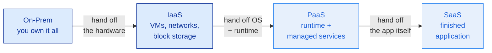
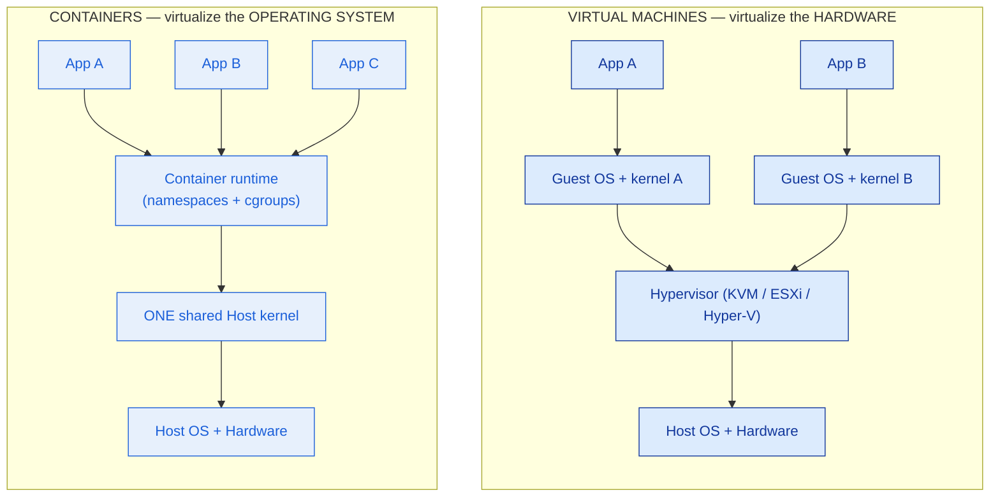

# Cloud & Virtualization Literacy

> "The cloud" isn't a place you rent — it's a line you draw. Draw it in the wrong spot and the customer pays for control they didn't want, or owns risk they can't carry.

**Type:** Learn
**Track:** AI, Data & Infrastructure Solution Architect (Presales)
**Prerequisites:** [0.3 Networking Mental Models](../../03-networking-mental-models/docs/en.md)
**Time:** ~4h
**Lab:** spin one free-tier VM (or local `multipass` / Docker)
**Ship It:** Cloud-concepts one-pager

## The Problem

You are in a scoping call for a mid-size omnichannel retailer. The CTO says, "We want to move to the cloud, keep it highly available, and stop overspending." Then the room fills with the sentences that quietly wreck deals. The infra lead says "cloud means we lose control of our data." A developer says "we'll just containerize everything, containers are basically lightweight VMs." A sales engineer promises "fully redundant, highly available" while sketching a single box in a single data hall. Every one of those is a placement error waiting to become a cost overrun or an outage — and as the solution architect, you are the only person in the room whose job is to catch them before they reach the proposal.

The SA's actual work here is **placement**. Each workload — the storefront, the orders database, the product images, the nightly analytics — has to land on the right rung of the service ladder (IaaS, PaaS, or SaaS), inside the right deployment model (public, private, hybrid), spread across the right number of availability zones, and packaged in the right unit (VM or container). Mis-place one component and the damage is concrete: a customer who runs a managed-worthy database on raw VMs pays for a team of DBAs they didn't need; a "highly available" design that lives in one availability zone fails the first time that zone loses power; a stateless web tier stuffed into fat VMs costs three times what containers would during a flash sale.

This lesson is the vocabulary and the reasoning that let you place workloads with confidence and defend every choice. You will not operate a cloud — you'll spin exactly one VM in the lab to feel the seam between "your problem" and "the provider's problem," and spend the rest of your time doing what an architect does: deciding where each box goes and why. Get this right and the four confusions above dissolve into four crisp answers you can give at the whiteboard.

## The Concept

Four ideas carry the whole field: **who owns which layer** (service models), **who is liable for what** (shared responsibility), **whose building it runs in** (deployment models), and **where "highly available" actually comes from** (regions and availability zones). Then one unit-of-compute decision — VM vs container — sits underneath all of them.

### 1. Service models are a responsibility line, not a product catalog

IaaS, PaaS, and SaaS are not three things you buy. They are three places to draw *one line* — the line between what you manage and what the provider manages. As you move from on-prem to SaaS, you hand off more layers and keep less control (and fewer bills, and fewer 3 a.m. pages).



Read the same line as a stack, where `█` = "you manage" and `·` = "provider manages":

```
LAYER                On-Prem   IaaS      PaaS      SaaS
──────────────────────────────────────────────────────────
Data & access          █         █         █         █*   ← ALWAYS yours
Application code        █         █         █         ·
Runtime / libraries     █         █         ·         ·
Operating system        █         █         ·         ·
Virtualization / host   █         ·         ·         ·
Physical servers        █         ·         ·         ·
Storage                 █         ·         ·         ·
Networking              █         ·         ·         ·
Physical datacenter     █         ·         ·         ·
──────────────────────────────────────────────────────────
you...                own it   rent VMs   push code  log in
who patches the OS?    you       you       provider  provider
who scales it?         you       you       provider  provider
what you pay for       capex    instances  requests  seats
```

Two things fall out of this table that a customer will test you on. First, **`Data & access` never fully leaves you** — even in SaaS you still own your data classification, your user accounts, and who can see what (that's the `*`). Second, **the OS line is the tell**: if you still patch the operating system, you're at IaaS; if the provider patches it, you're at PaaS or above. That single question — *"who owns OS patching?"* — resolves 90% of "is this IaaS or PaaS?" arguments on the spot.

### 2. Shared responsibility — the line, drawn as liability

The responsibility line has a name once money and breaches are involved: the **shared-responsibility model**. Providers frame it as security *of* the cloud vs security *in* the cloud.

```
        ┌──────────────────────────────────────────────┐
        │  SECURITY *IN* THE CLOUD   →  THE CUSTOMER    │
        │  · your data & its classification            │
        │  · identity, accounts, permissions (IAM)     │
        │  · app config, secrets, network rules you set│
        │  · patching what YOU run (OS on IaaS)        │
        ├──────────────────────────────────────────────┤
        │  SECURITY *OF* THE CLOUD   →  THE PROVIDER    │
        │  · physical datacenter, power, cooling       │
        │  · host hypervisor & the virtualization layer│
        │  · the managed service's own uptime & patching│
        └──────────────────────────────────────────────┘
             The line MOVES UP as you go IaaS → PaaS → SaaS.
             At SaaS the customer keeps only the top box.
```

The line **moves with the service model**: at IaaS the customer still patches guest OSes and configures the firewall; at SaaS almost everything drops to the provider except data, identity, and configuration. The classic breach headline — "misconfigured storage bucket leaks 5M records" — is nearly always a customer-side failure: the provider secured the datacenter perfectly; the customer left the bucket public. As an SA you draw this line explicitly in every design, because the customer's security team will ask "who owns what?" and the wrong answer loses trust faster than any pricing number.

### 3. Deployment models answer "whose building?"

Orthogonal to *what you manage* (service model) is *where it physically lives and who may use it* (deployment model). These are independent axes — you can run IaaS in a public cloud or IaaS in your own private cloud.

| Model | Who owns the hardware | Who can use it | Why a customer picks it |
|-------|----------------------|----------------|-------------------------|
| **Public** | A hyperscaler (AWS, Azure, GCP) or regional provider | Anyone with an account | Elastic, opex, no datacenter to run; fastest to start |
| **Private** | You / your org (in your DC or a colo) | Your org only | Data residency, regulatory control, sunk hardware, special GPUs/appliances. Built on VMware, OpenStack, or Proxmox — one of several options, not a single product |
| **Hybrid** | Both, connected | Burst / split by workload | Keep regulated or steady-state on-prem, burst spiky or new workloads to public |
| **Multi-cloud** | Two+ public providers | Your org, spread deliberately | Avoid lock-in, use each provider's best service, meet region coverage |

"Cloud = public cloud" is the single most common misconception, and it's wrong: **cloud is a model (self-service, elastic, pooled, metered), not an address.** A bank running its own OpenStack cluster on hardware it owns is absolutely doing cloud — private cloud. The reasons to go private or hybrid are almost always *data residency, cost at steady-state scale, or specialized hardware*, not technophobia. Naming the real driver is how you keep a discovery call honest.

### 4. Regions, availability zones, and where HA actually comes from

This is the concept most often sold wrong. A **region** is a geographic area (e.g., "Southeast Asia"). Inside a region are **availability zones (AZs)** — physically separate datacenters with independent power, cooling, and networking, close enough for fast synchronous replication but far enough that one failing doesn't take the others.

```
REGION  (e.g., ap-southeast)
┌───────────────────────────────────────────────────────────┐
│                                                           │
│   AZ-A                          AZ-B                       │
│  ┌───────────────┐             ┌───────────────┐          │
│  │ datacenter 1  │  ~ separate │ datacenter 2  │          │
│  │ own power     │  power &    │ own power     │          │
│  │ own cooling   │  network    │ own cooling   │          │
│  │ own network   │◀═══════════▶│ own network   │          │
│  └───────────────┘  low-latency└───────────────┘          │
│         ▲             sync link        ▲                  │
│         │                              │                  │
│         └──────  Load Balancer  ───────┘                  │
│                (spreads traffic                           │
│                 across both AZs)                          │
└───────────────────────────────────────────────────────────┘
    Lose AZ-A entirely  →  AZ-B keeps serving.  THAT is HA.
    Everything in one AZ →  one power event = full outage.
```

The rule an SA lives by: **high availability requires at least two AZs.** A single-AZ deployment can have redundant servers, redundant disks, redundant everything — and still go fully dark when that one building loses power or network. If you have three copies of a server but they're all in AZ-A, you have redundancy, not availability. Selling "highly available" on a single-AZ design is the resilience equivalent of selling a life raft with a hole in it.

Two more altitudes stack on top:

- **Multi-region** protects against a *whole region* failing (rare) or serves users in another geography with low latency. It's more expensive and more complex (data has to replicate across long distances), so it's justified by **DR requirements (RTO/RPO)** or **global latency**, not by default.
- **DR (disaster recovery)** is the plan for when even multi-AZ isn't enough — a backup or replica in another region you can fail over to. You'll size RTO/RPO properly in Phase 2; here, just know multi-AZ ≠ DR. Multi-AZ survives a building; DR survives a region.

### 5. VM vs container — the unit-of-compute decision

Underneath every placement sits one packaging question. VMs and containers both give you isolated compute; they isolate at completely different layers, and the difference decides density, speed, and blast radius.



A **VM** virtualizes hardware: a hypervisor gives each guest a fake CPU, disk, and NIC, and the guest boots its *own* kernel. That's why a VM takes seconds to boot, costs gigabytes of RAM, and packs maybe tens per host — and why a kernel exploit inside one guest stays inside that guest (**strong, hardware-assisted isolation**).

A **container** virtualizes the operating system: Linux **namespaces** give a process its own view of PIDs, network, mounts, and hostname; **cgroups** cap its CPU and memory. There is *no guest kernel* — every container shares the host's. That's why a container starts in milliseconds, costs megabytes, and packs hundreds per host — and why a kernel-level escape is a real (if rare) threat, which is exactly why multi-tenant platforms still run untrusted containers *inside* VMs.

| | Virtual machine | Container |
|--|-----------------|-----------|
| Isolates at | Hardware (own kernel) | OS (shared kernel) |
| Boot time | Seconds | Milliseconds |
| Footprint | GB RAM, tens/host | MB RAM, hundreds/host |
| Isolation | Strong (hypervisor) | Weaker (kernel shared) |
| Best for | Legacy apps, licensed appliances, full-OS workloads, strong tenant isolation | Stateless services, microservices, fast elastic scale, dense packing |

**"A container is a lightweight VM" is the error to kill.** They aren't the same thing made smaller — they cut the stack at different layers. Pick VM when you need a whole OS or hard isolation; pick container when you need density and fast, elastic scale. And the third option you'll reach for most as an architect: **don't run it yourself at all** — use a managed service (PaaS) so the provider owns both the OS and the runtime.

## Design It

Meet **Meridian Retail**, a fictional omnichannel retailer: a web/mobile storefront, a product catalog, a checkout that takes card payments, an orders/inventory database, product images, site search, and a nightly analytics/BI pipeline for merchandisers. Traffic is steady most of the year but spikes 8–10× during quarterly flash sales. They want HA and no overspending. Let's place it.

### Step 1: Inventory the workloads and their traits

Before placing anything, tag each component with the traits that drive placement — is it **stateful**? does it **spike**? is it **differentiating** (worth your engineering) or **undifferentiated heavy lifting** (let the provider run it)?

| Component | Stateful? | Traffic shape | Differentiating? |
|-----------|-----------|---------------|------------------|
| Web/mobile storefront (frontend + API) | No (stateless) | Spiky (flash sales) | Somewhat — it's the brand |
| Product catalog + sessions (cache) | Semi (cache) | Spiky | No |
| Orders & inventory database | **Yes** (durable) | Steady, spikes on sale | No — commodity DB |
| Product images / static assets | Yes (objects) | Read-heavy, spiky | No |
| Site search | Semi (index) | Spiky | No |
| Analytics / BI for merchandisers | Yes (warehouse) | Nightly batch | No |
| Payments | N/A (external) | Follows checkout | No — never build this |

### Step 2: Place each on the responsibility line (the service-model chooser)

Apply one rule per component: **push each workload as far up the ladder (toward SaaS) as its need for control allows** — because every rung you climb is a rung of undifferentiated ops you stop paying for. Only stay lower when data control, licensing, or a genuinely custom need pins you there.

| Component | Placement | Why this rung |
|-----------|-----------|---------------|
| Storefront (frontend + API) | **PaaS** (managed container / app platform) | Stateless + spiky = must autoscale; provider owns OS/runtime so the team ships features, not patches |
| Catalog cache / sessions | **PaaS** (managed cache, e.g., Redis service) | Commodity; running it yourself buys nothing |
| Orders & inventory DB | **PaaS** (managed relational DB) | Durable and critical, but a *commodity* engine — let the provider handle backups, failover, patching. Running it on raw VMs means hiring DBAs to redo what's included |
| Product images / assets | **Managed object storage** | Durable, cheap, multi-AZ by default; front with a CDN |
| Site search | **PaaS** (managed search service) | Undifferentiated; managed index scales with the sale |
| Analytics / BI | **SaaS** BI + **PaaS** warehouse | Merchandisers consume dashboards (SaaS); the warehouse behind it is managed (PaaS). Zero infra to run |
| Payments | **SaaS** (payment gateway) | Never build card handling — buy compliance and liability offload |

Notice the pattern: **almost nothing lands on IaaS.** For a modern retail app, the architect's default is managed-first. IaaS (raw VMs) shows up only when something forces it — a legacy monolith that assumes a full OS, a licensed appliance, or a compliance rule that says "you must control the host."

### Step 3: Pick the deployment model

Meridian has no data-residency mandate and no sunk hardware worth preserving, and they want elasticity for flash sales. That points cleanly at **public cloud** — the elasticity and opex model are exactly what spiky retail needs. If they *were* a bank with a regulator demanding card data on owned hardware, you'd carve that one workload onto a **private cloud** and run **hybrid**. Deployment model is a per-driver decision; here one driver (elastic spikes) dominates, so: single public cloud, single region.

### Step 4: Lay out a 2-AZ region for HA

Now make it survive a datacenter failure. Spread every stateful and stateful-adjacent tier across **two AZs**, and let the managed services do the same.

```
PUBLIC CLOUD — REGION: ap-southeast
┌──────────────────────────────────────────────────────────────────┐
│                      Internet  →  CDN  →  Load Balancer           │
│                                          │  (spreads across AZs)  │
│         ┌────────────────────────────────┴───────────────┐        │
│         ▼                                                ▼        │
│   ┌───────────── AZ-A ─────────────┐   ┌───────────── AZ-B ─────┐ │
│   │  Storefront containers  ×N     │   │ Storefront containers ×N│ │
│   │  Cache node (replica)          │   │ Cache node (replica)    │ │
│   │  Orders DB  ── PRIMARY ─────────┼──▶│ Orders DB ── STANDBY    │ │
│   │                 (sync replicate)│   │  (auto-failover)        │ │
│   └────────────────────────────────┘   └─────────────────────────┘ │
│                                                                    │
│   Object storage (images)  ── REGIONAL, multi-AZ by default ──     │
│   Managed search / BI / payments ── provider handles their own HA ─│
│                                                                    │
│   DR:  nightly cross-REGION backup of DB + objects (survives a     │
│        whole-region loss; RTO/RPO sized in Phase 2)                │
└──────────────────────────────────────────────────────────────────┘
```

The moves that make this HA, spelled out:

1. **Load balancer** health-checks and spreads traffic across storefront containers in *both* AZs. Lose AZ-A, the LB routes everything to AZ-B.
2. **Database** runs a primary in AZ-A with a **synchronous standby** in AZ-B and automatic failover. This is the single most important HA decision — the stateful tier is where single-AZ designs die.
3. **Object storage** is regional (multi-AZ) out of the box — the provider already replicates across AZs; you inherit it for free.
4. **DR** is a separate layer: a cross-*region* backup so a whole-region disaster (rare) is recoverable. Multi-AZ survives a building; this survives the region.

If a stakeholder asks "what if we skip the standby DB to save money?" — that's the moment you point at this diagram: the storefront could be perfectly redundant and the whole site still goes down the first time AZ-A hiccups, because orders can't be written. Single-AZ stateful tier = not HA, full stop.

### Step 5: VM vs container for the compute you do run

Only two tiers here are compute you package yourself (everything else is managed). Apply the decision aid:

- **Storefront (stateless, spiky) → containers.** Milliseconds to start, hundreds per host, scales out and back in for the flash sale. Containers are the obvious win.
- **Hypothetical legacy pricing engine (assumes a full OS, licensed per-VM) → VM.** If Meridian had a monolith that expects to own an OS, or a vendor appliance licensed per virtual machine, it goes on IaaS VMs — a container would fight its assumptions.

Since the legacy engine doesn't exist here, Meridian is **containers-on-PaaS for compute, managed services for everything stateful**. That's the modern default, and you can defend every box.

### Step 6: Sanity-check cost and responsibility

Two quick gut-checks before this becomes a proposal:

- **Cost shape:** managed-first turns capex into opex and lets the flash-sale spike scale containers up and back down — you pay for 10× only during the sale, not 24/7. Running the same on always-on fat VMs would mean provisioning for peak year-round: the classic 3× overspend.
- **Responsibility line:** re-draw the shared-responsibility box for this design. Meridian owns data classification, IAM, app config, and network rules; the provider owns the datacenter, hypervisor, and every managed service's uptime and patching. No OS patching lands on Meridian at all — because nothing landed on IaaS. If that surprises the customer's security team, you've just had the most valuable conversation of the engagement.

## Compare It

The concepts are universal; the *names* differ per vendor. An architect has to translate on the fly, because customers speak in one cloud's dialect. Here are the same primitives across the three hyperscalers:

| Primitive | AWS | Azure | Google Cloud |
|-----------|-----|-------|--------------|
| Virtual machine (IaaS compute) | EC2 | Virtual Machines | Compute Engine |
| Managed relational DB (PaaS) | RDS / Aurora | Azure SQL / DB for PostgreSQL | Cloud SQL / AlloyDB |
| Object storage | S3 | Blob Storage | Cloud Storage |
| Managed containers (PaaS) | ECS / EKS / App Runner | AKS / Container Apps | GKE / Cloud Run |
| Serverless functions | Lambda | Functions | Cloud Functions |
| Virtual network | VPC | VNet | VPC |
| Region / Availability Zone | Region / AZ | Region / Availability Zone | Region / Zone |
| Identity & access | IAM | Entra ID + RBAC | IAM |

The trap: the *word* "zone" isn't identical everywhere, and "an AZ" on one cloud may map to more or fewer physical datacenters than on another — so "3 AZs" is a design intent, not a portable SKU. Confirm the availability construct per provider before you promise a number.

**Virtualization, one layer down.** The hypervisor that makes IaaS VMs possible is itself a product choice. In private cloud and on-prem, the common options are **VMware vSphere/ESXi** (enterprise default, rich tooling, licensed), **KVM** (open-source, the engine under most Linux clouds and under many public clouds), **Proxmox** (KVM packaged for smaller shops), and **Hyper-V** (Microsoft shops). Public clouds run their own tuned hypervisors (often KVM-derived) and you never see them — that's the point of IaaS. When a customer says "we've standardized on VMware," they're telling you about their *private-cloud virtualization layer*, not their service model.

**The next layer up: containers + Kubernetes.** Containers package a workload; **Kubernetes** orchestrates thousands of them across a fleet — scheduling, healing, scaling, networking. It's the standard control plane for container platforms, and every hyperscaler sells a managed flavor (EKS, AKS, GKE). The key altitude point for this lesson: Kubernetes runs *on top of* IaaS — its worker nodes are VMs, its load balancers and volumes are cloud services. "Kubernetes vs cloud" is a category error, like "engine vs chassis"; you'll design real clusters in Phase 2. Here, just know it's the orchestration layer that sits above the VM/container decision you just made.

The "it depends" a customer will push on: *"Should we go multi-cloud to avoid lock-in?"* Usually no, not up front — multi-cloud multiplies your operational surface and rarely pays off until there's a concrete driver (regulatory second-source, a service only one cloud has, an acquisition). Portability has a cost; pay it when there's a reason, not on reflex.

## Ship It

This lesson ships a **Cloud Concepts One-Pager** — the artifact you paste into an HLD or hand a customer's team so everyone shares the same map. It bundles three reusable tools:

1. a **service-model chooser** (place any workload on IaaS/PaaS/SaaS),
2. a **region/AZ HA pattern** (the 2-AZ layout, ready to adapt), and
3. a **VM-vs-container decision aid**.

Find them under [`outputs/`](../outputs/):

- **[`template-cloud-concepts-one-pager.md`](../outputs/template-cloud-concepts-one-pager.md)** — the fill-in-the-blank one-pager: a workload-placement table, the shared-responsibility split, the HA pattern, and the decision aids. Reusable on any deal.
- **[`example-cloud-concepts-one-pager.md`](../outputs/example-cloud-concepts-one-pager.md)** — the same one-pager filled in for Meridian Retail, so the template isn't abstract.

Fill in the template during (or right after) a discovery call and you leave with a shared picture that pre-empts the four confusions from *The Problem*.

## Exercises

1. **(Easy)** Spin one free-tier VM (or `multipass launch` / `docker run -it ubuntu bash` locally). Run `uname -r` inside it and on your host and compare. Then answer in two sentences: which layers of the responsibility stack are now *yours* to manage on this VM, and which belong to the provider (or your laptop's kernel)? Name the exact line where "you" turns into "them."

2. **(Medium)** A regional bank wants a customer-facing loan-application portal but, by regulation, must keep all customer financial data on hardware it physically controls. Place each tier (web frontend, application logic, the sensitive data store, and a public marketing site) across service models *and* deployment models. State where the hybrid boundary falls and why, and draw the shared-responsibility line for the on-prem portion vs the public portion.

3. **(Hard)** Take the Meridian 2-AZ design and extend it two ways. (a) The business now needs to survive a *whole-region* outage with an RTO of 1 hour and RPO of 5 minutes — add a second region and describe what must replicate and how, and where the design gets more expensive. (b) A stakeholder proposes cutting cost by moving the storefront from managed containers (PaaS) to self-run VMs (IaaS). Argue for or against using the responsibility line and the flash-sale traffic shape, and put a rough cost-shape sentence on it. Use `outputs/template-cloud-concepts-one-pager.md` as your worksheet.

## Key Terms

| Term | What people say | What it actually means |
|------|-----------------|------------------------|
| Cloud | "Public cloud / AWS" | A *model* — self-service, elastic, pooled, metered — not an address. Private cloud on your own hardware is still cloud. |
| IaaS | "Renting servers" | Provider manages everything up to virtualization; **you still patch the OS**. The "who patches the OS?" test lands here on *you*. |
| PaaS | "Some managed thing" | Provider owns OS + runtime; you push code/config. Managed databases, container platforms, and functions live here. The architect's default rung. |
| SaaS | "An app we log into" | Finished application; you own only data, identity, and configuration. Payments, BI, email. |
| Shared responsibility | "The provider secures it" | Security *of* the cloud is the provider's; security *in* the cloud (data, IAM, config) is yours. The line moves up as you climb the service ladder. |
| Region | "A data center" | A geographic area containing multiple isolated AZs. Not a single building. |
| Availability Zone (AZ) | "A redundant server" | A physically separate datacenter with independent power/cooling/network. **HA needs ≥2.** |
| High availability | "We have redundancy" | Surviving a failure *domain* — for infra, at least two AZs. Three servers in one AZ is redundancy, not availability. |
| Disaster recovery (DR) | "Backups" | The plan to fail over when even multi-AZ isn't enough — usually another region. Multi-AZ survives a building; DR survives a region. |
| Container | "A lightweight VM" | Host processes isolated by namespaces + cgroups, sharing the **host kernel**. Not a small VM — it cuts the stack at a different layer. |
| Hypervisor | "The VM thing" | The layer (KVM, ESXi, Hyper-V) that virtualizes hardware so each VM boots its own kernel. What a container deliberately lacks. |

## Further Reading

- [NIST SP 800-145, *The NIST Definition of Cloud Computing*](https://csrc.nist.gov/pubs/sp/800/145/final) — the canonical two-page definitions of IaaS/PaaS/SaaS and public/private/hybrid. Read it once and you can win any "is this really cloud?" argument.
- [AWS Shared Responsibility Model](https://aws.amazon.com/compliance/shared-responsibility-model/) — the clearest published version of the "of the cloud vs in the cloud" line, with the exact split per service type. The concept is identical on Azure and GCP.
- [Google Cloud: *Geography and regions*](https://cloud.google.com/docs/geography-and-regions) — a concise, vendor-honest explanation of regions vs zones and why multi-zone is the baseline for availability.
- [Azure Well-Architected Framework — Reliability](https://learn.microsoft.com/en-us/azure/well-architected/reliability/) — how a hyperscaler reasons about availability zones, failure domains, and DR; the SA's mental checklist for "is this actually HA?".
- [Docker: *What is a container?*](https://www.docker.com/resources/what-container/) — the container-vs-VM distinction from the source, with the namespaces/cgroups vs guest-kernel split laid out plainly.
