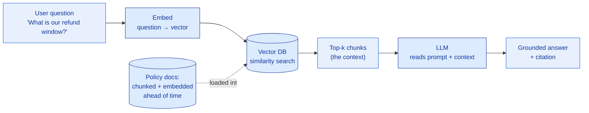
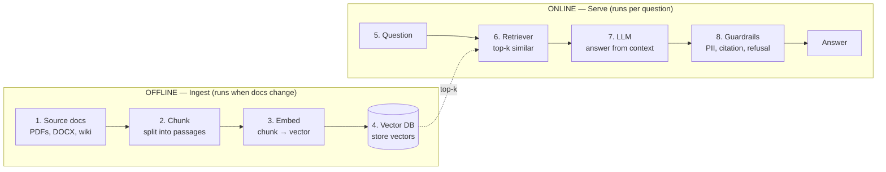

# Data & AI Literacy

> You will never train the model. But if you can't tell an LLM from a database, or RAG from fine-tuning, you'll scope the deal wrong — and lose it in the room before a single line of code is written.

**Type:** Learn
**Track:** AI, Data & Infrastructure Solution Architect (Presales)
**Prerequisites:** [0.4 Cloud & Virtualization Literacy](../../04-cloud-and-virtualization-literacy/docs/en.md)
**Time:** ~4h
**Lab:** query SQLite + make one LLM API call (copy-run; no keys required)
**Ship It:** Data/AI concept map

## The Problem

You are in a discovery call. The customer says, *"We want an AI that answers questions about our 4,000 insurance policy documents — and we'd like 95% accuracy across everything, live in six weeks."* Everyone turns to you. What you say in the next sixty seconds decides whether you look like a trusted advisor or a vendor who over-promises.

Here is how an SA who lacks data-and-AI literacy gets it wrong. They hear "AI" and picture one magic box. They agree to "95% accuracy" without asking *accuracy of what, measured how, against whose ground truth*. They assume the model will simply "know" the customer's policies — treating the **LLM as a database** you can look facts up in, when an LLM is a *text predictor* that knows nothing about this customer at all. They confuse **training** (a months-long, GPU-heavy process that bakes knowledge into a model) with **inference** (asking a finished model a question, which is what actually happens at runtime). They promise "we'll fine-tune it on your documents" when the customer actually needs **retrieval** — and those are different architectures with different cost, timeline, and risk. And nobody asks the one question that sinks most AI projects: **is the data even ready?** Are those 4,000 documents clean, current, and readable, or are they scanned PDFs, duplicated across three SharePoints, and half of them superseded?

This lesson is *not* about building models — that's Phase 5, at engineering altitude. It's about **architect altitude**: knowing enough data and AI vocabulary to scope a deal honestly, size it roughly, and defend the design to both a CTO and a CFO. By the end you'll read a data-and-AI stack the way you already read a network diagram, you'll turn "chat with our documents" into a labeled component picture, and you'll never again nod along to "95% accuracy on everything in six weeks" without knowing exactly which words in that sentence are lies.

## The Concept

Two layers stack under every "AI" deal: the **data layer** (where the facts live, in formats and stores) and the **AI layer** (the models that read and generate text). An SA has to speak both, because an AI project is 80% a data project wearing a trench coat.

### 1. Data formats — the envelopes everything travels in

Before data sits in a database, it travels as text in a **format**. Two show up in every architecture conversation:

- **JSON** (JavaScript Object Notation) — how APIs and apps exchange data. Curly braces, key/value pairs, nesting. Every LLM API request and response is JSON. If you can read JSON, you can read what any two systems are saying to each other.
- **YAML** (YAML Ain't Markup Language) — how *configuration* is written (Kubernetes manifests, CI pipelines, infra-as-code). Indentation instead of braces. Same idea as JSON, tuned for humans to edit.

```
JSON  (data on the wire)              YAML  (config for humans)
{                                     policy:
  "policy_id": "P-1041",               id: P-1041
  "holder": "Sentinel Mutual",         holder: Sentinel Mutual
  "refund_window_days": 30,            refund_window_days: 30
  "active": true                       active: true
}
```

You don't write these; you *recognize* them. When a customer says "we'll expose it over an API," they mean "we'll send and receive JSON." When an engineer says "it's all in the YAML," they mean the config, not the data.

### 2. Where data lives — SQL vs NoSQL, OLTP vs OLAP

Data at rest lives in a **database**. Two axes matter at reading level.

**SQL vs NoSQL** — the shape of the data:

- **SQL / relational** (Postgres, MySQL, SQL Server) — data in **tables** with fixed columns and enforced relationships. You query it with SQL (`SELECT ... WHERE ...`). Strong consistency, great for anything that must not lose a transaction. The default, and usually the right default.
- **NoSQL** — an umbrella for everything else: **document** stores (MongoDB — flexible JSON-shaped records), **key-value** (Redis — fast lookups), **wide-column** (Cassandra — massive scale), and **graph** (Neo4j — relationships). You reach for NoSQL when the data is genuinely un-tabular or the scale/latency demands it — not by default.

**OLTP vs OLAP** — the job the database is doing:

- **OLTP** (Online *Transaction* Processing) — many tiny reads/writes, right now: "record this payment," "book this seat." Optimized for speed on single rows. Postgres running your app.
- **OLAP** (Online *Analytical* Processing) — few huge queries over billions of rows: "revenue by region by quarter for three years." Optimized for scanning columns. This is the warehouse (Snowflake, BigQuery, ClickHouse) — the subject of Phase 4.

The one-line SA test: *transactions → OLTP → SQL; analytics → OLAP → warehouse.* Mixing them up — running heavy analytics on the production transaction database — is a classic way to take down a customer's live system, and a great question to ask in discovery.

### 3. The ML → LLM ladder

Now the AI half. Climb the ladder one rung at a time; each term is a rung the customer will use loosely and you must use precisely.

- **Model** — a big file of numbers (weights) that maps an input to an output. A **large language model (LLM)** takes text in and predicts text out, one **token** at a time. It is not a fact database; it is a spectacularly good autocomplete trained on the public internet.
- **Training vs inference** — **training** is the expensive, one-time (or occasional) process that *creates* the weights by feeding the model mountains of data; it needs clusters of GPUs and weeks. **Inference** is *using* the finished model to answer one prompt; it needs a fraction of the hardware and happens in milliseconds-to-seconds. **Customers pay for inference constantly and training rarely.** Confusing the two mis-sizes the whole GPU bill.
- **Prompt** — the text you send the model, including any instructions and context. The model only knows what's in its training *plus* what's in the prompt. Nothing else.
- **Tokens & context window** — models read and write in **tokens** (word-pieces; ~0.75 words each). The **context window** is the maximum tokens a model can consider at once (e.g. 8K, 128K, 1M). It's the model's working memory — and you pay per token, so context size is both a capability limit and a cost lever.
- **Embedding** — a model can also turn a chunk of text into a **vector**: a list of numbers that captures its *meaning*. Two texts about "refund windows" land near each other in vector space even if they share no words. This is how machines do "search by meaning."
- **Vector database** — a store (Milvus, Qdrant, pgvector) built to hold millions of embeddings and answer "find the *k* chunks most similar to this one" in milliseconds. It is the search engine for meaning.
- **RAG (Retrieval-Augmented Generation)** — the pattern that ties it together: instead of hoping the LLM memorized the customer's facts (it didn't), you **retrieve** the relevant chunks from the vector DB and paste them into the prompt as context, so the model answers *from the customer's data*. "Chat with your documents" is almost always RAG, not fine-tuning.

Here is RAG as a flow — the single most important diagram in an AI presales conversation:



And here is the whole territory on one page — the **data & AI concept map** that ties every term above into one picture. This is the mental model to burn in:

```
                        ┌──────────────────────────────────────────────┐
                        │              RAW DATA  (the fuel)            │
                        │   JSON · YAML · CSV · PDFs · logs · records  │
                        └───────────────┬──────────────┬───────────────┘
             structured / rows          │              │   unstructured / text
                                        ▼              ▼
        ┌───────────────────────────────────┐   ┌───────────────────────────┐
        │             DATABASES             │   │         DOCUMENTS         │
        │  SQL (Postgres)   NoSQL (Mongo)   │   │  policies, contracts,     │
        │  OLTP: writes     OLAP: analytics │   │  tickets, wiki, email     │
        └───────────────┬───────────────────┘   └────────────┬──────────────┘
                        │  query / report                    │  chunk → embed
                        ▼                                     ▼
                 ┌────────────┐                        ┌───────────────────┐
                 │ dashboards │                        │  EMBEDDINGS        │
                 │  & apps    │                        │  (vectors) stored  │
                 └────────────┘                        │  in a VECTOR DB    │
                                                       └─────────┬──────────┘
                                                                 │ retrieve top-k
                                                                 ▼
              question ──►  [ RAG:  prompt = instructions + retrieved context ]  ──►  LLM  ──►  answer
                                        ▲                                                 │
                                        └──────── tokens fill the context window ─────────┘
```

Read it left-to-right: structured data feeds dashboards and apps (the world you already know); unstructured documents get chunked, embedded, and stored as vectors so that RAG can pull the right passage into an LLM's prompt at question time. **Training is off this diagram** — it happens before, in a lab, to make the model exist. Everything on this page is **inference**.

## Design It

Take the customer ask verbatim — *"we want to chat with our policy documents"* — and turn it into a labeled architecture at concept level. You are not designing the platform (that's Phase 5); you are naming the components, what each does, and what could go wrong, so you can scope honestly.

### Step 1: Ground yourself — query real structured data (lab, copy-run)

Before touching AI, feel the difference between *looking a fact up* (a database) and *predicting text* (an LLM). Build a tiny policy table in SQLite — no install, it ships with macOS/Linux:

```bash
sqlite3 policies.db <<'SQL'
CREATE TABLE policy (id TEXT, holder TEXT, refund_window_days INT, active INT);
INSERT INTO policy VALUES
  ('P-1041','Sentinel Mutual',30,1),
  ('P-1042','Sentinel Mutual',14,1),
  ('P-1043','Acme Freight',0,0);
-- The exact question a customer asks, answered by LOOKUP:
SELECT id, refund_window_days FROM policy WHERE holder='Sentinel Mutual' AND active=1;
SQL
```

Expected output:

```
P-1041|30
P-1042|14
```

That is a **database**: deterministic, exact, auditable. Ask it the same question twice, get the same rows. Note what it *can't* do — it can't answer "summarize our refund policy in plain English," because that's language, not a row lookup. That gap is exactly where the LLM comes in.

### Step 2: See the shape of an LLM call (lab, copy-run — no key needed)

Every LLM — OpenAI, Anthropic, a local Ollama, a self-hosted vLLM — speaks JSON over HTTP. You don't need a key to learn the *shape*. Here is the request you'd send:

```bash
# The SHAPE of an LLM API call (OpenAI-compatible). Do not run against a real
# endpoint without a key — read it. This is what "make an LLM API call" means.
curl https://api.example-llm.com/v1/chat/completions \
  -H "Authorization: Bearer $LLM_API_KEY" \
  -H "Content-Type: application/json" \
  -d '{
    "model": "some-llm",
    "messages": [
      {"role": "system", "content": "Answer only from the provided context. Cite the policy id."},
      {"role": "user",   "content": "Context: [P-1041 refund window is 30 days].\n\nQuestion: What is Sentinel Mutual'\''s refund window?"}
    ]
  }'
```

And the response shape you'd get back:

```json
{
  "choices": [{ "message": {
      "role": "assistant",
      "content": "Sentinel Mutual's refund window is 30 days (policy P-1041)."
  }}],
  "usage": { "prompt_tokens": 41, "completion_tokens": 18, "total_tokens": 59 }
}
```

Three things every SA should notice: (1) the **context was pasted into the prompt** — the model didn't "know" it; we handed it to it. That paste is RAG. (2) The `system` message is the **guardrail** ("answer only from context, cite the id"). (3) `usage.total_tokens` is **the bill** — you pay per token, in and out. If you have a local Ollama installed you can run the same shape for real against `http://localhost:11434/v1/chat/completions`; if not, reading it is enough.

### Step 3: Map the ask to components

Now decompose "chat with our documents" into the RAG pipeline. Two halves: an **offline** ingestion path (runs when documents change) and an **online** serving path (runs per question).



| # | Component | What it does | What goes wrong if you ignore it |
|---|-----------|--------------|----------------------------------|
| 1 | **Ingest** | Pull documents out of their source systems | Scanned PDFs need OCR; permissions must be preserved; stale copies poison answers |
| 2 | **Chunk** | Split each doc into passages small enough to embed and retrieve | Chunks too big → irrelevant context + token cost; too small → lost meaning |
| 3 | **Embed** | Turn each chunk into a vector (via an embedding model) | Wrong/weak embedding model → retrieval finds the wrong passages |
| 4 | **Vector DB** | Store vectors, answer similarity search fast | Under-sized → slow; no metadata filters → can't scope by customer/date |
| 5–6 | **Retriever** | Embed the question, fetch top-k relevant chunks | Poor retrieval is the #1 cause of "the AI gave a wrong answer" |
| 7 | **LLM** | Generate a natural-language answer *from the retrieved context* | Too small → weak answers; no "answer only from context" → it makes things up (**hallucination**) |
| 8 | **Guardrails** | Filter PII, force citations, refuse when unsure, log everything | Missing → compliance breach, ungrounded answers, no audit trail |

### Step 4: Scope honestly

Now the ask decomposes and you can respond like an advisor, not a vendor: *"This is a RAG solution, not model training — so it's weeks, not months, and it runs on modest inference hardware. The make-or-break is **data readiness**: are the 4,000 documents clean, current, machine-readable, and de-duplicated? 'Chat with documents' is realistic; **'95% accuracy on everything'** is not a number I can commit to until we agree what we're measuring and run an evaluation on a sample. Let's scope a PoC on your 200 most-asked-about policies with a measurable success bar."* That answer — grounded in the concept map — is worth more than any slide.

## Compare It

Three "it depends" questions a customer will ask. Here's how a literate SA frames each.

### Relational vs document vs vector stores

| Store | Example | Shape of data | Answers the question | Reach for it when |
|-------|---------|---------------|----------------------|-------------------|
| **Relational (SQL)** | PostgreSQL | Tables, fixed schema | "Which policies expire in March?" (exact) | Transactions, reporting, anything needing consistency — **the default** |
| **Document (NoSQL)** | MongoDB | Flexible JSON records | "Give me this user's whole profile blob" | Schema varies per record, or you're storing raw JSON as-is |
| **Vector** | Milvus, Qdrant, pgvector | Embeddings (vectors) | "Which passages *mean* the same as this?" (similarity) | Semantic search / RAG — meaning, not exact match |

They are **not rivals** — a real "chat with documents" system uses all three: Postgres for app/user data, a vector DB for retrieval, and often document storage for the raw files. Note that **pgvector** lets Postgres do vector search too, which is why "just use Postgres" is a legitimate opening move for small corpora.

### Open vs closed LLMs

| | **Closed / API** (GPT-4o, Claude, Gemini) | **Open-weight** (Llama, Mistral, Qwen) |
|---|---|---|
| How you consume it | Pay-per-token API call | Download weights, self-host (Ollama, vLLM) |
| Data leaves your walls | Yes (to the provider) | No — runs in your environment |
| Upfront cost / effort | Near zero | GPUs + MLOps to run it |
| Best when | Fast start, top quality, data-residency is OK | Regulated data, high volume (cheaper at scale), full control |

The presales instinct: a **bank or hospital** with data-residency rules leans open-weight and self-hosted; a **startup** wanting a demo next week leans closed API. Most enterprises end up **hybrid**, and an **AI gateway** (Phase 5) lets them swap models without rewriting the app.

### The three ways to "teach" a model

This is the distinction that most often gets mis-sold. There are three ways to make a model give better, more customer-specific answers — and they stack from cheap to expensive:

```
        PROMPTING            RAG                       FINE-TUNING
        ─────────            ───                       ───────────
What    Better instructions  Retrieve facts and        Retrain weights on
        in the prompt        paste them into prompt    your examples
Teaches Behavior / format    Knowledge (your data)     Style / skill / format
Cost    ~free                Low–medium (vector infra) High (GPUs, ML skill, data prep)
Freshness Instant            Instant (re-embed docs)   Stale until you retrain
Use when Tone, structure,    "Chat with our docs,"     Consistent voice, a niche
        simple tasks         facts that change,        task, or squeezing latency/cost
                             need citations            at very high volume
```

The rule of thumb to say out loud: **start with prompting, add RAG when the model needs to know your facts, and only fine-tune when prompting + RAG genuinely can't hit the bar.** When a customer says "fine-tune it on our documents," 9 times out of 10 they actually want RAG — cheaper, fresher, and it can cite its source. Knowing this one thing separates a credible AI SA from an expensive mistake.

## Ship It

**Deliverable: the Data & AI Concept Map** — a one-page diagram plus a *term → plain-English* table you can literally hand a customer so everyone in the room shares one vocabulary before you scope. It is the single most reused artifact in early AI discovery, because it kills the "LLM = database" and "RAG = fine-tuning" confusions on contact.

Saved under [`outputs/`](../outputs/):

- **[`template-data-ai-concept-map.md`](../outputs/template-data-ai-concept-map.md)** — the reusable, fill-in-the-blank template: the concept-map diagram, the term/plain-English glossary, and a "map the ask" worksheet.
- **[`example-data-ai-concept-map.md`](../outputs/example-data-ai-concept-map.md)** — the same template worked end-to-end for a fictional insurer, **Sentinel Mutual**, taking "chat with our 4,000 policy documents" all the way to a labeled RAG pipeline with a data-readiness check and an honest scope.

### Candidate glossary terms

These emerged in this lesson and are strong candidates for `glossary/terms.md` (the integration step folds them in — **do not edit the glossary here**):

- **Embedding** — *say:* "the AI understanding the text"; *means:* a vector of numbers representing a text's meaning, so machines can search by similarity rather than keyword.
- **Vector Database** — *say:* "the AI's memory"; *means:* a store optimized for similarity search over embeddings; the retrieval half of RAG (Milvus, Qdrant, pgvector).
- **Inference vs Training** — *say:* "running the AI"; *means:* inference is *using* a finished model to answer a prompt (cheap, constant); training is *creating* the model's weights (expensive, rare). Customers pay for inference.
- **Fine-tuning** — *say:* "teaching the model our data"; *means:* retraining a model's weights on your examples to change its style/skill — not the usual way to add fresh facts (that's RAG).
- **Token / Context Window** — *say:* "how much the AI can read"; *means:* tokens are word-pieces the model bills per; the context window is the max tokens it can consider at once — its working memory and a cost lever.

## Exercises

1. **(Easy)** Re-run the SQLite lab, then add a `WHERE holder='Acme Freight'` query. In two sentences, explain why this exact lookup is a job for a *database*, and why "summarize Acme's refund terms for a customer email" is a job for an *LLM*. Name which one is "inference."
2. **(Medium)** A retailer asks for "an AI chatbot that answers questions from our product catalog and current stock levels." Sketch (ASCII or Mermaid) which parts are **RAG over documents** and which parts must be a **live database lookup** (stock changes by the minute — can it live in a vector DB?). State one thing that could go wrong in each path.
3. **(Hard)** Using `outputs/template-data-ai-concept-map.md`, map a *different* ask — "we want AI to draft first-response emails to insurance claims in our house style" — to components. Decide whether the "house style" requirement points to **prompting, RAG, or fine-tuning**, justify it against cost and freshness, and combine it with the discovery mindset from [0.4 Cloud & Virtualization Literacy](../../04-cloud-and-virtualization-literacy/docs/en.md) to name where this would run (API vs self-hosted) and why.

## Key Terms

| Term | What people say | What it actually means |
|------|-----------------|------------------------|
| LLM | "The AI" / "it knows things" | A text-prediction model trained on public data. It has no knowledge of *your* data unless you put it in the prompt. Not a database. |
| Training vs inference | "Running the AI" | Training *creates* the model (weeks, GPU clusters, rare). Inference *uses* it to answer one prompt (fast, cheap, constant). You budget mostly for inference. |
| Embedding | "The AI understanding text" | A vector (list of numbers) capturing a text's meaning, so similar meanings sit close together — the basis of semantic search. |
| Vector database | "The AI's memory" | A store built for fast similarity search over embeddings; the retrieval engine behind RAG (Milvus, Qdrant, pgvector). |
| RAG | "Chat with your documents" | Retrieve relevant chunks from a vector DB and paste them into the prompt so the LLM answers from *your* facts, with citations — not from memory. |
| Fine-tuning | "Teach it our data" | Retrain the model's weights to change its *style or skill*. Usually the wrong tool for adding *facts* — that's RAG's job. |
| Token / context window | "How much it can read" | Tokens are billable word-pieces; the context window is the max tokens the model can hold at once — its working memory and a cost lever. |
| OLTP vs OLAP | "The database" | OLTP = fast small transactions (the app's Postgres). OLAP = big analytical scans (the warehouse). Don't run analytics on the transaction DB. |
| SQL vs NoSQL | "The database type" | SQL = tables with a fixed schema and strong consistency (the default). NoSQL = flexible/document/key-value/graph stores for when the data or scale genuinely demands it. |

## Further Reading

- [NIST AI Risk Management Framework (AI RMF 1.0)](https://www.nist.gov/itl/ai-risk-management-framework) — the vendor-neutral vocabulary for talking about AI trustworthiness and risk with an enterprise customer; skim the core functions.
- [What is RAG? — AWS](https://aws.amazon.com/what-is/retrieval-augmented-generation/) — a clean, product-neutral explanation of the exact pattern this lesson maps; good to send a customer after a discovery call.
- [OpenAI API Reference — Chat Completions](https://platform.openai.com/docs/api-reference/chat) — the request/response JSON shape every LLM (open or closed) now imitates; read the `messages` and `usage` fields.
- [Prompting vs RAG vs Fine-tuning (Prompt Engineering Guide)](https://www.promptingguide.ai/) — reference for the "three ways to teach a model" trade-off so you never mis-sell fine-tuning for a retrieval problem.
- [PostgreSQL: Tutorial](https://www.postgresql.org/docs/current/tutorial.html) and [pgvector](https://github.com/pgvector/pgvector) — the relational default and the extension that lets it double as a vector store for small corpora.
