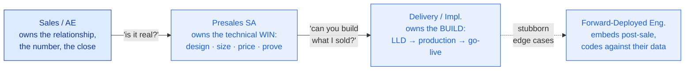
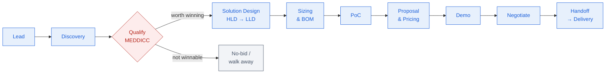

# The Solution Architect Operating System

> The SA's edge isn't knowing the most technology — it's running the lifecycle that turns a customer's problem into a design you can size, price, prove, and defend.

**Type:** Learn
**Track:** AI, Data & Infrastructure Solution Architect (Presales)
**Prerequisites:** 0.1–0.5 (the Foundations concepts — enough fluency to *read* infrastructure, data, and AI)
**Time:** ~3h
**Lab:** —
**Ship It:** SA lifecycle canvas

## The Problem

An RFP lands in your inbox on a Tuesday. A regional bank wants a "private AI assistant" for its call centre. It's real budget, a named sponsor, a Q4 deadline. You've read enough to be dangerous, so you do what feels productive: you open a diagramming tool and start drawing GPU nodes and a vector database. Three weeks later you've built a slick demo and a beautiful architecture — and you lose. Not because the architecture was wrong, but because there was no economic buyer behind the sponsor, the "requirement" for on-prem was actually negotiable, a competitor had been shaping this deal for two quarters, and the one metric that would have justified the whole project — average call handle-time — you never asked about. You solved a problem nobody had agreed was worth paying to solve.

This is the default failure mode of a technically strong architect who has no **operating system** for the role. Without a mental model of the presales lifecycle — the ordered sequence of stages, the artifact each stage must produce, and the *question* each stage must answer before you're allowed to move on — you work reactively. You skip qualification because it feels like admin. You design before you've discovered. You size before you know the load. You demo before you know what would make the buyer say yes. Every one of those is a way to burn weeks on a deal you were never going to win, or to *win* a deal you can't profitably deliver because you promised something the implementation team can't build.

The fix isn't more technology. It's a lifecycle you run the same way every time, so that qualification is a gate you can't skip, every artifact has a clear owner and a clear purpose, and by the time you draw a single box you already know who's paying, why, and what "good" looks like. This lesson installs that operating system — the role, the lifecycle, the RFx family, and the chain of artifacts you'll ship — and it doubles as the map for the rest of this track: every later phase teaches you to produce one link in that chain.

## The Concept

Three ideas carry the whole role: **what an SA actually is** (and isn't), **the lifecycle** they run, and **the artifact chain** that lifecycle produces — which turns out to be the syllabus of this entire track.

### 1. What a presales Solution Architect actually is

An SA is the **technical owner of a deal before the sale closes**. Sales owns the relationship and the number; the SA owns the answer to one question the customer keeps asking in different forms: *"Will this actually solve my problem, and can I trust the people proposing it?"* You translate a business problem into a solution, size it, price the technical bill of materials, prove it works, and defend it against competitors and objections — deep enough to design and sell, not so deep that you're the one racking the servers. That "deep enough to design and sell" line is **architect altitude**, and it's the discipline this whole track is built around.

The role only makes sense in contrast to the three roles it sits between:



- **vs Sales (Account Executive):** the AE owns budget, timeline, procurement, and the commercial relationship. They carry the quota. You carry the *technical credibility* that lets them close it. You are paired — an SA without an AE is a consultant; an AE without an SA over-promises and loses on proof.
- **vs Delivery / Implementation Architect:** delivery builds what you sold, *after* the ink dries. They own the low-level design taken to production, the runbook, and go-live. The SA lives in the gap between "what sales promised" and "what delivery can build" — and the entire job is to make that gap **zero** before the contract is signed. Over-promise and delivery inherits an unbuildable design; under-scope and you lose the deal.
- **vs Forward-Deployed Engineer (FDE):** an FDE embeds inside the customer — usually post-sale or during a paid pilot — and writes real code against the customer's data and systems to make the product fit. It's hands-on-keyboard delivery, not selling. Where an SA *designs and proves*, an FDE *builds in situ*. Worth knowing because AI-era vendors increasingly blur SA and FDE; the distinction is sell-side (SA) vs make-it-work-side (FDE).

**Architect altitude, drawn as a ladder.** The single hardest habit to build is knowing *how deep to go*. Too shallow and you can't defend the design; too deep and you become the engineer and lose the deal. The SA operates in a band — high enough to talk outcomes with an executive, low enough to talk specs with an engineer, and never lower:

```
   ALTITUDE             WHO LIVES HERE               THE SA's JOB AT THIS LEVEL
   ──────────────────────────────────────────────────────────────────────────────────
   ▲  Business value     CxO / board                 frame it: outcome, ROI, risk
   │  Architecture       Enterprise architect      ┐
   │  Solution shape     ── the SA band ──          │  DESIGN · SIZE · PRICE · PROVE
   │  Sizing & cost      SA + capacity planning     ┘  (deep enough to defend, no deeper)
   │  Component config   Implementation engineer      hand off — don't do
   ▼  Line-by-line code  Developer / FDE              not your altitude
   ──────────────────────────────────────────────────────────────────────────────────
   You must be able to move UP (to the CxO) and DOWN (to the engineer) on demand —
   but you anchor in the middle band. Sinking to the floor is the classic SA mistake.
```

### 2. The presales lifecycle is a flow with a gate

The lifecycle is the SA's operating system: an ordered set of stages, each with an artifact and an exit question. Drawn as a flow it looks deceptively linear — in reality stages overlap and you loop back — but the *order of dependencies* is real, and one stage is a hard gate.



The gate is **Qualify**. Discovery tells you what the problem is; qualification tells you whether *you should invest your (expensive) time chasing it*. A disciplined SA disqualifies deals on purpose — a fast, clean **no-bid** on an unwinnable deal is a win, because it frees the weeks you'd have poured into a demo that never mattered. Everything downstream of the gate is where you build artifacts; everything upstream is where you decide whether you're allowed to.

Two things the diagram flattens. First, **Discovery never really stops** — you keep learning until Handoff. Second, **PoC and Demo are proof, not decoration**: a PoC proves the solution works on *the customer's* data before they commit; a demo makes the value something a buyer can *feel*. Both are earned by the design and sizing that came before them.

The reason to run the stages *in order* is that **each one exists to prevent a specific, expensive failure**. Skip a stage and you don't save time — you buy its failure at a worse moment:

| Stage | The failure it prevents | What "skipping it" costs you |
|-------|-------------------------|------------------------------|
| Discovery | Solving the wrong problem | A perfect design for a need nobody will pay to fix |
| Qualify | Chasing an unwinnable deal | Weeks of design time on a deal with no buyer or budget |
| Solution Design | An architecture that misses a hard requirement | A "no" late in the cycle over something you could have known day one |
| Sizing & BOM | A price that's a wild guess | An oversized, unaffordable quote — or an undersized one you can't deliver |
| PoC | Promising something unproven | A signed deal that fails in production and burns the reference |
| Proposal | A solution with no story | A technically correct design the board declines to fund |
| Demo | A buyer who never *felt* the value | Losing to a weaker solution that demoed better |
| Handoff | Delivery inheriting an unbuildable design | A won deal that becomes a delivery disaster and a lost account |

Read that column top to bottom and you have the business case for the whole operating system: the lifecycle isn't bureaucracy, it's a sequence of cheap checks that each head off an expensive surprise.

### 3. The RFx family — where each request lands

Customers formalise buying with an **RFx** (Request for *x*). Knowing which one you're holding tells you exactly where you are on the lifecycle and how much of the solution is still yours to shape:

| RFx | The customer is saying | Lands at | You respond with |
|-----|------------------------|----------|------------------|
| **RFI** — Request for Information | "Who's out there and what can you do?" | Lead → Discovery | Capability + differentiation; a fit signal, low commitment |
| **RFP** — Request for Proposal | "Here's our problem and requirements — propose a solution and a price." | Solution Design → Proposal | HLD + BOM + pricing narrative. **The SA's home turf.** |
| **RFQ** — Request for Quotation | "We know exactly what we want — quote it." | Sizing & BOM / Pricing | A price against a fixed spec; commoditised, price-driven |

The rule of thumb: **RFI = are you a fit · RFP = design it and prove it · RFQ = just price it.** And the strategic truth behind all three: the earlier you're engaged — ideally *before* any RFx exists, helping the customer write the requirements — the more the eventual RFP looks like your solution, and the more you win. An RFQ that lands cold usually means someone else already did the shaping. You'll go deep on RFx and PoC strategy in **Phase 1**; for now, know which document means which stage.

### 4. The artifact chain — and why it *is* this track

Each lifecycle stage produces a document, and the documents form a **chain**: each link depends on the one above it. Discovery notes feed the HLD; the HLD feeds sizing; sizing feeds the BOM; the BOM feeds the TCO/ROI; all of it feeds the proposal and the demo. Skip a link and the next one becomes a guess. Here is the chain, what each link adds, and — crucially — **which phase of this track teaches you to build it**:

```
  ARTIFACT CHAIN                   THE LINK IT ADDS                       WHERE THIS TRACK TEACHES IT
  ───────────────────────────────────────────────────────────────────────────────────────────────────
  Discovery notes          ──►  what problem · whose · worth what         Phase 1 · Business & Consulting
        │
        ▼
  HLD  (High-Level Design) ──►  the boxes & arrows: the SHAPE             Phase 2–5 · Infra→Cloud→Data→AI
        │                                                                   Phase 6 · Writing the HLD
        ▼
  LLD  (Low-Level Design)  ──►  buildable detail: specs, IPs, configs     Phase 6 · Writing the LLD + runbook
        │
        ▼
  Sizing sheet             ──►  how much iron: CPU/RAM/GPU/IOPS/storage   Phase 2,5 · sizing + GPU sizing
        │                                                                   Phase 6 · Sizing & Capacity
        ▼
  BOM  (Bill of Materials) ──►  the line items you can actually buy       Phase 6 · Cost Estimation & BOM
        │
        ▼
  TCO / ROI model          ──►  what it costs vs what it saves            Phase 3,7 · FinOps + Commercial
        │
        ▼
  Proposal                 ──►  the story that wins the money             Phase 7 · Proposal & Exec Summary
        │
        ▼
  Demo                     ──►  proof the customer can feel               Phase 7 · Demo Design & Delivery
  ───────────────────────────────────────────────────────────────────────────────────────────────────
  LEGEND   │▼ = "feeds into"     Each link depends on the one above it — skip one and the next is a guess.
           The 4 flagship capstones (B · D · C · G) assemble whole segments of this chain end-to-end.
```

The two links people confuse most are the **HLD** and the **LLD** — worth pinning down now, because you'll write dozens of both. The HLD is the *shape*: the boxes and arrows, the major components and how they connect, readable in one glance by both an executive and an engineer. For Meridian, the HLD says "on-prem Kubernetes cluster, a pool of GPU nodes running an LLM server, a vector database, a RAG pipeline, and read-only connectors to the core banking and CRM systems." The LLD is the *build sheet*: exact node counts and instance specs, IP ranges and subnets, storage classes, software versions, and config — the detail the delivery team implements from without having to make design decisions. Rule of thumb: **if a stakeholder asks "how does it work?" you show the HLD; if an engineer asks "what do I build?" you hand over the LLD.** You draft the HLD across Phases 2–5 as you learn each layer, and formalise both in Phase 6.

Read the right-hand column as the syllabus. **Phase 0** (this phase) gives you the fluency to read technology and this operating system to organise it. **Phase 1** turns you into a consultant who can run discovery and qualification — the top of the chain. **Phases 2–5** teach you to design and size the *layers* (infrastructure, cloud, data, AI), each shipping an HLD + BOM + sizing sheet for its slice. **Phase 6** is where you consolidate the whole chain — patterns, sizing methodology, BOM, and the formal HLD/LLD documents. **Phase 7** is where you price it, prove it, and sell it — proposal, demo, TCO/ROI, battlecards, negotiation. You aren't learning eight disconnected topics; you're learning to build one chain, one link per phase.

### 5. The map of the track: the gate and the two certifications

Two more things orient you before you start walking the chain.

- **The find-your-level gate.** Phase 0 ends with a `find-your-level` placement quiz. If you already read infrastructure, data, and AI fluently, you pass the gate and skip straight into Phase 1 — no need to sit through literacy you already have. If you don't, the quiz points you at exactly which Foundations lessons to shore up first. It's a gate *out* of Phase 0, not a wall in front of it.
- **The two certification tiers.** The track certifies at two levels. **Associate Solution Architect** = Phases 0–4 plus Capstones B (On-Prem Private Cloud) and D (Enterprise Data Platform), plus the per-phase `check-understanding` quizzes — you can design and size the infrastructure and data layers. **Professional Solution Architect – Presales** = all eight phases plus Capstone F (Enterprise AI Transformation Proposal) and Capstone G (Executive Presales Demo defence) — you can run the *entire* lifecycle, from a cold lead to a proposal you defend in front of a mock board. Associate says "I can design it"; Professional says "I can win it."

### 6. The deal is a team sport — know the cast

You never run the lifecycle alone. On your side and the customer's, a cast of people each hold a piece of the "yes," and the SA has to win the technical ones without alienating the commercial ones. Map them early, because a deal dies when a stakeholder you ignored quietly says no:

| Side | Role | What they care about | The SA's move |
|------|------|----------------------|---------------|
| Yours | **Account Executive** | The number, the close, the relationship | Give them technical confidence; never freelance on price |
| Yours | **Sales Engineer / peer SA** | The demo, product depth | Split the design vs demo load; stay aligned on the story |
| Yours | **Delivery / PS architect** | Can we actually build this? | Design *buildable*; hand off clean at stage 10 |
| Customer | **Champion** | A personal win; looking good internally | Arm them to sell for you when you're not in the room |
| Customer | **Economic buyer** | ROI, risk, the business case | Reach them by Demo; the champion is not a substitute |
| Customer | **Technical evaluator** | Will it work / integrate / scale? | This is who your HLD, sizing, and PoC are *for* |
| Customer | **Security / compliance** | Data, controls, audit, regulation | Surface their constraints in Discovery, not after design |
| Customer | **End users** | Does it make my day easier? | Win them in the PoC; unhappy users sink adoption |

The recurring lesson hiding in this table is the same one Discovery and Qualify teach: **the loudest, friendliest contact is rarely the person who signs.** Your job is to identify all of them, and to make sure the *economic buyer* has seen proof — not just heard about it from an excited champion — before the decision date.

## Design It

Concepts stick when you place a real deal on them. Take a fictional inbound lead and walk it through the lifecycle — for **every stage, name the artifact you produce and the one question you must answer** before you're allowed to advance.

**The deal.** *Meridian Regional Bank* — 2.1M retail customers, ~90 branches. A relationship manager attended your "Private AI for Regulated Industries" webinar and requested a follow-up. Call-centre agents and relationship managers waste time hunting through policy PDFs and the CRM to answer customer questions; leadership wants an internal **AI assistant** (retrieval over policy docs + CRM) — but the banking regulator forbids customer data leaving the country or touching public LLM APIs. It's an inbound lead, and it happens to touch every layer of this track: infrastructure, data, AI, and a hard compliance constraint.

| Stage | The question you must answer | Artifact you produce |
|-------|------------------------------|----------------------|
| **Lead** | Is this real, and is it ours to pursue? | Qualified-lead note (source, sponsor, rough fit) |
| **Discovery** | What's the *actual* problem, who owns it, and what is it worth? | Discovery notes; current- vs future-state |
| **Qualify (MEDDICC)** | Should we invest — is it winnable *and* worth winning? | MEDDICC scorecard; bid / no-bid decision |
| **Solution Design (HLD→LLD)** | What's the shape of the solution, and does it meet the decision criteria? | HLD (later LLD): on-prem K8s + GPU + RAG + core/CRM connectors |
| **Sizing & BOM** | How much iron, and what does it cost to build? | GPU/storage sizing sheet; buyable BOM |
| **PoC** | Can we prove it works on *their* data before they commit? | PoC plan + success criteria + measured results |
| **Proposal & Pricing** | Why us, why now, and what's the return? | Proposal + executive summary + TCO/ROI |
| **Demo** | Can the buyer *feel* the value? | Tailored demo script + environment |
| **Negotiate** | What's the smallest winnable scope that lands the deal and de-risks delivery? | Revised BOM/SOW + negotiation plan |
| **Handoff** | Can delivery build exactly what I sold — with no surprises? | LLD + runbook + implementation plan + handoff notes |

**What the first two stages actually surface.** The temptation is to sprint to Solution Design, because drawing the private-AI platform is the fun part. Resist it. Run Discovery and Qualify first and watch how much they change the design you'd have drawn:

- *Discovery* asks "what breaks today, and what would fixing it be worth?" You learn agents open four systems to answer one policy question, that the regulator recently flagged inconsistent advice (a dated, compelling event), and that leadership already tracks **average handle-time** — so you have both the pain and the metric that prices the whole project. You also learn the non-negotiable: **no customer data may leave the country or hit a public LLM API.** That one sentence eliminates the SaaS competitor and points straight at an on-prem build — before a single box exists.
- *Qualify* asks "should we invest, and can we win?" Applying MEDDICC, you discover the enthusiastic relationship manager who filled in the webinar form has *no budget authority* — the economic buyer is the **COO**, and the board signs off in Q4. You confirm a credible champion (Head of Digital) and map the competition. The residency constraint that first looked like a headache is now your **moat**: it disqualifies the public-cloud vendor. Verdict: **bid**.

Only *then* does Solution Design begin — and it begins already knowing the answers a purely technical architect would have guessed at. That is the entire value of running the operating system instead of improvising: **by the time you design, you're designing to win, not designing to look busy.**

## Compare It

### The role has four names — know which one you're being hired as

Titles blur across companies. The same person is a "Sales Engineer" at a software vendor and a "Solutions Consultant" at a SaaS firm. Here's how the four actually differ in emphasis:

| Role | Center of gravity | Depth vs breadth | Sells or builds? |
|------|-------------------|------------------|------------------|
| **Solution Architect (presales)** | Multi-product *solution* across the whole stack; owns HLD/BOM/sizing | Broad across layers, architect altitude | Sells (designs + prices + defends) |
| **Sales Engineer (SE)** | Product depth + technical validation + the demo/PoC | Deep in one product | Sells (proves the product works) |
| **Solutions Consultant** | Business outcome + value engineering; lighter on low-level architecture | Business-leaning | Sells (frames the value) |
| **Forward-Deployed Engineer (FDE)** | Making the product fit the customer's data/systems, hands-on | Deep + hands-on-keyboard | Builds (in situ, post-sale) |

In a small company, one person is all four. In an enterprise, they're distinct seats on a deal team. This track trains the **Solution Architect** seat — the broadest of the four — which is why it teaches infrastructure *and* data *and* AI at architect altitude rather than one product in depth.

### Qualification frameworks — a first look (Phase 1 goes deep)

You'll meet these properly in Phase 1. For now, just know they exist and what each optimises for, because they decide whether the **Qualify** gate is disciplined or a rubber stamp:

| Framework | Stands for | What it's good at | Watch out for |
|-----------|-----------|-------------------|---------------|
| **BANT** | Budget · Authority · Need · Timing | Fast filtering of a lead — a 4-item checklist | Seller-centric; weak on *why change* and *what metric* |
| **SPIN** | Situation · Problem · Implication · Need-payoff | A *questioning technique* for discovery — surfaces pain, builds the value case | It's how you ask, not a scorecard you fill in |
| **MEDDICC** | Metrics · Economic buyer · Decision criteria · Decision process · Identify pain · Champion · Competition | Qualifying *enterprise* deals — tracks winnability across the whole cycle | Heavier; overkill for a $5k transactional sale |

The short version: **BANT filters, SPIN questions, MEDDICC qualifies.** This track adopts **MEDDICC** as its qualification standard because presales SA deals are large, multi-stakeholder, and long — exactly what MEDDICC was built for. It's the framework you applied at the Qualify gate for Meridian above.

### Where the SA sits, and how they're measured

One more piece of role reality that shapes how you run the lifecycle: a presales SA almost always reports into the **sales organisation**, not engineering, and is measured on the **team's revenue** — win rate, technical-win rate, and deals closed in their region — usually with a base salary plus a variable component tied to that quota. This matters because it's *why* qualification is non-negotiable: your time is a revenue-bearing resource. A day spent designing an unwinnable deal is a day not spent on a winnable one, and it shows up in the number. The best SAs are ruthless about the Qualify gate precisely because they're measured on outcomes, not activity — a beautiful architecture for a lost deal counts for nothing. Hold that lens over everything that follows in this track: you are learning to *win*, and the lifecycle is how you spend a scarce resource — you — where it pays.

## Ship It

The deliverable for this lesson is the tool you'll reuse on *every* real deal for the rest of your career: the **SA Lifecycle Canvas** — a one-page fill-in that forces you to name, for each stage, the activity, the artifact, and the **exit criteria** (the gate you must clear to advance). Filling it in on a live deal is how you stop working reactively; the canvas *is* the operating system, made portable.

Saved under [`outputs/`](../outputs/):

- **`template-sa-lifecycle-canvas.md`** — the blank, reusable canvas: for each of the ten stages, columns for *objective/activity → artifact → exit criteria → owner*, plus a bid/no-bid decision block and a running artifact-chain checklist. Copy it into any new deal.
- **`example-meridian-sa-lifecycle-canvas.md`** — the same canvas fully worked for the Meridian Regional Bank deal, so the template is never abstract. It shows what "good" exit criteria look like and exactly where a real deal would get disqualified.

Three habits make the canvas earn its keep:

1. **Fill the exit-criteria column before you do any work.** Deciding *what would have to be true to advance* — before you're emotionally invested in the deal — is what keeps qualification honest.
2. **Never let a downstream artifact get ahead of an empty upstream box.** If the sizing sheet exists but the HLD doesn't, your numbers are fiction. The artifact-chain checklist is there to catch exactly this.
3. **Re-run the Qualify gate whenever something big changes.** A champion leaves, a budget freezes, a competitor drops out — any of these can flip a bid to a no-bid. The canvas is a living document, not a one-time form.

Pick up the template on your next deal, fill the exit-criteria column *first*, and you've installed the discipline that separates an architect who wins from one who just draws.

## Exercises

1. **(Easy)** From memory, list the ten lifecycle stages in order and, for each, name the single artifact it produces. Then mark which stage is the *gate* and explain in one sentence why disqualifying a deal there is a win, not a failure.
2. **(Medium)** Swap the customer. Take a *manufacturer* that wants a predictive-maintenance data platform (sensor streaming → lakehouse → dashboards) and fill in the SA Lifecycle Canvas for the first four stages (Lead → Discovery → Qualify → Solution Design). For each, write the one question you must answer and the artifact you'd produce, and note where its artifact chain differs from Meridian's AI-assistant deal.
3. **(Hard)** Take the Meridian worked example and map every downstream artifact to the phase of this track that teaches you to build it (use the artifact-chain ASCII diagram). Then identify the *two* links you currently could not produce, and state which capstone (B, D, C, F, or G) would prove you can. This turns the canvas into your personal learning plan for the track.

## Key Terms

| Term | What people say | What it actually means |
|------|-----------------|------------------------|
| Solution Architect (presales) | "The technical salesperson" | The technical owner of a deal *before* the sale: translates a business problem into a solution, then sizes, prices, proves, and defends it at architect altitude. Paired with a salesperson, not replacing them. |
| Architect altitude | "Knowing the tech" | Deep enough to design, size, and sell a solution — *not* deep enough to be the engineer who implements it. The deliberate ceiling this whole track teaches to. |
| Presales lifecycle | "The sales process" | The SA's ordered stages (Lead → … → Handoff), each with an artifact and an exit question, with **Qualify** as a hard gate you can disqualify at. |
| Qualification | "Checking if they'll buy" | Deciding whether a deal is winnable *and* worth winning before you invest design time. A clean no-bid is a valid, valuable outcome. |
| MEDDICC | "A sales checklist" | An enterprise-deal qualification framework (Metrics, Economic buyer, Decision criteria, Decision process, Identify pain, Champion, Competition) that tracks winnability across the cycle. |
| RFI / RFP / RFQ | "The paperwork" | Three formal buyer requests at different stages: RFI = *are you a fit*, RFP = *design and prove it* (the SA's home turf), RFQ = *just quote a fixed spec*. |
| HLD vs LLD | "The design doc" | HLD = the boxes-and-arrows *shape* an exec and an engineer can both read; LLD = the buildable detail (specs, IPs, configs) delivery implements from. |
| BOM | "The price list" | Bill of Materials — the line items you can actually buy (servers, GPUs, licences, support) derived from the sizing sheet; the input to pricing. |
| Artifact chain | "The documents" | The dependency-linked sequence discovery → HLD → LLD → sizing → BOM → TCO/ROI → proposal → demo, where each link feeds the next and this track teaches one link per phase. |
| Forward-Deployed Engineer | "A fancy consultant" | An engineer who embeds in the customer and writes real code against their data/systems to make the product fit — a *build-side*, post-sale role, distinct from the sell-side SA. |

## Further Reading

- [MEDDIC / MEDDICC overview — MEDDIC Academy](https://meddic.academy/meddic/) — the canonical explanation of the qualification framework this track adopts; read it before Phase 1 and you'll recognise every letter in the Meridian scorecard.
- [TOGAF® Standard — Architecture Development Method (ADM)](https://pubs.opengroup.org/architecture/togaf10-doc/adm/) — the enterprise-architecture lifecycle the presales artifact chain rhymes with; skim it to see where HLD/LLD sit in a formal method.
- [*Mastering Technical Sales: The Sales Engineer's Handbook* — John Care](https://www.masteringtechnicalsales.com/) — the reference text on the SA/SE role, the demo, and working alongside an AE; the practitioner's counterpart to this operating-system view.
- [RFI vs RFP vs RFQ — a plain-English primer](https://www.responsive.io/blog/rfp-rfi-rfq) — settles the three-letter confusion once, so you always know which stage a request means.
- [Palantir — *A Guide to Forward-Deployed Engineering*](https://blog.palantir.com/a-guide-to-forward-deployed-engineering-at-palantir-528d7bcba1e2) — where the FDE role comes from and how it differs from a presales SA; useful context for AI-era deal teams that blur the two.
