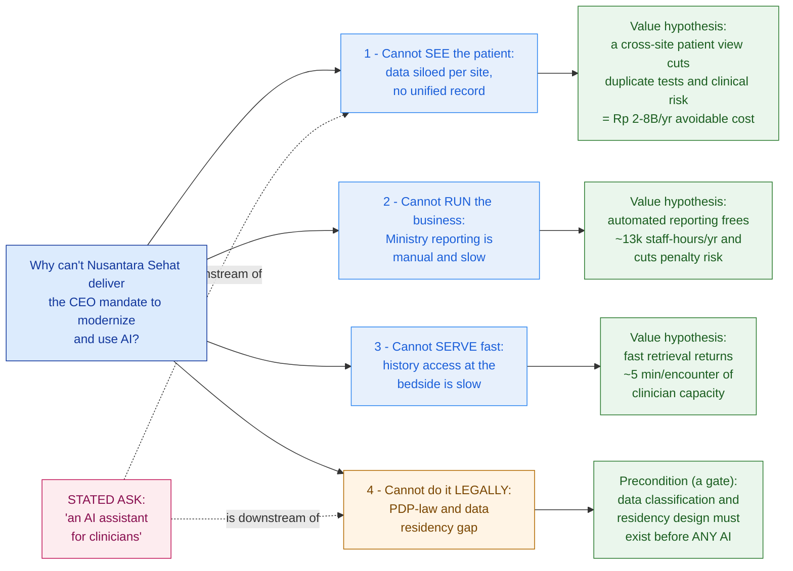

# Think Like a Consultant

> The customer names a solution; the consultant finds the problem — and what it's worth. Reframe the ask before you architect the answer.

**Type:** Learn
**Track:** AI, Data & Infrastructure Solution Architect (Presales)
**Prerequisites:** Phase 0 (Foundations)
**Time:** ~4h
**Lab:** —
**Ship It:** Problem-framing canvas

## The Problem

You are in a boardroom at **Nusantara Sehat**, an Indonesian private hospital group — 8 hospitals and 20 clinics across Java and Bali, ~4,500 staff, ~1.2M patients a year. A competitor just announced an "AI for doctors" product, the board panicked, and the new CEO issued a one-line mandate: *"modernize and use AI."* The CIO leans across the table and says the magic words: *"We want an AI assistant for our clinicians — they ask it about a patient and it answers."* You nod. In your head the demo is already running: a chatbot over the patient records, a vector database, an 8-week proof of concept. You could quote it before you reach the car park.

Then you actually look at the estate. There is no "the patient records." Each of the 8 hospitals runs its own aging hospital information system (HIS); the labs live in a separate LIS, radiology in a separate RIS/PACS, money in a finance/ERP, and there's a homegrown patient portal and spreadsheet reporting bolted on the side — **siloed per site**. There is no unified patient view, so your assistant would answer from whichever silo it happened to reach: partial, stale, sometimes wrong. And the moment a cloud LLM touches a patient's record you trip Indonesia's Personal Data Protection Law and health-data residency expectations. Your 8-week chatbot is a multi-year data-and-governance program wearing a chatbot's costume — and you just priced the costume. When the CFO who actually holds the budget asks *"what do we get for that money?"* you have no answer, because you never found the problem. You only echoed the solution the customer handed you.

This is the failure mode of an SA who can't **frame**. You built the wrong thing beautifully. Underneath it sit three rookie mistakes that this lesson exists to kill. **Solutioning before framing:** you designed before you understood, so every later decision inherits the first wrong turn. **Boiling the ocean:** with the scope fuzzy, you either promise to fix everything or freeze — instead of carving the problem into parts you can size one at a time. **Confusing symptoms with root cause:** "we need an AI assistant" is a *symptom* of a deeper problem — clinicians can't see the patient across sites — not the problem itself, and definitely not its value. A consultant's first move, before a single box is drawn, is to reframe a stated ask into the real business problem and what it's worth. Do it well and you leave with a scope the CFO will fund, the Chief Medical Officer will trust, and the CIO can actually build.

## The Concept

An architect who can frame walks into any room, absorbs a vague or over-specified ask, and hands it back as a small set of testable problems each carrying a number. Four mental tools do the work. None of them is technology — they are the reasoning you run *before* you're allowed to draw.

### 1. Value framing — outcome, not feature

Customers describe solutions ("an AI assistant"); the business only pays for **outcomes** (less risk, less cost, more capacity, more revenue). Your job is to translate every feature the customer names back into the outcome it's a proxy for — and to name **which buyer feels that outcome**, because a hospital has several and they don't want the same thing.

| Customer names a FEATURE | Architect reframes to an OUTCOME | Buyer who feels it |
|---|---|---|
| "an AI assistant for clinicians" | cut the wasted time and repeat tests caused by no cross-site patient view | CMO (safety, clinician time) · CFO (cost) |
| "modernize" | one operational picture + Ministry reporting that isn't done by hand | CFO (cost, risk) · CIO (feasibility) |
| "use AI, a competitor did" | a defensible, compliant modernization the board can point to | CEO (strategy) · board |

At Nusantara Sehat the **CFO is the economic buyer** (budget), the **CIO is the technical champion** (sponsor), and the **CMO is a skeptical influencer** (will veto anything that risks patient safety). Framing to "a chatbot" speaks to none of them. Framing to "fewer duplicate tests and lower clinical risk for Rp X per year" speaks to all three at once.

### 2. Symptom → root cause → business impact

A stated ask usually lands as a **symptom**. Your job is to walk it down to the **root cause** and then up to the **business impact**, expressed in one of four currencies the business understands: **time, cost, risk, revenue**.

```
   SYMPTOM                    ROOT CAUSE                   BUSINESS IMPACT
   (what they feel)           (why it happens)             (what it costs — time/cost/risk/revenue)
   ──────────────────────    ─────────────────────────    ─────────────────────────────────────────
   "clinicians re-order       each site's HIS/LIS/RIS       duplicate tests (COST) +
    labs that already exist"   is a separate silo; no        wrong/late decisions (RISK to patients)
                               cross-site patient index
```

The discipline: never stop at the symptom (that's where the "AI assistant" lives) and never stop at the root cause (an engineer's finding, not a business case). Only the third column gets funded.

### 3. MECE decomposition

A fuzzy, huge ask ("modernize and use AI") is unsolvable as one lump. Break it into branches that are **M**utually **E**xclusive (no overlap — you can work one without touching another) and **C**ollectively **E**xhaustive (together they cover the whole problem, no gap). MECE is the difference between a plan and a pile: it lets you size, sequence, and defend each part, and it proves to the buyer you haven't missed anything.

### 4. Hypothesis-led thinking

Consultants don't gather all the facts and hope a conclusion appears — that *is* boiling the ocean. They state a **hypothesis** early ("a cross-site patient view would cut duplicate tests by roughly Rp N per year"), then ask the one question that would *confirm or deny* it. This turns discovery from an open-ended interview into a targeted search for evidence. The vehicle is an **issue tree**: the reframed question at the root, MECE branches, and a testable value hypothesis on each leaf.



Read the tree and the reframe jumps out: **the "AI assistant" is not a branch — it sits downstream of branches 1 and 4.** You cannot build a trustworthy assistant until the patient data is unified (branch 1) and the governance/residency gate is passed (branch 4). The CEO asked for the roof; the tree shows the roof needs a foundation.

### The framing ladder

Frame every ask by climbing three rungs, left to right. Never quote rung 1. Quote rung 3, justified by rung 2.

```
        RUNG 1 — STATED ASK            RUNG 2 — REFRAMED PROBLEM          RUNG 3 — BUSINESS VALUE
        (a feature / a symptom)        (the real, root problem)           (what it's worth, to whom)
   ┌──────────────────────────┐   ┌────────────────────────────┐   ┌──────────────────────────────┐
   │  "we need an AI          │──▶│  clinicians can't see a     │──▶│  Rp 2–8B/yr avoidable         │
   │   assistant for          │   │  patient's full history     │   │  duplicate tests + lower       │
   │   clinicians"            │   │  across our 8 sites         │   │  clinical risk   [CFO · CMO]   │
   └──────────────────────────┘   └────────────────────────────┘   └──────────────────────────────┘
        the customer starts here        you do the work here             the deal is decided here

   Rule of thumb: if your proposal repeats the words in rung 1, you have not framed — you have transcribed.
```

### The three ways framing goes wrong

The four tools exist to kill the three rookie mistakes from The Problem. Learn to catch yourself in the act:

| Failure mode | What it looks like on a deal | The tool that kills it |
|---|---|---|
| **Solutioning before framing** | You're sketching the architecture (RAG, vector DB, 8-week PoC) before you can state the business problem in one sentence. | Value framing + JTBD — force the ask up to an *outcome* and name the *job* before any box is drawn. |
| **Boiling the ocean** | The scope is "modernize everything"; you either promise the world or freeze because you can't size it. | MECE issue tree — carve the lump into branches you can size and sequence one at a time. |
| **Symptom ≠ root cause** | You take "we need an AI assistant" as the requirement and design to it. | Symptom→root-cause→impact + the So-what test — walk the ask down to the cause and up to the money. |

If you can name which mistake you're about to make, you already know which tool to reach for.

## Design It

Let's frame Nusantara Sehat's ask properly. Your job in this session is *not* to design the AI assistant — it's to **reframe the stated ask into the real problems and price them**, so the scope you eventually propose is one the buyers will fund. Work the five moves in order; the output is the Problem-Framing Canvas you'll ship.

### Step 1 — Capture the stated ask verbatim, and quarantine it

Write down exactly what the customer said, in quotes, and label it a *symptom* — not the scope.

> **Stated ask (verbatim):** *"We want an AI assistant for our clinicians — they ask it about a patient and it answers."*
> **Trigger:** new CEO mandate to "modernize and use AI" after a competitor's AI announcement.

Quarantining the ask is a discipline: it stops you from designing the chatbot in your head. The ask is data about *what the customer thinks the answer is* — useful, but not yet the problem.

### Step 2 — Interrogate the ask down to root cause

Run a short **"why / so what" ladder** on the ask until you hit something a business can act on. This is Jobs-to-be-Done in motion: what job is the clinician *hiring* the assistant to do?

```
"We want an AI assistant."
   └─ Why?  → "So a doctor gets a straight answer about a patient fast."
        └─ Why can't they today?  → "The patient's history is scattered across 8 sites and 4 systems."
             └─ So what?  → "They repeat tests, decide on partial data, and waste time hunting."
                  └─ So what to the business?  → "Cost (duplicate diagnostics), risk (patient safety),
                                                  and lost clinician capacity."
```

Four "whys" and the AI assistant has dissolved into a **data problem with a cost, a risk, and a time impact**. The assistant might still be *part* of the eventual solution — but now you know it's the tip, not the iceberg.

**Tripwire phrases — a stated ask almost always hiding a deeper problem.** When you hear one of these, reach for the ladder before you reach for a design:

- *"We need an AI assistant / a chatbot"* → usually a data-access or knowledge-fragmentation problem.
- *"We need a dashboard"* → usually a decision-latency or single-source-of-truth problem.
- *"We need to move to the cloud"* → usually a cost, scaling, or resilience problem (cloud is the proposed *how*).
- *"We need a data lake"* → usually a reporting or integration problem the customer has pre-diagnosed.

The pattern is always the same: the noun in the ask is a **solution**, and your job is to find the **problem** it stands in for.

### Step 3 — Build the MECE issue tree

Take the reframed root question — *"Why can't Nusantara Sehat deliver the CEO's modernize-and-use-AI mandate?"* — and decompose it into MECE branches. A clean split for a multi-site provider is by the four things the group cannot currently do:

1. **SEE the patient** — data is siloed per site; no unified record or cross-site patient index.
2. **RUN the business** — Ministry-of-Health reporting is manual, spreadsheet-driven, slow and error-prone.
3. **SERVE fast** — clinicians can't retrieve a full patient history quickly at the point of care.
4. **Do it LEGALLY** — Indonesian PDP law and health-data residency are unaddressed (a cross-cutting *precondition*, exactly as identity was in the Phase 0 estate map).

That is the Mermaid tree above. Test it for MECE: the branches don't overlap (you can fix reporting without fixing residency), and together they cover the mandate (there's no fifth thing hiding). Branch 4 is the gate — like identity in an estate map, it governs everything and can't be skipped.

There is no single "correct" tree — the skill is choosing the **split** that's most testable and most decision-relevant. Common splits: by **capability** (what the business can't do — used here), by **value lever** (cost / risk / revenue / time), by **process stage** (admit → treat → discharge → bill), or by **buyer** (whose pain is it). Pick the one whose branches you can each attach a number to and sequence independently; if two branches keep bleeding into each other, you chose the wrong split, not the wrong problem.

### Step 4 — Attach a value hypothesis to each branch

Now the part that separates architects from note-takers: put a **number with a formula, stated assumptions, and a sanity range** on each branch. Never a single magic figure — a band you can defend and then narrow with evidence. (FX for the executive read: ~Rp 16,000 = USD 1.)

**Branch 1 — Unified patient view (avoidable duplicate diagnostics)**
```
value/yr = encounters/yr × (share touching >1 site or prior episode) × (avoidable-duplicate rate) × (avg test cost)
  low  = 1,200,000 × 0.15 × 0.05 × Rp 200,000  ≈  Rp 1.8B
  high = 1,200,000 × 0.25 × 0.10 × Rp 350,000  ≈  Rp 10.5B
  → defensible band ≈ Rp 2–8B/yr  (~USD 0.1–0.5M)  + non-priced clinical-risk reduction
```

**Branch 2 — Automated compliance reporting (freed staff time + penalty-risk avoidance)**
```
labor/yr = facilities × staff-hours/facility/month × 12 × loaded Rp/hour
  low  = 28 × 30 × 12 × Rp 60,000   ≈  Rp 0.6B   (≈ 10,000 hrs)
  high = 28 × 60 × 12 × Rp 120,000  ≈  Rp 2.4B   (≈ 20,000 hrs)
  → ≈ Rp 1–2B/yr labor (~13–15k staff-hours) + avoided PDP/MoH penalty & license-standing RISK
```

**Branch 3 — Fast history retrieval (returned clinician capacity)**
```
capacity/yr = encounters/yr × minutes saved/encounter ÷ 60
  low  = 1,200,000 × 3 ÷ 60  ≈  60,000 clinician-hours
  high = 1,200,000 × 7 ÷ 60  ≈ 140,000 clinician-hours
  → ≈ 30–80 clinician-FTE of capacity (at ~1,800 productive hrs/FTE/yr)
     — banked as shorter waits or added throughput; the split is a discovery question, not a claim
```

**Branch 4 — Governance & residency (a gate, not a saving)**
```
This branch has no upside to bank — it has downside to avoid and it blocks the others.
  - UU PDP (Law 27/2022): administrative fines up to ~2% of annual revenue per violation,
    plus health data is sensitive/regulated and residency-sensitive.
  - Framing: MUST-DO precondition. No compliant cloud AI (or the assistant) can ship before it.
```

Notice branches 1–3 each land in a different currency — **cost**, **cost + risk**, **time/capacity** — which is why they speak to different buyers. Branch 4 is pure **risk** and pure sequencing.

### Step 5 — Name the evidence, then write the reframed scope

A hypothesis is worthless until you say what would confirm or deny it. For each branch, name the **one or two pieces of evidence** you'll gather in discovery — this becomes your interview and data-request list (and the input to the next lesson, Requirement Gathering).

| Branch | Hypothesis to test | Evidence that confirms / denies |
|---|---|---|
| 1 · Unified view | Duplicate tests are material | Lab/imaging volumes + a duplicate-order audit at 2 sites; % of patients seen at >1 site |
| 2 · Reporting | Manual reporting is a real cost | Time-logs from reporting staff; count of MoH report types + cadence; error/late-submission history |
| 3 · History access | Retrieval time is significant | Shadow 3 clinicians; time-to-assemble-history; referral turnaround |
| 4 · Governance | Residency/PDP blocks cloud AI | Legal's data-classification stance; current data-residency posture; DPO sign-off requirements |

Then the payoff — a single reframed scope statement that replaces "an AI assistant" and threads through every later deliverable:

> **Reframed scope (the "so what"):** The CEO's mandate is not a chatbot — it is a **modernization program with three fundable outcomes** (a unified patient view worth ~Rp 2–8B/yr in avoided duplicate care; automated Ministry reporting freeing ~13k staff-hours/yr; faster bedside history access returning ~30–80 clinician-FTE of capacity), all gated by a **PDP/residency data-governance foundation**. The **AI clinician assistant is the visible capstone that sits on top of the unified data and the governance gate — not the starting point.** We propose to sequence the foundation first and land the assistant as the proof the board can point to.

Same customer, same 8-week instinct at the start — completely different proposal. You now have a scope the CFO can fund (it has numbers), the CMO can trust (safety framed, not hand-waved), and the CIO can build (sequenced, not boiled). That reframe is the whole job of this lesson.

## Compare It

The moves above aren't ad-hoc — they're the working consultant's toolkit, and each formal frame is strongest at a different point in discovery. You don't need to *be* a management consultant; you need to know which frame to reach for in the room.

| Frame | What it gives you | Reach for it when… |
|---|---|---|
| **McKinsey issue tree / MECE** | A gap-free, overlap-free decomposition of a fuzzy question into branches you can size and test one at a time. | The ask is vague or huge ("modernize and use AI") and you must carve it into parts that are individually solvable and jointly complete — the core of Step 3. |
| **The "So what?" test** | Forces every observation up to a business consequence; kills interesting-but-irrelevant findings. | You have symptoms/facts and must prove they *matter* — turning "data is siloed" into "so clinicians repeat tests, so it costs Rp 2–8B." This is Step 2 and Step 4. |
| **Minto Pyramid Principle** | Answer-first communication: lead with the recommendation, then grouped (MECE) supporting arguments. | You present the reframe *upward* to executives — open with the reframed scope, support with the three branches. It structures the readout, not the analysis. |
| **Jobs-to-be-Done (JTBD)** | Reframes a feature ask as the "job" the user is hiring it to do, in their real context. | Early, to convert "they asked for an AI assistant" into "the clinician is hiring it to answer *what's wrong with this patient, fast and safely*" — the engine of Step 2. |

They chain into one discovery-to-readout pipeline. Miss the first and you decompose the wrong question; miss the last and a correct reframe dies in a bad meeting:

```
   JTBD           ISSUE TREE / MECE        SO-WHAT TEST          MINTO PYRAMID
   reframe   ──▶  decompose the       ──▶  price each      ──▶   present answer-first
   the ask        question, no gaps        branch in $/risk       to the board
   ───────        ─────────────────        ──────────────        ──────────────────
   Step 2         Step 3                   Step 4                 the readout

   the analysis flows left→right; the presentation runs the same order in reverse depth
```

The "it depends" a customer (or your own sales lead) will push back with: *"The CEO asked for AI in Q1 — why are you selling me a data project?"* Framing is what lets you answer without losing the deal: *"You'll get the AI — but an assistant that answers from one siloed hospital and trips the PDP law will embarrass the board, not impress it. We land the unified data and the governance gate first, then the assistant becomes the demo that's actually true."* That is the difference between transcribing an ask and consulting on it.

## Ship It

This lesson ships the **Problem-Framing Canvas** — the one-page artifact you produce in the first hours of any engagement, before discovery interviews and long before any HLD. It converts a stated ask into reframed problems, root causes, quantified value, hypotheses, and the evidence you'll gather next. Both files live in [`outputs/`](../outputs/):

- **[`template-problem-framing-canvas.md`](../outputs/template-problem-framing-canvas.md)** — a fill-in-the-blank canvas: the stated-ask capture, a MECE issue-tree skeleton (Mermaid + ASCII), the six-column framing table (stated ask → reframed problem → root cause → business value → hypothesis → evidence needed), and a reframed-scope statement. A colleague can run it on any deal.
- **[`example-nusantara-sehat-canvas.md`](../outputs/example-nusantara-sehat-canvas.md)** — the canvas fully worked for Nusantara Sehat, so the skeleton isn't abstract. It's the artifact you'd walk into the CFO's office with, and it feeds directly into Requirement Gathering (Lesson 1.4) and the Phase 1 Discovery capstone.

The point of shipping this first: the framing canvas is the cheapest way to prove you understood the *problem* before you sold a *solution* — and it's the document that stops your own team from quoting an 8-week chatbot for a multi-year program.

## Exercises

1. **(Easy)** Take the Nusantara Sehat canvas and, for the stated ask *"an AI assistant for clinicians,"* write the **symptom → root cause → business impact** chain in one line. Then label each of the three value dimensions (cost, risk, time) with the buyer who feels it most — CFO, CMO, or CIO — and explain in a sentence why framing to "a chatbot" would fail to move any of them.
2. **(Medium)** Reframe a *different* customer: a mid-size Indonesian retail bank whose head of operations says *"we need a chatbot for customer service."* Build a **3-branch MECE issue tree** for the reframed problem, attach a **value hypothesis with a formula and a sanity range** to each branch (state your assumptions), and list the one piece of evidence you'd gather to test each. Confirm your three branches are mutually exclusive and collectively exhaustive.
3. **(Hard)** Extend the Nusantara Sehat canvas into a **sequencing recommendation.** Using the governance/residency *precondition* branch and the So-what test, argue in half a page why the AI assistant must be phased *after* the unified-data and governance work — and script exactly what you'd tell the CEO who wants the assistant live in Q1 without losing the deal. Save it alongside the worked example; you will reuse this reasoning in the **Phase 1 Discovery capstone (Capstone A)**.

## Key Terms

| Term | What people say | What it actually means |
|------|-----------------|------------------------|
| Value framing | "Selling the benefits" | Translating a customer's requested *feature* into the business *outcome* it's a proxy for (time, cost, risk, revenue), and naming which buyer feels that outcome. |
| Stated ask | "The requirements" | What the customer *thinks* the answer is, said in their words. It's a symptom and a clue — never the scope until you've reframed it. |
| Root cause | "The problem" | The underlying reason the symptom exists (siloed data), one level below what the customer feels and one level above the business impact. |
| Business impact | "The value" | The cost/time/risk/revenue consequence of the root cause, in a currency an executive funds. If a finding doesn't reach here, it doesn't get budget. |
| MECE | "A breakdown" | **M**utually **E**xclusive, **C**ollectively **E**xhaustive — branches that don't overlap and together miss nothing. The test that turns a pile of issues into a defensible plan. |
| Issue tree | "A mind map" | A root question decomposed into MECE branches with a *testable hypothesis* on each leaf — the structure of hypothesis-led discovery. |
| Hypothesis-led | "Doing analysis" | Stating the likely answer *first*, then gathering only the evidence that would confirm or deny it — the opposite of boiling the ocean. |
| So-what test | "Summarizing" | Repeatedly asking "so what?" of a fact until it reaches a business consequence; the filter that kills true-but-irrelevant findings. |
| JTBD | "User needs" | Jobs-to-be-Done — the *job* a user hires a product to do in their context ("answer what's wrong with this patient, fast"), used to reframe a feature ask. |
| Boiling the ocean | "Being thorough" | Trying to analyze or solve everything at once because the problem wasn't framed; the failure mode hypothesis-led thinking prevents. |

## Further Reading

- [*Bulletproof Problem Solving* (Conn & McLean)](https://www.bulletproofproblemsolving.com/) — the modern McKinsey seven-step method: issue trees, MECE, and hypothesis-led problem solving, with the worked logic behind Steps 2–4 of this lesson.
- [*The Minto Pyramid Principle* (Barbara Minto)](https://www.barbaraminto.com/) — the canonical guide to answer-first, MECE-structured communication; read it to present a reframe to a board without burying the recommendation.
- [Christensen et al. — "Know Your Customers' Jobs to Be Done" (HBR)](https://hbr.org/2016/09/know-your-customers-jobs-to-be-done) — the JTBD reframe that turns "they asked for an AI assistant" into the job the clinician is actually hiring it for.
- [MindTools — MECE / Issue Trees](https://www.mindtools.com/) — a quick, practical refresher on building mutually-exclusive, collectively-exhaustive breakdowns when you need the structure fast in the field.
- [DLA Piper — Data Protection Laws of the World: Indonesia](https://www.dlapiperdataprotection.com/) — a stable summary of Indonesia's Personal Data Protection Law (UU 27/2022) so your branch-4 governance/residency framing rests on real regulatory constraints, not vibes.
