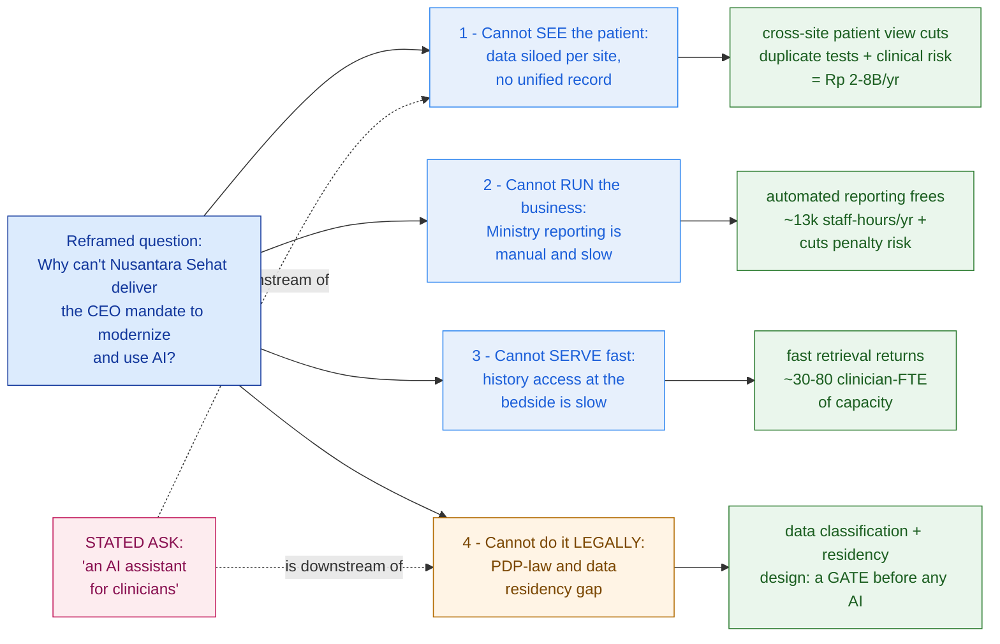

# Problem-Framing Canvas — Nusantara Sehat (worked example)

> This is `template-problem-framing-canvas.md` filled in for a fictional customer. It shows what "good" looks like: the stated ask reframed into three fundable outcomes plus a governance gate, each carrying a defensible number — the difference between quoting an 8-week chatbot and scoping a modernization program the CFO will actually fund.

**Customer:** Nusantara Sehat (fictional)  ·  **Industry:** Private healthcare — hospital group
**Prepared by:** SA — Presales  ·  **Date:** 2026-07-04  ·  **Opportunity:** "Clinician AI Assistant" → modernization program  ·  **Version:** v0.2

**Company shape:** 8 hospitals + 20 clinics across Java & Bali · ~4,500 staff · ~1.2M patients/yr. Aging on-prem HIS per site; separate LIS (lab), RIS/PACS (radiology), finance/ERP, a homegrown patient portal, spreadsheet reporting — **data siloed per site.**

FX note for executive reads: ~Rp 16,000 = USD 1.

---

## 1. The stated ask (captured and quarantined)

- **Stated ask (verbatim):** *"We want an AI assistant for our clinicians — they ask it about a patient and it answers."*
- **Trigger / why now:** new CEO mandate to *"modernize and use AI"* after a competitor announced an AI product; board is anxious to respond.
- **Who is asking / who pays / who can veto:**
  - **Economic buyer — CFO:** holds the budget; funds on ROI and risk.
  - **Champion — CIO:** technical sponsor; wants a buildable, defensible path.
  - **Skeptic-influencer — CMO (Chief Medical Officer):** will veto anything that risks patient safety or adds clinician burden.
  - **Process:** procurement will run an RFP.

> Labelled a **symptom**, not the scope. The ask tells us what the customer thinks the answer is — useful, not yet the problem.

## 2. Interrogate the ask (why / so-what ladder)

```
"We want an AI assistant for our clinicians."
   └─ Why?  → so a doctor gets a straight answer about a patient, fast
        └─ Why can't they today?  → the patient's history is scattered across 8 sites and 4 systems
             └─ So what?  → they repeat tests, decide on partial data, and waste time hunting
                  └─ So what to the business?  → COST (duplicate diagnostics) + RISK (patient safety)
                                                 + lost clinician TIME/capacity
```

**Job-to-be-done:** *the clinician is hiring the assistant to answer "what is wrong with this patient, quickly and safely" — in a context where the record is fragmented across sites.* The assistant is the tip; the iceberg is the data.

## 3. The MECE issue tree



### ASCII fallback

```
        RUNG 1 — STATED ASK          RUNG 2 — REFRAMED PROBLEM        RUNG 3 — BUSINESS VALUE
   ┌────────────────────────┐   ┌────────────────────────────┐   ┌──────────────────────────────┐
   │ "an AI assistant       │──▶│ clinicians can't see a      │──▶│ Rp 2–8B/yr avoidable dup.     │
   │  for clinicians"       │   │ patient across our 8 sites  │   │ tests + lower risk [CFO·CMO]  │
   └────────────────────────┘   └────────────────────────────┘   └──────────────────────────────┘

   MECE branches of the reframed question:
     1. cannot SEE the patient      →  Rp 2–8B/yr avoidable duplicate care
     2. cannot RUN reporting        →  Rp 1–2B/yr labor + penalty-risk avoided
     3. cannot SERVE fast           →  ~30–80 clinician-FTE of capacity returned
     4. cannot do it LEGALLY (gate) →  no upside to bank; blocks 1–3 and the AI assistant
```

**MECE self-check:** ☑ branches don't overlap (reporting can be fixed without touching residency) ☑ together they cover the mandate (no fifth thing hiding). Branch 4 is the cross-cutting gate — like identity in a Phase 0 estate map.

## 4. The framing table (the core deliverable)

> All figures **illustrative — to validate in discovery.** Formula + assumptions + range shown for each; never a lone number.

| # | Stated ask (feature) | Reframed problem (root cause) | Business value — formula, assumptions, **range** | Value hypothesis | Evidence needed |
|---|---|---|---|---|---|
| 1 | "AI assistant" reads full history | No unified patient view; each site's HIS/LIS/RIS is a separate SoR, no cross-site index | **COST** = encounters × cross-site share × dup-rate × test cost. `1.2M × 0.15 × 0.05 × Rp200k = Rp1.8B` (low) → `1.2M × 0.25 × 0.10 × Rp350k = Rp10.5B` (high). Band **≈ Rp2–8B/yr** + non-priced clinical-risk cut | A cross-site patient view materially cuts avoidable duplicate diagnostics and mis/late decisions | Lab/imaging volumes + duplicate-order audit at 2 sites; % of patients seen at >1 site |
| 2 | "modernize" | MoH + internal reporting is manual, spreadsheet-driven across 28 facilities | **COST/RISK** = facilities × hrs/facility/mo × 12 × Rp/hr. `28 × 30 × 12 × Rp60k = Rp0.6B` → `28 × 60 × 12 × Rp120k = Rp2.4B`. Band **≈ Rp1–2B/yr (~13–15k hrs)** + avoided PDP/MoH penalty | Automating consolidated reporting frees ~13k staff-hours/yr and reduces late/inaccurate-submission risk | Reporting-staff time logs; count of MoH report types + cadence; late/error history |
| 3 | doctors get answers "fast" | History retrieval at the bedside is slow; spread across systems + sites | **TIME/CAPACITY** = encounters × min saved ÷ 60. `1.2M × 3 ÷ 60 = 60k hrs` → `1.2M × 7 ÷ 60 = 140k hrs` → **≈ 30–80 clinician-FTE** (at ~1,800 hrs/FTE/yr) | Fast retrieval returns meaningful clinician capacity (shorter waits or more throughput) | Shadow 3 clinicians: time-to-assemble-history; referral turnaround |
| 4 | "use AI" (board wants it) | No data classification, governance, or residency architecture for sensitive health data | **RISK (gate)** — UU PDP (Law 27/2022): admin fines up to ~2% of annual revenue/violation; health data sensitive + residency-sensitive. No priced upside; **blocks branches 1–3 and the assistant** | Governance + residency must exist before any compliant (cloud) AI; it is a precondition, not an option | Legal's data-classification stance; current residency posture; DPO sign-off requirements |

## 5. Reframed scope statement (the "so what")

> The CEO's mandate is **not a chatbot** — it is a **modernization program with three fundable outcomes**: a **unified patient view** worth ~Rp 2–8B/yr in avoided duplicate care and lower clinical risk; **automated Ministry reporting** freeing ~13k staff-hours/yr and cutting compliance-penalty risk; and **faster bedside history access** returning ~30–80 clinician-FTE of capacity — all **gated by a PDP/residency data-governance foundation**. The **AI clinician assistant is the visible capstone that sits on top of the unified data and the governance gate — not the starting point.** We propose to land the data foundation and governance first, then ship the assistant as the proof the board can point to.

## 6. Buyer value map (who to say what to)

| Buyer / role | What they fund on | Frame the value as… |
|---|---|---|
| **CFO** (economic buyer) | ROI, cost, risk | Rp 2–8B/yr avoided duplicate care + Rp 1–2B/yr freed labor + up-to-2%-of-revenue PDP penalty avoided — a business case, not a tech project |
| **CIO** (champion) | feasibility, sequencing | a staged, buildable path: unified data + governance gate first, assistant as the capstone — no "boil the ocean," no compliance landmine |
| **CMO** (skeptic-influencer) | patient safety, clinician time | fewer repeat tests and decisions on partial data; ~30–80 FTE of clinician time returned; the assistant only ships once its answers are true and safe |

---

## So what — the pivot this canvas buys you

Instead of quoting *"an 8-week AI chatbot"* (which would answer from one silo, trip the PDP law, and embarrass the board), the honest, winnable scope is a phased program: **Phase 1** — unified patient data + PDP/residency governance foundation; **Phase 2** — automated Ministry reporting + fast history access; **Phase 3** — the clinician AI assistant, now sitting on trustworthy, compliant data. You price it correctly, you sequence it defensibly, and you win it because all three buyers see you found the *problem* before you sold a *solution*. This canvas feeds directly into **Requirement Gathering (Lesson 1.4)** — the evidence column is your discovery interview and data-request list — and into the **Phase 1 Discovery capstone (Capstone A)**.
