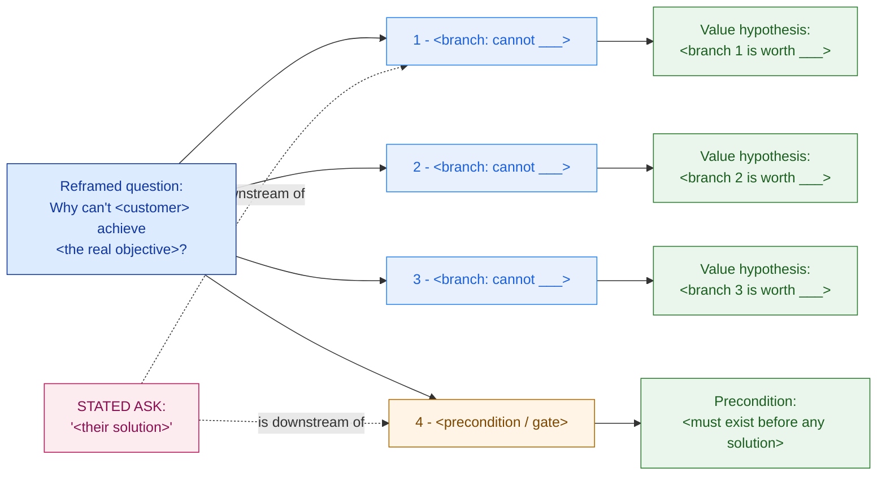

# Problem-Framing Canvas — Template

> Fill this in *before* discovery interviews and long before any design. It converts a stated ask (a symptom) into the real problems and what they're worth. If your eventual proposal repeats the words in the "stated ask" box, you haven't framed — you've transcribed. An executive should read the reframed scope; a colleague should be able to run discovery from the evidence column.

**Customer:** `<company>`  ·  **Industry:** `<industry>`  ·  **Prepared by:** `<SA name>`  ·  **Date:** `<YYYY-MM-DD>`
**Engagement / opportunity:** `<deal or project name>`  ·  **Version:** `<v0.1 draft>`

Legend: **feature** = a solution the customer named · **outcome** = the business result they actually pay for (time / cost / risk / revenue) · **MECE** = branches that don't overlap and together miss nothing · **hypothesis** = the likely answer, stated first, then tested.

---

## How to use this canvas

Work the six moves in order. Do not start from the customer's solution — start from what's actually wrong and what it costs.

1. **Capture** the stated ask verbatim and quarantine it (§1).
2. **Interrogate** it down to root cause with a why/so-what ladder (§2).
3. **Decompose** the reframed question into a MECE issue tree (§3).
4. **Value** each branch with a formula + assumptions + a sanity range — never a single number (§4).
5. **Test** — name the evidence that would confirm or deny each hypothesis (§4, last column).
6. **Reframe the scope** into one statement that replaces the stated ask (§5).

---

## 1. The stated ask (capture and quarantine)

> Write it in the customer's exact words. Label it a symptom, not the scope.

- **Stated ask (verbatim):** `"<exactly what they said>"`
- **Trigger / why now:** `<the event that created the ask — mandate, competitor, incident, audit>`
- **Who is asking / who pays / who can veto:** economic buyer `<name/role>` · champion `<name/role>` · skeptic-influencer `<name/role>`

## 2. Interrogate the ask (why / so-what ladder)

> Ask "why?" and "so what?" until you reach a business consequence. What *job* is this ask being hired to do?

```
"<stated ask>"
   └─ Why?  → <what they think it delivers>
        └─ Why can't they today?  → <the blocker / root cause>
             └─ So what?  → <the operational consequence>
                  └─ So what to the business?  → <cost / time / risk / revenue>
```

**Job-to-be-done (one line):** `<the user is hiring this to ___ in the context of ___>`

## 3. The MECE issue tree

> Reframed root question at the top; MECE branches below. Mark any cross-cutting *precondition* (governance, security, residency) — it gates the others and can't be skipped. Delete/add branches to fit.



### ASCII fallback (for docs/email that can't render Mermaid)

```
        RUNG 1 — STATED ASK          RUNG 2 — REFRAMED PROBLEM       RUNG 3 — BUSINESS VALUE
        (feature / symptom)          (the real, root problem)        (what it's worth, to whom)
   ┌────────────────────────┐   ┌──────────────────────────┐   ┌────────────────────────────┐
   │ "<their solution>"     │──▶│ <root problem>           │──▶│ <value + [buyer]>          │
   └────────────────────────┘   └──────────────────────────┘   └────────────────────────────┘

   MECE branches of the reframed question:
     1. <cannot ___>        →  worth <value band>
     2. <cannot ___>        →  worth <value band>
     3. <cannot ___>        →  worth <value band>
     4. <precondition/gate> →  no upside to bank; downside to avoid; blocks 1–3
```

**MECE self-check:** ☐ branches don't overlap (can work one without another) ☐ together they cover the whole ask (no fifth thing hiding).

## 4. The framing table (the core deliverable)

> One row per branch. Value must show a **formula + assumptions + a range**, never a lone number. FX note (if used): `<rate>`.

| # | Stated ask (feature) | Reframed problem (root cause) | Business value — currency + formula, assumptions, **range** | Value hypothesis (stated answer) | Evidence needed to confirm / deny |
|---|---|---|---|---|---|
| 1 | `<feature>` | `<root cause>` | `<cost/time/risk/revenue; formula; assumptions; low–high>` | `<the likely answer>` | `<the 1–2 facts that settle it>` |
| 2 | `<feature>` | `<root cause>` | `<…>` | `<…>` | `<…>` |
| 3 | `<feature>` | `<root cause>` | `<…>` | `<…>` | `<…>` |
| 4 | `<precondition>` | `<gate: governance/security/residency>` | `<risk framing — downside to avoid, not upside to bank>` | `<must-do before any solution>` | `<legal/compliance sign-off, current posture>` |

*Value discipline:* show the arithmetic, state every assumption, give a low–high band, and mark figures **illustrative — to validate in discovery** until evidence narrows them.

## 5. Reframed scope statement (the "so what")

> One paragraph that replaces the stated ask and threads into every later deliverable (discovery, HLD, BOM, proposal). Lead with the answer (Minto style).

> The customer's `<mandate/ask>` is not `<the stated solution>` — it is a **`<program/outcome>`** with `<n>` fundable outcomes (`<branch 1 value>`; `<branch 2 value>`; `<branch 3 value>`), gated by `<the precondition>`. The `<stated solution>` is the **`<visible capstone / downstream piece>`**, not the starting point. We propose to `<sequence: foundation first, capstone as proof>`.

## 6. Buyer value map (who to say what to)

| Buyer / role | What they fund on | Frame the value as… |
|---|---|---|
| Economic buyer `<CFO/…>` | budget, ROI, risk | `<cost saved + risk avoided, in their currency>` |
| Champion `<CIO/…>` | feasibility, sequencing | `<a buildable, staged path; the precondition handled>` |
| Skeptic-influencer `<CMO/head of ops/…>` | quality, safety, their team | `<their pain removed; no new risk to their domain>` |

---

*Worked example: see `example-nusantara-sehat-canvas.md` in this folder.*
