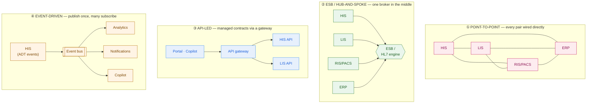
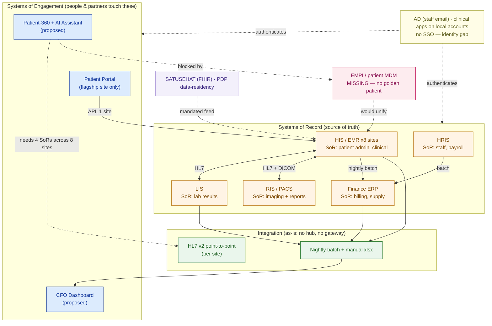

# Enterprise Applications & Landscape

> You can't integrate a system you can't name, or trust a fact whose real owner lives somewhere else. Learn the application families and who owns which fact — then map the customer's real portfolio before you promise anything.

**Type:** Learn
**Track:** AI, Data & Infrastructure Solution Architect (Presales)
**Prerequisites:** 1.1 Think Like a Consultant
**Time:** ~4h
**Lab:** —
**Ship It:** Application-landscape map

## The Problem

You are in a first discovery meeting with **Nusantara Sehat**, an Indonesian hospital group — 8 hospitals, 20 clinics, ~4,500 staff, ~1.2M patients a year. The CIO opens with the mandate every SA loves: *"We want an AI clinical assistant that shows any doctor a patient's full history in one view, plus a live dashboard so the CFO can see revenue across all sites."* You nod. In your head there's a tidy PoC: read "the patient database," wrap it in a vector store and an LLM, ship a slick unified view in eight weeks. You start sketching an integration to "the EMR."

Then you ask which system holds "a patient's full history" and the room goes quiet, because there is no such system. Demographics and admissions live in an aging **HIS** (hospital information system — the clinical operational core). Lab results live in a separate **LIS**. Images and radiology reports live in **RIS/PACS**. Outstanding bills live in the **finance/ERP**. Appointments live in a homegrown **patient portal**. And the real killer: each of the 8 hospitals runs *its own* HIS instance, with its own patient numbering — the same patient seen in Jakarta and Surabaya has two unrelated medical record numbers, and nothing ties them together. "One view" is not an integration to one system; it is six systems of record, eight silos, and a **master patient identity problem that nobody has solved**. Your eight-week PoC just became a multi-quarter program you already priced at PoC rates.

This is the failure mode of an SA who can't tell an ERP from an HIS, or name which system is the system of record for a given data domain. You propose integrations to systems that don't exist ("sync from the EMR" — which EMR, of eight?). You duplicate data that already has an owner, creating a second, *wrong* source of truth. You assume a manufacturer's mental model — *ERP is the center of the universe* — when in a hospital the transactional core of clinical work is the **HIS/EMR**, and the finance ERP owns a completely different domain. Lesson 0.1 gave you the layered stack and taught you that every fact has an owning system. This lesson zooms into two of those layers — ② **the applications** and ③ **the integration between them** — because mapping the customer's *actual application portfolio*, family by family and owner by owner, is the step that turns a fantasy scope into a winnable one.

## The Concept

### One page of application families

Enterprises don't buy "software"; they buy from a small number of **application families**, each of which owns a specific slice of the business and its data. Learn the families once and you can walk into any customer, hear a product name, and instantly know *what it must be doing* and *what it owns*. (0.1 taught that a capability is not the same as the app that delivers it — here we go one level deeper into the apps themselves.)

| Family | What it runs (the capability) | The data domain it **owns** (its SoR role) | Canonical vendors |
|---|---|---|---|
| **ERP** — Enterprise Resource Planning | Finance, procurement, inventory, orders, often HR | General ledger, AP/AR, stock, purchase & sales orders | SAP S/4HANA, Oracle Fusion, MS Dynamics, NetSuite, Infor |
| **CRM** — Customer Relationship Mgmt | Sales, marketing, service, customer engagement | Customer, lead, opportunity, case, quote | Salesforce, Dynamics 365, HubSpot |
| **SCM / APS** — Supply Chain / Planning | Demand & supply planning, logistics, warehousing | Forecasts, plans, shipments, stock movement | SAP IBP, Oracle SCM, Kinaxis, Blue Yonder, Manhattan |
| **MES** — Manufacturing Execution | Executing production on the plant floor | What *actually* happened: output, downtime, quality | Siemens Opcenter, Rockwell, AVEVA, GE Proficy |
| **HRIS / HCM** — Human Resources | Hiring, payroll, org, credentialing, rostering | Employees, positions, comp, time | Workday, SAP SuccessFactors, Oracle HCM |
| **BI / Analytics** | Reporting, dashboards, self-service analytics | *Nothing* — it reads copies; owns no truth | Power BI, Tableau, Qlik, Looker |
| **ITSM / Identity** | Service desk; who-can-do-what | Tickets; identities, roles, entitlements | ServiceNow; Entra ID, Okta, Keycloak |

Two rules make this table useful rather than trivia:

1. **Each family owns exactly one authoritative data domain.** ERP owns money and stock; HRIS owns employees; CRM owns the customer. When two systems claim the same domain, you have a *master-data conflict* — a finding, not a footnote.
2. **BI owns nothing.** It is a consolidated *copy* for analysis. An SA who proposes to "read the numbers from Power BI" is reading yesterday's aggregate, not today's truth. The CFO dashboard in our problem must ultimately trace back to the ERP and HIS, not to a spreadsheet export.

### Every horizontal family has a vertical name

Here is the insight that saves you in a specialized industry: **the same family shows up under a different name in every vertical.** The "ERP of a hospital" is not called an ERP — it's the HIS/EMR. The "MES of a hospital" (what actually happened to the patient, minute by minute) is also inside the HIS. Miss the translation and you'll look for an app that isn't there and ignore the one that runs the whole business.

| Horizontal family | Healthcare | Banking | Retail |
|---|---|---|---|
| **Transactional core (ERP-like)** | **HIS / EMR** — patient admin, orders, clinical record | Core banking system | Merchandising / POS + inventory |
| **Execution / "what happened"** | HIS clinical + **LIS**, **RIS/PACS** | Payments / transaction switch | Store ops / fulfilment |
| **Customer / engagement (CRM-like)** | **Patient portal**, patient CRM | Digital banking, CRM | Loyalty, e-commerce |
| **Finance ERP (back office)** | A *separate* finance/ERP | GL / treasury | Corporate ERP |
| **HR** | HRIS + clinician credentialing | HRIS | HRIS |

For Nusantara Sehat the healthcare-specific families you must know cold:

- **HIS** (Hospital Information System) — the operational backbone: registration, **ADT** (admission/discharge/transfer), order entry (CPOE), clinical documentation, pharmacy, billing capture. It is the ERP-and-MES of the hospital combined. SoR for patient administration and encounters.
- **EMR/EHR** (Electronic Medical/Health Record) — the longitudinal clinical record: problems, medications, allergies, results. Often a *module of* the HIS in older systems; the integrated whole in Epic/Cerner. SoR for clinical data. (EMR = one org; EHR = across orgs.)
- **LIS** (Laboratory Information System) — orders labs, drives the analyzers, returns results. SoR for lab results; feeds the HIS a copy.
- **RIS/PACS** — **RIS** owns the radiology workflow and report; **PACS** owns the actual images (large, DICOM). SoR for imaging.
- **Finance/ERP** and **HRIS** — the ordinary back-office families, owning money/supply and staff respectively. In a hospital these are *distinct from* the clinical core, which trips up SAs coming from manufacturing.

### Every fact in the enterprise has exactly one owner

Because each family owns exactly one domain, the single most useful thing you can produce in discovery is a list of *who owns which fact*. Recall from 0.1 the split between a **system of record** (owns the truth) and a **system of engagement** (a human touches it, owns no truth). Here that split becomes operational: for each data domain, name the one authoritative owner, and everywhere it is merely mirrored. Read truth from the owner; treat every mirror as stale until proven otherwise. This is the rule that stops an AI copilot from confidently answering out of a day-old copy.

### The integration layer, in depth

Lesson 0.1 named integration as "the layer rookies forget." Now name the *styles*, because which one a customer has determines what your solution can promise. There are four, and real estates mix them.



| Style | Coupling | Effort as apps grow | Freshness | Failure blast radius | Reach for it when… |
|---|---|---|---|---|---|
| **Point-to-point (P2P)** | Tight, brittle | **O(n²)** — a new app touches many | Whatever each link does | A broken link is local, but change ripples everywhere | Few apps, or a legacy estate that grew organically. **Warn** the customer: this is the spaghetti you'll be asked to untangle. |
| **ESB / hub-and-spoke** | Mediated by a central broker | Linear — apps connect once to the hub | Broker can transform & buffer | The **hub is a single point of failure** and a bottleneck | Classic on-prem enterprise with many systems and heavy transformation (in healthcare, an **HL7 integration engine** like Mirth/Rhapsody *is* the ESB). |
| **API-led (gateway)** | Loose, contract-first | Linear — each app exposes stable APIs | Real-time request/response | A down API affects only its consumers | Modern SaaS-ish estates, external partners, mobile/web front ends. The direction of travel for new build. |
| **Event-driven / streaming** | Loosest — producers don't know consumers | Add subscribers freely | Near real-time push | A slow consumer doesn't block producers | High-volume, real-time, many-consumer flows (ADT feeds, notifications, analytics, an AI copilot that reacts to events). |

Three healthcare specifics you must not miss, because they *are* the integration language of the domain:

- **HL7 v2** — the pipe-delimited messaging standard (`ADT^A01` for an admission, `ORU^R01` for a lab result) that wires HIS↔LIS↔RIS. Old, ugly, everywhere. Usually rides an integration engine (hub-and-spoke).
- **HL7 FHIR** — the modern REST/JSON API standard; the future, and what Indonesia's national **SATUSEHAT** platform mandates. API-led.
- **DICOM** — the imaging standard for PACS. Big binary objects, not rows.

The architect's takeaway: **the freshness and reliability a new solution can promise is capped by the integration style underneath it.** A "real-time patient 360" over an estate wired with nightly HL7 batch files is physically impossible without new integration — and naming that in the room is what separates you from the vendor who quotes eight weeks.

### Master data and identity — the cross-cutting problem

Two questions cut across the whole estate, and both are consequences of the one-owner rule:

- **Master Data Management (MDM):** when the *same real-world thing* exists in several systems (a customer in CRM and ERP; a **patient in eight HIS instances**), who reconciles them into one **golden record**? In healthcare, MDM of patient identity has a specific name — the **Master Patient Index (MPI)**, or **Enterprise MPI (EMPI)** across sites. No EMPI means no single patient — the exact wall Nusantara Sehat hits.
- **Identity & Access (IAM):** *workforce* identity — one login (SSO) across apps, roles, entitlements. Fragmented identity (each app its own password, clinical apps on local accounts) is both a security risk and a blocker: your new copilot needs a service identity that can reach across every silo.

Note the trap: **MDM (of patients/customers) and IAM (of staff) are two different master-data problems.** An EMPI unifies *whose data it is*; SSO unifies *who is allowed to see it*. A "unified patient view" needs both, and an SA who conflates them under-scopes one of them.

Here is the artifact that ties a family to its domain and its wiring — the **application ledger** you'll sketch on a whiteboard:

```
APPLICATION        FAMILY        OWNS (data domain / SoR)          TALKS TO (how)
──────────────────────────────────────────────────────────────────────────────────
HIS / EMR          HIS           patient admin, encounters, meds   LIS (HL7), RIS (HL7),
                                                                   ERP (batch), portal (API)
LIS                LIS           lab orders & results              HIS (HL7 ORU)
RIS + PACS         RIS/PACS      radiology reports + images        HIS (HL7), viewers (DICOM)
Finance / ERP      ERP           GL, AP/AR, supply inventory       HIS charges (batch)
HRIS               HRIS          employees, payroll, credentials   ERP (batch)
Patient portal     engagement    nothing — reads HIS               HIS (API, one site only)
Reporting          BI            nothing — copies everything       manual exports (xlsx)
── cross-cutting ─────────────────────────────────────────────────────────────────
EMPI               MDM           the golden PATIENT identity       (MISSING = the gap)
SSO / directory    IAM           the golden STAFF identity         (partial = the gap)
```

The ledger reads left-to-right the way discovery should: *name the app → name the one thing it owns → name how it connects.* Any row where the "owns" column is blank is a copy (fine, but never a source of truth); any cross-cutting row marked *missing* is where the real program hides.

## Design It

Let's map **Nusantara Sehat's** application landscape so the "patient-360 + CFO dashboard" ask can be scoped honestly. You are not designing the AI yet — you are drawing the portfolio it must live in. Work the steps in order.

### Step 1 — Inventory the application portfolio (name the family + the vertical name)

Ask "what systems do you run, and what does each one *do*?" — then tag each with its family so the vertical names stop being mysterious.

| Application | Family | Placement | Notes |
|---|---|---|---|
| **HIS / EMR** (aging, on-prem) | HIS | On-prem, **one instance per hospital** (×8) | The clinical core; EMR is a module of it |
| **LIS** | LIS | On-prem, per major site | Drives lab analyzers |
| **RIS / PACS** | RIS/PACS | On-prem; PACS storage-heavy | Some image sharing, mostly per-site |
| **Finance / ERP** | ERP | On-prem (group HQ) | Billing, AP/AR, medical-supply inventory |
| **HRIS** | HRIS | On-prem / partly SaaS | Staff, payroll, clinician credentialing |
| **Patient portal** (homegrown) | Engagement | Cloud | Appointments, results — **flagship hospital only** |
| **Spreadsheet reporting** | BI (de facto) | Local files | Monthly manual consolidation |

Immediately visible: the "one patient database" the CIO imagined is actually **8 HIS islands + a lab system + an imaging system**, and the reporting "system" is Excel.

### Step 2 — Assign data-domain ownership (the SoR ledger)

For each domain, name the single authoritative owner — and where you must *not* read it. This is the most valuable table in the map because it tells the future AI where truth lives.

```
DATA DOMAIN                    SYSTEM OF RECORD             DO NOT read this from…
──────────────────────────────────────────────────────────────────────────────────
Patient demographics / ADT     HIS  (per hospital!)         the portal (cached subset)
Clinical notes / orders / meds HIS-EMR (per hospital)       the reporting spreadsheet (stale)
Lab orders & results           LIS                          the HIS mirror (LIS is truth)
Imaging + radiology report     PACS (images) / RIS (report) the HIS (holds only a link)
Billing / charges / AR         Finance ERP                  the HIS (captures charges, not AR)
Medical-supply inventory       Finance ERP                  local spreadsheets
Employees / payroll            HRIS                         Active Directory (accounts only)
── the golden record nobody owns ──────────────────────────────────────────────────
Cross-site patient IDENTITY    NONE — no EMPI (the gap)     each HIS has its own MRN
```

The last row is the finding that reframes the whole deal: **there is no enterprise master patient index.** "A patient's full history in one view" is impossible until someone builds the EMPI that says *this MRN in Jakarta and that MRN in Surabaya are the same human.* That is master-data work, and it precedes the AI, not follows it.

### Step 3 — Build the integration matrix (who talks to whom, how, how fresh)

Draw the pairwise grid. Fill each cell with the mechanism and mark the empty cells — the gaps are as important as the links.

```
              │ HIS   │ LIS  │ RIS   │ ERP   │ Portal │ Report
──────────────┼───────┼──────┼───────┼───────┼────────┼────────
HIS           │   —   │ HL7  │ HL7   │ batch │  API*  │  xlsx
LIS           │ HL7   │  —   │   ·   │   ·   │   ·    │  xlsx
RIS / PACS    │ HL7 + │  ·   │   —   │   ·   │   ·    │   ·
              │ DICOM │      │       │       │        │
ERP           │ batch │  ·   │   ·   │   —   │   ·    │  xlsx
Portal        │ API*  │  ·   │   ·   │   ·   │   —    │   ·
Report (xlsx) │ xlsx  │ xlsx │   ·   │ xlsx  │   ·    │   —

legend:  HL7 = HL7 v2 point-to-point   batch = nightly file   API* = flagship site ONLY
         DICOM = imaging    xlsx = manual export    · = NO integration (a gap)
         cross-site HIS-to-HIS = entirely absent (8 islands)
```

Two structural truths fall out: integration is **point-to-point per site** (spaghetti, no hub, no gateway), and there is **no cross-hospital integration at all**. A real-time, cross-site copilot cannot be built on nightly batch files and eight disconnected HIS instances without a new integration layer.

### Step 4 — Flag the identity fragmentation (both kinds)

- **Patient identity (MDM):** no EMPI → 8 conflicting MRNs per patient → the single-view ask needs a patient-matching layer first.
- **Staff identity (IAM):** Active Directory exists for email/domain, but the HIS, LIS and RIS use **local accounts** with no SSO. A clinician has a different login per system, and any new copilot needs a service identity that can reach *into* each silo — a security review, not a checkbox.
- **National constraint:** Indonesia's **SATUSEHAT** platform mandates FHIR-based reporting to the Ministry of Health, and the **PDP law** (Personal Data Protection) constrains where patient data may live — so the new platform's data residency is a design input, not an afterthought.

### Step 5 — Draw the application-landscape map

Put it together. Engagement systems on top, records in the middle, integration and the missing master-data layer below, identity to the side.



Same discovery, a completely different proposal. Instead of "an eight-week patient-360 chatbot," you now scope: *a system of engagement that must integrate four systems of record across eight HIS silos, on top of a master-patient-index layer that does not yet exist, with SSO and SATUSEHAT/PDP constraints.* You've turned a vague ask into a staged, priceable, winnable program — and you found it all in five tables.

## Compare It

### The vendor stacks you'll actually meet

Recognizing the anchor tells you most of the estate before you ask. (0.1 covered SAP/Salesforce/Dynamics as horizontal anchors; here are the ones that matter for verticals and integration.)

| Stack | Anchors the estate around… | What it means for your integration story |
|---|---|---|
| **SAP / Oracle ERP** | The **ERP** as gravitational center (finance, supply, orders). | The financial SoR is here; integrate via OData/BTP or Oracle Integration. Respect that it guards transactional truth. |
| **Salesforce / MS Dynamics CRM** | The **customer**; Salesforce ships MuleSoft *as* its iPaaS. | Great APIs, SaaS-first. Watch the customer record drifting from the ERP's version — a classic MDM gap. |
| **Epic / Oracle Health (Cerner)** | An **integrated HIS+EMR** — one mega-system owning most clinical data. | Fewer seams *inside*, but a walled garden: integrate via its FHIR/HL7 endpoints. Contrast with Nusantara Sehat's best-of-breed sprawl. |
| **Best-of-breed HIS + LIS + RIS** (MEDITECH, InterSystems, local vendors + SATUSEHAT) | No single anchor — many systems glued by an **HL7 engine**. | This *is* Nusantara Sehat. Expect Mirth/Rhapsody-style engines, per-site variance, and heavy integration effort. |

### The integration style — when each wins a proposal

| Style | Pitch it when the customer needs… | The risk you must name |
|---|---|---|
| **Point-to-point** | Nothing new — it's what they *have*. | O(n²) brittleness; every change is a project. This is the problem, not the plan. |
| **ESB / integration engine** | Heavy transformation between many on-prem systems (classic HL7). | Central bottleneck + single point of failure; licensing and a team to run it. |
| **API-led (gateway)** | Partner/mobile/web access, stable contracts, incremental modernization. | Requires each system to expose (or be wrapped in) an API — a legacy HIS often can't natively. |
| **Event-driven / streaming** | Real-time, many-consumer flows (ADT feeds, alerts, an AI copilot, analytics). | Operational maturity; eventual-consistency thinking; not every legacy system emits events. |

### The "it depends" a customer will ask

*"Should we build the single patient view inside the HIS, or as a new layer on top?"* Your map answers it. Because the HIS instances are **systems of record with years of embedded clinical truth**, you don't rip them out — you integrate. But because there is **no owner** for cross-site patient identity, the honest recommendation is: build the missing master-data layer (an **EMPI**) and an **API/event layer** over the eight HIS instances first, then hang the AI patient-360 and the CFO dashboard off *that*. Sequence beats scope: the AI is Phase 2; the identity and integration foundation is Phase 1. That answer — and the estate evidence behind it — is what wins the room.

## Ship It

This lesson ships a reusable **Application-Landscape Map** — the application-and-integration inventory you produce right after the first discovery workshop, and the input to every later HLD, integration design, and migration plan. It is deliberately narrower and deeper than 0.1's whole-stack estate diagram: it drills into the **application portfolio, the data-domain ownership, and the pairwise integration matrix.** Both files live in [`outputs/`](../outputs/):

- **[`template-application-landscape.md`](../outputs/template-application-landscape.md)** — a fill-in-the-blank template: an application catalog (app × family × vertical × placement × owned domain), a system-of-record ledger, a pairwise **integration matrix**, MDM/identity notes, a Mermaid map skeleton, and a findings table. A colleague can run discovery straight from it.
- **[`example-nusantara-sehat-landscape.md`](../outputs/example-nusantara-sehat-landscape.md)** — the template fully worked for Nusantara Sehat, so the skeleton isn't abstract. It's the artifact you'd attach to the discovery report and reuse in the Phase 1 Discovery capstone.

The point of shipping this early: an application-landscape map that names every system, its owned domain, and its wiring is the cheapest credibility you'll buy in a healthcare deal. It says *we understood your portfolio before we sold you an AI.*

## Exercises

1. **(Easy)** Take Nusantara Sehat's application catalog from Design It Step 1 and label each application as a **system of record** or a **system of engagement**, and name the single data domain each SoR owns. Then write one sentence stating which four systems of record the patient-360 assistant must read from — and which *missing* cross-cutting layer blocks it.
2. **(Medium)** Re-map the template for a **mid-size retail bank** instead: list six applications, name the family and vertical name of each (hint: the **core banking system** is the ERP-equivalent SoR), mark the systems of record, and identify which integration style its estate most likely uses and why. Note where the MDM problem lives (customer identity across products) versus the IAM problem (staff access).
3. **(Hard)** Extend Nusantara Sehat's map into a **decision**: the group is debating whether to standardize all 8 hospitals onto a single new HIS (rip-and-replace) or keep them and build an EMPI + integration layer on top (integrate). Using the systems-of-record rule and the integration-style trade-offs from Compare It, write a half-page recommendation — replace vs integrate — naming the risk of each path, the sequencing, and the estate evidence behind your call. Save it beside your worked example; you'll reuse this reasoning in the Discovery capstone.

## Key Terms

| Term | What people say | What it actually means |
|------|-----------------|------------------------|
| Application family | "The software" | A category of enterprise app (ERP, CRM, SCM, MES, HRIS, BI) that owns one business+data domain. Learn the family and you know what any product in it must do. |
| ERP | "The finance system" | Enterprise Resource Planning — the transactional back office (finance, procurement, inventory, orders). Often the anchor SoR — but in healthcare it owns money/supply, *not* the clinical core. |
| HIS / EMR | "The hospital software" | Hospital Information System / Electronic Medical Record — the clinical operational core (admissions, orders, notes, meds). The ERP-and-MES of a hospital; the SoR for clinical data. |
| LIS · RIS/PACS | "The lab / imaging systems" | Vertical SoRs: LIS owns lab results, RIS owns radiology reports, PACS owns the images (DICOM). The HIS holds only copies or links. |
| System of Record (SoR) | "The database" | The single authoritative owner of a data domain. Every fact has exactly one; read truth from here, never from a BI copy. |
| Integration style | "The APIs" | How apps connect: point-to-point, ESB/hub, API-led gateway, or event-driven. The style caps the freshness and reliability any new solution can promise. |
| ESB / integration engine | "Middleware" | A central broker that mediates and transforms between many systems (in health, an HL7 engine like Mirth/Rhapsody). Turns O(n²) spaghetti into hub-and-spoke — at the cost of a bottleneck. |
| HL7 / FHIR / DICOM | "Health data standards" | The integration language of healthcare: HL7 v2 (legacy messaging), FHIR (modern REST/JSON, mandated by SATUSEHAT), DICOM (imaging). |
| MDM / golden record | "Data cleanup" | Master Data Management — reconciling the same real-world entity across systems into one authoritative record. In health, patient MDM = the MPI/EMPI. |
| MPI / EMPI | "Patient matching" | (Enterprise) Master Patient Index — the service that links a patient's many medical record numbers across sites into one identity. Its absence blocks any single patient view. |
| IAM / SSO | "Logins" | Identity & Access Management — one workforce identity, roles, and single sign-on across apps. Distinct from patient MDM: IAM governs *who may see*, MDM governs *whose data it is*. |

## Further Reading

- [HL7 FHIR — Overview](https://www.hl7.org/fhir/overview.html) — the modern healthcare interoperability standard; read the resource model so you recognize what "FHIR-based" actually buys a customer.
- [SATUSEHAT Platform (Indonesia MoH)](https://satusehat.kemkes.go.id/platform) — the national FHIR health-data exchange your Indonesian hospital customers must integrate with; a real constraint on any health-data design.
- [MuleSoft — What is API-led connectivity](https://www.mulesoft.com/resources/api/what-is-api-led-connectivity) — the clearest articulation of the API-gateway integration style and why it beats point-to-point at scale.
- [Gartner — Master Data Management (MDM) glossary](https://www.gartner.com/en/information-technology/glossary/master-data-management-mdm) — the vocabulary of golden records and single sources of truth you'll use to explain the EMPI gap.
- [IHE Profiles (PIX/PDQ, XDS)](https://www.ihe.net/resources/profiles/) — the recipes for patient-identity cross-referencing and document sharing; PIX/PDQ is EMPI in practice.
- [Martin Fowler — What do you mean by "Event-Driven"?](https://martinfowler.com/articles/201701-event-driven.html) — the canonical framing of the integration styles, at architect altitude.
