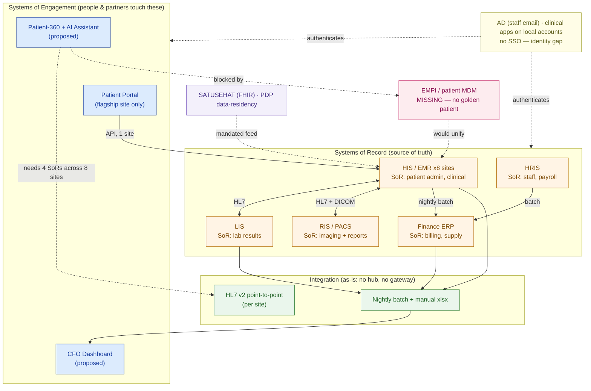

# Application-Landscape Map — Nusantara Sehat (worked example)

> This is `template-application-landscape.md` filled in for a fictional customer. It shows what "good" looks like: the application portfolio, who owns which fact, the integration matrix, and the two findings (no EMPI, no SSO) that turn a vague "one patient view" ask into an honest, staged, winnable program.

**Customer:** Nusantara Sehat (fictional)  ·  **Industry / vertical:** Healthcare — private hospital group
**Prepared by:** SA — Presales  ·  **Date:** 2026-07-04  ·  **Opportunity:** "Patient-360 + AI Assistant" and "CFO Dashboard"  ·  **Version:** v0.2

**Company shape:** 8 hospitals · 20 clinics · ~4,500 staff · ~1.2M patients/year. Aging on-prem HIS, siloed per site, weak integration, fragmented identity. Modernization + AI mandate; SATUSEHAT + PDP (data-residency) constraints.
**The ask (verbatim):** *"An AI clinical assistant that shows any doctor a patient's full history in one view, plus a live dashboard so the CFO can see revenue across all sites."*

---

## 1. Application catalog (name the family + the vertical name)

| Application | Family | Vertical name | Placement | Owned data domain (SoR role) | Owner / SME |
|---|---|---|---|---|---|
| HIS / EMR (aging) | ERP-equivalent core | **HIS** | On-prem, **1 instance per hospital (×8)** | **SoR** — patient admin (ADT), encounters, orders, meds | Clinical IT (per site) |
| LIS | LIS | **LIS** | On-prem, per major site | **SoR** — lab orders & results | Lab / Pathology |
| RIS / PACS | RIS/PACS | **RIS + PACS** | On-prem, storage-heavy | **SoR** — radiology reports (RIS) + images (PACS) | Radiology |
| Finance / ERP | ERP | finance ERP | On-prem (group HQ) | **SoR** — GL, AP/AR, medical-supply inventory | Finance |
| HRIS | HRIS | HRIS | On-prem / partly SaaS | **SoR** — staff, payroll, clinician credentialing | HR |
| Patient portal (homegrown) | Engagement (CRM-like) | patient portal | Cloud | none — reads HIS (**flagship site only**) | Digital team |
| Spreadsheet reporting | BI (de facto) | — | Local files | none — manual monthly copies | Finance analysts |

**Findings from the catalog:** the "one patient database" the CIO imagined is really **8 HIS islands + LIS + RIS/PACS**; two of the "obvious" data sources (portal, spreadsheets) own **no truth**; and the portal only serves one hospital.

## 2. System-of-record ledger (who owns which fact)

```
DATA DOMAIN                    SYSTEM OF RECORD             DO NOT read this from…
──────────────────────────────────────────────────────────────────────────────────
Patient demographics / ADT     HIS  (per hospital!)         the portal (cached subset)
Clinical notes / orders / meds HIS-EMR (per hospital)       the reporting spreadsheet (stale)
Lab orders & results           LIS                          the HIS mirror (LIS is truth)
Imaging + radiology report     PACS (images) / RIS (report) the HIS (holds only a link)
Billing / charges / AR         Finance ERP                  the HIS (captures charges, not AR)
Medical-supply inventory       Finance ERP                  local spreadsheets
Employees / payroll            HRIS                         Active Directory (accounts only)
── the golden record nobody owns ──────────────────────────────────────────────────
Cross-site patient IDENTITY    NONE — no EMPI (the gap)     each HIS has its own MRN
```

**Decomposing the ask** *"a patient's full history in one view"*:
- **Demographics + encounters** → HIS (of whichever hospital(s) saw the patient)
- **Lab results** → LIS
- **Imaging + reports** → RIS/PACS
- **Bills** → Finance ERP

→ Four systems of record — but **across up to 8 unlinked HIS instances**, and with **no EMPI** to say they're the same patient. The identity gap, not the AI, is the critical path.

## 3. Integration matrix (how the apps talk — today)

```
              │ HIS   │ LIS  │ RIS   │ ERP   │ Portal │ Report
──────────────┼───────┼──────┼───────┼───────┼────────┼────────
HIS           │   —   │ HL7  │ HL7   │ batch │  API*  │  xlsx
LIS           │ HL7   │  —   │   ·   │   ·   │   ·    │  xlsx
RIS / PACS    │ HL7 + │  ·   │   —   │   ·   │   ·    │   ·
              │ DICOM │      │       │       │        │
ERP           │ batch │  ·   │   ·   │   —   │   ·    │  xlsx
Portal        │ API*  │  ·   │   ·   │   ·   │   —    │   ·
Report (xlsx) │ xlsx  │ xlsx │   ·   │ xlsx  │   ·    │   —

legend:  HL7 = HL7 v2 point-to-point   batch = nightly file   API* = flagship site ONLY
         DICOM = imaging    xlsx = manual export    · = NO integration (a gap)
         cross-site HIS-to-HIS = entirely absent (8 islands)
```

**Dominant style:** `point-to-point` (per site) — no hub, no gateway, no events.  →  **Target style:** `API-led + event-driven` over an integration layer.

**Cap on freshness:** cross-site data reaches any shared place only via **manual monthly exports**; even within a site the ERP feed is **nightly batch**. A "live" CFO dashboard and a "real-time" patient-360 are impossible on today's plumbing — both need a new integration layer.

## 4. Master data & identity (the two cross-cutting problems)

- **MDM / golden record:** **no EMPI.** The same patient carries a different medical record number in each of the 8 HIS instances; nothing reconciles them. This is the master-data gap that blocks any single patient view.
- **IAM / SSO:** Active Directory exists for email/domain, but **HIS, LIS and RIS use local accounts** — no SSO. Clinicians juggle multiple logins; a new copilot needs a **service identity that can reach into each silo** (a security review, not a checkbox).
- **The trap avoided:** the EMPI (whose data it is) and SSO (who may see it) are **two** initiatives, not one — both are in scope.
- **Regulatory / residency:** **SATUSEHAT** (Indonesia MoH, FHIR) is a mandated feed — today only the flagship hospital submits, via a bolt-on adapter. The **PDP law** constrains where patient data may live, so residency is a design input for the new platform.

---

## 5. The application-landscape map



### ASCII fallback

```
   IDENTITY & MDM   no SSO (clinical apps local)  |  no EMPI (8 MRNs per patient)  ── spans all
   ─────────────────────────────────────────────────────────────────────────────────────────
   ENGAGEMENT   Patient Portal(1 site)   Patient-360 + AI(proposed)   CFO Dashboard(proposed)
   RECORD       HIS/EMR x8   LIS   RIS/PACS   Finance ERP   HRIS
   INTEGRATION  HL7 v2 point-to-point (per site)   ·   nightly batch + manual xlsx  (no hub)
   (data flows: SoRs ──batch/xlsx──▶ manual monthly consolidation ─▶ dashboards)
   external:    SATUSEHAT (FHIR, flagship only)  ·  PDP residency
```

---

## 6. Findings & implications

| # | Finding | Layer | Implication for the solution | Severity |
|---|---|---|---|---|
| 1 | No EMPI — one patient has 8 MRNs across sites | Master data | Build the **golden patient identity (EMPI)** before any "single view" | **High** |
| 2 | Integration is point-to-point per site; cross-site = none | Integration | "Real-time" / cross-site needs a **new API + event layer** | **High** |
| 3 | HIS/LIS/RIS on local accounts, no SSO | Identity | **SSO + service identity** across silos; security review | **High** |
| 4 | CFO reporting is manual monthly Excel | Data/Integration | "Live" dashboard needs SoR feeds, **not** spreadsheet copies | Medium |
| 5 | SATUSEHAT feed only from flagship; PDP residency | Compliance | FHIR/residency are **design inputs**, phased across sites | Medium |

**One-line scope statement:**
> The **Patient-360 + AI Assistant** is a *system of engagement* that must integrate **four systems of record** (HIS, LIS, RIS/PACS, ERP) across **8 HIS silos**, on top of a **master patient index that does not yet exist** and with **no SSO** — so the EMPI, the integration layer, and identity, *not* the chatbot, are the real drivers of effort, timeline, and price.

**So what (the pivot this map buys you):** instead of "an 8-week patient-360 chatbot," the honest, winnable program is staged —
- **Phase 1 (foundation):** stand up an **EMPI** + an **API/event integration layer** over the 8 HIS instances; roll out **SSO**; extend the SATUSEHAT/FHIR feed group-wide.
- **Phase 2 (the AI):** build the patient-360 assistant and the live CFO dashboard on that foundation, reading each fact from its true SoR.

You price it correctly and you win it because the customer sees you understood their application portfolio — and named the two gaps their previous vendor missed — before you sold them anything.
