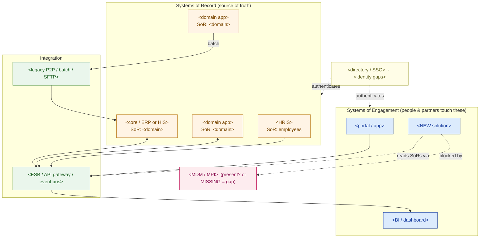

# Application-Landscape Map — Discovery Template

> Fill this in during (and just after) a discovery workshop, once you have the layered estate diagram from Lesson 0.1. Where the estate diagram shows *all six layers*, this map drills into two: the **application portfolio** and the **integration between apps**. An executive should read the map; an engineer should trust the tables.

**Customer:** `<company>`  ·  **Industry / vertical:** `<industry>`  ·  **Prepared by:** `<SA name>`  ·  **Date:** `<YYYY-MM-DD>`
**Engagement / opportunity:** `<deal or project name>`  ·  **Version:** `<v0.1 draft>`

---

## How to use this template

1. **Application catalog** — list every app; tag its **family** (ERP/CRM/SCM/MES/HRIS/BI…) and, in a vertical, its **vertical name** (e.g. HIS = the ERP-equivalent).
2. **System-of-record ledger** — for each data domain, name the single authoritative owner, and where NOT to read it.
3. **Integration matrix** — the pairwise grid: how each pair of apps talks today, and the empty cells (gaps).
4. **Master data & identity** — the two cross-cutting problems: MDM (golden record of customer/patient) and IAM (staff SSO). Name what's missing.
5. **Draw the map** — fill the Mermaid skeleton, then list the findings that reframe scope.

Legend for every table below: **SoR** = system of record (owns the truth) · **SoE** = system of engagement (a human touches it, owns no truth) · **MDM** = master data mgmt (golden record) · **IAM/SSO** = workforce identity.

---

## 1. Application catalog (name the family + the vertical name)

> List every system. If a "family" cell is blank you don't yet understand the app — go find out.

| Application (product) | Family | Vertical name (if any) | Placement (on-prem / SaaS / cloud) | Owned data domain (its SoR role) | Owner / SME |
|---|---|---|---|---|---|
| `<app>` | `<ERP/CRM/SCM/MES/HRIS/BI…>` | `<HIS, core banking, POS…>` | `<placement>` | `<domain, or "none — a copy">` | `<team>` |
| `<app>` | | | | | |
| `<…>` | | | | | |

*Findings to flag:* an app you **can't** assign a family to (unknown) · two apps claiming the **same** domain (master-data conflict) · a "reporting" system that is really a spreadsheet.

## 2. System-of-record ledger (who owns which fact)

> The most valuable table here: it tells any future solution — especially an AI copilot — where truth lives, and where it must never read.

```
DATA DOMAIN            SYSTEM OF RECORD        DO NOT read this from…
────────────────────────────────────────────────────────────────────
<customer / patient>   <app>                   <the wrong copy + why>
<financial / billing>  <app>                   <…>
<inventory / supply>   <app>                   <…>
<core operational>     <app>                   <…>
<employees / HR>       <app>                   <…>
── the golden record nobody may own ─────────────────────────────────
<cross-entity IDENTITY><NONE? / the MDM app>   <each app's local ID>
```

*Rule:* every fact has exactly **one** owner. A blank owner = a copy (never a source of truth). A `NONE` on the identity row = the master-data gap that usually precedes the whole program.

## 3. Integration matrix (how the apps talk — today)

> The pairwise grid. Fill each cell with the mechanism + freshness; mark empty cells as gaps (`·`). The gaps matter as much as the links.

```
             │ <appA> │ <appB> │ <appC> │ <appD> │ <appE>
─────────────┼────────┼────────┼────────┼────────┼────────
<app A>       │   —    │ <mech> │ <mech> │   ·    │  <mech>
<app B>       │ <mech> │   —    │   ·    │ <mech> │   ·
<app C>       │ <mech> │   ·    │   —    │   ·    │   ·
<app D>       │   ·    │ <mech> │   ·    │   —    │  <mech>
<app E>       │ <mech> │   ·    │   ·    │ <mech> │   —

legend:  API / FHIR = real-time contract    ESB/HL7 = brokered message
         event = pub/sub    batch = nightly file    SFTP = file drop
         · = NO integration (a gap)    * = one site / partial only
```

*Cap on freshness:* a new "real-time" solution can only be as fresh as the **slowest** hop between it and its systems of record. Point-to-point everywhere = spaghetti you'll be asked to untangle.

**Integration style in one word** (circle the estate's dominant style, and the target style):
`point-to-point`  ·  `ESB / hub`  ·  `API-led gateway`  ·  `event-driven`   →   target: `<style>`

## 4. Master data & identity (the two cross-cutting problems)

- **MDM / golden record:** which real-world entity (customer / patient / product) exists in many systems? Who reconciles it? `<name the MDM/MPI service, or "none — gap">`
- **IAM / SSO:** is there one workforce identity across apps, or per-app local logins? `<directory + which apps federate / which don't>`
- **The trap to avoid:** MDM (whose data it is) and IAM (who may see it) are **different** problems — scope both.
- **Regulatory / residency:** `<data-protection law, national platform mandate, where data may live>`

---

## 5. The application-landscape map (Mermaid skeleton)

> Replace the placeholders. Engagement systems on top, records in the middle, integration + any missing master-data layer below, identity to the side. Delete rows you don't need.



### ASCII fallback (for docs/email that can't render Mermaid)

```
   IDENTITY & MDM  <SSO status> | <MDM/MPI status> ──── cross-cutting, spans all apps
   ─────────────────────────────────────────────────────────────────────────────────
   ENGAGEMENT   <portal>   <NEW solution>   <BI / dashboard>
   RECORD       <core/ERP/HIS>  <domain app>  <domain app>  <HRIS>
   INTEGRATION  <ESB / API gateway / event bus>   ·   <legacy P2P / batch / SFTP>
   (data flows: SoRs ──batch/API/event──▶ analytics copy ─▶ dashboards)
```

---

## 6. Findings & implications (what the map tells us)

| # | Finding | Layer | Implication for the solution | Severity |
|---|---|---|---|---|
| 1 | `<e.g. no MDM/MPI — one entity, many IDs>` | Master data | `<must build golden record before the "single view">` | `<H/M/L>` |
| 2 | `<e.g. point-to-point only, nightly batch>` | Integration | `<"real-time" ask needs a new API/event layer>` | `<…>` |
| 3 | `<e.g. per-app local logins, no SSO>` | Identity | `<security review; service identity across silos>` | `<…>` |
| 4 | `<e.g. two apps claim the customer domain>` | Data | `<pick authoritative SoR; reconcile the copy>` | `<…>` |

**One-line scope statement (fill in):**
> The proposed `<solution>` is a **system of engagement** that must integrate `<n>` systems of record (`<list>`) across `<the key constraint: silos / missing MDM / integration style / identity>` — which is the real driver of effort, timeline, and cost.

**Sequencing note:** if the map reveals a missing master-data or integration foundation, say so — the foundation is usually **Phase 1**, the shiny solution **Phase 2**. Sequence beats scope.

---

*Worked example: see `example-nusantara-sehat-landscape.md` in this folder.*
