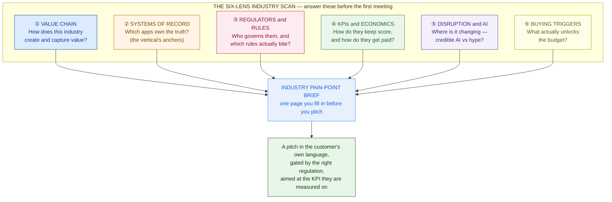
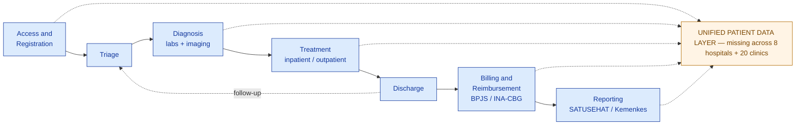

# Industry Domain Knowledge

> An SA who speaks only technology loses to one who speaks the customer's industry. "We do AI" dies in the room; "your HL7 interfaces and PDP duties mean X" wins it. Learn to read any vertical before you pitch a single feature.

**Type:** Learn
**Track:** AI, Data & Infrastructure Solution Architect (Presales)
**Prerequisites:** 1.2 Enterprise Applications & Landscape
**Time:** ~4h
**Lab:** —
**Ship It:** Industry pain-point brief

## The Problem

You are presenting to **Nusantara Sehat**, a fictional Indonesian hospital group — 8 hospitals, 20 clinics, ~4,500 staff, ~1.2 million patients a year — that wants to "modernize with AI." Your deck is gorgeous. You talk models, GPUs, vector databases, a slick clinical chatbot. Then the medical director leans in: *"How does this handle our INA-CBG coding so BPJS stops rejecting our claims? And where does the patient data physically sit — because under the PDP law we can't send it offshore."* You don't know what INA-CBG is. You say "we can integrate with anything, and it's all in the cloud." In the next room, a competitor opens with: *"Here's how we cut your 30-day readmissions and automate the SATUSEHAT reporting your teams do by hand every month."* They win the follow-up. Their technology is not better than yours. They spoke **healthcare**; you spoke **technology**.

This is the failure mode of the technology-fluent, industry-illiterate SA. Every vertical has its own **value chain** (how it makes money), its own **systems of record** (which apps own the truth), its own **regulators** (who governs it and which rules actually bite), its own **KPIs** (how executives are scored and how the business gets paid), and its own **buying triggers** (what unlocks budget). The vocabulary that builds trust in banking — *fraud, net interest margin, Basel* — is noise in a hospital. The words that matter in a hospital — *length of stay, readmission, reimbursement, patient safety* — are invisible to someone who only knows Kubernetes. A generic "we do AI" lands as a *threat*, not a solution: the buyer hears "another vendor who needs us to explain our own business to them for six months before they're useful."

You cannot become a doctor, a banker, and a plant manager. But you can learn any industry *fast enough to earn trust in the room* — if you carry a repeatable lens instead of starting from zero each time. This lesson gives you that lens: **six questions that decode any vertical in an afternoon**, and a one-page brief you fill in before every first meeting. We build the lens, run it across six industries at a glance, then go deep on healthcare for Nusantara Sehat — the running customer for the rest of Phase 1. By the end you will walk into a discovery call already knowing what to listen for, which regulation gates the architecture, and which AI use-cases are credible versus which are hype that will sink the deal.

## The Concept

Domain expertise is not a mystical thing that takes ten years. For an architect at *presales altitude*, it is a **structured scan** — the same six questions asked of any industry, answered well enough to design and to sell. You are not trying to out-doctor the doctor. You are trying to know enough that the doctor stops explaining their business and starts explaining their *problem*. Here is the whole lens on one page.



The six lenses, in the architect's own words:

1. **Value chain** — the sequence of activities by which the industry turns an input into a paid outcome: a manufacturer *designs → sources → makes → ships*; a hospital *registers → treats → discharges → bills*. Anchor every discovery here, because a customer's pain always sits on a specific link of *their* chain, not on "IT" in general.
2. **Systems of record** — the vertical's **anchor applications**, the ones that own the authoritative data. In manufacturing it's the ERP and MES; in banking it's the core banking system; in healthcare it's the EHR plus imaging and lab systems. Name the anchor and you've named 60% of the estate before you ask (this is the estate-mapping skill from 1.2, applied per-industry).
3. **Regulators and rules** — the bodies that govern the industry and the specific laws that *bite* your architecture: where data may sit, what must be audited, what a model is allowed to decide. This lens is where "cloud-first" quietly dies and "sovereign, on-prem, auditable" is born.
4. **KPIs and economics** — the numbers on the executive's scorecard *and* the model by which the business gets paid. If your solution doesn't move a KPI the buyer is measured on, it is a hobby. If you don't understand how they're reimbursed or earn revenue, you can't build an ROI they'll believe.
5. **Disruption and AI** — where the industry is being reshaped, and — critically — the honest split between **credible AI** (documented value, acceptable risk) and **hype** (a regulatory or safety landmine dressed as a demo). An SA who can name the hype is trusted more than one who promises everything.
6. **Buying triggers** — the event that turns interest into budget: a regulatory mandate with a deadline, a failed audit, a public incident, a competitor's move, a merger. No trigger, no urgency, no deal — you're educating, not selling.

### The same six lenses, six industries at a glance

Here is the scan run across the six verticals in this lesson's scope. This ASCII table is the one-screen cheat sheet — the *anchor system of record*, the *rule that bites*, and the *credible AI use-case* for each. Memorize the shape, not the details; the details you look up per deal.

```
 INDUSTRY        SYSTEM OF RECORD (anchor)     KEY REGULATION (what bites)      TOP CREDIBLE AI USE-CASE
 ─────────────────────────────────────────────────────────────────────────────────────────────────────────
 HEALTHCARE      EHR/EMR + PACS + LIS          patient-data privacy (HIPAA /    clinical documentation,
                 (in ID: SIMRS / RME)          PDP), HL7/FHIR interop, data     patient-flow, claim coding
                                               residency
 ─────────────────────────────────────────────────────────────────────────────────────────────────────────
 BANKING         core banking (T24, Finacle,   Basel III (capital), AML/KYC,    real-time fraud + AML
                 Mambu) + payment switch       central-bank rules (in ID: OJK), monitoring, credit scoring
                                               PCI-DSS
 ─────────────────────────────────────────────────────────────────────────────────────────────────────────
 MANUFACTURING   ERP + MES + OT historian      quality/safety standards (ISO    predictive maintenance,
                 (SCADA)                        9001, IATF 16949), OT security   vision quality inspection
                                               (IEC 62443)
 ─────────────────────────────────────────────────────────────────────────────────────────────────────────
 RETAIL          POS + OMS + e-commerce +      PCI-DSS (cards), consumer        demand forecasting,
                 merchandising                  protection + data privacy        personalization / recsys
 ─────────────────────────────────────────────────────────────────────────────────────────────────────────
 GOVERNMENT      national ID + benefits/tax    data sovereignty (onshore),      citizen service assistant,
                 registry                       procurement rules, transparency  benefits-fraud detection
 ─────────────────────────────────────────────────────────────────────────────────────────────────────────
 EDUCATION       SIS (student info) + LMS      student-data privacy (FERPA /    dropout early-warning,
                                               PDP), accreditation reporting    tutoring / personalized paths
 ─────────────────────────────────────────────────────────────────────────────────────────────────────────
```

Read across a row and you have the spine of a pitch. Read down a column and you learn something structural: notice that **the anchor system of record is different in every vertical** (which is why "we integrate with anything" is meaningless — *which* anchor?), and that **the regulation column, not the technology, decides the architecture** in the heaviest-regulated rows (healthcare, banking, and increasingly government). That single observation is what separates an industry-literate proposal from a template.

### The six industries, one scan each

The cheat sheet compresses each vertical to one row; here is the paragraph behind each row — enough texture to hold a conversation, no more. Notice how each industry has a *dominating characteristic* that reorganizes everything else around it.

- **Healthcare** — Value chain: *register → triage → diagnose → treat → discharge → reimburse → report*. The anchor is the **EHR/EMR** (plus PACS imaging and LIS lab), and the defining challenge is **interoperability** — health data must speak **HL7 v2 / FHIR** to move between systems. Regulation dominates: **patient-data privacy and residency** (HIPAA in the US, PDP-style laws elsewhere) plus **patient safety**, which together force a **human-in-the-loop** posture. The money is **reimbursement** (casemix/insurance), so coding accuracy is revenue. Credible AI: documentation, imaging triage, patient flow, claim coding. Hype: autonomous diagnosis.
- **Banking** — Value chain: *acquire → onboard (KYC) → transact → lend → collect*. The anchor is the **core banking system** (Temenos T24, Infosys Finacle, Mambu) plus a payment switch. Regulators are the **central bank** (OJK/Bank Indonesia locally), **Basel III** (capital adequacy), **AML/CFT + KYC**, and **PCI-DSS** for cards. The defining traits are **sub-second latency** (fraud must be caught at the swipe) and **explainability** (a declined loan must be defensible to a regulator). Paid via net interest margin and fees. Credible AI: real-time fraud, AML transaction monitoring, credit scoring, KYC document processing. Hype: unexplainable autonomous lending.
- **Manufacturing** — Value chain: *design → source → plan → make → quality → ship → service*. Anchors are the **ERP + MES**, and — the piece rookies miss — the **OT historian/SCADA** on isolated plant networks. The defining challenge is **OT/IT convergence** across a security boundary (**IEC 62443**); regulation is **quality and safety** (ISO 9001, IATF 16949 for automotive, GMP for pharma), not data privacy. The KPI is **OEE** (availability × performance × quality) plus downtime and yield. Because a model can close the loop on a machine *within safety limits*, more **autonomy** is credible here than in health or banking. Credible AI: predictive maintenance, vision quality inspection, demand forecasting, scheduling. Hype: a fully "lights-out" factory.
- **Retail** — Value chain: *merchandise/buy → stock → price → market → sell → fulfill → return → retain*. Anchors are **POS + OMS (order management) + e-commerce + merchandising/PIM**. The defining traits are **omnichannel** (one inventory, many channels, one customer) and **peak events** (Harbolnas 12.12, Black Friday) that make **elastic scale** a hard requirement, not a nice-to-have. Regulation is lighter — **PCI-DSS** for cards, consumer protection, and data privacy. KPIs: conversion, average order value, inventory turns, stockout rate, same-store sales. Credible AI: demand forecasting/replenishment, personalization/recommendations, dynamic pricing. Hype: 1:1 personalization with no data foundation underneath.
- **Government** — Value chain: *policy → service design → citizen identity → deliver → casework → benefits/payments → report*. Anchors are the **national ID and the tax/benefits registries**. Two constraints dominate: **data sovereignty** (citizen data stays in-country, often on national data-center infrastructure) and **procurement rules** (open tenders — e.g., LKPP in Indonesia — that shape *how* you sell as much as what). The landmine is **accountability and bias** in any automated decision that affects a citizen's rights. KPIs: service delivery time, citizen satisfaction, cost per transaction, benefits-fraud rate. Credible AI: citizen-service assistants, document processing, benefits-fraud detection, translation. Hype: opaque automated decisions on eligibility.
- **Education** — Value chain: *recruit → admit → enroll → teach → assess → credential → alumni/outcomes*. Anchors are the **SIS (student information system) + LMS** (Moodle, Canvas, Blackboard). Regulators are **student-data privacy** (FERPA in the US, PDP elsewhere) and **accreditation reporting** (e.g., PDDikti / BAN-PT in Indonesia). The scoreboard is **student outcomes and access**: enrollment/retention, completion/graduation, employability, cost per student, and equity of access. Buying triggers cluster around accreditation cycles and outcome-linked funding. Credible AI: dropout early-warning, personalized learning paths, admin chatbots, grading assistance. Hype: "AI replaces teachers" and academic-integrity overreach.

### Why the regulation lens dominates in enterprise deals

In a startup, features win. In a regulated enterprise, **the rule that bites wins**, and everything else is negotiated around it. A brilliant cloud AI platform is worth nothing to a hospital if its data-residency story fails the PDP law; a sub-second fraud model is worthless to a bank if it can't *explain* a declined loan to the regulator. So the discipline is: for each industry, find the one or two rules that constrain *where data lives, what must be auditable, and what a model may decide* — and design inward from those constraints. Get this lens wrong and no amount of KPI improvement saves the deal.

### Buying triggers: interest is not budget

The last lens is the one juniors skip and closers obsess over. A customer can love your architecture and never buy it, because nothing forces them to *this quarter*. Learn the triggers per industry: in healthcare, a **compliance mandate with a deadline** (adopt electronic records by date X; integrate to the national exchange) or a **failed accreditation** moves budget overnight. In banking, a **regulatory fine or a fraud incident**. In retail, a **peak event** that fell over (a 12.12 sale that crashed). In government, a **new administration's digital mandate** or an **audit finding**. When you can name the customer's live trigger, your proposal stops being "nice to have" and starts riding an existing wave of urgency.

### Where to find the answers fast (an afternoon, not a degree)

The scan only works if you can fill it quickly. Each lens has a reliable public source — you mine these before the meeting, then confirm with the customer:

| Lens | Fastest source | What you're looking for |
|---|---|---|
| ① Value chain | Analyst primers, a competitor's investor deck, industry association sites | The 5–7 activity steps and where the margin sits |
| ② Systems of record | The customer's **job postings** and past **RFPs/tenders** | "Experience with `<Epic / T24 / SAP MES>`" names their anchor for free |
| ③ Regulators & rules | The regulator's and standards body's own sites; a "`<industry>` compliance" search | The one or two rules that constrain data location and decisioning |
| ④ KPIs & economics | Annual reports, earnings calls, sector benchmark reports | The metrics executives repeat, and the revenue/reimbursement model |
| ⑤ Disruption & AI | Analyst "industry cloud" pages, vendor case studies, sector news | What's shipped in production vs what's still a slide |
| ⑥ Buying triggers | Press releases, regulatory calendars, the customer's own strategy statements | The mandate/deadline/incident creating urgency now |

The tell of an industry-literate SA is that they've read the customer's job ads and last tender before the first call. That's where the anchor system of record and the live pain hide in plain sight.

## Design It

Let's run the full scan on the running customer. **Nusantara Sehat** wants a "unified patient view, faster clinician access, and automated Ministry-of-Health reporting." Your job here is not to design the AI platform yet — it's to produce the **industry pain-point brief** that makes your later architecture *speak healthcare*. Work the six lenses in order.

> Note on regulatory specifics below: the Indonesian bodies and rules named (Kemenkes, BPJS, SATUSEHAT, INA-CBG, UU PDP, RME) are real regimes, used here at architect altitude to make the example concrete. On a live deal you confirm current thresholds and deadlines with the customer's compliance team — the *lens* is what's reusable, not the exact numbers.

### Step 1 — Map the healthcare value chain

Before any product name, draw how a hospital creates and captures value — the patient journey, end to end. Nusantara Sehat's pain will sit on specific links, and so will the credible AI.



Immediately you can see the customer's three asks map onto three parts of the chain: **unified patient view** = the data layer under every link; **faster clinician access** = the diagnosis/treatment links; **automated reporting** = the last link. Those are three *different* engineering problems wearing one "AI" label.

### Step 2 — Name the systems of record

Healthcare's anchor is the **EHR/EMR** — in Indonesian hospitals often a *SIMRS* (Sistem Informasi Manajemen Rumah Sakit) plus the mandated *RME* (Rekam Medis Elektronik / electronic medical record). Around it sit imaging (**PACS**), lab (**LIS**), and the pharmacy and billing modules. The estate-mapping discipline from lesson 1.2 applies per-domain:

```
DATA DOMAIN               SYSTEM OF RECORD              DO NOT read this from…
────────────────────────────────────────────────────────────────────────────────
Patient demographics      SIMRS / RME (per hospital)    a spreadsheet export (stale, no MPI)
Diagnoses and encounters  SIMRS / RME                   the billing system (coded, not clinical)
Imaging                   PACS                          the EHR (holds the report, not the image)
Lab results               LIS                           the EHR summary (may lag the LIS)
Claims and reimbursement  BPJS / INA-CBG billing        the EHR (clinical view, not the claim)
```

The finding that reframes the whole deal: **Nusantara Sehat runs a separate SIMRS instance per hospital.** There is no group-wide patient identity, so a patient seen at Hospital A is a stranger at Hospital B. "Unified patient view" is therefore a **master patient index + interoperability** problem *first*, and an AI problem second. That's the honest scope, and you found it in one table.

### Step 3 — Map the regulators and the rules that bite

This is the lens that decides the architecture. Four regimes gate the design:

| Regulator / rule | What it governs | What it does to your architecture |
|---|---|---|
| **UU PDP (Personal Data Protection Law)** | Health data is *specific/sensitive* personal data | Consent, minimization, audit trails; **sending patient data to an offshore LLM API is a landmine** |
| **Data residency (PP 71/2019 + sector rules)** | Where health data may physically sit | Pushes toward **in-country / on-prem or sovereign cloud**; kills a naive "just use a US region" |
| **SATUSEHAT (Kemenkes national exchange)** | Mandated **FHIR-based** interoperability + reporting | You must speak **HL7 FHIR**; this is also an *opportunity* — it standardizes the data you unify |
| **BPJS / INA-CBG** | National-insurance reimbursement via casemix coding | Claim accuracy is money; **AI-assisted coding** targets a real financial KPI |

The takeaway an architect writes down: **the data layer must be sovereign and FHIR-native, and any AI that touches patient data must run where PDP allows — not on an offshore API.** That single sentence rules out half the "easy" designs and is exactly what the medical director in *The Problem* was probing for.

### Step 4 — Find the KPIs and the money

Learn the hospital scoreboard so your ROI speaks their language, not yours:

| KPI | What it means | Where AI/data credibly moves it |
|---|---|---|
| **ALOS** (average length of stay) | Days per admission | Patient-flow and discharge-planning models |
| **30-day readmission rate** | Patients back within a month | Readmission-risk scoring at discharge |
| **BOR** (bed occupancy rate) | Utilization vs capacity (healthy band ~60–85%) | Capacity/flow forecasting |
| **Claim denial / pending rate** | % of BPJS claims rejected or held | AI-assisted **INA-CBG coding** at the point of billing |
| **Reporting turnaround** | Days to compile Kemenkes/SATUSEHAT reports | Automated report generation from the unified layer |

Notice the reimbursement model *is* a KPI: because BPJS pays via **INA-CBG casemix tariffs**, a mis-coded claim is delayed or denied revenue. "Improve coding accuracy" is not an IT nicety — it's cash flow. That's how you build an ROI a CFO believes.

### Step 5 — Separate credible AI from hype

The lens that earns the most trust is naming what *won't* work. For Nusantara Sehat:

```
 CREDIBLE (documented value, acceptable risk)     HYPE / LANDMINE (kills the deal)
 ──────────────────────────────────────────────   ──────────────────────────────────────────────
 Unified patient view via MPI + FHIR layer        "Autonomous AI diagnosis" — no ID regulatory
 Ambient / retrieval clinical documentation         clearance, patient-safety + liability risk
   (summarize history, draft notes,                "Just put patient records in ChatGPT" — breaks
    human-in-the-loop)                               PDP + data residency in one move
 Automated SATUSEHAT / Kemenkes reporting          "Real-time everything" when SIMRS instances are
 AI-assisted INA-CBG coding to cut denials           batch-integrated — freshness is capped by the
 Readmission-risk scoring at discharge               slowest hop (the lesson-1.2 rule, in health)
```

State the hype list *out loud* in the room. Saying "we would not put patient data in an offshore chatbot, and we would not let a model diagnose autonomously — here's the safe design instead" is the single most trust-building thing you can do with a medical director.

### Step 6 — Name the buying trigger

Interest is not budget. Nusantara Sehat's live triggers: the **RME electronic-records mandate** and the **SATUSEHAT integration requirement** are compliance deadlines with teeth, and **BPJS claim denials** are bleeding cash *now*. Your proposal should ride those waves — "this also gets you compliant with the reporting mandate and recovers denied claims" — not float free as a visionary AI project the CFO can defer. That framing is what turns a good architecture into a funded one.

### The pivot the brief buys you

Run the six lenses and the vague "modernize us with AI" ask resolves into an honest, sequenced scope — the difference between a pitch that wins and one that gets "let us think about it":

```
 PHASE 1  Sovereign FHIR data layer + master patient index across the 8 SIMRS instances
          → delivers the "unified patient view", satisfies residency, unlocks everything else
 PHASE 2  Automated SATUSEHAT / Kemenkes reporting + AI-assisted INA-CBG coding
          → rides the compliance trigger, recovers denied-claim revenue (the CFO's ROI)
 PHASE 3  Human-in-the-loop clinical copilot (retrieval over the unified record)
          → the "faster clinician access" ask, now safely on a sovereign, governed base
```

Instead of quoting "an AI chatbot", you scope a **sovereign, FHIR-native platform that is compliant and cash-positive before the copilot ever ships** — and you win because the customer sees you understood their regulators, their reimbursement, and their estate before you sold anything. That sequenced brief is the deliverable that makes every later artifact (the discovery report, the HLD, the BOM) speak healthcare from line one.

## Compare It

Here's the payoff that proves the lens is worth carrying: the **same reference architecture** — a unified, governed data platform with an AI assistant on top — is a completely different *sale* in each vertical. The boxes barely change; the language, the anchor it plugs into, the regulation that gates it, the KPI it moves, and the proof points all change. An SA who only knows the boxes gives the same dead pitch everywhere. An SA with the lens re-skins it per industry.

| What changes | **Healthcare** (Nusantara Sehat) | **Banking** | **Manufacturing** |
|---|---|---|---|
| **Call it…** | "Unified **patient** view + clinical copilot" | "Customer **360** + risk/fraud copilot" | "Unified **plant/asset** view + ops copilot" |
| **Plugs into (SoR)** | EHR/SIMRS, PACS, LIS, BPJS billing | Core banking, payment switch, cards | ERP, MES, OT historian/SCADA |
| **Rule that gates it** | PDP + data residency + FHIR interop | Basel, AML/KYC, OJK, model explainability | OT/IT segmentation (IEC 62443), safety/quality |
| **KPI you move** | Length of stay, readmission, claim denials | Fraud loss, NPL, straight-through processing | OEE, unplanned downtime, scrap/yield |
| **Proof point that lands** | "PDP-safe, FHIR-native, cuts INA-CBG denials" | "Sub-second scoring, explainable to the regulator" | "Reads the historian, lifts OEE, IT/OT-safe" |
| **Latency that matters** | Minutes (clinical context) | **Milliseconds** (fraud at swipe) | Seconds (line-side alerts) |
| **The buyer's fear** | Patient safety + a privacy breach | A fine + an unexplainable model | Downtime + an OT security incident |

The same "it depends" surfaces in every vertical, and the lens answers it: **"Should the AI be autonomous or assistive?"** In healthcare and banking the regulation forces **human-in-the-loop** (a model may *suggest* a diagnosis or a loan decline, not *make* it) — so you pitch a copilot, never an autopilot. In manufacturing, a model *can* close the loop on a machine within safety limits, so more autonomy is credible. Reading the regulation and KPI lenses tells you which posture to sell before the customer asks — and pitching autonomy into a vertical that legally forbids it is how a technically-superior solution loses to a "worse" one that respected the rule.

Vendors encode these differences into **industry clouds** for exactly this reason: Microsoft Cloud for Healthcare, AWS for Financial Services, SAP for manufacturing, Salesforce industry clouds. They are the same platforms pre-loaded with the vertical's data model, compliance controls, and connectors — a productized version of the lens you just ran by hand. Recognizing which industry cloud a customer leans toward tells you their anchor and their regulation posture before you ask.

## Ship It

This lesson ships a reusable **Industry Pain-Point Brief** — the one-pager you fill in before the first meeting in *any* vertical, and the artifact that makes your discovery, HLD, and proposal speak the customer's language from line one. Both files live in [`outputs/`](../outputs/):

- **[`template-industry-pain-point-brief.md`](../outputs/template-industry-pain-point-brief.md)** — a fill-in-the-blank template structured on the six lenses (value chain → systems of record → regulators → KPIs/economics → credible AI vs hype → buying triggers), plus a landmines list and a "so-what" that reshapes the pitch. Hand it to a colleague and they can scan a new industry in an afternoon.
- **[`example-nusantara-sehat-healthcare-brief.md`](../outputs/example-nusantara-sehat-healthcare-brief.md)** — the template fully worked for Nusantara Sehat's healthcare context, so the skeleton isn't abstract. It's the brief you'd attach to the discovery report and reuse across all of Phase 1.

The point of shipping this before any architecture: an industry brief that names the customer's own regulators, KPIs, and landmines is the cheapest credibility you'll ever buy. It says *we understood your business before we sold you our technology* — the exact thing the competitor in *The Problem* did and you didn't.

Treat the brief as a **living artifact**, not a one-shot. The first version is your pre-meeting hypothesis, filled from public sources (the table in *The Concept*); every discovery conversation confirms or corrects a lens, and the corrections *are* your findings. Two things make it compound:

- **It composes with the estate map from 1.2.** The industry brief gives you the *generic* lens for the vertical (what a hospital's systems of record and rules usually are); the estate map instantiates it for *this* customer (which SIMRS, which integrations, which gaps). Carry both into the Phase 1 Discovery capstone — the brief tells you what to expect, the estate map records what you actually found.
- **It seeds every downstream deliverable.** The KPIs you name become the ROI model's targets; the regulators become the risk register and the HLD's constraints; the credible-vs-hype split becomes the solution's scope boundary. Get the brief right and half of Phases 6–7 writes itself in the customer's own language.

## Exercises

1. **(Easy)** Take the six-industry ASCII table from *The Concept* and, for **retail**, write three sentences a discovery-call opener could use: name the anchor system of record, the regulation most likely to bite, and one credible AI use-case tied to a retail KPI (e.g., stockout rate or conversion). The goal is to sound like you've sold into retail before — without over-claiming.
2. **(Medium)** Run the full six-lens scan on a *different* vertical — a **mid-size bank** — using the template in `outputs/`. Fill in its value chain, systems of record, the two rules that most constrain the architecture, two KPIs, and the split between credible AI and hype. Then write the one-line "so-what": how would you *re-skin* Nusantara Sehat's "unified data platform + AI copilot" pitch for this bank, and which proof point changes?
3. **(Hard)** Extend the Nusantara Sehat brief into a **decision memo**. The customer asks: *"Can we just use a public cloud AI service for the clinical copilot?"* Using the regulators lens (PDP + data residency) and the credible-vs-hype split, write a half-page recommendation — sovereign/on-prem vs public-cloud AI — that names the specific rule that decides it, the one design that stays compliant, and the KPI trade-off of each path. Save it alongside your worked brief; you'll reuse this reasoning in the Phase 1 Discovery capstone and again when you size the AI platform in Phase 5.

## Key Terms

| Term | What people say | What it actually means |
|------|-----------------|------------------------|
| Industry domain knowledge | "Knowing the jargon" | A structured scan of a vertical's value chain, systems of record, regulators, KPIs, and buying triggers — enough to design and sell, not to *be* the practitioner. |
| Value chain | "Their business" | The ordered set of activities by which an industry turns inputs into a paid outcome (register→treat→bill for a hospital). You anchor discovery on a *link*, not on "IT". |
| System of record (per vertical) | "Their database" | The vertical's authoritative anchor app — EHR in health, core banking in banking, MES/ERP in manufacturing. Naming it names most of the estate. |
| Compliance regime | "Regulations" | The specific bodies and rules that gate an architecture — where data may sit, what's auditable, what a model may decide. In regulated verticals this, not the tech, dictates the design. |
| Reimbursement / economics | "How they charge" | The model by which the industry actually gets paid (casemix/INA-CBG in health, net interest margin in banking). If your ROI ignores it, no CFO believes it. |
| Credible AI vs hype | "Use cases" | The honest split between AI with documented value and acceptable risk, and AI that is a regulatory or safety landmine. Naming the hype builds more trust than promising it. |
| Buying trigger | "The requirement" | The event that unlocks budget now — a mandate with a deadline, a failed audit, an incident, a competitor move. No trigger, no urgency, no deal. |
| SATUSEHAT / FHIR | "The integration" | Indonesia's mandated FHIR-based national health data exchange; more broadly, HL7 FHIR is the interoperability standard health data must speak. A constraint *and* a lever. |
| INA-CBG | "The billing code" | Indonesia's casemix tariff system BPJS uses to reimburse hospitals; mis-coding delays or denies revenue, which is why AI-assisted coding targets real money. |

## Further Reading

- [HL7 FHIR — Overview](https://www.hl7.org/fhir/overview.html) — the interoperability standard modern health data speaks (and what SATUSEHAT is built on); read one page so "FHIR-native" isn't a bluff.
- [SATUSEHAT Platform (Indonesian Ministry of Health)](https://satusehat.kemkes.go.id/) — the national health-data exchange every Indonesian provider must integrate to; the concrete shape of the "reporting" ask.
- [Personal Data Protection Law (UU PDP) — overview](https://www.dataguidance.com/notes/indonesia-data-protection-overview) — Indonesia's PDP regime and why health data is treated as sensitive; the rule that gates the whole architecture.
- [Microsoft Cloud for Healthcare](https://www.microsoft.com/en-us/industry/health/microsoft-cloud-for-healthcare) and [AWS for Financial Services](https://aws.amazon.com/financial-services/) — two "industry clouds": the vendor-productized version of the lens this lesson teaches; skim to see which controls and connectors each vertical demands.
- [Porter — What Is Value Chain Analysis](https://hbr.org/) (Harvard Business Review) — the original value-chain frame behind lens ①; useful for talking about *where* on the chain a customer's margin and pain actually sit.
- [Gartner — Industry Cloud Platforms](https://www.gartner.com/en/information-technology/glossary/industry-cloud-platforms) — why "vertical-specific" beats "horizontal" in enterprise buying, and how to position against a customer already standardizing on one.
