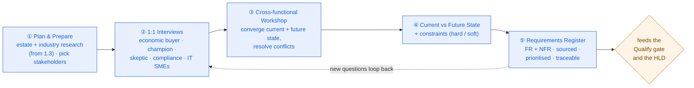

# Requirement Gathering & Discovery

> Discovery is a structured interview, not a demo — the deal is won or lost by the questions you ask, and the people you ask them of, *before* you draw a single box.

**Type:** Design
**Track:** AI, Data & Infrastructure Solution Architect (Presales)
**Prerequisites:** 1.3 Industry Domain Knowledge
**Time:** ~6h
**Lab:** —
**Ship It:** Discovery questionnaire + notes

## The Problem

You've done your homework. Lesson 1.3 taught you the healthcare domain — you walk into **Nusantara Sehat** (an Indonesian hospital group: 8 hospitals, 20 clinics, ~4,500 staff, ~1.2M patients a year) already knowing the industry pain points, the reporting burden, and the data-protection climate. The board has publicly said it wants a *clinician AI assistant*. Your champion, the **CIO**, is thrilled to see you, gives you a 90-minute meeting, walks you through the systems, and asks for a proposal in two weeks. It feels like momentum. So you do the thing that feels productive: you spend 60 of those 90 minutes demoing a slick assistant, take the CIO's wish list at face value, and go build a beautiful HLD.

Then the deal dies — quietly, and late. The **CFO** who actually signs the cheque never bought a business case, because nobody ever put a number on the problem. The **CMO** — a skeptical, respected clinician who can veto anything on patient-safety grounds — was never in the room, and quietly killed it in a hallway. The **compliance officer** surfaces, in week five, that Indonesia's personal-data law forbids sending patient data to a public LLM API offshore — a showstopper you designed straight past. And when the CFO finally asks "so how much time does this save?" you have no answer, because you never measured the *current state* — your "20% productivity gain" is a number you invented. You didn't lose on architecture. You lost on discovery.

Every one of those failures has a name, and they are the four classic discovery sins. You asked **leading questions** ("You'd want real-time dashboards, right?" — and fed them your answer instead of hearing theirs). You spent the meeting **talking, not listening** — a demo teaches the customer about you; discovery teaches you about the customer, and you did the wrong one. You **interviewed only the champion** — the friendliest, most available contact, who is almost never the person who signs or the person who can veto. And you built on **no current-state baseline**, so you cannot prove improvement against a number you never captured. Lesson 0.6 put Discovery on the map — the second stage of the presales lifecycle, feeding the Qualify gate, answering *"what's the actual problem, who owns it, and what is it worth?"* This lesson is the **how**: how to run discovery like a consultant instead of a vendor, so that by the time you design, you are designing to win.

## The Concept

Discovery has exactly one job: to leave the building knowing four things you can **write down and defend** — sourced from the *right* people, in *their* words, not yours. A demo surfaces none of them. Master these four, the people you get them from, and the questions that pull them out, and discovery stops being a chat and becomes an instrument.

### Discovery surfaces four things

| What you must leave with | The question behind it | What breaks if you skip it |
|---|---|---|
| **Current state** (as-is) | "How does this actually work *today*, and what does it cost you?" | No baseline → your future-state ROI is a made-up number you can't defend |
| **Future state** (to-be) | "What does 'good' look like, and how would you know you got there?" | You design *your* idea of the solution, not the outcome they'll pay for |
| **Constraints** (hard vs soft) | "What is non-negotiable — legal, technical, political, budget?" | A late "no" over a residency rule or a safety veto you could have known day one |
| **Decision process** | "Who decides, on what criteria, by when — and who can say no?" | You sell to the wrong person and a stakeholder you ignored sinks the deal |

Notice the split in constraints: **hard** constraints (a law, a data-residency rule, a clinical-safety requirement) bound the design absolutely; **soft** constraints (a vendor preference, a phasing wish) are negotiable. Confusing the two either over-constrains your design or walks you into a showstopper. Discovery's real skill is telling them apart *in the room*.

### Plan the discovery before you run it

Discovery is not a single meeting you improvise your way through; it's a small campaign you plan. Before the first interview you decide **who** you'll talk to (the stakeholder map, next), **in what order** (interviews before the workshop), **how many** (you can't interview all 4,500 staff at an 8-hospital group — you *sample*: one or two representative sites, a spread of roles, not a census), and **what each session must produce** (a filled section of the register, not a nice conversation). A tight plan is also a courtesy that buys trust: a customer who receives a one-page agenda naming the stakeholders you'd like, the topics per session, and the artifact you'll leave behind already believes you've done this before. The plan is stage ① of the flow at the end of this section — skip it and you arrive at interviews without a hypothesis, and leave with anecdotes instead of a baseline.

### Map the stakeholders before you script a single question

The single most expensive discovery mistake is interviewing only the champion. The champion is friendly, available, and wants you to win — which is exactly why they are a **biased, incomplete source**. They don't hold the budget (the economic buyer does), they can't clear the compliance veto (the officer can), and they don't feel the daily pain (the end users do). You map the cast first, then decide who to interview and in what format. The classic tool is the **power / interest grid** (Mendelow): plot every stakeholder by how much *power* they have over the decision and how much *interest* they have in the outcome.

```
                    INTEREST in the project  ─────────────────▶
                    low                                  high
                 ┌──────────────────────┬──────────────────────┐
        high     │   KEEP SATISFIED     │   MANAGE CLOSELY      │
      P          │   can veto — keep    │   your core deal      │
      O          │   on side, low noise │   partners; co-design │
      W          │   ← economic buyer,  │   ← sponsor/champion,  │
      E          │     compliance/legal │     senior influencer  │
      R  ────────┼──────────────────────┼──────────────────────┤
        low      │   MONITOR            │   KEEP INFORMED       │
                 │   minimal effort     │   they feel the pain; │
                 │                      │   win them in the PoC │
                 │                      │   ← end users, IT SMEs │
                 └──────────────────────┴──────────────────────┘
```

The grid tells you *how to spend your discovery time*: **Manage Closely** (top-right) get deep 1:1s and co-design; **Keep Satisfied** (top-left — the people who can say no but aren't yet engaged) get targeted interviews so their constraints land *early*; **Keep Informed** (bottom-right) get their voice heard and their trust won, usually in a workshop or the PoC; **Monitor** get a light touch. A stakeholder in the wrong quadrant of your attention is how deals die.

### Interview or workshop? Pick the format for the truth you need

The two formats surface different truths, and you sequence them.

| | **1:1 Interview** | **Group Workshop** |
|---|---|---|
| **Best for** | Candor — the skeptic, the economic buyer, the political read | Alignment — resolving conflicting versions of the future state |
| **Surfaces** | Private pain, real objections, who *really* decides | Shared current-state map, cross-functional dependencies, consensus |
| **Fails at** | Cross-team dependencies; one view of a shared process | Candor — nobody admits the real blocker in front of their boss |
| **When** | First — gather divergent truth from each stakeholder | Later — converge the divergent truths into one picture |

The rule: **interviews first, workshop later.** You cannot facilitate a useful workshop until you know, privately, where the disagreements and the vetoes are. A CMO will not voice a patient-safety doubt in a room with the CIO and the board; a CFO will not admit budget is soft in front of their team. Get that in a 1:1. Then bring the whole cast together to converge on a current-state map and a future-state everyone can live with.

### Ask open, listen hard, confirm closed

The mechanics of the interview itself. **Open questions** invite a story ("Walk me through how a doctor pulls a patient's history today"); **closed questions** confirm a fact ("So that's five separate logins?"); **leading questions** feed the answer and poison the well ("You'd want it fully automated, right?"). Run a **funnel**: open the topic, probe with *"tell me more"* and *"why does that matter?"*, then close to confirm what you heard.

| Question type | Example | Use it to… |
|---|---|---|
| **Open** | "What happens between a lab result and a treatment decision today?" | Surface the real workflow and unspoken pain |
| **Probing** | "You said that's frustrating — what does it cost you when it happens?" | Turn a symptom into an *implication* (and a number) |
| **Closed** | "Does that report get compiled by hand every month?" | Confirm a fact, pin down a baseline |
| **Leading** ✗ | "You'd obviously want real-time AI dashboards, wouldn't you?" | *Never.* You learn nothing; you hear your own idea echoed back |

And the discipline underneath the questions: **active listening.** Keep a 70/30 ratio — they talk 70% of the time. Use silence (people fill it with the thing they were holding back). Play back what you heard (*"so if I've got this right…"*) to confirm and to show you listened. Note the **loaded words** — "nightmare", "manual", "we gave up on" — those are where the value and the pain live. This questioning-to-value technique has a formal name, **SPIN** (Situation → Problem → Implication → Need-payoff), which you'll go deep on in **1.5 Presales Fundamentals**; for now, know that the *Implication* and *Need-payoff* steps are how a symptom becomes a funded project.

### Functional vs non-functional — where the deal actually dies

A **functional requirement (FR)** is *what the solution must do* ("summarise a patient's active problems"). A **non-functional requirement (NFR)** is *how well it must do it* — and NFRs are where rookies get slaughtered, because they're invisible in a demo and fatal in production. The customer will never volunteer them; you have to ask.

| NFR category | The discovery question | Why it kills deals if missed |
|---|---|---|
| **Performance** | "How fast is 'fast enough', and for how many users at once?" | An assistant that's slow on ward rounds is an assistant nobody uses |
| **Security / access** | "Who is allowed to see which patient, and how do you prove it?" | Wrong-patient data access is a breach *and* a clinical-safety event |
| **Compliance / residency** | "Where is patient data legally allowed to live and travel?" | A public-API design dies the day legal reads it |
| **Availability** | "What's the impact if it's down for an hour? A day?" | Over-engineer to 99.99% and you price yourself out; under-engineer and you break trust |
| **Auditability** | "What must you be able to reconstruct after the fact?" | Regulated estates need an answer trail, not just an answer |
| **Usability / adoption** | "What would make a busy clinician actually reach for this?" | The best architecture with no adoption is a failed project |

The architect's rule: **capture NFRs in discovery or inherit them as surprises in delivery.** In a regulated healthcare deal, three NFRs — *compliance/residency, security/access, and clinical safety* — are the ones that most often turn a signed deal into a disaster, so you hunt them deliberately.

### Capture everything as a requirements register that feeds the HLD

Discovery notes that live in your head are worthless. Everything you surface gets written into a **requirements register**: one row per requirement, each tagged **functional or non-functional**, each **sourced** to the stakeholder who raised it, each **prioritised** (MoSCoW: Must / Should / Could / Won't), and each pointing forward to the design decision it will drive. This forward-and-backward linkage is **traceability** — it's what lets you say, months later, *"we're building on-prem inference because the compliance officer stated data residency as a Must on 4 July,"* instead of *"I think someone wanted that."* The register is the artifact that feeds the Qualify gate (is this winnable?) and, downstream, the HLD (what must the design satisfy?).

Put the whole process on one page:



The dotted loop is the point lesson 0.6 made: **discovery never really stops.** The register is a living document you keep filling until Handoff.

## Design It

Run a discovery for **Nusantara Sehat**. You are not designing the AI assistant yet — you're running the structured interview that makes the eventual design honest. Work the five steps.

**The customer (recap):** 8 hospitals, 20 clinics, ~4,500 staff, ~1.2M patients/year. Aging, siloed estate — **HIS** (the hospital information system, locally *SIMRS*; patient admin + EMR), **LIS** (lab), **RIS-PACS** (radiology + imaging), **ERP** (finance, HR, pharmacy/supply), and a patient **portal** — stitched together with brittle HL7 v2 point-to-point interfaces. Ministry of Health (Kemenkes) reporting is compiled **by hand**. There's pressure to comply with **UU PDP** (Indonesia's personal-data-protection law) and to integrate with **SATUSEHAT** (the national FHIR-based health-data platform). **The ask, verbatim:** *"Give our doctors an AI assistant — ask it about a patient and get a straight, safe answer without digging through five systems."*

### Step 1 — Map the stakeholders (who, why, what format)

Before any questions, place the cast on the grid and decide how to spend your time.

| Stakeholder | Role in the deal | Power / Interest | What they care about | Format |
|---|---|---|---|---|
| **CFO** | **Economic buyer** — signs | High power / low interest (skeptical) | ROI, payback, capex vs opex, risk | 1:1 (Keep Satisfied → win) |
| **CIO** | **Sponsor / champion** | High power / high interest | A modern estate, a technical win, feasibility | 1:1 + co-design (Manage Closely) |
| **CMO** | **Clinician influencer** (skeptic, can veto) | High power / high interest (negative) | Patient safety, clinician trust, workflow fit | 1:1 first (Manage Closely) |
| **Compliance officer** | Can **veto** on UU PDP | Med-high power / med interest | Data residency, consent, audit, breach duty | 1:1 (Keep Satisfied) |
| **Hospital IT leads** | **Technical evaluators / SMEs** | Med power / high interest | Integration reality, uptime, support load | Workshop + async questionnaire |
| **Clinicians / nurses** | **End users** | Low power / high interest | "Does it make my day easier and safer?" | Workshop + PoC (Keep Informed) |

Filled onto the grid, the deal's real shape appears:

```
                    INTEREST  ───────────────────────────────▶
                    low                                    high
                 ┌──────────────────────┬──────────────────────┐
        high     │  CFO (economic buyer)│  CIO (champion)      │
      P          │  Compliance officer  │  CMO (skeptic —      │
      O          │  → KEEP SATISFIED    │       must be won)   │
      W          │    (either can veto) │  → MANAGE CLOSELY    │
      E  ────────┼──────────────────────┼──────────────────────┤
      R          │                      │  Hospital IT leads   │
        low      │  → MONITOR           │  Clinicians / nurses │
                 │    (none here)       │  → KEEP INFORMED     │
                 └──────────────────────┴──────────────────────┘
```

The immediate finding: your champion (CIO) is *not* your buyer (CFO) and *not* your biggest risk (CMO). If you'd interviewed only the CIO, you'd have missed both the person who funds it and the person who can kill it.

### Step 2 — Build the role-tailored question set

The core of the craft: **each stakeholder gets a different script**, tuned to what only they can tell you. A sample of each (open unless marked):

**CFO — economic buyer (find the metric and the money):**
- "What does a clinician's time cost you, and how much of it goes to hunting for information today?"
- "If this worked perfectly, what number on your board report moves — and by how much before it's worth funding?"
- "Is this capex or opex for you, and what's the payback horizon you'd defend?"
- *(closed, to confirm)* "So there's no approved budget line yet — it needs a business case first?"

**CIO — sponsor / champion (estate, feasibility, decision process):**
- "Walk me through how these five systems talk to each other today — really, not on the architecture diagram."
- "Where are you on SATUSEHAT integration, and does this need to ride that programme or run beside it?"
- "Who, besides you, has to say yes — and who can say no?"
- "What would make *you* confident enough to stake your name on this internally?"

**CMO — skeptical clinician (workflow, trust, safety — and here you mostly listen):**
- "Walk me through the last time information you needed about a patient was hard to get to."
- "What would an AI assistant have to *never* do for you to let it near your doctors?"
- "You sound cautious — tell me more about what you've seen go wrong with tools like this."
- *(never)* "You'd want it to auto-draft clinical notes, right?" — leading, and to a safety-minded clinician, alarming.

**Compliance officer (the non-negotiables):**
- "Under UU PDP, where is patient data allowed to be processed and stored — and where is it absolutely not?"
- "What must we be able to prove in an audit about who saw which record and why?"
- "What's your position on patient data reaching any service hosted outside Indonesia?"
- *(closed)* "So sending PHI to a public LLM API is off the table entirely?" — pin the hard constraint.

**Hospital IT leads (ground truth — often async):**
- "For each system — HIS, LIS, RIS-PACS, ERP — what version, what uptime, and how does data get in and out today?"
- "Where are the manual steps and the overnight batches everyone works around?"
- "What breaks most often, and what's your support headcount?"

Notice the pattern: the CFO's script is money-and-metric, the CMO's is workflow-and-trust (with you listening 70% of the time), compliance is hard-constraints, IT is factual current-state. **Same deal, five different conversations.**

### Step 3 — Capture the current state (the baseline you'll be measured against)

From the interviews and the IT workshop, you write down the as-is — with **numbers**, because the CFO's business case depends on them:

- A clinician answering one patient question typically opens **4–5 systems** (HIS, LIS, RIS-PACS, sometimes the portal), each with its own login.
- Estimated **8–12 minutes** of information-hunting per complex patient review; multiply across ~4,500 staff and the CFO suddenly has a number.
- Systems are integrated **point-to-point over HL7 v2**; no unified patient view; no FHIR layer yet.
- **Kemenkes reporting is manual** — roughly *5–7 FTE-days per hospital per month* compiling SIRS / RS Online submissions by hand.
- Identity is **fragmented** — separate accounts per system, no single sign-on across the estate.

That baseline is the anti-"I made up 20%" discipline. Every future-state claim now has something to be measured against.

### Step 4 — Capture future state + constraints (hard vs soft)

**Future state (to-be):** a clinician asks one assistant, in Bahasa Indonesia or English, and gets a **cited, safe** answer drawn from that patient's record, labs, and imaging reports — without opening five systems — with every answer traceable to its source and every access logged.

**Constraints, sorted — this is the step that saves the deal:**

| Constraint | Hard or soft? | Source | Implication |
|---|---|---|---|
| No PHI to public LLM API / offshore (UU PDP + residency) | **HARD** | Compliance officer | On-prem or sovereign-cloud inference; eliminates SaaS LLM vendors |
| Decision-*support* only — never autonomous clinical action | **HARD** | CMO | Human-in-the-loop, guardrails, "assistant not authority" |
| Per-clinician access control + full audit trail | **HARD** | Compliance + CMO | Access scoped to care relationship; break-glass logged |
| Must not disrupt SATUSEHAT integration roadmap | **HARD** | CIO | Align to FHIR; ride or run beside the national programme |
| Business case must show payback the CFO will defend | **HARD (commercial)** | CFO | Discovery must produce a real baseline (Step 3) |
| Prefer to extend the incumbent HIS vendor | **Soft** | CIO | A preference, negotiable — not a design constraint |
| Prefer a phased rollout (pilot one hospital first) | **Soft** | CMO | Actually helps you — de-risks with a safety-first PoC |

### Step 5 — Build the requirements register (what feeds the HLD)

Everything converges into one traceable table. A representative slice:

| ID | Requirement | Type | Source | Priority | Current-state gap | Feeds the HLD |
|---|---|---|---|---|---|---|
| FR-01 | Answer clinical questions over a patient's record, labs, imaging reports | FR | CMO, clinicians | Must | Data siloed across 4–5 systems | RAG over HIS/LIS/RIS with FHIR retrieval |
| FR-02 | Cite the source system + record for every answer | FR | CMO, compliance | Must | No provenance today | Answer-with-citations pattern; audit log |
| FR-03 | Bahasa Indonesia + English + clinical terminology | FR | CMO | Should | — | Model + eval set for both languages |
| NFR-01 | No PHI leaves Indonesia; no public LLM API | NFR (compliance) | Compliance officer | Must | N/A (new) | On-prem / sovereign inference; no external API |
| NFR-02 | Decision-support only; a human confirms every action | NFR (safety) | CMO | Must | N/A (new) | Guardrails, no write-back, disclaimer + review |
| NFR-03 | Access scoped per clinician–patient relationship; full audit | NFR (security) | Compliance, CMO | Must | Fragmented identity, weak audit | SSO + RBAC + immutable access log |
| NFR-04 | < 3s response for a patient summary, ~150 concurrent clinicians | NFR (performance) | CIO, clinicians | Should | N/A (new) | GPU sizing for concurrency (Phase 5) |
| NFR-05 | 99.5% availability in business hours (decision-support, not life-support) | NFR (availability) | CIO | Should | N/A (new) | HA design sized to *support*, not over-built |
| NFR-06 | Align to SATUSEHAT / FHIR R4 | NFR (interop) | CIO | Must | HL7 v2 point-to-point only | FHIR integration layer to the SoRs |

**So what — how discovery reshaped the deal.** The verbatim ask was "an AI assistant." What discovery actually scoped is *a system of engagement over regulated PHI that requires sovereign inference, a FHIR integration layer to four systems of record, per-clinician access control with audit, and a safety-first phased PoC to win the CMO* — with the **CFO's metric** (clinician time hunting for information) as the number that funds it, and the **compliance residency rule** found *before* you designed, not after. That is a completely different, and winnable, proposal — and you have a traceable register to prove every line of it.

## Compare It

Four discovery styles, and when each earns its place. You rarely use just one — you sequence them.

| Style / tool | What it's good at | Reach for it when… | Watch out for |
|---|---|---|---|
| **Consultative interviewing** | Candor, political read, deep pain — 1:1 | The deal is complex, multi-stakeholder, or political (this deal) | Slow; one view per conversation — you must synthesise across many |
| **SPIN-style questioning** | Turning a symptom into a funded need (Situation→Problem→Implication→Need-payoff) | You have the pain but not yet the *value case* — go deep in **1.5** | It's a *technique inside* an interview, not a separate meeting |
| **Design-thinking workshop** | Co-creating an ambiguous future state; building shared ownership | Greenfield; the future state is genuinely unclear; cross-functional buy-in matters | Can drift into blue-sky; anchor it to the current-state baseline |
| **Current-state assessment / as-is audit** | A rigorous technical baseline of a messy brownfield estate | The estate is siloed and poorly documented (this deal) | Time-box it, or it becomes a consulting project of its own |

For Nusantara Sehat you'd run **consultative interviews first** (get the CFO's metric, the CMO's veto, the compliance rule privately), a **current-state assessment** with the IT leads (baseline the estate — this also produces the systems-of-record ledger from lesson 0.1), then a **workshop** to converge on the future state, using **SPIN** inside every conversation to turn pain into value.

**The through-line: note-taking discipline and requirements traceability.** Whatever style you use, the output is only as good as your capture. The professional tool is a **requirements traceability matrix (RTM)**: every requirement links *backward* to the stakeholder and moment that sourced it, and *forward* to the design decision, and later the acceptance test that proves it. How heavy should traceability be? **Scale it to the deal.** A $20k transactional sale needs a notebook; a regulated, multi-hospital PHI platform needs a real RTM, because that traceability *is* your audit defence and your protection when a stakeholder later says "I never asked for that."

**The "it depends" a customer will actually ask:** *"Can't you just send us a questionnaire to fill in?"* Yes and no. A static questionnaire captures **answers, not follow-ups** — it can't hear the loaded word, ask "why does that matter?", or read the CMO's hesitation. So use the questionnaire as a **frame**, and run it as an **interview**. The purely factual current-state (system versions, uptime, interface list) is fine to gather **async** from the IT leads. The CFO's business case and the CMO's trust are won only in a **live conversation**. Knowing which is which is the judgement this lesson builds.

## Ship It

This lesson ships the **Discovery Questionnaire + Notes** kit — the artifact you run at the very top of every engagement, and the one that feeds the Qualify gate and the HLD. It also feeds **Capstone A (Discovery Simulation)** directly: you'll run this exact kit against a live scenario. Both files live in [`outputs/`](../outputs/):

- **[`template-discovery-questionnaire.md`](../outputs/template-discovery-questionnaire.md)** — the reusable kit: a stakeholder map + power/interest grid, a **role-based question bank** (economic buyer / champion / skeptic-influencer / compliance / technical SME), and a structured **notes + requirements-register** format (current state → future state → constraints → traceable FR/NFR register). Hand it to a colleague and they can run a disciplined discovery from it.
- **[`example-nusantara-sehat-discovery.md`](../outputs/example-nusantara-sehat-discovery.md)** — the kit fully worked for Nusantara Sehat, so the template is never abstract. It's the discovery pack you'd attach to the qualification review.

Four habits make the kit earn its keep:

1. **Fill the stakeholder map first.** You cannot script questions until you know who holds power, who holds the veto, and who you've been ignoring.
2. **Never let the champion be your only source.** The map exists to force you to talk to the buyer and the skeptic too.
3. **Capture current-state numbers, or your future-state ROI is fiction.** No baseline, no business case.
4. **Every requirement gets a source and a priority.** A requirement with no name attached is a rumour; one with no priority is a fight waiting to happen in delivery.

## Exercises

1. **(Easy)** Here are five discovery questions for Nusantara Sehat: *(a)* "You'd want the assistant to auto-write clinical notes, correct?" *(b)* "Walk me through how a doctor gets a lab result today." *(c)* "Is Ministry reporting done manually?" *(d)* "Surely data residency isn't a real blocker?" *(e)* "What would make you trust an AI assistant near your patients?" Label each **open / closed / leading**, rewrite the two leading ones as non-leading questions, and place all six named stakeholders on a power/interest grid.
2. **(Medium)** Swap the customer. Take **Meridian Regional Bank** from Phase 0 (a private AI assistant for call-centre agents, with a data-residency rule). Build a stakeholder map (name the economic buyer, champion, skeptic, compliance, and end users), write **three role-tailored questions each** for the economic buyer and the compliance officer, and produce a mini requirements register with **3 functional + 3 non-functional** requirements, each sourced and prioritised.
3. **(Hard)** Combine with lesson 0.1 (Enterprise IT Landscape). Run a **current-state assessment** for Nusantara Sehat that produces the *systems-of-record ledger* (which system owns patient demographics? lab results? imaging? billing?), then derive the **integration NFRs** the AI assistant needs to read each SoR safely (freshness, access scope, FHIR vs HL7 v2). Save it beside your worked discovery pack — you'll carry both into **Capstone A**.

## Key Terms

| Term | What people say | What it actually means |
|------|-----------------|------------------------|
| Discovery | "The kickoff meeting" | A structured interview process that surfaces current state, future state, constraints, and the decision process — *before* any design — from the right stakeholders, in their words. |
| Stakeholder map | "The org chart" | A deliberate plot of who has power and interest over the decision (Mendelow grid), used to decide who to interview, how deeply, and in what format. The champion is never your only source. |
| Current vs future state | "Where they are and where they want to be" | The as-is baseline (with numbers) versus the to-be outcome. Without a measured current state, every ROI claim is fiction you can't defend. |
| Functional requirement | "What it does" | A capability the solution must provide (summarise a record, cite a source). Visible in a demo. |
| Non-functional requirement (NFR) | "The technical stuff" | *How well* it must perform — speed, security, compliance, availability, auditability. Invisible in a demo, fatal in production; the customer never volunteers them, so you ask. |
| Leading question | "Just checking my assumption" | A question that feeds the customer your answer ("you'd want X, right?"). It teaches you nothing and echoes your own idea back — the fastest way to botch discovery. |
| Active listening | "Paying attention" | A 70/30 talk ratio, silence, playback, and noting loaded words — so the customer surfaces the pain and the metric themselves. Discovery is listening, not presenting. |
| Requirements register / traceability | "The notes" | One row per requirement, each tagged FR/NFR, sourced to a stakeholder, prioritised (MoSCoW), and linked forward to a design decision. The audit-proof artifact that feeds the Qualify gate and the HLD. |
| Hard vs soft constraint | "The requirements" | Hard = non-negotiable (a law, a residency rule, a safety veto) and bounds the design; soft = a preference, negotiable. Confusing the two either over-constrains you or walks you into a showstopper. |

## Further Reading

- [Neil Rackham — *SPIN Selling*](https://www.mheducation.com/highered/product/spin-selling-rackham/M9780070522558.html) — the questioning technique (Situation, Problem, Implication, Need-payoff) that turns a surfaced symptom into a funded need; you preview it here and go deep in 1.5.
- [Mendelow's power–interest grid (stakeholder analysis)](https://www.mindtools.com/aol0rms/stakeholder-analysis) — the two-by-two you used to map the Nusantara Sehat cast; learn it once and you'll never again interview only the champion.
- [BABOK Guide — Elicitation & Collaboration (IIBA)](https://www.iiba.org/career-resources/a-business-analysis-professionals-foundation-for-success/babok/) — the business-analysis body of knowledge on interviews, workshops, and requirements elicitation; the formal backbone of this lesson.
- [ISO/IEC 25010 — Systems and software quality models](https://iso25000.com/index.php/en/iso-25000-standards/iso-25010) — the canonical taxonomy of non-functional requirements (performance, security, reliability, maintainability); use it as your NFR checklist so nothing gets missed.
- [SATUSEHAT Platform — Indonesian Ministry of Health (Kemenkes)](https://satusehat.kemkes.go.id/platform) — the national FHIR-based health-data platform any Indonesian hospital solution must align to; the interoperability constraint you surface in discovery.
- [Indonesia Personal Data Protection Law (UU PDP No. 27/2022) — overview](https://iapp.org/resources/article/indonesias-personal-data-protection-law/) — the residency and consent rules that make "no PHI offshore" a hard constraint, not a preference; the showstopper discovery must catch early.
