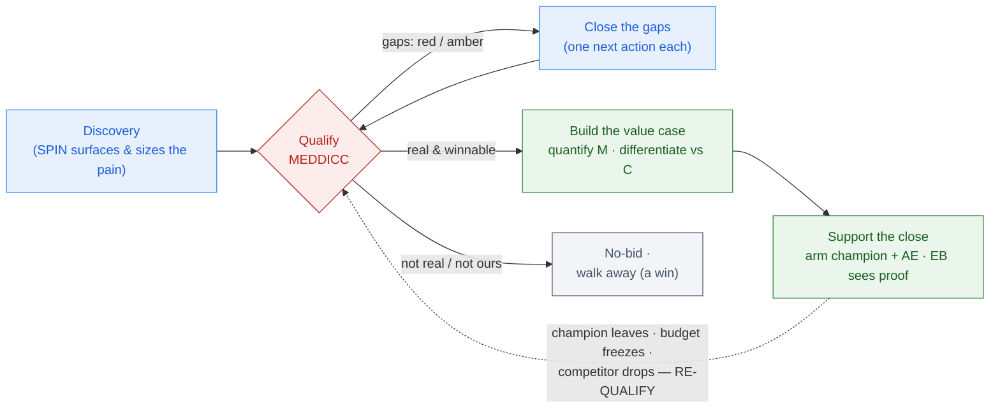
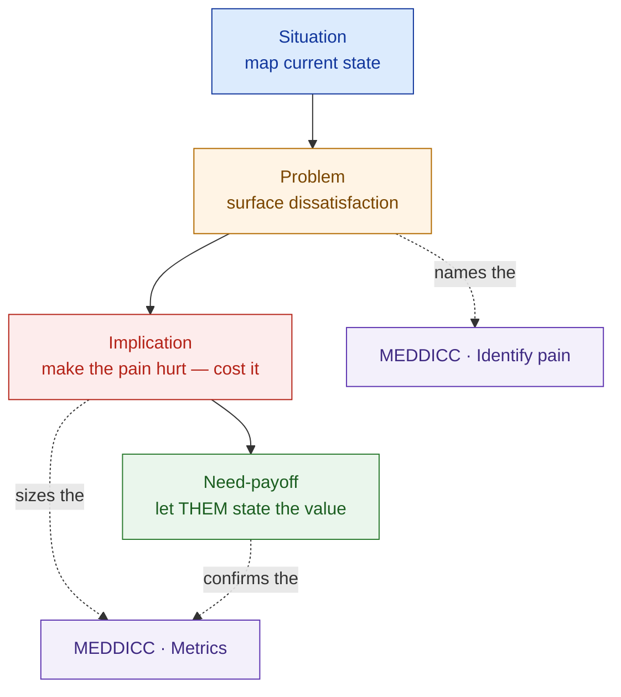

# Presales Fundamentals

> A flawless design loses a deal that was never qualified. Learn why a deal is real, where the value is, and when to walk — before you draw a single box.

**Type:** Learn
**Track:** AI, Data & Infrastructure Solution Architect (Presales)
**Prerequisites:** 1.4 Requirement Gathering & Discovery
**Time:** ~4h
**Lab:** —
**Ship It:** MEDDICC qualification sheet

## The Problem

An RFP from **Nusantara Sehat** — a fast-growing Indonesian hospital group modernising with AI — lands on your desk. It's real: named sponsor, a live procurement process, a modernisation budget everyone in the region is chasing. The CIO, who requested the follow-up, is genuinely excited. He walks you through the pain in the first meeting: patient data is fragmented across a dozen systems, compliance reporting is done by hand and takes weeks, and the new Indonesian **PDP** (Personal Data Protection) law has turned that manual process into a standing risk. You leave energised. Over the next ten weeks you and your account executive build a beautiful response — a unified patient-data platform, an AI layer for clinician access, automated compliance reporting, all data resident in-country. The architecture is, frankly, excellent.

You lose. Not to a better architecture — to **no decision**. The procurement process quietly stalls, the budget "moves to next cycle," and eighteen months of momentum evaporate. When you do the post-mortem, the cause isn't technical at all. The **CFO** — the person who actually controls the money — never saw a quantified business case; she heard about your solution second-hand from an enthusiastic CIO and had no number to defend it with at the board. The **CMO** had private doubts about whether clinicians would trust an AI-surfaced record, and nobody ever addressed her, so she never said yes and never had to say no. A **rival integrator** had been shaping the requirements for two quarters before you arrived. And the strongest competitor of all — **"do nothing"** — won, because you never made the cost of inaction hurt. Your design was perfect. Your *deal* was never qualified.

This is the single most expensive failure mode in presales, and it has nothing to do with technology. It comes from a handful of predictable mistakes: **happy ears** (mistaking the CIO's enthusiasm for budget and authority), **single-threading** (betting the whole deal on one champion and never reaching the economic buyer), **no quantified value** (selling a solution instead of a return the CFO can bank), and **ignoring "do nothing"** (forgetting that most enterprise deals are lost to inertia, not to a rival). An SA who can't qualify a deal spends months designing for RFPs that were never winnable — and their scarce, revenue-bearing time is the most expensive resource on the deal team. This lesson installs the discipline that stops the bleeding: how to tell whether a deal is *real* and *worth winning* before you invest a single hour of design. Phase 0's operating-system lesson (0.6) previewed MEDDICC and the RFx family; lesson 1.4 previewed SPIN; here you go deep and actually run them.

## The Concept

Four ideas carry this lesson: **what you're actually selling** (value, not features), **how you qualify** (MEDDICC), **how you surface the pain that qualification needs** (SPIN), and **where the SA sits** in all of it — qualifying and building the business case without ever carrying the quota.

### 1. Feature selling → solution selling → value selling

The most common reason a technically strong SA loses is that they sell the *thing they built* instead of the *return the buyer gets*. There is a ladder here, and only the top rung reaches the person who signs the cheque:

```
   FROM FEATURES ─────────────────────────────────────▶ TO VALUE
   ────────────────────────────────────────────────────────────
   FEATURE selling   "We have a lakehouse with real-time CDC
                      and an AI copilot."            ← spec sheet
                             │  buyer thinks: "so what?"
                             ▼
   SOLUTION selling  "We unify your fragmented patient data
                      and automate PDP reporting."   ← use case
                             │  buyer thinks: "sounds useful…"
                             ▼
   VALUE selling     "Cutting reporting from ~3 weeks to ~2 days
                      reclaims roughly Rp 600M/yr of analyst time
                      and shrinks PDP penalty exposure — a return
                      the CFO can weigh against the cost."  ← metric
                             │  economic buyer thinks: "fund it."
   ────────────────────────────────────────────────────────────
   Features impress the technical evaluator. VALUE — a quantified
   outcome tied to the buyer's own metric — wins the ECONOMIC BUYER.
```

**Value selling** = an outcome plus a *quantified* number, tied to a metric the buyer already tracks. It is the difference between "our platform is faster" and "this recovers Rp 600M a year and removes a compliance risk the board is already worried about." Everything downstream — the proposal, the exec summary, the demo — is only as strong as the value case underneath it. Note the altitude: quantifying that value *is the SA's job*, and it's the through-line of this whole lesson.

### 2. MEDDICC — the qualification framework

**Qualification** answers one question: *should we invest our (expensive) time chasing this deal — is it winnable and worth winning?* For large, multi-stakeholder, long-cycle deals — exactly the presales SA's world — the standard is **MEDDICC**: seven elements you fill in, rate, and keep current across the whole cycle. (MEDDIC has one C — Champion. **MEDDICC adds a second C — Competition**. A common variant, MEDDPICC, adds **P** for the paper/procurement process.)

| Letter | Element | The question it forces you to answer | Primary owner | The SA's move |
|---|---|---|---|---|
| **M** | Metrics | What is the quantified business value, in the buyer's own numbers? | **Shared — SA leads** | Build the ROI/value case; turn pain into Rp |
| **E** | Economic buyer | Who controls the money and can say the final yes? | AE (relationship) | Give the AE an EB-grade business case; ensure the EB sees *proof*, not hearsay |
| **D** | Decision criteria | What technical + business + vendor criteria will they judge on? | Shared | Own & shape the *technical* criteria toward your differentiators |
| **D** | Decision process | What are the actual steps, approvals, and dates to a signature? | AE | Learn it to time the PoC/demo; flag the paper/security/legal process |
| **I** | Identify pain | What is the compelling business pain, and what event forces action? | Shared — SA surfaces | Quantify the pain; tie each one to a metric and an owner |
| **C** | Champion | Who sells for you internally, has power, and wins personally if you win? | AE (relationship) | *Arm* the technical champion with proof and a business case |
| **C** | Competition | Who else is in the deal — including **"do nothing"**? | Shared | Own technical differentiation; build the cost-of-inaction case |

The two elements SAs most often skip are the ones that lose deals: **Metrics** (no quantified value → the economic buyer has nothing to defend) and **Competition** (forgetting that *"do nothing"* is a competitor and usually the strongest one). A disciplined SA treats a MEDDICC sheet with red or blank in those rows as a signal to *close the gap before designing*, not to start drawing.

### 3. The qualify → value → close loop

Qualification isn't a one-time form you fill at the start; it's a loop you re-run whenever the deal changes. You qualify, you find gaps, you close them, you re-qualify — and only when the deal is real do you invest in building and defending the value case:



The gate is **Qualify**, and a clean **no-bid** is a valid, valuable outcome — it frees the weeks you'd otherwise pour into a demo that never mattered. Notice where the SA lives: everything green (build the value case, support the close) is the SA's altitude; the AE still owns the relationship, the number, and the signature.

### 4. SPIN — the questioning technique that surfaces (and sizes) the pain

MEDDICC tells you *what* you need to know; **SPIN** is *how* you draw it out in discovery. It's a sequence of question types, not a scorecard — and its back half is where value quantification actually happens:

| Type | You ask about… | Example (Nusantara Sehat) | Feeds MEDDICC |
|---|---|---|---|
| **S — Situation** | Current-state facts | "How many systems hold patient data today? How is the PDP report produced?" | Context |
| **P — Problem** | Difficulties & dissatisfactions | "Where does the fragmentation cause errors or delays?" | **I** (pain) |
| **I — Implication** | The *cost* of the problem | "What does a 3-week reporting cycle cost you? What's your PDP penalty exposure if an audit finds gaps?" | **M** (metrics) |
| **N — Need-payoff** | The *value* of solving it | "If clinicians saw the whole record in seconds and reporting ran in a day, what would that be worth?" | **M** (metrics) |



The rookie stops at **S** and **P** ("tell me about your systems") and produces a discovery note full of facts and no leverage. The pro pushes to **I** and **N** — letting the *customer* articulate the cost and the payoff — because a number the buyer says out loud is a number you can put in front of the CFO. **Implication and Need-payoff questions are how you turn a MEDDICC "Metrics: amber" into "Metrics: green."**

### 5. The MEDDICC scorecard — RAG at a glance

The whole point of MEDDICC is a one-glance read of *where the deal is soft*. Rate every element **R**ed / **A**mber / **G**reen and the gaps jump out:

```
   MEDDICC QUALIFICATION SCORECARD          RAG legend
   Deal: <name>   ·   Verdict: <bid/no-bid>  [G] known / strong
   ─────────────────────────────────────    [A] partial / at-risk
   ELEMENT               RAG  ONE-LINE       [R] missing / blocked
   ─────────────────────────────────────────────────────────────
   M  Metrics           [ ]   <quantified value in the buyer's #s?>
   E  Economic buyer    [ ]   <who signs — and have they seen proof?>
   D  Decision criteria [ ]   <what they score on + the weighting?>
   D  Decision process  [ ]   <steps · committee · dates · paper?>
   I  Identify pain     [ ]   <the pain + the compelling event?>
   C  Champion          [ ]   <has power · sells for you · tested?>
   C  Competition       [ ]   <rivals + "do nothing" + your edge?>
   ─────────────────────────────────────────────────────────────
   RULE: any [R] on E, Decision process, or Champion caps the whole
   deal at AMBER — do NOT invest in a full PoC until it clears.
```

That last rule is the discipline this lesson exists to build: a red on *who signs*, *how the decision is made*, or *who sells for us inside* is a stop sign, no matter how green the technology looks.

### 6. The SA supports the AE — and never carries the quota

Everything above only makes sense once you're clear on *whose job this is*. A deal is a **pairing**: the account executive (AE) owns the commercial relationship, the number, and the close; the solution architect (SA) owns the **technical win** — is it real, what's it worth, will it work, and can we defend it. The SA contributes the heaviest lifting on **Metrics** (the value case), the **technical Decision criteria**, and **Competition** (differentiation and the cost-of-inaction case), and *arms* the champion — but the AE still carries the quota.

```
   THE DEAL IS A PAIRING — TWO OWNERS, ONE OUTCOME
   ─────────────────────────────────────────────────────────────
   ACCOUNT EXECUTIVE (AE)            SOLUTION ARCHITECT (SA)
   owns the NUMBER                   owns the TECHNICAL WIN
   ──────────────────────────        ─────────────────────────────
   • the relationship                • is it real?    → qualify (MEDDICC)
   • budget & commercials            • what's it worth? → value case (M)
   • the decision process (D)        • will it work?  → design·size·prove
   • negotiation & the close         • can we defend? → differentiate (C)
   • CARRIES THE QUOTA               • does NOT carry the quota
   ─────────────────────────────────────────────────────────────
   The SA is measured on team win rate + technical-win rate, not a
   personal number. That is WHY qualification is non-negotiable: the
   SA's time is the deal team's scarcest revenue-bearing resource, so
   a day on an unqualified deal is a day stolen from a winnable one.
```

Why this matters for *how you behave*: because you don't carry the quota, you can afford to be the honest voice that says "this is a no-bid" or "we can't promise that." An SA who chases the number like an AE loses their most valuable asset — the credibility of a technical advisor who isn't just trying to close you. You qualify hard, quantify honestly, and hand the AE a deal that's *real* — that is the whole job.

## Design It

Let's qualify the real deal. Discovery (lesson 1.4) surfaced the cast below for **Nusantara Sehat**. Your job now is not to design the platform — it's to fill the MEDDICC sheet, RAG-rate each element, and turn every gap into a single next action, so you know whether to invest and what to fix first.

```
   WHAT DISCOVERY (1.4) SURFACED — the cast (and the single thread)
   ────────────────────────────────────────────────────────────────
   ROLE            PERSON            STATUS
   ────────────────────────────────────────────────────────────────
   Economic buyer  CFO               controls the budget · NOT yet met
   Champion (tech) CIO               willing sponsor · our only contact
   Detractor       CMO               skeptical on clinician trust
   Decision        Procurement RFP   steps + dates unknown
   Competition     Rival integrator  + "do nothing" (no-decision)
   Compelling event PDP enforcement  + an upcoming reporting deadline
   ────────────────────────────────────────────────────────────────
   The whole deal currently hangs on ONE thread — the CIO. That is
   SINGLE-THREADING, and it is why E and Champion come out amber below.
```

### Step 1 — Fill each MEDDICC element from what discovery surfaced

| Element | Evidence from discovery | RAG | Gap | Next action (owner) |
|---|---|---|---|---|
| **M — Metrics** | Pains are known (reporting ~3 wks/cycle; fragmented data; PDP exposure) but **no value has been quantified in Rp** or validated with finance. | **A** | No CFO-grade business case. | Run a value-engineering workshop with the CFO's finance lead to baseline labour hours, cycle time, and penalty exposure; agree an ROI model. *(SA leads)* |
| **E — Economic buyer** | **CFO** controls the budget; board signs off in the annual capex cycle. But we have only met the CIO — everything reaches the CFO second-hand. | **A** | No direct EB access → single-threading risk. | AE requests a 30-min EB briefing anchored on the value case; SA prepares the one-page exec business case. *(AE + SA)* |
| **D — Decision criteria** | Technical criteria partly known: unify patient data, automate PDP reporting, **data resident in Indonesia**. Scoring weights + non-technical criteria unknown. | **A** | Don't know how the RFP scores. | SA obtains the RFP evaluation matrix from the champion; shape criteria toward differentiators (residency, healthcare references). *(SA)* |
| **D — Decision process** | Decision runs through a **procurement RFP**, but the steps, evaluation committee, timeline, and approval gates are unknown. | **R** | Biggest blind spot — we don't know *how or when* the decision is made. | Champion walks us through the procurement process, committee membership, key dates, and the paper process (PDP/DPA, security review). *(AE + SA)* |
| **I — Identify pain** | Three concrete, validated pains: fragmented patient data, manual compliance reporting (~3-wk cycles), PDP non-compliance risk. **Compelling event:** PDP enforcement + an upcoming reporting/audit deadline. | **G** | Minimal — keep quantifying (feeds M). | Tie each pain to a metric and a named owner. *(SA)* |
| **C — Champion** | **CIO** is a willing technical sponsor. But he is **untested** (has he sold for us when we're absent?) and **unarmed** (no business case for the CFO). The **CMO** is a skeptical influencer who could block on clinician-trust grounds. | **A** | Champion unproven + an unaddressed detractor. | Arm the CIO with a one-page value case + a reference story; schedule a session to convert or neutralise the CMO's clinical-safety concerns. *(SA + AE)* |
| **C — Competition** | A **rival integrator** is in the deal (and may have shaped the RFP earlier), plus the ever-present **"do nothing"** / no-decision. | **A** | Don't know the rival's angle or why they might defer. | Build a battlecard vs the rival; explicitly build the **cost-of-inaction** case (PDP risk grows, reporting stays manual) to beat no-decision. *(SA)* |

### Step 2 — Read the scorecard and issue a verdict

```
   MEDDICC QUALIFICATION SCORECARD — Nusantara Sehat
   Verdict: QUALIFIED BID (conditional)   ·   Confidence: medium
   ──────────────────────────────────────────────────────────────
   ELEMENT               RAG  ONE-LINE STATUS
   ──────────────────────────────────────────────────────────────
   M  Metrics           [A]   pain known; value not yet in Rp
   E  Economic buyer    [A]   CFO identified; not yet met directly
   D  Decision criteria [A]   technical known; weighting unclear
   D  Decision process  [R]   RFP steps + timeline UNKNOWN  ◀ fix first
   I  Identify pain     [G]   fragmentation · manual reporting · PDP
   C  Champion          [A]   CIO willing; untested + CMO detractor
   C  Competition       [A]   rival integrator + "do nothing"
   ──────────────────────────────────────────────────────────────
   CALL: worth pursuing — strong, event-driven pain and a willing
   champion. BUT one RED (Decision process) and four AMBER. Do NOT
   commit to a full PoC until Decision process clears and Metrics
   is quantified with finance. Re-qualify in 2 weeks.
```

### Step 3 — Sequence the gap-closing (what to fix, in what order)

The scorecard doesn't just diagnose — it *prioritises your next two weeks*:

1. **Decision process (R → A):** the champion walkthrough. You cannot price effort, time a PoC, or plan the close without knowing the steps and dates. Fix this first; a red here can hide the fact that the deal isn't real at all.
2. **Metrics (A → G):** the value-engineering workshop. This unlocks the E gap too — you can't earn a CFO meeting without a number worth her time.
3. **Champion + Competition (A → G):** arm the CIO, address the CMO, build the "do nothing" cost case — in parallel, once 1 and 2 are moving.

That sequence is the entire payoff of qualifying before designing: instead of ten weeks of architecture for a deal that stalls, you spend two weeks making the deal *real* — and only then invest the design effort, now aimed at a buyer you know will decide.

## Compare It

### Qualification frameworks — MEDDICC vs BANT vs SPICED vs Challenger

There are four names people throw around; only three are qualification frameworks and one is a selling *style*. Know which to reach for:

| Approach | Stands for | Optimises for | Reach for it when… | Watch out for |
|---|---|---|---|---|
| **BANT** | Budget · Authority · Need · Timing | Fast, coarse filtering of a lead | An early, transactional, or high-volume lead needs a quick go/no-go | Seller-centric; weak on *why change* and on any quantified metric — it filters, it doesn't qualify a complex deal |
| **MEDDICC** | Metrics · Economic buyer · Decision criteria · Decision process · Identify pain · Champion · Competition | Qualifying **enterprise** deals across a long cycle | Large, multi-stakeholder, long deals — the presales SA's default | Heavier; overkill for a small transactional sale; only as good as your honesty about the reds |
| **SPICED** | Situation · Pain · Impact · Critical event · Decision | A **customer-centric** thread from pain → impact → a forcing event | Consultative, land-and-expand, momentum-driven sales | Needs a *real* critical event; lighter on competition and the mechanics of the decision process |
| **Challenger** | Teach · Tailor · Take control | **Reshaping** the buyer's thinking with a provocative insight | Commoditised markets where you must change *how* the customer frames the problem | It's a **sales methodology, not a scorecard** — pair it *with* MEDDICC, don't substitute it |

The short version: **BANT filters, MEDDICC qualifies, SPICED threads pain to a critical event, Challenger reframes the buyer.** This track uses **MEDDICC** as its qualification standard because SA deals are exactly what it was built for — and because its Metrics and Competition rows map straight onto the SA's two core jobs: quantify the value, and beat both the rival *and* "do nothing." SPIN and SPICED complement it (they source the pain and the event); Challenger is how you might *deliver* the value insight once MEDDICC tells you the deal is real.

### Value selling vs feature selling

| | Feature selling | Solution selling | **Value selling** |
|---|---|---|---|
| **Sells** | Product capabilities | A fix to a problem | A **quantified business outcome** |
| **Buyer hears** | "what it has" | "what it does for us" | "what it's worth to us, in Rp" |
| **Anchored on** | The spec sheet | A use case | The buyer's **own metric** |
| **Wins over** | Technical evaluator | Technical sponsor | **Economic buyer** |
| **Loses to** | A cheaper spec | "do nothing" | Rarely — it reframes the ROI |

The "it depends" an AE will actually ask you: *"Do we bid this RFP?"* Your MEDDICC verdict answers it — and the honest answer for Nusantara Sehat is "yes, but not with a full PoC yet." That single sentence, backed by the scorecard, is the most valuable thing you produce this week.

## Ship It

This lesson ships a reusable **MEDDICC Qualification Sheet** — the artifact you fill on every enterprise deal to decide, defensibly, whether to invest. Both files live in [`outputs/`](../outputs/):

- **[`template-meddicc-qualification-sheet.md`](../outputs/template-meddicc-qualification-sheet.md)** — a fill-in sheet: one row per MEDDICC element with columns for *evidence → RAG → gap → next action → owner*, a RAG scorecard, a bid/no-bid verdict block, a quantified value-case worksheet (with a low/base/high range and stated assumptions), and a re-qualify trigger list. A colleague can pick it up and run a qualification review from it.
- **[`example-nusantara-sehat-meddicc.md`](../outputs/example-nusantara-sehat-meddicc.md)** — the sheet fully worked for Nusantara Sehat, so the template is never abstract. It includes the conditional-bid verdict and a first-pass value case (with assumptions and a range, never a single magic number).

Three habits make the sheet earn its keep:

1. **Rate honestly, and let reds gate spend.** A red on the economic buyer, the decision process, or the champion caps the deal at amber — no matter how green the tech is. The sheet exists to stop you designing before the deal is real.
2. **Quantify Metrics before you claim value.** Turn pain into Rp with stated assumptions and a range; a value case the CFO can defend is the SA's highest-leverage output. Separate *hard* benefits (labour, penalty avoidance) from *soft* ones (clinician productivity) so no one accuses you of inflating the return.
3. **Re-qualify when the deal moves.** A champion leaves, a budget freezes, the rival drops out — any of these can flip a bid to a no-bid. The sheet is a living document, not a one-time form.

Remember the altitude while you fill it: **you qualify the deal, quantify the value, and support the close — you never carry the quota.** The AE owns the number and the signature; you own the answer to "is it real, what's it worth, and can we prove it?"

## Exercises

1. **(Easy)** An enthusiastic CIO ends a great first meeting with *"We love this — just send us the proposal."* Name the MEDDICC elements you still cannot rate green from that sentence alone, and explain in two sentences why treating this as a qualified deal is textbook **happy ears**. Then state the single element you would move to close first, and why.
2. **(Medium)** Swap the customer. Take an Indonesian **logistics company** that wants an AI demand-forecasting platform (its pain: overstocked warehouses and missed SLAs). Fill in all seven MEDDICC rows with plausible evidence, RAG-rate each, and identify the **two** biggest gaps plus a next action for each. Note how its scorecard differs from Nusantara Sehat's — especially the compelling event and the "do nothing" case.
3. **(Hard)** Take Nusantara Sehat's **amber Metrics** and make it green. Using the discovery notes from lesson 1.4, write the set of SPIN **Implication** and **Need-payoff** questions that would quantify the value, then draft a first-pass value case with a **low / base / high** range, stated assumptions, and a clear split between hard and soft benefits. This is the exact artifact you'd bring to the value-engineering workshop with the CFO's finance lead — and the input to the proposal you'll write in Phase 7.

## Key Terms

| Term | What people say | What it actually means |
|------|-----------------|------------------------|
| Qualification | "Checking if they'll buy" | Deciding whether a deal is *winnable* **and** *worth winning* before you invest design time. A clean no-bid is a valid, valuable outcome. |
| MEDDICC | "A sales checklist" | An enterprise-deal qualification framework — Metrics, Economic buyer, Decision criteria, Decision process, Identify pain, Champion, Competition — that you rate and keep current across the whole cycle. |
| Value selling | "Showing ROI" | Selling a *quantified* outcome tied to the buyer's own metric (Rp saved, risk removed), not a list of features. The only rung that reaches the economic buyer. |
| Economic buyer | "The decision-maker" | The one person who controls the money and gives the final yes — often *not* the friendly sponsor. They must see proof, not hear it second-hand. |
| Champion | "Our main contact" | An internal seller who has real power, gains personally if you win, and sells for you when you're not in the room. Untested enthusiasm is not a champion. |
| Compelling / critical event | "Their deadline" | A dated, external forcing function (a regulation, an audit, a contract expiry) that makes *doing nothing* unacceptable. No event → the deal slips. |
| SPIN | "Asking questions" | A discovery *technique* (Situation, Problem, Implication, Need-payoff) whose back half sizes the pain in money — it feeds MEDDICC's Metrics, it isn't a scorecard. |
| "Do nothing" / no-decision | "We lost the deal" | The most common competitor: the customer defers. You beat it only by making the cost of inaction concrete — which is why it's a Competition entry, not an afterthought. |
| Happy ears | "They're keen!" | Mistaking enthusiasm for budget, authority, or intent to decide. The classic reason an unqualified deal *feels* real. |
| Single-threading | "We have a great relationship" | Betting the deal on one contact (usually the champion) and never reaching the economic buyer or the detractors. |

## Further Reading

- [MEDDIC Academy — What is MEDDIC / MEDDICC](https://meddic.academy/what-is-meddic/) — the canonical walk-through of every letter; read it once and the scorecard in this lesson reads like a checklist you already know.
- [MEDDICC (Andy Whyte) — the book and framework site](https://meddicc.com/) — the modern, presales-oriented treatment, with strong material on Metrics and the "why the economic buyer needs a number" argument.
- [SPIN Selling — Neil Rackham (overview)](https://en.wikipedia.org/wiki/SPIN_selling) — the research behind why Implication and Need-payoff questions, not feature pitches, close large deals; the questioning half of this lesson.
- [Winning by Design — the SPICED framework](https://winningbydesign.com/) — the customer-centric alternative that threads Pain → Impact → Critical event; useful for spotting whether a compelling event is real.
- [The Challenger Sale — Challenger, Inc.](https://www.challengerinc.com/) — Teach-Tailor-Take-control: how to *deliver* a value insight that reframes the buyer, once MEDDICC says the deal is worth it.
- [*Mastering Technical Sales* — John Care](https://www.masteringtechnicalsales.com/) — the reference on the SA/SE role alongside an AE: how to qualify, build the technical business case, and support the close without owning the quota.
