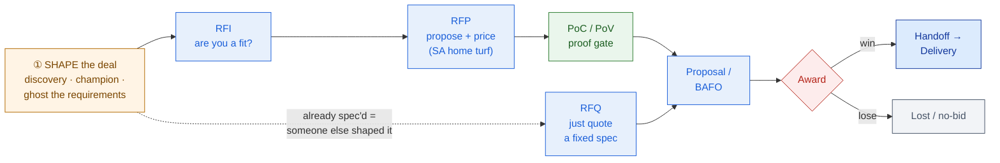

# RFx & PoC Strategy

> Don't answer the RFP line by line — win it theme by theme, and never start a PoC without a signed-off definition of "pass."

**Type:** Design
**Track:** AI, Data & Infrastructure Solution Architect (Presales)
**Prerequisites:** 1.5 Presales Fundamentals (MEDDICC qualification)
**Time:** ~6h
**Lab:** —
**Ship It:** RFP response outline + PoC plan

## The Problem

It's Friday afternoon and the RFP finally drops. **Nusantara Sehat** — an 8-hospital, 20-clinic Indonesian group, ~4,500 staff — has issued a formal procurement RFP for a "hospital modernization and clinician-AI initiative": unify fragmented patient data, automate the manual monthly Ministry of Health reporting, and pilot an AI assistant for clinicians. It is 380 pages, roughly 600 numbered requirements, and the response is due in three weeks. You already qualified this deal in the last lesson — MEDDICC says *bid* — so your team does the natural thing: they split the 600 line items across four people and start typing "Comply" into a spreadsheet. By Monday there is a heroic, exhausting, technically-accurate compliance matrix. And you are on track to lose.

You lose because a compliance matrix answers the question *"can you do each thing we listed?"* — and so does the rival integrator's, and so does everyone else's on the shortlist. When every bidder is compliant, the customer has no reason to pick *you*, so they fall back on the two defaults that beat a faceless bid every time: the **incumbent integrator** they already trust, and **"do nothing"** — the CFO's favourite option, because the status quo has a budget of zero. A pile of "Comply" cells with no **win theme** — no through-line that says *why us, why now, why this is worth the money* — is a bid that competes on price and loses on inertia. The reactive SA pours 90% of their effort into the matrix, which is worth maybe 30% of the decision, and slaps the executive summary together at midnight before the deadline.

The second way this deal dies is the **PoC**. To prove you're serious, someone offers a free proof-of-concept: *"we'll stand up the full unified patient platform across all eight hospitals so you can see it work."* Six months later the PoC is still limping — the scope grew every week, nobody agreed what "success" meant, the customer's data was never fully available, and your delivery team is bleeding margin on a project you gave away. You have proven nothing except that you can't scope. This lesson fixes both failure modes. It teaches you to **shape** the RFx *before* it drops, to respond with **win themes tied to the customer's pains** rather than a wall of compliance, and to run a **tightly-scoped PoC with pre-agreed success criteria** — the smallest proof that advances the deal, not the largest gift that stalls it.

## The Concept

Four ideas carry this lesson: the **RFx family** (which document you're holding and how much of the solution is still yours to shape), **shaping the RFx before it drops** (the highest-leverage move you'll ever make), the **anatomy of a winning RFP response** (where win themes live), and **PoC strategy** (the contract you sign before you touch a keyboard).

### 1. The RFx family — which request, which stage

Customers formalise buying with an **RFx** (Request for *x*). The letter tells you exactly where you are on the presales lifecycle from Lesson 0.6, and — more importantly — **how much of the solution you still get to influence**:

| RFx | The customer is saying | Lands at (lifecycle stage) | You respond with | Shaping room left |
|-----|------------------------|----------------------------|------------------|-------------------|
| **RFI** — Request for *Information* | "Who's out there, and what can you do?" | Lead → Discovery | Capability + differentiation; a fit signal, low commitment | **High** — nothing is decided yet |
| **RFP** — Request for *Proposal* | "Here's our problem and requirements — propose a solution and a price." | Solution Design → Proposal | Exec summary + win themes + HLD + proof + commercials + compliance matrix. **The SA's home turf.** | Medium — requirements are set, but *how* you meet them is yours |
| **RFQ** — Request for *Quotation* | "We know exactly what we want — quote this spec." | Sizing & BOM / Pricing | A price against a fixed spec; commoditised, price-driven | **Low** — if it's an RFQ you didn't shape, someone else already did |

The rule of thumb: **RFI = are you a fit · RFP = design it and prove it · RFQ = just price it.** And the strategic truth underneath all three: **an RFQ that lands cold is usually a deal someone else already won.** If a customer knows the spec precisely enough to ask only for a price, a competitor has spent the last two quarters teaching them exactly what to ask for. Which is the whole point of the next idea.

### 2. Shape the RFx before it drops — or become column fodder

The single highest-leverage act in presales happens *before any document exists*. The requirements in an RFP are not laws of nature — a human wrote them, and that human took input from somewhere. If that somewhere is **you** (working through your champion, from the discovery you ran in Lesson 1.4), the eventual RFP will read like a description of your solution, with your differentiators quietly promoted to *mandatory* requirements and your rival's weaknesses seeded as pass/fail criteria. This is legitimate, everyday influence: you host a reference-architecture session, you hand over a "sample requirements checklist" the procurement team gladly reuses, you help the champion write the business case. Sales calls this **ghosting** the requirements — writing the RFP in invisible ink.

The corollary is a qualification signal you must not ignore. If an RFP lands and you had **no** hand in shaping it, ask honestly: are you being invited to bid so the incumbent's procurement looks competitive? That's **column fodder** — a coverage bid whose real job is to make someone else's price look good. Recognising it is how you avoid pouring three weeks into a deal you were never allowed to win.



Read the diagram left to right, but read the **leverage** right to left: by the time you're pricing a BAFO ("Best And Final Offer"), almost everything is fixed; back at *Shape*, everything is soft. The earlier you're engaged, the more the deal bends toward you.

### 3. A win theme is a pain × a differentiator × a proof

A **win theme** is the reason a customer picks you that survives being read by a busy executive. It is *not* a feature and *not* a slogan. It is a disciplined little equation:

> **WIN THEME = (a pain the customer named) × (a thing you do that competitors don't) × (proof the customer can verify).**

Miss any factor and it collapses: a pain with no differentiator is a commodity, a differentiator with no pain is a brag, and either one with no proof is a promise the buyer has heard from every vendor. You carry **2–4 win themes**, tied to the customer's top **decision criteria** (the MEDDICC letter *DC* from Lesson 1.5), and you **thread them through the entire response** — the exec summary states them, the solution section proves them, the PoC demonstrates them, the commercials justify them. A win theme parked in one slide and forgotten is not a win theme.

```
   CUSTOMER PAIN / DECISION CRITERION       YOUR DIFFERENTIATOR              PROOF THE BUYER CAN VERIFY          TARGETS
   ────────────────────────────────────────────────────────────────────────────────────────────────────────────────────
   Fragmented patient data across       →   Integrate-don't-replace     →   PoC: one unified view across       CIO
   8 hospitals' own HIS/SIMRS instances     unified patient view            2 pilot hospitals (see § PoC)      CMO
   ────────────────────────────────────────────────────────────────────────────────────────────────────────────────────
   5-day manual monthly Ministry        →   One-click Kemenkes /        →   Live report generated in the       CFO
   (Kemenkes) reporting scramble            SATUSEHAT report from the       PoC, reconciled vs last month      CIO
                                            unified data layer
   ────────────────────────────────────────────────────────────────────────────────────────────────────────────────────
   PDP Law: patient data must stay      →   Sovereign in-country deploy;   Reference architecture + DPIA;      CIO
   in-country; AI must be safe              AI runs only on de-identified   customer DPO sign-off in the PoC   CMO
                                            data                                                               CFO(risk)
   ────────────────────────────────────────────────────────────────────────────────────────────────────────────────────
   A WIN THEME needs all three factors. 2–4 themes, mapped to the top decision criteria, threaded through every section.
```

### 4. The anatomy of a winning RFP response

A losing response is a compliance matrix with a cover letter. A winning response is a **narrative** the compliance matrix supports. Structure it so the win themes lead and the matrix follows — because executives read the front and evaluators check the back, and you must serve both:

| # | Section | What it does | Carries win themes? | Effort vs. decision-weight |
|---|---------|--------------|:-------------------:|-----------------------------|
| 1 | **Executive Summary** | The one page a CxO actually reads: their problem in *their* words, your win themes, the outcome, the ask. Written **last**, read **first**. | ✅ leads with them | Low effort · **very high weight** |
| 2 | **Win Themes / Value Proposition** | The 2–4 themes, each = pain × differentiator × proof, tied to their decision criteria. | ✅ this *is* them | Low effort · **high weight** |
| 3 | **Solution** | The HLD-altitude architecture, **organised around their pains**, not your product catalogue. Boxes-and-arrows an exec and an engineer both read. | ✅ proves them | High effort · high weight |
| 4 | **Proof** | References, case studies, and the **PoC plan** — the evidence that de-risks every claim. | ✅ substantiates them | Medium · high weight |
| 5 | **Commercials** | A pricing *narrative* (TCO/ROI framing, commercial model), not a naked number. | ✅ justifies them | Medium · high weight |
| 6 | **Compliance Matrix** | Line-by-line: Comply / Partial / Alternative / Exception. **Table stakes** — necessary to be shortlisted, insufficient to win. | ➖ supports them | **Very high effort · ~30% weight** |

The trap the reactive SA falls into is now visible in one column: **the compliance matrix eats most of the effort and drives the least of the decision.** Do it accurately — a single "Non-comply" on a mandatory requirement can disqualify you — but do it *fast*, and spend the hours you save on sections 1–2, where the deal is actually won.

### 5. PoC strategy — the contract you sign before touching a keyboard

A **Proof of Concept** exists to answer *one doubt* the customer has about *your* solution, on *their* terms, before they commit. It is not a free trial, not a mini-implementation, and not a way to look busy. The discipline that separates a PoC that advances a deal from one that quietly kills it is a **PoC contract** — six things agreed and signed *before* work starts:

```
   THE PoC CONTRACT  (agree and sign this BEFORE you touch a keyboard)
   ┌───────────────────────────────────────────────────────────────────────────────┐
   │ OBJECTIVE    the ONE question this PoC answers (a top decision criterion / the   │
   │              buyer's biggest doubt) — not "show the product"                     │
   ├───────────────────────────────────────────────────────────────────────────────┤
   │ SUCCESS      # | criterion             | how measured        | PASS threshold    │
   │ CRITERIA     1 | <what must be true>   | <the measurement>   | <the number>      │
   │ (pre-agreed, 2 | ...                   | ...                 | ...               │
   │  signed off) 3 | ...                   | ...                 | ...               │
   ├───────────────────────────────────────────────────────────────────────────────┤
   │ SCOPE        IN:  <data, systems, users, environment that ARE included>          │
   │ GUARDRAILS   OUT: <everything else — the boil-the-ocean list you refuse>         │
   ├───────────────────────────────────────────────────────────────────────────────┤
   │ TIMELINE     <4–6 weeks, time-boxed, with a fixed readout date>                  │
   │ RESOURCING   <paid? whose data? whose environment? whose people? who does what?> │
   │ EXIT         PASS → <advance to proposal/contract>   FAIL → <walk / paid remedy> │
   └───────────────────────────────────────────────────────────────────────────────┘
   Rules: no success criterion you can't measure · no criterion the customer hasn't signed ·
          no PoC without a defined "then what" for BOTH pass and fail.
```

The credibility-killer to avoid at all costs is **over-promising the success criteria**. "95% accuracy across everything in six weeks" is not ambition, it's a landmine — you either miss it and lose trust, or you hit it by narrowing the definition until the customer feels cheated. Scope each criterion to something **provable and bounded**: not "the AI is accurate," but "for a cohort of 200 patients across the two pilot hospitals, the unified view matches the source HIS/SIMRS on a sampled audit of 50 records at ≥98% field accuracy." Small, measured, verifiable — and therefore believable. A PoC you *under*-promise and *over*-deliver builds more trust than one you scoped to impress and failed to land.

### 6. Before you write a word, read the RFP like the evaluator will score it

An RFP is not just a list of requirements — it is a *scoring instrument*, and the buyer's evaluation team will run your response through it row by row. Before you draft anything, mine the document for three things that decide how you spend your three weeks:

- **Mandatory vs. desirable.** Requirements marked "must" / "shall" are **pass/fail gates** — a single miss can disqualify you regardless of how brilliant the rest is, so triage these first and confirm you clear every one. "Should" / "may" requirements are *scored*, not fatal; you optimise these for points but never at the expense of a mandatory.
- **The evaluation / weighting model.** Most formal RFPs publish (or hint at) how they'll score — e.g. 40% technical, 30% compliance, 20% price, 10% references. That weighting tells you where to invest: if technical is 40% and compliance is 30%, your win themes and solution section are worth more than the matrix you were about to over-polish. Align your effort to *their* weighting, not your comfort zone.
- **The re-qualify trigger.** Reading the real RFP can invalidate the bid decision you made at qualification. If the mandatory requirements now favour the incumbent, the timeline is impossible, or the evaluation is 80% price on a spec you didn't shape, **re-run the bid/no-bid gate from Lesson 1.5.** A clean no-bid after reading the RFP is still cheaper than a lost bid after writing it.

The reactive SA opens the RFP and starts answering at requirement 1. The disciplined SA reads the *whole* thing first — as the scorer, not the respondent — decides whether to bid at all, and only then allocates effort to where the points and the win actually live.

## Design It

Back to **Nusantara Sehat**. The deal is qualified (Lesson 1.5): the **economic buyer** is the CFO, with the **CIO** and **CMO** as the technical and clinical decision-makers; the **competition** is a rival systems integrator and **"do nothing"**; the **compelling event** is looming enforcement of Indonesia's Personal Data Protection Law (UU PDP) plus a Ministry mandate to report through SATUSEHAT. Your job now is to turn that qualification into two artifacts: an **RFP response outline** carrying win themes, and a **scoped PoC plan**.

### Step 1 — Map decision-makers to decision criteria

Win themes are only as good as the criteria they're tied to, so start by naming what each buyer is really evaluating:

| Buyer | Cares most about | Their private version of "do nothing" |
|-------|------------------|----------------------------------------|
| **CFO** (economic buyer) | Predictable cost, ROI, no runaway programme | "The status quo costs nothing on paper." |
| **CIO** | Integration feasibility, data residency, no vendor lock-in | "A rip-and-replace will break everything." |
| **CMO** | Clinician adoption, patient safety, does the AI actually help | "Another system my doctors won't use." |

### Step 2 — Derive 2–3 win themes from the pains

Each pain the customer named becomes a win theme, using the equation from the Concept. Three pains → three themes, each aimed at the buyers above:

- **Win theme 1 — "One patient, one record — without ripping out your HIS/SIMRS."**
  *Pain:* fragmented patient data across 8 hospitals' separate systems. *Differentiator:* an **integrate-don't-replace** unified patient view that reads from the existing HIS/SIMRS instances as systems of record (the SoR rule from Lesson 0.1) rather than migrating them — directly countering the rival's likely rip-and-replace pitch. *Proof:* the PoC below, plus a reference from a comparable hospital group. *Targets:* CIO (feasibility, no lock-in), CMO (a real single view).

- **Win theme 2 — "Turn the 5-day Ministry reporting scramble into a one-click submission."**
  *Pain:* manual monthly Kemenkes / SATUSEHAT reporting. *Differentiator:* automated report generation off the same unified data layer — one build, two payoffs. *Proof:* a live report generated in the PoC and reconciled against last month's manual submission. *Targets:* CFO (hard, quantifiable saving), CIO.

- **Win theme 3 — "Compliant by design: your patient data never leaves Indonesia."**
  *Pain:* PDP Law data-residency and AI-safety exposure. *Differentiator:* **sovereign in-country deployment** with the AI operating only on **de-identified** records — the wedge that eliminates any competitor proposing a public-cloud LLM, and the argument that makes "do nothing" the *riskiest* option, not the safest. *Proof:* residency reference architecture + a DPIA (Data Protection Impact Assessment) signed off by the customer's DPO during the PoC. *Targets:* CIO, CMO, and CFO's risk lens.

### Step 3 — Draft the RFP response outline

Now pour the themes into the six-section skeleton. Notice the solution is organised by *their pain*, never by *your product lines*:

```
1. EXECUTIVE SUMMARY  (1 page, written last)
   - Nusantara's goal in their words; the 3 win themes; the outcome; the ask.
2. WIN THEMES
   - WT1 unified view · WT2 automated Ministry reporting · WT3 compliant-by-design.
3. SOLUTION  (HLD altitude — boxes & arrows, not build detail)
   3.1 Unified patient data layer over existing HIS/SIMRS instances (WT1)
   3.2 Automated Kemenkes/SATUSEHAT reporting (WT2)
   3.3 In-country deployment + de-identified clinician assistant (WT3)
   3.4 Phased rollout: Phase 1 = 2 hospitals to production; Phase 2 = remaining 6 + full assistant.
4. PROOF
   - The PoC plan (Step 4) · a comparable hospital-group reference · residency arch + DPIA approach.
5. COMMERCIALS
   - Phased, fixed-price stages; TCO vs. the cost of manual reporting + compliance risk (the "do-nothing" cost).
6. COMPLIANCE MATRIX
   - All ~600 requirements: Comply / Partial / Alternative / Exception. Fast, accurate, zero mandatory misses.
```

### Step 4 — Scope the PoC (the hard part is saying "out")

The PoC must answer the buyer's **biggest doubt** — and the biggest doubt here is the CIO's: *can you actually unify our fragmented HIS/SIMRS data, in-country, in a way clinicians trust?* Everything else (the assistant, the other six hospitals) rests on that foundation, so that is what you prove. Fill in the PoC contract:

**Objective:** Prove that a single, accurate, current, unified patient view can be produced across **two pilot hospitals' different HIS/SIMRS instances**, entirely within Indonesia, and trusted by clinicians — the foundation the whole modernization rests on.

| # | Success criterion | How measured | Pass threshold |
|---|-------------------|--------------|----------------|
| 1 | **Identity + accuracy** — the unified view reconciles the same patient across both HIS/SIMRS instances and shows the last 12 months of encounters | Blind audit of 50 records from a 200-patient cohort against each source HIS/SIMRS | ≥ **98%** field-level match |
| 2 | **Freshness** — a new encounter in either HIS/SIMRS appears in the unified view within the agreed latency (state the mechanism from Lesson 0.1) | Timed test on 20 fresh encounters | ≤ **15 min** (near-real-time path) |
| 3 | **Residency + compliance** — all patient data stays in-country; the AI slice uses only de-identified data | DPIA checklist reviewed by the customer's DPO | **DPO sign-off** obtained |
| 4 | **Ministry reporting** — generate one monthly Kemenkes/SATUSEHAT-format report from the unified data | Reconcile against the hospital's last manual submission | Within agreed **tolerance** |
| 5 | **Clinician trust** *(leading indicator, not a pass/fail gate)* | 10 pilot clinicians: usefulness rating + a "find latest creatinine" task | ≥ **4/5** and **< 2 clicks** |

**Scope guardrails.**
- **IN:** 2 named pilot hospitals · their 2 HIS/SIMRS instances · one bounded 200-patient cohort · read-only · de-identified data for the AI slice · a customer-provided in-country PoC environment.
- **OUT:** the other 6 hospitals · write-back to any HIS/SIMRS · production HA/DR and security accreditation · full historical migration · all clinical specialties · the full clinician-assistant scope (only a thin de-identified demo — explicitly *not* a graded criterion).

**Timeline (6 weeks):** W1–2 connect + reconcile patient identity · W3–4 unified view + residency controls · W5 Ministry report + clinician demo · W6 measure against criteria + joint readout.

**Resourcing:** **Paid**, fixed-fee (customer has skin in the game; you protect margin and criteria discipline). Customer provides data access, the DPO, 2 clinician SMEs, and the environment; you provide 1 SA + 1 data engineer + 1 clinical-informatics advisor.

**Exit:** **PASS** → advance to the full proposal and the Phase-1 (2-hospital) production rollout; carry the PoC learnings straight into the HLD and BOM. **FAIL** → a documented findings report the customer keeps, plus either a scoped **paid** remediation sprint or a clean walk. No open-ended drift, either way.

That PoC proves win themes 1, 2, and 3 in one bounded six-week engagement — and it is the *smallest* thing that lets the deal advance, which is exactly why it will.

## Compare It

### PoC vs. Pilot vs. MVP vs. Proof-of-Value

These four get used interchangeably and cost deals when they're confused — a customer who asked for a PoC and got quoted a pilot thinks you're padding; one who wanted a pilot and got a throwaway PoC thinks you're not serious.

| | **PoC** | **Pilot** | **MVP** | **Proof-of-Value (PoV)** |
|---|---------|-----------|---------|---------------------------|
| **Question it answers** | "*Can* it work?" (feasibility) | "Does it work *in our world*, with our users?" | "What's the smallest thing worth shipping?" | "Is it worth the *money*?" (ROI) |
| **Environment** | Sandbox / de-identified | Production-like, real users, limited | Production, real (early) users | Whatever proves the business case |
| **Duration** | Days–weeks, time-boxed | Weeks–months | Ongoing (it grows into the product) | Weeks |
| **Throwaway?** | Yes — proves a point, then discard | Partly — seeds the rollout | No — it *becomes* the product | Yes — proves the number |
| **Who cares most** | Technical evaluator (CIO) | End users + operations | Product owner | Economic buyer (CFO) |

For Nusantara the sequence is deliberate: a **PoC** to prove feasibility (the CIO's doubt), *then* a **pilot** at two hospitals in production (the CMO's adoption doubt), with a **PoV** narrative — the reconciled Ministry-reporting saving and the avoided compliance penalty — running through both to keep the CFO nodding. Calling the first stage an "MVP" would over-commit; calling the pilot a "PoC" would undersell it.

### Paid vs. free PoCs

| | **Free PoC** | **Paid PoC** |
|---|--------------|---------------|
| Customer commitment | Low — no skin in the game, so scope and criteria drift | High — a signed fee anchors the criteria |
| Your margin | You eat it | Recovered (or fixed-fee) |
| Signal it sends | "Our time is free" / commoditised | "This is serious engineering" |
| When it's acceptable | Small, bounded, high win-probability, strategic *logo* value, or a genuine reference | The default for anything non-trivial |

The rule: **never give away a mega-PoC.** A free proof is fine when it's *small and bounded* and buys you a marquee reference; the moment it grows into "stand up the whole platform for free," it stops being a PoC and becomes an unpaid pilot that trains the customer to expect free delivery. Nusantara's PoC is deliberately **paid and fixed-fee** — that fee is what gives you the standing to say "no, that's out of scope" when week three brings a request to add a third hospital.

### How "do nothing" and the rival integrator each shape your RFx strategy

Your two real competitors are not other logos — they're a *default* and an *incumbent*, and each bends your strategy differently:

- **"Do nothing"** is the CFO's gravitational pull, and it wins by default in any tie. You beat it only with a **compelling event** and a cost-*of-inaction* case. So in the *shaping* window you seed requirements that make the status quo untenable — a PDP-compliance deadline, a mandatory SATUSEHAT reporting date — and in the *response* your commercials frame TCO against the ongoing cost of manual reporting plus the risk of a data-protection penalty. You make standing still the expensive, risky option.
- **The rival systems integrator** shapes strategy through its *weaknesses*. If they win by lock-in and rip-and-replace, you plant **trap requirements** during shaping that reward your strengths and expose theirs: "the solution must integrate with existing HIS/SIMRS instances without data migration," "must use open standards (HL7 FHIR)," "must guarantee in-country data residency," "no proprietary lock-in." Each is a reasonable-sounding requirement the customer genuinely wants — and each is a wall the rival has to climb and you walk through.

The meta-lesson: **you don't respond your way out of a badly-shaped deal.** Win themes and a tight PoC are how you *convert* a well-shaped opportunity; the shaping is where the deal is really decided.

## Ship It

This lesson ships a reusable **RFP Response Outline + PoC Plan** — the pair of artifacts you produce the moment a real RFP lands. Both files live in [`outputs/`](../outputs/):

- **[`template-rfp-response-and-poc-plan.md`](../outputs/template-rfp-response-and-poc-plan.md)** — the fill-in-the-blank template: a six-section RFP response skeleton with explicit **win-theme slots** (each a pain × differentiator × proof), plus a one-page **PoC contract** (objective · pre-agreed success criteria · scope guardrails · timeline · resourcing · exit). Hand it to a colleague and they can respond to an RFP from it.
- **[`example-nusantara-sehat-rfp-poc.md`](../outputs/example-nusantara-sehat-rfp-poc.md)** — the template fully worked for Nusantara Sehat, so the skeleton isn't abstract: three win themes tied to its three pains, and a six-week, paid, bounded unified-patient-view PoC scoped to something you can actually prove.

Three habits make these artifacts earn their keep:

1. **Write the executive summary last and the compliance matrix fast.** The matrix is table stakes; the summary is the win. Spend your saved hours where the decision-weight is.
2. **Never let a win theme exist without its proof.** If you can't name the evidence a buyer could verify, it's a brag, not a theme — cut it or find the proof.
3. **Sign the PoC contract before the PoC starts.** Pre-agreed, measurable success criteria — signed by the customer — are the only thing standing between a six-week proof and a six-month gift.

## Exercises

1. **(Easy)** Take Nusantara Sehat's three pains (fragmented data, manual Ministry reporting, PDP/residency) and write each as a one-line win theme in the form *pain × differentiator × proof*. For each, mark which decision-maker (CFO / CIO / CMO) it primarily targets, and name the one piece of evidence a buyer could actually verify. Then delete any "theme" whose proof you couldn't name — and explain why it was never a win theme.
2. **(Medium)** Swap the PoC. Instead of the unified patient view, scope the *other* option — a **clinician assistant over de-identified records** — as a 6-week paid PoC. Write its objective (the one doubt it answers), **three** measurable success criteria (avoid over-promising — no "95% accuracy across everything"), and an explicit IN/OUT scope-guardrail list. State which win theme it proves and why you'd choose it over the unified-view PoC *only if* a particular buyer's doubt dominated.
3. **(Hard)** The rival systems integrator will pitch rip-and-replace. Working in the *shaping* window (before the RFP drops), write **three trap requirements** you'd try to seed into the RFP that reward your integrate-don't-replace strength and expose the rival's lock-in — using the estate map from Lesson 0.1 and the MEDDICC *Competition* analysis from Lesson 1.5. Then, for one of them, write both the **compliance-matrix line** (how you'd answer it) and the **win theme** it feeds. Save it alongside your worked example; you'll reuse this reasoning in the Phase-1 Discovery capstone.

## Key Terms

| Term | What people say | What it actually means |
|------|-----------------|------------------------|
| RFI / RFP / RFQ | "The procurement paperwork" | Three buyer requests at different stages: RFI = *are you a fit* (high shaping room), RFP = *design and prove it* (the SA's home turf), RFQ = *just price a fixed spec* (little room — someone else likely shaped it). |
| RFx shaping / ghosting | "Answering the RFP" | Influencing the requirements *before* the document exists — via your champion and discovery — so mandatory requirements favour you. The highest-leverage move in the whole cycle. |
| Column fodder / coverage bid | "We got invited to bid!" | Being asked to respond only to make an incumbent's procurement look competitive. A qualification red flag when you had no hand in shaping the RFP. |
| Win theme | "Our key message" | A disciplined equation — a *named customer pain* × *a differentiator only you offer* × *proof the buyer can verify* — tied to a decision criterion and threaded through the whole response. 2–4 max. |
| Compliance matrix | "The requirements spreadsheet" | The line-by-line Comply/Partial/Alternative/Exception response. Table stakes: necessary to be shortlisted, insufficient to win. Do it accurately but fast. |
| Executive summary | "The intro" | The one page a CxO reads: their problem in their words, your win themes, the outcome, the ask. Written last, read first; the highest decision-weight per word in the response. |
| PoC | "A quick demo on their data" | A time-boxed proof of *one* feasibility question, governed by a pre-agreed, measurable **PoC contract** (objective, success criteria, scope, timeline, resourcing, exit). Throwaway by design. |
| Pilot | "A bigger PoC" | A production-like run with real users at limited scope — proves adoption and operations, not just feasibility. Longer, and it seeds the rollout rather than being discarded. |
| Proof-of-Value (PoV) | "Showing ROI" | A proof aimed at the *economic buyer*: demonstrates the business value/return, not merely that the technology works. Often what the CFO actually wants. |
| Scope guardrails | "The plan" | The explicit IN/OUT boundary of a PoC — the list of things you refuse to add — that stops "boiling the ocean" and protects the timeline and your margin. |
| BAFO | "The final price" | Best And Final Offer — the last commercial round in a formal procurement, where almost everything is fixed and only price still moves. Proof that leverage lives *upstream*, at shaping. |

## Further Reading

- [APMP — Body of Knowledge on proposals](https://www.apmp.org/) — the professional home of proposal management; the source for win themes, compliance matrices, and the "write the exec summary last" discipline this lesson teaches.
- [Shipley Associates — Proposal Guide](https://www.shipleywins.com/) — the practitioner's bible for structured, win-theme-driven bid responses; skim their capture-and-proposal method to see shaping and response as one continuous play.
- [RFI vs RFP vs RFQ — a plain-English primer](https://www.responsive.io/blog/rfp-rfi-rfq) — settles the three-letter confusion once, so you always know which stage a request means and how much room you have left to shape it.
- [*Mastering Technical Sales* — the demo & PoC chapters (John Care)](https://www.masteringtechnicalsales.com/) — the reference on running proofs that advance deals instead of draining them; the counterpart to this lesson's PoC-contract discipline.
- [SATUSEHAT — Indonesia Ministry of Health platform](https://satusehat.kemkes.go.id/) and the [DLA Piper Data Protection guide — Indonesia (UU PDP)](https://www.dlapiperdataprotection.com/) — read one page of each so the Nusantara Sehat residency and Ministry-reporting constraints (and the win themes built on them) are grounded in the real regulatory context.
