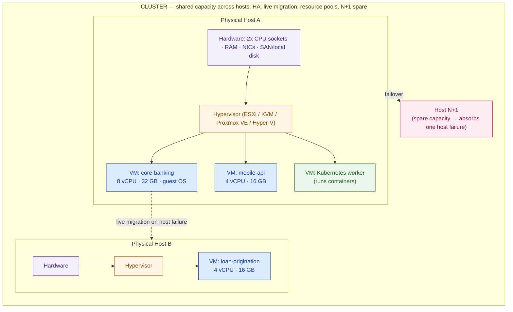

# Compute & Virtualization

> You size compute in whole servers, not spreadsheet averages — from stated assumptions and a defensible range, because a guess either wastes capital or drops payments, and on a 24/7 bank there is no rounding error you can afford.

**Type:** Design
**Track:** AI, Data & Infrastructure Solution Architect (Presales)
**Prerequisites:** Phase 1 (Business & Consulting)
**Time:** ~5h
**Lab:** Proxmox/KVM VM
**Ship It:** Compute sizing note

## The Problem

The renewal quote lands on the CIO's desk at **Garuda Finance** — a fictional Indonesian multifinance and digital-banking firm with ~600 branches and agent outlets, ~8 million customers, and a mobile app that peaks around **4,000 transactions per minute**. Their estate runs on an aging VMware fleet across two owned data centers (primary in Jakarta, DR in Surabaya), plus a few workloads in public cloud that OJK regulation now forces them to repatriate on-shore. The renewal number is a step-change higher than last year. Suddenly a routine infrastructure line item is a **board question**: *"Why are we paying this, how many servers do we actually need, and what do we move to instead?"* The CIO turns to you — the solution architect — and says: size the private cloud we'll build to replace this, and defend the number.

Here is how a rookie SA loses that room. They open a spreadsheet, list the virtual machines, and size **every VM to its peak** — the core-banking box gets the CPU it touches for ninety seconds at month-end close, the batch server gets the cores it burns for one overnight window, the mobile backend gets its Ramadan-payday spike as its steady state. They add nothing for host overhead, forget that hosts fail and you need a spare, and hand over a host count that is roughly **double** what the estate needs. Capital that should have bought storage or a Kubernetes platform is now frozen in idle CPU sockets. The customer's own engineers know it's padded, and your credibility goes with it. The opposite mistake is just as fatal: the SA who has heard that "virtualization lets you overcommit" slaps a flat 4:1 vCPU ratio across *everything* — including the payment switch — and during the next month-end the payments tier is fighting three other VMs for the same physical cores, latency spikes, transactions time out, and Garuda files an **OJK-reportable incident**. Under-buying didn't save money; it caused an outage on the one workload that can never have one.

Underneath both failures is the same gap. The rookie treats compute sizing as arithmetic on a napkin and treats the **hypervisor choice** as "just pick the free one" — a purely technical call. It is neither. Sizing is a disciplined argument built from *assumptions you can defend* and a *range you can stand behind*, where the single most important decision is **which workloads you refuse to overcommit**. And the hypervisor is now a board-level cost, resilience, and skills decision — VMware-versus-the-alternatives is precisely why Garuda called you. This lesson teaches you to do the SA's actual job here: **inventory the workload, size it with overcommit and redundancy done right, choose the virtualization platform on evidence, and ship a sizing note that survives a CFO's red pen** — the note that feeds Garuda's private-cloud bill of materials in Capstone B.

## The Concept

Virtualization is the trick that lets one physical server pretend to be many. A thin layer of software — the **hypervisor** — sits on the bare hardware and carves its CPU cores, RAM, network, and disk into isolated **virtual machines (VMs)**, each running its own operating system as if it owned the box. As an architect you don't operate that layer; you **size** what runs on it and **choose** which platform runs it. To do that you need five ideas: the resources, overcommit, the cluster, redundancy, and where a workload should live at all.

### CPU, RAM, and the vCPU

A physical server has **sockets** (CPU chips), each with **physical cores**, and modern cores present two hardware threads each (hyper-threading / SMT). A **vCPU** is a virtual CPU handed to a VM; it maps onto a physical core's scheduling time, not onto a dedicated core. **RAM** is memory — the resource you must treat most conservatively, because a VM that runs out of it doesn't slow down gracefully, it swaps to disk and falls over (you saw this failure signature in the Phase 0 Linux lesson). Two numbers drive every sizing: the sum of **vCPU** across all VMs, and the sum of **RAM** across all VMs. Everything else is how you turn those two sums into a count of physical hosts.

### Overcommit — the lever, and where to never pull it

**Overcommit** (oversubscription) means allocating more virtual resource than you physically own, betting that not every VM peaks at once. A 4:1 CPU overcommit means 4 vCPU are scheduled onto every 1 physical core. It works because most workloads are idle most of the time — it is the entire economic case for virtualization. But it is a **bet on statistical smoothing**, and two rules govern it:

- **CPU overcommits well; RAM does not.** A VM waiting a few milliseconds for a core degrades gracefully. A VM denied RAM swaps to disk and collapses. So the disciplined SA overcommits CPU by tier and sizes **RAM at roughly 1:1** (a small saving from page-sharing/ballooning at most). Compute is therefore *dual-constrained* — you compute a core-driven host count and a RAM-driven host count and take the larger.
- **Never overcommit a latency-critical, always-busy workload.** Payments, the core-banking ledger, and any tier bound by a hard SLA get a **1:1** ratio (and often a CPU reservation) — because "not everyone peaks at once" is false when the whole country pays bills at month-end. Overcommit the batch server 4:1; overcommit the payment switch never.

| Workload character | Typical CPU overcommit (vCPU : pCore) | Why |
|---|---|---|
| Payments / core-banking / hard-SLA | **1 : 1** (with reservation) | Always busy, correlated peaks, an outage is regulatory |
| General app / mobile backend | 2 : 1 – 3 : 1 | Bursty but smoothable across many VMs |
| Dev / test / batch / reporting | 3 : 1 – 6 : 1 | Time-shifted, idle most of the day, tolerant of contention |
| **RAM (all tiers)** | **~1 : 1** | Memory starvation causes swap → collapse, not graceful slowdown |

Every ratio you use is an **assumption you state and defend**, not a house number.

### The virtualization stack and the cluster

A single host runs hardware → hypervisor → VMs. The power comes from joining hosts into a **cluster** that presents shared capacity and can move a running VM from one host to another with no downtime (**live migration** — vMotion in VMware's language). That is what makes hosts *fungible*: you can patch a host, or lose one, and its VMs run elsewhere.



Two more cluster concepts you must be able to name:

- **Resource pool** — a logical carve-out of the cluster's CPU/RAM with **reservations** (guaranteed minimum), **limits** (ceiling), and **shares** (priority under contention). This is how you give payments a 1:1 guarantee *without* dedicating whole idle hosts to it — you reserve its cores inside the shared cluster.
- **Failure domain** — the blast radius of a single failure. A host is one failure domain; a rack is a bigger one; a **whole data center is the biggest**. You engineer redundancy at each level: N+1 inside a cluster protects against a host; a DR site protects against a DC. Garuda's Jakarta-and-Surabaya design is failure-domain thinking at the data-center level.

### N+1 and N+2 — pay for the spare, or pay for the outage

**N** is the number of hosts your workload actually needs. **N+1** adds one spare so that a single host failure loses no capacity — its VMs restart or migrate onto the spare. **N+2** tolerates two concurrent losses (for example, one host fails *while another is down for patching* — a realistic combination on a 24/7 platform). More redundancy is more idle hardware, so it is a **priced trade-off**, not a default: a payments platform under an OJK business-continuity mandate justifies N+2 on its critical cluster; a dev cluster is fine at N+0. If your sizing has no `+1`, you have sized a system that goes down the first time a power supply dies.

### Where should the workload even live? Bare-metal vs VM vs container

Virtualization is not always the answer. Before sizing hosts, place each workload on the right substrate:

```
                 BARE METAL                 VIRTUAL MACHINE             CONTAINER
                 ──────────                  ───────────────            ─────────
 isolation       whole physical box         hardware-isolated OS       shared OS kernel
 overhead        none                        hypervisor tax (~small)   near-zero
 density         1 workload / box            many VMs / host           many pods / node
 best for        max-performance DB,         mixed enterprise apps,    stateless services,
                 licensing by socket,        legacy OS, strong          microservices, the
                 latency-critical            isolation, live migrate    new K8s platform
 Garuda example  option for core DB          core banking, loan orig.  mobile backend, new
                                             mobile, batch, mgmt        container platform
```

Containers don't replace VMs in an enterprise; they usually run *inside* VMs (Kubernetes worker nodes are VMs), so the compute you size still lands on the hypervisor. Bare-metal is the exception you reach for when a database needs every cycle or a license is cheaper per socket than per VM. The architect's move is to place each tier deliberately — and then size the VMs that result.

## Design It

Now do the job. Garuda Finance is building an **on-prem private cloud** across Jakarta (primary) and Surabaya (DR, active-passive). Your task: produce a **compute sizing note** — how many physical hosts per data center, with every number traceable to a stated assumption and a range. We size in six steps. The only hard facts are Garuda's: ~600 branches, ~8M customers, ~4,000 tx/min mobile peak, two DCs. **Every other number below is a labelled `ASSUMPTION (confirm in discovery)` carried as a band** — the point estimate is computed at the band's midpoint.

### Step 1 — Inventory the workload tiers

Group the estate into tiers that share a placement and an overcommit character. Don't size 200 individual VMs in a first pass — size tiers.

| Tier | What it does | Overcommit character |
|---|---|---|
| **Core banking** | Accounts, ledger, payment switch — the transactional heart | Always busy → **1:1, never overcommit** |
| **Loan origination** | Application intake, underwriting, decisioning | Business-hours bursty → light overcommit |
| **Mobile backend** | The API/app tier behind the ~4,000 tx/min app | Peaky, smoothable across many VMs |
| **Batch / reporting** | Overnight batch, OJK regulatory reporting, analytics | Time-shifted → tolerant, high overcommit |
| **Platform / shared** | Kubernetes nodes (new container platform), monitoring, security, backup, load balancers, AD | Mixed; K8s nodes steadier |

### Step 2 — Set per-tier VM counts and vCPU/RAM as ranges

For each tier, assume a VM count band and a per-VM spec band, then compute the point estimate at the midpoint. These are the numbers a customer will challenge — so they are all flagged.

> `ASSUMPTION (confirm in discovery)` — VM counts and per-VM specs below are illustrative bands for a bank of Garuda's size; confirm against the current vSphere inventory export (VM list with configured vCPU/RAM). Point estimate uses the **midpoint**.

| # | Tier component | VMs (band → mid) | vCPU/VM | RAM/VM | Σ vCPU | Σ RAM |
|---|---|---|---|---|---|---|
| 1 | Core banking app | 8–12 → **10** | 8 | 32 GB | 80 | 320 GB |
| 2 | Core banking DB | 2–4 → **3** | 16 | 128 GB | 48 | 384 GB |
| 3 | Payment switch/gateway | 4–6 → **5** | 4 | 16 GB | 20 | 80 GB |
| 4 | Loan origination app | 6–10 → **8** | 4 | 16 GB | 32 | 128 GB |
| 5 | Loan origination DB | 2 → **2** | 8 | 64 GB | 16 | 128 GB |
| 6 | Mobile backend API | 8–12 → **10** | 4 | 16 GB | 40 | 160 GB |
| 7 | Mobile cache/session | 3–4 → **4** | 4 | 32 GB | 16 | 128 GB |
| 8 | Batch / reporting | 6–10 → **8** | 6 | 32 GB | 48 | 256 GB |
| 9 | Kubernetes platform nodes | 6–9 → **8** | 8 | 32 GB | 64 | 256 GB |
| 10 | Mgmt / monitoring / security | 10–15 → **12** | 4 | 16 GB | 48 | 192 GB |
| | **Totals** | **~70 VMs** | | | **412 vCPU** | **2032 GB** |

### Step 3 — Apply overcommit per tier (CPU by tier, RAM ~1:1)

Convert virtual demand into **physical** demand. CPU divides by the tier's overcommit ratio; RAM stays ~1:1. This is where the "never overcommit payments" rule earns its keep — rows 1–3 and the two DB rows divide by 1.

| # | Tier component | Σ vCPU | CPU o/c | **pCores** | Σ RAM (~1:1) |
|---|---|---|---|---|---|
| 1 | Core banking app | 80 | 1:1 ⛔ | 80 | 320 GB |
| 2 | Core banking DB | 48 | 1:1 ⛔ | 48 | 384 GB |
| 3 | Payment switch | 20 | 1:1 ⛔ | 20 | 80 GB |
| 4 | Loan origination app | 32 | 2:1 | 16 | 128 GB |
| 5 | Loan origination DB | 16 | 1:1 | 16 | 128 GB |
| 6 | Mobile backend API | 40 | 2:1 | 20 | 160 GB |
| 7 | Mobile cache/session | 16 | 2:1 | 8 | 128 GB |
| 8 | Batch / reporting | 48 | 4:1 | 12 | 256 GB |
| 9 | Kubernetes platform | 64 | 2:1 | 32 | 256 GB |
| 10 | Mgmt / monitoring | 48 | 3:1 | 16 | 192 GB |
| | **Physical demand** | 412 | — | **268 pCores** | **2032 GB** |

> `ASSUMPTION` — overcommit ratios are policy choices, not physics. Payments/DB at 1:1 is deliberate and non-negotiable; general tiers at 2:1 and batch at 4:1 are conservative mid-market defaults. RAM is sized 1:1 (memory starvation is a hard failure). Confirm the ratios with the platform team before the BOM.

### Step 4 — The dual constraint: cores vs RAM

Here is the summary an executive can read and an engineer can trust — the ASCII sizing table that turns tiers into a host count:

```
WORKLOAD TIER              Σ vCPU   Σ RAM     CPU o/c    → pCORES    RAM (~1:1)
────────────────────────────────────────────────────────────────────────────
Core banking (payments)      148    784 GB     1:1  ⛔      148        784 GB
Loan origination              48    256 GB   ~1.5:1         32        256 GB
Mobile backend                56    288 GB     2:1          28        288 GB
Batch / reporting             48    256 GB     4:1          12        256 GB
Platform (K8s + mgmt)        112    448 GB   ~2.3:1         48        448 GB
────────────────────────────────────────────────────────────────────────────
SUBTOTAL                     412   2032 GB                 268       2032 GB
   + headroom (plan to 80% steady):  cores 268 / 0.80 ≈ 335    RAM 2032 / 0.80 ≈ 2540 GB
   host spec = 64 pCores + 1024 GB:  cores need 6  ·  RAM needs 3  →  MAX = 6 hosts
   + N+1 spare:                       →  7 physical hosts  (Jakarta primary cluster)
────────────────────────────────────────────────────────────────────────────
RULE  host count = CEIL( MAX( cores-driven , RAM-driven ) )  THEN add N+1.
      Payments at 1:1 make this estate CORE-bound — RAM has headroom to spare.
      ⛔ = never overcommit: month-end payment latency is an OJK-reportable outage.
```

> `ASSUMPTION` — **host spec** is a dual-socket server with **32 physical cores/socket = 64 pCores** and **1024 GB (1 TB) RAM**; band 48–64 cores and 768 GB–1.5 TB. **Headroom** targets ≤80% steady utilization (never plan a host to 100% — the N+1 spare needs somewhere to land the failed host's VMs). Confirm the reference server SKU with the hardware partner.

The teaching point falls out of the math: because Garuda **refuses to overcommit payments**, the cluster is **core-bound** (6 hosts by cores, only 3 by RAM). Buying RAM-heavy hosts would waste money; the constraint is cores. An SA who sized on RAM alone, or on a flat overcommit, would get a different — and wrong — number.

### Step 5 — Jakarta primary: add redundancy

Workload needs **6 hosts**. Add the spare:

- **N+1 → 7 hosts** absorbs one host failure with zero capacity loss. This is the baseline recommendation.
- **N+2 → 8 hosts** if Garuda's OJK BCP posture requires surviving a host failure *during* a patch window on the payments cluster. Present this as the **priced upgrade**, not a surprise.

**Jakarta primary: 7 hosts (N+1), or 8 (N+2) for the payments-critical posture.**

### Step 6 — Surabaya DR: active-passive doesn't have to mean 1:1

DR is a *failure-domain* decision at the data-center level, and active-passive gives you a cost lever the primary doesn't have. You don't have to mirror all 6 workload hosts — you have to run the **service Garuda cannot degrade** (payments, core banking, the mobile front door) at full capacity, and you can let batch, reporting, and loan origination run degraded or delayed during a failover if the BCP permits.

- Critical-only DR (core banking + payments + mobile + reduced mgmt) ≈ **184 physical cores** → with 80% headroom ≈ 230 → **4 hosts + N+1 = 5 hosts**. Lowest cost; accepts degraded batch/reporting during a DC failover.
- Full-mirror DR (every tier, identical to Jakarta) = **7 hosts**. Highest cost, simplest operations, strictest RTO.

**Surabaya DR: 5 hosts (critical-only) to 7 hosts (full mirror)** — the choice is an RTO/RPO and cost conversation to have with the customer, not a number to invent for them.

### The result — a range, never a magic number

```
              WORKLOAD   +N+1    +N+2       DR (critical→full)
Jakarta (P)      6         7       8              —
Surabaya (DR)    —         —       —            5 – 7
──────────────────────────────────────────────────────────────
ESTATE TOTAL  =  Jakarta (7–8)  +  Surabaya (5–7)  =  12 – 15 hosts
Recommended point estimate: 7 (Jakarta N+1) + 5 (DR critical-only) = 12 hosts
Sanity check: ~70 VMs / 6 workload hosts ≈ 11–12 VMs per host — a sane consolidation
ratio for mixed enterprise tiers (a red flag would be <4 or >25).
```

You present **12 hosts as the recommended point in a 12–15 band**, with the two dials the customer controls (N+2 on Jakarta, full-mirror DR on Surabaya) each priced. That is a sizing note a CFO can interrogate and an engineer can build from.

### Lab — see overcommit and live migration for real (copy-run, optional)

You size the platform; you don't operate it. But to *believe* the concepts, spin up one free hypervisor and watch a VM boot, overcommit vCPU, and migrate. This is copy-run only — one VM, on your laptop, to make the abstractions concrete.

```bash
# On a Linux box or VM with KVM (the engine under Proxmox VE and Red Hat virt).
# 1. Confirm the CPU supports hardware virtualization (non-zero = yes):
egrep -c '(vmx|svm)' /proc/cpuinfo

# 2. Install KVM + libvirt tooling (Debian/Ubuntu):
sudo apt-get update && sudo apt-get install -y qemu-kvm libvirt-daemon-system virtinst

# 3. Create ONE small VM from a cloud image to SEE a guest boot on the hypervisor:
virt-install --name lab-vm --memory 2048 --vcpus 2 \
  --disk size=10 --os-variant ubuntu22.04 \
  --cdrom /var/lib/libvirt/boot/ubuntu-22.04-live-server-amd64.iso --graphics none --console pty

# 4. Watch the host schedule it — vCPU is TIME on a core, not a dedicated core:
virsh list --all          # the VM as the hypervisor sees it
virsh dominfo lab-vm      # its vCPU/RAM allocation
virsh nodeinfo            # the PHYSICAL cores you are overcommitting onto

# 5. Clean up (you are done — this was to see it, not to run it):
virsh destroy lab-vm && virsh undefine lab-vm --remove-all-storage
```

Prefer a GUI? Install **Proxmox VE** in a nested VM and create a guest through its web UI — same lesson, one screen: you'll see the host's total cores, the sum of vCPU you've handed out (watch it exceed the physical count — that *is* overcommit), and a live-migration button that is greyed out until a second node joins the cluster. That greyed-out button is the whole reason clusters exist.

## Compare It

Garuda called you because the **VMware bill changed**. When VMware moved to Broadcom's subscription, per-core pricing and bundle changes pushed many renewals sharply up — turning "we run vSphere because we always have" into a board-level make-or-break. So the hypervisor comparison is not academic; it is the deal. Here are the four platforms an enterprise actually weighs, and where each fits.

| | **VMware vSphere** | **Proxmox VE** | **KVM / oVirt** | **Nutanix AHV** |
|---|---|---|---|---|
| Engine | ESXi (proprietary) | KVM + LXC (open source) | KVM (open source) | KVM-based (proprietary mgmt) |
| Licensing | Subscription, **per-core** — the renewal spike | Open source; optional paid support subscription | Open source; support via vendor (e.g. Red Hat) | Bundled with Nutanix HCI (per-node) |
| HA + live migration | Mature (vMotion, DRS, HA) — the gold standard | Built-in HA + live migration; solid, less polished | Live migration + HA via oVirt/RHV manager | Built-in, tightly integrated with storage |
| Ecosystem / tooling | Deepest; every backup/monitoring tool integrates | Growing; good enough for most | Enterprise-grade with a support subscription | Strong, but you buy the whole HCI stack |
| Kubernetes story | Tanzu (extra product/cost) | Run K8s in VMs yourself | Run K8s in VMs yourself | Karbon/NKP integrated |
| Skills to run it | Widely available; Garuda's team already has it | Moderate; smaller talent pool | Higher; needs Linux/virt depth | Vendor-supported, less in-house depth needed |
| Best fit | Lowest migration risk, if you can absorb the cost | Cost-driven migration off VMware, pragmatic | Max control, no license, if you have the skills | Simplicity via appliance, if you accept lock-in |

The **"it depends"** Garuda's board will actually ask: *"Do we just pay VMware, or migrate?"* Your answer is an argument, not a preference:

- **Stay on vSphere** if the renewal, however painful, is cheaper than a migration program *plus* the risk of re-platforming payments — and if their team's existing VMware skill is a real asset (it is). Lowest technical risk.
- **Move to Proxmox VE or KVM** if the multi-year license delta dwarfs a one-time migration and Garuda will invest in the skills — the strongest cost case, and it aligns with their appetite for an open, modern container platform. But note the constraint: Garuda has **limited in-house Kubernetes skill**, so a platform that adds *more* things to learn at once raises delivery risk.
- **Nutanix AHV** if Garuda also wants to modernize storage into hyperconverged nodes and values an appliance-simple operating model over avoiding vendor lock-in.

The architect's honest position for Garuda: the cost pressure is real and repatriation forces a rebuild anyway, so a migration off vSphere is on the table — but you **stage** it (non-critical tiers first, payments last, behind proven live-migration and DR), because the one thing worse than an expensive renewal is a re-platformed payment switch that drops transactions. That staging logic is what you defend in the room; the sizing note is what makes it concrete.

## Ship It

This lesson ships a reusable **Compute Sizing Note** — the deliverable that answers "how many hosts, and why" for any private-cloud or virtualization engagement, and the input that feeds a bill of materials. Both files live in [`outputs/`](../outputs/):

- **[`template-compute-sizing-note.md`](../outputs/template-compute-sizing-note.md)** — a fill-in-the-blank template: workload inventory → per-tier vCPU/RAM assumptions (as bands) → overcommit policy → the dual cores-vs-RAM math → host count with N+1/N+2 → a DR sizing block → an assumptions-and-risks register. A colleague can run a sizing from it cold.
- **[`example-garuda-finance-compute-sizing.md`](../outputs/example-garuda-finance-compute-sizing.md)** — the template fully worked for Garuda Finance: the six-step math above, landing on **12 hosts (band 12–15)** across Jakarta and Surabaya, every figure traced to a labelled assumption. It is the artifact you attach to the private-cloud proposal and carry into **Capstone B's BOM**.

The discipline the note enforces — **state the assumption, show the formula, give the range, name what you refuse to overcommit** — is the difference between a number a CFO trusts and a number a CFO cuts. Never ship the single figure without the band and the assumptions beneath it.

## Exercises

1. **(Easy)** In the Garuda sizing, the Jakarta cluster came out **core-bound** (6 hosts by cores, 3 by RAM). Explain in three sentences *why* — which policy decision made cores the binding constraint — and state what would have to change for the same estate to become RAM-bound instead. Then recompute the Jakarta host count if the platform team insists on **N+2** for the whole cluster.
2. **(Medium)** Re-run the sizing for a **different customer**: a mid-size Indonesian e-commerce firm with a bursty checkout tier, a large product-catalog search service, and heavy nightly analytics — but *no* payments-critical always-on tier. Build a 4-tier inventory with your own labelled assumption bands, pick an overcommit ratio per tier (justify each), and produce a host count with N+1. Where does *this* estate become RAM-bound rather than core-bound, and why?
3. **(Hard)** Extend Garuda's note into a **decision memo**: the CFO asks whether to (a) renew VMware, (b) migrate to Proxmox VE, or (c) move to Nutanix AHV. Using the Compare It table and Garuda's stated constraints (VMware cost spike, limited Kubernetes skill, 24/7 payments, OJK data residency), write a half-page recommendation that names the cost, risk, and skills trade-off of each path and proposes a **staging order** for the migration. Save it beside the worked example — you will fold it into the Capstone B private-cloud HLD.

## Key Terms

| Term | What people say | What it actually means |
|------|-----------------|------------------------|
| vCPU | "A CPU for the VM" | A share of scheduling time on a physical core, not a dedicated core. The sum of vCPU across all VMs is one of your two sizing inputs. |
| Overcommit / oversubscription | "Virtualization gives you free capacity" | Allocating more virtual resource than you physically own, betting peaks don't align. A bet — safe for bursty tiers, reckless for always-busy payments. |
| CPU vs RAM overcommit | "Overcommit the box" | CPU overcommits gracefully; RAM does not (starvation → swap → collapse). Size CPU by ratio, size RAM ~1:1. Compute is dual-constrained. |
| Consolidation ratio | "VMs per server" | How many VMs land on one host. A sanity check on your sizing — single digits to low twenties is normal; extreme values signal a modeling error. |
| Live migration | "Moving a VM" | Relocating a *running* VM between hosts with no downtime (vMotion). What makes hosts fungible — you can patch or lose one without an outage. |
| Resource pool | "A group of VMs" | A cluster carve-out with reservations/limits/shares. How you guarantee payments its 1:1 slice without dedicating idle hosts to it. |
| Failure domain | "A backup" | The blast radius of one failure — host, rack, or whole data center. You add redundancy at each level: N+1 for a host, a DR site for a DC. |
| N+1 / N+2 | "Extra servers" | Spare host capacity: N+1 survives one host failure, N+2 survives two (e.g. a failure during patching). A priced trade-off, never a default. |
| Hypervisor | "The virtualization software" | The layer that carves hardware into VMs (ESXi, KVM, Proxmox VE, Hyper-V). Choosing it is now a cost, resilience, and skills decision, not a technical afterthought. |

## Further Reading

- [VMware vSphere Resource Management — CPU & memory admission control and reservations](https://docs.vmware.com/en/VMware-vSphere/index.html) — the authoritative source on how reservations, limits, and shares actually enforce the overcommit rules you size around.
- [Proxmox VE Administration Guide](https://pve.proxmox.com/pve-docs/) — read the cluster, HA, and live-migration chapters; it's the open-source platform most VMware migrations land on and the one behind this lesson's lab.
- [Nutanix AHV overview](https://www.nutanix.com/products/ahv) — one page to recognize the hyperconverged appliance model and where it fits versus a build-it-yourself KVM stack.
- [Brendan Gregg — The USE Method](https://www.brendangregg.com/usemethod.html) — Utilization / Saturation / Errors, the discipline for reasoning about whether a resource is truly the constraint before you buy more of it.
- [Uptime Institute — Tier standards and redundancy (N, N+1, 2N)](https://uptimeinstitute.com/tiers) — the vocabulary of data-center redundancy that N+1/N+2 sizing plugs into, and what regulators and BCP auditors expect.
- [The Twelve-Factor App](https://12factor.net/) — why stateless services (Garuda's mobile backend) are the tiers you can safely overcommit and scale horizontally, versus the stateful cores you cannot.
