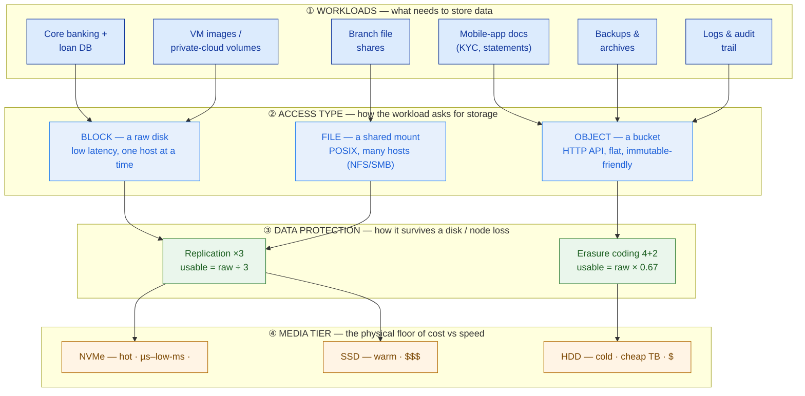
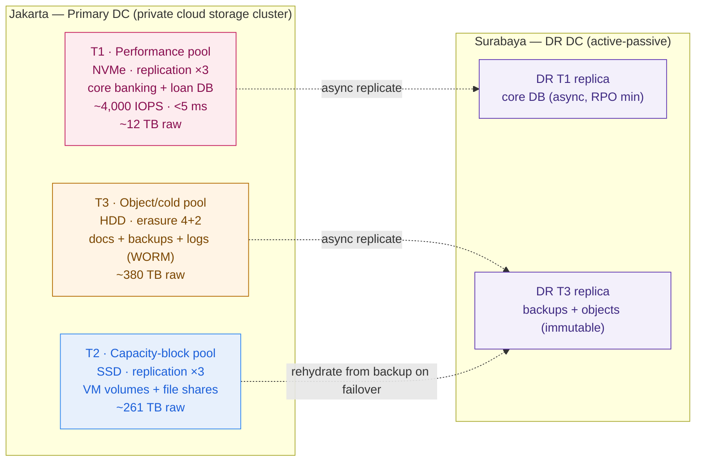

# Storage Architecture

> Capacity is the question everyone asks; performance and protection are the questions that lose deals. Size all three, or you ship a platform that is slow, over-priced, or one disk failure from a headline.

**Type:** Design
**Track:** AI, Data & Infrastructure Solution Architect (Presales)
**Prerequisites:** 2.1 Compute & Virtualization
**Time:** ~5h
**Lab:** MinIO / single-node Ceph (see [`lab/`](../lab/))
**Ship It:** Storage design + sizing

## The Problem

You are the SA on **Garuda Finance** — an Indonesian financial-services firm, ~600 branches, ~8 million customers, running core banking, loan origination, and a mobile app that peaks at ~4,000 transactions per minute. They are tired of the VMware bill and want an on-prem **private cloud** across their two data centers (Jakarta primary, Surabaya DR), with public-cloud workloads coming home. You designed the compute in the last lesson. Now someone asks the question that quietly decides whether the whole platform works: *"How much storage do we buy, and what kind?"*

The rookie answer is a single number in terabytes. So you add up the databases, the VM images, the documents, sprinkle in some growth, and quote "we need about 260 TB." You pick a cost-effective all-HDD array because the spreadsheet only had one column — capacity — and HDD gives the most terabytes per rupiah. It looks defensible. It is a trap. On go-live, core banking latency spikes every afternoon at peak because 4,000 txns/min is a **random-IOPS** workload and spinning disks answer at 5–12 milliseconds each; the database is starved, not full. The OJK auditor asks where the **immutable** backups live and how you meet the recovery-time and recovery-point objectives to Surabaya — and there is no object tier, no WORM, no replication plan in your design at all. The mobile app team mentions they store KYC scans and statements — tens of terabytes of **objects** you never budgeted. And when you finally price protection, you discover that "260 TB usable" with triple replication means buying closer to **650 TB of raw disk**, blowing the number you already put in the proposal.

Every one of those failures comes from the same root mistake: **treating storage as one dimension when it is at least four** — capacity, performance (IOPS / throughput / latency), protection overhead, and access type (block vs file vs object). An architect who can't separate *how much* from *how fast*, or a database volume from a document bucket, designs a platform that is simultaneously too slow for the crown-jewel workload and too expensive for the cold data — the worst of both. This lesson gives you the four dimensions, the math that converts usable to raw, and a repeatable way to tier a design so the fast pool stays small and expensive and the big pool stays cheap and safe. Get this right and storage stops being the line item that sinks the proposal and becomes the part the customer trusts most.

## The Concept

Storage decisions live on **four axes at once**. Every workload has to be placed on all four, and the tightest axis wins. Reason across them before you draw a single pool.



### Axis 1 — Access type: block vs file vs object

This is the first fork, and picking wrong makes everything downstream awkward. Each type answers a different question:

| | **Block** | **File** | **Object** |
|---|---|---|---|
| Looks like | A raw disk / volume | A shared folder | A bucket reached over HTTP |
| Protocol | iSCSI, FC, NVMe-oF, Ceph RBD | NFS, SMB, CephFS | S3 / Swift API |
| Access unit | Fixed-size blocks | Files + directories | Whole objects + metadata |
| Concurrency | One host mounts it | Many hosts share it | Massively parallel clients |
| Sweet spot | **Databases, VM disks** — low latency | Home dirs, app shares, legacy apps | **Documents, backups, images, logs, data lakes** |
| Scale ceiling | Volume-sized | Filesystem-sized | Effectively unbounded |
| Immutability / versioning | No (it's a disk) | Limited | **Native (WORM, versioning)** — regulator gold |

The architect's shortcut: **transactional and latency-sensitive → block; shared POSIX → file; anything you keep a lot of, keep for a long time, or must keep unchanged → object.** For Garuda, core banking is block, branch shares are file, and KYC scans, statements, backups, and audit logs are all object — which is exactly the tier the naïve design forgot.

### Axis 2 — Performance: IOPS vs throughput vs latency

"Fast" is three different metrics, and workloads care about different ones:

- **IOPS** — random operations per second. Databases and transaction systems live here. 4,000 txns/min is an IOPS problem.
- **Throughput** — MB/s of sequential data. Backups, analytics scans, and media streaming live here.
- **Latency** — milliseconds per operation. This is *responsiveness* — the "feel" of a transaction. A core-banking write that takes 12 ms instead of 0.2 ms is the afternoon slowdown.

You choose the media tier by the **tightest** of the three, not by capacity.

```
MEDIA TIER      IOPS / device     LATENCY / op    REL. $/usable TB   REACH FOR IT WHEN…
──────────────────────────────────────────────────────────────────────────────────────
NVMe SSD        ~100k – 1M        ~0.05–0.3 ms    $$$$               core-bank DB, hot indexes
SATA/SAS SSD    ~20k – 100k       ~0.2–1 ms       $$$                VM volumes, warm data, file
7.2k HDD        ~80 – 180         ~5–12 ms        $                  backups, objects, logs, cold
──────────────────────────────────────────────────────────────────────────────────────
IOPS = random ops/sec (databases)   THROUGHPUT = MB/s (backups/analytics)   LATENCY = ms/op (feel)
Sanity check: 4,000 IOPS ÷ ~100 IOPS/HDD ≈ 40 HDDs just for the count — and still ~5–12 ms latency.
The same 4,000 IOPS is a handful of NVMe at <0.3 ms. This is why you NEVER size hot data by capacity alone.
```

That single sanity check is the whole lesson in three lines: capacity would let you serve core banking from a dozen big HDDs; **latency forbids it.** Size the hot pool by IOPS-and-latency, and the cold pool by capacity-and-cost — never one rule for both.

### Axis 3 — Data protection: replication vs erasure coding (and the raw-vs-usable tax)

Storage that isn't protected isn't storage — it's a countdown to data loss. Two mechanisms dominate software-defined storage, and each buys durability with a different amount of overhead:

- **Replication factor N** — keep N full copies on N different failure domains. `×3` is the finance default: survive two simultaneous losses, rebuild fast, low CPU. **Cost: usable = raw ÷ N.** Triple replication means you *use* one third of what you *buy*.
- **Erasure coding k+m** — split data into `k` chunks plus `m` parity chunks across `k+m` domains; survive any `m` losses. `4+2` survives two losses like ×3 but only costs `m/(k+m)` overhead. **Cost: usable = raw × k/(k+m)** → 4+2 = 67% usable, far cheaper than ×3's 33%. The price is more CPU and higher latency on writes and rebuilds — fine for cold object, wrong for a hot database.
- **RAID** is the traditional-array cousin (RAID-6 ≈ dual parity). Same idea, but scoped to one array/controller rather than a distributed cluster.

The rule an architect never forgets: **you buy raw, you use usable, and protection is the tax between them.** State the factor for every pool, or your capacity number is fiction.

```
USABLE → RAW  (the number every naïve design gets wrong)
────────────────────────────────────────────────────────────────────────────
STEP                          FORMULA                        NOTE
────────────────────────────────────────────────────────────────────────────
1  Usable you actually need   Σ(workload sizes)              from the capacity table
2  Provision for headroom     usable ÷ target-fill           never run a pool past ~70–80%;
                                 (use 0.75)                    Ceph needs room to rebalance
3  Apply protection overhead
     hot pools (replication)    × N            (×3 → ×3.0)    fast, simple, expensive
     cold pools (erasure 4+2)   × (k+m)/k      (4+2 → ×1.5)   cheap, more CPU, higher latency
4  Raw disk to buy             sum per pool                   THIS is the procurement number
────────────────────────────────────────────────────────────────────────────
RULE OF THUMB: raw ≈ 2–3 × usable. If a quote shows raw ≈ usable, someone forgot
protection and headroom — and the cluster fails its first disk or fills to a standstill.
```

### Axis 4 — The platform: SAN vs software-defined vs HCI vs NAS

Where do the pools physically live? Four shapes, covered in depth in *Compare It*, but the mental model:

- **SAN** — a dedicated block appliance (Dell, NetApp, Pure) on its own storage network. Proven, low-ops, expensive, great latency for databases.
- **Software-defined storage (Ceph)** — pool commodity servers' disks into one cluster that serves block **and** file **and** object. Flexible, scales, open-source; you own the operational complexity.
- **HCI (hyperconverged)** — collapse compute and storage into the same nodes (Nutanix, VMware vSAN). Simple to run, VM-centric, scales in lockstep.
- **NAS** — a file-first appliance for shares. Simple, but file-only.

Now put the four axes together and the design writes itself: **each workload → an access type → a protection scheme → a media tier → a pool on a platform.** The Concept is a sorting exercise; *Design It* is where we run it for Garuda with real numbers.

## Design It

**Goal:** produce a storage design + sizing for Garuda's private cloud — capacity, performance, protection, tiers, and the raw-vs-usable math — defensible to both the CTO and the OJK auditor. Work six steps. Every number is a **labelled assumption with a range**, never a magic number; the verbatim facts (8M customers, 4,000 txns/min, 600 branches, two DCs) are the only fixed inputs.

### Step 1 — Classify every workload by access type and performance profile

Before sizing anything, sort the workloads onto Axis 1 and Axis 2. This one table prevents the "all-HDD" and "no-object-tier" mistakes at the source.

| Workload | Access type | Perf profile | Media implied |
|---|---|---|---|
| Core banking + loan-origination DB | **Block** | Random IOPS, tight latency | NVMe |
| VM images / private-cloud volumes | **Block** | Mixed, moderate latency | SSD |
| Branch file shares / app shares | **File** | Sequential, tolerant | SSD/HDD |
| Mobile-app documents (KYC, statements) | **Object** | Throughput, huge scale | HDD |
| Backups & archives (OJK retention) | **Object** | Throughput, immutable | HDD |
| Logs, metrics, audit trail | **Object** | Append/throughput | HDD |

The instant the table exists, two of the opening blunders are dead: core banking is on flash, and object is a first-class tier — not an afterthought.

### Step 2 — Size capacity per workload (assumptions + ranges)

Now put usable terabytes on each row. State the assumption and a range for every one; the design point is a defensible midpoint, not a promise.

| # | Assumption (labelled) | Design point | Range |
|---|---|---|---|
| A1 | Core DB: 8M customers × ~100 KB structured (profile, accounts, indexed recent history) + loan data + working set + indexes | **3 TB usable** | 2–4 TB |
| A2 | Repatriated VM estate: ~400 VMs × ~120 GB thin (VMware DCs + returning cloud workloads) | **50 TB usable** | 30–75 TB |
| A3 | File shares across 600 branches (documents, app shares, home dirs) | **15 TB usable** | 10–25 TB |
| A4 | Mobile-app + KYC objects: 8M customers × ~3 docs × ~1.5 MB, plus statements accruing | **50 TB usable** | 30–80 TB |
| A5 | Backups: full + incrementals of block & object over OJK retention window | **120 TB usable** | 80–200 TB |
| A6 | Logs, metrics, audit trail (immutable, OJK reporting) | **20 TB usable** | 10–40 TB |
| | **Total usable (design)** | **≈ 258 TB** | ~160–420 TB |

The 258 TB is the *midpoint* number — and note it is nearly identical to the naïve "260 TB" from The Problem. Same capacity, but everything about *what to buy* is different, because we're about to add performance and protection.

### Step 3 — Size performance for the crown jewel (IOPS from txns/min)

Capacity sizing never touches the core-banking pool's real constraint. Derive IOPS from the one verbatim performance fact.

```
GIVEN (verbatim):   4,000 transactions / minute at peak  =  ~67 txns/sec
A7  storage IOPS per business txn = 20–40
    (balance reads + ledger write + journal write + index + audit updates)   → design 30
    peak DB IOPS  ≈  67 × 30  ≈  2,000 IOPS
A8  read amplification (reporting, replicas, batch overlap) + burst headroom  → ×2
    DESIGN TARGET  ≈  4,000 IOPS sustained ,  provision to ~6,000 IOPS burst
    RANGE:  2,000 (lean)  –  6,000 (conservative) IOPS
LATENCY BUDGET:  < ~2–5 ms / op for transaction feel
```

The latency budget is the decider. A 7.2k HDD delivers ~80–180 IOPS at ~5–12 ms — you'd need **~40 HDDs** just to reach the IOPS count and *still* miss the latency target. A handful of NVMe devices delivers the same 4,000 IOPS at <0.3 ms. **Conclusion: the core-banking pool must be NVMe, and it is small (3 TB usable) — so its flash cost is bounded.** This is the payoff of tiering: you buy expensive media only for the few TB that actually need it.

### Step 4 — Choose protection per pool

Match the protection mechanism to how hot the data is. Finance wants dual-failure survival everywhere; the choice is *how* you pay for it.

| Pool | Contents | Protection | Why |
|---|---|---|---|
| **T1 — Performance** | Core banking + loan DB | **Replication ×3** | Lowest latency + fastest rebuild; small pool, so 3× tax is cheap in absolute terms |
| **T2 — Capacity-block** | VM volumes + file shares | **Replication ×3** | VMs need decent latency; ×3 keeps rebuilds fast |
| **T3 — Object/cold** | Docs + backups + logs | **Erasure coding 4+2** | Same dual-failure survival at 67% usable vs 33% — the cheap way to hold the bulk |

Design decision to defend: **replication for the small hot pools, erasure coding for the large cold pool.** Using ×3 on the 190 TB of cold data would force buying ~570 TB raw for it alone; EC 4+2 cuts that to ~285 TB for the same durability. That one choice is the difference between a sane and an absurd BOM.

### Step 5 — Compute raw from usable (the procurement number)

Apply the usable→raw formula per pool, with a 75% target-fill headroom.

```
POOL        USABLE(design)   ÷0.75 (headroom)   × PROTECTION       = RAW TO BUY     MEDIA
──────────────────────────────────────────────────────────────────────────────────────────
T1 Perf     3 TB             4 TB               ×3  (replication)   ≈  12 TB         NVMe
T2 Cap-blk  50+15 = 65 TB    87 TB              ×3  (replication)   ≈ 261 TB         SSD
T3 Object   50+120+20=190 TB 253 TB             ×1.5 (EC 4+2)       ≈ 380 TB         HDD
──────────────────────────────────────────────────────────────────────────────────────────
TOTAL       258 TB usable                                          ≈ 653 TB RAW     (ratio ≈ 2.5×)
```

**Headline for the executive summary:** *258 TB usable needs ~650 TB of raw disk — you buy about 2.5× what you can use.* Replication is why the flash bill has weight; erasure coding is why the cold tier doesn't. Anyone who quoted "260 TB" of disk under-bought by more than half. Give the range too: at the assumption band edges, raw lands roughly **400–1,050 TB** — quote the ~650 TB design point *with* that band, never alone.

### Step 6 — Add DR replication and the cluster-minimum constraint

Two facts the sizing must not omit — both flow from OJK and from Ceph's own rules.

- **DR to Surabaya (active-passive, RTO/RPO).** Asynchronously replicate the **critical subset** — core DB (T1), backups and objects (T3) — to a second cluster at Surabaya. That is a second copy of the critical pools at the DR site (VMs may re-hydrate from backup rather than replicate live, a cost lever to state). Async replication gives an RPO of minutes; immutable/WORM object backups give ransomware and audit protection. Size DR as *critical-subset usable × its own protection at the second site* — a separate line, not folded into primary raw.
- **You cannot erasure-code on three nodes.** EC 4+2 needs ≥6 independent failure domains (host-level durability wants ≥7 nodes); a production Ceph cluster is realistically **≥5–7 nodes minimum**, more once EC and rack-awareness are in play. This caps how small the entry cluster can be and is a design constraint the customer must hear early.

Put it together and the private-cloud storage topology is legible to an engineer and an executive at once:



That is the whole storage design: three tiers sized by the axis that binds them, protection stated per pool, raw derived from usable, DR and cluster minimums called out. The *Ship It* template turns this into a form a colleague can run on the next deal.

## Compare It

Which platform actually delivers these pools? Five real options, and the "it depends" a customer will push on: **cost, operational burden, and fit.**

| Platform | What it is | Serves | Ops burden | Cost shape | Fits when… |
|---|---|---|---|---|---|
| **Ceph** | Distributed software-defined storage on commodity servers | Block + file + object (one cluster) | **High** — you own tuning, upgrades, failure handling | Capex on commodity HW; no licence | You want one platform for all three types and have (or will build) storage-ops muscle |
| **Longhorn** | Lightweight, K8s-native block storage (Rancher/SUSE) | Block for Kubernetes PVs | **Low** | Open-source | K8s stateful apps, small-to-mid scale, thin ops — *not* heavy core-banking IOPS |
| **MinIO** | S3-compatible object storage, fast and simple | Object only | **Low** | Open-source (+ optional support) | You need object/backups/data-lake and want a drop-in S3 endpoint without running Ceph's full stack |
| **Traditional SAN** (Dell PowerStore, NetApp, Pure) | Dedicated block/file appliance on a storage network | Block (+ file) | **Low** — vendor-run reliability | **High capex + support**, vendor lock | Latency-critical databases that want guaranteed performance and a support throat to choke |
| **HCI** (Nutanix, VMware vSAN) | Compute + storage collapsed into the same nodes | Block/file for VMs (object add-ons) | **Low–medium** | Node-based licence + HW | VM-centric private cloud wanting simple ops; vSAN is ironic when the driver is *leaving* VMware cost |

**The "it depends" for Garuda.** They are leaving VMware for **cost**, have **thin Kubernetes/storage skills**, must stay **on-prem and in-country (OJK)**, and run **24/7 payments**. That profile pulls in two directions: Ceph gives them one unified, licence-free fabric (attractive on cost, unifies block+file+object) but demands the exact ops skill they lack; a pure appliance (SAN/HCI) is easy to run but reintroduces the licence/lock cost they're fleeing. The defensible answer is usually a **blend**, and saying so out loud is what an architect does:

- **Core banking (T1)** — the regulator-facing crown jewel. Put it on **NVMe with vendor support** (a small SAN/appliance *or* a tightly-run Ceph NVMe pool) to guarantee latency and give OJK a support story. De-risk the one workload that cannot wobble.
- **VMs + file (T2)** — **Ceph or HCI.** If skills are genuinely thin, HCI (Nutanix) buys simpler ops at a licence cost; if the cost driver dominates and they'll invest in a small storage team, Ceph unifies it.
- **Object (T3)** — **MinIO or Ceph RGW** with erasure coding and WORM for backups/audit. This is the cheap, scalable, immutable tier OJK will ask about by name.

The trap to name for them: **vSAN "solves" storage but keeps them inside the VMware licensing they set out to escape** — worth a slide, because a competitor will pitch it as the easy button.

## Ship It

This lesson ships a reusable **Storage Design + Sizing** deliverable — the artifact that turns "how much storage?" into a defensible, tiered, raw-vs-usable answer. Both files live in [`outputs/`](../outputs/):

- **[`template-storage-design-and-sizing.md`](../outputs/template-storage-design-and-sizing.md)** — a fill-in-the-blank template: workload classification, an assumptions register (with ranges), capacity + IOPS sizing, protection-per-pool, the usable→raw calculator, a tiered-pool + DR design (Mermaid skeleton + ASCII fallback), and a risks/assumptions log. A colleague can run it on any infrastructure deal.
- **[`example-garuda-finance-storage-design.md`](../outputs/example-garuda-finance-storage-design.md)** — the template fully worked for Garuda Finance, so the skeleton isn't abstract: 258 TB usable → ~650 TB raw across three tiers, the core-banking IOPS derivation, and the DR/cluster-minimum notes.

The optional [`lab/`](../lab/) lets you stand up MinIO (or single-node Ceph) in minutes to *feel* the difference between a block volume and an object bucket — including versioning/WORM — so the object tier stops being an abstraction. This deliverable feeds directly into **Capstone B (On-Prem Private Cloud)**: it is the storage section of that HLD + BOM.

## Exercises

1. **(Easy)** Take Garuda's six-workload table from Step 1 and, for each row, name its access type (block/file/object) and the *tightest* performance axis (IOPS, throughput, or latency). Then write one sentence explaining why core banking cannot sit on the same HDD pool as the backups — using the IOPS-vs-latency sanity check, not capacity.
2. **(Medium)** Re-run the sizing for a **different customer**: a national **e-commerce marketplace** with ~2 million product images, a shopping-cart database, and nightly analytics exports. Classify the workloads, pick a protection scheme per pool (justify replication vs erasure coding), and compute usable→raw for one hot pool and one cold pool. State every assumption with a range.
3. **(Hard)** Extend Garuda's design into a **cost-and-risk trade study**: keep the crown-jewel core-banking tier on a SAN appliance vs on a Ceph NVMe pool. Write a half-page recommendation naming the cost shape, the ops-burden difference, the OJK support-story implication, and the failure mode of each path. Reuse the raw-vs-usable numbers from your Step 5 table and carry the recommendation into your **Capstone B** storage section.

## Key Terms

| Term | What people say | What it actually means |
|------|-----------------|------------------------|
| Block storage | "A hard drive" | A raw volume presented to *one* host at a time (iSCSI/FC/RBD). Lowest latency — where databases and VM disks belong. |
| Object storage | "Cloud files" | Data as immutable objects reached over an HTTP/S3 API in a flat namespace. Unbounded scale + native versioning/WORM — the home for documents, backups, logs. |
| File storage | "A network drive" | A shared POSIX filesystem many hosts mount (NFS/SMB/CephFS). For shares and legacy apps that expect a mount point. |
| IOPS | "Speed" | Random operations per second — the metric transactional databases live by. Not the same as throughput; a workload can be IOPS-bound while barely moving MB/s. |
| Throughput | "Bandwidth" | Sequential MB/s. What backups and analytics scans need. A pool can be great at throughput and terrible at IOPS (HDDs), or vice-versa. |
| Latency | "Lag" | Milliseconds per operation — the *feel* of a transaction. The axis that forces flash for hot data even when capacity says HDD would do. |
| Replication factor | "Backups" | Keeping N full copies across N failure domains. ×3 → you use one third of raw. Fast rebuild, low CPU, high cost. Not a backup — it's live redundancy. |
| Erasure coding (k+m) | "RAID for clusters" | Split into k data + m parity chunks; survive m losses at m/(k+m) overhead. 4+2 = 67% usable. Cheap durability for cold data; higher write/rebuild latency. |
| Usable vs raw | "Capacity" | Usable is what workloads see; raw is what you buy. Protection + headroom make raw ≈ 2–3× usable. Quoting raw as if it were usable is the classic under-sizing error. |
| Software-defined storage | "Ceph" | Pooling commodity servers' disks into one cluster serving block/file/object in software. Flexible and licence-free; you inherit the operational burden. |
| HCI | "Nutanix / vSAN" | Hyperconverged — compute and storage in the same nodes, scaling together. Simple to operate, VM-centric; storage and compute grow in lockstep whether you want it or not. |

## Further Reading

- [Ceph Architecture](https://docs.ceph.com/en/latest/architecture/) — how one cluster serves block (RBD), file (CephFS), and object (RGW), and how CRUSH places replicas/erasure chunks across failure domains. Read this once and the raw-vs-usable math stops being magic.
- [Ceph — Erasure Code](https://docs.ceph.com/en/latest/rados/operations/erasure-code/) — the k+m mechanics, overhead formula, and why EC is right for cold pools and wrong for hot ones.
- [MinIO Erasure Coding & Object Locking (WORM)](https://min.io/docs/minio/linux/operations/concepts/erasure-coding.html) — the object + immutability story an OJK-style auditor asks for by name; also the fastest lab to run.
- [AWS EBS Volume Types](https://docs.aws.amazon.com/ebs/latest/userguide/ebs-volume-types.html) — even for an on-prem design, the cloud's IOPS/throughput/latency tiering vocabulary is the clearest calibration for "which media for which workload."
- [Backblaze — HDD vs SSD in the data center](https://www.backblaze.com/blog/hdd-vs-ssd-in-data-centers/) and the [SNIA storage dictionary](https://www.snia.org/education/dictionary) — real-world device numbers and precise definitions to keep your tier table honest.
