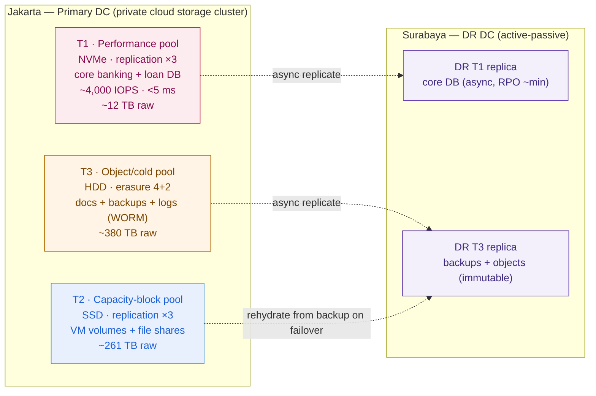

# Storage Design + Sizing — Garuda Finance (worked example)

> This is `template-storage-design-and-sizing.md` filled in for the running customer. It shows what "good" looks like: capacity, IOPS, protection, and the usable→raw math, all traced to labelled assumptions with ranges. It is the storage section of the **Capstone B** private-cloud HLD/BOM.

**Customer:** Garuda Finance (fictional)  ·  **Industry:** Financial services (retail + lending), Indonesia
**Prepared by:** SA — Presales  ·  **Date:** 2026-07-04  ·  **Opportunity:** On-prem private cloud (VMware exit + cloud repatriation)  ·  **Version:** v0.2
**Sites:** Jakarta (primary) · Surabaya (DR)  ·  **DR posture:** active-passive  ·  **RTO/RPO target (assumed):** RTO ~1h / RPO ~15min — *confirm against OJK BCP-DR requirement*

**Company shape (verbatim):** ~600 branches · ~8 million customers · core banking + loan origination + mobile app · ~4,000 txns/min peak · aging VMware across 2 DCs · public cloud to repatriate.
**Drivers:** VMware cost · OJK (data residency, BCP-DR, reporting) · resilience (active-passive DR, RTO/RPO) · wants Kubernetes.
**Constraints:** 24/7 payments · thin Kubernetes/storage skills · on-prem, in-country.

Legend: **usable** = what workloads see · **raw** = what you buy · **EC** = erasure coding · **WORM** = immutable object lock.

---

## 1. Workload classification (access type × performance profile)

| Workload | Access type | Perf profile | Media implied |
|---|---|---|---|
| Core banking + loan-origination DB | **Block** | Random IOPS, tight latency | NVMe |
| VM images / private-cloud volumes | **Block** | Mixed, moderate latency | SSD |
| Branch file shares / app shares | **File** | Sequential, tolerant | SSD/HDD |
| Mobile-app documents (KYC, statements) | **Object** | Throughput, huge scale | HDD |
| Backups & archives (OJK retention) | **Object** | Throughput, immutable (WORM) | HDD |
| Logs, metrics, audit trail | **Object** | Append/throughput | HDD |

Two failure modes closed on sight: **core banking is on flash** (not the cheap HDD array), and **object is a first-class tier** (KYC scans, statements, backups, audit — the things the naïve "260 TB HDD" design forgot).

## 2. Capacity sizing (assumptions register + ranges)

| # | Assumption (labelled) | Design point (usable) | Range |
|---|---|---|---|
| A1 | Core DB: 8M customers × ~100 KB structured (profile, accounts, indexed recent history) + loan data + working set + indexes | **3 TB** | 2–4 TB |
| A2 | Repatriated VMs: ~400 VMs × ~120 GB thin (VMware DCs + returning cloud workloads) | **50 TB** | 30–75 TB |
| A3 | File shares across 600 branches (documents, app shares, home dirs) | **15 TB** | 10–25 TB |
| A4 | Mobile-app + KYC objects: 8M customers × ~3 docs × ~1.5 MB, plus statements accruing | **50 TB** | 30–80 TB |
| A5 | Backups: full + incrementals of block & object over OJK retention window | **120 TB** | 80–200 TB |
| A6 | Logs, metrics, audit trail (immutable, OJK reporting) | **20 TB** | 10–40 TB |
| | **Total usable (design)** | **≈ 258 TB** | **~160–420 TB** |

**Growth:** assume +`~20%`/yr on object (A4) and backups (A5) as customers and retention grow — this design provisions a ~12–18 month horizon; re-baseline at year 1. *Confirm OJK retention window; it directly drives A5/A6.*

## 3. Performance sizing (core banking, from txns/min)

```
GIVEN (verbatim):   4,000 transactions / minute at peak  =  ~67 txns/sec
A7  storage IOPS per business txn = 20–40
    (balance reads + ledger write + journal write + index + audit updates)   → design 30
    peak DB IOPS  ≈  67 × 30  ≈  2,000 IOPS
A8  read amplification (reporting, replicas, batch overlap) + burst headroom  → ×2
    DESIGN TARGET ≈ 4,000 IOPS sustained ,  provision to ~6,000 IOPS burst
    RANGE:  2,000 (lean) – 6,000 (conservative) IOPS
LATENCY BUDGET:  < ~2–5 ms / op (transaction feel)
```

**Tier decision — the latency budget decides:**

```
Sanity check:  4,000 IOPS ÷ ~100 IOPS/HDD  ≈  40 HDDs just for the count — and still 5–12 ms.
               Same 4,000 IOPS  =  a handful of NVMe at <0.3 ms.
→ Core banking (T1) MUST be NVMe. It is only 3 TB usable, so the flash cost is BOUNDED.
```

This is the payoff of tiering: expensive media is bought only for the ~3 TB that truly needs it, not for all 258 TB.

## 4. Protection per pool

| Pool | Contents | Protection | Overhead | Why |
|---|---|---|---|---|
| **T1 — Performance** | Core banking + loan DB | **Replication ×3** | ×3.0 | Lowest latency, fastest rebuild; small pool → 3× tax cheap in absolute terms |
| **T2 — Capacity-block** | VM volumes + file shares | **Replication ×3** | ×3.0 | VMs need decent latency; ×3 keeps rebuilds fast |
| **T3 — Object/cold** | Docs + backups + logs | **Erasure coding 4+2** | ×1.5 | Dual-failure survival at 67% usable vs 33%; **WORM** on backups + audit |

**Why not ×3 everywhere:** ×3 on the 190 TB cold bulk would force ~570 TB raw for that pool alone. EC 4+2 delivers the same dual-failure durability at ~285 TB raw. That single choice is the line between a sane and an absurd BOM.

## 5. Usable → raw (the procurement number)

```
POOL        USABLE(design)    ÷0.75 (headroom)   × PROTECTION       = RAW TO BUY     MEDIA
──────────────────────────────────────────────────────────────────────────────────────────
T1 Perf     3 TB              4 TB               ×3  (replication)   ≈  12 TB         NVMe
T2 Cap-blk  50+15 = 65 TB     87 TB              ×3  (replication)   ≈ 261 TB         SSD
T3 Object   50+120+20=190 TB  253 TB             ×1.5 (EC 4+2)       ≈ 380 TB         HDD
──────────────────────────────────────────────────────────────────────────────────────────
TOTAL       258 TB usable                                           ≈ 653 TB RAW     (ratio ≈ 2.5×)
```

**Range, not a magic number:** at the assumption band edges (§2 ranges), raw lands roughly **400–1,050 TB**. Quote the **~650 TB** design point *with* that band.

**Cluster minimum:** EC 4+2 needs ≥6 failure domains; host-level durability wants ≥7 nodes. Minimum viable Ceph cluster ≈ **7 nodes** (more once rack-awareness is added). *You cannot run EC 4+2 on 3 nodes — a constraint the customer must hear before they scope a tiny pilot.*

**DR sizing (separate line):** replicate the **critical subset** — T1 (core DB) + T3 (backups + objects) — to Surabaya. DR raw ≈ (3 TB T1 + 190 TB T3, at their own protection, ÷ 0.75) ≈ **~300 TB raw** at the DR site (VMs re-hydrate from replicated backup on failover rather than live-replicating — a stated cost lever). Async replication → RPO ~minutes; WORM backups cover ransomware + audit. *Confirm inter-DC bandwidth supports the async RPO for T1.*

## 6. Tiered-pool + DR design



### ASCII fallback

```
JAKARTA — Primary DC                                 SURABAYA — DR (active-passive)
┌──────────────────────────────────────────┐        ┌────────────────────────────────┐
│ T1 Performance   NVMe · ×3                 │─async─▶│ DR T1  core DB (RPO ~min)      │
│    core+loan DB  ~4,000 IOPS <5ms  ~12 TB  │        │                                │
│ T2 Capacity-blk  SSD · ×3                  │rehydr. │                                │
│    VMs + file                     ~261 TB  │─ ─ ─ ─▶│ DR T3  backups + objects       │
│ T3 Object/cold   HDD · EC 4+2 (WORM)       │─async─▶│        (immutable / WORM)      │
│    docs+backups+logs              ~380 TB  │        │                                │
└──────────────────────────────────────────┘        └────────────────────────────────┘
TOTAL usable 258 TB → TOTAL raw ~653 TB (ratio ~2.5×)     Min cluster: ~7 nodes (for EC 4+2)
```

## 7. Headline, risks & one-line design statement

**Executive headline:**
> **258 TB usable needs ≈ 650 TB of raw disk (ratio ≈ 2.5×)** across three tiers — quoted with a range of **~400–1,050 TB** at the assumption band edges. Core banking runs on a small NVMe pool for latency; the ~190 TB cold bulk runs on HDD with erasure coding for cost; the critical subset replicates to Surabaya for DR. Anyone who quoted "260 TB" of disk under-bought by more than half.

| # | Risk / assumption to confirm | Impact if wrong | Owner | Severity |
|---|---|---|---|---|
| 1 | A7/A8 — IOPS per txn (20–40) and ×2 amplification | Under-sized T1 → afternoon latency spikes | DBA / core-banking vendor | **H** |
| 2 | A4/A5 — object + backup growth and OJK retention window | T3 fills early; retention non-compliance | App team / Compliance | **H** |
| 3 | Cluster node minimum (~7) vs pilot budget | Cannot run EC 4+2 on a small cluster | Infra | M |
| 4 | Inter-DC bandwidth Jakarta↔Surabaya for async T1 | RPO target missed | Network | **H** |
| 5 | Core-banking tier platform (SAN vs Ceph NVMe) | Latency guarantee + OJK support story | SA / vendor | M |

**One-line design statement:**
> Garuda's storage is **three tiers**: an **NVMe ×3** pool for core banking (sized by IOPS/latency, ~12 TB raw), an **SSD ×3** pool for VMs + file (~261 TB raw), and an **HDD EC-4+2** pool for documents, backups, and audit with WORM (~380 TB raw) — **258 TB usable ⇒ ~650 TB raw** — with core DB + backups replicated async to Surabaya for active-passive DR at RTO ~1h / RPO ~15min.

## Carry-forward → Capstone B (On-Prem Private Cloud)

| Item | Value to carry | Where it lands |
|---|---|---|
| Raw capacity to procure | ~650 TB primary (~400–1,050 band) + ~300 TB DR | BOM — disk lines per tier |
| Tier media split | ~12 TB NVMe · ~261 TB SSD · ~380 TB HDD | BOM — device selection |
| Min cluster size | ~7 storage nodes (EC 4+2) | HLD — cluster topology, rack layout |
| Core-banking platform decision | SAN vs Ceph NVMe (Exercise 3 trade study) | HLD — de-risk decision + risk register |
| DR replication | Critical subset async to Surabaya, WORM backups | HLD — BCP-DR section, OJK mapping |

> Every figure here is a **design point with a stated assumption and range** — the number the customer can challenge, and you can defend, line by line.
