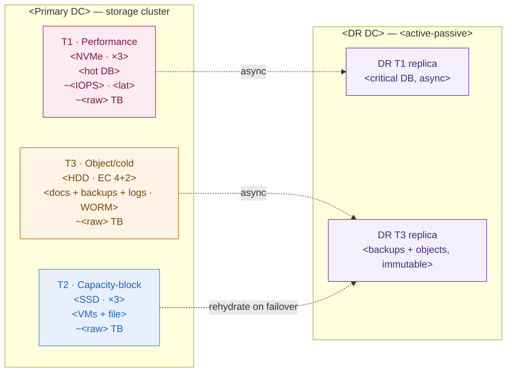

# Storage Design + Sizing — Template

> Fill this in when you must answer "how much storage, and what kind?" It forces the four axes — **capacity, performance, protection, access type** — so you never quote a single capacity number again. An executive should read §7's headline; an engineer should trust §2–§6. Never present a number without its **assumption** and a **range**.

**Customer:** `<company>`  ·  **Industry:** `<industry>`  ·  **Prepared by:** `<SA name>`  ·  **Date:** `<YYYY-MM-DD>`
**Engagement / opportunity:** `<deal or project name>`  ·  **Version:** `<v0.1 draft>`
**Sites:** `<primary DC>` (primary) · `<second DC>` (DR) · **DR posture:** `<active-passive / active-active>` · **RTO/RPO target:** `<e.g. RTO 1h / RPO 15min>`

Legend: **usable** = what workloads see · **raw** = what you buy · **IOPS** = random ops/sec · **EC** = erasure coding · **WORM** = write-once-read-many (immutable).

---

## How to use this template

1. **Classify** every workload by access type (block/file/object) and its tightest performance axis (§1).
2. **Size capacity** per workload — each row a labelled assumption + range (§2).
3. **Size performance** for the latency-critical workload from a real transaction/throughput number (§3).
4. **Choose protection** per pool: replication for hot, erasure coding for cold (§4).
5. **Compute raw from usable** with headroom + protection overhead (§5).
6. **Draw the tiered pools + DR** (§6, Mermaid + ASCII).
7. **State the headline, risks, and the one-line design statement** (§7).

> **Golden rule:** size the *hot* pool by IOPS-and-latency and the *cold* pool by capacity-and-cost. One tier for everything is the most expensive mistake in storage.

---

## 1. Workload classification (access type × performance profile)

| Workload | Access type (block / file / object) | Perf profile (IOPS / throughput / latency) | Media implied (NVMe / SSD / HDD) |
|---|---|---|---|
| `<core DB / OLTP>` | `<block>` | `<random IOPS, tight latency>` | `<NVMe>` |
| `<VM images / volumes>` | `<block>` | `<mixed>` | `<SSD>` |
| `<file shares>` | `<file>` | `<sequential, tolerant>` | `<SSD/HDD>` |
| `<documents / media>` | `<object>` | `<throughput, huge scale>` | `<HDD>` |
| `<backups / archive>` | `<object>` | `<throughput, immutable>` | `<HDD>` |
| `<logs / audit>` | `<object>` | `<append/throughput>` | `<HDD>` |

*Rule:* transactional + latency-sensitive → **block**; shared POSIX → **file**; large / long-lived / must-not-change → **object**. Any latency-critical row on an HDD tier is a red flag.

## 2. Capacity sizing (assumptions register — every row has a range)

| # | Assumption (state it explicitly) | Design point (usable) | Range |
|---|---|---|---|
| A1 | `<driver × unit size, e.g. N customers × KB>` | `<X TB>` | `<lo–hi TB>` |
| A2 | `<VM count × avg volume>` | `<X TB>` | `<lo–hi TB>` |
| A3 | `<file-share estimate>` | `<X TB>` | `<lo–hi TB>` |
| A4 | `<object count × object size>` | `<X TB>` | `<lo–hi TB>` |
| A5 | `<backup: change rate × retention>` | `<X TB>` | `<lo–hi TB>` |
| A6 | `<logs/audit: rate × retention>` | `<X TB>` | `<lo–hi TB>` |
| | **Total usable (design)** | **`<Σ TB>`** | **`<lo–hi TB>`** |

*Add a growth line:* expected +`<%>`/yr → note the 12–36 month horizon you're provisioning for.

## 3. Performance sizing (derive IOPS/throughput — don't guess)

> Only the latency-critical workload needs this. Derive it from a **verbatim** number (txns/min, users, MB/s), never a round guess.

```
GIVEN (verbatim):   <N> transactions / minute (or <N> users, <N> MB/s)   =  <N/60> per sec
A7  storage IOPS per business op = <lo>–<hi>   (reads + writes + index + journal + audit)  → design <mid>
    peak IOPS  ≈  <ops/sec> × <mid>  ≈  <X> IOPS
A8  amplification (reporting / replicas / batch) + burst headroom  → ×<factor>
    DESIGN TARGET ≈ <Y> IOPS sustained ,  provision to <Z> IOPS burst
    RANGE:  <lean> – <conservative> IOPS
LATENCY BUDGET:  < <n> ms / op        THROUGHPUT (if relevant): <MB/s> for <backups/analytics>
```

**Tier decision from the budget:**

```
MEDIA TIER      IOPS / device     LATENCY / op    $/usable TB   USE FOR
────────────────────────────────────────────────────────────────────────────
NVMe SSD        ~100k – 1M        ~0.05–0.3 ms    $$$$          hot DB, indexes
SATA/SAS SSD    ~20k – 100k       ~0.2–1 ms       $$$           VM volumes, warm, file
7.2k HDD        ~80 – 180         ~5–12 ms        $             backups, objects, logs, cold
────────────────────────────────────────────────────────────────────────────
Sanity check:  <target IOPS> ÷ ~100 IOPS/HDD = <n> HDDs just for the count — and still slow.
```

## 4. Protection per pool (replication vs erasure coding)

| Pool | Contents | Protection (`×N repl` / `k+m EC`) | Overhead multiplier | Why |
|---|---|---|---|---|
| **T1 — Performance** | `<hot DB>` | `<×3 repl>` | `<×3.0>` | `<lowest latency, fast rebuild>` |
| **T2 — Capacity-block** | `<VMs + file>` | `<×3 repl>` | `<×3.0>` | `<decent latency>` |
| **T3 — Object/cold** | `<docs + backups + logs>` | `<4+2 EC>` | `<×1.5>` | `<cheap durability at scale>` |

*Overhead:* replication ×N → multiplier `N`; erasure k+m → multiplier `(k+m)/k`. Immutability: mark which pools need **WORM/object-lock** (backups, audit) for the regulator/ransomware story.

## 5. Usable → raw (the procurement number)

```
POOL        USABLE(design)    ÷ target-fill(0.75)    × PROTECTION       = RAW TO BUY     MEDIA
──────────────────────────────────────────────────────────────────────────────────────────────
T1          <a> TB            <a/0.75> TB            <×N>                ≈ <raw> TB       <NVMe>
T2          <b> TB            <b/0.75> TB            <×N>                ≈ <raw> TB       <SSD>
T3          <c> TB            <c/0.75> TB            <×(k+m)/k>          ≈ <raw> TB       <HDD>
──────────────────────────────────────────────────────────────────────────────────────────────
TOTAL       <Σ usable> TB                                                ≈ <Σ raw> TB    (ratio ≈ <r>×)
```

**Cluster minimum check:** EC `k+m` needs ≥ `k+m` failure domains (host-level durability wants ≥ `k+m+1` nodes). Minimum viable cluster ≈ `<n>` nodes. *(You cannot run EC 4+2 on 3 nodes.)*

**DR sizing (separate line):** replicate the **critical subset** `<list pools>` to `<DR site>`; DR raw ≈ `<critical usable>` × `<its protection>` × `1/0.75`. Async replication → RPO `<minutes>`; state whether non-critical pools re-hydrate from backup on failover (cost lever).

## 6. Tiered-pool + DR design



### ASCII fallback (for docs/email that can't render Mermaid)

```
PRIMARY DC <___>                                    DR DC <___> (<active-passive>)
┌──────────────────────────────────────┐           ┌──────────────────────────────┐
│ T1 Performance  <NVMe · ×3>           │  ─async─▶ │ DR T1  <critical DB, RPO __>  │
│    <hot DB>  ~<IOPS>·<lat>  ~<raw>TB  │           │                              │
│ T2 Capacity-blk <SSD · ×3>            │  rehydrate│                              │
│    <VMs+file>              ~<raw>TB   │  ─ ─ ─ ─ ▶│ DR T3  <backups+objects,     │
│ T3 Object/cold  <HDD · EC 4+2>        │  ─async─▶ │        immutable/WORM>       │
│    <docs+backups+logs>    ~<raw>TB    │           │                              │
└──────────────────────────────────────┘           └──────────────────────────────┘
TOTAL usable <Σ> TB  →  TOTAL raw ~<Σ> TB  (ratio ~<r>×)   Min cluster: <n> nodes
```

## 7. Headline, risks & the one-line design statement

**Executive headline (fill in):**
> `<Σ usable>` TB usable needs **≈ `<Σ raw>` TB of raw disk** (ratio ≈ `<r>×`) across `<n>` tiers — quoted with a range of **`<lo>`–`<hi>` TB** at the assumption band edges. `<Hot pool>` is on flash for latency; the bulk is on HDD with erasure coding for cost.

| # | Risk / assumption to confirm | Impact if wrong | Owner | Severity |
|---|---|---|---|---|
| 1 | `<e.g. IOPS-per-txn assumption A7>` | `<under-sized hot pool → latency>` | `<DBA>` | `<H/M/L>` |
| 2 | `<e.g. object growth rate A4>` | `<cold tier fills early>` | `<app team>` | `<…>` |
| 3 | `<e.g. cluster node minimum vs budget>` | `<can't run chosen EC scheme>` | `<infra>` | `<…>` |
| 4 | `<e.g. DR bandwidth for async RPO>` | `<RPO target missed>` | `<network>` | `<…>` |

**One-line design statement:**
> Storage is **`<n>` tiers**: `<T1 media/protection>` for `<hot workload>` (sized by IOPS/latency), `<T2>` for `<VMs/file>`, and `<T3 EC>` for `<the cold bulk + immutable backups>` — **`<Σ usable>` TB usable ⇒ ~`<Σ raw>` TB raw**, with the critical subset replicated to `<DR site>` for RTO/RPO `<targets>`.

---

*Worked example: see `example-garuda-finance-storage-design.md` in this folder.*
