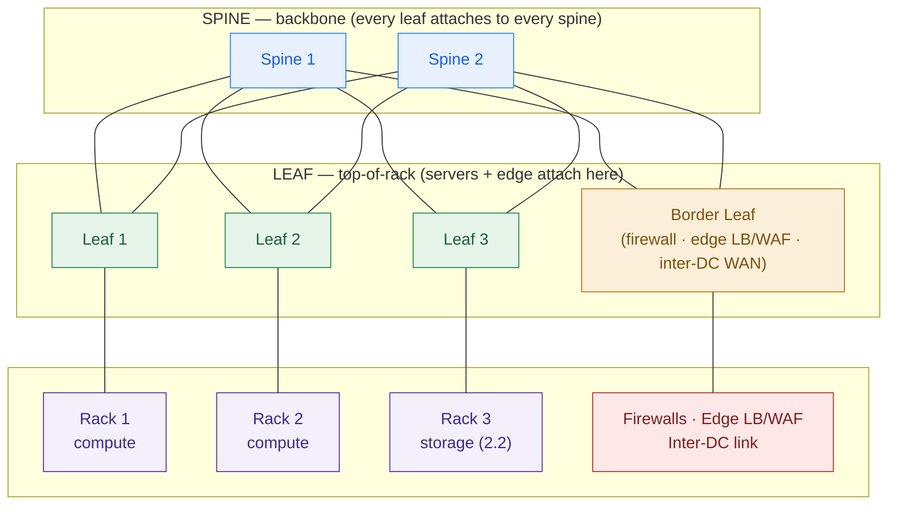

# Data-Center Networking

> In the data center, the network *is* the architecture. The fabric decides whether your private cloud is fast, segmented, and survivable — or none of the three. Draw it flat and the security review kills the deal before the compute even boots.

**Type:** Design
**Track:** AI, Data & Infrastructure Solution Architect (Presales)
**Prerequisites:** [2.2 Storage Architecture](../../02-storage-architecture/docs/en.md) · builds on [0.3 Networking Mental Models](../../../00-foundations/03-networking-mental-models/docs/en.md)
**Time:** ~4h
**Lab:** —
**Ship It:** DC network HLD

## The Problem

You are the infrastructure SA on **Garuda Finance** — an Indonesian financial-services firm with ~600 branches and ~8M customers, running core banking, loan origination, and a mobile app at ~4,000 transactions/minute at peak. Their VMware estate is aging and expensive, spread across two data centers (**Jakarta** primary, **Surabaya** DR), plus public-cloud workloads they want to repatriate in-country. The board has approved building an on-prem **private cloud** to replace VMware, satisfy OJK (the financial regulator), and harden resilience. You've sized the compute (2.1) and the storage (2.2). Now you have to draw the network the whole thing rides on — and you're tempted to draw three tiers of switches and move on.

Do that and one of two things kills you. **Path one — the security review.** Garuda's CISO and OJK auditor open your diagram, see one big flat L2 network where the payment switch, the core-banking database, the mobile-app front end, and the management plane all share broadcast domains, and reject it on sight. In a bank, cardholder and payment systems must be *segmented* from everything else; a flat network means a foothold in the DMZ is a foothold on the core banking system. No zones, no deal. **Path two — the DR that can't replicate.** You size a beautiful pair of DCs but never ask how fast the Jakarta↔Surabaya link is, or how far apart they are. On failover day you discover the link can't carry the storage and database change rate, or that the latency made "synchronous replication" a fantasy that was silently throttling every payment. The DR site is a warm room full of servers with stale data.

Both failures are *network fabric* failures, and both are invisible in a boxes-and-arrows sketch. Phase 0 taught you the request path — DNS, TLS, load balancers, security zones — at the scale of *one application*. This lesson zooms out to **data-center scale**: the switching fabric that connects hundreds of servers, the segmentation that isolates a payment zone, and the inter-DC link whose latency and bandwidth quietly decide whether your DR design in lesson 2.6 is real or theater. The three mistakes that get SAs rejected here are (1) a three-tier design that bottlenecks server-to-server traffic, (2) no east-west segmentation so payments aren't isolated, and (3) ignoring the inter-DC link's latency/bandwidth budget for replication. This lesson makes all three defensible.

## The Concept

A data center is not a room full of servers; it's a **fabric** — a switching topology plus the segmentation and links layered on it. An architect designs and defends the fabric; you never configure a switch. Six ideas cover it.

### 1. North-south vs east-west — where the traffic actually goes

The single fact that reshaped data-center networking: **most traffic no longer goes in and out — it goes side to side.**

```
        NORTH  (clients · internet · branches · Bank Indonesia payment rails)
          ▲  │    north-south = traffic IN and OUT of the data center
          │  ▼
   ┌──────────────────── the DC fabric ────────────────────┐
   │   app ◀────▶ db      service ◀────▶ service            │   east-west =
   │   vm  ◀────▶ vm      storage replication (from 2.2)    │   server-to-server
   │       distributed storage · live migration · backups  │   traffic INSIDE
   │        (this is where modern DC traffic lives)         │   the data center
   └────────────────────────────────────────────────────────┘
```

A monolith app talking to one database was mostly **north-south**. A private cloud is mostly **east-west**: VMs talk to VMs, the distributed storage cluster you designed in 2.2 replicates blocks between nodes, backups stream, VMs live-migrate between hosts. If your fabric is optimized for north-south and treats east-west as an afterthought, the private cloud chokes on its own internal traffic. Everything below follows from this shift.

### 2. Three-tier vs spine-leaf — why leaf-spine won

The classic DC was **three-tier**: *access* switches (top-of-rack) → *aggregation/distribution* → *core*. It was built for north-south: traffic climbs from a server up to the core and back down. But two servers on different racks must **hairpin** all the way up to aggregation and back — several hops, unpredictable latency, and the links between tiers become congested choke points. Worse, three-tier L2 relies on **Spanning Tree Protocol (STP)**, which *blocks* redundant links to prevent loops — so you pay for links you're not allowed to use, and failover is slow.

**Spine-leaf** (leaf-spine) inverts the priorities for east-west. Every **leaf** (top-of-rack) switch connects to **every spine** switch; servers attach only to leaves; spines only connect leaves. The result: **any server is exactly two hops from any other server** — leaf → spine → leaf — with equal latency no matter which racks they're in.



Because every leaf-to-spine link is *active* (traffic spreads across all of them via **ECMP** — equal-cost multi-path — instead of being blocked by STP), you get predictable low latency and near-linear scale: **add a leaf to add racks, add a spine to add bandwidth.** This is why every private-cloud and hyperscaler DC is spine-leaf. When a customer says "we have a three-tier network," you're not insulting them by proposing leaf-spine — you're telling them their east-west future needs it.

### 3. Oversubscription — the number that decides if the fabric is fast

A fabric is rarely built to carry *everything at once*; that would be wildly expensive. **Oversubscription** is the ratio you deliberately choose between the bandwidth facing the servers (downlinks) and the bandwidth facing the fabric (uplinks) on a leaf.

```
   ONE LEAF (top-of-rack switch)
   ── uplinks to the spines ─────►  6 × 100G  =  600G   (toward the fabric)
   ── downlinks to servers ──────►  48 × 25G  = 1200G   (toward the racks)

   oversubscription = downlink : uplink = 1200 : 600 = 2 : 1
     → if every server bursts at once, the fabric carries only half.
     1:1  (non-blocking) = fastest, most expensive — use for storage / AI / DB
     3:1  = cheaper, risks congestion — fine for general web/app tiers
   You STATE the target ratio per zone. It is a design decision, not luck.
```

The numbers above are illustrative, not Garuda's — the point is the *method*. An architect names an oversubscription target per zone: near **1:1 (non-blocking)** for the storage and database zones (where replication and I/O are relentless), a looser **2:1 or 3:1** for stateless app tiers. Getting this wrong is mistake #1 from *The Problem*: a three-tier design (or a badly oversubscribed leaf-spine) that bottlenecks exactly the east-west storage traffic your private cloud depends on.

### 4. L2 vs L3 fabrics, and the VXLAN/EVPN overlay

Old DCs were **L2** to the core: big flat broadcast domains, STP blocking links, a MAC-address table that every switch had to learn, and a failure that could ripple across the whole floor. Modern fabrics are **L3 (routed) to the leaf**: each leaf is a router, links are chosen by ECMP, failure domains are small, convergence is fast. But applications still sometimes need two VMs to *look* like they're on the same L2 segment (same subnet) even when they're on racks wired into a routed underlay. That's what an **overlay** solves.

- **VLAN** — the traditional L2 segment tag. Simple, but capped at 4,094 IDs and tied to the physical topology; it does not stretch cleanly across a routed fabric or between two DCs.
- **VXLAN** — tunnels L2 frames *inside* L3 packets (encapsulation). A VM in rack 1 and a VM in rack 12 can sit in the same logical segment while the physical fabric stays fully routed. VXLAN gives ~16 million segment IDs (VNIs) instead of 4,094 — enough to give every tenant/zone its own isolated network.
- **EVPN** — the *control plane* for VXLAN. Instead of "flood-and-learn," BGP EVPN distributes which MAC/IP lives behind which leaf, so the fabric knows reachability without broadcasting. **VXLAN carries the traffic; EVPN tells it where to go.**

| | **VLAN (L2)** | **VXLAN + EVPN (overlay on L3)** |
|---|---|---|
| Segments available | 4,094 | ~16 million (VNIs) |
| Tied to physical topology | Yes | No — logical, decoupled |
| Stretches across a routed fabric / 2 DCs | Poorly | Yes (that's the point) |
| Scales for a multi-tenant private cloud | No | Yes |
| Who uses it | Small/legacy DCs, single racks | Every modern spine-leaf private cloud |

For a private cloud this matters because zones and tenants must be **logical**, not bolted to which rack a server happens to sit in. VXLAN/EVPN is what lets you say "the payment zone" and have it mean a policy, not a cage of cables.

### 5. Segmentation & security zones — the part a bank cannot skip

Phase 0 taught the DMZ → app → data zone model for one app. At DC scale, a regulated bank needs **named security zones**, each a separate segment with a default-deny firewall policy between them. For Garuda, driven by OJK and card-industry (PCI-DSS-style) expectations:

```
   ┌──────────────────────────── SECURITY ZONES (Garuda) ─────────────────────────────┐
   │  EDGE / DMZ      internet + mobile-app ingress · WAF · L7 LB · external firewall   │
   │  PAYMENT         card/payment switch · links to Bank Indonesia rails  ── ISOLATED  │
   │  CORE-BANKING    the core banking system (the system of record)  ── most protected │
   │  BUSINESS/APP    loan origination · internal apps                                  │
   │  DATA / STORAGE  databases + the distributed storage from 2.2 · replication        │
   │  MANAGEMENT/OOB  private-cloud control plane · monitoring · out-of-band mgmt        │
   └───────────────────────────────────────────────────────────────────────────────────┘
   Rule: traffic crosses a zone boundary only through a firewall, on named ports.
   The PAYMENT zone is isolated for OJK/PCI — a breach in EDGE must not reach it.
```

Two levels of control:

- **Macrosegmentation** — the zone boundaries above, enforced by firewalls (physical or virtual) between zones. This is north-south *and* zone-to-zone east-west.
- **Microsegmentation** — per-workload firewall policy *within* a zone, enforced in the virtualization/overlay layer (a "distributed firewall") so traffic between two VMs is filtered without hairpinning to a hardware appliance. This is how you stop lateral movement between servers that share a zone — the modern answer to "flat network inside the zone."

Mistake #2 from *The Problem* is skipping this: a fabric with no east-west segmentation means the payment zone isn't isolated, and no bank security review passes that.

### 6. The inter-DC link — latency and bandwidth decide your DR

Here is the idea most SAs miss, and the one this lesson exists for. Garuda's two DCs are ~700 km apart (Jakarta↔Surabaya). The link between them has two properties that *design the DR for you*: **latency** and **bandwidth**.

**Latency sets sync vs async.** Light in fibre travels ~5 µs per km (~200,000 km/s). Over ~700 km of route that's ~3.5 ms *one way* of pure propagation — call it **~7 ms round-trip**, and budget ~10–15 ms RTT once you add equipment and real (non-straight-line) fibre. Now recall from 2.2: **synchronous** replication makes every committed write wait for the far side to acknowledge before the local write completes. At ~10 ms RTT, that adds ~10 ms to *every* core-banking commit — on top of local storage latency, and worse under load or link jitter. For a payments SoR at 4,000 txns/min peak, that's a non-starter.

| | **Synchronous replication** | **Asynchronous replication** |
|---|---|---|
| Write waits for remote ACK? | Yes — every commit pays the RTT | No — ships changes just behind |
| Data loss on failover (RPO) | **Zero** | Seconds to minutes (whatever hasn't shipped) |
| Distance it tolerates | Short — metro, sub-~2 ms RTT (~<100 km) | Long — cross-country, cross-region |
| Right for Jakarta↔Surabaya (~700 km)? | **No** — would throttle every payment | **Yes** — the only viable choice |

So the architecture writes itself: **sync within a metro** (two nearby rooms, sub-millisecond) if you ever want zero-RPO; **async Jakarta↔Surabaya**, which means a non-zero **RPO** (a small data-loss window on failover) that lesson 2.6 must design around. You cannot wish this away — it's physics.

**Bandwidth must carry the change rate.** The link has to sustain the replication throughput of everything being protected: the storage change rate (2.2), the database redo/journal stream, VM replication, plus **headroom to catch up** after any link blip and to seed the initial copy. You size it as a *stated assumption with a range* (full sizing is Phase 6), never a magic number — and you build the DR link **diverse and redundant** (two physically separate paths) so one fibre cut doesn't isolate the DR site. The method to show a customer:

```
   INTER-DC LINK BANDWIDTH  (method, not a magic number)

   required ≈ ( peak replicated change rate )  ×  ( catch-up headroom factor )
             + one-off initial-seed budget (separate window)

   where change rate = storage block changes (2.2)  +  DB redo/journal
                     +  VM replication deltas       +  backup streams
   headroom factor ≈ 2–4×  (so a link blip can be caught up before RPO grows)

   → You state the peak change rate as an assumption, apply the factor,
     and present a RANGE (e.g. "confirm against measured change rate; a
     10 Gbps link with room to 100G covers the assumption") — never one number.
```


| | **Dark fibre / DWDM wavelength** | **Carrier Ethernet / MPLS (managed)** |
|---|---|---|
| What you get | The physical fibre (or a lambda); you light it | A managed L2/L3 circuit from a telco |
| Bandwidth | Very high (10G–100G+ per lambda), dedicated | Contracted rate, shared backbone |
| Latency / jitter | Lowest, predictable | Higher, can vary |
| Cost / lead time | Capex-heavy, weeks–months, you operate optics | Opex, faster to provision, SLA-backed |
| Fit for a bank DR link | Premium: lowest RPO potential, full control | Pragmatic: managed, still needs diverse paths |

Banks commonly buy **two diverse circuits** (often one dark-fibre/DWDM plus one MPLS, on different physical routes) so the DR link survives a single cut. This link is the spine of everything in 2.6.

## Design It

Deliverable: a **DC Network High-Level Design** for Garuda's two data centers. Work it in five decisions; the artifact is the zoned two-DC topology plus the sizing assumptions.

### Step 1 — Choose the fabric per DC

**Spine-leaf in each DC**, L3 underlay with a **VXLAN/EVPN overlay**. Rationale to write down: the private cloud is east-west heavy (VM-to-VM, storage replication from 2.2, live migration), so leaf-spine's any-to-any two-hop path and ECMP beat three-tier's hairpins and STP-blocked links. Size for growth: start with two spines and enough leaves for today's racks, "add a leaf for racks, a spine for bandwidth." State an **oversubscription target per zone**: near **1:1 (non-blocking)** for the data/storage zone, **2:1–3:1** for stateless app tiers (assumption to confirm in sizing).

### Step 2 — Draw the security zones

Apply the zone model from Concept §5. Six zones: **Edge/DMZ, Payment, Core-banking, Business/App, Data/Storage, Management/OOB.** Each is a VXLAN segment with a default-deny firewall policy between it and its neighbours. The **Payment zone is isolated** (OJK/PCI): reachable only through the firewall on named ports, never flat-adjacent to Edge. Add **microsegmentation** inside the zones (distributed firewall) so a compromised VM can't move laterally to its neighbours. This is the structural answer — not a rule bolted onto a flat net — that survives the security review.

### Step 3 — Place ingress, egress, and firewalls at the border leaf

North-south enters and leaves through a **border leaf** into the edge stack: **WAF + L7 load balancer** (mobile-app and internet ingress — the request path from Phase 0, now at DC scale), the **external firewall** to the internet, and dedicated, firewalled links to **Bank Indonesia payment rails** (BI-FAST / RTGS) landing in the Payment zone. Egress for patching/updates leaves through the firewall (one-way), never from the Payment or Core-banking zones directly. Note the **repatriated cloud workloads**: their public ingress moves behind this same edge, in-country.

### Step 4 — Address and segment so the two DCs can fail over

Give each DC a **non-overlapping supernet** — e.g., Jakarta `10.10.0.0/16`, Surabaya `10.20.0.0/16` (illustrative) — with per-zone subnets inside each. This is an architect-level must: **overlapping ranges break inter-DC routing and DR failover.** Map zones to VXLAN VNIs so the same *logical* zone exists in both DCs. Keep the addressing plan readable (Phase 0 CIDR reading level); the detail is an LLD, but the non-overlap decision is yours to make now.

### Step 5 — Size and harden the inter-DC replication link

The link that makes DR real. Decisions to record:

- **Mode: asynchronous** Jakarta↔Surabaya (Concept §6 — ~700 km ⇒ ~8–15 ms RTT makes sync a non-starter for payments). This fixes a **non-zero RPO** that lesson 2.6 designs around.
- **Bandwidth (stated assumption + range):** must carry peak replication change rate (storage from 2.2 + DB journals + VM replication) with headroom for catch-up and initial seed. As a starting assumption, propose a **10 Gbps** dedicated link with room to grow to 100G, to be confirmed against the measured change rate in the Phase 6 sizing exercise. Never present one magic number — present the method and the range.
- **Resilience:** **two diverse paths** (e.g., a dark-fibre/DWDM lambda plus a protected MPLS circuit on a different physical route) so a single fibre cut can't isolate DR.

The culminating artifact — Garuda's two-DC topology, zoned, with the replication link labelled:

```
        INTERNET  ·  Bank Indonesia rails (BI-FAST / RTGS)  ·  600 branches (WAN)
                 │                                            │
   ┌─────────────┼──────────────────┐        ┌───────────────┼──────────────────┐
   │        JAKARTA (PRIMARY)        │        │         SURABAYA (DR)            │
   │  ┌── EDGE / DMZ ──────────────┐ │        │  ┌── EDGE / DMZ ──────────────┐ │
   │  │ WAF · L7 LB · ext firewall │ │        │  │ WAF · L7 LB · ext firewall │ │
   │  └──────────────┬─────────────┘ │        │  └──────────────┬─────────────┘ │
   │             border leaf         │        │             border leaf         │
   │        ┌────────┴────────┐      │        │        ┌────────┴────────┐      │
   │        │  SPINE-LEAF     │      │        │        │  SPINE-LEAF     │      │
   │        │  FABRIC (VXLAN/ │      │        │        │  FABRIC (VXLAN/ │      │
   │        │  EVPN, L3)      │      │        │        │  EVPN, L3)      │      │
   │        └──┬──┬──┬──┬──┬──┘      │        │        └──┬──┬──┬──┬──┬──┘      │
   │           │  │  │  │  │         │        │           (mirror of primary)   │
   │           ▼  ▼  ▼  ▼  ▼         │        │                                 │
   │  PAYMENT  CORE  BUSINESS  DATA  │        │   PAYMENT · CORE · BUSINESS ·   │
   │  (OJK/PCI (SoR) /APP   /STORAGE │        │   DATA/STORAGE (warm standby)   │
   │  ISOLATED)            (2.2)     │        │                                 │
   │            MANAGEMENT / OOB zone│        │            MANAGEMENT / OOB zone│
   └──────────────────┬──────────────┘        └───────────────┬─────────────────┘
                      │                                        │
                      └──────────────  INTER-DC LINK  ─────────┘
                         2 × diverse paths (DWDM/dark-fibre λ + MPLS)
                         ~700 km · ~3.5 ms one-way (~8–15 ms RTT)
                         ASYNC replication (storage 2.2 + DB) → RPO seconds–minutes
                         Bandwidth: carry peak change rate + resync headroom
                         (assumption: ~10 Gbps, grow to 100G — confirm in sizing)
```

Every zone is named and isolated, the fabric is justified, addressing won't collide on failover, and the replication link's latency and bandwidth are on the page as explicit, defensible assumptions. That is a DC network HLD you can put in front of an OJK auditor.

## Compare It

**Three-tier vs spine-leaf.** Three-tier (access/aggregation/core) still exists in older enterprise DCs and is fine for north-south-dominant, low-scale estates. Spine-leaf wins wherever east-west traffic dominates — which is every private cloud, virtualization estate, and AI/storage cluster. The honest "it depends": a customer with one rack and mostly north-south web traffic doesn't need a spine to talk to a single leaf; a customer building a private cloud does.

**VXLAN/EVPN vs plain VLANs.** VLANs are simpler and fine for a single small DC. The moment you need multi-tenant isolation, logical zones decoupled from cabling, or the *same* segment stretched across racks or DCs, you need a VXLAN overlay with EVPN as its control plane. For a regulated private cloud, that's not optional — it's how "the payment zone" becomes enforceable policy.

| | **Vendor fabrics** | **Open networking** |
|---|---|---|
| Examples | Cisco ACI, Arista EOS + CloudVision, Juniper Apstra | SONiC, Cumulus Linux on white-box switches |
| Strength | Turnkey automation, single throat to choke, vendor support banks like | Lower hardware cost, no lock-in, hyperscaler-proven |
| Trade-off | Higher licence + hardware cost, some lock-in | Needs stronger in-house networking skills |
| Fit for Garuda | Likely — regulated bank, support and OJK-friendly assurance matter | Possible for cost, but weighs against thin in-house skills |

**Vendor fabrics vs open.** Cisco ACI and Arista are the safe, supported choices a bank's risk team likes; SONiC/Cumulus on white-box switches cut hardware cost and avoid lock-in but demand deeper networking skill in-house. Given Garuda's thin platform skills and OJK's appetite for vendor assurance, a supported vendor fabric is the defensible default — but you *name* the open option so the customer sees the cost lever you chose not to pull.

**Hardware vs virtual LB/firewall.** Physical appliances (F5, Palo Alto, Fortinet) give line-rate throughput and a familiar audit story, but they're capex, a throughput ceiling to size, and a hairpin point for east-west traffic. Virtual/distributed firewalls (in the overlay/hypervisor) enable **microsegmentation** at scale without hairpinning and move with the workload — but concentrate trust in the software layer. The common bank pattern: **hardware firewalls at the zone perimeters (north-south, payment isolation the auditor wants to see), virtual/distributed firewalls for east-west microsegmentation inside zones.** You use both, on purpose.

## Ship It

This lesson ships two reusable artifacts in [`outputs/`](../outputs/):

- **[`template-dc-network-hld.md`](../outputs/template-dc-network-hld.md)** — the **DC Network HLD** template: a fill-in structure that walks *zones → fabric → addressing/segmentation → inter-DC link → security controls*, a Mermaid spine-leaf skeleton, an ASCII two-DC skeleton, and a **must-label checklist** every DC network diagram has to pass — named security zones, payment isolation, fabric type + oversubscription target, VXLAN/EVPN overlay, non-overlapping addressing, inter-DC link mode (sync/async) with latency + bandwidth assumption, and diverse-path resilience.
- **[`example-garuda-dc-network-hld.md`](../outputs/example-garuda-dc-network-hld.md)** — the template worked for Garuda Finance's two DCs, with the checklist ticked and a one-line rationale per decision, so the template isn't abstract.

Together they feed **Capstone B (the on-prem private cloud)** and hand **lesson 2.6 (HA, Backup & DR)** the one thing it can't design without: an inter-DC link whose latency has already decided sync-vs-async and whose bandwidth is a stated, sizeable assumption.

## Exercises

1. **(Easy)** In one paragraph, explain why Garuda cannot use synchronous replication between Jakarta and Surabaya, using the ~700 km distance and the ~5 µs/km fibre latency. State the approximate RTT you'd budget, what it would add to every core-banking commit, and what property of the DR design (name it) becomes non-zero as a result.
2. **(Medium)** Redraw the single-DC zoned fabric for a *different* customer: a mid-size **hospital** running an EHR, a PACS imaging store, and a patient portal. List the security zones you'd use (hint: clinical/PHI data is your "payment zone" equivalent), mark which zone is most isolated and why, and state one oversubscription target and the zone you'd apply it to. Use `outputs/template-dc-network-hld.md` and tick the checklist.
3. **(Hard)** Garuda's board asks to add a **third site** — an active-active metro pair in Jakarta (two rooms ~30 km apart) for zero-RPO on the payment SoR, keeping Surabaya as the async DR. Redesign the inter-site links: which pair gets *synchronous* replication and why (use the latency math), which stays *async*, what each link must carry, and how this changes the RPO/RTO story. Combine this with the storage replication design from 2.2 and defend the added cost to a CFO in two sentences.

## Key Terms

| Term | What people say | What it actually means |
|------|-----------------|------------------------|
| Spine-leaf | "A modern network" | A two-tier fabric where every leaf connects to every spine, making any server two hops from any other with equal latency and all links active (ECMP). Won because DC traffic is now east-west. |
| North-south vs east-west | "Traffic" | North-south = in/out of the DC (clients↔app); east-west = server-to-server inside it (VM↔VM, storage replication). Modern private clouds are east-west heavy — the fabric must be built for it. |
| Oversubscription | "The network is fast" | The chosen ratio of server-facing to fabric-facing bandwidth on a leaf (e.g., 2:1). Near 1:1 for storage/DB zones, looser for app tiers. A stated design decision, not an accident. |
| VXLAN / EVPN | "A VLAN, basically" | VXLAN tunnels L2 over a routed L3 fabric (~16M segments vs 4,094); EVPN is its BGP control plane. Together they make zones/tenants logical and stretchable across racks and DCs. |
| Microsegmentation | "Firewall rules" | Per-workload, east-west firewall policy enforced in the overlay/hypervisor, stopping lateral movement between VMs that share a zone — without hairpinning to a hardware appliance. |
| Security zone | "A subnet" | A named, firewalled segment grouped by trust (payment, core-banking, DMZ, management). In a bank the payment zone is isolated for OJK/PCI; no zones = automatic security-review rejection. |
| Inter-DC link | "The line between sites" | The WAN circuit(s) between DCs whose *latency* decides sync-vs-async replication and whose *bandwidth* must carry the change rate. Build it diverse/redundant; it's the spine of DR. |
| Sync vs async / RPO | "Replication" | Sync waits for the far-side ACK (zero data loss, short distance only); async ships just behind (small RPO, any distance). ~700 km forces async, so RPO is non-zero — the fact 2.6 designs around. |

## Further Reading

- [RFC 7348 — Virtual eXtensible Local Area Network (VXLAN)](https://www.rfc-editor.org/rfc/rfc7348) — the primary source for what VXLAN encapsulation actually is and why it exists; skim the intro and you can defend the overlay in a review.
- [RFC 8365 — A Network Virtualization Overlay Solution Using EVPN](https://www.rfc-editor.org/rfc/rfc8365) — how EVPN provides the control plane for VXLAN; the reference behind "VXLAN carries, EVPN tells it where to go."
- [Arista — Leaf-Spine (Universal Cloud Network) design guide](https://www.arista.com/en/solutions/design-guides) — a clear vendor-neutral-ish walkthrough of why leaf-spine replaced three-tier and how oversubscription is chosen; read one to whiteboard a fabric.
- [Cisco — Data Center spine-leaf / ACI design overview](https://www.cisco.com/c/en/us/solutions/data-center/spine-leaf-architecture/index.html) — the other half of the vendor picture, plus how a turnkey fabric (ACI) automates segmentation a bank auditor wants to see.
- [PCI DSS — Network segmentation guidance](https://www.pcisecuritystandards.org/) — why cardholder/payment systems must be segmented from everything else; the standard behind Garuda's isolated payment zone, and the reasoning any regulated segmentation reuses.
