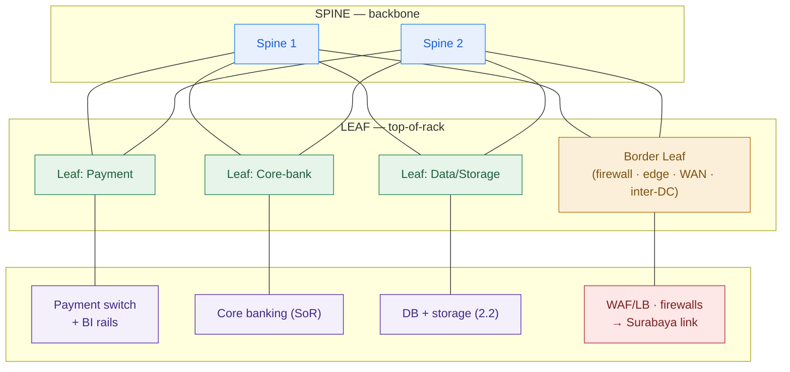

# DC Network HLD — Garuda Finance (worked example)

> This is `template-dc-network-hld.md` filled in for the running Phase 2 customer. It shows what "good" looks like: named zones an OJK auditor accepts, a fabric justified by east-west traffic, and an inter-DC link whose latency and bandwidth are on the page as explicit assumptions — the input lesson 2.6 (DR) and Capstone B depend on.

**Customer:** Garuda Finance (fictional)  ·  **Industry / regulator:** Indonesian financial services · **OJK** + card-industry (PCI-DSS-style)
**Prepared by:** SA — Presales  ·  **Engagement:** VMware-exit on-prem private cloud (Capstone B)  ·  **DCs in scope:** Jakarta (primary) + Surabaya (DR)
**Date:** 2026-07-04  ·  **Version:** v0.2

**Company shape:** ~600 branches · ~8M customers · core banking + loan origination + mobile app · ~4,000 txns/min peak · repatriating public-cloud workloads in-country.
**Drivers:** VMware cost · OJK compliance · resilience. **Constraints:** 24/7 payments · thin K8s/platform skills · on-prem / in-country only.

---

## 1. Security zones (named first, isolated where OJK requires)

| Zone | What lives here | Trust level | Isolation note |
|---|---|---|---|
| Edge / DMZ | WAF · L7 LB · external firewall · internet + mobile-app ingress · repatriated-cloud ingress | Lowest | Internet-facing; cannot reach Payment or Core directly |
| **Payment** | Card/payment switch · links to Bank Indonesia rails (BI-FAST / RTGS) | **Highest — ISOLATED** | OJK/PCI: reachable only via firewall on named ports; never flat-adjacent to Edge |
| Core-banking | Core banking system — the system of record | High | Reachable only from Business/App + Payment via firewall |
| Business / App | Loan origination · internal apps | Medium | Standard app tier |
| Data / Storage | Databases + distributed storage (from 2.2) · replication traffic | High | Near 1:1 oversubscription (I/O-heavy) |
| Management / OOB | Private-cloud control plane · monitoring · out-of-band mgmt | High | Separated from the data plane |

**Rule:** traffic crosses a zone boundary only through a firewall, on named ports. **A breach in Edge must not reach Payment** — this is the structural answer, not a rule bolted onto a flat network.

## 2. Fabric (per DC)

- **Topology:** **spine-leaf** in each DC. Rationale: the private cloud is east-west heavy (VM↔VM, storage replication from 2.2, live migration), so leaf-spine's two-hop any-to-any path + ECMP beat three-tier hairpins and STP-blocked links.
- **Underlay / overlay:** L3 routed underlay + **VXLAN/EVPN** overlay (logical, stretchable zones).
- **Oversubscription target per zone:**

| Zone | Target ratio | Why |
|---|---|---|
| Data / Storage | ~1:1 (non-blocking) | Relentless replication + DB I/O; must not bottleneck |
| Payment / Core-banking | ~1:1–1.5:1 | Latency-sensitive, must never congest |
| Business / App | 2:1–3:1 | Bursty, cost-optimized |

*(Ratios are design assumptions to confirm in Phase 6 sizing.)*

- **Scale rule:** add a leaf for racks, a spine for bandwidth.

## 3. Addressing & segmentation

- **Supernet per DC (non-overlapping — required for failover):** Jakarta `10.10.0.0/16` · Surabaya `10.20.0.0/16` *(illustrative)*.
- **Per-zone subnets:** each zone a /20–/24 inside the DC supernet (detail is LLD).
- **Overlay mapping:** each zone → a VXLAN VNI, so "the Payment zone" exists identically in both DCs.
- **Why non-overlap matters here:** on a Surabaya failover, routing and replication must work — overlapping ranges would collide and break DR.

## 4. Inter-DC link (Jakarta ↔ Surabaya — the DR spine)

- **Distance / latency:** ~700 km ⇒ ~3.5 ms one-way propagation (fibre ≈ 5 µs/km) → **~7 ms RTT propagation, budget ~10–15 ms RTT** with equipment + real routing.
- **Replication mode (set by latency):** **ASYNCHRONOUS.** Sync would add ~10 ms to *every* core-banking commit at 4,000 txns/min peak — a payments non-starter. → **RPO = seconds–minutes** (the value 2.6 designs around).
- **Bandwidth (assumption + range):** must carry peak replicated change rate — storage blocks (2.2) + DB redo/journal + VM replication — × 2–4× catch-up headroom + a separate initial-seed budget. **Assumption: a 10 Gbps dedicated link with headroom to 100G**, to be confirmed against the measured change rate in Phase 6 sizing. *(Method, not a magic number.)*
- **Resilience:** **two diverse paths** — a DWDM/dark-fibre wavelength plus a protected MPLS circuit on a physically separate route — so a single fibre cut cannot isolate Surabaya.

## 5. Security controls

- **Zone perimeters (north-south + zone-to-zone):** hardware firewalls (e.g., Palo Alto / Fortinet) — the audit story OJK wants to see, with Payment isolation enforced in hardware.
- **Inside zones (east-west):** microsegmentation via the overlay/distributed firewall — stops lateral movement between VMs sharing a zone without hairpinning.
- **Ingress:** WAF + L7 LB at the border leaf (mobile-app + internet; repatriated-cloud ingress now in-country). **Egress:** one-way via firewall for patching; **never** direct from Payment or Core-banking.
- **External connections:** internet (Edge), Bank Indonesia rails into Payment (dedicated firewalled links), 600 branches via WAN into Business/App.

---

## 6. Fabric diagram — Jakarta (Mermaid)



## 7. Two-DC topology (ASCII)

```
        INTERNET  ·  Bank Indonesia rails (BI-FAST / RTGS)  ·  600 branches (WAN)
                 │                                            │
   ┌─────────────┼──────────────────┐        ┌───────────────┼──────────────────┐
   │        JAKARTA (PRIMARY)        │        │         SURABAYA (DR)            │
   │  ┌── EDGE / DMZ ──────────────┐ │        │  ┌── EDGE / DMZ ──────────────┐ │
   │  │ WAF · L7 LB · ext firewall │ │        │  │ WAF · L7 LB · ext firewall │ │
   │  └──────────────┬─────────────┘ │        │  └──────────────┬─────────────┘ │
   │             border leaf         │        │             border leaf         │
   │        ┌────────┴────────┐      │        │        ┌────────┴────────┐      │
   │        │  SPINE-LEAF     │      │        │        │  SPINE-LEAF     │      │
   │        │  VXLAN/EVPN, L3 │      │        │        │  VXLAN/EVPN, L3 │      │
   │        └──┬──┬──┬──┬─────┘      │        │        └──┬──┬──┬──┬─────┘      │
   │           ▼  ▼  ▼  ▼            │        │        (mirror of primary,      │
   │  PAYMENT  CORE  BUSINESS  DATA/ │        │         warm standby)           │
   │  (OJK/PCI (SoR) /APP    STORAGE │        │   PAYMENT · CORE · BUSINESS ·   │
   │  ISOLATED)             (2.2)    │        │   DATA/STORAGE                  │
   │            MANAGEMENT / OOB     │        │            MANAGEMENT / OOB     │
   └──────────────────┬──────────────┘        └───────────────┬─────────────────┘
                      │                                        │
                      └──────────────  INTER-DC LINK  ─────────┘
                         2 × diverse paths (DWDM/dark-fibre λ + MPLS)
                         ~700 km · ~3.5 ms one-way (~8–15 ms RTT)
                         ASYNC replication (storage 2.2 + DB) → RPO seconds–minutes
                         Bandwidth: peak change rate × 2–4× headroom + seed
                         (assumption ~10 Gbps, grow to 100G — confirm in sizing)
```

---

## 8. Must-label checklist (ticked)

- [x] **Named security zones** — Edge/DMZ · Payment · Core-banking · Business/App · Data/Storage · Management/OOB.
- [x] **Isolated zone marked** — Payment isolated for OJK/PCI, not flat-adjacent to Edge.
- [x] **Fabric type stated** — spine-leaf, because the private cloud is east-west heavy.
- [x] **Oversubscription target per zone** — ~1:1 for Data/Storage + Payment/Core; 2:1–3:1 for App.
- [x] **Overlay named** — VXLAN/EVPN, zones → VNIs.
- [x] **Non-overlapping addressing per DC** — Jakarta 10.10.0.0/16 · Surabaya 10.20.0.0/16.
- [x] **Inter-DC link mode** — async, justified by ~700 km ⇒ ~10–15 ms RTT.
- [x] **Inter-DC bandwidth** — ~10 Gbps assumption + range (change rate × headroom), confirm in sizing.
- [x] **Inter-DC resilience** — two diverse physical paths (DWDM + MPLS).
- [x] **Ingress + egress** — WAF/LB at border; one-way egress; rails/internet/branches placed.
- [x] **East-west control** — microsegmentation inside zones + hardware firewalls at perimeters.
- [x] **Readable by both** — exec reads the topology; auditor trusts the zones; engineer builds from the tables.

---

## 9. Decisions & rationale (one line each)

| # | Decision | Rationale | Feeds |
|---|---|---|---|
| 1 | Spine-leaf per DC (not three-tier) | East-west traffic (VM↔VM, storage replication, live migration) dominates a private cloud | Capstone B fabric |
| 2 | Payment zone isolated | OJK/PCI — a foothold in Edge must not reach payments | Security review |
| 3 | VXLAN/EVPN overlay | Zones must be logical policy, not tied to cabling; stretch across racks + DCs | Multi-tenant private cloud |
| 4 | Non-overlapping DC supernets | Overlap breaks inter-DC routing + DR failover | 2.6 DR |
| 5 | **Async** Jakarta↔Surabaya | ~700 km ⇒ ~10–15 ms RTT; sync would throttle every payment | **2.6 DR — sets RPO** |
| 6 | ~10 Gbps inter-DC link (assumption) | Carry peak change rate × headroom + seed; confirm against measured rate | Phase 6 sizing |
| 7 | Two diverse inter-DC paths | A single fibre cut must not isolate DR | 2.6 DR resilience |

**One-line scope statement:**
> Garuda's private cloud runs on a **spine-leaf fabric per DC** with **six segmented zones** (Payment isolated for OJK/PCI) over a **VXLAN/EVPN overlay**, joined by an **asynchronous, two-path inter-DC link** whose ~700 km distance fixes a **non-zero RPO** and whose bandwidth is a sized assumption — the network decisions that make the DR in 2.6 either real or theater.

**So what (the pivot this HLD buys you):** the flat three-tier sketch that fails the OJK review becomes a defensible, zoned, DR-capable fabric — and the inter-DC link's latency has *already* decided sync-vs-async before the DR lesson even starts, so 2.6 designs RPO/RTO on solid ground instead of discovering the constraint on failover day.
