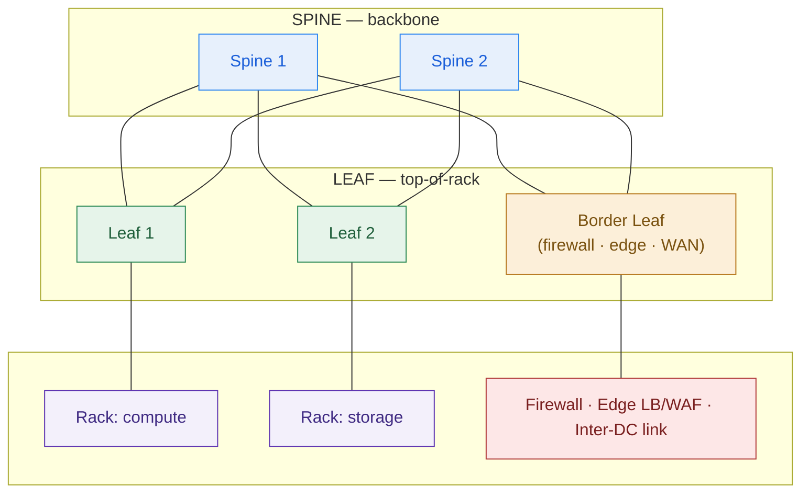

# DC Network HLD — Template

> Fill this in when you design the network fabric for a data center or a multi-DC estate (private cloud, virtualization refresh, DR pair). It sits on top of the compute (2.1) and storage (2.2) designs and feeds the DR design (2.6). An executive should grasp the diagram; a security auditor should trust the zones; an engineer should be able to turn it into an LLD.

**Customer:** `<company>`  ·  **Industry / regulator:** `<industry · regulator, e.g. OJK / PCI>`  ·  **Prepared by:** `<SA name>`
**Engagement:** `<deal or project name>`  ·  **DCs in scope:** `<primary / DR / metro>`  ·  **Date:** `<YYYY-MM-DD>`  ·  **Version:** `<v0.1 draft>`

---

## How to use this template

Work the five decisions in order. Do not start by drawing switches — start from the **zones** the business and regulator require, then choose the fabric that carries them.

1. **Zones** — name the security zones (trust boundaries) the workload and regulator require.
2. **Fabric** — pick the topology per DC (spine-leaf vs three-tier) and state an oversubscription target per zone.
3. **Addressing & segmentation** — non-overlapping supernets per DC, VXLAN/EVPN overlay, zones → VNIs.
4. **Inter-DC link** — mode (sync/async) set by latency, bandwidth set by change rate, diverse paths.
5. **Security controls** — firewalls at zone perimeters, microsegmentation inside zones, ingress/egress.

Legend: **spine-leaf** = two-tier any-to-any fabric · **oversubscription** = downlink:uplink ratio on a leaf · **VXLAN/EVPN** = L2-over-L3 overlay + BGP control plane · **RPO** = data-loss window on failover.

---

## 1. Security zones (name the trust boundaries first)

> List every zone and what lives in it. Mark which zone is **isolated** (the one a regulator will check) and the default-deny stance between zones.

| Zone | What lives here | Trust level | Isolation note |
|---|---|---|---|
| Edge / DMZ | `<WAF · L7 LB · external firewall · internet + app ingress>` | Lowest | Internet-facing; nothing here reaches the crown jewels directly |
| `<Payment / PHI / regulated>` | `<the regulated data/system>` | **Highest — ISOLATED** | `<why: OJK / PCI / HIPAA …>` |
| `<Core / system-of-record>` | `<the SoR>` | High | `<reachable only from …>` |
| Business / App | `<internal apps>` | Medium | |
| Data / Storage | `<databases + distributed storage (2.2) · replication>` | High | Near 1:1 oversubscription |
| Management / OOB | `<control plane · monitoring · out-of-band mgmt>` | High | Separate from data-plane traffic |

**Rule to state:** traffic crosses a zone boundary only through a firewall, on named ports. The isolated zone is never flat-adjacent to the Edge.

## 2. Fabric (topology per DC)

- **Topology:** `<spine-leaf (default for private cloud / east-west) | three-tier (legacy / north-south only)>` — one line of rationale.
- **Underlay / overlay:** `<L3 routed underlay + VXLAN/EVPN overlay | L2 + VLANs>`
- **Oversubscription target per zone:**

| Zone | Target ratio | Why |
|---|---|---|
| Data / Storage | `<~1:1 (non-blocking)>` | Relentless replication + I/O |
| App / stateless | `<2:1–3:1>` | Bursty, not all-at-once; cost-optimized |
| `<…>` | `<…>` | `<…>` |

- **Scale rule:** add a **leaf** for more racks, a **spine** for more bandwidth.

## 3. Addressing & segmentation

- **Supernet per DC (non-overlapping — required for failover):** DC-A `<10.x.0.0/16>` · DC-B `<10.y.0.0/16>`
- **Per-zone subnets:** `<zone → CIDR, reading level; detail is LLD>`
- **Overlay mapping:** each logical zone → a **VXLAN VNI**, so the same zone exists in both DCs.
- **Why non-overlap matters:** overlapping ranges break inter-DC routing and DR failover — decide it now.

## 4. Inter-DC link (the DR spine)

- **Distance / latency:** `<km>` ⇒ ~`<RTT ms>` (fibre ≈ 5 µs/km one-way).
- **Replication mode (set by latency):** `<synchronous if sub-~2 ms RTT / metro | asynchronous if long-haul>` → **RPO = `<zero | seconds–minutes>`**.
- **Bandwidth (assumption + range):** carry peak change rate (storage 2.2 + DB journals + VM replication) × 2–4× headroom + seed budget → propose `<e.g. 10 Gbps, room to 100G>`; **confirm against measured change rate in sizing (Phase 6)**.
- **Resilience:** `<two diverse paths — e.g. DWDM/dark-fibre + MPLS on separate routes>` so one cut can't isolate DR.

## 5. Security controls

- **Zone perimeters (north-south + zone-to-zone):** `<hardware firewalls — F5 / Palo Alto / Fortinet>`
- **Inside zones (east-west):** `<microsegmentation / distributed firewall in overlay>`
- **Ingress:** `<WAF + L7 LB at border leaf>` · **Egress:** `<one-way via firewall; never from isolated zone>`
- **External connections:** `<internet · partner/rails · repatriated cloud>` and where each lands.

---

## 6. Fabric diagram (Mermaid skeleton — one DC)

> Replace the placeholders. Spines on top, leaves below (including a border leaf to the edge/WAN), racks/edge at the bottom.



## 7. Two-DC topology (ASCII skeleton — for docs/email that can't render Mermaid)

```
        INTERNET  ·  <partner / payment rails>  ·  <branches / WAN>
                 │                                  │
   ┌─────────────┼───────────────┐    ┌─────────────┼───────────────┐
   │      <DC-A> (PRIMARY)        │    │      <DC-B> (DR)            │
   │  ┌── EDGE / DMZ ───────────┐ │    │  ┌── EDGE / DMZ ───────────┐ │
   │  │ WAF · L7 LB · firewall  │ │    │  │ WAF · L7 LB · firewall  │ │
   │  └───────────┬─────────────┘ │    │  └───────────┬─────────────┘ │
   │          border leaf         │    │          border leaf         │
   │        ┌─────┴─────┐         │    │        ┌─────┴─────┐         │
   │        │ SPINE-LEAF│         │    │        │ SPINE-LEAF│         │
   │        └──┬──┬──┬──┘         │    │        └──┬──┬──┬──┘         │
   │           ▼  ▼  ▼            │    │        (mirror of primary)   │
   │  <ISOLATED> <SoR> <DATA/     │    │   <zones — warm/active       │
   │   zone      zone   STORAGE>  │    │    standby>                  │
   │            MGMT / OOB        │    │            MGMT / OOB        │
   └───────────────┬──────────────┘    └───────────────┬─────────────┘
                   │                                    │
                   └──────────  INTER-DC LINK  ─────────┘
                      2 × diverse paths · <km> · ~<RTT ms>
                      <SYNC | ASYNC> replication → RPO <zero | secs–min>
                      Bandwidth: <assumption + range>
```

---

## 8. Must-label checklist (every DC network diagram passes this before it leaves your laptop)

- [ ] **Named security zones** — Edge/DMZ, the regulated/isolated zone, core/SoR, app, data/storage, management/OOB.
- [ ] **Isolated zone marked** — the payment/PHI/regulated zone is segmented, not flat-adjacent to Edge (the auditor's first look).
- [ ] **Fabric type stated** — spine-leaf vs three-tier, with a one-line reason (east-west vs north-south).
- [ ] **Oversubscription target per zone** — near 1:1 for storage/DB, looser for app tiers.
- [ ] **Overlay named** — VXLAN/EVPN (or VLANs, if truly justified), zones → VNIs.
- [ ] **Non-overlapping addressing per DC** — supernets can't collide on failover.
- [ ] **Inter-DC link mode** — sync vs async, justified by the latency/distance math.
- [ ] **Inter-DC bandwidth** — a sized assumption + range (change rate × headroom), not a magic number.
- [ ] **Inter-DC resilience** — two diverse physical paths.
- [ ] **Ingress + egress** — WAF/LB at the border, one-way egress, external connections placed.
- [ ] **East-west control** — microsegmentation inside zones, not just perimeter firewalls.
- [ ] **Readable by both** — an exec gets the diagram; an engineer trusts the tables.

---

*Worked example: see `example-garuda-dc-network-hld.md` in this folder.*
