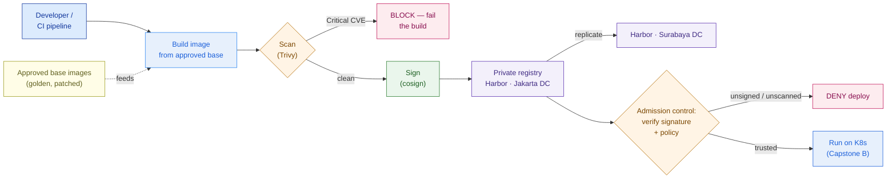

# Containers, Docker & Registries

> "Containerize everything" is as wrong as "containerize nothing." An architect scores each workload — and governs the images the whole estate will trust.

**Type:** Design
**Track:** AI, Data & Infrastructure Solution Architect (Presales)
**Prerequisites:** [2.3 Data-Center Networking](../../03-datacenter-networking/docs/en.md) · builds on [0.4 Cloud & Virtualization Literacy](../../../00-foundations/04-cloud-and-virtualization-literacy/docs/en.md)
**Time:** ~4h
**Lab:** Docker + a local registry (build one image, push it, run it)
**Ship It:** Containerization Assessment

## The Problem

You are in a technical workshop at **Garuda Finance** — an Indonesian financial-services firm with ~600 branches, ~8M customers, two data centers (Jakarta and Surabaya), and a peak of ~4,000 transactions per minute. They are building an on-prem **private cloud with a modern container/Kubernetes platform** (this is Capstone B), and the enthusiastic new platform lead opens with the line that ends more modernization programs than any budget cut: *"We're going cloud-native — we'll containerize everything and run it all on Kubernetes."* Everyone nods. Nobody in the room has run a production cluster before; K8s skills are thin in-house. And sitting in the estate is a **packaged core-banking product** — a COTS system the vendor supports only on a specific OS, on specific VMs, with an embedded database and a per-socket license. "Everything" includes that.

Six months later, "containerize everything" has become a graveyard. The team spent a quarter trying to force the core-banking COTS product into containers, the vendor refused to support the result (voiding the SLA on the system that moves the bank's money), and the embedded database's data gravity meant every "stateless" assumption was wrong. Meanwhile the genuinely container-shaped workloads — the mobile app's backend, the new microservices — shipped from developer laptops straight to production, pulling base images off public Docker Hub, **unscanned and unsigned**. The OJK examiner's question is not "is it fast?" — it's *"prove where every running image came from and that nothing malicious is inside it."* Nobody can. The supply chain is the audit finding.

This is the failure mode this lesson exists to prevent, and it has a mirror image: the shop so spooked by the mess that it **containerizes nothing** and forfeits the elasticity, density, and clean CI/CD it is paying for. The SA's job is neither extreme. It is to **judge which workloads to containerize, which stay VMs, and how to govern the images the estate will trust** — because for a regulated bank the software supply chain is a security control, not a DevOps convenience. You will not write Dockerfiles for a living. You will score a portfolio and set a policy the platform team runs for years.

## The Concept

Phase 0 already taught you *what* a container is versus a VM. This lesson is one altitude up: given a container is possible, **should this particular workload be one, and how do we make the images safe to run?** Two decisions, both yours as the architect:

1. **Readiness** — a per-workload verdict: containerize now, containerize after work, or keep as a VM.
2. **Governance** — a per-estate policy: where images live (registry), how they're proven clean (scan), and how they're proven authentic (sign).

### Recap in one box — containers vs VMs (you own this already)

You don't need this re-taught; you need it as a decision lens. From Phase 0, compressed:

```
VM        virtualizes HARDWARE  → own kernel · GB · boots in seconds · strong isolation · tens/host
CONTAINER virtualizes the OS    → shared host kernel · MB · starts in ms · weaker isolation · hundreds/host
```

The architect's takeaway is not "containers win." It's that a container is a **process with a shipping format**, not a small VM — so it suits workloads that are *stateless, disposable, and change often*, and fights workloads that assume they own a whole machine. That single distinction drives the rubric below.

### An image is layers — which is why a registry matters

A **container image** is a stack of read-only layers plus a manifest. A **registry** is the versioned store the whole estate pulls from. It doesn't store one fat blob per image — it stores and de-duplicates layers, which is exactly why a **base-image policy** is leverage:

```
AN IMAGE = READ-ONLY LAYERS (what the registry actually stores and de-dupes)

  ┌───────────────────────────────┐  your app code + config      (changes every deploy)
  ├───────────────────────────────┤  app dependencies / libraries (changes on a dep bump)
  ├───────────────────────────────┤  language runtime (JRE, Node) (rarely)
  ├───────────────────────────────┤  OS packages / security patch (monthly)
  └───────────────────────────────┘  BASE IMAGE  (distroless / UBI)  ← governed centrally
        shared + cached across ALL images  →  patch the base once, rebuild everything above it
```

Patch the base image, and every app that inherits it inherits the fix on next build. That is why an architect cares who controls the bottom layer.

### Registries: public vs private — and why a bank needs its own

| | **Public registry** (Docker Hub, GHCR) | **Private registry** (in your DC) |
|---|---|---|
| Who can pull | Anyone; you inherit whatever the internet published | Only your org; you curate what enters |
| Provenance | Unknown authors, tags mutate, `latest` drifts | Every image scanned, signed, and traceable |
| Availability | External dependency + pull-rate limits | Local to the DC; survives an internet cut |
| Fit for OJK | Poor — can't prove supply-chain integrity | The control the regulator expects |

For a regulated firm building an on-prem platform, a **private registry is not optional** — it is where "prove where every image came from" gets answered. **Harbor** (open-source, CNCF) is the common on-prem choice; more in *Compare It*.

### The 12-factor lens — is the app even container-shaped?

Before scoring, sanity-check *shape*. The [12-factor](https://12factor.net) principles are a checklist for "cloud-native enough to package cleanly." The four that decide readiness:

- **Config in the environment**, not baked into the image (so one image runs in Jakarta and Surabaya).
- **Stateless, disposable processes** — killable and replaceable at any moment; no session or data pinned to local disk.
- **Backing services attached by URL** — the database is a resource you point at, not something inside the container.
- **Logs to stdout** — the platform collects them; the app doesn't manage log files.

An app that violates these (writes to local disk, assumes a fixed IP, expects a full OS to be around) isn't "un-containerizable" — it's *not container-shaped yet*, which is the difference between a "containerize now" and a "containerize with work" verdict.

### The readiness rubric — score, don't guess

Here is the instrument. Score each workload 0–2 on six criteria; the total sorts it into a verdict band. This is the artifact that turns "containerize everything" into a defensible portfolio call.

```
CONTAINERIZATION READINESS RUBRIC   (score 0–2 per criterion; higher = more container-ready)

 CRITERION                        0  (keep as VM)         1  (needs work)          2  (container-ready)
 ────────────────────────────────────────────────────────────────────────────────────────────────────
 C1  Build origin                 COTS, no vendor image   COTS w/ vendor image     Custom code you own
 C2  State                        embedded / local data   state can externalize    stateless by design
 C3  Licensing                    per-socket / appliance  license allows it        OSS / core-agnostic
 C4  Change frequency             frozen / rare           occasional               frequent (CI/CD pays off)
 C5  12-factor fit                assumes full OS + disk  minor refactor           config-in-env, disposable
 C6  Vendor support (containers)  unsupported / voids SLA community / at own risk  fully supported
 ────────────────────────────────────────────────────────────────────────────────────────────────────
 TOTAL /12  →   0–4  KEEP AS VM       5–8  CONTAINERIZE WITH WORK       9–12  CONTAINERIZE (first wave)
```

Two criteria carry veto weight for a bank. **C6 (vendor support)** at 0 is nearly decisive on its own — packaging a COTS product the vendor won't support in containers trades a working SLA for a broken one. **C2 (state)** at 0 is the trap Phase 0 warned about: the data gravity of an embedded database doesn't disappear because you wrapped a process around it.

### The software supply chain — build → scan → sign → registry → verify → run

A container image is executable code you pull from somewhere and run in production. For a regulated firm, *where it came from* and *what's inside it* are audit questions, so the pipeline that produces trusted images is itself an architecture you design:



Read the four controls the SA specifies:

- **Approved base images** — a curated set of minimal, patched base layers (distroless or a vendor's Universal Base Image), served from an internal registry project. Developers may not start from a random `FROM ubuntu:latest`.
- **Scanning (Trivy)** — every image is scanned for known CVEs on build and again on push. A **Critical** finding blocks promotion. Harbor can run Trivy on-push natively.
- **Signing (cosign / Notation)** — a clean image is cryptographically signed so its authenticity is provable later.
- **Admission verification** — at deploy time the platform refuses any image that is unsigned, unscanned, or off-policy. This is where the policy has teeth, and it lands in **2.5 Kubernetes** (admission control). Tease it here; enforce it there.

### Stateless vs stateful — the data-gravity line

The last concept underneath every verdict: **state has gravity.** Stateless services (an API, a web tier, a job runner) are perfect containers — kill one, another takes over, scale to the flash of a promo. Stateful systems (databases, message brokers, the core-banking ledger) hold the truth on disk, and moving that truth is expensive and risky. Kubernetes *can* run stateful workloads (via StatefulSets and persistent volumes — you'll meet these in 2.5), but that machinery is exactly what a team on its first cluster fumbles. So the safe default is: **containerize the stateless tiers first, keep the heavy stateful systems on VMs or managed data services until the platform is mature.** Don't put the ledger on the team's first cluster.

### Why it's worth it — the density and licensing angle

Risk gets the airtime, but the SA also has to name the *upside*, because the customer is paying for one. Two economic levers justify the whole exercise:

- **Density.** Containers share the host kernel, so a host that packs tens of VMs packs hundreds of containers. For the stateless tiers that spike — Garuda's mobile backend during payday or a promo — you scale replicas out for the surge and back in after, instead of provisioning fat VMs for peak 24/7. That's the same anti-overspend argument as the flash-sale pattern from Phase 0, now on-prem.
- **Licensing — and the trap.** Density cuts cost *only when the software's licensing lets it.* OSS and per-core-agnostic stacks (the mobile backend) win outright. But software licensed **per-VM or per-socket** can get *more* expensive under dense packing, or the vendor may simply not permit containerized deployment — which is exactly why `C3` (licensing) and `C6` (vendor support) sit in the rubric. An architect who sells "containers save money" without checking the license can hand the customer a bigger bill and a broken support contract. Name the license before you name the saving.

## Design It

Let's produce the actual deliverable: a **Containerization Assessment** for Garuda Finance. You are not designing the cluster (that's 2.5) — you are deciding *what goes on it* and *how images are governed*. Five steps.

### Step 1 — Inventory the workloads and their traits

Before scoring, list what the bank runs and tag the traits that drive the verdict. Keep it to the estate the workshop surfaced:

| Workload | Origin | State | Change rate | Note |
|---|---|---|---|---|
| **Mobile app backend** (APIs) | Custom | Stateless (DB is external) | Frequent | Customer-facing, spiky load |
| **New microservices** (greenfield) | Custom | Stateless | Frequent | Built cloud-native from day one |
| **Loan origination** (custom app) | Custom | Some session/workflow state | Occasional | Older custom monolith, some local-disk habits |
| **Core-banking** (packaged COTS) | COTS | Deeply stateful (embedded DB) | Frozen | Vendor-supported on specific VMs only |
| **Batch / reporting** | Mixed | Jobs ephemeral, data heavy | Scheduled | Some scripts, some tied to the core DB |

### Step 2 — Score each workload on the rubric

Apply the six criteria. This is the heart of the assessment — every score is a sentence you can defend to the customer's architects and to the OJK examiner.

```
GARUDA FINANCE — CONTAINERIZATION READINESS SCORING     (0–2 each; /12 total)

 WORKLOAD              C1  C2  C3  C4  C5  C6   TOTAL   VERDICT
 ─────────────────────────────────────────────────────────────────────────────
 Mobile app backend     2   2   2   2   2   2  = 12    CONTAINERIZE  (first wave)
 New microservices      2   2   2   2   2   2  = 12    CONTAINERIZE  (first wave)
 Loan origination       2   1   2   1   1   2  =  9    CONTAINERIZE WITH WORK
 Batch / reporting      1   1   1   1   1   1  =  6    PARTIAL (split it — see Step 3)
 Core-banking (COTS)    0   0   0   0   0   0  =  0    KEEP AS VM
 ─────────────────────────────────────────────────────────────────────────────
   C1 origin · C2 state · C3 licensing · C4 change · C5 12-factor · C6 vendor support
```

The spread is the whole point: a real portfolio is never uniform. "Containerize everything" would have forced the 0 and the 6 through the same door as the 12s.

### Step 3 — Turn scores into a verdict per workload

Now the recommendation the customer acts on:

- **Mobile app backend & new microservices (12) → Containerize, first wave.** Stateless, custom, frequently deployed — the textbook payoff. These prove the platform and build the team's muscle on low-blast-radius workloads. Start here precisely *because* K8s skills are thin.
- **Loan origination (9) → Containerize with work.** The code is yours and the license is friendly, but it holds workflow state and has local-disk habits (C2/C5 = 1). The work is a scoped refactor: externalize sessions, move config to env, send logs to stdout. Second wave, after the greenfield services de-risk the platform.
- **Batch / reporting (6) → Partial.** Split the tier. The **stateless job runners** (report generation, file transforms) containerize cleanly and benefit from on-demand scheduling. The **ETL jobs coupled to the core-banking database** stay on VMs next to their data until the data layer itself is modernized. One "batch" label hid two very different verdicts — surfacing that split is the SA earning their fee.
- **Core-banking COTS (0) → Keep as VM.** Every criterion says stop: no vendor image, embedded stateful DB, per-socket license, frozen, full-OS assumptions, and — decisively — the vendor **will not support** a containerized deployment. Forcing it trades a working SLA on the system that moves money for an unsupported science project. It stays on VMs in the private cloud, integrated with (not absorbed into) the container platform.

### Step 4 — Design the registry and supply-chain policy

The workloads that *do* get containerized need governed images. Recommend, with reasons:

- **Private registry: Harbor**, deployed in the Jakarta DC and **replicated to Surabaya** so each DC pulls locally and neither depends on the internet at deploy time. (The inter-DC replication rides the data-center network from 2.3 — size that link for image pulls, not just database traffic.) No public Docker Hub in the production path.
- **Base-image policy:** a curated set of minimal, patched base images in a locked Harbor project. Ban `latest`; pin by digest. Patch the base monthly; downstream apps inherit the fix on rebuild.
- **Scanning:** Trivy on push; **Critical CVEs block promotion**, Highs get a fix SLA. This is a release gate, not a report nobody reads.
- **Signing + admission:** cosign-sign every promoted image; the K8s platform (2.5) verifies signatures at admission and **denies anything unsigned, unscanned, or off-policy**.
- **RBAC + audit:** per-project roles in Harbor; every push/pull logged for the OJK trail.

### Step 5 — The target-state picture

One diagram the customer's execs and engineers can both read: a container platform for the container-ready tiers, a VM estate for what stays, one governed registry feeding both DCs.

```
GARUDA FINANCE — CONTAINERIZATION TARGET STATE (per-DC; replicated across Jakarta ⇄ Surabaya)

   ┌──────────────────────── PRIVATE CLOUD (Capstone B) ────────────────────────┐
   │                                                                            │
   │   CONTAINER PLATFORM (K8s — 2.5)          VM ESTATE (stays as VMs)          │
   │   ┌────────────────────────────┐          ┌──────────────────────────────┐ │
   │   │ • Mobile app backend        │          │ • Core-banking COTS (SLA-safe)│ │
   │   │ • New microservices         │  <─────> │ • Core-banking embedded DB    │ │
   │   │ • Loan origination (refactored)        │ • ETL jobs bound to core DB   │ │
   │   │ • Batch job-runners (stateless)        └──────────────────────────────┘ │
   │   └──────────────┬─────────────┘             integrate, don't absorb         │
   │                  │ pull trusted, signed images only                          │
   │        ┌─────────▼──────────┐                                                │
   │        │  HARBOR REGISTRY   │  Trivy scan · cosign verify · RBAC · audit     │
   │        │  Jakarta DC        │◀───────── replicate ─────────▶  Surabaya DC     │
   │        └────────────────────┘                                                │
   └────────────────────────────────────────────────────────────────────────────┘
        Verdict source of truth: the readiness scoring table (Step 2).
```

## Compare It

The concepts are stable; the tools have real trade-offs a customer will ask you to pick between.

### Build/run tooling: Docker vs Podman vs containerd

These are constantly conflated. They sit at different points in the stack.

| Tool | What it is | Where it fits Garuda |
|---|---|---|
| **Docker** | The full developer platform: CLI + build + a background daemon (`dockerd`). Best ergonomics, ubiquitous docs. The daemon historically runs as root. | What developers build and test with locally. The lab uses it. Not what the cluster runs. |
| **Podman** | Daemonless, **rootless by default**, drop-in Docker CLI compatibility; Red Hat ecosystem. | Attractive where a security team objects to a root daemon on build hosts — a common bank posture. A defensible standardization for CI runners. |
| **containerd** | The low-level **runtime that actually runs containers** under Kubernetes (and under Docker itself). Not a developer tool — the engine. | What the K8s platform uses to run every pod, via the CRI. Garuda's cluster runs containerd whether or not devs use Docker. |

The altitude point: **don't conflate build tooling with the cluster runtime.** Developers can build with Docker or Podman; the production cluster runs containerd underneath regardless. Kubernetes removed its old Docker shim years ago — "we use Docker" and "the cluster runs containerd" are both true and not in conflict.

### Private registry: Harbor vs Quay vs Nexus/Artifactory

| Registry | Strengths | Reach for it when… |
|---|---|---|
| **Harbor** (CNCF, open-source) | Built-in Trivy scanning, cosign/Notation signing, RBAC, project quotas, cross-DC replication. Free; on-prem-native; aligns with the K8s stack. | The default for an on-prem private cloud with no incumbent artifact platform — **Garuda's pick**. |
| **Red Hat Quay** | Clair scanning, geo-replication, strong OpenShift integration; enterprise-supported. | The shop is standardized on Red Hat/OpenShift and wants vendor support. |
| **Sonatype Nexus / JFrog Artifactory** | *Universal* artifact repos — containers **plus** Maven, npm, PyPI, Helm. Scanning via Artifactory Xray (licensed). | The org already runs one for other artifacts and wants one governed pane of glass. Consolidation beats a second tool. |

Recommend **Harbor** for Garuda unless they already operate Artifactory enterprise-wide — in which case reuse it and skip introducing a second system.

### When NOT to containerize (say it out loud)

The most valuable thing an SA does here is give the customer permission to *not* containerize the wrong things:

- **COTS the vendor won't support in containers** — you trade a working SLA for an unsupported one (core-banking).
- **Deeply stateful systems with strong data gravity**, when platform skills are immature — the ledger is not a first-cluster project.
- **Software needing kernel modules, a pinned kernel, or dedicated hardware** (HSM-bound crypto, appliances) — the shared host kernel is the wrong home.
- **Per-VM / per-socket licensed software** where containers explode the license count or breach the terms.
- **Frozen monoliths with no deployment cadence** — the CI/CD payoff (C4) is zero, so the refactor has no ROI. Leave it on its VM until it's being changed anyway.

The "it depends" the customer will push on: *"If we're going cloud-native, why keep any VMs?"* Because cloud-native is a **destination for the workloads that benefit**, not a mandate for the ones that don't. A private cloud runs VMs and containers side by side on purpose; the assessment is what tells you which is which.

## Ship It

This lesson ships a reusable **Containerization Assessment** — the artifact you produce when a customer says "we want to containerize" and you need to turn that ambition into a scored, defensible portfolio plan with a governance policy attached. Both files live in [`outputs/`](../outputs/):

- **[`template-containerization-assessment.md`](../outputs/template-containerization-assessment.md)** — the fill-in-the-blank deliverable: a workload inventory, the 6-criteria readiness scoring matrix with verdict bands, a per-workload verdict section, and a registry + supply-chain policy checklist (registry choice, base-image policy, scanning gate, signing/admission, RBAC/audit).
- **[`example-garuda-containerization-assessment.md`](../outputs/example-garuda-containerization-assessment.md)** — the template fully worked for Garuda Finance, so the matrix isn't abstract. It's the artifact you'd attach to the platform design report.

This assessment feeds directly into **2.5 Kubernetes Architecture** (what actually runs on the cluster, and the admission control that enforces the signing policy) and into **Capstone B** (the on-prem private cloud). Ship it early: it's the document that stops "containerize everything" before it becomes six lost months.

The **lab** ([`lab/README.md`](../lab/README.md)) is a copy-run loop — build one image, push it to a local registry you run yourself, and pull it back — so the mechanics of "an image lives in a registry" stop being abstract before you govern them for a customer.

## Exercises

1. **(Easy)** Take the five Garuda workloads and, for each, name the *single* criterion most responsible for its verdict (e.g., core-banking → C6 vendor support). Then write one sentence explaining why "just containerize the core-banking database too" is the wrong call, using the state-gravity idea and the vendor-support veto.

2. **(Medium)** Re-run the assessment for a **different customer**: a mid-size hospital moving to a private cloud. Score four workloads — a new patient-portal API, a packaged EHR (COTS, the anchor system of record), a nightly claims-batch job, and a legacy imaging (PACS) appliance — on the same rubric. State each verdict and name where the hospital's version of the "core-banking trap" lives (hint: the EHR vendor's support terms). Save it beside your worked example.

3. **(Hard)** Extend Garuda's assessment into a **supply-chain policy proposal** the OJK examiner would accept. Specify: the base-image policy (who owns the golden images, patch cadence, how `latest` is banned), the scan gate (which severities block, the fix SLA for the rest), the signing + admission flow (how an unsigned image is *physically* prevented from running), and how the Harbor replication between Jakarta and Surabaya keeps both DCs deployable if the inter-DC link drops. Reference the [2.3 Data-Center Networking](../../03-datacenter-networking/docs/en.md) link sizing and forward the admission-control piece to your 2.5 notes.

## Key Terms

| Term | What people say | What it actually means |
|------|-----------------|------------------------|
| Container image | "The container" | A stack of read-only **layers** + a manifest, stored in a registry. The container is the *running* instance; the image is the shipping format. |
| Registry | "Docker Hub" | The versioned store images are pushed to and pulled from. Public ones are convenient and unprovable; a regulated firm runs a **private** one (Harbor) it can audit. |
| Base image | "The OS in the container" | The bottom layer every app inherits. Governing it centrally (minimal, patched, approved) patches the whole estate at once — which is why the SA cares who owns it. |
| Stateless | "It has no data" | It keeps **no local state between requests** — killable and replaceable anytime. The data lives in an external backing service. This is what makes a workload a clean container. |
| Data gravity | "Big data" | The pull that stateful systems exert: the truth on disk is expensive and risky to move, so compute tends to stay near it. Why you containerize stateless tiers first. |
| 12-factor | "Best practices" | A concrete checklist (config in env, disposable processes, attached backing services, logs to stdout) for whether an app is *container-shaped* — the difference between "now" and "with work." |
| Image scanning | "Security scan" | Checking an image's layers for known CVEs (Trivy/Clair). A **release gate** — Critical findings block promotion — not a report that's filed and ignored. |
| Image signing | "Signed off" | Cryptographically signing a vetted image (cosign/Notation) so its authenticity is provable later, and admission control can **deny** anything unsigned. |
| Software supply chain | "The build pipeline" | The full path build → scan → sign → registry → verify → run. For a bank it's a **security control** the regulator audits, not a DevOps nicety. |
| containerd | "Same as Docker" | The low-level runtime that actually runs containers under Kubernetes and under Docker. Devs build with Docker/Podman; the **cluster runs containerd**. |

## Further Reading

- [The Twelve-Factor App](https://12factor.net) — the canonical checklist for "is this app cloud-native enough to package cleanly?"; skim it once and you can score C5 on sight.
- [Harbor documentation](https://goharbor.io/docs/) — the open-source private registry this lesson recommends; read the pages on Trivy scanning, replication, and content signing to specify a real policy.
- [Trivy — the vulnerability scanner](https://trivy.dev/) — how the scan gate actually works, including what "Critical CVE blocks the build" means in practice.
- [Sigstore / cosign](https://docs.sigstore.dev/) — image signing and verification, the mechanism behind "no unsigned image runs in production."
- [CNCF Software Supply Chain Best Practices](https://www.cncf.io/reports/software-supply-chain-security-best-practices/) — the industry framing an SA can hand a regulator's security team to align on controls.
- [Kubernetes: *Don't Panic: Kubernetes and Docker*](https://kubernetes.io/blog/2020/12/02/dont-panic-kubernetes-and-docker/) — the official explainer for why "the cluster runs containerd, not Docker" is normal and not a break.
