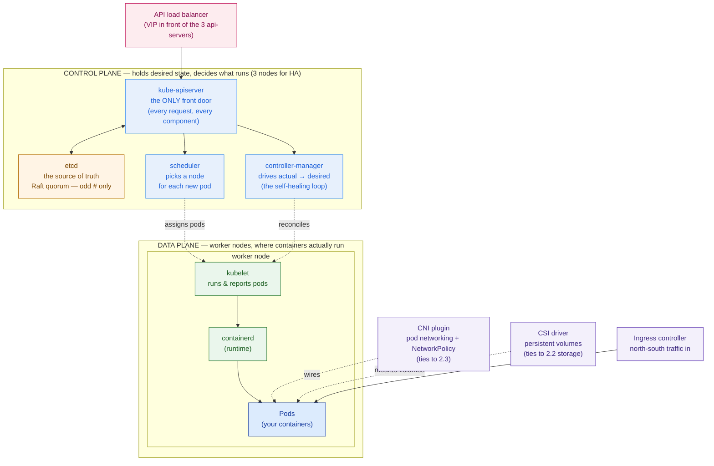

# Kubernetes Platform Architecture

> A badly-designed Kubernetes platform is worse than none. Design the platform — HA, node pools, tenancy — and pick a distro your team can actually run, before you draw a single pod.

**Type:** Design
**Track:** AI, Data & Infrastructure Solution Architect (Presales)
**Prerequisites:** 2.4 Containers, Docker & Registries
**Time:** ~6h
**Lab:** k3s/kind cluster
**Ship It:** Kubernetes platform HLD

## The Problem

Garuda Finance signed off on the containerization assessment from 2.4: their core banking, loan origination, and mobile back-ends can be packaged as containers, and they want to run them on the on-prem private cloud they are building across two data centers — Jakarta (primary) and Surabaya (DR). The IT director says the obvious next thing: *"So we'll put Kubernetes on it. Everyone uses Kubernetes."* You nod, because they're right — containers at their scale (~4,000 transactions/min at peak, 24/7 payments) need an orchestrator. Then, because you've seen this movie, you ask the two questions that decide whether this platform saves them or sinks them: *"How many clusters, and who operates them at 3 a.m. during a payments incident?"* The room goes quiet, because the honest answer is **limited in-house Kubernetes skill** — a handful of engineers who have used it in a lab, none who have run a production control plane.

Here is where an unguided team hurts itself. They stand up one cluster to "keep it simple" — one control-plane node, because three felt like overkill. That node is now a single point of failure for every payment in the bank. Or they read that Kubernetes has "self-healing HA," decide two masters sound safer than one, and get a two-node etcd that can survive **zero** failures and deadlocks the moment the two disagree. Someone points out they have two data centers and suggests the elegant move: *stretch one cluster across both, synchronously, so DR is automatic.* Now every write to the cluster's brain has to cross the Jakarta–Surabaya link and wait for a quorum on the far side — etcd goes slow, then unstable, then a link blip splits the brain and the whole platform freezes. And underneath all of it, every team deploys into the same flat namespace with no quotas and no isolation, so a runaway batch job in loan origination starves the payments pods it happens to share a node with. None of these are exotic failures. They are the **default** failures of a platform designed by people learning Kubernetes on the customer's production banking workload.

This is the failure mode of an SA who confuses *using* Kubernetes with *architecting a Kubernetes platform*. The platform is not `kubectl apply`. It is a set of design decisions — how many clusters and where, how the control plane survives a node loss, how you isolate payments from batch, how the network and storage plug in, who is allowed to do what, and, decisively for Garuda, **which distribution offsets a skills gap the team cannot close before go-live**. Choose raw upstream Kubernetes for a thin team and you have handed them a jet with no autopilot. This lesson is where you design the platform and *defend the design* — not administer clusters daily, but make the five or six choices that a good operator can live inside for years and a bad one cannot survive the first quarter.

## The Concept

Kubernetes has two halves: a **control plane** that holds the desired state and decides what should run, and a **data plane** of worker nodes that actually run the containers. Everything else — networking, storage, ingress, tenancy — is how you wire those two halves into a platform. An architect designs the halves and the wiring; they do not memorize every flag.



### The control plane (the brain)

- **kube-apiserver** — the single front door. Every other component, every `kubectl`, every node talks *only* to the api-server, never to each other. That makes it the thing you put a load balancer in front of and the thing whose availability *is* the cluster's availability.
- **etcd** — the source of truth: a distributed key-value store holding every object (the desired state). It uses the **Raft** consensus protocol, which means it needs a **majority (quorum)** of members to accept any write. This one fact drives the whole HA design below.
- **scheduler** — watches for pods with no node and binds each to the best-fit node (respecting resources, taints, affinity).
- **controller-manager** — runs the reconciliation loops: "desired 3 replicas, actual 2, start one." This loop *is* Kubernetes' self-healing. It only heals if the control plane is alive to run it.

### The data plane (the muscle)

- **kubelet** — the agent on every worker node; starts the containers the control plane assigns and reports their health back.
- **container runtime** — `containerd` (or CRI-O) actually pulls images and runs containers. (Docker-the-daemon is no longer used inside the node; see 2.4.)
- **kube-proxy / CNI dataplane** — programs the node so pods can reach each other and Services.

### The object model (what you actually deploy)

You rarely create a pod directly. You declare a higher-level object and the controllers create the pods for you:

| Object | What it is | Analogy |
|---|---|---|
| **Pod** | One or more containers scheduled together, sharing an IP | A single running instance |
| **Deployment** | Manages a replica set of identical pods; handles rollout & rollback | "Keep N stateless copies running" |
| **StatefulSet** | Pods with stable identity + storage | Databases, brokers |
| **DaemonSet** | One pod per node | Log/agent/CNI daemons |
| **Service** | A stable virtual IP + DNS name load-balancing across pods | Internal load balancer (east-west) |
| **Ingress** | HTTP(S) routing from outside into Services | The front-door router (north-south) |
| **ConfigMap / Secret** | Config and credentials injected into pods | Externalized settings |
| **Namespace** | A logical partition of the cluster | A tenant / team boundary |

### The pluggable edges — CNI, CSI, Ingress

Kubernetes deliberately does **not** ship a network or a storage system. You plug them in, and these choices tie straight back to earlier lessons:

- **CNI (Container Network Interface)** — the plugin that gives every pod an IP and enforces **NetworkPolicy** (pod-to-pod firewall rules). Calico and Cilium are the common picks. This is your east-west segmentation, and it inherits the data-center network design from **2.3**.
- **CSI (Container Storage Interface)** — the driver that lets pods request **PersistentVolumes** from real storage. It maps onto whatever you chose in **2.2** — a Ceph RBD/CephFS CSI, an NFS CSI, or a storage-vendor CSI.
- **Ingress controller** — the reverse proxy (NGINX, HAProxy, Traefik) that terminates TLS and routes external traffic to Services. On-prem it needs a load-balancer IP source (a hardware LB, or MetalLB) because there is no cloud LB to call.

### Multi-tenancy: namespaces, quotas, RBAC

One cluster usually serves many teams and apps. **Namespaces** partition it; on their own they are just labels. Real isolation is three controls stacked together:

- **ResourceQuota + LimitRange** — cap the CPU/memory a namespace can consume, so a runaway job can't starve its neighbors.
- **NetworkPolicy** (enforced by the CNI) — default-deny, then allow only the flows a tenant needs.
- **RBAC (Role-Based Access Control)** — bind users/service-accounts to roles so "who can do what, where" is explicit and auditable.

This is **soft multi-tenancy**: good enough to separate trusted internal teams, *not* a security boundary against hostile tenants. When isolation must be hard — regulated payments beside everything else — you separate at the **node pool** or **cluster** level, not just the namespace.

### HA control plane — the arithmetic that decides everything

Because etcd needs a **majority** to commit a write, the number of control-plane nodes is not a matter of taste. A cluster of N etcd members tolerates the loss of **⌊(N−1)/2⌋** members and needs **⌊N/2⌋+1** alive to keep working:

| etcd members | Quorum needed | Failures tolerated | Verdict |
|---|---|---|---|
| 1 | 1 | 0 | Single point of failure — never in production |
| **2** | **2** | **0** | **Worse than 1**: doubles failure surface, tolerates nothing |
| **3** | **2** | **1** | **The default** — survives one node/rack loss |
| 4 | 3 | 1 | Same tolerance as 3, more cost + write latency — pointless |
| 5 | 3 | 2 | For large or very critical clusters |

Two rules fall straight out of the table: **use an odd number (3 or 5)**, and **three is the right answer** for almost everyone. An even count buys you nothing but a bigger bill and a wider blast radius.

### Why you do NOT stretch one etcd cluster across two far data centers

The tempting "free DR" design — one cluster, etcd members split across Jakarta and Surabaya — breaks on the same quorum math:

- **Every write pays the WAN.** Raft commits require a round-trip to a quorum on each write. Across a metro/regional link that latency turns etcd slow, then flaky. etcd expects sub-10ms peer latency; a stretched link does not deliver it.
- **You cannot place quorum to survive a DC loss with only two sites.** Split a 3-member etcd 2-in-Jakarta / 1-in-Surabaya: lose Jakarta and the survivor has 1 of 3 — no quorum, the platform is read-only/down. To survive *either* DC failing you need a **third low-latency site** holding an arbiter — which Garuda does not have.
- **A link blip = split brain risk.** A partition between the two DCs is exactly the failure DR exists to handle, and it's the one a stretched cluster handles worst.

The correct pattern for two DCs and a thin team: **one self-contained HA cluster per DC, etcd kept intra-DC on the low-latency LAN**, and cross-DC recovery handled *above* the cluster — redeploy the apps to the DR cluster from Git (GitOps), with data replicated by the storage/DB layer. DR is a **2.6** concern, not an etcd concern. Keep the brain local; move the *manifests*, not the *quorum*.

### The distro landscape (one line each)

You almost never install "Kubernetes" from source. You choose a **distribution** that pre-packages the control plane, edges, and lifecycle tooling — and the choice is where you buy back a skills gap. The four families you'll weigh: **upstream/kubeadm** (raw, you own everything), **lightweight (k3s / RKE2)** (single-binary, batteries-included, CIS-hardenable), **enterprise platform (OpenShift)** (turnkey, opinionated, priced accordingly), and **managed-on-prem (Rancher, VMware Tanzu)** (a fleet manager over many clusters). We map these to Garuda in *Compare It*.

## Design It

Garuda's brief: containers approved (2.4), on-prem private cloud on two DCs (Jakarta primary, Surabaya DR), ~4,000 txns/min peak, 24/7 payments, OJK-regulated, **limited in-house Kubernetes skill**. Design the platform in seven decisions. (Sizing figures below are *design proposals* with stated assumptions, not facts given by the customer — an HLD proposes capacity; the LLD and the sizing lesson in Phase 6 finalize it.)

### Step 1 — Clusters & topology: one HA cluster per DC, not one stretched cluster

The first and most consequential decision. Garuda has two DCs, so the instinct is one stretched cluster. Reject it for the quorum reasons above. Design **two independent clusters**: `gf-jkt-prod` (Jakarta, active) and `gf-sby-dr` (Surabaya, warm standby). Each is self-sufficient — its own control plane, its own etcd, its own workers. Neither depends on the WAN to stay alive.

```
   GARUDA KUBERNETES PLATFORM — two independent per-DC clusters (NOT one stretch)

   ┌──────────────── DC-1: JAKARTA (active) ─────────────┐   ┌──────── DC-2: SURABAYA (DR, warm) ───────┐
   │  gf-jkt-prod                                        │   │  gf-sby-dr                               │
   │                                                     │   │                                          │
   │  CONTROL PLANE (HA)   [cp-1] [cp-2] [cp-3]          │   │  CONTROL PLANE (HA) [cp-1][cp-2][cp-3]   │
   │      etcd quorum = 3, kept INTRA-DC on the LAN      │   │      etcd quorum = 3, intra-DC           │
   │      VIP/LB ──▶ 3× api-server                       │   │      VIP/LB ──▶ 3× api-server            │
   │  ─────────────────────────────────────────────     │   │  ────────────────────────────────────   │
   │  DATA PLANE — node pools:                           │   │  (mirrors Jakarta pools, scaled to      │
   │   ┌ payments-isolated  (taint: workload=payments) ┐ │   │   run critical apps on failover)         │
   │   │  core banking · payment rails · dedicated nodes│ │   │   payments-isolated · general · batch    │
   │   ├ general           (loans, mobile back-end)     │ │   │                                          │
   │   └ batch             (overnight jobs, reporting)  ┘ │   │                                          │
   └───────────────────────┬─────────────────────────────┘   └──────────────────┬───────────────────────┘
                           │                                                     │
                    ┌──────▼─────────────────── GitOps (Argo CD / Flux) ─────────▼──────┐
                    │  Git repo = desired state → reconciled into BOTH clusters          │
                    │  DR = redeploy manifests to Surabaya; data replicated by 2.2/2.6   │
                    └───────────────────────────────────────────────────────────────────┘
        WAN carries Git sync + async data replication — NOT etcd quorum traffic.
```

### Step 2 — Control-plane HA: 3 masters, etcd quorum kept intra-DC

Per cluster: **3 control-plane nodes**, spread across **3 racks / fault domains inside the DC** so no single rack loss takes quorum. Put a **load balancer (VIP)** in front of the three api-servers so nodes and `kubectl` reach a stable endpoint. Use **stacked etcd** (etcd co-located on the control-plane nodes) for operational simplicity — one fewer tier for a thin team — unless the storage lesson's I/O sizing pushes you to external etcd. This is the single line that kills the "one master" and "two masters" mistakes: three, odd, intra-DC, behind a VIP.

### Step 3 — Node pools: isolate payments from everything else

A flat pool lets a batch job land next to a payment pod. For an OJK-regulated bank that is both a performance risk and a compliance problem. Define **three node pools** (worker groups) per cluster, isolated with taints/tolerations and labels:

| Node pool | Workloads | Isolation mechanism | Why |
|---|---|---|---|
| **payments-isolated** | Core banking, payment rails | Dedicated nodes; `taint workload=payments:NoSchedule`; only payment pods tolerate it | Regulatory + noisy-neighbor isolation; predictable latency for 24/7 payments |
| **general** | Loan origination, mobile back-end | Default schedulable pool | Bursty, business-hours, tolerant of sharing |
| **batch** | Overnight reconciliation, reporting | Separate pool, lower-priority | Cannot be allowed to starve online workloads |

Node pools are a **compute (2.1)** decision expressed in Kubernetes: size the payments pool for peak with headroom, the general pool for business-hours burst, the batch pool for the overnight window.

### Step 4 — Wire the edges: CNI, CSI, Ingress

Tie each edge to the earlier lesson that already made the underlying choice:

- **CNI → Calico (or Cilium).** Chosen for **NetworkPolicy** support: default-deny between namespaces, then explicit allows — the pod-level segmentation OJK will ask about. Inherits the fabric design from **2.3**. Cilium if they want eBPF observability and richer policy; Calico if the team wants the simpler, most-deployed option (skills gap again).
- **CSI → the storage platform's driver from 2.2.** Persistent volumes for databases/state come from the Ceph (or vendor SAN) CSI selected in the storage lesson. Define StorageClasses: fast (SSD/NVMe) for payment DBs, standard for the rest.
- **Ingress → NGINX (or HAProxy) Ingress + MetalLB.** On-prem there is no cloud load balancer, so **MetalLB** hands out LoadBalancer IPs from a reserved range and the Ingress controller does TLS termination + host/path routing. If Garuda has hardware LBs from 2.3, front the Ingress with those instead.

### Step 5 — Tenancy & RBAC: namespaces with teeth, mapped to OJK

Carve the cluster into namespaces per app/domain — `payments`, `loans`, `mobile`, `platform` — and give each the three-part isolation from the Concept: **ResourceQuota** (a hard CPU/memory cap), **default-deny NetworkPolicy** (then explicit allows), and **RBAC** (dev teams get `edit` in their namespace only; platform team gets cluster-admin; auditors get read-only cluster-wide for OJK evidence). Payments gets the extra node-pool isolation from Step 3 because namespace-level soft multi-tenancy is not a hard security boundary.

### Step 6 — Distro: choose a MANAGED distro to offset the skills gap

This is the decision that makes or breaks Garuda's platform, and it is driven by the **limited in-house Kubernetes skill** constraint, not by features. Raw upstream/kubeadm asks the team to own etcd backups, upgrades, certificate rotation, and CNI/CSI integration by hand — exactly the operational surface they don't have. So the design **explicitly buys that back** with a managed distribution:

> **Recommendation: Rancher + RKE2.** RKE2 is a single-binary, CIS-hardened Kubernetes (FIPS-capable — useful for OJK) that automates the control-plane lifecycle; **Rancher** is the multi-cluster management plane that gives the thin team one console to operate *both* the Jakarta and Surabaya clusters, with built-in RBAC, monitoring, and guided upgrades. It runs entirely on-prem, has no per-core licensing surprise, and its operational simplicity is the point.
>
> **Credible alternative: Red Hat OpenShift** if Garuda wants a more turnkey, batteries-included platform (integrated registry, CI/CD, developer console, opinionated security) and will pay the subscription and accept the heavier footprint. Weigh it in *Compare It*.

Either way, the SA's defense is the same sentence: *"We chose a managed distribution so a small team can run a two-DC platform safely — the distro is the autopilot for the skills gap."*

### Step 7 — DR approach: GitOps redeploy, handled at 2.6 (not a stretched cluster)

DR lives *above* the clusters. Adopt **GitOps** (Argo CD or Flux): the Git repo is the desired state, continuously reconciled into Jakarta and ready to reconcile into Surabaya. On a Jakarta failure, you fail over by pointing traffic at Surabaya and letting GitOps reconcile the same manifests there — **redeploy the app, don't stretch the cluster**. The hard part — replicating the payment *data* and meeting RPO/RTO — is a storage/database and DR-design problem handled in **2.6**, not something etcd should ever attempt. The platform's job is to make the *redeploy* trivial and repeatable; that is what GitOps buys.

## Lab — prove a control plane in 10 minutes

You don't need two DCs to see the architecture. Bring up a throwaway cluster locally, confirm the control plane is alive, and run a pod. This validates the mental model from the Concept: a control plane you talk to only through the api-server, scheduling a pod onto a node.

```bash
# Option A — k3s (a real, production-grade lightweight distro; Linux/VM)
curl -sfL https://get.k3s.io | sh -           # installs server (control plane) + agent
sudo k3s kubectl get nodes                     # the node is Ready → control plane is up
sudo k3s kubectl get pods -n kube-system       # coredns, metrics-server, traefik = the platform edges

# Option B — kind (Kubernetes-in-Docker; Mac/Windows/Linux, needs Docker from 2.4)
kind create cluster --name garuda-lab          # spins a control-plane container
kubectl cluster-info                           # shows the api-server endpoint = the ONLY front door
kubectl get nodes                              # control-plane node Ready

# Either option — run a pod and watch the control plane schedule it
kubectl create deployment hello --image=nginx  # you declare desired state (a Deployment)...
kubectl get pods -o wide                        # ...the scheduler placed a Pod on a node, kubelet started it
kubectl get deploy,rs,pod                        # Deployment → ReplicaSet → Pod: the object model, live

# Clean up
kind delete cluster --name garuda-lab   # (kind)   |   /usr/local/bin/k3s-uninstall.sh   # (k3s)
```

What you just proved: you never talked to etcd or the scheduler directly — only the **api-server**. You declared *desired state* (a Deployment) and the control plane *reconciled* it into a running Pod on a node. That is the whole platform in miniature; Garuda's design is this, made highly available and multiplied across node pools and two DCs.

## Compare It

Two comparisons decide Garuda's platform: **which distribution**, and **how many clusters**.

### Distribution — mapped to the skills gap, not the feature list

| Distro / family | Ops burden on the team | Cost model | Support & hardening | Fit for Garuda (thin team, on-prem, OJK) |
|---|---|---|---|---|
| **Upstream / kubeadm** | **Highest** — you own etcd, upgrades, certs, edges by hand | Free software, high people cost | DIY; you assemble hardening | **Poor** — asks for skills they don't have. The "jet with no autopilot." |
| **k3s** | Low — single binary, batteries included | Free (CNCF) | Community; CIS-hardenable | Good for edge/small/dev; light for a two-DC bank core, but excellent for the lab and branch edge |
| **RKE2 + Rancher** | **Low-medium, managed** — lifecycle + multi-cluster console | Free engine; optional paid support | **CIS-hardened, FIPS-capable**; Rancher fleet mgmt | **Strong fit** — offsets the skills gap, on-prem, one console for both DCs, OJK-friendly hardening |
| **Red Hat OpenShift** | Low — most turnkey, opinionated platform | **Highest** — per-core/socket subscription | Enterprise support, strong security defaults | Strong if budget allows; heavier footprint; buys the most "autopilot" at the highest price |
| **VMware Tanzu** | Low-medium | Licensed; ties to vSphere | Enterprise support | Reasonable **if** their private cloud is vSphere-based; otherwise adds lock-in |

The through-line: for a team with **limited Kubernetes skill**, the ops-burden column outranks every feature. That eliminates upstream and points at a **managed** distro — RKE2+Rancher as the value pick, OpenShift as the premium turnkey alternative, Tanzu only if they're already a vSphere shop.

### One big cluster vs many

| Model | Pros | Cons | Verdict for Garuda |
|---|---|---|---|
| **One big cluster (per DC)** | Simplest to run; best bin-packing; one thing to upgrade | Blast radius = everything; soft multi-tenancy only; noisy neighbors | **Start here per DC**, with node pools + namespaces for isolation — right for a thin team |
| **Many small clusters** | Hard isolation (payments in its own cluster); independent upgrades/blast radius | More control planes to run — multiplies the ops burden the team can't carry | Defer; revisit *only* payments-in-its-own-cluster later, once Rancher makes fleet ops cheap |

The "it depends" a customer asks: *"Shouldn't payments have its own cluster?"* Eventually, maybe — hard isolation is real. But **today**, another cluster is another control plane for a team that can barely run one. The defensible answer: isolate payments with a **dedicated node pool + strict RBAC/NetworkPolicy now**, and let **Rancher's fleet management make a separate payments cluster cheap to add later** — a design that grows with their skills instead of outrunning them.

## Ship It

This lesson ships a reusable **Kubernetes Platform HLD** — the deliverable you produce once containerization (2.4) is approved and before capacity sizing (Phase 6). It walks a customer and their operators through the platform in the order the decisions must be made. Both files live in [`outputs/`](../outputs/):

- **[`template-kubernetes-platform-hld.md`](../outputs/template-kubernetes-platform-hld.md)** — a fill-in-the-blank HLD: clusters/topology → control-plane HA → node pools → CNI/CSI/ingress → tenancy/RBAC → distro decision → DR approach, with a Mermaid + ASCII skeleton and a decision log.
- **[`example-garuda-finance-kubernetes-hld.md`](../outputs/example-garuda-finance-kubernetes-hld.md)** — the template fully worked for Garuda Finance, so the skeleton isn't abstract. It's the artifact that feeds **Capstone B (On-Premise Private Cloud)** and hands off to **2.6 (HA, Backup & DR)**.

The point of shipping this: the HLD is where you *defend* the un-obvious calls — three masters not one, two clusters not one stretched, a managed distro not upstream. A platform document that pre-answers "why not one big HA cluster across both DCs?" is the difference between a design a thin team can operate and one that operates them.

## Exercises

1. **(Easy)** Explain, in three sentences an IT director could repeat to their CTO, why Garuda's platform uses **three** control-plane nodes per cluster and not one or two. Reference the quorum table: state the failures each of 1, 2, and 3 members can tolerate, and why 2 is worse than 1.

2. **(Medium)** Garuda's payments team asks you to run a nightly batch reconciliation job that occasionally spikes to 32 vCPU. On the platform you designed, show *where* it runs and *how* you stop it from ever starving the payments pods: name the node pool, the taint/toleration, the ResourceQuota, and the priority you'd assign. Then re-map the same design for a **different customer** — a mid-size hospital running an EHR back-end plus an analytics workload on one on-prem cluster — and note which single decision (isolation boundary) changes and why.

3. **(Hard)** The customer's new CIO, fresh from a cloud-native shop, mandates: *"One stretched Kubernetes cluster across Jakarta and Surabaya for automatic DR — that's how we did it in the cloud."* Write a half-page rebuttal for the architecture review board. Use the etcd quorum arithmetic and the WAN-latency argument to show why a two-site stretch cannot survive a DC loss without a third arbiter site, then present the per-DC-cluster + GitOps alternative and name what it hands to lesson **2.6** (data replication, RPO/RTO). Save it beside your worked Garuda HLD — you'll reuse this reasoning in **Capstone B**.

## Key Terms

| Term | What people say | What it actually means |
|------|-----------------|------------------------|
| Control plane | "The master node" | The api-server + etcd + scheduler + controller-manager that hold desired state and decide what runs. Its availability *is* the cluster's; you make it HA with 3 nodes, not 1. |
| etcd quorum | "The database" | The Raft majority etcd needs to accept a write. Drives the whole HA design: odd member counts, 3 or 5, and the reason you can't stretch one cluster across two DCs. |
| Worker / node pool | "The servers" | A group of worker nodes with shared properties (labels/taints) used to isolate workloads — e.g. a payments-only pool no batch job can land on. |
| CNI | "Pod networking" | The pluggable network layer (Calico, Cilium) that gives pods IPs *and* enforces NetworkPolicy — your east-west segmentation, inherited from the 2.3 fabric. |
| CSI | "Kubernetes storage" | The pluggable driver that mounts real storage as PersistentVolumes — maps directly onto the storage platform chosen in 2.2. |
| Ingress | "The load balancer" | The HTTP(S) router into the cluster (north-south). On-prem it needs an IP source (MetalLB / hardware LB); it is not the same thing as a Service (east-west). |
| Namespace / multi-tenancy | "Folders in the cluster" | A logical partition. Real isolation is ResourceQuota + NetworkPolicy + RBAC stacked; it's *soft* multi-tenancy, not a security boundary — hard isolation means separate node pools or clusters. |
| Kubernetes distribution | "Kubernetes" | A packaged, lifecycle-managed build of Kubernetes (RKE2, OpenShift, k3s, Tanzu). The choice that buys back a skills gap — you pick the distro, not "Kubernetes." |
| Stretched cluster | "Multi-DC HA for free" | One cluster spanning DCs with a shared etcd. An anti-pattern across two far sites: WAN latency destabilizes etcd and no quorum survives losing the majority DC. |
| GitOps | "CI/CD for Kubernetes" | Git as the single source of desired state, continuously reconciled into clusters (Argo CD/Flux). It's how you do cross-DC DR — redeploy manifests, not stretch the quorum. |

## Further Reading

- [Kubernetes Components (official)](https://kubernetes.io/docs/concepts/overview/components/) — the canonical one-page description of control plane and node components the Concept diagram mirrors; read it once and you'll recognize every box.
- [Operating etcd clusters for Kubernetes](https://kubernetes.io/docs/tasks/administer-cluster/configure-upgrade-etcd/) — the quorum, member-count, and latency guidance behind "odd numbers, keep it intra-DC"; the source for the arithmetic in this lesson.
- [Options for Highly Available topology](https://kubernetes.io/docs/setup/production-environment/tools/kubeadm/ha-topology/) — stacked vs external etcd for a 3-master control plane, exactly the Step 2 decision.
- [Rancher & RKE2 documentation](https://docs.rke2.io/) — the managed-distro recommendation for Garuda; skim the security-hardening and multi-cluster (Rancher) pages to see how a thin team operates two clusters from one console.
- [Red Hat OpenShift architecture overview](https://docs.openshift.com/container-platform/latest/architecture/architecture.html) — the turnkey enterprise alternative; read it to defend the RKE2-vs-OpenShift trade in front of a customer.
- [Argo CD — Getting Started (GitOps)](https://argo-cd.readthedocs.io/en/stable/getting_started/) — the mechanism behind the DR-by-redeploy pattern that keeps you out of a stretched cluster.
