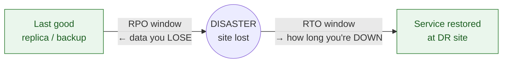
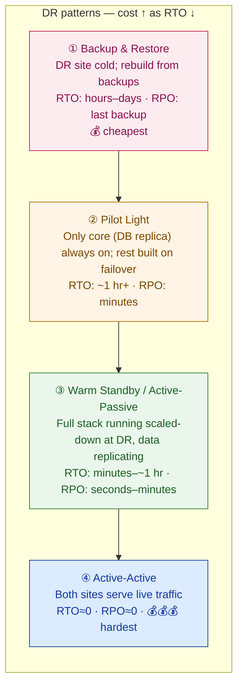

# HA, Backup & Disaster Recovery

> HA keeps one data center alive. Backup lets you rewind time. DR survives losing the whole site. They are three different problems — and only the third one is what the auditor and the disaster are actually asking about.

**Type:** Design
**Track:** AI, Data & Infrastructure Solution Architect (Presales)
**Prerequisites:** 2.5 Kubernetes Architecture
**Time:** ~4h
**Lab:** —
**Ship It:** DR strategy + RTO/RPO sheet

## The Problem

You are in a resilience workshop with **Garuda Finance** — an Indonesian financial-services firm, ~600 branches, ~8M customers, running core banking, loan origination, and a mobile app that peaks at ~4,000 transactions per minute. They own two data centers: **Jakarta (primary)** and **Surabaya (DR)**. The infrastructure lead is proud, and he has earned some of it: the Jakarta data center is beautifully redundant. Dual power feeds, dual core switches, N+1 cooling, a Kubernetes cluster spread across three racks, a storage array with dual controllers. "We're highly available," he says. "Five nines. We're covered."

Then the OJK regulator's checklist lands on the table, and it does not ask "is Jakarta redundant?" It asks three colder questions: *What is your RTO and RPO for each critical service? When Jakarta is gone — fire, flood, a severed fiber, a regional power event — how fast does Surabaya take over, and how much data do you lose? When did you last actually test that failover?* And the proud "five nines HA" story answers none of them. A single data center with dual everything is still a **single failure domain**. The fire doesn't care that the cooling was N+1. Worse, when you pull the thread, you find the nightly backups are written to *the same storage array* they are meant to protect, the Surabaya "DR site" has a database copy that someone set up two years ago and nobody has failed over to since, and there is no number anywhere that says how much of an ~8M-customer ledger the business is willing to lose. That is not a resilience posture. That is a story that passes the demo and fails the disaster.

This is the failure mode this lesson exists to kill: teams **conflate HA, backup, and DR**, sell single-site redundancy as "resilience," and walk into an OJK audit with no defined RTO/RPO. The SA's job here is not to run the failover scripts — it is to **separate the three concerns, set an RTO and RPO per workload tier, choose a DR pattern that fits the physics** (Jakarta and Surabaya are ~700 km apart — that distance, not any product, decides whether replication can be synchronous), and then defend that design to a regulator. Get it wrong in the usual ways — no RPO/RTO numbers, synchronous replication over a 700 km link, backups on the array they protect, a failover nobody ever tested — and the design is fiction. This lesson gives you the mental model and the deliverable that make it real.

## The Concept

### Three different problems, three different tools

The single most common mistake is treating HA, backup, and DR as one blurry idea called "resilience." They are three distinct problems, each protecting against a different kind of failure. An architect names which one a given control actually buys.

| | **High Availability (HA)** | **Backup** | **Disaster Recovery (DR)** |
|---|---|---|---|
| **Protects against** | A *component* dying (node, disk, PSU, switch) | *Data* loss & corruption — fat-finger, bug, ransomware | Losing an entire *site* |
| **Scope** | Inside one data center | A point-in-time copy you can restore | Across two sites |
| **Mechanism** | Redundancy: N+1, clustering, failure domains | 3-2-1 point-in-time copies | Cross-site replication + failover |
| **Time horizon** | Instant / seconds — automatic | Minutes to hours to restore | Governed by RTO / RPO |
| **What it does NOT cover** | A site loss, or a logical delete replicated everywhere | Fast failover — restore is slow | In-DC component outages (that's HA's job) |
| **The trap** | "We're HA" ≠ "we survive a disaster" | Backup on the same array it protects | A DR plan never tested |

Read across the row and the point lands: **HA does not survive a data-center fire. Backup does not give you fast failover. DR without HA still has in-DC outages.** Garuda needs all three, layered — HA inside each site, backups against corruption and ransomware, and DR across Jakarta↔Surabaya. Selling one as if it were all three is how a "five nines" story fails an audit.

Map four concrete Garuda failures to the control that actually saves you, and the separation stops being abstract:

- **A disk fails in the Jakarta array** → **HA** (dual controllers / RAID). Backup and DR are irrelevant; nothing was lost, nothing failed over.
- **A bad deploy corrupts a table, and replication faithfully copies it to Surabaya in seconds** → **Backup** (roll back to before the deploy). HA and DR *made it worse* by keeping the corrupt copy live at both sites.
- **A fire takes the whole Jakarta data center** → **DR** (fail over to Surabaya). HA is gone with the building; backups are too slow to restore an ~8M-customer core in minutes.
- **Ransomware encrypts production and every online backup it can reach** → **the immutable/offline backup copy** (§3-2-1). Nothing else can recover you.

Four failures, four different controls. An architect who can run this table in their head never confuses the three again.

### RTO and RPO — the two numbers that run the whole design

Every DR decision reduces to two numbers, defined on a timeline around the moment of disaster:



- **RPO — Recovery Point Objective** — measured *backward* from the disaster: how much data you can afford to lose. RPO = 0 means "not a single committed transaction." RPO = 15 min means "we can lose the last quarter hour." **RPO is set by how often you replicate/back up.**
- **RTO — Recovery Time Objective** — measured *forward* from the disaster: how long the service can be down before the business (or regulator) is harmed. RTO = 30 min means Surabaya must be serving traffic within half an hour. **RTO is set by which DR pattern you chose.**

Two rules that keep you honest: (1) **Tighter costs more — exponentially.** RPO≈0 and RTO in minutes cost far more than RPO=hours and RTO=a day. (2) **You cannot set one number for the whole estate.** A payments ledger and a monthly report do not deserve the same RTO. So you *tier* the workloads — that tiering is the heart of the deliverable.

### The DR pattern ladder — cost buys you a lower RTO

There are four canonical DR patterns. They form a ladder: each rung costs more to run and returns a lower RTO/RPO.



Garuda's brief says **active-passive** — rung ③, warm standby. That is the right instinct for a bank: rung ④ active-active gives RTO≈0 but forces you to solve *write conflicts across 700 km* for the ledger, which is a multi-year program most banks don't attempt for the core. Rung ③ gets you an RTO of minutes-to-an-hour at a fraction of the complexity. The SA's job is to know *why* the customer sits on rung ③ and be able to defend not climbing to ④.

### Synchronous vs asynchronous — and why ~700 km decides it for you

This is the piece of physics that separates architects from box-drawers. **Replication** copies writes from the primary to the DR site. It comes in two flavors:

- **Synchronous** — the primary waits for the DR site to acknowledge *every* write before it tells the application "committed." Result: **RPO = 0**, zero data loss. Cost: every transaction pays a full round-trip to the other site.
- **Asynchronous** — the primary commits locally and *streams* changes to DR a moment behind. Result: fast local writes, but **RPO = the replication lag** (seconds to minutes). If the primary dies, in-flight-but-not-yet-shipped writes are lost.

Now the physics. Light in fiber travels ~200 km per millisecond (~5 µs/km). Jakarta→Surabaya is ~700 km, so the one-way propagation floor is ~3.5 ms and the **round-trip floor is ~7 ms** — and real fiber routes are not straight lines, so with equipment and detours a **realistic RTT is ~10–15 ms** *(planning assumption — confirm with the carrier's actual measured latency).*

```
   SYNC is practical here ...        ... ASYNC is mandatory here
   ┌───────────────────────┐        ┌────────────────────────────────┐
   within one DC   metro     ~700 km  Jakarta ↔ Surabaya
   <1 ms RTT      <2 ms       ~10–15 ms RTT
   sync = free    sync ok     sync = +10–15 ms on EVERY commit  ✗
```

At ~4,000 txns/min peak, taxing every core-banking commit with an extra ~10–15 ms is not a tuning detail — it throttles throughput and couples your primary's latency to the health of a 700 km link. The industry rule of thumb: **synchronous replication is practical only within metro distances (~<100 km, ~<2 ms RTT).** Beyond that, you go asynchronous. So for Garuda, **~700 km forces async for the bulk of the estate**, and RPO for the ledger becomes *seconds* (the async lag), not zero. The only ways to get true RPO=0 are (a) tolerate the latency tax — usually a no for high-throughput core banking; or (b) add a *third, metro-distance* synchronous site near Jakarta — a real cost Garuda would have to fund. That trade-off is an escalation, not a checkbox, and naming it is the architect's job.

### Backup that actually survives a disaster — the 3-2-1 rule

Replication is not backup. Replication faithfully copies *everything* — including a bad deploy, a corrupt table, or a ransomware encryption sweep — to the DR site in seconds. Backup is the time machine that lets you go back to *before* the damage. The discipline is the **3-2-1 rule**:

```
   3  copies of the data        (1 production + 2 backups)
   2  different media / systems  (not all on the same array)
   1  copy off-site             (Surabaya — a different building, a different city)
   ─────────────────────────────────────────────────────────
   +1 immutable / offline copy  (WORM or air-gapped — ransomware can't encrypt what it can't reach)
   +0 verified restores         (a backup you never test-restored is a guess)
```

The classic anti-pattern the infra lead fell into: **backups written to the same storage array they protect.** When that array dies, the "backup" dies with it. A backup on the same failure domain as the primary is not a backup — it's a second copy waiting to fail together.

### Kubernetes DR is *redeploy + data*, not a stretched cluster

You designed Garuda's Kubernetes platform in 2.5. The instinct many teams have for DR is to *stretch one cluster* across Jakarta and Surabaya so it "just fails over." **Do not.** A Kubernetes control plane's state lives in etcd, which needs a low-latency quorum (~<10 ms) and an *odd* number of members to break ties. Stretch it across a ~10–15 ms link with only two sites and you get the worst of both: latency that hurts the control plane, and a quorum that can't cleanly survive losing one site (2 sites can't form a majority when one dies without a third arbiter).

The correct pattern ties directly to 2.5: **run a separate cluster per site**, keep the workload definitions in **Git**, and use **GitOps** (Argo CD or Flux) to redeploy the identical manifests at Surabaya. The cluster is *cattle* — you rebuild it from the repo. The **data is the pet** — it's replicated separately by the database/storage layer. So Kubernetes DR = *GitOps redeploy of stateless workloads* + *promote the replicated data* + *flip the traffic*. The failover is not "move the cluster" — it's "point the DR cluster at the same Git repo, promote the standby database, and switch DNS."

### A DR plan you never tested is a work of fiction

The last concept is a discipline, not a technology. A DR design that has never been exercised will fail on the day — a stale runbook, an expired certificate, a firewall rule nobody replicated, a DBA who left. OJK (like every financial regulator) expects **defined RTO/RPO *and* periodic, evidenced DR tests** — typically at least annually. So the design must ship with a **runbook** (who declares a disaster, the exact failover steps, the failback plan) and a **test cadence** (tabletop → component failover → full live failover). The test is what converts a diagram into a defensible control.

## Design It

Let's build Garuda Finance's **DR strategy + RTO/RPO sheet** — the deliverable this lesson ships, and a core input to Capstone B. Work it in order; each step feeds the next.

### Step 1 — Tier the workloads and set RTO/RPO (the heart of the sheet)

You cannot give ~8M customers' worth of systems one RTO. Sort every workload into tiers by business/regulatory impact, then assign each tier an RTO and RPO *as a range* — these are planning assumptions to confirm with the business and OJK, not laws of nature.

| Tier | Workloads (Garuda) | RTO (target range) | RPO (target range) | Why |
|---|---|---|---|---|
| **0 — Mission-critical** | Payments rail + core-banking ledger posting (the 24/7 path) | **15–30 min** | **~0 → 60 s** | A regulated bank cannot silently drop committed money movement; downtime is customer + regulatory harm |
| **1 — Business-critical** | Mobile app, internet banking, loan origination | **1–2 h** | **5–15 min** | Customer-facing and revenue-linked, but a short, communicated outage is survivable |
| **2 — Important** | Branch/teller support apps, CRM, back-office | **4–8 h** | **1–4 h** | Internal; branches can fall back to degraded/manual for hours |
| **3 — Deferrable** | Data warehouse, reporting, batch, dev/test | **24–48 h** | **~24 h** | Restore from the last nightly backup; no real-time need |

The move that earns trust: **payments and the ledger get the tightest numbers, batch gets the loosest** — and you write down *why* next to each, because "why" is what you defend to the regulator. (Sanity check: if every tier came out "RTO 15 min," you tiered nothing — someone is gold-plating and the cost will show it.)

### Step 2 — Choose the DR pattern and draw the active-passive design

Garuda's brief calls for **active-passive**, and the tiers confirm it: rung ③ **warm standby** meets a 15–30 min Tier-0 RTO without forcing 700 km write-conflict resolution (rung ④). Jakarta stays active; Surabaya runs a warmed, scaled-down copy of the stack with data continuously replicating, ready to promote. Here is the design, with the all-important **sync/async boundary** marked:

```
        JAKARTA  (PRIMARY — active)                       SURABAYA  (DR — passive / warm)
        ══════════ ~700 km · async replication link (~10–15 ms RTT) ══════════▶
   ┌──────────────────────────────────┐                ┌──────────────────────────────────┐
   │  GSLB / DNS  (health-checked)     │◀── fail over ─▶│  GSLB / DNS  (stands by)          │
   ├──────────────────────────────────┤                ├──────────────────────────────────┤
   │  K8s cluster A  (LIVE)            │  same manifests │  K8s cluster B  (WARM, scaled-    │
   │  mobile · internet bank · loans   │◀── via GitOps ─▶│  down; Argo CD synced, ready)     │
   │  HA inside DC: N+1, 3 racks       │   (Git repo)    │  HA inside DC: N+1                 │
   ├──────────────────────────────────┤                ├──────────────────────────────────┤
   │  Core-banking DB  (PRIMARY)       │= = = ASYNC = = ▶│  Core-banking DB  (STANDBY)       │
   │  commits locally, ships redo      │  (700 km ⇒ NO   │  read-only, applying redo         │
   │  RPO ≈ replication lag (~10–60 s) │   sync for OLTP)│  promote on failover              │
   ├──────────────────────────────────┤                ├──────────────────────────────────┤
   │  Storage array  ─────────────────┼── async array ──▶│  Storage array  (replica)         │
   │  local snapshots (HA)            │   replication   │  local snapshots (HA)             │
   └───────────────┬──────────────────┘                └───────────────┬──────────────────┘
                   │ 3-2-1 backup                                       │ off-site copy
                   ▼                                                    ▼ lands here
        Immutable / offline copy (WORM, air-gapped — ransomware defense)

   ── SYNC / ASYNC BOUNDARY ───────────────────────────────────────────────────────────
   INSIDE a DC (<1 ms): synchronous is free → that's your HA (clustering, mirrored writes).
   ACROSS 700 km (~10–15 ms RTT): synchronous would add ~10–15 ms to EVERY commit → for the
   OLTP ledger that's a throughput/latency tax you don't pay. The cross-site link is ASYNC.
```

Note how the diagram layers all three concerns: **HA lives inside each box** (N+1, racks, dual controllers), **DR is the horizontal replication + failover** between boxes, and **backup is the vertical drop** to an immutable copy. Three problems, one picture.

### Step 3 — Design the replication and do the RPO math

Two things replicate across the link, both **async** (Step 2's physics):

- **Database:** transaction-log / redo shipping (e.g. Oracle Data Guard in *async/max-performance* mode, or PostgreSQL streaming replication). The standby applies the log a few seconds behind. **RPO = the lag** — target ~10–60 s under peak. To bound worst-case loss, ship logs continuously and monitor lag as an SLO; if lag blows past the Tier-0 RPO, that's a paging alert, because it silently widens your data-loss window.
- **Storage array:** async block replication (e.g. Dell SRDF/A, NetApp SnapMirror, Pure ActiveDR) for volumes that aren't captured by DB log shipping (file shares, images, VM disks).

**The Tier-0 RPO=0 tension, stated honestly for the sheet:** the tightest tier *wants* RPO=0, but 700 km forbids synchronous replication for a 4,000-txn/min ledger. So you target **RPO ~seconds via async log shipping**, and you escalate the residual as a *business decision*: accept ~seconds of potential loss (mitigated by idempotent, replayable transactions from a durable log), **or** fund a third metro-distance synchronous site near Jakarta to reach true zero. You do not quietly promise zero over a link that can't deliver it.

### Step 4 — Backup 3-2-1, so array-failure and ransomware are covered

Replication handles *site loss*; it does **not** handle corruption or ransomware — those replicate to Surabaya in seconds. Layer backups underneath:

- **3** copies: production + Jakarta backup + Surabaya backup.
- **2** media/systems: backups land on a **separate backup system**, never the production array they protect (the exact trap from The Problem).
- **1** off-site: the Surabaya copy.
- **+1 immutable/offline:** a WORM or air-gapped copy so a ransomware operator with admin rights still can't encrypt or delete your last-known-good.
- **+0:** schedule **test restores** and record success — an untested backup is a guess, and OJK wants evidence.

Backup cadence follows the tiers: Tier 0–1 frequent (e.g. sub-hourly incrementals + daily fulls); Tier 3 nightly is fine.

### Step 5 — Kubernetes DR: GitOps redeploy + data promotion (from 2.5)

Do **not** stretch the cluster. The failover procedure for the Kubernetes-hosted Tier-1 apps is:

1. Workload manifests already live in **Git**; Argo CD in the Surabaya cluster is pre-synced and idle.
2. On failover, **scale up** the Surabaya deployments (warm → hot) and **promote the standby database** to primary.
3. **Repoint** the app's data connections to the promoted DB and **flip GSLB/DNS** to Surabaya.
4. The stateless tier comes back from Git in minutes; the recovery clock is really the **data promotion + DNS TTL**, which is why you keep TTLs short and the standby warm.

The cluster is rebuildable from the repo (cattle); the ledger is not (pet). This keeps Tier-1 RTO inside 1–2 h and Tier-0 inside 15–30 min *provided* the standby is genuinely warm and drilled.

### Step 6 — DR test cadence + runbook that satisfies OJK

Finally, make it defensible. Ship a **runbook** — declaration authority ("who says it's a disaster"), the ordered failover steps, and the *failback* plan (returning to Jakarta is a planned event, not a scramble) — plus a **test cadence**:

| Test type | What it proves | Cadence (assumption) |
|---|---|---|
| **Tabletop** | The team knows the runbook and roles | Quarterly |
| **Component failover** | One tier (e.g. a DB) promotes cleanly | Semi-annually |
| **Full live failover** | Surabaya can actually run production, RTO/RPO met | **At least annually** (OJK expectation) |

Every test records **measured RTO/RPO vs target** — that gap analysis is the artifact the auditor wants, and the input that tightens next year's design.

## Compare It

### The four DR patterns — cost vs RTO/RPO

| Pattern | RTO | RPO | Relative run-cost | Pick it when… |
|---|---|---|---|---|
| **Backup & Restore** | Hours–days | Last backup | $ | Tier 3 only; DR site can be cold |
| **Pilot Light** | ~1 h+ | Minutes | $$ | Cost-sensitive; core data pre-replicated, rest built on demand |
| **Warm Standby / Active-Passive** | Minutes–~1 h | Seconds–min | $$$ | **Garuda's Tier 0–1** — regulated, needs fast, defensible failover |
| **Active-Active** | ≈0 | ≈0 | $$$$ | Only when the business funds cross-site write-conflict handling; rare for a core ledger |

The "it depends" a customer asks: *"Why not active-active for everything — isn't zero downtime best?"* Because active-active over 700 km means resolving conflicting writes to the same account from two sites — an enormous correctness and cost burden for a ledger. Warm standby buys 90% of the resilience for a fraction of the risk. You reserve rung ④ for stateless read paths where conflicts don't exist.

### Synchronous vs asynchronous replication

| | **Synchronous** | **Asynchronous** |
|---|---|---|
| **RPO** | 0 | Replication lag (seconds–minutes) |
| **Write latency** | +full RTT on every commit | Local speed |
| **Distance limit** | Metro (~<100 km, ~<2 ms) | Continental+ |
| **Garuda fit** | Only *within* a DC, or a hypothetical metro site | **The Jakarta↔Surabaya link (700 km)** |

The whole Garuda replication story is one sentence: **distance sets the ceiling on RPO.** No product removes the speed of light.

### Where you replicate: storage vs database vs application level

| Level | Tools | Strength | Watch-out |
|---|---|---|---|
| **Storage array** | Dell SRDF, NetApp SnapMirror, Pure ActiveDR | App-agnostic; replicates any workload's blocks | Replicates corruption too; no transaction awareness |
| **Database** | Oracle Data Guard, PostgreSQL streaming, SQL Server AG | Transaction-consistent; understands commits | Per-engine; only covers what's in the DB |
| **Application** | Dual-write, event-log replay (Kafka) | Business-aware, can filter/transform | You own the correctness and conflict logic |

For Garuda: **DB-level for the ledger** (transaction-consistent, promotable), **storage-level for the rest** (VMs, files), and **GitOps** as the "app-level" story for stateless Kubernetes workloads.

### Tooling landscape

- **Veeam** — backup + replication, strong for VM estates and 3-2-1 with immutable repositories.
- **Zerto** — continuous data protection (hypervisor-level, journal-based), very low RPO for VM workloads; good when you want near-continuous replication without array lock-in.
- **Storage-array native** (SRDF / SnapMirror / ActiveDR) — highest performance, but ties you to the array vendor at both sites.
- **VMware Site Recovery Manager (SRM)** — *orchestrates* the failover runbook for a VMware estate (boot order, IP remap, test failover) — it automates the runbook, it does not replace the RTO/RPO decision.
- **Argo CD / Flux (GitOps)** — the Kubernetes redeploy mechanism from 2.5; the "replication" for stateless workloads is the Git repo itself.

The architect's line: **tools automate the runbook; they never set the RTO/RPO or choose the pattern.** Those are your calls, and they come before any product name.

## Ship It

This lesson ships a **DR Strategy + RTO/RPO Sheet** — the artifact you hand a bank to pass a BCP/DR audit and the core input to **Capstone B**. It flows exactly like Design It: tiered RTO/RPO table → DR pattern → replication design → backup 3-2-1 → test plan → runbook skeleton. Both files live in [`outputs/`](../outputs/):

- **[`template-dr-strategy-rto-rpo-sheet.md`](../outputs/template-dr-strategy-rto-rpo-sheet.md)** — the fill-in-the-blank sheet: the tiering table, a pattern-selection box, a replication + sync/async worksheet, the 3-2-1 backup plan, and the DR-test cadence + runbook skeleton. A colleague can run a resilience workshop straight from it.
- **[`example-garuda-finance-dr-strategy.md`](../outputs/example-garuda-finance-dr-strategy.md)** — the sheet fully worked for Garuda Finance, so the skeleton isn't abstract: four tiers set, warm-standby Jakarta→Surabaya chosen and defended, async replication with the RPO math, 3-2-1 with an immutable copy, and an OJK-satisfying test cadence.

Why ship this early in Phase 2: the RTO/RPO sheet is the one artifact that turns "we're highly available" into a number a regulator can audit and a business can sign. It is the difference between a resilience *story* and a resilience *design*.

## Exercises

1. **(Easy)** Take Garuda's tier table and, for each of the four tiers, write one sentence naming which **DR pattern** (backup&restore / pilot-light / warm-standby / active-active) and which **backup cadence** you'd assign, and why. Then explain in one line why the payments tier's RPO cannot be truly 0 over the Jakarta–Surabaya link.
2. **(Medium)** Re-do the RTO/RPO sheet for a *different* customer: a **regional e-commerce marketplace** with one primary cloud region and a secondary region ~1,500 km away. List four workload tiers, assign RTO/RPO ranges, and pick a DR pattern per tier. Note where your numbers differ from Garuda's and *why* the different business (retail vs regulated bank) and different distance change the answer.
3. **(Hard)** Extend Garuda's design into a **decision memo**: the CFO asks whether to spend on a *third, metro-distance synchronous site* near Jakarta to reach RPO=0 for the ledger, or accept ~seconds of async RPO with idempotent transaction replay. Write a half-page recommendation that states the cost driver of each path, the residual risk each leaves, and the regulatory framing — then make a call and defend it. Save it beside your worked sheet; you'll reuse this reasoning in Capstone B.

## Key Terms

| Term | What people say | What it actually means |
|------|-----------------|------------------------|
| High Availability (HA) | "We're five nines / we're resilient" | In-DC redundancy (N+1, clustering, failure domains) that survives a *component* failure. A single redundant DC is still one failure domain — HA is **not** DR. |
| Disaster Recovery (DR) | "We have a DR site" | The ability to fail an entire *service* over to a second site within a defined RTO/RPO. Having a copy at the DR site is not DR until you've tested the failover. |
| RTO | "How fast we recover" | Recovery Time Objective — the maximum tolerable *downtime*, set by your DR pattern. Measured forward from the disaster. |
| RPO | "How much we back up" | Recovery Point Objective — the maximum tolerable *data loss*, set by replication/backup frequency. Measured backward from the disaster. |
| Synchronous replication | "Real-time replication" | The primary waits for the remote ack on every write → RPO=0, but pays a full round-trip per commit; only viable at metro distance (~<100 km). |
| Asynchronous replication | "Slightly delayed replication" | Commit locally, stream to DR a moment behind → fast writes but RPO = the lag. Mandatory beyond metro distance (Jakarta↔Surabaya, ~700 km). |
| 3-2-1 rule | "Keep backups" | 3 copies, on 2 media, 1 off-site (modern: +1 immutable/offline, +0 tested restores). A backup on the array it protects violates it. |
| Warm standby / active-passive | "Failover cluster" | A full stack running scaled-down at DR with data replicating, ready to promote — RTO minutes-to-an-hour. The default for regulated core systems. |
| Failure domain | "A rack / a site" | The blast radius of a single fault. HA reduces domains inside a DC; DR spans two DCs so one site's loss isn't fatal. |
| DR runbook | "The failover doc" | The ordered, role-assigned procedure to declare, fail over, and fail *back* — worthless until a live test proves it works. |

## Further Reading

- [AWS Disaster Recovery of Workloads on AWS (Whitepaper)](https://docs.aws.amazon.com/whitepapers/latest/disaster-recovery-workloads-on-aws/disaster-recovery-options-in-the-cloud.html) — the clearest published articulation of the four-pattern ladder (backup&restore → pilot light → warm standby → active-active) with RTO/RPO trade-offs; the model is cloud-framed but pattern-agnostic.
- [Google SRE Book — Chapter on Reliability & Data Integrity](https://sre.google/sre-book/data-integrity/) — why "replication is not backup," how corruption propagates, and the discipline of verified restores.
- [The 3-2-1 Backup Rule (Veeam / CISA guidance)](https://www.cisa.gov/) — the origin and modern 3-2-1-1-0 extension, and why immutability is now table stakes against ransomware.
- [Oracle Data Guard — Protection Modes](https://docs.oracle.com/en/database/oracle/oracle-database/19/sbydb/oracle-data-guard-protection-modes.html) — the concrete sync-vs-async trade-off (max-protection / max-availability / max-performance) that Garuda's ledger replication choice maps onto.
- [Argo CD — Declarative GitOps for Kubernetes](https://argo-cd.readthedocs.io/) — the redeploy-from-Git mechanism behind Kubernetes DR; pairs with the cluster design from lesson 2.5.
- POJK / OJK guidance on IT risk management and business continuity for banks — read your jurisdiction's regulator on BCP/DR: it mandates *defined* RTO/RPO and *periodic tested* recovery, which is exactly what this sheet produces.
