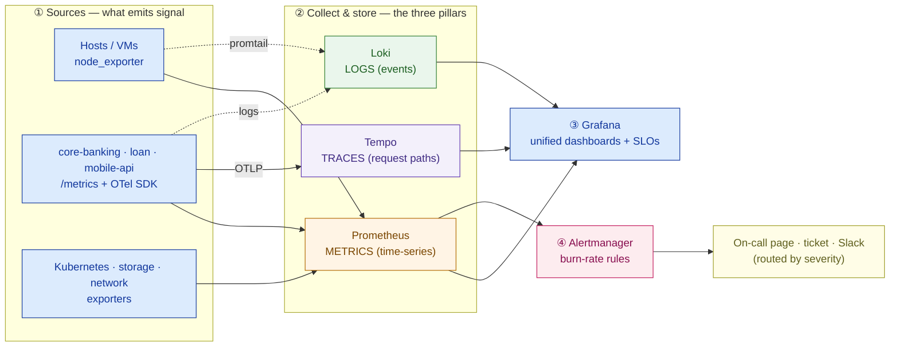

# Observability & Infrastructure Security

> You cannot operate — or pass an audit on — what you cannot see. Design both in from the first box, or bolt them on after the breach.

**Type:** Design
**Track:** AI, Data & Infrastructure Solution Architect (Presales)
**Prerequisites:** 2.6 HA, Backup & Disaster Recovery
**Time:** ~6h
**Lab:** Prometheus + Grafana
**Ship It:** Observability + security design

## The Problem

By now the platform exists on paper. Across the last six lessons you sized the **compute** (2.1), placed the **storage** (2.2), drew the **data-center network** (2.3), packaged workloads into **containers** (2.4), landed them on **Kubernetes** (2.5), and made the whole thing survive a data-center loss with **HA, backup and DR** across two sites (2.6). It is a real private cloud. Now it has to *run* — 24/7, under a regulator's gaze — and that is a different job.

Picture go-live night for **Garuda Finance**, an Indonesian financial-services firm: ~600 branches, ~8M customers, core banking + loan origination + a mobile app peaking at ~4,000 transactions/minute, all on an in-country private cloud spread over two data centers in Jakarta and Surabaya. At 20:00 the mobile app starts feeling slow. The operations bridge lights up. Is it the payment gateway? The core-banking database? The network between DCs? A noisy neighbor on Kubernetes? Nobody can say. They have *logs* — gigabytes of them — but a wall of log lines does not tell you that the **payment success rate just fell from 99.95% to 98.1%**, and it certainly does not tell you *which of eight services* ate the extra 1.9 seconds of latency. The team is flying blind on the one platform that must never go dark. That is failure mode one: **a platform you cannot see is a platform you cannot run.**

Failure mode two arrives in daylight, wearing a suit. **OJK** — Indonesia's Financial Services Authority (*Otoritas Jasa Keuangan*) — sends an examiner. The questions are not about uptime; they are about control. *Who accessed the customer database last quarter, and prove it. Where are your application credentials stored, and who can read them. Show me your access logs, retained and tamper-evident, for the mandated period. Which controls protect data at rest and in transit, and how do you know they are on?* If the honest answers are "shared admin accounts," "passwords in a config file," and "logs rotate off after two weeks," Garuda does not merely look sloppy — it **fails the examination**, and the same gaps that fail the audit are the ones a breach walks through. Both failure modes trace to the same rookie move: treating observability and security as operational chores someone bolts on *after* the architecture is done. The architect who does that ships an unrunnable, un-auditable platform. This lesson designs both as first-class architecture and maps the security half directly to what the regulator demands — the two things that turn a stack of boxes into a system you can trust with 8 million people's money.

## The Concept

Observability and security are two lenses on the same requirement: **know the true state of your platform, and control who can change it.** Treat each as an architecture, not a tool you install.

### Observability: the three pillars

Monitoring answers questions you predicted (*"is CPU above 80%?"*). **Observability** lets you answer questions you did not predict, *after* the fact (*"why were payments from the Surabaya app zone slow between 20:00 and 20:12?"*). You get there with three complementary signal types — the **three pillars** — and an architect specifies all three, because any one alone leaves a blind spot.

| Pillar | Question it answers | Shape of the data | Reference tool | Cost to keep |
|---|---|---|---|---|
| **Metrics** | *Is it healthy? Trending which way?* | Numeric time-series, aggregatable (success rate, p99 latency, queue depth) | **Prometheus** | Cheap — pre-aggregated |
| **Logs** | *What exactly happened in this event?* | Discrete, high-detail records (an error, a decline reason) | **Loki** | Medium — volume-driven |
| **Traces** | *Where did the time/error go across services?* | The path of one request across every hop | **Tempo** + **OpenTelemetry** | Higher — sampled |

The classic mistake is **logs-only**: teams ship logs, call it observability, and then cannot draw a single trend line or follow one payment across the mobile API → auth → core-banking → ledger path. Metrics tell you *something* is wrong and how badly; traces tell you *where*; logs tell you *what*. **OpenTelemetry (OTel)** is the vendor-neutral standard that lets one instrumentation emit all three, so you are not locked to a single backend. Here is the pipeline the architect draws — sources on the left, the three stores in the middle, one pane of glass and actionable alerts on the right:



**One architect's trap to flag early — cardinality.** Metrics are cheap *only* while the number of unique label combinations stays bounded. Label a metric by `customer_id` on a platform with ~8M customers and you detonate Prometheus — millions of time-series for one metric name, and the store falls over. Keep metric labels **low-cardinality** (service, zone, status code, DC); push per-customer detail into **logs and traces**, where high cardinality belongs. Getting this boundary wrong is the single most common way a self-hosted metrics stack dies in production, so it is an architecture decision, not an ops afterthought.

### SLIs, SLOs, error budgets — and alerts worth waking up for

Dashboards without targets are wallpaper. The discipline that turns signals into decisions is the **SLI / SLO / error-budget** chain from Google's SRE practice:

- **SLI (Service Level Indicator)** — a *measured* number that reflects user happiness: payment **success rate**, payment **p99 latency**, mobile-app **availability**. Pick indicators a customer would actually feel; Google's **four golden signals** — latency, traffic, errors, saturation — are the usual place to hunt for them.
- **SLO (Service Level Objective)** — the *target* for an SLI over a window: "99.9% of payments succeed each 30-day window," "p99 ≤ 800 ms." The SLO is a business decision, not an engineering guess — you propose it and the business confirms it.
- **Error budget** — the allowed shortfall, `1 − SLO`. A 99.9% monthly SLO buys ≈ **43 minutes** of failure per month. At Garuda's ~4,000 txns/min peak, 99.9% success permits about **4 failed transactions per minute** at peak before the budget is spent. The budget is a currency: spend it on risk (ship faster) or bank it (freeze changes) — either way it makes the "how reliable is enough?" argument quantitative instead of emotional.

Keep this conversion in your head — every "we want five nines" conversation needs it, because each nine costs an order of magnitude more engineering:

| Monthly SLO | Downtime budget / month | Feels like |
|---|---|---|
| 99% ("two nines") | ~7.3 hours | a bad afternoon, monthly |
| 99.9% ("three nines") | ~43 minutes | one short incident |
| 99.95% | ~22 minutes | tight — needs automation |
| 99.99% ("four nines") | ~4.3 minutes | no manual step survives this |

The right target is the one the *business* will pay for, not the biggest number on the slide. For Garuda, payments live at three-to-four nines; an internal report can happily sit at two.

Error budgets fix the single worst operational disease: **alert noise**. The anti-pattern is a page for every CPU spike and disk-80%-full — hundreds of alerts, none actionable, all ignored until the one that mattered scrolls past. The cure is to **alert on symptoms against the SLO**, not on every cause. Use **multi-window burn-rate** alerts: page a human only when the error budget is burning fast enough to matter (e.g. a *fast burn* consuming 2% of the monthly budget in an hour → **page now**; a *slow burn* over six hours → **ticket, business hours**). Three rules for every alert you design: it must be **actionable** (a human can do something), **urgent** (it needs a person now, or it is a ticket not a page), and **documented** (it links a runbook). Anything else is noise you are training the on-call to ignore.

### Infrastructure security: defense in depth, mapped to the regulator

Security is not a product; it is a set of **control families**, layered so that no single failure is fatal (*defense in depth*). For a regulated bank each control also has to *answer to an obligation* — the architect's job is not to run the SOC, it is to design the controls and **map each one to what OJK/BI expects and the tool that implements it.** That mapping is the deliverable an examiner actually wants:

```
 SECURITY CONTROL              WHAT OJK / BI EXPECTS                     IMPLEMENTED BY (reference)
 ────────────────────────────────────────────────────────────────────────────────────────────────
 Identity & access (IAM/RBAC)  least privilege · named accounts ·        SSO/LDAP (Keycloak) +
                               segregation of duties                     Kubernetes RBAC, per-role
 Encryption in transit         protect data moving between systems       TLS 1.2+ / mTLS everywhere
 Encryption at rest            protect stored customer & txn data        disk/volume encryption + KMS keys
 Secrets management            no plaintext creds · rotation · leases    HashiCorp Vault (dynamic secrets)
 Host / OS hardening           a secure, known baseline                  CIS Benchmarks + config mgmt
 Network segmentation          isolate payment & customer zones          microsegmentation (recap 2.3)
 Image vulnerability mgmt      no known-vulnerable software shipped      Trivy scan in CI + registry gate
 Runtime threat detection      catch anomalies while running            Falco (syscall/behavior alerts)
 Policy enforcement            block non-compliant workloads at deploy   OPA/Gatekeeper or Kyverno (admission)
 Audit trail                   who did what, when — tamper-evident       immutable/WORM log store
 Log retention & reporting     keep records for the mandated term        Loki + object storage + retention policy
```

A few of these deserve the architect's specific attention because rookies skip them. **Secrets management** is the one most often missing: credentials hard-coded in a container image or a Kubernetes ConfigMap are a finding waiting to happen. **Vault** issues short-lived, *dynamic* secrets (a database credential that exists for one hour) and keeps a full access log — exactly what the audit question needs. **Encryption** must be specified in *two* places (in transit **and** at rest) or the sentence is incomplete. **Image and runtime security** are the natural extension of the container/K8s work from 2.4–2.5: **Trivy** scans images *before* they ship (shift-left); **Falco** watches syscalls *at runtime* to catch what got through. **Policy-as-code** (OPA/Gatekeeper or Kyverno) turns "we have a rule that containers can't run as root" into an admission controller that *mechanically refuses* the deployment — a control an examiner can test. And the **audit trail** is not just "keep logs" — it is *immutable* (write-once, tamper-evident) and *retained* for the regulator's term, which is a storage-and-retention design decision, not a logging default.

## Design It

Design Garuda's observability + security architecture as an overlay on the two-DC private cloud you already have (Jakarta = primary, Surabaya = DR, from 2.6). Work it in five steps; the output is the Ship It deliverable.

### Step 1 — Instrument the three pillars, once per DC, one pane of glass

Deploy an observability stack **in each DC** (so telemetry survives a DC loss and never leaves the country) and federate them into one Grafana for a global view. What to collect:

- **Metrics** — `node_exporter` on every host/VM; a `/metrics` endpoint on core-banking, loan-origination, and the mobile API; exporters for Kubernetes, storage, and the DC-interconnect. Prometheus scrapes on a 15s interval and stores locally, with long-term metrics rolled to durable storage.
- **Traces** — instrument the **payment path** (mobile-api → auth → core-banking → ledger) with OpenTelemetry, exported over OTLP to Tempo. Sample heavily on errors and slow requests.
- **Logs** — ship application and system logs via promtail to Loki, labeled by service, DC, and zone.

```
        JAKARTA DC (primary)                          SURABAYA DC (DR / warm)
  ┌─────────────────────────────────┐          ┌─────────────────────────────────┐
  │ EDGE zone   WAF · LB · TLS/mTLS  │          │ EDGE zone   (warm standby)      │
  │ APP  zone   mobile-api · loan    │          │ APP  zone   replicated          │
  │ CORE zone   core-banking · DB    │          │ CORE zone   replicated          │
  │ MGMT zone   Vault · obs stack    │◀──fed──▶ │ MGMT zone   Vault · obs stack   │
  │   Prometheus · Loki · Tempo      │          │   Prometheus · Loki · Tempo     │
  └───────────────┬─────────────────┘          └────────────────┬────────────────┘
                  └───────────── Grafana (single global view) ───┘
   zones separated by microsegmentation (2.3) · audit logs shipped to a WORM store
   all telemetry stays in-country — no SaaS backend crosses the border (OJK residency)
```

*Legend:* **EDGE/APP/CORE/MGMT** are microsegmented security zones (least-privilege traffic between them); **fed** = the two Prometheus/Loki/Tempo stacks federate so one Grafana shows both DCs; **WORM** = write-once, tamper-evident audit storage.

### Step 2 — Define the top SLOs (propose targets; the business confirms)

Pick the handful of SLIs a customer or examiner would actually feel, and set targets. These are **proposed** design values with rationale — never magic numbers dropped without a range or an owner.

| Service | SLI | Proposed SLO (30-day) | Error budget | Why this target |
|---|---|---|---|---|
| Payments | Success rate | **99.9%** | ~43 min/mo · ≈4 failed txn/min at peak | 24/7 payments must not go dark; below this, customers feel declines |
| Payments | Latency (p99) | **≤ 800 ms** end-to-end | — | Mobile users abandon a slow pay; ties to the traced payment path |
| Mobile app | Availability | **99.9%** | ~43 min/mo | Primary customer channel for 8M users |
| Core-banking API | Availability | **99.95%** | ~22 min/mo | Shared dependency of branches + app; stricter than the front end |

*Assumptions to confirm:* targets, windows, and how "success/availability" are measured (which status codes count, from where). State them in the deliverable so the business signs off rather than discovers them later.

### Step 3 — Route alerts by severity, page only on burn

Wire Alertmanager so a page means "a human must act now" and everything else is a ticket:

- **Fast burn** (≈2% of a monthly budget in 1h, multi-window confirmed) → **page the on-call** for that service.
- **Slow burn** (≈5% over 6h) → **ticket**, handled in business hours.
- **Cause alerts** (a node down, disk 80%, a failed scrape) → dashboard + ticket, **not** a page, unless they are already burning an SLO.
- Every alert carries **severity, owning team, and a runbook link**. Route by label: `severity=page` → on-call tool; `severity=ticket` → queue; security-relevant alerts (Falco, failed logins) also fork to the security channel.

### Step 4 — Design the security controls, mapped to OJK

Take the control map from The Concept and make it concrete for Garuda:

- **IAM/RBAC** — no shared admin accounts; SSO to a directory (Keycloak/LDAP), Kubernetes RBAC per role, **segregation of duties** (the person who deploys cannot also approve their own change).
- **Encryption** — TLS 1.2+ / **mTLS** between every service (in transit); volume/disk encryption for databases and backups with keys in a KMS/HSM (at rest). Both, explicitly.
- **Secrets** — **Vault** issues dynamic, short-lived DB and API credentials; nothing in images or ConfigMaps; Vault's own access log feeds the audit trail.
- **Vulnerability & runtime** — **Trivy** gates the CI pipeline and registry (2.4) so no known-critical CVE ships; **Falco** watches runtime syscalls and alerts on anomalies (a shell spawned in the payments container).
- **Policy-as-code** — an admission controller (Kyverno or OPA/Gatekeeper) refuses pods that run as root, pull `:latest`, or skip resource limits — a mechanical, testable control.
- **Audit trail & retention** — every privileged action (kubectl, Vault read, DB admin) lands in an **immutable/WORM** store, retained for the mandated term, queryable for the examiner. Retention length is a **policy input** — set it to the OJK/BI-defined period and record the assumption; do not guess a number into the design.

### Step 5 — Assemble the one-page design and hand it to Capstone B

Combine the observability pipeline (Step 1), the SLO table (Step 2), the alert routing (Step 3), and the control-to-obligation map (Step 4) into a single **Observability + Security Design**. That page is the operability-and-compliance chapter of the Capstone B private-cloud proposal — the evidence that the platform can be *run* and *audited*, not just built.

### Validate it (Lab) — Prometheus + Grafana in ten minutes

You do not architect a pipeline you have never seen carry a signal. Stand up the smallest possible version — Prometheus scraping one target, a graph in Grafana — so the diagram in Step 1 stops being abstract. Everything is local and free; it validates the design claim, it does not build a product.

Create two files. **`prometheus.yml`:**

```yaml
global:
  scrape_interval: 15s
scrape_configs:
  - job_name: prometheus            # Prometheus scrapes itself
    static_configs:
      - targets: ["localhost:9090"]
  - job_name: node                  # ...and one real target
    static_configs:
      - targets: ["node-exporter:9100"]
```

**`docker-compose.yml`:**

```yaml
services:
  prometheus:
    image: prom/prometheus:v2.53.0
    ports: ["9090:9090"]
    volumes:
      - ./prometheus.yml:/etc/prometheus/prometheus.yml:ro
  node-exporter:
    image: prom/node-exporter:v1.8.1
    ports: ["9100:9100"]
  grafana:
    image: grafana/grafana:11.1.0
    ports: ["3000:3000"]
    environment:
      - GF_SECURITY_ADMIN_PASSWORD=admin
```

Run it and watch the pipeline work:

```bash
docker compose up -d

# 1. Confirm the scrape: open http://localhost:9090/targets
#    — both "prometheus" and "node" should show State = UP.

# 2. See a metric: http://localhost:9090/graph  → query:  up
#    — value 1 means the target is being scraped (your first SLI-shaped signal).

# 3. Dashboard it: open http://localhost:3000  (login admin / admin)
#    Connections -> Data sources -> add Prometheus, URL = http://prometheus:9090, Save & test.
#    Explore -> run:  100 - (avg by(instance)(rate(node_cpu_seconds_total{mode="idle"}[1m])) * 100)
#    — a live CPU-utilization % graph. You just scraped a target and saw a dashboard.

docker compose down    # tear down when finished
```

That is the entire Step 1 pattern in miniature: an exporter (`node-exporter`) → a metrics store (Prometheus) → a dashboard (Grafana). Multiply it by every host and service, add Loki/Tempo and Alertmanager, and you have Garuda's stack.

## Compare It

The design above names open-source reference tools. In a real deal the customer will ask "why not just buy Datadog?" — so know the trade-offs and the "it depends," especially the one that dominates for a regulated Indonesian bank: **data residency.**

**Observability stack — open self-hosted vs commercial:**

| Option | Cost model | Ops burden | Data residency | Best when… |
|---|---|---|---|---|
| **Prometheus + Grafana + Loki + Tempo** (open, self-hosted) | No licence; you pay for infra + your team's time | **You run it** — HA, storage, upgrades | **Stays in-country** — you own every byte | On-prem/regulated; you have platform skills (Garuda's case) |
| **Datadog / Dynatrace** (commercial SaaS) | Per-host + per-ingest; can balloon with cardinality | Very low — fully managed | **Telemetry leaves the country** to the vendor cloud → an OJK residency problem | Cloud-native shops without residency limits |
| **Elastic (ELK) / Splunk / Grafana Enterprise** (commercial, self-hostable) | Licence + infra | Medium — managed software you host | Can stay in-country if self-hosted | You want commercial support but must keep data local |

For Garuda the SaaS options are effectively **disqualified by residency** before cost even enters — a point worth making explicitly in the proposal, because it is the kind of constraint an executive respects.

**Secrets — Vault vs cloud KMS:** they solve different halves and often pair. **Cloud KMS** (AWS KMS, Azure Key Vault, GCP KMS) manages *encryption keys* and crypto operations — but a public-cloud KMS sends key material off-shore, so on an in-country private cloud you use an **on-prem HSM** (or HSM-backed appliance) for the master key. **Vault** manages *secrets* (credentials, tokens, PKI) with dynamic, leased, fully-audited issuance, and it can seal itself with that HSM. The pattern for Garuda: **Vault for secrets, HSM for the master key**, all on-prem.

**Policy-as-code — OPA/Gatekeeper vs Kyverno:** both enforce policy at Kubernetes admission. **OPA/Gatekeeper** uses the general-purpose **Rego** language and reaches beyond Kubernetes (APIs, Terraform, CI) — powerful, steeper learning curve. **Kyverno** is **Kubernetes-native**, policies are plain YAML, and it is markedly easier for a team whose scope is "secure our clusters." Rule of thumb: **Kyverno** if policy is K8s-only (the pragmatic default for Garuda's clusters); **OPA** if you need one policy engine across the whole estate.

## Ship It

This lesson ships an **Observability + Security Design** — the operability-and-compliance chapter that turns a built platform into a runnable, auditable one, and the final Phase-2 input to **Capstone B**. Both files live in [`outputs/`](../outputs/):

- **[`template-observability-security-design.md`](../outputs/template-observability-security-design.md)** — a fill-in-the-blank template: the observability pipeline (Mermaid), an SLO table, an alert-routing table, and the **security-control × compliance-requirement × implementing-tool** matrix with an audit/retention section. A colleague can run it against any regulated customer.
- **[`example-garuda-finance-obs-security.md`](../outputs/example-garuda-finance-obs-security.md)** — the template fully worked for Garuda Finance, so the skeleton is not abstract. It is the artifact you attach to the Capstone B proposal.

The point of shipping this as the phase closer: a design that shows *both* how you would watch the platform *and* how each control answers a named regulatory obligation is the difference between "we built you a private cloud" and "we built you one you can operate 24/7 and defend to OJK." The second one wins the deal.

## Exercises

1. **(Easy)** For each symptom, name the **pillar** that answers it first and write the one SLI you would watch: (a) "customers say the app 'sometimes' fails to pay"; (b) "one payment took 4 seconds — where?"; (c) "which downstream error caused that decline?". Then write a single SLO for Garuda's **loan-origination** service, with its error budget and one sentence of rationale.
2. **(Medium)** Re-map the security-control table for a **different regulated customer**: a national **hospital group** under a health-data-protection regime instead of OJK. Keep the eleven control families, but rewrite the "what the regulator expects" column for patient data (consent, PHI access logging, breach notification) and name the **one control that changes most** versus a bank, and why.
3. **(Hard)** Combine this with your **2.6 DR** deliverable. Design the **observability that detects a DR event** and the **audit trail that proves the failover was authorized**: (a) which SLI/alert trips when Jakarta is lost, and how it distinguishes a real DC failure from a flaky interconnect; (b) the immutable audit records that show *who* triggered failover, *when*, and that RTO/RPO were met — the evidence OJK will ask for after any major incident. Save it alongside your worked example; you will reuse it in Capstone B.

## Key Terms

| Term | What people say | What it actually means |
|------|-----------------|------------------------|
| Observability | "Monitoring" | The ability to answer *new*, unpredicted questions about the system from its outputs (metrics + logs + traces) — not just watch pre-built dashboards of known problems. |
| The three pillars | "We have logs" | Metrics (trends/health), logs (event detail), and traces (a request's path). You need all three; logs-only is the classic gap. |
| SLI / SLO | "Uptime %" | An SLI is a *measured* indicator of user happiness; an SLO is the *target* for it over a window. The SLO is a business decision, not an engineering default. |
| Error budget | "Allowed downtime" | `1 − SLO`, treated as a spendable currency: it makes "how reliable is enough?" quantitative and decides when you page vs when you freeze changes. |
| Burn-rate alerting | "Alert when it breaks" | Paging only when the error budget is being consumed fast enough to matter — the cure for alert noise. Page on symptoms against the SLO, ticket the causes. |
| Secrets management | "Store the passwords" | Issuing short-lived, leased, fully-audited credentials from a vault (e.g. HashiCorp Vault) — never plaintext creds in images or ConfigMaps. |
| Policy-as-code | "Security rules" | Machine-enforced admission policy (Kyverno/OPA) that *refuses* non-compliant workloads at deploy time — a control an examiner can test, not a wiki page. |
| CIS Benchmark | "Hardening" | A published, consensus secure-configuration baseline for an OS/component; "hardened" should mean "measured against a named benchmark," not a vibe. |
| Audit trail | "The logs" | A tamper-evident, immutable (WORM) record of *who did what, when*, retained for the regulator's term — a storage/retention design, not a logging default. |
| Data residency | "Where it's hosted" | The legal requirement that certain data (and often its telemetry) stay within a country's borders — the constraint that disqualifies SaaS observability for a regulated Indonesian bank. |

## Further Reading

- [Google SRE Book — Service Level Objectives](https://sre.google/sre-book/service-level-objectives/) and [The SRE Workbook — Alerting on SLOs / burn rate](https://sre.google/workbook/alerting-on-slos/) — the canonical source for SLI/SLO/error-budget and the multi-window alerting the Design It step uses.
- [Prometheus documentation](https://prometheus.io/docs/introduction/overview/) and [Grafana Loki](https://grafana.com/docs/loki/latest/) + [Tempo](https://grafana.com/docs/tempo/latest/) — the open, self-hostable three-pillar stack; read the "getting started" of each to size an on-prem deployment.
- [OpenTelemetry documentation](https://opentelemetry.io/docs/) — the vendor-neutral instrumentation standard that emits all three signals and keeps you off a single backend.
- [CIS Benchmarks](https://www.cisecurity.org/cis-benchmarks) — the named hardening baselines your "host hardening" control should reference by name.
- [HashiCorp Vault — What is Vault](https://developer.hashicorp.com/vault/docs/what-is-vault) — dynamic secrets, leasing, and the audit log that answers "where are the credentials?"; the fit for an on-prem private cloud.
- [Kyverno](https://kyverno.io/docs/) and [OPA/Gatekeeper](https://open-policy-agent.github.io/gatekeeper/website/docs/) — the two policy-as-code admission controllers compared in Compare It.
- [Trivy](https://trivy.dev/) (image scanning) and [Falco](https://falco.org/docs/) (runtime detection) — the shift-left and runtime halves of container security from 2.4–2.5.
- [OJK — Otoritas Jasa Keuangan (regulations portal)](https://www.ojk.go.id/) — the regulator whose obligations the security-control map answers; read one POJK on IT risk management for commercial banks to ground the "what the regulator expects" column, and confirm the current circular number and retention terms with the customer's compliance team.
