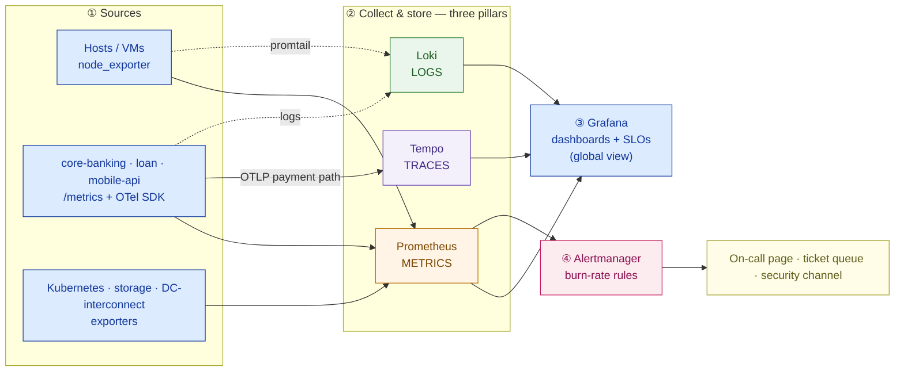

# Observability + Security Design — Garuda Finance (worked example)

> This is `template-observability-security-design.md` filled in for a fictional customer. It shows what "good" looks like: the pipeline plus SLOs that make the platform *operable*, and a control matrix that makes it *auditable* to OJK. It is the operability-and-compliance chapter of the Capstone B private-cloud proposal.

**Customer:** Garuda Finance (fictional)  ·  **Industry / regulator:** Financial services · **OJK** + Bank Indonesia (BI)
**Prepared by:** SA — Presales  ·  **Date:** 2026-07-04  ·  **Opportunity:** In-country private cloud (Capstone B)  ·  **Version:** v0.2

**Company shape:** ~600 branches · ~8M customers · core banking + loan origination + mobile app, ~4,000 txns/min peak · **2 DCs (Jakarta primary, Surabaya DR)** · 24/7 payments uptime · **on-prem, in-country** private cloud.
**Non-negotiables (verbatim):** OJK requires **strong security controls + audit trails + reporting**; telemetry and audit data must **stay in-country**.

---

## Part A — Observability

### A1. The signal pipeline



**Deployment:** one stack **per DC** (Jakarta + Surabaya) so telemetry survives a DC loss and never leaves the country; both federate into a single Grafana for the global view.

```
        JAKARTA DC (primary)                          SURABAYA DC (DR / warm)
  ┌─────────────────────────────────┐          ┌─────────────────────────────────┐
  │ EDGE zone   WAF · LB · TLS/mTLS  │          │ EDGE zone   (warm standby)      │
  │ APP  zone   mobile-api · loan    │          │ APP  zone   replicated          │
  │ CORE zone   core-banking · DB    │          │ CORE zone   replicated          │
  │ MGMT zone   Vault · obs stack    │◀──fed──▶ │ MGMT zone   Vault · obs stack   │
  │   Prometheus · Loki · Tempo      │          │   Prometheus · Loki · Tempo     │
  └───────────────┬─────────────────┘          └────────────────┬────────────────┘
                  └───────────── Grafana (single global view) ───┘
   zones separated by microsegmentation (2.3) · audit logs shipped to a WORM store
   all telemetry stays in-country — no SaaS backend crosses the border (OJK residency)
```

### A2. What we collect (the three pillars)

| Pillar | What / where | Tool | Retention | Notes |
|---|---|---|---|---|
| Metrics | node_exporter on all hosts; /metrics on core-banking, loan, mobile-api; K8s/storage/interconnect exporters | Prometheus (per DC) | 15d local + long-term to durable storage | 15s scrape |
| Logs | app + system logs, labeled by service / DC / zone | Loki | per OJK-defined term (see B3) | promtail agents |
| Traces | payment path: mobile-api → auth → core-banking → ledger | Tempo + OpenTelemetry | sampled (errors + slow) | OTLP export |

### A3. Top SLOs (proposed — business to confirm)

| Service | SLI | Proposed SLO (30-day) | Error budget | Rationale |
|---|---|---|---|---|
| Payments | Success rate | **99.9%** | ~43 min/mo · ≈**4 failed txn/min** at 4,000/min peak | 24/7 payments cannot go dark; below this, customers feel declines |
| Payments | Latency (p99) | **≤ 800 ms** end-to-end | — | Mobile users abandon a slow pay; measured on the traced path |
| Mobile app | Availability | **99.9%** | ~43 min/mo | Primary channel for 8M customers |
| Core-banking API | Availability | **99.95%** | ~22 min/mo | Shared by branches + app; stricter than the front end |

*Assumptions to confirm:* "success" = HTTP 2xx + business-ACK from the ledger; "available" measured from a synthetic probe in each DC; window = rolling 30 days.

### A4. Alert routing

| Condition | Signal | Action | Routes to |
|---|---|---|---|
| Payments success burning ≈2% budget / 1h (2-window) | SLO symptom | **Page** | Payments on-call |
| Payments/app budget ≈5% / 6h | SLO symptom | **Ticket** | Ops queue |
| Node down · disk 80% · scrape fail | infra cause | Dashboard + ticket | Ops queue |
| Falco runtime anomaly · burst of failed logins | security | **Page + fork** | Security channel |

*Every alert links a runbook; a page means "act now," a ticket means "business hours."*

---

## Part B — Infrastructure Security

### B1. Control × OJK-obligation × tool matrix (the examiner's page)

| # | Security control | OJK / BI expectation | Implemented by | Owner |
|---|---|---|---|---|
| 1 | Identity & access (IAM/RBAC) | least privilege · named accounts · segregation of duties | Keycloak/LDAP SSO + Kubernetes RBAC per role | Platform + Security |
| 2 | Encryption in transit | protect customer/txn data in motion | TLS 1.2+ / **mTLS** between all services | Platform |
| 3 | Encryption at rest | protect stored customer & txn data | volume/disk encryption for DBs + backups, keys in HSM | Storage + Security |
| 4 | Secrets management | no plaintext credentials · rotation | **HashiCorp Vault** — dynamic, leased DB/API creds | Platform |
| 5 | Host / OS hardening | secure, known baseline | **CIS Benchmarks** + config management | Platform |
| 6 | Network segmentation | isolate payment & customer zones | microsegmentation (edge/app/core/mgmt) — recap 2.3 | Network |
| 7 | Image vulnerability mgmt | no known-vulnerable software ships | **Trivy** gate in CI + registry (2.4) | DevSecOps |
| 8 | Runtime threat detection | detect anomalies while running | **Falco** syscall/behavior alerts | Security |
| 9 | Policy enforcement | block non-compliant workloads at deploy | **Kyverno** admission (no root, no `:latest`, limits set) | Platform |
| 10 | Audit trail | who did what, when — tamper-evident | **immutable/WORM** store of privileged actions | Security |
| 11 | Log retention & reporting | keep records for the mandated term | Loki + object storage + retention policy | Security + Ops |

### B2. Control-to-obligation map (ASCII)

```
 SECURITY CONTROL              WHAT OJK / BI EXPECTS                     IMPLEMENTED BY
 ────────────────────────────────────────────────────────────────────────────────────────
 Identity & access (RBAC)      least privilege · named · SoD             Keycloak/LDAP + K8s RBAC
 Encryption in transit         protect data in motion                    TLS 1.2+ / mTLS everywhere
 Encryption at rest            protect stored customer & txn data        disk enc + HSM-held keys
 Secrets management            no plaintext creds · rotation             HashiCorp Vault (dynamic)
 Host / OS hardening           secure known baseline                     CIS Benchmarks + config mgmt
 Network segmentation          isolate payment & customer zones          microsegmentation (2.3)
 Image vulnerability mgmt      no vulnerable software ships              Trivy (CI + registry gate)
 Runtime threat detection      catch anomalies in run                    Falco
 Policy enforcement            block non-compliant deploys               Kyverno (admission)
 Audit trail                   who/what/when · tamper-evident            immutable/WORM store
 Log retention & reporting     mandated retention term                   Loki + object storage
```

### B3. Audit trail & retention

- **Privileged actions logged:** kubectl/API calls, Vault secret reads, DB admin actions, config/policy changes, all interactive logins, failover triggers.
- **Immutability:** append-only object storage with **object-lock (WORM)**; hashes chained so any tampering is detectable.
- **Retention term:** set to the **OJK/BI-mandated period** — *this is a policy input; confirm the exact term with Garuda's compliance team before finalizing* (do not hard-code a guessed number).
- **Reporting:** examiner-ready queries in Grafana/Loki over the audit store; Security produces the periodic access-and-incident report OJK requires.

---

## Part C — Findings & so-what

| # | Finding | Half | Implication | Severity |
|---|---|---|---|---|
| 1 | Go-live stack had logs only — no metrics/traces | Observability | Could see "slow" but not the falling success rate or *where* the 1.9s went; add all three pillars | **High** |
| 2 | App credentials in a ConfigMap | Security | Direct OJK audit finding; move to Vault dynamic secrets | **High** |
| 3 | A SaaS observability trial sent telemetry off-shore | Both | **Data-residency breach** — disqualified; self-host in-country | **High** |
| 4 | Alerts paged on every CPU spike (noise) | Observability | On-call ignored the one that mattered; switch to SLO burn-rate paging | Medium |
| 5 | No immutable audit store / undefined retention | Security | Cannot answer "who accessed the customer DB last quarter"; add WORM store + retention policy | **High** |

**One-line design statement:**
> Garuda's platform is made **operable** by a per-DC three-pillar observability stack (Prometheus/Loki/Tempo → Grafana) with **four confirmed SLOs** and burn-rate alerting, and made **auditable** by **eleven security controls** each mapped to an OJK/BI obligation and an implementing tool — with **all telemetry and audit records kept in-country**, which alone disqualifies SaaS monitoring.

**So what (the pivot this design buys you):** it turns "we built you a private cloud" into "we built you one you can **run 24/7 and defend to OJK on day one**" — observability that finds the fault before customers do, and a control matrix an examiner can walk top-to-bottom. This is the final Phase-2 input to **Capstone B**: it sits on top of the compute/storage/network/K8s/HA-DR design and makes the whole platform a system you can operate and audit, not just stand up.
