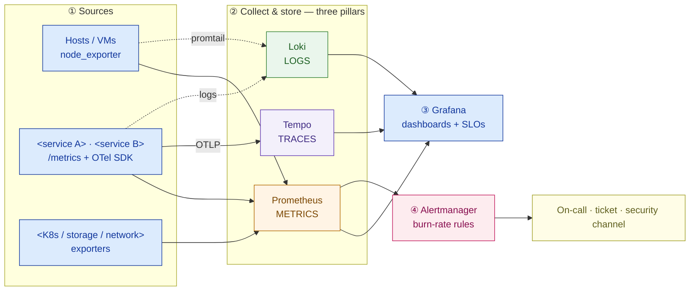

# Observability + Security Design — Template

> Fill this in once the platform architecture (compute, storage, network, containers, K8s, HA/DR) exists. It is the operability-and-compliance chapter of an infrastructure proposal: it shows *how you will see the platform run* and *how each control answers a named regulatory obligation*. An executive should read the diagrams and the compliance matrix; an engineer should trust the SLO and alert tables.

**Customer:** `<company>`  ·  **Industry / regulator:** `<industry — e.g. banking / OJK · BI>`  ·  **Prepared by:** `<SA name>`  ·  **Date:** `<YYYY-MM-DD>`
**Engagement / opportunity:** `<deal or project name>`  ·  **Platform:** `<on-prem / private cloud / hybrid>`  ·  **Version:** `<v0.1 draft>`

---

## How to use this template

Two halves, both first-class architecture — do not treat either as an add-on.

1. **Observability** — instrument the three pillars, define the top SLOs, route alerts on error-budget burn.
2. **Security** — design the control families and **map each to a compliance obligation and the tool that implements it**.

Legend: **SLI** = a measured indicator · **SLO** = its target over a window · **error budget** = `1 − SLO` · **WORM** = write-once/tamper-evident storage · **mTLS** = mutual TLS.

---

## Part A — Observability

### A1. The signal pipeline (Mermaid skeleton)

> Replace the source and store nodes. Keep sources left, the three pillars center, one Grafana + alert routing right. Delete rows you don't need.



### A2. What we collect (the three pillars)

| Pillar | What / where | Tool | Retention | Notes |
|---|---|---|---|---|
| Metrics | `<hosts, services, infra exporters>` | Prometheus | `<short local + long-term>` | scrape interval `<15s>` |
| Logs | `<app + system logs, labels>` | Loki | `<retention term>` | ship via promtail |
| Traces | `<critical request path>` | Tempo + OpenTelemetry | `<sampled>` | sample on error/slow |

### A3. Top SLOs (propose targets; the business confirms)

> Pick indicators a user would actually feel. State the measurement definition. Never a magic number without rationale.

| Service | SLI | Proposed SLO (window) | Error budget | Rationale |
|---|---|---|---|---|
| `<service>` | `<success rate>` | `<99.9% / 30d>` | `<~43 min/mo>` | `<why>` |
| `<service>` | `<p99 latency>` | `<≤ Xms>` | — | `<why>` |
| `<service>` | `<availability>` | `<99.9x%>` | `<~N min/mo>` | `<why>` |

*Assumptions to confirm:* `<what counts as success/available, from where, over what window>`.

### A4. Alert routing (page only on burn)

| Condition | Signal | Action | Routes to |
|---|---|---|---|
| Fast burn (≈2% budget / 1h) | SLO symptom | **Page** | `<on-call tool>` |
| Slow burn (≈5% / 6h) | SLO symptom | **Ticket** | `<queue>` |
| Cause alert (node down, disk 80%, scrape fail) | infra | Dashboard + ticket | `<queue>` |
| Security event (runtime/anomaly, failed logins) | security | **Page + fork** | `<security channel>` |

*Rule:* every alert is **actionable, urgent, and links a runbook** — or it is noise.

---

## Part B — Infrastructure Security

### B1. Control × compliance × tool matrix (the examiner's page)

> The core deliverable. Rewrite the "compliance requirement" column for the customer's actual regulator.

| # | Security control | Compliance requirement (`<regulator>`) | Implemented by (tool) | Owner |
|---|---|---|---|---|
| 1 | Identity & access (IAM/RBAC) | least privilege · named accounts · SoD | `<SSO/LDAP + K8s RBAC>` | `<team>` |
| 2 | Encryption in transit | protect data in motion | `<TLS 1.2+ / mTLS>` | |
| 3 | Encryption at rest | protect stored sensitive data | `<disk/volume enc + KMS/HSM>` | |
| 4 | Secrets management | no plaintext creds · rotation | `<Vault — dynamic secrets>` | |
| 5 | Host / OS hardening | secure known baseline | `<CIS Benchmarks + config mgmt>` | |
| 6 | Network segmentation | isolate sensitive zones | `<microsegmentation>` | |
| 7 | Image vulnerability mgmt | no known-vulnerable software | `<Trivy in CI + registry gate>` | |
| 8 | Runtime threat detection | detect anomalies at runtime | `<Falco>` | |
| 9 | Policy enforcement | block non-compliant workloads | `<Kyverno / OPA-Gatekeeper>` | |
| 10 | Audit trail | who did what, when — tamper-evident | `<immutable/WORM store>` | |
| 11 | Log retention & reporting | keep records for mandated term | `<Loki + object store + policy>` | |

### B2. Control-to-obligation map (ASCII, for docs/email)

```
 SECURITY CONTROL              WHAT THE REGULATOR EXPECTS                IMPLEMENTED BY
 ────────────────────────────────────────────────────────────────────────────────────────
 Identity & access (RBAC)      <least privilege · SoD>                   <SSO/LDAP + K8s RBAC>
 Encryption in transit         <protect data in motion>                  <TLS 1.2+ / mTLS>
 Encryption at rest            <protect stored data>                     <disk enc + KMS/HSM>
 Secrets management            <no plaintext creds · rotation>           <Vault (dynamic)>
 Host / OS hardening           <secure baseline>                         <CIS Benchmarks>
 Network segmentation          <isolate sensitive zones>                 <microsegmentation>
 Image vulnerability mgmt      <no vulnerable software ships>            <Trivy (CI + registry)>
 Runtime threat detection      <catch anomalies in run>                  <Falco>
 Policy enforcement            <block non-compliant deploys>             <Kyverno / OPA>
 Audit trail                   <who/what/when · tamper-evident>          <immutable/WORM store>
 Log retention & reporting     <mandated retention term>                 <Loki + object storage>
```

### B3. Audit trail & retention (call it out explicitly)

- **What is logged as privileged action:** `<kubectl, Vault reads, DB admin, config changes, logins>`
- **Immutability:** `<WORM / append-only / object-lock — how tamper-evidence is guaranteed>`
- **Retention term:** `<set to the regulator-defined period — record the assumption; confirm with compliance>`
- **Reporting:** `<how the examiner queries it; who produces the periodic report>`

---

## Part C — Findings & so-what

| # | Finding | Half | Implication | Severity |
|---|---|---|---|---|
| 1 | `<e.g. no traces on the critical path>` | Observability | `<can see "slow" but not "where">` | `<H/M/L>` |
| 2 | `<e.g. secrets in ConfigMaps>` | Security | `<audit finding; move to Vault>` | `<…>` |
| 3 | `<e.g. SaaS telemetry crosses border>` | Both | `<residency breach; self-host>` | `<…>` |

**One-line design statement (fill in):**
> The platform is made **operable** by a three-pillar observability stack with `<n>` confirmed SLOs and burn-rate alerting, and made **auditable** by `<n>` security controls each mapped to a `<regulator>` obligation and an implementing tool — telemetry and audit records staying `<in-country / as required>`.

---

*Worked example: see `example-garuda-finance-obs-security.md` in this folder.*
