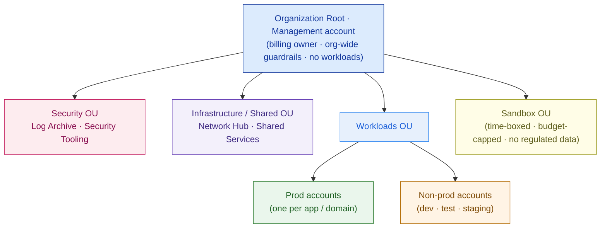
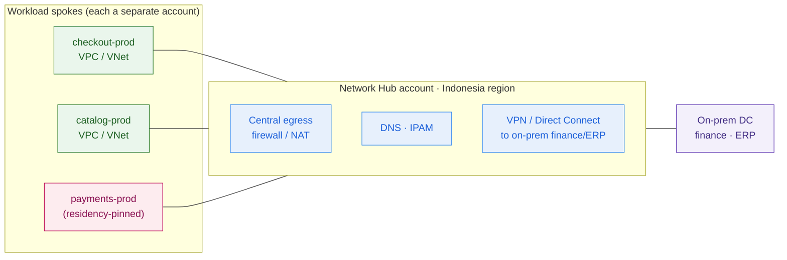

# Cloud Foundations & Landing Zones

> A landing zone is the pre-governed foundation every workload lands into. Build the runway, the control tower, and the customs desk *before* the first plane — or every team paves its own strip, and cost, security, and residency stop being incidents you fix and become the structure you're stuck with.

**Type:** Design
**Track:** AI, Data & Infrastructure Solution Architect (Presales)
**Prerequisites:** Phase 2 (Infrastructure Architecture)
**Time:** ~4h
**Lab:** —
**Ship It:** Landing-zone design

## The Problem

You are the cloud SA on **PasarKita** — a fast-growing Indonesian e-commerce marketplace: ~15 million active buyers, ~200,000 sellers, ~2 million orders a day, with flash-sale events (12.12 and the like) spiking ~10× for a few hours. Today it runs a checkout/catalog monolith plus some microservices on a **single public cloud**, alongside an aging on-prem data center that still runs finance and ERP. The platform team standardized on containers and Kubernetes and is nervous about vendor lock-in. And the CFO's number-one issue, stated in the kickoff, is that the cloud bill is overrunning and nobody can say *why*. You're tempted to open with the obvious win: a cost-optimization pass — rightsizing, reserved capacity, delete the idle stuff — and quote a saving by Friday.

Do that and you hit a wall, because the bill isn't the disease; it's the symptom. When you ask "which team owns this spend?" the answer is *everything is in one account*. There are no boundaries, so there's nothing to attribute cost to, nothing to scope a budget to, and nothing to hang a policy on. A developer spun up a managed database holding **payment data in a Singapore region** — a residency violation that nobody caught, because nothing *prevents* it. The flash-sale team over-provisioned for 12.12 and never tore it down, and no alarm fired because no account has a budget. The security team wants to enforce encryption and block public buckets, but in a flat account it's all-or-nothing: every guardrail they add breaks someone. Your tidy cost project quietly turns into "please re-architect our entire cloud tenancy," which you did not scope and did not price.

And then the compliance review lands the finishing blow. PasarKita handles payments, so **payment and cardholder data must stay in Indonesia** — Bank Indonesia's payment-system rules and Indonesia's Personal Data Protection Law (UU PDP) both point in-country. The auditor asks one question: *"How do you prevent any workload, in any team, from storing payment data outside Indonesia?"* In a single ungoverned account the honest answer is "we ask people nicely," and that fails the review. Every problem in the room — runaway cost, the residency breach, the security holes, the vendor-lock-in fear that wants portability — is **structural**: it comes from having no governed foundation. This lesson is where you design that foundation. Not by clicking around a console, but by drawing the **landing zone**: the organization hierarchy, the account boundaries, the identity model, the network baseline, and the guardrails that every future workload inherits *on the way in*, so cost, security, and residency are decided once, by design, instead of a thousand times, by accident.

## The Concept

A cloud tenant is not "a big account you deploy into." It's an **operating model**: who owns the governed foundation, who lands workloads on it, and what rules every workload inherits automatically. An architect designs and defends that foundation — the **landing zone** — and never touches a deploy button. Six ideas cover it.

### 1. The cloud operating model — paved road, not free-for-all

The single shift that separates a governed estate from a bill nobody understands: **stop treating the cloud as self-service infrastructure and start treating it as a product the platform team ships to app teams.** The platform team builds and owns the *paved road* — accounts, identity, network, guardrails, logging, pipelines. App teams get a pre-approved account that already meets security and residency requirements, and they deploy *onto* it. The paved road is the landing zone.

```
   FREE-FOR-ALL (what PasarKita has)          PAVED ROAD (a landing zone)
   ─────────────────────────────────          ────────────────────────────────────
   every team clicks in one account     →     platform team ships governed accounts
   guardrails added after the fact      →     guardrails inherited on the way in
   cost/residency/security = incidents  →     cost/residency/security = structure
   "please don't do X"                  →     "you cannot do X" (enforced)
```

The landing zone is the pre-governed foundation a workload *lands into*. Everything below is what's on that foundation before any app arrives.

### 2. The organization hierarchy — the account is your blast radius, your bill, and your policy anchor

Every cloud gives you a tree: an **organization root** at the top, grouping containers in the middle (**Organizational Units** on AWS, **management groups** on Azure, **folders** on GCP), and the unit of isolation at the leaves — the **account** (AWS), **subscription** (Azure), or **project** (GCP). The account/subscription/project is the most important boundary you own, because it is simultaneously:

- a **blast radius** — a compromise, a runaway script, or a misconfiguration is contained inside it;
- a **billing boundary** — cost rolls up per account, so separate accounts give you cost attribution for free;
- a **policy anchor** — guardrails attach to the hierarchy and *inherit downward*, so a rule set on an OU applies to every account beneath it;
- a **quota boundary** — service limits are per-account, so one noisy workload can't starve another.



The management account at the top holds *no workloads* — it owns billing and org-wide policy, and you keep it clean because it's the one account you can't afford to lose. Everything real lives in an account further down, grouped by an OU whose policies it inherits.

### 3. The landing-zone components — the seven things every landing zone has

Whatever the cloud, a landing zone assembles the same seven building blocks. Name them and you can audit any customer's foundation on a whiteboard:

| # | Component | What it does | PasarKita implementation (provider-neutral) |
|---|---|---|---|
| 1 | **Identity & SSO** | One place people and workloads authenticate; no per-account logins | Federate the corporate IdP (Entra ID / Okta) → cloud SSO; roles, not long-lived keys |
| 2 | **Network baseline** | A standard, segmented network every account plugs into | **Hub-spoke**: shared hub for egress/DNS/on-prem link, one spoke per workload |
| 3 | **Guardrails / policy** | Preventive + detective rules inherited by every account | Deny leaving Indonesia regions; require encryption; block public storage |
| 4 | **Centralized logging & audit** | Immutable, org-wide record of who did what | All accounts ship logs to a locked **Log Archive** account |
| 5 | **Billing & cost management** | Cost visible and attributable per team/account | Consolidated billing + mandatory tags → showback per team |
| 6 | **Shared services** | Common plumbing built once, consumed by all | CI/CD, container registry, IP address management, DNS |
| 7 | **IaC pipeline** | The landing zone is *code*, versioned and repeatable | Terraform/pipeline provisions accounts + guardrails, not console clicks |

Miss any one of these and you have a gap a review will find: no #3 and residency is unenforced; no #4 and the auditor has nothing to inspect; no #5 and the CFO's problem never goes away.

### 4. Multi-account strategy — and *why* separate, not one big account

The instinct of a team new to cloud is one account, "to keep it simple." That instinct is the root of PasarKita's mess. **Separation is the feature.** A workable baseline splits accounts by purpose *and* by environment:

```
   ┌──────────────────── GUARDRAIL LAYERS (each layer governs everything beneath it) ─────────────────┐
   │  ORG-ROOT POLICY   deny leaving approved (in-country) regions · deny disabling logging · protect  │
   │                    the org's root / break-glass identities                                        │
   │  OU POLICY         Workloads OU: encryption-at-rest required · public object storage blocked      │
   │  ACCOUNT POLICY    per-account budget + alarm · tag policy enforced · service quotas              │
   └───────────────────────────────────────────────────────────────────────────────────────────────────┘
   ORG ROOT (management / billing — no workloads)
   ├── Security OU         ── Log Archive (immutable)  ·  Security Tooling (SIEM · scanning)
   ├── Infrastructure OU   ── Network Hub (egress · DNS · on-prem link)  ·  Shared Services (CI/CD · registry)
   ├── Workloads OU
   │   ├── Prod            ── checkout-prod · catalog-prod · payments-prod  (residency-pinned)
   │   └── Non-prod        ── checkout-dev · catalog-test · staging
   └── Sandbox OU          ── time-boxed · budget-capped · NO payment / regulated data
```

The contrast that makes the case in a room — the same questions the CFO and the auditor ask, answered by each model:

| The question they ask | One big account (PasarKita today) | Multi-account landing zone |
|---|---|---|
| "Which team spent this?" | Guess from tags, if any exist | Rolls up per account — answered by construction |
| "Contain a breach to one workload" | Impossible — one shared blast radius | Bounded to the compromised account |
| "Prove payment data stays in-country" | "We ask people nicely" | Preventive guardrail on the pinned account |
| "Give a team admin safely" | God-mode over everyone's resources | Admin *in their own account only* |
| "Stop a flash-sale spike starving others" | Shared quotas — one workload can exhaust them | Per-account quota isolation |

Why pay the overhead of many accounts? Because each separation buys something a flat account cannot:

- **Blast radius** — a breach or a bad deploy in `catalog-dev` cannot touch `payments-prod`.
- **Least privilege** — a team gets admin *in their own account*, not god-mode over everyone's.
- **Cost attribution** — the CFO's problem dissolves: spend rolls up per account, so "who spent this?" has an answer.
- **Compliance scoping** — the residency and audit rules that matter for payments apply to the accounts that hold payment data, not to the whole estate, so the auditor's scope is small and provable.
- **Quota isolation** — a flash-sale spike in one account can't exhaust another's limits.

The **Security OU** (Log Archive + Security Tooling) is deliberately separate and locked so that even an account admin can't delete their own audit trail. The **Sandbox OU** exists so experimentation has somewhere safe to happen — budget-capped, torn down on a timer, and forbidden from touching regulated data.

### 5. Guardrails — preventive vs detective, and the residency pin

A guardrail is a rule the landing zone enforces so a workload *can't* drift out of compliance. Two flavors, and you need both:

- **Preventive** — the action is *denied* before it happens. Implemented as a policy that overrides even an admin: AWS **Service Control Policies (SCPs)**, **Azure Policy** (deny effect), GCP **Organization Policy**. This is how you make residency real: *deny creating or storing resources in any region outside Indonesia.* A developer who tries to launch that Singapore database gets an access-denied, not a warning.
- **Detective** — the action is *allowed but flagged* for remediation: config rules and security-posture tools (AWS Config, Azure Policy audit, GCP Security Command Center) that continuously check "is anything non-compliant?" and raise it.

The architect's rule: **make the non-negotiables preventive, and the best-practices detective.** Residency and "never disable logging" are preventive — the review demands they be impossible to violate. "Prefer this instance family" is detective — a nudge, not a wall. Both are written as **policy-as-code**, versioned alongside the rest of the landing zone, so a control is reviewable, testable, and identical across every account.

### 6. IaC as the delivery mechanism, Well-Architected as the design lens

Two ideas make the landing zone durable rather than a one-time cleanup:

- **Infrastructure-as-Code is how you deliver it.** The whole foundation — accounts, OUs, guardrails, network, logging — is defined in **Terraform** (portable across clouds) or a native tool (CloudFormation/Control Tower, Bicep/Azure ALZ, GCP Cloud Foundation Toolkit). Codifying it means a new account is *vended* pre-governed in minutes, the config is diff-able in review, and the same landing zone can be reproduced in a second region or a second cloud — which is exactly the portability PasarKita's lock-in fear is asking for.
- **The Well-Architected pillars are the lens you review it through.** Every major cloud publishes the same six-pillar framework — **Operational Excellence, Security, Reliability, Performance Efficiency, Cost Optimization, Sustainability**. You don't recite it; you use it as the checklist a landing-zone decision satisfies (e.g., "separate accounts" scores Security *and* Cost Optimization *and* Operational Excellence). It's the vocabulary that lets you defend a design to the customer's architecture board.

Put the six ideas together and the landing zone is one sentence: *a hierarchy of blast-radius-isolated accounts, wired to a shared network and identity, governed by inherited guardrails, watched by centralized logging, attributed by tagging, and delivered as code.*

## Design It

Deliverable: a **Landing-Zone Design** for PasarKita's cloud foundation — provider-neutral in structure, but naming the implementations. Work it as six decisions; the artifact is the org tree plus the guardrail and network baseline. It stays deliberately provider-neutral because Capstone C takes PasarKita hybrid/multi-cloud, and the *same* structure has to project onto whichever cloud each workload lands in.

### Step 1 — Draw the organization hierarchy

Start at the top, not with a workload. One **management account** (billing + org-wide policy, no workloads), then four OUs: **Security**, **Infrastructure/Shared**, **Workloads** (split into Prod and Non-prod), and **Sandbox**. Rationale to write down: policy inherits down the tree, so grouping accounts by purpose lets you set the residency and logging guardrails *once*, at the OU or root, and have every account beneath obey them. This is the tree from Concept §2 and §4 — it is the spine of the whole design.

### Step 2 — Separate the accounts by purpose and environment

Vend one account per workload-domain-per-environment, not one big shared account. PasarKita's checkout, catalog, and payments each get **prod** and **non-prod** accounts; `payments-prod` is flagged **residency-pinned**. Security gets its **Log Archive** and **Security Tooling** accounts; Infrastructure gets the **Network Hub** and **Shared Services** accounts. The decision to defend: the CFO's cost problem is *solved structurally here* — spend now rolls up per account, so showback per team is automatic, and a flash-sale over-provision shows up against a named budget instead of hiding in one giant invoice.

### Step 3 — Federate identity, kill the long-lived keys

No per-account human logins. Federate PasarKita's corporate identity provider (Entra ID or Okta) into cloud SSO, and grant access through **roles assumed on demand**, scoped per account and per environment — a `catalog-dev` developer never holds credentials into `payments-prod`. Workload-to-workload auth uses short-lived workload identities, not static access keys (the kind that leaked the Singapore database into existence). State the principle: **identity is the new perimeter** — every account boundary is also an authentication and authorization decision, and least privilege is enforced by *which role in which account*, not by hope.

### Step 4 — Lay the network baseline (hub-spoke) and land residency in-country

Give every account a standard network shape: a **hub-spoke** topology. A shared **Network Hub** (in the Infrastructure OU) owns centralized egress, DNS, IP address management, and the **VPN / Direct Connect link back to the on-prem finance/ERP DC** — the hybrid seam PasarKita needs. Each workload account is a **spoke** with a **non-overlapping** address range (overlap breaks routing and any future DR or multi-cloud peering — the same rule from Phase 2). Crucially, every spoke and the hub are pinned to **Indonesia regions**, so the network baseline itself carries residency.



### Step 5 — Write the guardrails, make residency preventive

Now the rules every account inherits (Concept §5). Split them:

- **Preventive (org-root, cannot be overridden):** deny creating or storing resources in any region outside Indonesia (the residency pin — an access-denied, not a warning); deny disabling or deleting the central logging; protect the break-glass root identities.
- **Preventive (Workloads OU):** encryption-at-rest required; public object storage blocked; only approved services enabled.
- **Detective (org-wide):** continuous posture checks flag drift — an unencrypted volume, an over-permissive role, an untagged resource — and route it to the Security Tooling account.

The line to say in the review: *"the residency requirement is not a policy document, it is a preventive control — a workload physically cannot place payment data outside Indonesia."* That sentence is what turns a failed audit into a passed one.

### Step 6 — Centralize logging/audit and lay the cost/tagging foundation

Two foundations that make the estate governable:

- **Logging & audit:** every account streams API/audit logs, config history, and network flow logs to the **immutable Log Archive** account in the Security OU — write-once, deletable by no one, so there's always a trustworthy record for an auditor or an incident.
- **Cost & tagging:** enforce a **mandatory tag policy** (`team`, `environment`, `cost-center`, `data-class`) so every resource is attributable, and set a **per-account budget with alarms**. This is the FinOps starting line: you can't optimize what you can't see, and now the CFO can see spend by team, by environment, and by workload.

Put the six steps together and the landing zone falls out as one governed foundation:

```
                        ┌──────────────── IDENTITY & SSO (spans every account) ────────────────┐
   CROSS-CUTTING ─────▶ │  corporate IdP (Entra/Okta) → cloud SSO · roles assumed per account   │
                        │  no long-lived keys · least privilege by which-role-in-which-account   │
                        └───────────────────────────────────────────────────────────────────────┘
   GUARDRAILS (inherited top-down · preventive + detective)
   ├─ ORG ROOT: deny non-Indonesia regions (RESIDENCY) · deny disabling logging · protect root
   ├─ WORKLOADS OU: encryption required · public storage blocked · approved services only
   └─ ACCOUNT: budget + alarm · mandatory tags (team / env / cost-center / data-class)

   ORG ROOT (management / billing — no workloads)
   │
   ├── SECURITY OU
   │     ├── Log Archive account         (immutable audit store — all logs land here)
   │     └── Security Tooling account     (posture checks · SIEM · scanning)
   │
   ├── INFRASTRUCTURE / SHARED OU
   │     ├── Network Hub account          (egress · DNS · IPAM · VPN/DX ──▶ on-prem finance/ERP)
   │     └── Shared Services account       (CI/CD · container registry · IaC pipeline)
   │
   ├── WORKLOADS OU
   │     ├── PROD:     checkout-prod · catalog-prod · payments-prod (RESIDENCY-PINNED)
   │     └── NON-PROD: checkout-dev · catalog-test · staging
   │
   └── SANDBOX OU                          (time-boxed · budget-capped · NO regulated data)

   NETWORK: hub-spoke — shared hub (Indonesia region) · one non-overlapping spoke per workload
   DELIVERY: the entire tree above is Terraform / IaC — accounts are vended pre-governed, in minutes
```

Same cloud, completely different posture. Instead of "one account and a cost problem," PasarKita now has a foundation where cost is attributable, residency is *impossible* to violate, blast radius is contained, and a new team gets a pre-governed account instead of a blank, dangerous canvas. That is a landing-zone design you can put in front of the CFO, the CISO, and the auditor in the same meeting.

## Compare It

The three hyperscalers ship the same idea under three names, and knowing which is which lets you meet a customer on their own cloud.

| | **AWS** | **Azure** | **GCP** |
|---|---|---|---|
| Hierarchy | Organizations → **OUs** → **accounts** | Management groups → **subscriptions** | Org → **folders** → **projects** |
| Turnkey landing zone | **Control Tower** + Landing Zone Accelerator | **Azure Landing Zones** (part of the Cloud Adoption Framework) | **Cloud Foundation Toolkit** / Security Foundations blueprint |
| Preventive guardrail | **Service Control Policies (SCPs)** | **Azure Policy** (deny effect) | **Organization Policy** constraints |
| Identity | IAM Identity Center (SSO) | Entra ID (native) | Cloud Identity / IAM |
| Residency control | SCP denying non-approved regions | Azure Policy allowed-locations; sovereignty landing zones | Org Policy resource-location constraint; **Assured Workloads** |
| IaC | CloudFormation / Control Tower / Terraform | Bicep / ARM / Terraform | Deployment Manager / Terraform |

The structures are near-identical — an org root, grouping containers, isolated leaf accounts, inherited policy, a shared network, centralized logging. That sameness is the SA's leverage: **design the landing zone provider-neutral, then project it onto whichever cloud.** For PasarKita's multi-cloud ambition it's decisive — you keep one conceptual foundation and one policy-as-code layer (Terraform + a cross-cloud policy engine like **Open Policy Agent**), and render it per cloud, so a guardrail like "stay in Indonesia" is written once and enforced everywhere.

**Centralized vs decentralized governance** is the "it depends" a customer will push on. Centralized means the platform team owns all guardrails, networking, and account vending — maximum consistency and compliance, but the platform team can become a bottleneck. Decentralized (federated) means teams self-serve within broad guardrails — maximum speed, but drift and cost creep unless the guardrails are tight. The mature answer is **centralized guardrails, decentralized workloads**: the platform team owns the *non-negotiables* (residency, logging, identity, the network baseline) as preventive controls, and app teams move fast *inside* those walls. For PasarKita, a regulated payments business with a cost problem, you lean centralized on the controls that appear in an audit and decentralized on everything else.

**Build vs adopt-a-framework** is the last fork. You *can* hand-roll a landing zone in raw Terraform, and for a tiny estate that's fine. But every hyperscaler now ships an opinionated accelerator (Control Tower, Azure Landing Zones, GCP blueprints) that encodes years of hard-won defaults. Reach for the framework when the customer wants speed, auditability, and vendor-supported assurance — which a regulated marketplace does — and reach for hand-rolled only when a hard requirement (deep multi-cloud portability, an unusual compliance regime) outgrows the accelerator. The honest recommendation for PasarKita: **adopt the framework per cloud, wrap it in your own Terraform + policy-as-code layer so the multi-cloud story stays portable**, and never start from a blank account.

## Ship It

This lesson ships a reusable **Landing-Zone Design** — the foundation deliverable every later cloud artifact (reference architectures, migration plan, FinOps model, Capstone C) builds on. Both files live in [`outputs/`](../outputs/):

- **[`template-landing-zone-design.md`](../outputs/template-landing-zone-design.md)** — a fill-in-the-blank template that walks *organization hierarchy → accounts → identity → network baseline → guardrails → logging/audit → cost/tagging*, with a Mermaid org-tree skeleton, an ASCII landing-zone skeleton, a decisions-and-rationale table, and a **must-label checklist** every landing-zone diagram has to pass (hierarchy, account separation, identity/SSO, hub-spoke, preventive residency guardrail, centralized logging, tagging/budget, IaC delivery).
- **[`example-pasarkita-landing-zone.md`](../outputs/example-pasarkita-landing-zone.md)** — the template fully worked for PasarKita, so the skeleton isn't abstract: the residency pin is a preventive control, cost is attributable per account, and the on-prem seam is drawn — the artifact you'd attach to the cloud-foundation proposal.

The point of shipping this first, before any AWS/Azure/GCP reference architecture: a landing-zone design that the CFO, the CISO, and the auditor can all read is the cheapest structural fix you'll ever sell. It says *we governed the foundation before we let anything land on it* — and it is the base every workload in **Capstone C (Hybrid Cloud Enterprise Architecture)** deploys onto.

## Exercises

1. **(Easy)** PasarKita's platform lead argues that separate accounts are "too much overhead — let's keep one account with tags to tell teams apart." In one paragraph, rebut this using the four things a separate account gives you that a tag cannot (blast radius, least privilege, cost/quota isolation, compliance scoping), and name the *one* PasarKita requirement (hint: residency) that a tag can never enforce but an account boundary + preventive guardrail can.
2. **(Medium)** Re-design the landing-zone hierarchy for a *different* customer: a **mid-size Indonesian hospital group** moving to cloud with an EHR and a patient portal. List the OUs and accounts you'd create, name the regulated data class that is your "payment data" equivalent, and write the single **preventive** guardrail you'd set at the org root and why. Use `outputs/template-landing-zone-design.md` and tick its checklist.
3. **(Hard)** PasarKita commits to **multi-cloud** for portability (Capstone C). Extend your landing-zone design to a *second* cloud: explain how the org hierarchy, identity, and guardrails project onto the second provider's model (folders/projects or management groups/subscriptions), how you keep the **residency guardrail** identical across both clouds with one policy-as-code layer, and one thing that does *not* port cleanly and must be designed per cloud. Half a page; save it beside your worked example — you'll reuse this reasoning in the hybrid/multi-cloud lesson (3.6) and Capstone C.

## Key Terms

| Term | What people say | What it actually means |
|------|-----------------|------------------------|
| Landing zone | "The cloud setup" | The pre-governed foundation — hierarchy, accounts, identity, network, guardrails, logging, cost — that every workload lands into and inherits. Built *before* the first workload, delivered as code. |
| Account / subscription / project | "Where stuff runs" | The unit of isolation and the most important boundary you own: simultaneously a blast radius, a billing boundary, a policy anchor, and a quota boundary. Separate them on purpose. |
| Organization hierarchy | "The account list" | The tree — root → OUs / management groups / folders → accounts — down which policy *inherits*, so a guardrail set once at the top governs everything beneath it. |
| Guardrail | "A cloud rule" | A control the landing zone enforces. **Preventive** = denied before it happens (SCP / Azure Policy / Org Policy); **detective** = allowed but flagged. Make non-negotiables preventive. |
| Data residency | "Keep data local" | A hard requirement that specific data stays in a country/region. In a landing zone it's a *preventive* control (deny non-approved regions), not a promise — the difference between passing and failing an audit. |
| Hub-spoke | "The cloud network" | A network baseline where a shared hub owns egress, DNS, and on-prem/interconnect links, and each workload account is a non-overlapping spoke. Standard, segmented, residency-pinned. |
| Guardrail inheritance | "Policies" | Because policy flows down the hierarchy, a rule at the OU/root applies to every account below without re-declaring it — the mechanism that makes governance scale. |
| Blast radius | "Security" | How far a compromise, mistake, or runaway process can spread. A separate account caps it; a flat account means one foothold reaches everything, including payments. |
| IaC (for the landing zone) | "Automation" | The whole foundation defined as versioned code (Terraform / native), so accounts are vended pre-governed, controls are diff-able in review, and the zone is reproducible across regions and clouds. |
| Well-Architected | "Best practices" | The six-pillar review lens (Operational Excellence, Security, Reliability, Performance, Cost, Sustainability) every cloud publishes — the vocabulary you defend a landing-zone decision in. |

## Further Reading

- [AWS Control Tower — what it is](https://docs.aws.amazon.com/controltower/latest/userguide/what-is-control-tower.html) — the reference implementation of the multi-account landing zone (OUs, SCP guardrails, Log Archive/Audit accounts); read the "landing zone" and "guardrails" pages to see the concept made concrete.
- [Microsoft — Azure Landing Zones (Cloud Adoption Framework)](https://learn.microsoft.com/en-us/azure/cloud-adoption-framework/ready/landing-zone/) — the most thorough written *design* framework for landing zones (management groups, policy, identity, network topology); the design-areas list doubles as a landing-zone checklist.
- [Google Cloud — Landing zone design](https://cloud.google.com/architecture/landing-zones) — the GCP resource-hierarchy view (org → folders → projects) plus decision guides on identity, network, and resource-location constraints for residency.
- [AWS Well-Architected Framework](https://aws.amazon.com/architecture/well-architected/) — the six pillars used across all clouds as the design/review lens; skim it once so you can defend a foundation decision in the language a customer's architecture board expects.
- [Open Policy Agent](https://www.openpolicyagent.org/) — the vendor-neutral policy-as-code engine that lets you write a guardrail (like "stay in Indonesia") once and enforce it across AWS, Azure, and GCP — the key to keeping a multi-cloud landing zone portable.
