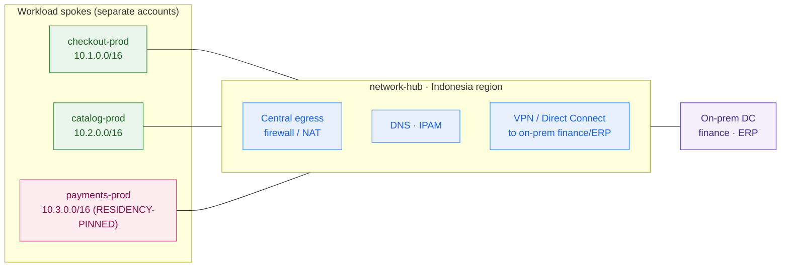

# Landing-Zone Design — PasarKita (worked example)

> This is `template-landing-zone-design.md` filled in for the running Phase 3 customer. It shows what "good" looks like: a hierarchy the CFO can see cost through, guardrails an auditor accepts (residency as a *preventive* control), and an on-prem seam drawn — the governed foundation every workload in Capstone C lands into.

**Customer:** PasarKita (fictional)  ·  **Industry / regulator:** Indonesian e-commerce marketplace with payments · **Bank Indonesia** payment-system rules + **UU PDP** (data protection)
**Prepared by:** SA — Presales  ·  **Engagement:** Cloud foundation + tenancy re-architecture (feeds Capstone C)  ·  **Cloud(s) in scope:** current single public cloud, **designed provider-neutral for multi-cloud**
**Date:** 2026-07-05  ·  **Version:** v0.2

**Company shape:** ~15M active buyers · ~200,000 sellers · ~2M orders/day · flash-sale (12.12) spikes ~10× for a few hours · checkout/catalog monolith + microservices on one public cloud · aging on-prem DC (finance/ERP) · platform team standardized on containers/Kubernetes.
**Drivers:** cloud cost overruns (CFO #1 issue → FinOps) · vendor-lock-in fear (wants portability/multi-cloud) · flash-sale elasticity · SE-Asia expansion · ad-hoc governance → needs a real landing zone · migrate on-prem finance/ERP → hybrid.
**Constraints:** 99.95% checkout/payments uptime · **payment data must stay in Indonesia (residency)** · portability wanted (containers/K8s).

---

## 1. Organization hierarchy (set first)

| Level | Container | Holds | Policy set here |
|---|---|---|---|
| Root | Management / billing account | Org-wide guardrails, consolidated billing — **no workloads** | Residency deny · logging-protect · root-protect |
| OU | Security | Log Archive · Security Tooling | Locked audit trail; deletable by no one |
| OU | Infrastructure / Shared | Network Hub · Shared Services | Hub-spoke standard · CI/CD · registry |
| OU | Workloads → Prod / Non-prod | checkout · catalog · payments (per env) | Encryption required · public storage blocked |
| OU | Sandbox | Flash-sale experiments · spikes tests | Budget-capped · time-boxed · **no payment data** |

**Rule:** policy inherits top-down — the residency and logging guardrails are set **once** at the root and every account beneath obeys them.

## 2. Accounts (separated by purpose and environment)

| Account | OU | Purpose | Residency-pinned? |
|---|---|---|---|
| `pasarkita-mgmt` | Root | Billing + org policy | n/a (no workloads) |
| `log-archive` | Security | Immutable central logs | Yes (Indonesia) |
| `security-tooling` | Security | Posture checks · SIEM · scanning | Yes |
| `network-hub` | Infrastructure | Egress · DNS · IPAM · on-prem link | Yes |
| `shared-services` | Infrastructure | CI/CD · container registry · IaC pipeline | Yes |
| `checkout-prod` | Workloads/Prod | Checkout (99.95% uptime) | Yes |
| `catalog-prod` | Workloads/Prod | Catalog + search | Yes |
| **`payments-prod`** | Workloads/Prod | **Payments — cardholder/payment data** | **Yes — hard requirement** |
| `checkout-dev` · `catalog-test` · `staging` | Workloads/Non-prod | dev · test · staging | No payment data |
| `sandbox-*` | Sandbox | Experiments · load tests | No |

**Why separate (the CFO answer):** spend now rolls up per account, so "who spent this?" is answerable, a flash-sale over-provision shows up against a **named budget** instead of hiding in one invoice, and `payments-prod` is a small, provable audit scope instead of the whole estate.

## 3. Identity & SSO

- **Source of truth:** PasarKita's corporate IdP (Entra ID / Okta) federated into cloud SSO.
- **Access model:** roles **assumed on demand**, scoped per account + environment. A `catalog-dev` engineer **cannot** hold credentials into `payments-prod`.
- **Workload identity:** short-lived workload identities for service-to-service; **no static access keys** — the exact failure that let a developer stand up a payment database in Singapore.
- **Break-glass:** root/owner identities protected by a preventive guardrail; emergency-only, fully logged.

## 4. Network baseline (hub-spoke)

- **Topology:** hub-spoke. `network-hub` owns centralized egress/NAT, DNS, IPAM, and the **VPN / Direct Connect to the on-prem finance/ERP DC** — the hybrid seam for the migrate-and-rebalance plan.
- **Addressing:** non-overlapping — hub `10.0.0.0/16`, spokes `checkout 10.1.0.0/16` · `catalog 10.2.0.0/16` · `payments 10.3.0.0/16` *(illustrative; overlap would break routing, the on-prem link, and future multi-cloud peering)*.
- **Residency:** hub + every spoke pinned to **Indonesia region(s)** — residency is carried by the network baseline, not just by policy.



## 5. Guardrails (preventive + detective)

| Guardrail | Type | Scope | Why (PasarKita) |
|---|---|---|---|
| **Deny non-Indonesia regions** | **Preventive** | Org root | **Residency** — payment/cardholder data physically cannot leave Indonesia |
| Deny disabling/deleting central logging | **Preventive** | Org root | Audit trail must survive even an account admin |
| Protect root / break-glass identities | **Preventive** | Org root | The one identity PasarKita can't lose |
| Encryption-at-rest required | **Preventive** | Workloads OU | Baseline for payment + PII data |
| Public object storage blocked | **Preventive** | Workloads OU | Stop the next accidental data exposure |
| Approved services only | **Preventive** | Workloads OU | Keep the estate reviewable + cost-bounded |
| Untagged / unencrypted / over-permissive drift | **Detective** | Org-wide | Flag → route to `security-tooling` for remediation |

**Line for the review:** *"residency is not a policy document — it is a preventive control. A workload in any team physically cannot place payment data outside Indonesia."* All guardrails are policy-as-code, versioned with the landing zone, so they're identical in every account and portable to a second cloud.

## 6. Logging/audit + cost/tagging foundation

- **Logging:** every account streams API/audit logs, config history, and flow logs to the **immutable `log-archive`** account — write-once, deletable by no one.
- **Tagging:** mandatory `team`, `environment`, `cost-center`, `data-class` on every resource (`data-class=payment` is what the residency + audit scope keys on).
- **Cost:** consolidated billing + **per-account budgets with alarms**. The CFO now sees spend by team, by environment, by workload — and a 12.12 over-provision trips a named alarm. This is the FinOps starting line that lesson 3.7 builds on.

---

## 7. Landing-zone (ASCII)

```
                        ┌──────────────── IDENTITY & SSO (spans every account) ────────────────┐
   CROSS-CUTTING ─────▶ │  corporate IdP (Entra/Okta) → cloud SSO · roles assumed per account   │
                        │  no long-lived keys · catalog-dev CANNOT reach payments-prod           │
                        └───────────────────────────────────────────────────────────────────────┘
   GUARDRAILS (inherited top-down · preventive + detective)
   ├─ ORG ROOT: DENY non-Indonesia regions (RESIDENCY) · deny disabling logging · protect root
   ├─ WORKLOADS OU: encryption required · public storage blocked · approved services only
   └─ ACCOUNT: budget + alarm · mandatory tags (team / env / cost-center / data-class)

   ORG ROOT  (pasarkita-mgmt — billing, no workloads)
   │
   ├── SECURITY OU
   │     ├── log-archive          (immutable — all accounts ship logs here)
   │     └── security-tooling     (posture · SIEM · scanning)
   │
   ├── INFRASTRUCTURE / SHARED OU
   │     ├── network-hub          (egress · DNS · IPAM · VPN/DX ──▶ on-prem finance/ERP)
   │     └── shared-services       (CI/CD · container registry · IaC pipeline)
   │
   ├── WORKLOADS OU
   │     ├── PROD:     checkout-prod · catalog-prod · payments-prod (RESIDENCY-PINNED)
   │     └── NON-PROD: checkout-dev · catalog-test · staging
   │
   └── SANDBOX OU                 (flash-sale experiments · budget-capped · NO payment data)

   NETWORK: hub-spoke — hub 10.0.0.0/16 · spokes 10.1 / 10.2 / 10.3 (non-overlapping, Indonesia)
   DELIVERY: entire tree is Terraform / IaC — accounts vended pre-governed, portable to a 2nd cloud
```

---

## 8. Decisions & rationale (one line each)

| # | Decision | Rationale | Feeds |
|---|---|---|---|
| 1 | Management account + 4 OUs (Security, Infra, Workloads, Sandbox) | Policy inherits down; residency/logging set once | Whole design |
| 2 | One account per domain per environment | Blast radius + per-account cost attribution (CFO #1) + small audit scope | FinOps (3.7) · security review |
| 3 | Federated SSO, roles per account, no static keys | Identity is the perimeter; kills the leaked-key failure mode | Security review |
| 4 | Hub-spoke, non-overlapping, Indonesia-pinned, on-prem link | Standard network + carries residency + hybrid seam | Migration (3.6) · Capstone C |
| 5 | **Residency = preventive control (deny non-Indonesia regions)** | Payment data *cannot* leave the country — access-denied, not a warning | **Bank Indonesia / UU PDP audit** |
| 6 | Immutable central logging + mandatory tags + per-account budgets | Auditable record + attributable, alarm-able cost | FinOps (3.7) · audit |
| 7 | Landing zone delivered as IaC, provider-neutral | Vended pre-governed · diff-able · reproducible on a 2nd cloud | Portability / Capstone C |

**One-line scope statement:**
> PasarKita's cloud foundation is a **hierarchy of blast-radius-isolated accounts** under one management account, joined to a **hub-spoke network with an on-prem finance/ERP seam** and **federated identity**, governed by **inherited guardrails** — with **Indonesia residency a preventive control** — watched by **centralized immutable logging**, attributed by **mandatory tagging + per-account budgets**, and **delivered as IaC** so it ports to a second cloud.

**So what (the pivot this design buys):** the single ungoverned account that fails the CFO's cost question and the auditor's residency question becomes a governed foundation where cost is attributable *by construction*, residency is *impossible to violate*, blast radius is contained, and a new team gets a pre-governed account instead of a dangerous blank canvas — and because it's provider-neutral IaC, it's the exact base **Capstone C** deploys the hybrid/multi-cloud architecture onto.

---

## 9. Must-label checklist (ticked)

- [x] **Organization hierarchy** — `pasarkita-mgmt` (no workloads) + Security / Infrastructure / Workloads / Sandbox OUs, policy inheriting down.
- [x] **Account separation** — per domain per environment; `payments-prod` (+ prod peers) marked residency-pinned.
- [x] **Identity & SSO** — corporate IdP federated, roles assumed per account, no long-lived keys.
- [x] **Network baseline** — hub-spoke, non-overlapping (10.0/10.1/10.2/10.3), on-prem finance/ERP seam, Indonesia-pinned.
- [x] **Preventive residency guardrail** — deny non-Indonesia regions, stated as an access-denied.
- [x] **Preventive baseline guardrails** — logging-protect, root-protect, encryption, public-storage-block.
- [x] **Detective controls** — drift flagged and routed to `security-tooling`.
- [x] **Centralized immutable logging** — locked `log-archive` account all others ship to.
- [x] **Cost/tagging foundation** — mandatory tags + per-account budgets → showback for the CFO.
- [x] **IaC delivery** — the whole zone is Terraform, provider-neutral, portable to a second cloud.
- [x] **Readable by all three** — exec reads the tree, auditor trusts the guardrails, engineer builds from the tables.
