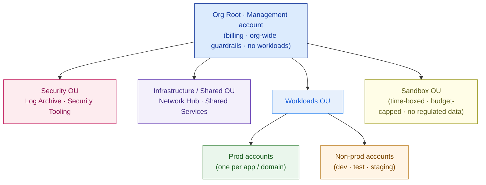

# Landing-Zone Design — Template

> Fill this in when you design the governed cloud foundation a customer's workloads will land into (a first cloud build, a tenancy re-architecture, or a multi-cloud program). It is the base every later cloud artifact sits on — reference architectures, the migration plan, the FinOps model, and Capstone C. An executive should grasp the org tree; an auditor should trust the guardrails; an engineer should be able to turn it into IaC.

**Customer:** `<company>`  ·  **Industry / regulator:** `<industry · regulator, e.g. Bank Indonesia / OJK / UU PDP>`  ·  **Prepared by:** `<SA name>`
**Engagement:** `<deal or project name>`  ·  **Cloud(s) in scope:** `<AWS / Azure / GCP / multi>`  ·  **Date:** `<YYYY-MM-DD>`  ·  **Version:** `<v0.1 draft>`

---

## How to use this template

Work the six decisions in order. Do **not** start by launching a workload — start from the **hierarchy** and the **guardrails** the business and regulator require, then let workloads land on top.

1. **Organization hierarchy** — root, OUs/management groups/folders, and where policy inherits from.
2. **Accounts** — separate by purpose *and* environment; mark the regulated/residency-pinned ones.
3. **Identity & SSO** — federate the corporate IdP; roles assumed per account; no long-lived keys.
4. **Network baseline** — hub-spoke, non-overlapping spokes, on-prem/interconnect seam, region-pinned.
5. **Guardrails** — preventive (deny) for non-negotiables incl. residency; detective (flag) for best-practice.
6. **Logging/audit + cost/tagging** — immutable central log store; mandatory tags + per-account budgets.

Legend: **OU** = grouping container (Azure = management group, GCP = folder) · **account** = unit of isolation (Azure = subscription, GCP = project) · **guardrail** = inherited policy control · **preventive** = denied before it happens (SCP / Azure Policy / Org Policy) · **residency** = data pinned to an approved region.

---

## 1. Organization hierarchy (the spine — set it first)

> One management account (billing + org-wide policy, **no workloads**), then OUs grouped by purpose so policy inherits down.

| Level | Container | Holds | Policy set here |
|---|---|---|---|
| Root | Management / billing account | Org-wide guardrails, billing owner — no workloads | Residency deny · logging-protect · root-protect |
| OU | Security | Log Archive · Security Tooling | Locked; audit trail deletable by no one |
| OU | Infrastructure / Shared | Network Hub · Shared Services | Network + shared-service standards |
| OU | Workloads → Prod / Non-prod | One account per app-domain per environment | Encryption required · public storage blocked |
| OU | Sandbox | Experiments | Budget-capped · time-boxed · no regulated data |

**Rule to state:** policy inherits top-down, so a guardrail set once at root/OU governs every account beneath it.

## 2. Accounts (separate by purpose and environment)

> List the accounts you'll vend. Mark the **residency-pinned / regulated** ones — those are the auditor's scope.

| Account | OU | Purpose | Residency-pinned? |
|---|---|---|---|
| `<mgmt>` | Root | Billing + org policy | n/a (no workloads) |
| `<log-archive>` | Security | Immutable central logs | Yes (in-country) |
| `<security-tooling>` | Security | Posture · SIEM · scanning | — |
| `<network-hub>` | Infrastructure | Egress · DNS · IPAM · on-prem link | Yes |
| `<shared-services>` | Infrastructure | CI/CD · registry · IaC pipeline | — |
| `<app>-prod` | Workloads/Prod | `<workload>` production | `<Yes if holds regulated data>` |
| `<app>-nonprod` | Workloads/Non-prod | dev · test · staging | No (no regulated data) |
| `<sandbox>` | Sandbox | Experiments | No |

**Why separate (say this):** blast radius · least privilege · cost attribution · compliance scoping · quota isolation — none of which a tag in a shared account can give you.

## 3. Identity & SSO

- **Source of truth:** `<corporate IdP — Entra ID / Okta>` federated into `<cloud SSO>`.
- **Access model:** roles **assumed on demand**, scoped per account + environment. `<non-prod dev never holds prod credentials>`.
- **Workload identity:** short-lived workload identities, **no static access keys**.
- **Break-glass:** root/owner identities protected by preventive guardrail; used only in emergencies, logged.

## 4. Network baseline (hub-spoke)

- **Topology:** hub-spoke — a shared **hub** (`<region>`) owns egress, DNS, IPAM, and the `<VPN / interconnect>` to `<on-prem / other cloud>`; each workload account is a **spoke**.
- **Addressing:** non-overlapping ranges per spoke — hub `<10.0.0.0/16>`, spokes `<10.1.x / 10.2.x …>` *(illustrative — overlap breaks routing, DR, and multi-cloud peering)*.
- **Residency:** hub + all spokes pinned to `<approved in-country region(s)>` — the network itself carries residency.

## 5. Guardrails (preventive + detective)

| Guardrail | Type | Scope | Why |
|---|---|---|---|
| Deny non-approved (in-country) regions | **Preventive** | Org root | **Residency** — regulated data cannot leave the country |
| Deny disabling/deleting central logging | **Preventive** | Org root | Audit trail must survive an admin |
| Protect root / break-glass identities | **Preventive** | Org root | The one identity you can't lose |
| Encryption-at-rest required | **Preventive** | Workloads OU | Baseline data protection |
| Public object storage blocked | **Preventive** | Workloads OU | Stop accidental data exposure |
| Approved services only | **Preventive** | Workloads OU | Keep the estate reviewable |
| Untagged / unencrypted / over-permissive drift | **Detective** | Org-wide | Flag + route to Security Tooling |

**Line for the review:** the non-negotiables (residency, logging) are **preventive controls, not policy documents** — the action is *denied*, not warned. All guardrails are **policy-as-code**, versioned with the rest of the landing zone.

## 6. Logging/audit + cost/tagging foundation

- **Logging:** every account streams API/audit logs, config history, and flow logs to the **immutable Log Archive** account (write-once, deletable by no one).
- **Tagging:** mandatory tag policy — `team`, `environment`, `cost-center`, `data-class` — enforced so every resource is attributable.
- **Cost:** consolidated billing + **per-account budget with alarms** → showback per team. The FinOps starting line.

---

## 7. Organization tree (Mermaid skeleton)

> Replace the placeholders. Management account on top (no workloads), OUs below, accounts at the leaves.



## 8. Landing-zone skeleton (ASCII — for docs/email that can't render Mermaid)

```
                        ┌──────────── IDENTITY & SSO (spans every account) ────────────┐
   CROSS-CUTTING ─────▶ │  <corporate IdP> → cloud SSO · roles assumed per account      │
                        │  no long-lived keys · least privilege per role-per-account     │
                        └───────────────────────────────────────────────────────────────┘
   GUARDRAILS (inherited top-down · preventive + detective)
   ├─ ORG ROOT: deny non-approved regions (RESIDENCY) · deny disabling logging · protect root
   ├─ WORKLOADS OU: encryption required · public storage blocked · approved services only
   └─ ACCOUNT: budget + alarm · mandatory tags (team / env / cost-center / data-class)

   ORG ROOT (management / billing — no workloads)
   ├── SECURITY OU          ── Log Archive (immutable)  ·  Security Tooling
   ├── INFRASTRUCTURE OU    ── Network Hub (egress · DNS · IPAM · link ──▶ <on-prem / cloud B>)
   │                            Shared Services (CI/CD · registry · IaC pipeline)
   ├── WORKLOADS OU
   │     ├── PROD:     <app>-prod  ·  <app>-prod (RESIDENCY-PINNED)
   │     └── NON-PROD: <app>-dev · <app>-test · staging
   └── SANDBOX OU           ── time-boxed · budget-capped · NO regulated data

   NETWORK: hub-spoke — shared hub (<region>) · one non-overlapping spoke per workload
   DELIVERY: entire tree is Terraform / IaC — accounts vended pre-governed
```

---

## 9. Decisions & rationale (one line each)

| # | Decision | Rationale | Feeds |
|---|---|---|---|
| 1 | `<hierarchy: root + N OUs>` | Policy inherits down; set residency/logging once | Whole design |
| 2 | `<one account per domain per env>` | Blast radius + cost attribution + compliance scoping | FinOps · security review |
| 3 | `<federated SSO, no static keys>` | Identity is the perimeter; least privilege by role/account | Security review |
| 4 | `<hub-spoke, non-overlapping, region-pinned>` | Standard network + carries residency + on-prem seam | Migration · DR · multi-cloud |
| 5 | `<residency = preventive control>` | Regulated data physically cannot leave the country | **Audit pass/fail** |
| 6 | `<central immutable logging + mandatory tags + budgets>` | Auditable record + attributable cost | FinOps · audit |
| 7 | `<landing zone delivered as IaC>` | Vended pre-governed, diff-able, reproducible across clouds | Portability / Capstone C |

**One-line scope statement:**
> `<Customer>`'s cloud foundation is a **hierarchy of blast-radius-isolated accounts** under one management account, joined to a **hub-spoke network** and **federated identity**, governed by **inherited guardrails** (with residency a *preventive* control), watched by **centralized immutable logging**, attributed by **mandatory tagging + per-account budgets**, and **delivered as IaC** — the governed base every workload lands into.

---

## 10. Must-label checklist (every landing-zone diagram passes this before it leaves your laptop)

- [ ] **Organization hierarchy** — one management/billing account (no workloads) + purpose-grouped OUs, policy inheriting down.
- [ ] **Account separation** — by purpose *and* environment; regulated/residency-pinned accounts marked.
- [ ] **Identity & SSO** — corporate IdP federated, roles assumed per account, no long-lived keys.
- [ ] **Network baseline** — hub-spoke, non-overlapping addressing, on-prem/interconnect seam, region-pinned.
- [ ] **Preventive residency guardrail** — deny non-approved regions, stated as an access-denied not a warning.
- [ ] **Preventive baseline guardrails** — logging-protect, root-protect, encryption, public-storage-block.
- [ ] **Detective controls** — continuous posture checks routed to a security account.
- [ ] **Centralized immutable logging** — a locked Log Archive account all others ship to.
- [ ] **Cost/tagging foundation** — mandatory tag policy + per-account budgets → showback.
- [ ] **IaC delivery** — the whole zone is code; accounts are vended pre-governed.
- [ ] **Readable by all three** — an exec gets the tree, an auditor trusts the guardrails, an engineer builds from the tables.

---

*Worked example: see `example-pasarkita-landing-zone.md` in this folder.*
