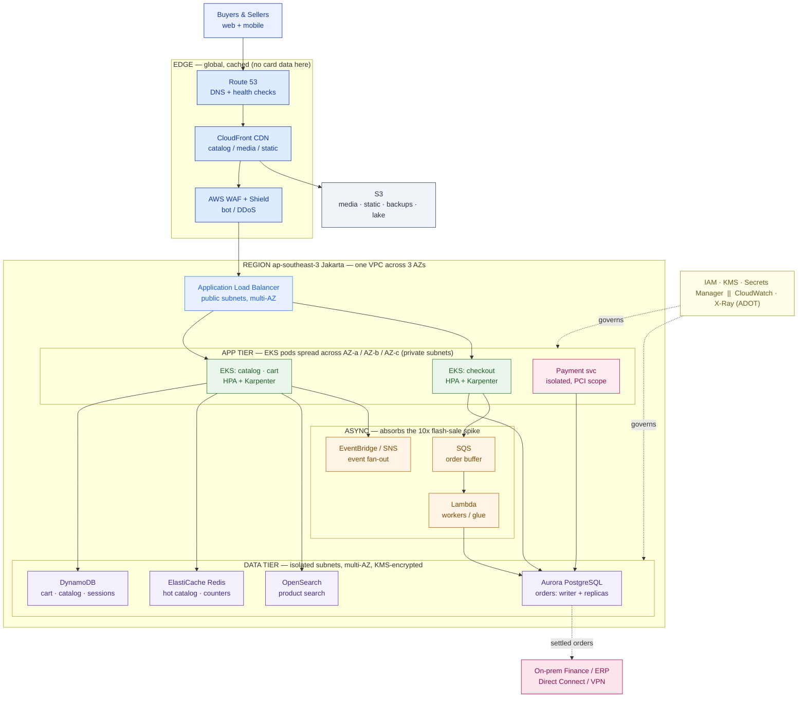

# AWS for Architects

> AWS has 200+ services. Your job isn't to know them all — it's to pick the ~15 that carry the workload, and defend every one.

**Type:** Design
**Track:** AI, Data & Infrastructure Solution Architect (Presales)
**Prerequisites:** 3.1 Cloud Foundations & Landing Zones
**Time:** ~6h
**Lab:** free tier / LocalStack
**Ship It:** AWS reference architecture

## The Problem

Your account team just won a workshop with **PasarKita**, an Indonesian e-commerce marketplace — ~15M active buyers, ~200,000 sellers, ~2M orders a day, with flash sales that spike traffic ~10× for a few hours. Today their checkout/catalog monolith and a handful of microservices run on a single public cloud whose bill is overrunning, plus an on-prem finance/ERP stack. The CTO wants a target-state architecture on AWS by Friday. She opens the AWS console, sees a menu of **200+ services**, and turns to you: *"Which of these do we actually need?"*

This is where SAs drown. Faced with the service catalog, the rookie does one of three things, all fatal. They **over-engineer** — reaching for Kinesis, Step Functions, AppSync, Neptune, and six other services the workload never asked for, producing a diagram nobody can operate or afford. They **mis-size** — dropping the whole thing on a couple of big EC2 instances that fall over the first time a flash sale hits 10×. Or they **freeze** — unable to choose between EC2, ECS, EKS, Lambda, and Fargate for "run my containers", they defer the decision, and a deferred decision in a first architecture review reads as *doesn't know AWS*.

The skill that separates an architect from a console-clicker is **mapping a workload to the right core services and defending the choices out loud**: managed vs self-managed, serverless vs containers, and where each choice trades operational burden for cost or lock-in. PasarKita's drivers make the defense sharp — **cost** (the current bill is bleeding), **lock-in** (they don't want to be trapped again), **elasticity** (survive the 10× spike without paying for it at 3 a.m.), and **residency** (payment data must stay in Indonesia). A platform team standardized on Kubernetes wants **portability**. You cannot answer "which services?" without answering *to those four drivers*. This lesson gives you the map, the reference architecture, and the language to defend it in the room.

## The Concept

Amazon's catalog is huge, but any transactional web workload is assembled from the same **eight categories**. Learn the category, learn the two or three services that anchor it, and you can compose 90% of real architectures. The rest is knowing *when* to reach past the default.

### The AWS core-service map, by category

| Category | Anchor services (vendor-accurate) | What it decides |
|---|---|---|
| **Compute** | EC2 · ECS · EKS · AWS Fargate · AWS Lambda | How your code runs — VMs, containers, or functions |
| **Storage** | Amazon S3 · Amazon EBS · Amazon EFS | Object (media/lake) · block (per-instance disk) · shared file |
| **Database** | Amazon RDS / Aurora · DynamoDB · ElastiCache | Relational · key-value NoSQL · in-memory cache |
| **Networking & edge** | Amazon VPC, subnets, security groups · ALB / NLB · Route 53 · CloudFront | The private network, load balancing, DNS, and CDN |
| **Async & events** | Amazon SQS · SNS · EventBridge · Amazon MSK | Decoupling — buffer spikes, fan out events |
| **Identity** | AWS IAM (+ KMS, Secrets Manager) | Who/what can do what; encryption; secrets |
| **Observability** | Amazon CloudWatch · AWS X-Ray (ADOT) | Metrics, logs, alarms, traces |
| **Scaling** | Karpenter / Cluster Autoscaler · Application Auto Scaling | Add capacity on the way up, shed it on the way down |

Here is the same map as an **ASCII selection grid** — the one-pager you keep next to you while drawing. The right column is the whole game: not the service, but the *defense*.

```
 CATEGORY          CORE SERVICES (pick ~15)                 PICK WHEN / DEFEND WITH
 ────────────────────────────────────────────────────────────────────────────────────
 Compute           EC2 · ECS · EKS · Fargate · Lambda       EKS → K8s portability (platform team)
 Storage           S3 · EBS · EFS                           S3 → media/static/lake; EBS → stateful pod disk
 Database (SQL)     RDS · Aurora                             Aurora PostgreSQL → orders, ACID, read-replica scale
 Database (NoSQL)   DynamoDB                                 cart/catalog/session; on-demand for spikes
 Cache              ElastiCache (Redis)                      hot catalog, inventory counters, sessions
 Search             OpenSearch Service                       product search + faceting
 Networking         VPC · subnets · security groups          3 AZs; public / private / isolated tiers
 Load balancing     ALB (L7) · NLB (L4)                       ALB → HTTP microservice ingress
 Edge               CloudFront · Route 53 · WAF / Shield     offload catalog & media; DDoS at flash sale
 Async / events     SQS · SNS · EventBridge · MSK            queue-based load leveling for the 10× spike
 Identity           IAM (+ IRSA) · KMS · Secrets Manager     least-privilege; encryption; residency
 Observability      CloudWatch · X-Ray (ADOT)               metrics/logs/traces; portable via OpenTelemetry
 Scaling            Karpenter / Cluster Autoscaler · App AS   absorb + shed the flash-sale spike
 Hybrid             Direct Connect · Site-to-Site VPN        reach the on-prem finance / ERP
```

### Regions, Availability Zones, and residency

Two words decide most of your reliability and *all* of your residency story:

- A **Region** is a physical geography (e.g., **ap-southeast-3**, Asia Pacific **Jakarta**). Data placed in a Region stays in that Region unless you copy it out. This is the lever for PasarKita's payment-data residency requirement — pin the payment workload to **ap-southeast-3**.
- An **Availability Zone (AZ)** is one or more discrete data centers *within* a Region, isolated for power/cooling/network but linked by low-latency fiber. Jakarta has **three AZs**. The reliability rule of thumb: **span at least two AZs** for anything that must survive a data-center failure. We'll use all three.

Singapore (**ap-southeast-1**) sits next door with more services and often lower cost — a legitimate home for *non-residency* workloads or disaster recovery — but card data cannot land there. Residency is a Region decision you make *before* you draw a box.

### The AWS Well-Architected Framework — your defense checklist

AWS publishes six pillars that are, in practice, the questions a good architecture review will ask you. Treat them as the rubric you grade your own diagram against.

| Pillar | The question it asks | For PasarKita it means… |
|---|---|---|
| **Operational Excellence** | Can you run and observe it? | CloudWatch + X-Ray, IaC, runbooks for flash-sale day |
| **Security** | Who can touch what, and is it encrypted? | IAM least-privilege, KMS everywhere, payment scope isolated |
| **Reliability** | Does it survive failure? | Multi-AZ across all three Jakarta AZs; async buffers |
| **Performance Efficiency** | Right service, right size? | DynamoDB for cart, Aurora for orders, ElastiCache for hot reads |
| **Cost Optimization** | Are you paying only for what you use? | Scale-to-zero at night; Savings Plans on the steady base |
| **Sustainability** | Are you minimizing waste? | Right-sizing and scale-down are the same lever as cost |

The pillars aren't box-checking. In a review, *every* pillar is a question the customer will actually ask, and "I optimized for cost but here's how I still hit reliability" is the sentence that wins trust.

### A reference architecture in one diagram

Every category above resolves into a **multi-AZ, 3-tier + async** shape. Edge caches and shields at the front; a stateless app tier spread across AZs; an async layer that absorbs spikes; a stateful data tier in isolated subnets. Read it as the target you'll defend.



## Design It

Let's map PasarKita's checkout + catalog workload onto AWS, one decision at a time. The rule for this whole section: **every service is chosen against a driver (cost / lock-in / elasticity / residency), and every number is an assumption with a range.** Note that lessons 3.3 (Azure) and 3.4 (GCP) map this *same* workload — so the reasoning here is what 3.6 will compare.

### Step 1 — Pick the Region and lay out the VPC across AZs

Residency decides the Region before anything else: payment data must stay in Indonesia, so the payment workload lives in **ap-southeast-3 (Jakarta)**. To keep the architecture simple and residency-clean, we place the *entire* production estate in ap-southeast-3 and keep **ap-southeast-1 (Singapore)** in our pocket as a DR/expansion option (no card data). One **VPC** spans all **three AZs**, split into three subnet tiers:

```
 VPC 10.0.0.0/16  —  ap-southeast-3 (Jakarta)  —  spans AZ-a, AZ-b, AZ-c
 ┌──────────────────────────────────────────────────────────────────────────┐
 │ PUBLIC subnets   (one per AZ)   → ALB, NAT gateways                        │
 ├──────────────────────────────────────────────────────────────────────────┤
 │ PRIVATE subnets  (one per AZ)   → EKS nodes/pods, Lambda ENIs             │
 ├──────────────────────────────────────────────────────────────────────────┤
 │ ISOLATED subnets (one per AZ)   → Aurora, ElastiCache, OpenSearch (no IGW) │
 └──────────────────────────────────────────────────────────────────────────┘
   Security groups = per-tier firewalls: ALB→app on 443, app→data on db ports only
```

The **isolated** data subnets have no route to an internet gateway — the database can only be reached from the app tier's security group. That single design choice covers a chunk of the Security pillar for free.

### Step 2 — Choose the compute tier (defend it against portability)

The platform team is standardized on Kubernetes and portability is an explicit driver. That makes the compute decision almost mechanical: run the microservices on **Amazon EKS**. EKS gives them the *same Kubernetes API* they'd get on Azure (AKS) or GCP (GKE) or on-prem, so the workload stays portable and the "don't trap us again" fear is answered directly. The EKS **data plane** runs on EC2 managed node groups with **Karpenter** for fast, right-sized scaling; genuinely spiky, stateless jobs can burst onto **AWS Fargate** so we don't hold idle nodes at 3 a.m.

We deliberately **do not** put the core checkout path on Lambda: it's excellent for async glue (Step 4) but re-platforming the latency-sensitive checkout onto a proprietary function runtime would undercut the portability driver. That's the defense: *EKS because portability; Fargate for burst economics; Lambda only where lock-in buys a real operational win.*

### Step 3 — Choose the data tier (the right store for each job)

One workload, three different data-access shapes, three different stores:

- **Orders / checkout → Amazon Aurora (PostgreSQL-compatible).** Orders need ACID transactions and relational integrity. Aurora gives us a PostgreSQL wire-protocol app (portable code) with cloud-native storage, up to 15 read replicas for read scale, and **Aurora Serverless v2** to auto-scale capacity (ACUs) into a flash sale.
- **Cart, catalog reads, sessions → Amazon DynamoDB.** These are high-volume key-value lookups that must stay single-digit-millisecond at 10× load. DynamoDB **on-demand** capacity rides the spike with zero pre-provisioning.
- **Hot catalog, inventory counters, rate limits → Amazon ElastiCache (Redis).** Shields the databases from the read storm and holds the atomic "units left" counters a flash sale hammers.
- **Product search & faceting → Amazon OpenSearch Service.** Free-text and faceted browse is a search problem, not a database scan.
- **Media, static assets, backups, data lake → Amazon S3.** Product images and seller media live in S3 and are served through CloudFront (Step 5), never off the app tier.

### Step 4 — Absorb the 10× flash sale (async + auto-scaling)

Two mechanisms turn a traffic wall into something the system rides out:

1. **Queue-based load leveling.** At checkout, the app writes the order intent to **Amazon SQS** and returns fast; **AWS Lambda** (or EKS consumers) drain the queue into Aurora at a sustainable rate. The database never sees the raw 10× spike — it sees a smoothed line. **Amazon EventBridge / SNS** fan the "order placed" event out to inventory, notifications, and fraud checks without coupling those services to checkout.
2. **Elastic scaling on every tier.** EKS scales pods with the **Horizontal Pod Autoscaler** and nodes with **Karpenter**; DynamoDB is on-demand; Aurora adds read replicas / Serverless v2 ACUs; **CloudFront** absorbs the catalog and media reads at the edge so most flash-sale traffic never reaches the Region at all. **Application Auto Scaling** ties the policies together.

This is also the **cost** answer: the same elasticity that scales *up* for the sale scales *down* afterward, so PasarKita stops paying flash-sale prices at midnight — the exact leak in their current bill.

### Step 5 — Edge, identity, observability, and the hybrid link

- **Edge:** **Route 53** for DNS and health-checked failover; **CloudFront** as the CDN caching catalog pages and media from S3; **AWS WAF + Shield** in front for bot and DDoS protection during high-visibility sales.
- **Identity & secrets:** **IAM** with least-privilege roles; on EKS, pods assume roles via **IRSA** (IAM Roles for Service Accounts) so no static keys ship in containers. **KMS** encrypts every data store; **Secrets Manager** holds DB credentials and payment keys. The **payment service** runs in an isolated subnet (and ideally a separate AWS account under **AWS Organizations**) to keep PCI scope small and the residency boundary auditable.
- **Observability:** **CloudWatch** for metrics, logs, and alarms; **AWS X-Ray** via **ADOT** (AWS Distro for OpenTelemetry) for traces — OpenTelemetry keeps the instrumentation *portable*, so a future move doesn't throw away the observability investment.
- **Hybrid:** settled orders flow to the on-prem finance/ERP over **AWS Direct Connect** (with a **Site-to-Site VPN** as backup). Payment data itself stays pinned in ap-southeast-3; only the settlement records the ERP needs cross the link.

### Step 6 — State the sizing as assumptions with ranges

Never present a single magic number. Start from the *given* facts (2M orders/day, 10× flash) and show your arithmetic and your assumptions:

```
 GIVEN:   2,000,000 orders/day · flash sale ~10x for hours · reads >> writes
 ─────────────────────────────────────────────────────────────────────────────
 Avg order write rate   = 2,000,000 / 86,400 s        ≈ 23 orders/sec  (baseline)
 ASSUME peak-hour factor 3–5x average (evening peak)  ≈ 70–120 orders/sec
 ASSUME flash sale 10x of normal peak                 ≈ 700–1,200 orders/sec (writes)
 ASSUME catalog read:write ratio 50–100:1             ≈ tens of thousands reads/sec
 ─────────────────────────────────────────────────────────────────────────────
 → Checkout (Aurora): SQS buffer + Serverless v2, size to sustain ~1,200 w/s peak
 → Catalog (DynamoDB on-demand + ElastiCache + CloudFront): reads absorbed at edge
 → EKS: size steady base for ~120 orders/sec; Karpenter adds nodes for the spike
```

Every figure past the two givens is labeled `ASSUME` with a range, and each maps to a service that carries it. That is what "sizing" means at architect altitude — a defensible band, not a fake point estimate. (You'll turn these bands into real capacity and dollars in Phase 6: Sizing and Cost Estimation.)

### Try it — validate one design claim (free tier / LocalStack)

The lab proves one claim from the diagram: *catalog media belongs in S3 (versioned), served from the edge — not off the app tier.* Run it with **no AWS account** via LocalStack, or on the **free tier** pinned to Jakarta.

```bash
# Option A — LocalStack (no AWS account, no cost)
pip install localstack awscli-local
localstack start -d
awslocal s3 mb s3://pasarkita-catalog-media
awslocal s3 cp ./product.jpg s3://pasarkita-catalog-media/
awslocal s3 ls s3://pasarkita-catalog-media/
# turn on versioning — protects catalog media from a bad seller overwrite
awslocal s3api put-bucket-versioning --bucket pasarkita-catalog-media \
  --versioning-configuration Status=Enabled

# Option B — real AWS free tier, residency-correct (Jakarta)
aws configure set region ap-southeast-3
aws s3 mb s3://pasarkita-catalog-media-$RANDOM          # S3: always-free tier
aws ec2 run-instances --image-id <al2023-ami-id> \
  --instance-type t3.micro --count 1                    # t3.micro: free-tier eligible
```

You've just validated that the media path is a versioned object store pinned to the residency Region — one line of the reference architecture, provable in a terminal.

## Compare It

The three decisions customers argue about most, laid out so you can defend the pick in the room.

### Compute: EC2 vs ECS vs EKS vs Fargate vs Lambda

| Option | What it is | Ops burden | Portability | Reach for it when… |
|---|---|---|---|---|
| **EC2** | Raw virtual machines | Highest (you patch/scale) | High (plain VMs) | Lift-and-shift the legacy monolith unchanged |
| **ECS** | AWS-native container orchestrator | Low | **Low** (AWS-proprietary API) | All-in on AWS, want simplest containers, don't need K8s |
| **EKS** | Managed Kubernetes | Medium | **High** (standard K8s API) | Team is K8s-standardized and wants portability ← **PasarKita** |
| **Fargate** | Serverless containers (under ECS/EKS) | Lowest (no nodes) | Medium | Spiky/stateless tasks; avoid idle-node cost |
| **Lambda** | Event-driven functions | Lowest | **Low** (proprietary runtime) | Async glue, sub-second jobs — *not* a portable core |

The "it depends" a customer asks: *"Why not just ECS — it's simpler?"* Because ECS's simplicity is paid for in lock-in, and PasarKita listed lock-in as a driver. EKS costs a little more operational effort to buy back portability. Name that trade and you've defended it.

### Database: Aurora vs RDS vs DynamoDB

| Option | Model | Scales by… | Lock-in | Best for PasarKita… |
|---|---|---|---|---|
| **RDS** | Managed standard engines (PostgreSQL, MySQL) | Vertical + read replicas | Low (standard engines) | Simpler/smaller relational needs; max portability |
| **Aurora** | Cloud-native PG/MySQL-compatible | Storage auto-grows; up to 15 replicas; Serverless v2 | Medium (proprietary storage engine) | **Orders/checkout** — ACID + flash-sale read scale |
| **DynamoDB** | Serverless key-value NoSQL | Seamless, single-digit ms at any scale | **High** (proprietary) | **Cart / catalog / sessions** — spiky key-value |

The pattern to teach: **use the relational store for money and the key-value store for volume.** Orders need transactions (Aurora); carts and catalog reads need throughput (DynamoDB). Forcing one engine to do both is the classic mis-size.

### Serverless vs containers — mapped to the portability goal

There's no dogma here, only a lens: **each serverless choice is a lock-in decision, and you take it only where the operational win outweighs the loss of portability.** For PasarKita: the **core services stay on EKS** (portable) because the platform team must be able to leave. But **DynamoDB, SQS, EventBridge, and Lambda** are chosen *selectively* for the async and high-throughput edges, where the operational and cost wins are large and the pieces are behind a thin, replaceable interface. Say it explicitly in the review: *"the core is portable Kubernetes; the serverless pieces are deliberate, bounded lock-in where they pay for themselves."* That sentence is the difference between an architect and someone who just likes serverless.

## Ship It

This lesson ships a reusable **AWS Reference Architecture** — the artifact you produce when a customer says "give us the target state on AWS." Both files live in [`outputs/`](../outputs/):

- **[`template-aws-reference-architecture.md`](../outputs/template-aws-reference-architecture.md)** — a fill-in template: service selection *by tier*, a Mermaid architecture skeleton, an assumptions/sizing block with ranges, a Well-Architected self-check, and a cost-driver + lock-in scorecard. A colleague can run a target-state workshop straight from it.
- **[`example-pasarkita-aws-reference-architecture.md`](../outputs/example-pasarkita-aws-reference-architecture.md)** — the template fully worked for PasarKita, so the skeleton isn't abstract. It's the artifact you'd attach to the architecture review.

Why ship it this way: a target-state diagram that names ~15 services *and defends each against the customer's own drivers* is what turns "which of these 200 do we need?" into a signed direction. This deliverable feeds **3.6 (Hybrid, Multi-Cloud & Migration)** — where you'll compare this exact design against the Azure and GCP versions — and **Capstone C (Hybrid Cloud Enterprise Architecture)**.

## Exercises

1. **(Easy)** Take the PasarKita reference architecture and, for each of the eight service categories, write **one sentence** naming the AWS service chosen and the driver it defends (cost / lock-in / elasticity / residency). Then flag which three choices are the biggest **lock-in** bets and why they're still worth it.
2. **(Medium)** Re-map the template for a *different* customer: an **Indonesian digital bank** with strict residency, low tolerance for downtime, far lower write volume, and no flash sales — but a hard requirement that customer financial data never leaves ap-southeast-3. Pick ~12 core services, and note where your compute and database choices *diverge* from PasarKita's and why (hint: reliability and residency now outrank elasticity).
3. **(Hard)** Extend PasarKita's design into a **cost-driver + lock-in scorecard**: for each major service, list the primary cost driver (per-request / per-GB / per-ACU / per-node-hour) and rate its portability (Low/Med/High). Then write a half-page recommendation on **which two services you'd swap for a more portable equivalent** if lock-in became the top driver — and what that costs you in operations. Save it alongside the worked example; you'll reuse this scorecard when you compare clouds in 3.6 and defend the target state in Capstone C.

## Key Terms

| Term | What people say | What it actually means |
|------|-----------------|------------------------|
| Region | "The location" | A physical geography (e.g., ap-southeast-3 Jakarta) that *contains* your data — the lever for residency. Choose it before you draw a box. |
| Availability Zone (AZ) | "A data center" | One or more isolated data centers within a Region. Span ≥2 (we use 3) so a single failure can't take you down. |
| EKS vs ECS | "AWS Kubernetes" | EKS = managed **standard** Kubernetes (portable API); ECS = AWS's own orchestrator (simpler, but proprietary lock-in). The choice *is* a portability decision. |
| Fargate | "Serverless EKS" | A serverless *compute engine* under ECS/EKS — no nodes to manage, pay per task. Great for burst, priced higher per vCPU at steady scale. |
| Aurora | "AWS MySQL/Postgres" | A cloud-native engine that's *compatible* with PostgreSQL/MySQL (portable app code) but runs proprietary storage — medium lock-in for high performance. |
| DynamoDB | "AWS NoSQL" | Serverless key-value store, single-digit ms at any scale, on-demand capacity. Superb for cart/catalog; high lock-in and no joins. |
| Queue-based load leveling | "Add a queue" | Putting SQS between a spiky producer and a database so the DB sees a smoothed rate, not the 10× wall. The core flash-sale pattern. |
| IRSA | "Pod permissions" | IAM Roles for Service Accounts — EKS pods assume IAM roles with no static keys baked into containers. The clean identity story on Kubernetes. |
| Well-Architected Framework | "AWS best practices" | Six pillars (Operational Excellence, Security, Reliability, Performance, Cost, Sustainability) that are the exact questions a review will grill you on. |
| Managed vs self-managed | "Serverless vs not" | Who runs the undifferentiated heavy lifting — you or AWS. Every step toward managed trades operational burden for cost and (often) lock-in. |

## Further Reading

- [AWS Well-Architected Framework](https://aws.amazon.com/architecture/well-architected/) — the six-pillar rubric this lesson uses as its defense checklist; read the pillar overviews once and grade every diagram against them.
- [AWS Architecture Center — reference architectures](https://aws.amazon.com/architecture/) — AWS's own vetted patterns for web, e-commerce, and event-driven workloads; the shape you drew here is the canonical one.
- [Amazon EKS Best Practices Guide](https://docs.aws.amazon.com/eks/latest/best-practices/) — how the portable-compute choice is actually operated (IRSA, Karpenter, scaling); the detail behind Step 2.
- [Choosing an AWS database service](https://docs.aws.amazon.com/decision-guides/latest/databases-on-aws-how-to-choose/choosing-aws-database-service.html) — AWS's decision guide for the Aurora-vs-RDS-vs-DynamoDB call in Compare It.
- [AWS Asia Pacific (Jakarta) Region](https://aws.amazon.com/about-aws/global-infrastructure/regions_az/) — the global-infrastructure page confirming ap-southeast-3's AZs; the residency anchor for the whole design.
- [Karpenter](https://karpenter.sh/) — the node auto-scaler that absorbs the 10× flash-sale spike on EKS; skim the concepts to defend Step 4.
