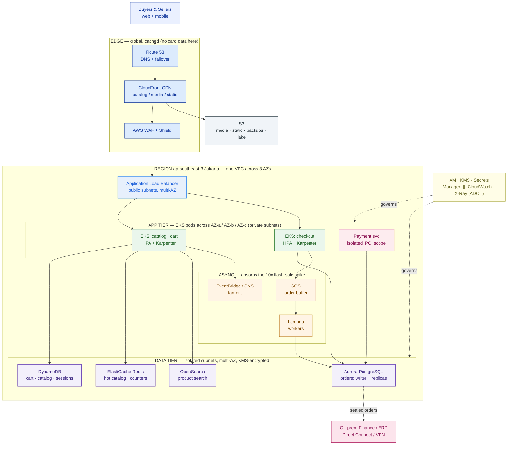

# AWS Reference Architecture — PasarKita (worked example)

> This is `template-aws-reference-architecture.md` filled in for the running Phase 3 customer. It shows what "good" looks like: ~15 services named and each defended against PasarKita's own drivers. Lessons 3.3 (Azure) and 3.4 (GCP) map the **same** workload — so 3.6 can compare these three head-to-head.

**Customer:** PasarKita (fictional)  ·  **Workload:** checkout + catalog for an e-commerce marketplace
**Prepared by:** SA — Presales  ·  **Date:** 2026-07-05  ·  **Opportunity:** cloud target-state on AWS  ·  **Version:** v0.2

**Company shape:** ~15M active buyers · ~200,000 sellers · ~2M orders/day · flash sales ~10× for hours.
**Today:** checkout/catalog monolith + microservices on a single public cloud (bill overrunning) + on-prem finance/ERP.

---

## 0. Drivers first (ranked)

| Rank | Driver | Why it matters here | The constraint it imposes |
|---|---|---|---|
| 1 | **Residency** | Payment data must stay in Indonesia (regulatory) | Payment workload pinned to **ap-southeast-3 (Jakarta)** |
| 2 | **Cost** | Current bill is overrunning — the reason they're moving | Must scale *down* after the sale; buy the steady base cheaply |
| 3 | **Lock-in / portability** | Platform team is K8s-standardized; "don't trap us again" | Core compute stays on **standard Kubernetes**; serverless only where it pays |
| 4 | **Elasticity** | Flash sales spike ~10× for hours | Every tier must scale out for the spike and back afterward |

## 1. Region & AZ placement

- **Primary Region:** **ap-southeast-3 (Jakarta)** — chosen for **residency**; card data must not leave Indonesia. The whole production estate lives here to keep the residency boundary simple and auditable.
- **Secondary / DR Region:** **ap-southeast-1 (Singapore)** held as a DR/expansion option for *non-payment* data only — **no card data replicates there**.
- **AZ span:** all **3** Jakarta AZs for the app and data tiers.
- **Residency boundary:** payment service + payment data stay in ap-southeast-3, ideally in a **separate AWS account** (AWS Organizations) to shrink PCI scope; only settled-order *records* cross to the on-prem ERP.

## 2. Service selection by tier

| Tier | AWS service(s) | Alternative considered | Defense (driver it serves) | Lock-in |
|---|---|---|---|---|
| **Edge / CDN / DNS** | CloudFront · Route 53 · WAF + Shield | serve static off app tier | Offloads catalog/media reads at the edge so most flash-sale traffic never hits the Region — **elasticity + cost** | Low |
| **Load balancing** | Application Load Balancer (ALB) | NLB | L7 HTTP ingress to the microservices | Low |
| **Compute** | **Amazon EKS** (EC2 node groups + Karpenter); Fargate for burst | ECS, Lambda-core | Standard Kubernetes API = **portability** for the K8s-standardized team | Med |
| **Async / events** | SQS · SNS · EventBridge; Lambda workers | synchronous writes | Queue-based load leveling absorbs the **10× spike** so the DB sees a smoothed rate | High (bounded) |
| **Database (SQL)** | **Amazon Aurora PostgreSQL** (writer + read replicas, Serverless v2) | RDS PostgreSQL | Orders need **ACID**; Aurora scales reads for the sale; PG-compatible = portable app code | Med |
| **Database (NoSQL)** | **Amazon DynamoDB** (on-demand) | Aurora for everything | Cart/catalog/sessions are spiky key-value; single-digit ms at 10× — **elasticity** | High (bounded) |
| **Cache** | **Amazon ElastiCache (Redis)** | none | Hot catalog + atomic inventory counters shield the DB from the read storm | Med |
| **Search** | **Amazon OpenSearch Service** | SQL LIKE scans | Faceted product browse is a search problem, not a table scan | Med |
| **Object storage** | **Amazon S3** | EFS/EBS for media | Product images, seller media, backups, data-lake landing | Low |
| **Identity & secrets** | IAM (+ **IRSA**) · KMS · Secrets Manager | static keys in pods | Least-privilege, no baked-in keys, encryption everywhere — **security + residency** | Low |
| **Observability** | CloudWatch · X-Ray via **ADOT** | vendor agent | OpenTelemetry keeps instrumentation portable — protects the investment on any future move | Low |
| **Scaling** | Karpenter / Cluster Autoscaler · HPA · Application Auto Scaling | fixed capacity | Adds nodes/pods/ACUs for the spike and sheds them after — **cost + elasticity** | Low |
| **Hybrid link** | AWS Direct Connect (+ Site-to-Site VPN backup) | public internet | Settled orders flow to on-prem finance/ERP; payment data stays pinned | Low |

**~15 services. Every row cites a driver.** That is the defensible target state.

## 3. The architecture



### ASCII fallback

```
   IDENTITY & OBSERVABILITY   IAM(+IRSA) · KMS · Secrets  |  CloudWatch · X-Ray(ADOT)   ── spans all
   ─────────────────────────────────────────────────────────────────────────────────────────────
   EDGE          Route 53 → CloudFront → WAF/Shield                    (offloads catalog+media reads)
   LB            Application Load Balancer   (public subnets, 3 AZs)
   APP TIER      EKS pods: catalog · cart · checkout · payment(isolated) across AZ-a/b/c (private)
   ASYNC         SQS order buffer → Lambda workers ; EventBridge/SNS fan-out
   DATA TIER     Aurora PostgreSQL (orders) · DynamoDB (cart/catalog) · ElastiCache · OpenSearch
   OBJECT        S3 (media/static/lake/backup)      HYBRID → Direct Connect → on-prem Finance/ERP
   REGION        ap-southeast-3 (Jakarta)  — payment data pinned here (residency)
```

## 4. Sizing — assumptions with ranges

```
 GIVEN:   2,000,000 orders/day · flash sale ~10x for hours · reads >> writes
 ─────────────────────────────────────────────────────────────────────────────
 Avg order write rate   = 2,000,000 / 86,400 s        ≈ 23 orders/sec  (baseline)
 ASSUME peak-hour factor 3–5x average (evening peak)  ≈ 70–120 orders/sec
 ASSUME flash sale 10x of normal peak                 ≈ 700–1,200 orders/sec (writes)
 ASSUME catalog read:write ratio 50–100:1             ≈ tens of thousands reads/sec
 ─────────────────────────────────────────────────────────────────────────────
 → Checkout (Aurora): SQS buffer + Serverless v2, size to sustain ~1,200 writes/sec peak
 → Catalog (DynamoDB on-demand + ElastiCache + CloudFront): reads absorbed before the DB
 → EKS: steady base sized for ~120 orders/sec; Karpenter adds nodes for the spike, removes after
```

Every figure past the two givens (2M/day, 10×) is labeled `ASSUME` with a range. Turned into capacity + dollars in Phase 6.

## 5. Well-Architected self-check

| Pillar | Question | This design's answer |
|---|---|---|
| Operational Excellence | Run & observe it? | CloudWatch + X-Ray (ADOT); IaC; a flash-sale-day runbook |
| Security | Who touches what; encrypted? | IAM least-privilege + IRSA; KMS on every store; payment scope in an isolated subnet/account |
| Reliability | Survives an AZ failure? | 3-AZ VPC; Aurora multi-AZ; SQS buffers decouple checkout from the DB |
| Performance Efficiency | Right service, right size? | Aurora for orders, DynamoDB for cart/catalog, ElastiCache for hot reads, OpenSearch for search |
| Cost Optimization | Pay only for what you use? | Karpenter + on-demand scale down after the sale; Savings Plans on the steady base; CloudFront cuts origin load |
| Sustainability | Minimizing waste? | Scale-to-base at night is the same lever as cost |

## 6. Cost-driver + lock-in scorecard

| Service | Primary cost driver | Lock-in | Portable equivalent (if lock-in becomes #1) |
|---|---|---|---|
| EKS | per node-hour + control-plane hour | **Med** | AKS / GKE / on-prem K8s — same Kubernetes API, minimal rewrite |
| Aurora PostgreSQL | per ACU (Serverless v2) / instance-hour + I/O | **Med** | RDS PostgreSQL or self-managed PostgreSQL — wire-compatible |
| DynamoDB | per request (on-demand) or provisioned RCU/WCU | **High** | Cassandra / MongoDB — needs a data-model + app rewrite |
| ElastiCache (Redis) | per node-hour | **Med** | any Redis (self-managed / other cloud) |
| S3 | per GB-month + requests + egress | **Low** | any S3-compatible object store |
| SQS / EventBridge | per message / per event | **High** | Amazon MSK / self-managed Kafka — more portable, more ops |
| CloudFront | per GB out + requests | **Low** | any CDN |

**The honest lock-in bets:** DynamoDB and SQS/EventBridge are the deepest. They're accepted because they sit behind thin, replaceable interfaces on the async/high-throughput edges — *bounded* lock-in that pays for itself in operational simplicity and spike absorption. The **core** (EKS, PostgreSQL-compatible Aurora, S3, Redis) stays portable, which is the promise to the platform team.

## 7. Findings & target-state statement

| # | Decision | Driver served | Trade-off accepted |
|---|---|---|---|
| 1 | EKS over ECS/Lambda for the core | Portability (lock-in) | More operational effort than ECS |
| 2 | DynamoDB for cart/catalog | Elasticity | High lock-in, kept behind a thin interface |
| 3 | SQS buffer in front of Aurora | Elasticity + reliability | Async complexity; eventual write consistency at checkout |
| 4 | Whole estate in ap-southeast-3 | Residency | Fewer services / higher cost than Singapore for some pieces |
| 5 | Aggressive scale-down + Savings Plans | Cost | Requires disciplined autoscaling + capacity planning |

**One-line target-state statement:**
> PasarKita's AWS target state runs the checkout+catalog microservices on **Amazon EKS across all three ap-southeast-3 (Jakarta) AZs**, stores orders in **Aurora PostgreSQL** and cart/catalog/sessions in **DynamoDB**, shields reads with **ElastiCache + CloudFront**, absorbs the ~10× flash-sale spike with **SQS + auto-scaling**, and **pins payment data to Jakarta for residency** — chosen to serve residency, cost, portability, and elasticity while accepting bounded, deliberate lock-in (DynamoDB, SQS/EventBridge) only where it pays for itself.

**So what (the pivot this buys you):** instead of a wall of 200 services, PasarKita's CTO gets ~15 named choices, each tied to a driver she raised, plus a scorecard showing exactly where she's portable and where she's not. That is a signable direction — and it's the AWS column 3.6 will set beside Azure and GCP, and the foundation for Capstone C.
