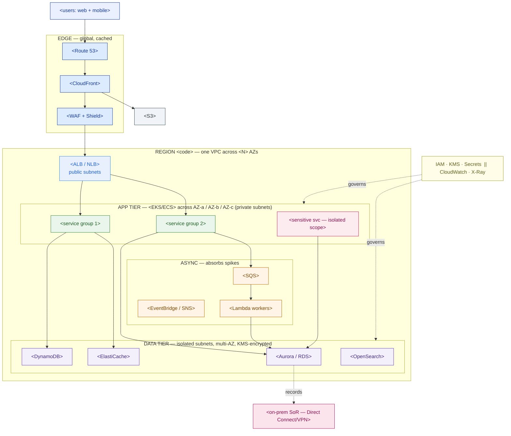

# AWS Reference Architecture — Target-State Template

> Fill this in when a customer asks "give us the target state on AWS." The goal is not to list services — it's to name the ~15 that carry the workload and **defend each against the customer's own drivers** (cost, lock-in, elasticity, residency, latency…). An executive should read the diagram; an architect should trust the tables.

**Customer:** `<company>`  ·  **Workload:** `<the app/system being mapped>`  ·  **Prepared by:** `<SA name>`  ·  **Date:** `<YYYY-MM-DD>`
**Opportunity:** `<deal / project>`  ·  **Version:** `<v0.1 draft>`

Legend: **SoR** = system of record · **AZ** = Availability Zone · **HPA** = Horizontal Pod Autoscaler · lock-in rated **Low / Med / High**.

---

## 0. Drivers first (rank them — they decide every choice)

> List the customer's drivers in priority order. Every service pick below must cite at least one.

| Rank | Driver | Why it matters here | The constraint it imposes |
|---|---|---|---|
| 1 | `<e.g. residency>` | `<…>` | `<e.g. Region pinned to ap-southeast-3>` |
| 2 | `<e.g. cost>` | | |
| 3 | `<e.g. lock-in / portability>` | | |
| 4 | `<e.g. elasticity>` | | |

## 1. Region & AZ placement (residency decides this first)

- **Primary Region:** `<region code + name, e.g. ap-southeast-3 Jakarta>` — chosen because `<residency / latency / cost>`.
- **Secondary / DR Region:** `<region or "none">` — `<what may/may not replicate there>`.
- **AZ span:** `<≥2 — usually 3>` for anything that must survive a data-center failure.
- **Residency boundary:** `<which data must NOT leave the Region, and how it's enforced>`.

## 2. Service selection by tier

> For each tier, name the service *and the one-line defense*. Delete tiers the workload doesn't need; don't add tiers it doesn't.

| Tier | AWS service(s) | Alternative considered | Defense (driver it serves) | Lock-in |
|---|---|---|---|---|
| **Edge / CDN / DNS** | `<CloudFront · Route 53 · WAF/Shield>` | `<…>` | `<offload reads / DDoS>` | `<L/M/H>` |
| **Load balancing** | `<ALB / NLB>` | | | |
| **Compute** | `<EKS / ECS / Fargate / EC2 / Lambda>` | `<…>` | `<portability / burst / lift-shift>` | |
| **Async / events** | `<SQS · SNS · EventBridge · MSK>` | | `<absorb spike / decouple>` | |
| **Database (SQL)** | `<Aurora / RDS>` | | `<ACID / read scale>` | |
| **Database (NoSQL)** | `<DynamoDB>` | | `<throughput / spiky>` | |
| **Cache** | `<ElastiCache Redis / Memcached>` | | `<hot reads / counters>` | |
| **Search** | `<OpenSearch Service>` | | `<faceted browse>` | |
| **Object storage** | `<S3>` | | `<media / static / lake / backup>` | |
| **Identity & secrets** | `<IAM (+IRSA) · KMS · Secrets Manager>` | | `<least-privilege / encryption>` | |
| **Observability** | `<CloudWatch · X-Ray via ADOT>` | | `<metrics/logs/traces; portable>` | |
| **Scaling** | `<Karpenter/Cluster Autoscaler · App Auto Scaling>` | | `<absorb + shed spike>` | |
| **Hybrid / on-prem link** | `<Direct Connect · Site-to-Site VPN>` | | `<reach ERP/on-prem SoR>` | |

*Rule:* if you can't write the Defense column, you don't yet have a reason to include the service.

## 3. The architecture (Mermaid skeleton)

> Replace the placeholders. Keep the shape: edge → load balancer → app tier across AZs → async → data tier in isolated subnets, with identity/observability cross-cutting and any hybrid link to on-prem.



### ASCII fallback (for docs/email that can't render Mermaid)

```
   IDENTITY & OBSERVABILITY   IAM · KMS · Secrets  |  CloudWatch · X-Ray   ── spans all
   ────────────────────────────────────────────────────────────────────────────────────
   EDGE          <Route 53> → <CloudFront> → <WAF/Shield>          (offloads read traffic)
   LB            <ALB / NLB>   (public subnets, multi-AZ)
   APP TIER      <EKS/ECS pods> across AZ-a / AZ-b / AZ-c          (private subnets)
   ASYNC         <SQS> buffer → <Lambda> workers ; <EventBridge> fan-out
   DATA TIER     <Aurora> · <DynamoDB> · <ElastiCache> · <OpenSearch>   (isolated subnets)
   OBJECT        <S3>  (media/static/lake/backup)   HYBRID → <Direct Connect> → on-prem SoR
```

## 4. Sizing — assumptions with ranges (never a single number)

> Start from the customer's *given* volumes, show the arithmetic, label every estimate `ASSUME` with a range, and map each to the service that carries it.

```
 GIVEN:   <given volume, e.g. N orders/day> · <peak/flash behavior> · <read:write shape>
 ─────────────────────────────────────────────────────────────────────────────
 Baseline rate    = <given> / 86,400 s              ≈ <X>/sec
 ASSUME peak factor <a–b>x average                  ≈ <range>/sec
 ASSUME flash/peak <c>x                              ≈ <range>/sec
 ASSUME read:write <d–e>:1                           ≈ <range> reads/sec
 ─────────────────────────────────────────────────────────────────────────────
 → <write path> sized to sustain ~<peak> on <service>
 → <read path> absorbed by <cache/CDN/on-demand> at the edge
 → <compute> sized to steady base; <autoscaler> adds capacity for the spike
```

## 5. Well-Architected self-check (grade your own diagram)

| Pillar | Question | This design's answer |
|---|---|---|
| Operational Excellence | Can you run & observe it? | `<…>` |
| Security | Who can touch what; encrypted? | `<IAM least-priv, KMS, isolated scope>` |
| Reliability | Survives an AZ failure? | `<multi-AZ + async buffers>` |
| Performance Efficiency | Right service, right size? | `<store-per-job justification>` |
| Cost Optimization | Pay only for what you use? | `<scale-down + Savings Plans on base>` |
| Sustainability | Minimizing waste? | `<right-sizing / scale-to-zero>` |

## 6. Cost-driver + lock-in scorecard

> The table 3.6 (multi-cloud compare) and a FinOps review will both ask for. Cost driver = the unit you're billed on; lock-in = how portable the choice is.

| Service | Primary cost driver | Lock-in | Portable equivalent (if lock-in becomes #1) |
|---|---|---|---|
| `<EKS>` | `<per node-hour + control plane>` | `<Med>` | `<AKS/GKE/on-prem K8s — same API>` |
| `<Aurora>` | `<per ACU / instance-hour + I/O>` | `<Med>` | `<RDS PostgreSQL / self-managed PG>` |
| `<DynamoDB>` | `<per request (on-demand) / RCU-WCU>` | `<High>` | `<Cassandra / MongoDB — app rewrite>` |
| `<S3>` | `<per GB-month + requests>` | `<Low>` | `<any S3-compatible object store>` |
| `<SQS/EventBridge>` | `<per message / event>` | `<High>` | `<Kafka/MSK — more portable>` |

## 7. Findings & the one-line target-state statement

| # | Decision | Driver served | Trade-off accepted |
|---|---|---|---|
| 1 | `<e.g. EKS over ECS>` | `<portability>` | `<more ops effort>` |
| 2 | `<e.g. DynamoDB for cart>` | `<elasticity>` | `<lock-in, bounded>` |
| 3 | `<…>` | | |

**One-line target-state statement (fill in):**
> The proposed AWS target state runs `<workload>` on `<core compute>` across `<N>` AZs in `<Region>`, uses `<stores>` for `<data shapes>`, absorbs `<spike>` with `<async + autoscaling>`, and pins `<residency-bound data>` to `<Region>` — chosen to serve `<top drivers>` while accepting `<the named lock-in>` where it pays for itself.

---

*Worked example: see `example-pasarkita-aws-reference-architecture.md` in this folder.*
