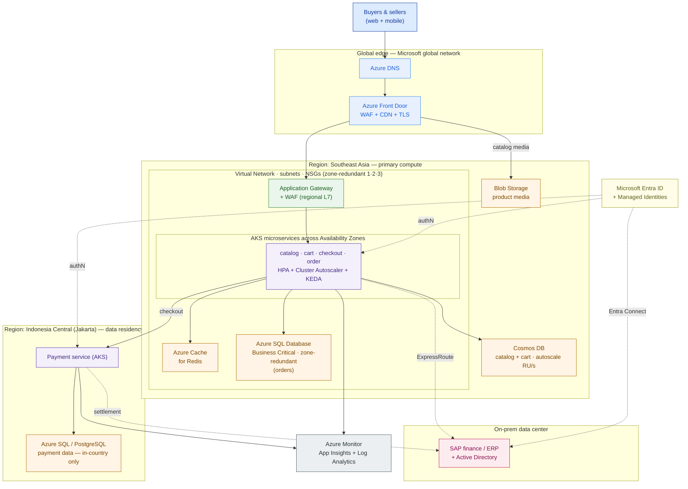

# Azure for Architects

> Azure is not "AWS with different names." It's an identity-first, enterprise-and-hybrid cloud — map the workload onto its core services and its differences become your winning arguments.

**Type:** Design
**Track:** AI, Data & Infrastructure Solution Architect (Presales)
**Prerequisites:** 3.2 AWS for Architects
**Time:** ~5h
**Lab:** free tier
**Ship It:** Azure reference architecture

## The Problem

You designed **PasarKita**'s reference architecture on AWS last lesson. PasarKita is an Indonesian e-commerce marketplace — **~15M active buyers**, **~200,000 sellers**, **~2M orders/day**, with **flash sales that spike traffic ~10×** for hours at a time. Today it runs a checkout/catalog monolith plus microservices on a **single public cloud**, with **finance and ERP on-prem**, and a Kubernetes platform team that wants **portability**, not deeper lock-in. The buying drivers the CTO keeps repeating are **cost, lock-in, elasticity, and data residency** — and one hard constraint from the regulator: **payment data must stay in Indonesia.**

Now the board has signed a Microsoft **Enterprise Agreement**, the corporate directory is already **Microsoft Entra ID**, and the on-prem SAP finance stack runs on Windows joined to Active Directory. The CTO wants the same reference architecture priced and drawn on **Azure**. The trap that sinks junior architects here is treating Azure as a find-and-replace on the AWS diagram — "ALB becomes Load Balancer, IAM becomes IAM, done." It isn't. Azure's regional L7 load balancer is **Application Gateway**, but its *global* edge is **Azure Front Door** — a different box AWS folds into CloudFront + ALB. Azure has no monolithic "IAM"; access is **Entra ID** (identity) plus **Azure RBAC** (authorization) plus **Managed Identities** (service-to-service), an identity-first model that behaves differently from AWS IAM roles. Miss these and your Azure design is subtly wrong in the exact places the customer's Azure architects will poke.

An SA's job in this lesson is two things. **First, translate** the PasarKita reference architecture into Azure's real, vendor-accurate service names — the compute, storage, database, network, identity, and observability boxes. **Second, know where Azure genuinely differs** and lean into it: the identity-centric model built around Entra ID, the strongest hybrid story in the market (ExpressRoute, Azure Arc, Entra Connect to that on-prem AD), and the enterprise-agreement commercial motion that a Microsoft-anchored customer like PasarKita already lives inside. Get both right and you don't just re-price the AWS design — you show why, for *this* customer, Azure is a defensible choice.

## The Concept

Azure organizes everything as an **identity-first hierarchy**, not a flat set of accounts. Learn this spine before the service list, because it changes how you scope isolation, cost, and governance:

```
Microsoft Entra ID Tenant   (the identity boundary — one directory for the whole org)
        │
        ├─ Management Groups   (policy & RBAC applied to many subscriptions at once)
        │        │
        │        └─ Subscriptions   (billing + isolation boundary ≈ an AWS account)
        │                 │
        │                 └─ Resource Groups   (lifecycle unit — deploy/delete together)
        │                          │
        │                          └─ Resources   (VNet, AKS, SQL DB, storage account…)
```

An AWS **account** maps roughly to an Azure **subscription**; AWS **Organizations OUs** map to **management groups**; there is no AWS equivalent of the **resource group** (a lifecycle grouping you deploy and tear down as a unit). And critically, identity lives *above* all of it in one **Entra ID tenant** — the same directory that already holds PasarKita's employees.

### The Azure core-service map, by category

An architect carries this map in their head so they can name the right box in a whiteboard session. Learn it by **category**, not alphabetically — the category is the decision, the service is the option.

```
  ┌───────────────────────────────────────────────────────────────────────────────┐
  │ IDENTITY  (cross-cutting)   Microsoft Entra ID · Managed Identities · Azure RBAC │
  └───────────────────────────────────────────────────────────────────────────────┘
  COMPUTE            STORAGE           DATABASE                 NETWORK & EDGE
  ───────            ───────           ────────                 ──────────────
  Virtual Machines   Blob Storage      Azure SQL Database       Virtual Network (VNet)
  VM Scale Sets      Managed Disks     Azure Cosmos DB          Subnets · NSG
  AKS (Kubernetes)   Azure Files       Azure Database for       Azure Load Balancer (L4)
  App Service                            PostgreSQL             Application Gateway (L7 + WAF)
  Azure Functions                      Azure Cache for Redis    Azure Front Door (global + CDN)
  Azure Container Apps                                          Azure DNS

  OBSERVABILITY   Azure Monitor  ·  Application Insights  ·  Log Analytics
  FOUNDATION      Tenant ▸ Management Groups ▸ Subscriptions ▸ Resource Groups ▸ Resources
  PLACEMENT       Regions ▸ Availability Zones ▸ Paired regions   (Indonesia Central = residency)
```

**Compute** is a ladder from most control to least: **Virtual Machines** (raw IaaS) → **Virtual Machine Scale Sets / VMSS** (autoscaling VM fleets) → **Azure Kubernetes Service / AKS** (managed Kubernetes) → **Azure Container Apps** (serverless containers, scale-to-zero) → **Azure App Service** (managed web apps/PaaS) → **Azure Functions** (event-driven functions). More control means more to operate; less control means more of the undifferentiated work is Microsoft's.

**Storage** splits by shape: **Blob Storage** for objects (images, backups, static catalog media), **Managed Disks** for block storage attached to VMs/AKS nodes, **Azure Files** for shared SMB/NFS file shares. **Database** splits by workload: **Azure SQL Database** (managed, strongly-consistent relational — the transactional workhorse), **Azure Database for PostgreSQL** (managed open-source relational, the portable choice), **Cosmos DB** (globally-distributed, low-latency NoSQL with elastic throughput), and **Azure Cache for Redis** (in-memory cache/session/counter store).

**Networking & edge** is where the AWS habits bite. A **Virtual Network (VNet)** with **subnets** and **Network Security Groups (NSG)** is your private network. Inside a region, **Azure Load Balancer** does L4 and **Application Gateway** does L7 with a **Web Application Firewall (WAF)**. Globally, **Azure Front Door** is the anycast edge — TLS termination, WAF, CDN caching, and latency-based routing across regions — and **Azure DNS** resolves your names. **Identity** is **Microsoft Entra ID** (formerly Azure AD) with **Managed Identities** for passwordless service-to-service auth. **Observability** is **Azure Monitor**, with **Application Insights** for app telemetry and **Log Analytics** as the query backend.

### Regions, availability zones, and residency

Placement in Azure has three levels that decide resilience and residency:

- **Region** — a geography of data centers (e.g., **Southeast Asia** in Singapore, **Indonesia Central** in Jakarta). Residency is decided *here*: pick the region and the data physically lives there.
- **Availability Zones (AZs)** — physically separate data centers *within* one region, with independent power/cooling/network. Spreading AKS nodes, Azure SQL, and gateways across **zones 1·2·3** survives a data-center failure without leaving the region. (Newer regions may launch with fewer than three zones — verify before you promise zone-redundancy.)
- **Paired regions** — Azure's traditional cross-region DR relationship for platform-managed replication and staged updates. For a residency-locked workload you may *not* be allowed to use an out-of-country pair, which changes the DR design.

For PasarKita, **Indonesia Central (Jakarta)** is the residency answer: pinning the payment workload there keeps payment data in-country, satisfying Bank Indonesia / OJK expectations. Everything not bound by residency can run in the larger, more feature-complete **Southeast Asia** region.

### Two frameworks Azure architects are graded against

- **Azure Well-Architected Framework (WAF)** — five pillars every design is reviewed on: **Reliability, Security, Cost Optimization, Operational Excellence, Performance Efficiency.** Use it as your self-review checklist before the customer's architects do.
- **Cloud Adoption Framework (CAF)** — the operating-model journey: **Strategy → Plan → Ready (landing zones) → Adopt (Migrate/Innovate) → Govern → Manage → Secure.** CAF is where "landing zone" (from 3.1) becomes an Azure-specific artifact — the enterprise-scale scaffolding of management groups, subscriptions, and policy your workload lands into.

### The commercial model is part of the architecture

At architect altitude, cost is a design input, not an afterthought — and Azure's cost levers are specific enough that you must name them:

- **Enterprise Agreement (EA) / Microsoft Customer Agreement** — the negotiated spend commitment PasarKita already signed; discounts flow through it automatically.
- **Reserved Instances & Savings Plans** — 1- or 3-year commitments on steady-state compute (the always-on checkout floor) for large discounts vs pay-as-you-go.
- **Spot Virtual Machines** — deeply discounted, interruptible capacity for stateless/batch work (image processing, the flash-sale scale-out pool).
- **Azure Hybrid Benefit** — reuse existing Windows Server / SQL Server licenses (PasarKita has on-prem Windows) to cut VM/SQL cost — a lever AWS can't fully match for a Microsoft-licensed shop.

The takeaway: the **cost** driver isn't served by picking cheaper boxes — it's served by matching each tier to the right *commercial* instrument (reserved floor, Spot ceiling, Hybrid Benefit on Windows).

## Design It

Build PasarKita's **checkout + catalog** on Azure. Work outside-in: edge, then network, then compute, then data, then the residency and hybrid constraints. State assumptions as ranges — you never present a single magic number.

### Step 1 — Landing zone and network foundation

Land the workload in an **enterprise-scale landing zone** (CAF): a management-group hierarchy with a dedicated **subscription** for production. Inside it, one **Virtual Network** per region, carved into **subnets** — a gateway subnet (Application Gateway), an AKS subnet, a data subnet (private endpoints for SQL/Cosmos/Redis), and a subnet for the hybrid connection. **Network Security Groups** restrict east-west traffic; databases are reached only through **Private Endpoints**, never the public internet. Make the VNet and every tier **zone-redundant** across AZ 1·2·3.

### Step 2 — Global edge

Put **Azure Front Door** at the front: anycast TLS termination, a **WAF** policy (block the OWASP ruleset and bot floods that ride flash sales), and **CDN** caching. Front Door serves **catalog media directly from Blob Storage** at the edge, so product images never touch your compute during a spike. **Azure DNS** hosts `pasarkita.co.id` and points the apex at Front Door.

### Step 3 — Regional entry and microservices

Behind Front Door, a regional **Application Gateway** (with WAF) is the L7 ingress into the private VNet. It routes to **AKS**, where the catalog, cart, checkout, and order microservices run as pods spread across the three zones. The **~10× flash-sale spike** is handled with three autoscalers working together:

- **Horizontal Pod Autoscaler (HPA)** scales pods on CPU/memory/custom metrics.
- **Cluster Autoscaler** adds/removes nodes (backed by **VMSS** node pools) as pods demand.
- **KEDA** scales event-driven consumers (e.g., order-queue workers) on queue depth, and lets stateless services scale toward zero off-peak.

Use a **Spot node pool** for interruptible, stateless work (image processing, batch) to cut cost, and an on-demand pool for checkout. Sizing sanity-check: ~2M orders/day is **~23 orders/s** averaged over 24h, but orders concentrate in an active window and each order drives **20–50× more read requests** (browse, search, cart). Plan steady-state for a **~50–150 req/s order path with ~2,000–7,000 req/s of reads**, and a flash-sale peak of **~10× that** — a band, sized from the given numbers, not a promise.

### Step 4 — Data tier

Match each data shape to the right store:

- **Orders / checkout (transactional, strongly consistent):** **Azure SQL Database**, Business Critical tier, **zone-redundant**. This is the money path; it wants ACID and failover inside the region.
- **Catalog + cart (flexible schema, spiky, low-latency reads):** **Azure Cosmos DB** with **autoscale RU/s** so throughput follows the flash-sale curve automatically. Cosmos absorbs the 10× read burst that would melt a single relational primary.
- **Hot reads, sessions, flash-sale inventory counters:** **Azure Cache for Redis** in front of both databases — the cache is what actually survives a 10× spike.
- **Product media:** **Blob Storage**, delivered through Front Door's CDN (Step 2).

### Step 5 — Payment residency (the hard constraint)

Payment data **must stay in Indonesia**. Split the payment service into its own workload pinned to **Indonesia Central (Jakarta)**: a payment/wallet service on AKS with its data in **Azure SQL Database or Azure Database for PostgreSQL**, with **geo-replication disabled or kept strictly in-country** — no paired-region copy that lands data offshore. The main checkout flow (Southeast Asia) calls the payment service across a private connection; only the non-sensitive order record leaves Indonesia Central. This is the single most important line in the design for this customer.

### Step 6 — Identity, hybrid, observability, portability

- **Identity:** services authenticate to SQL, Cosmos, Redis, and Blob using **Managed Identities** (no secrets in code). Customer sign-in uses **Microsoft Entra External ID**; staff and RBAC use the existing **Entra ID** tenant.
- **Hybrid:** connect the VNet to the on-prem SAP finance/ERP over **ExpressRoute** (private, predictable latency) with a **VPN Gateway** as backup, and sync the on-prem **Active Directory** into Entra ID with **Entra Connect** so identity is one story across cloud and DC.
- **Observability:** **Azure Monitor** + **Application Insights** (traces, request rates, the flash-sale dashboards) + **Log Analytics** as the query/alert backend.
- **Portability (the platform team's ask):** AKS is CNCF-conformant Kubernetes, so manifests stay portable. Manage AKS *and* on-prem/other-cloud clusters from one control plane with **Azure Arc-enabled Kubernetes** and GitOps. Be honest about the lock-in trade: Cosmos DB is proprietary (stickier, but elastic); **PostgreSQL + Redis + standard K8s** are the portable substitutes if lock-in outranks elasticity.

### The reference architecture



**Assumptions (stated, with ranges):** flash-sale peak ≈ **10×** steady state (given); active-window order rate **~50–150/s** with reads **20–50× higher**; Cosmos DB autoscale set to cover the peak RU/s band; AKS 3-zone spread assumes Southeast Asia offers 3 AZs (verify Indonesia Central's zone count before promising zone-redundancy for payments); ExpressRoute at **1 Gbps** class for on-prem settlement traffic. Right-size these against a real load test before the BOM.

## Compare It

### The compute ladder — which box runs the microservices?

| Option | What it is | Pick it when… | Watch out for |
|---|---|---|---|
| **Virtual Machines / VMSS** | Raw IaaS + autoscaling fleets | Lift-and-shift, custom OS, licensing tied to VMs | You operate patching, scaling, HA yourself |
| **AKS** | Managed Kubernetes | You have a **K8s platform team wanting portability** (PasarKita) and many microservices | Cluster ops, upgrades, capacity — real operational load |
| **Azure Container Apps** | Serverless containers, scale-to-zero, built on K8s | Event-driven or bursty services without wanting to run a cluster | Less control than AKS; not a full K8s API |
| **App Service** | Managed web-app PaaS | A monolith or classic web app you want to host, not orchestrate | Not ideal for a large microservice mesh |
| **Azure Functions** | Event-driven functions | Glue, webhooks, short async tasks | Cold starts; not for long-running stateful services |

For PasarKita, **AKS** wins because it directly serves the portability driver and the platform team already thinks in Kubernetes — Container Apps is the pragmatic option for a smaller team that wants containers without cluster ops.

### Azure SQL Database vs Cosmos DB

| | **Azure SQL Database** | **Azure Cosmos DB** |
|---|---|---|
| Model | Relational, ACID, strong consistency | NoSQL (document/key-value), tunable consistency |
| Best for | Orders, payments, anything transactional | Catalog, cart, sessions, spiky high-throughput reads |
| Scaling | Vertical + read replicas; zone-redundant | Elastic **autoscale RU/s**, global distribution |
| Lock-in | Moderate (T-SQL; portable-ish) | **High** (proprietary API/RUs) |
| PasarKita role | System of record for orders | Absorbs the 10× catalog/cart burst |

The rule: **relational for the money, Cosmos for the flood.** Don't force one engine to do both.

### Azure's real edge vs AWS — identity and hybrid

This is where "same workload, different cloud" stops being cosmetic and becomes a *reason to choose Azure* for a customer like PasarKita:

| Dimension | AWS | Azure | Why it matters for PasarKita |
|---|---|---|---|
| Identity | IAM (per-account) + IAM Identity Center | **Entra ID** — one org-wide directory, already holds their staff | Corporate identity is *already* Entra; SSO and RBAC come "for free" |
| Service-to-service auth | IAM roles | **Managed Identities** | Passwordless, no secrets in code |
| Hybrid connectivity | Direct Connect | **ExpressRoute** + **Entra Connect** to on-prem AD | On-prem SAP + AD integrate cleanly |
| Multi/hybrid K8s & governance | EKS Anywhere, Systems Manager | **Azure Arc** (one control plane over AKS, on-prem, other clouds) | Directly serves the **portability** driver |
| Commercial motion | Consumption / EDP | **Enterprise Agreement** (already signed) | The spend commitment and discounts already exist |

Azure isn't strictly "better" — for a greenfield, cloud-native startup with no Microsoft footprint, AWS or GCP may fit better. But PasarKita is **Microsoft-anchored, hybrid, and identity-heavy**, and that is exactly the shape Azure is strongest for. Say that in the room, and back it with this table.

## Ship It

This lesson ships an **Azure Reference Architecture** deliverable — the artifact you attach to an HLD or a cloud-evaluation proposal. Both files live in [`outputs/`](../outputs/):

- **[`template-azure-reference-architecture.md`](../outputs/template-azure-reference-architecture.md)** — a fill-in-the-blank template: a service-selection table by tier (edge / network / compute / data / identity / observability), a Mermaid reference-architecture skeleton, an ASCII service-category map, an assumptions-and-ranges block, and a Well-Architected self-review checklist. A colleague can run an Azure design session straight from it.
- **[`example-pasarkita-azure-architecture.md`](../outputs/example-pasarkita-azure-architecture.md)** — the template fully worked for PasarKita, with the residency-pinned payment tier, the 10×-spike autoscale plan, and the Azure-vs-AWS rationale.

This design feeds **3.6 Hybrid, Multi-Cloud & Migration** (same workload, three clouds, compared) and **Capstone C — Hybrid Cloud Enterprise Architecture.** Keep the service-mapping table; you'll set it beside the AWS and GCP versions.

### Lab — validate a design claim on the Azure free tier

You don't need to build PasarKita to prove the design's foundation is real. In **Azure Cloud Shell** (or any shell with the `az` CLI), create the resource group and the Blob storage account that would back catalog media — the exact box from Step 4 — then tear it down. Southeast Asia is used here because it's a well-established free-tier region; the real design pins *payment* data to Indonesia Central.

```bash
# 1. Sign in (skip in Cloud Shell — already authenticated)
az login

# 2. Create a resource group (the lifecycle unit)
az group create \
  --name rg-pasarkita-lab \
  --location southeastasia

# 3. Create the Blob storage account that would serve catalog media
az storage account create \
  --name pasarkitalab$RANDOM \
  --resource-group rg-pasarkita-lab \
  --location southeastasia \
  --sku Standard_LRS \
  --kind StorageV2

# 4. List it — confirm the account exists and note its location (residency check)
az storage account list \
  --resource-group rg-pasarkita-lab \
  --query "[].{name:name, location:primaryLocation, sku:sku.name}" \
  --output table

# 5. Clean up so you owe nothing
az group delete --name rg-pasarkita-lab --yes --no-wait
```

The claim you just validated: a resource group is the deploy/delete unit, a storage account is region-pinned (so **residency is a placement decision**), and `Standard_LRS` is locally-redundant. Change `southeastasia` to `indonesiacentral` and re-run the list query to see residency move — that one-word change *is* the payment-data control in the design.

## Exercises

1. **(Easy)** Translate the AWS→Azure service names. For each AWS service, write the Azure equivalent and one sentence on any behavioral difference: **ALB, CloudFront, S3, DynamoDB, RDS (PostgreSQL), ElastiCache, EKS, Lambda, IAM role, Route 53.** Flag the two where the mapping is *not* one-to-one (hint: the global edge, and identity).
2. **(Medium)** Re-target the residency constraint. PasarKita expands to the **Philippines**, where regulators also demand in-country payment data, but Azure has no local region at the time. Using the regions/zones/paired-regions concept, write a half-page recommendation: where do you place the Philippine payment workload, what do you tell the customer about the residency gap, and what changes in the Mermaid diagram?
3. **(Hard)** Extend the design into a decision memo. The platform team says lock-in is now the *top* driver, above elasticity. Rework the data tier to maximize portability (name the concrete service swaps), quantify what you lose by dropping Cosmos DB for the catalog under a 10× flash sale, and add an **Azure Arc** portability story. Combine it with your 3.2 AWS design to show the customer a like-for-like, two-cloud comparison — the seed of the 3.6 multi-cloud lesson and Capstone C.

## Key Terms

| Term | What people say | What it actually means |
|------|-----------------|------------------------|
| Microsoft Entra ID | "Azure AD" / "Azure's IAM" | The org-wide identity directory (renamed from Azure AD). Identity is *above* subscriptions; authorization is separate (**Azure RBAC**), and service-to-service auth is **Managed Identities**. Not a like-for-like AWS IAM. |
| Subscription | "An Azure account" | The billing + isolation boundary, roughly an AWS account. Grouped by **management groups**; contains **resource groups**. |
| Resource Group | "A folder for resources" | A **lifecycle** unit — resources you deploy, tag, RBAC, and delete *together*. No direct AWS equivalent. |
| Application Gateway | "Azure's load balancer" | The **regional L7** load balancer with a WAF. The global edge is a *different* service — **Azure Front Door** — a split AWS handles with CloudFront + ALB. |
| Azure Front Door | "A CDN" | The global anycast edge: TLS, WAF, CDN caching, and latency routing across regions. Your first line of defense in a flash sale. |
| Cosmos DB | "Azure's NoSQL" | Globally-distributed, low-latency NoSQL billed in **Request Units (RU/s)** with autoscale. Great for spiky reads; proprietary, so higher lock-in. |
| Availability Zone | "A data center" | Physically isolated data centers *within* a region. Zone-redundancy survives one DC failure without leaving the region — but not every region has three. |
| Paired region | "Azure's DR" | A platform-managed cross-region relationship for replication/DR. For residency-locked data an out-of-country pair may be **prohibited** — it reshapes DR. |
| Azure Arc | "Hybrid management" | One control plane to govern AKS, on-prem, and other-cloud Kubernetes/servers. The concrete answer to a "we want portability" driver. |
| Well-Architected Framework | "Best practices" | The five review pillars (Reliability, Security, Cost, Operational Excellence, Performance) every Azure design is judged against. Self-review before the customer does. |

## Further Reading

- [Azure Architecture Center — reference architectures](https://learn.microsoft.com/azure/architecture/) — Microsoft's own vetted patterns (microservices on AKS, e-commerce, multi-region); the closest thing to a cheat sheet for this lesson.
- [Azure Well-Architected Framework](https://learn.microsoft.com/azure/well-architected/) — the five-pillar review model; skim it so your design survives the customer's architecture review.
- [Cloud Adoption Framework for Azure](https://learn.microsoft.com/azure/cloud-adoption-framework/) — how "landing zone" becomes an Azure enterprise-scale artifact; ties 3.1 to this lesson.
- [Azure regions and availability zones](https://learn.microsoft.com/azure/reliability/availability-zones-overview) and the [Azure regions list](https://learn.microsoft.com/azure/reliability/regions-list) — confirm which regions (Indonesia Central, Southeast Asia) exist and how many zones they have *before* you promise residency or zone-redundancy.
- [What is Microsoft Entra ID?](https://learn.microsoft.com/entra/fundamentals/whatis) and [Managed identities for Azure resources](https://learn.microsoft.com/entra/identity/managed-identities-azure-resources/overview) — the identity-first model that most distinguishes Azure from AWS; the core of your "why Azure" argument.
- [Azure Kubernetes Service (AKS) documentation](https://learn.microsoft.com/azure/aks/) and [Azure Arc-enabled Kubernetes](https://learn.microsoft.com/azure/azure-arc/kubernetes/overview) — the compute + portability spine of the PasarKita design.
