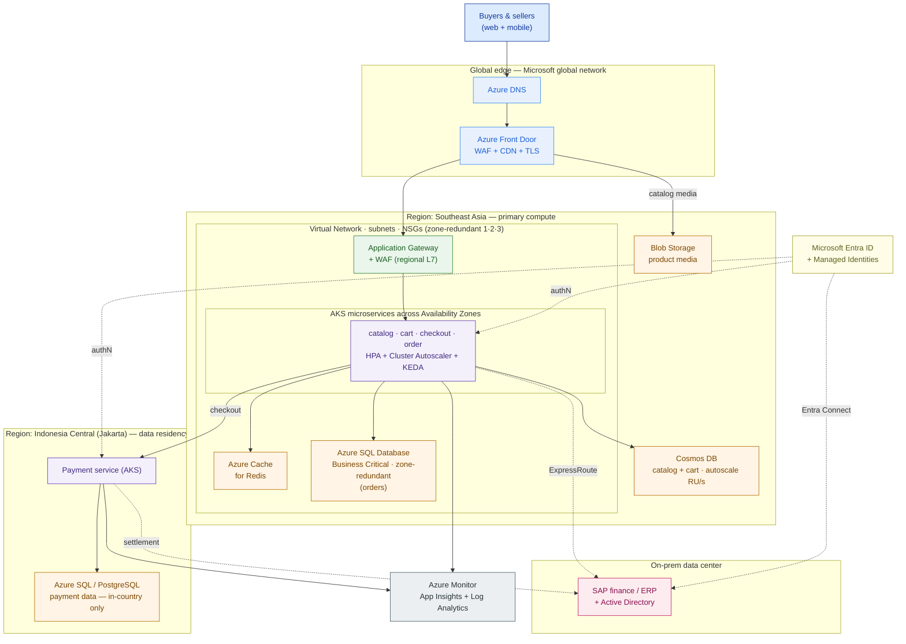

# Azure Reference Architecture — PasarKita (worked example)

> This is `template-azure-reference-architecture.md` filled in for PasarKita. It is the same workload the AWS lesson (3.2) placed on AWS and the GCP lesson (3.4) will place on GCP — keep all three side by side for the 3.6 multi-cloud comparison and Capstone C.

**Customer:** PasarKita (fictional)  ·  **Industry:** E-commerce marketplace (Indonesia)
**Prepared by:** SA — Presales  ·  **Date:** 2026-07-05  ·  **Opportunity:** Cloud platform evaluation (Azure track)  ·  **Version:** v0.2

**Company shape:** ~15M active buyers · ~200,000 sellers · ~2M orders/day · flash sales spike traffic **~10×** for hours.
**Today:** checkout/catalog monolith + microservices on a single public cloud; finance/ERP on-prem; K8s platform team wants portability.
**Buying drivers (ranked):** ① data residency (hard) · ② cost · ③ lock-in · ④ elasticity.
**Hard constraints:** payment data must stay in Indonesia (Bank Indonesia / OJK); on-prem SAP finance/ERP on Windows + Active Directory; signed Microsoft Enterprise Agreement; corporate directory already Microsoft Entra ID.

---

## 1. Service selection by tier

| Tier | Azure service chosen | Alternatives considered | Why (driver) |
|---|---|---|---|
| **Global edge** | Azure Front Door (WAF + CDN + TLS) | Azure CDN alone; Traffic Manager | Absorbs the flash-sale flood at the edge; blocks bots; caches catalog media |
| **DNS** | Azure DNS | — | Hosts `pasarkita.co.id`, alias to Front Door |
| **Regional L7 ingress** | Application Gateway + WAF (AGIC into AKS) | Load Balancer (L4); NGINX ingress | Path routing + second WAF layer inside the VNet |
| **Compute** | AKS (microservices) | Container Apps; App Service | **Portability driver** + existing K8s platform team |
| **Autoscale** | HPA + Cluster Autoscaler (VMSS pools) + KEDA | VMSS scale rules | Rides the **~10×** spike; scales queue workers on depth |
| **Transactional DB** | Azure SQL Database (Business Critical, zone-redundant) | Azure Database for PostgreSQL | ACID for the order/checkout money path |
| **NoSQL / high-throughput** | Azure Cosmos DB (autoscale RU/s) | PostgreSQL + Redis | Elastic catalog/cart reads during the spike |
| **Cache / session** | Azure Cache for Redis | — | Hot catalog reads, sessions, flash-sale counters |
| **Object storage / media** | Blob Storage (via Front Door CDN) | Azure Files | Product images served at the edge, off compute |
| **Identity** | Microsoft Entra ID + Managed Identities | — | Corporate tenant already exists; passwordless service auth |
| **Customer sign-in** | Microsoft Entra External ID | — | Buyer/seller authentication |
| **Hybrid link** | ExpressRoute (+ VPN Gateway backup) | VPN only | Private, predictable link to on-prem SAP |
| **Portability / multi-cloud** | Azure Arc-enabled Kubernetes + GitOps | — | One control plane over AKS + on-prem/other-cloud clusters |
| **Observability** | Azure Monitor + Application Insights + Log Analytics | — | Flash-sale dashboards, tracing, alerting |

## 2. Placement & residency

| Concern | Decision | Note |
|---|---|---|
| Primary region | **Southeast Asia** (Singapore) | Feature-complete, 3 AZs — runs checkout/catalog/order + data |
| Residency-pinned region | **Indonesia Central** (Jakarta) | Payment/wallet service + its data live here only |
| Availability zones | Zone-redundant across 1·2·3 in Southeast Asia | **Verify** Indonesia Central's zone count before promising zone-redundant payments |
| Cross-region DR | In-country only for payments; Southeast Asia workloads may use a compliant pair | An offshore pair is **prohibited** for payment data |

**Residency rule (write it down):** payment and wallet records live in **Indonesia Central** with **geo-replication disabled / kept strictly in-country**. Only the non-sensitive order record crosses back to Southeast Asia. This single line is the reason Azure is even in the running — it has an Indonesian region.

## 3. Reference architecture



### ASCII service-category map

```
  IDENTITY (cross-cutting)   Microsoft Entra ID · Managed Identities · Azure RBAC
  ──────────────────────────────────────────────────────────────────────────────
  COMPUTE          STORAGE         DATABASE                NETWORK & EDGE
  AKS (micro-svc)  Blob (media)    Azure SQL (orders)      Front Door (global+CDN+WAF)
  VMSS node pools  Managed Disks   Cosmos DB (catalog/cart) App Gateway (L7+WAF)
  KEDA workers                     Cache for Redis (hot)    VNet · subnets · NSG · Azure DNS
  ──────────────────────────────────────────────────────────────────────────────
  OBSERVABILITY  Azure Monitor · Application Insights · Log Analytics
  PLACEMENT      Southeast Asia + AZ 1·2·3   |   Indonesia Central = payment residency
  HYBRID         ExpressRoute (+VPN) → on-prem SAP + AD ; Entra Connect syncs AD → Entra ID
```

## 4. Assumptions & sizing (ranges, with the math)

| Quantity | Assumption | Range | Basis |
|---|---|---|---|
| Order rate (active window) | orders concentrate in ~8h, not flat 24h | **~50–150 orders/s** | 2M/day ÷ 86,400s ≈ 23/s avg; ÷ active window and peak-of-day → band |
| Read rate | each order drives 20–50× browse/search/cart reads | **~2,000–7,000 req/s** | order band × read multiplier |
| Flash-sale peak | given ~10× steady state | **~10×** the bands above | customer-stated |
| AKS nodes | on-demand pool for checkout + Spot for stateless | **min ~6 → max ~40+** | peak req/s ÷ per-node capacity; validate by load test |
| Cosmos DB | autoscale RU/s sized to peak reads | scales with the 10× curve | RU/s ≈ f(peak read mix) |
| ExpressRoute | on-prem settlement + AD sync | **~1 Gbps class** | low steady volume, predictable |

**Sizing note:** these are a starting band from the *given* PasarKita numbers, not promises. The 10× spike is what sizes the ceiling; a flash-sale load test sets the real max-node and RU/s numbers before any BOM.

## 5. Well-Architected self-review

- [x] **Reliability** — AKS, Azure SQL, gateways zone-redundant across AZ 1·2·3; payment DR kept in-country (no offshore pair).
- [x] **Security** — private endpoints for SQL/Cosmos/Redis; WAF at Front Door *and* Application Gateway; Managed Identities (no secrets); least-privilege Azure RBAC.
- [x] **Cost Optimization** — Spot node pool for stateless work; autoscale floors off-peak; Enterprise Agreement + reserved capacity discounts applied.
- [x] **Operational Excellence** — Bicep/Terraform IaC; Azure Monitor alerts on the flash-sale dashboards; GitOps (Flux via Azure Arc) for AKS.
- [x] **Performance Efficiency** — Redis in front of both DBs; Front Door CDN for media; Cosmos autoscale + KEDA proven against the 10× peak in a load test.

## 6. Why Azure (the one paragraph the exec reads)

> Azure serves PasarKita's ranked drivers directly. **Residency (the hard constraint):** Azure has an in-country region — **Indonesia Central** — so payment data provably stays in Indonesia; that alone keeps Azure in the deal. **Lock-in and portability:** AKS is conformant Kubernetes and **Azure Arc** puts AKS, on-prem, and any future second cloud under one control plane — the platform team's exact ask. **Cost:** the signed **Enterprise Agreement** and reserved/Spot capacity land real discounts on day one. And the **enterprise/hybrid edge** — the corporate directory is *already* **Microsoft Entra ID**, and **ExpressRoute + Entra Connect** integrate the on-prem SAP/AD cleanly — is where Azure is a stronger fit than AWS for this specific, Microsoft-anchored customer.
>
> **The honest caveat:** for elasticity of the catalog under a 10× spike, Cosmos DB is the elegant answer but the highest-lock-in one; if the platform team promotes lock-in above elasticity, swap Cosmos for **PostgreSQL + Redis** and accept more sharding work. Naming that trade-off in the room is what makes the recommendation credible.

**So what (the pivot this design buys you):** you don't just re-draw the AWS diagram with Azure icons — you show the customer that their residency constraint, their existing Entra tenant, their on-prem AD, and their EA all point the same way, and you price the *same* workload with Azure's discounts. That is a defensible "why Azure," and it sets up the like-for-like three-cloud comparison in 3.6.
