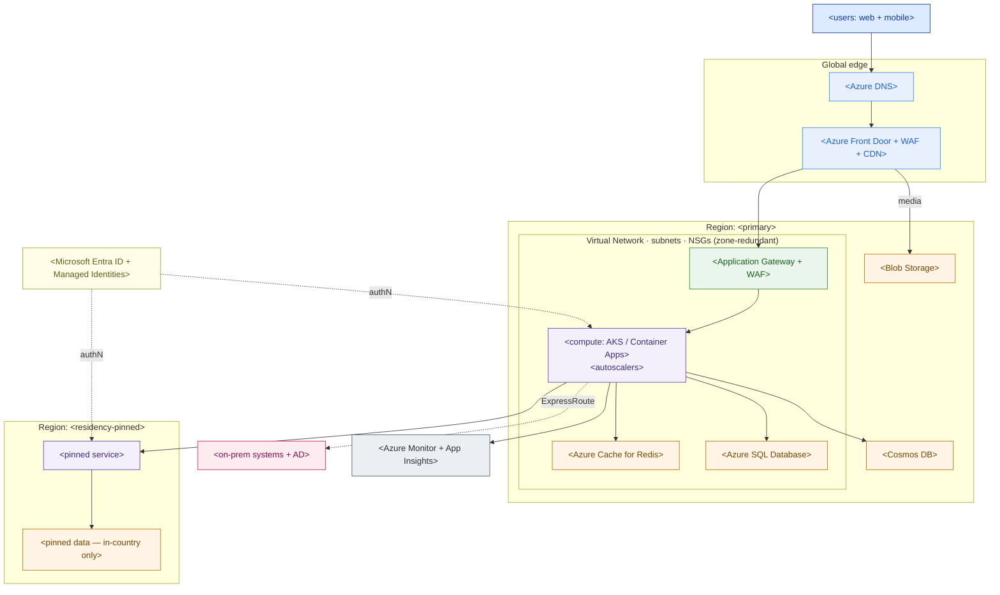

# Azure Reference Architecture — Design Template

> Fill this in when you must place a workload on Azure with vendor-accurate services and defend the choices. An executive should read the diagram; an Azure architect should trust the tables. Pair it with the landing-zone design from 3.1 and the AWS/GCP versions of the same workload for a multi-cloud comparison.

**Customer:** `<company>`  ·  **Industry:** `<industry>`  ·  **Prepared by:** `<SA name>`  ·  **Date:** `<YYYY-MM-DD>`
**Workload:** `<what you are placing on Azure>`  ·  **Opportunity:** `<deal / project>`  ·  **Version:** `<v0.1 draft>`

**Buying drivers (rank them):** `<cost / lock-in / elasticity / residency / performance / hybrid / …>`
**Hard constraints:** `<residency, compliance, latency SLOs, existing EA, on-prem systems>`

---

## How to use this template

1. **Drivers & constraints** — write down what actually decides the design (residency, lock-in, an existing Enterprise Agreement). Everything below serves these.
2. **Service selection by tier** — for each tier pick the Azure service and say *why*, in the customer's driver language.
3. **Placement** — choose region(s), availability zones, and any residency pin. This is where compliance is won or lost.
4. **Draw the map** — fill the Mermaid skeleton; keep the ASCII category map for email/docs that can't render it.
5. **Assumptions** — state sizing as ranges with the math, never a single magic number.
6. **Well-Architected self-review** — walk the five pillars before the customer's architects do.

Legend: **AZ** = availability zone · **WAF** = Web Application Firewall (the gateway feature) *and* Well-Architected Framework (the review model) — context tells you which · **RU/s** = Cosmos DB Request Units per second · **Entra** = Microsoft Entra ID.

---

## 1. Service selection by tier

> Pick one primary service per row. The "Why (driver)" column must map to a ranked driver above, or you're choosing on habit.

| Tier | Azure service chosen | Alternatives considered | Why (driver) |
|---|---|---|---|
| **Global edge** | `<Azure Front Door / Azure CDN>` | `<Traffic Manager>` | `<latency / DDoS / cache / WAF>` |
| **DNS** | `<Azure DNS>` | — | `<apex/alias routing>` |
| **Regional L7 ingress** | `<Application Gateway + WAF>` | `<Load Balancer (L4), NGINX on AKS>` | `<WAF, path routing>` |
| **Compute** | `<AKS / Container Apps / App Service / Functions / VMSS>` | `<the others on the ladder>` | `<portability / ops load / burst>` |
| **Autoscale** | `<HPA + Cluster Autoscaler + KEDA / VMSS rules>` | — | `<spike factor, cost>` |
| **Transactional DB** | `<Azure SQL Database / Azure Database for PostgreSQL>` | `<the other>` | `<consistency, lock-in>` |
| **NoSQL / high-throughput** | `<Azure Cosmos DB>` | `<PostgreSQL + Redis>` | `<elasticity vs lock-in>` |
| **Cache / session** | `<Azure Cache for Redis>` | — | `<hot reads, counters>` |
| **Object storage / media** | `<Blob Storage (+ Front Door CDN)>` | `<Azure Files>` | `<static assets>` |
| **Identity** | `<Microsoft Entra ID + Managed Identities>` | — | `<existing tenant, passwordless>` |
| **Customer sign-in** | `<Microsoft Entra External ID>` | — | `<B2C auth>` |
| **Hybrid link** | `<ExpressRoute (+ VPN Gateway backup)>` | `<VPN only>` | `<on-prem systems>` |
| **Portability / multi-cloud** | `<Azure Arc-enabled Kubernetes + GitOps>` | — | `<portability driver>` |
| **Observability** | `<Azure Monitor + App Insights + Log Analytics>` | — | `<traces, alerts>` |

## 2. Placement & residency

| Concern | Decision | Note |
|---|---|---|
| Primary region | `<e.g. Southeast Asia>` | feature-complete, more AZs |
| Residency-pinned region | `<e.g. Indonesia Central>` | `<which data must stay here + why>` |
| Availability zones | `<zone-redundant across 1·2·3? verify count>` | new regions may have <3 AZs |
| Cross-region DR | `<paired region / in-country only / none>` | residency may **prohibit** an offshore pair |

**Residency rule to write down:** `<which dataset never leaves which region, and how you enforce it (geo-replication disabled / in-country only)>`.

## 3. Reference architecture (Mermaid skeleton)

> Replace placeholders. Keep edge on top, region(s) in the middle, on-prem + identity + observability to the side. Delete tiers you don't use.



### ASCII service-category map (for docs/email that can't render Mermaid)

```
  IDENTITY (cross-cutting)   Microsoft Entra ID · Managed Identities · Azure RBAC
  ──────────────────────────────────────────────────────────────────────────────
  COMPUTE          STORAGE         DATABASE               NETWORK & EDGE
  <choice>         <choice>        <choice>               <edge / L7 / VNet>
  ──────────────────────────────────────────────────────────────────────────────
  OBSERVABILITY  Azure Monitor · Application Insights · Log Analytics
  PLACEMENT      Region <primary> + AZ 1·2·3   |   Region <pinned> = residency
```

## 4. Assumptions & sizing (ranges, with the math)

| Quantity | Assumption | Range | Basis |
|---|---|---|---|
| Baseline load | `<req/s or orders/s>` | `<low–high>` | `<derived from: … >` |
| Peak factor | `<flash/seasonal spike>` | `<e.g. 10×>` | `<given / historical>` |
| Compute floor/ceiling | `<min–max nodes/pods>` | `<low–high>` | `<peak ÷ per-unit capacity>` |
| DB throughput | `<RU/s or DTU/vCore>` | `<low–high>` | `<peak read/write mix>` |
| Hybrid link | `<ExpressRoute class>` | `<Mbps–Gbps>` | `<settlement/replication volume>` |

**Sizing note:** the achievable freshness/throughput is capped by the *slowest* tier in the path. Right-size against a real load test before turning this into a BOM.

## 5. Well-Architected self-review (walk all five before the customer does)

- [ ] **Reliability** — zone-redundant tiers? failover tested? DR region compatible with residency?
- [ ] **Security** — private endpoints, WAF on/at edge + gateway, Managed Identities (no secrets), least-privilege RBAC?
- [ ] **Cost Optimization** — Spot node pools for stateless work, autoscale floors sensible, reserved/EA discounts applied?
- [ ] **Operational Excellence** — IaC (Bicep/Terraform), Azure Monitor alerts, GitOps for AKS?
- [ ] **Performance Efficiency** — cache in front of DBs, CDN for media, autoscale proven against the peak factor?

## 6. Why Azure (the one paragraph the exec reads)

> Fill in: the ranked drivers this design serves, and the 2–3 places Azure is a *stronger* fit than AWS/GCP for **this** customer (e.g., existing Entra tenant, hybrid to on-prem AD, an Enterprise Agreement, Azure Arc for portability). If Azure is *not* the stronger fit, say so and why — an honest call wins the next deal.

---

*Worked example: see `example-pasarkita-azure-architecture.md` in this folder.*
