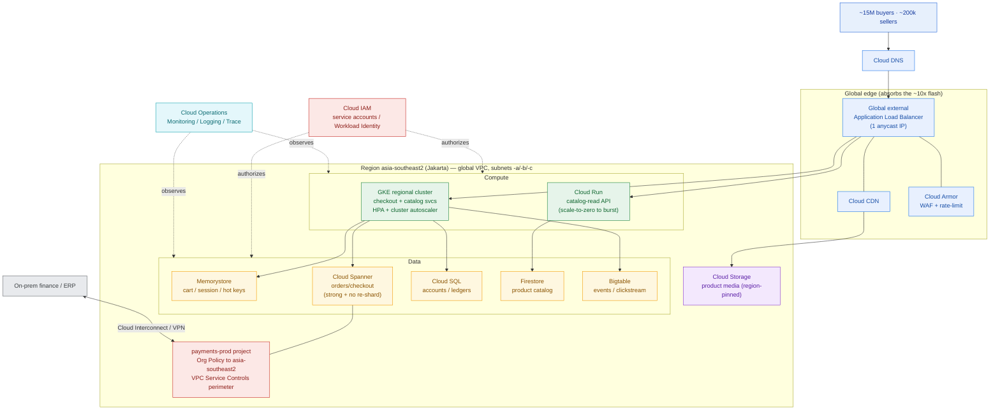

# GCP for Architects

> Same workload, Google's map. GKE, global networking, and Spanner are where the translation stops being a rename and starts being an advantage.

**Type:** Design
**Track:** AI, Data & Infrastructure Solution Architect (Presales)
**Prerequisites:** 3.3 Azure for Architects
**Time:** ~5h
**Lab:** free tier
**Ship It:** GCP reference architecture

## The Problem

You have already drawn PasarKita's marketplace on AWS (3.2) and on Azure (3.3). PasarKita is an Indonesian e-commerce marketplace: **~15M active buyers, ~200,000 sellers, ~2M orders/day**, with **flash sales that spike traffic ~10× for hours**. Their checkout and catalog run as a monolith plus microservices on a single public cloud, with finance and ERP still on-premises. The board's drivers are the same four you have heard in every Phase 3 room — **cost, lock-in, elasticity, and data residency** (payment data must stay in Indonesia). Now their **Kubernetes platform team** has forced a new question into the RFP: *"We run everything on Kubernetes because we want to stay portable. Show us the Google Cloud design — and tell us honestly where Google is actually better, not just different."*

This is the moment a weak SA gets exposed. It is tempting to treat GCP as "AWS with different nouns" and hand back a find-and-replace deck: EC2→Compute Engine, S3→Cloud Storage, done. That answer loses the deal, because the platform team already knows the nouns. What they are testing is whether you understand **where Google Cloud's model genuinely changes the architecture** — that a VPC is *global* not regional, that **GKE** is the reference Kubernetes and the cleanest portability story on the market, that **Cloud Spanner** removes the re-sharding nightmare a 10× flash sale creates on a single relational primary, and that Google's data and analytics stack is a category leader, not a follower.

Your job in this lesson is to translate the *identical* PasarKita workload onto GCP with **vendor-accurate service names**, size it against the same numbers, pin payment data to the **Jakarta region (`asia-southeast2`)** for residency, and produce a reference architecture you can defend line-by-line. Do it well and you achieve two things at once: a design the K8s team trusts, and — because 3.2, 3.3, and this lesson all map the same customer — a clean three-way comparison that feeds the multi-cloud decision in 3.6 and Capstone C. Do it badly and you are the vendor who "clearly just ported the AWS slide".

## The Concept

Every hyperscaler sells the same *categories* of service — compute, storage, database, networking, identity, observability. What differs is the naming, the **unit of isolation**, and where each provider is unusually strong. An architect who has the category map memorised can walk into any cloud RFP and translate on the fly. Here is Google Cloud's map, one category at a time, with the AWS/Azure equivalents you already carry in your head.

### The org model: projects, regions, zones — and the global VPC

Before services, learn Google's **resource hierarchy**, because it shapes billing, IAM, and residency:

```
Organization  (your company's root — ties to a domain)
   └── Folders        (group by environment / business unit — e.g. prod, non-prod, payments)
         └── Projects (the unit of isolation: billing, quota, IAM, and API enablement live here)
               └── Resources (a GKE cluster, a Cloud SQL instance, a bucket…)
```

A **Project** is the GCP analogue of an AWS account or an Azure subscription — it is where you draw your hardest security and billing boundaries. **Regions** (e.g. `asia-southeast2` = **Jakarta**, `asia-southeast1` = Singapore) contain **zones** (`asia-southeast2-a/-b/-c`) for fault isolation. The one structural surprise for AWS/Azure architects: **a VPC network in GCP is a _global_ resource** — one VPC spans every region, and **subnets are regional** inside it. You do not peer a Jakarta VPC to a Singapore VPC to get one network; they are already the same network. That single fact simplifies PasarKita's topology and is worth saying out loud in the room.

### The core-service map, by category

```
GCP SERVICE MAP  (what to reach for, by category)
════════════════════════════════════════════════════════════════════════════
COMPUTE
  Compute Engine ......... VMs (IaaS). Full control; managed instance groups autoscale.
  Google Kubernetes Engine  managed Kubernetes. Standard (you manage nodes) or
    (GKE) .................. Autopilot (Google manages nodes). The portability anchor.
  Cloud Run .............. serverless containers; scale to zero → burst; request-priced.
  Cloud Functions ........ event-driven functions (FaaS) for glue/webhooks.
STORAGE
  Cloud Storage .......... object storage (buckets). Standard/Nearline/Coldline/Archive.
  Persistent Disk / Hyperdisk  network block storage attached to VMs / GKE nodes.
  Filestore .............. managed NFS (shared POSIX file).
DATABASE
  Cloud SQL .............. managed MySQL / PostgreSQL / SQL Server. Regional, HA option.
  Cloud Spanner .......... horizontally-scalable, strongly-consistent relational. No re-shard.
  Firestore .............. serverless document NoSQL. Huge read fan-out, flexible schema.
  Bigtable ............... wide-column NoSQL for high-throughput time-series / events.
  Memorystore ............ managed Redis / Memcached / Valkey (cache, sessions, counters).
NETWORKING & EDGE
  VPC .................... GLOBAL network; regional subnets; firewall rules; Cloud NAT.
  Cloud Load Balancing ... global external Application Load Balancer (1 anycast IP, worldwide).
  Cloud CDN .............. caches at Google's edge POPs; sits on the global LB.
  Cloud DNS .............. managed authoritative DNS. Cloud Armor: WAF + DDoS + rate-limit.
IDENTITY
  Cloud IAM .............. roles + service accounts; Workload Identity for GKE→GCP auth.
OBSERVABILITY
  Cloud Operations ....... Monitoring, Logging, Trace, Error Reporting, Profiler (ex-Stackdriver).
GOVERNANCE / RESIDENCY
  Organization Policy .... constrain what/where (e.g. lock resources to asia-southeast2).
  VPC Service Controls ... a data-exfiltration perimeter around sensitive projects.
════════════════════════════════════════════════════════════════════════════
```

### The Google Cloud Architecture Framework

Google's equivalent of the AWS Well-Architected Framework and the Azure Well-Architected Framework is the **Google Cloud Architecture Framework**. Its five pillars are the checklist you run every design against:

| Pillar | The question it forces | PasarKita hot-spot |
|---|---|---|
| **Operational excellence** | Can we run, observe, and deploy it? | SLOs on checkout latency; GKE rollout strategy |
| **Security, privacy & compliance** | Who can touch data, and where does it live? | **Payment data in `asia-southeast2`**; VPC-SC perimeter |
| **Reliability** | Does it survive a zone loss and a 10× spike? | Regional GKE across 3 zones; Spanner; autoscaling |
| **Cost optimization** | Are we paying only for what the load needs? | Scale-to-zero reads, committed-use discounts, CDN offload |
| **Performance optimization** | Is it fast at the edge and under load? | Global LB + Cloud CDN; Memorystore in front of the DB |

You do not need to *run* the full Framework review in presales — you need to name the pillar a customer's worry lives in, so your design visibly answers it.

### Where GCP actually leads (say this out loud)

Translation is table stakes. The reason to *consider* GCP is four genuine strengths, and PasarKita happens to sit on all four:

- **GKE** — Google originated Kubernetes; GKE is widely regarded as the most mature managed offering, and it is the cleanest **portability** story for a customer whose stated driver is "no lock-in".
- **Global networking** — one global VPC + a single-anycast-IP global load balancer is fewer moving parts than stitching regional networks together.
- **Data & analytics** — **BigQuery**, Spanner, and Bigtable are category leaders; a data-heavy marketplace is exactly the profile that benefits.
- **Cloud Spanner** — horizontal write scale *with* strong consistency and no manual sharding — the single feature that most changes how you handle a 10× flash sale.

## Design It

The scenario is **PasarKita, unchanged** from 3.2 and 3.3 — we only change the cloud. Recap of the facts we design against (invent nothing beyond these): ~15M active buyers · ~200,000 sellers · ~2M orders/day · flash sales ~10× for hours · checkout/catalog monolith + microservices · on-prem finance/ERP · drivers = cost / lock-in / elasticity / residency · **payment data must stay in Indonesia** · a K8s platform team that wants portability.

### Assumptions (state them — never present a magic number)

Sizing starts from the two hard numbers (2M orders/day, 10× flash) and *declared* ratios. Every derived figure is a **range**, and every ratio is an assumption to confirm in discovery.

| # | Assumption (confirm with customer) | Value / range | Drives |
|---|---|---|---|
| A1 | Even spread of 2M orders/day | 2,000,000 ÷ 86,400s ≈ **~23 order-writes/s average** | DB write baseline |
| A2 | Diurnal peak factor (evening rush) | ×4–5 → **~90–120 order-writes/s normal peak** | DB primary sizing |
| A3 | Flash sale ≈ 10× the normal peak | **~900–1,200 order-writes/s for a few hours** | Spanner vs Cloud SQL call |
| A4 | Browse-to-buy ratio (catalog reads per order) | 50–100× → **~5k–12k catalog req/s normal; ~50k–120k at flash** | CDN + read-tier + cache |
| A5 | Concurrent buyers during a flash | 2–5% of 15M → **~300k–750k concurrent sessions** | Memorystore + CDN sizing |

The point of the table is not precision — it is that any reviewer can challenge a *ratio* instead of arguing with a number that fell from the sky. That is what "architect altitude" means for sizing.

### Step 1 — Landing zone: org, projects, and residency

Draw the isolation boundaries first. One **Organization**, folders per environment, and a **Shared VPC** host project so every workload sits in *one global VPC*:

- **Folders:** `prod`, `non-prod`, `shared`.
- **Projects (prod):** `net-host` (Shared VPC), `checkout-prod`, `catalog-prod`, **`payments-prod`**, `data-prod`.
- **Regions:** primary **`asia-southeast2` (Jakarta)** for everything touching Indonesian users and *all* payment data; `asia-southeast1` (Singapore) reserved for DR/analytics that residency permits.
- **Residency control (not a promise — a policy):** apply an **Organization Policy** `constraints/gcp.resourceLocations` locking `payments-prod` (and its buckets/DB) to `asia-southeast2`, and wrap it in a **VPC Service Controls** perimeter so payment data cannot be copied out to another project or region. This is the difference between *saying* "data stays in Indonesia" and *enforcing* it.

### Step 2 — Edge & global tier (absorb the 10× at the front)

Every request enters through Google's edge, so the flash-sale surge is blunted before it reaches your services:

- **Cloud DNS** resolves `pasarkita.co.id` to a **global external Application Load Balancer** (formerly HTTP(S) Load Balancing) — one anycast IP, worldwide.
- **Cloud CDN** on that LB caches catalog pages, product JSON, and media at edge POPs → per A4 the vast majority of flash traffic never touches origin.
- **Cloud Storage** (regional bucket in `asia-southeast2`) holds product images/media, served through Cloud CDN.
- **Cloud Armor** attaches to the LB backend for WAF rules and **rate-limiting** — the control that stops flash-sale bots and scalpers from turning 10× into 40×.

### Step 3 — Compute tier: GKE for portability, Cloud Run for spiky reads

The platform team's driver decides the primary: **GKE wins because portability is the stated goal.**

- **GKE regional cluster** in `asia-southeast2`, control plane + nodes spread across zones **-a/-b/-c** (survives a zone loss). Checkout and catalog microservices run here.
- **Autoscaling for the 10×:** the **Horizontal Pod Autoscaler (HPA)** scales pods on CPU and on a custom `requests/s` metric from Cloud Monitoring; the **Cluster Autoscaler** / node auto-provisioning adds nodes underneath. Pre-scale on a schedule before a *known* flash sale, then let HPA ride the curve.
- **Cloud Run** for the *stateless, spiky* read services (e.g. the public catalog-read API): it **scales to zero** between sales and bursts on request count, so you pay for the flash and nothing for the lull. This is the "GKE for what must be portable, Cloud Run for what must be cheap-and-elastic" split.
- The legacy **monolith** lifts into GKE as a container first (fast, portable), and gets strangled into services later — you say this explicitly so the migration story is honest.

### Step 4 — Data tier: match the store to the access pattern

This is where the GCP-specific judgement shows:

| Data | Service | Why |
|---|---|---|
| **Orders / checkout (hot writes)** | **Cloud Spanner** | ~900–1,200 writes/s at flash (A3) with strong consistency and **no re-sharding** — the payoff of GCP. Pinned to `asia-southeast2`. |
| Moderate relational (accounts, seller ledgers) | **Cloud SQL** (PostgreSQL, regional HA) | Simpler and cheaper where write volume is moderate; keep it unless it becomes the flash bottleneck. |
| **Product catalog (200k sellers)** | **Firestore** | Flexible per-seller schema and massive read fan-out for browsing. |
| Clickstream / events / inventory time-series | **Bigtable** | High-throughput writes for analytics and recommendations. |
| Cart, sessions, inventory counters, hot keys | **Memorystore (Redis)** | Shields the databases during the spike; absorbs the A5 session load and flash hot-key contention. |

Rule of thumb to defend in the room: **Memorystore in front, Spanner for what must both scale-write and stay consistent, Firestore for what must flex and fan-out reads.**

### Step 5 — Residency & the on-prem link

Payment data is pinned to `asia-southeast2` (Step 1). The on-prem **finance/ERP** connects into the same global VPC over **Cloud Interconnect** (or Cloud VPN as the lower-cost fallback), so the payment service in `payments-prod` reaches ledgers privately — no traffic over the public internet, and managed databases reached over **Private Service Connect / Private Google Access**.

### Step 6 — Lab (free tier): prove the residency claim in two commands

A design claim you cannot demonstrate is a slide. In **Cloud Shell** (free), pin a bucket to Jakarta and read back its location — the same primitive that enforces payment residency:

```bash
# Create a bucket physically located in the Jakarta region (asia-southeast2)
gcloud storage buckets create gs://pasarkita-residency-demo-$RANDOM \
  --location=asia-southeast2 \
  --uniform-bucket-level-access \
  --public-access-prevention

# Prove where the data lives — this is your residency evidence
gcloud storage buckets describe gs://pasarkita-residency-demo-* \
  --format="value(name, location, locationType)"
# → asia-southeast2   region      ← data is in Indonesia, verifiably

# Clean up (free-tier hygiene)
gcloud storage rm --recursive gs://pasarkita-residency-demo-*
```

If you can run those three lines on a screen-share, "payment data stays in Indonesia" stops being a promise and becomes a demonstrated control.

### The GCP reference architecture



Same PasarKita, Google's map — and a design the K8s team can read as *portable by construction* (GKE) with the two GCP-specific bets (Spanner for the hot write path, global VPC + LB for the edge) called out where they earn their place.

## Compare It

The customer will push on every service choice. These are the three tables that answer them.

### Compute: Compute Engine vs GKE vs Cloud Run vs Cloud Functions

| Service | Model | Pick it when… | PasarKita fit |
|---|---|---|---|
| **Compute Engine** | VMs (IaaS) | You need full OS control, GPUs, or a lift-and-shift target | The legacy monolith's *first* home if it can't containerise cleanly |
| **GKE** | Managed Kubernetes | You run many services and want **portability** / full K8s control | **Primary** — checkout + catalog microservices; the platform team's mandate |
| **Cloud Run** | Serverless containers | Stateless, spiky, want scale-to-zero and per-request pricing | Public **catalog-read API** during flash sales |
| **Cloud Functions** | Event-driven FaaS | Small glue: webhooks, image thumbnails, queue handlers | Media-processing and payment-callback glue |

### Database: Cloud SQL vs Spanner vs Firestore (vs Bigtable, Memorystore)

| Service | Data shape | Scales writes by… | Trap |
|---|---|---|---|
| **Cloud SQL** | Relational, single primary | Vertical (bigger instance) + read replicas | A single primary is the **flash-sale ceiling** — you re-shard by hand |
| **Cloud Spanner** | Relational, distributed | **Adding nodes — no re-sharding**, strong consistency | Higher floor cost; overkill for low-write tables |
| **Firestore** | Document (flexible) | Automatic, serverless | Not for complex multi-table joins/transactions |
| **Bigtable** | Wide-column, high-throughput | Adding nodes | No SQL, no secondary indexes — analytics/time-series only |
| **Memorystore** | Key-value cache | It's a cache, not a system of record | Ephemeral — never the source of truth |

The headline for a data-heavy marketplace with a 10× spike: **Cloud SQL is cheaper until the flash sale, and Spanner is the reason you don't get paged during one.** Naming that trade-off *is* the value you add.

### The cross-cloud Rosetta (so 3.6 can compare)

| Category | **GCP** | AWS (3.2) | Azure (3.3) |
|---|---|---|---|
| VM / IaaS | Compute Engine | EC2 | Virtual Machines |
| Managed Kubernetes | **GKE** | EKS | AKS |
| Serverless containers | Cloud Run | App Runner / Fargate | Container Apps |
| Functions (FaaS) | Cloud Functions | Lambda | Azure Functions |
| Object storage | Cloud Storage | S3 | Blob Storage |
| Block storage | Persistent Disk / Hyperdisk | EBS | Managed Disks |
| File storage | Filestore | EFS | Azure Files |
| Managed relational | Cloud SQL | RDS | Azure Database for PostgreSQL |
| Distributed relational | **Cloud Spanner** | Aurora / DSQL | Cosmos DB (partial) |
| Document NoSQL | Firestore | DynamoDB | Cosmos DB |
| Wide-column NoSQL | Bigtable | Keyspaces / DynamoDB | Cosmos DB (Cassandra) |
| In-memory cache | Memorystore | ElastiCache | Azure Cache for Redis |
| CDN | Cloud CDN | CloudFront | Azure Front Door / CDN |
| Global load balancer | **Cloud Load Balancing** (global) | ALB (regional) + Global Accelerator | Front Door |
| DNS | Cloud DNS | Route 53 | Azure DNS |
| WAF / DDoS | Cloud Armor | AWS WAF + Shield | Azure WAF |
| Identity | Cloud IAM | IAM | Entra ID + Azure RBAC |
| Observability | Cloud Operations | CloudWatch | Azure Monitor |
| Data warehouse | **BigQuery** | Redshift | Synapse / Fabric |

**Where GCP is the better fit here:** PasarKita is *exactly* the profile GCP courts — a **Kubernetes-portable** (GKE), **data-heavy** (BigQuery/Spanner/Bigtable) marketplace that values a **simple global network** (one VPC, one anycast LB IP) and needs **write-scale with consistency** under flash load (Spanner). On AWS the Application Load Balancer is regional and Aurora scales reads-not-writes without DSQL; on Azure the strength is enterprise/Microsoft-estate integration, which PasarKita doesn't have. The honest "it depends": if the customer were already deep in Microsoft licensing or AWS-native serverless, that gravity would outweigh these strengths — but PasarKita's stated drivers point at Google.

## Ship It

This lesson ships a reusable **GCP Reference Architecture** — the artifact you attach to a cloud proposal or an RFP response. Both files live in [`outputs/`](../outputs/):

- **[`template-gcp-reference-architecture.md`](../outputs/template-gcp-reference-architecture.md)** — a fill-in-the-blank template: an assumptions/sizing table, a **service-selection-by-tier** matrix (edge → compute → data → residency), a Mermaid skeleton, and an Architecture-Framework checklist. A colleague can drive a whole design session from it.
- **[`example-pasarkita-gcp-reference-architecture.md`](../outputs/example-pasarkita-gcp-reference-architecture.md)** — the template fully worked for PasarKita, so the skeleton isn't abstract. It is the design you'd defend in the review, and the GCP column that lines up against the AWS (3.2) and Azure (3.3) versions in **3.6 Hybrid, Multi-Cloud & Migration** and **Capstone C**.

Ship it with the assumptions visible: a GCP reference architecture that names its ratios and pins its residency is the version a platform team trusts on the first read.

## Exercises

1. **(Easy)** Take the reference architecture above and, for each of the five Architecture-Framework pillars, write one sentence naming the *specific* GCP service that answers it for PasarKita. (E.g. *Reliability → regional GKE across three zones + Cloud Spanner.*) This is the "why this design" paragraph you'd put under the diagram.
2. **(Medium)** Re-map the compute + data tiers for a **different customer**: a Jakarta **digital bank** with strict residency, ~5M accounts, steady load (no flash), and a hard requirement for strong-consistency transactions. Which services change vs PasarKita, and why? (Hint: no 10× spike changes the Spanner-vs-Cloud-SQL calculus; residency and IAM get *stricter* — reach for Assured Workloads and a tighter VPC-SC perimeter.) Produce the service-selection table only.
3. **(Hard)** Extend PasarKita into a **decision memo**: the K8s team asks whether to run the whole estate on **GKE** or to move the stateless read services to **Cloud Run**. Using the Compare-It tables and the assumptions, write a half-page recommendation that names the cost, portability, and operational trade-off of each path, and states where the boundary between GKE and Cloud Run should sit. Save it beside your worked example — you'll reuse this reasoning in the multi-cloud comparison in 3.6.

## Key Terms

| Term | What people say | What it actually means |
|------|-----------------|------------------------|
| Project (GCP) | "The account" | The unit of isolation for billing, quota, IAM, and API enablement. Your hardest security/billing boundary — one per environment/workload, grouped under folders. |
| Global VPC | "The network, like a VPC" | In GCP a VPC network is **global** — one network spans every region, with **regional subnets** inside it. You don't peer regions to get one network; they already are one. |
| GKE | "Their Kubernetes" | Google Kubernetes Engine — managed K8s (Standard or Autopilot). The most mature managed Kubernetes and the cleanest **portability** story for a no-lock-in customer. |
| Cloud Run | "Serverless / Lambda for containers" | Fully-managed serverless **containers** that scale to zero and burst on request count. For stateless spiky workloads you want cheap at idle and elastic at peak. |
| Cloud Spanner | "Google's SQL database" | A **horizontally-scalable, strongly-consistent** relational DB that adds write capacity by adding nodes with **no manual re-sharding** — the feature that tames a 10× flash sale. |
| Firestore | "Their NoSQL" | Serverless **document** database with huge read fan-out and flexible schema. Right for a 200k-seller catalog; wrong for complex multi-table joins. |
| `asia-southeast2` | "The Jakarta region" | GCP's Jakarta region (zones -a/-b/-c). Pin resources here — enforced by **Organization Policy** and **VPC Service Controls** — to keep payment data in Indonesia. |
| Global external Application Load Balancer | "The load balancer" | GCP's global LB (ex-HTTP(S) Load Balancing): **one anycast IP** serving worldwide, fronting Cloud CDN and Cloud Armor. Fewer moving parts than regional LBs peered together. |
| Cloud Operations | "Stackdriver / monitoring" | The observability suite: Cloud Monitoring, Logging, Trace, Error Reporting, Profiler. Where your checkout SLOs and flash-sale dashboards live. |

## Further Reading

- [Google Cloud Architecture Framework](https://cloud.google.com/architecture/framework) — the five-pillar review you run every design against; the GCP counterpart to AWS/Azure Well-Architected.
- [GKE Autopilot vs Standard](https://cloud.google.com/kubernetes-engine/docs/concepts/autopilot-overview) — decide who manages the nodes; the core GKE portability trade-off for a platform team.
- [Cloud Spanner overview](https://cloud.google.com/spanner/docs/overview) — how strong consistency plus horizontal write scale removes the re-sharding problem a flash sale creates.
- [VPC network overview — subnets and the global model](https://cloud.google.com/vpc/docs/vpc) — read the "networks are global, subnets are regional" section; it changes how you draw multi-region GCP.
- [Restricting resource locations (Organization Policy)](https://cloud.google.com/resource-manager/docs/organization-policy/defining-locations) and [VPC Service Controls](https://cloud.google.com/vpc-service-controls/docs/overview) — the two controls that turn "data stays in Indonesia" into an enforced, auditable fact.
- [Data residency, operational transparency, and privacy for enterprises on Google Cloud](https://cloud.google.com/architecture/framework/security/data-residency-sovereignty) — the reference for pinning and proving residency, including Assured Workloads for regulated regimes.
