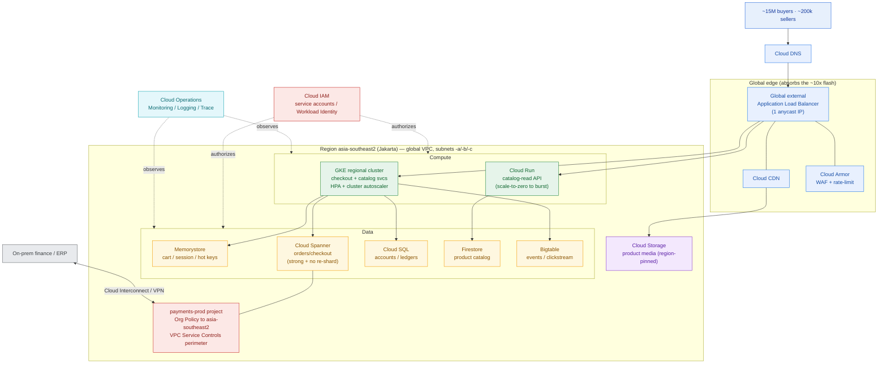

# GCP Reference Architecture — PasarKita (worked example)

> This is `template-gcp-reference-architecture.md` filled in for PasarKita. It is the GCP column that lines up beside the AWS (3.2) and Azure (3.3) versions for the multi-cloud comparison in 3.6 and Capstone C. Same workload, same numbers — only the cloud changes.

**Customer:** PasarKita (fictional)  ·  **Industry:** E-commerce marketplace (Indonesia)
**Prepared by:** SA — Presales  ·  **Date:** 2026-07-05  ·  **Opportunity:** Cloud RFP — checkout + catalog re-platform
**Primary region:** `asia-southeast2` (Jakarta)  ·  **Version:** v0.2

**Company shape (verbatim, invent nothing beyond this):** ~15M active buyers · ~200,000 sellers · ~2M orders/day · flash sales ~10× for hours · checkout/catalog monolith + microservices on a single public cloud · on-prem finance/ERP.
**The ask (verbatim):** *"We run everything on Kubernetes because we want to stay portable. Show us the Google Cloud design — and tell us honestly where Google is actually better, not just different."*

---

## 1. Drivers & constraints (the customer's words)

| Driver | What they said | Architectural implication |
|---|---|---|
| Cost | "We overpay at idle and still fall over at peak." | Scale-to-zero reads on Cloud Run; committed-use discounts on GKE baseline; CDN offload |
| Lock-in / portability | "Everything on Kubernetes so we can move." | **GKE** as compute primary; container-first monolith; open interfaces |
| Elasticity | "Flash sales are ~10× for a few hours." | Edge absorption + HPA/cluster autoscaler; Spanner for write-scale |
| Data residency | "Payment data must stay in Indonesia." | Region pin to `asia-southeast2` + Org Policy + VPC-SC |
| Compliance | "Payments are audited." | Cloud Audit Logs; isolated `payments-prod` project |

## 2. Assumptions & sizing (state the ratios, show the range)

| # | Assumption (confirm) | Value / range | Drives |
|---|---|---|---|
| A1 | Even spread of 2M orders/day | 2,000,000 ÷ 86,400s ≈ **~23 order-writes/s avg** | DB write baseline |
| A2 | Diurnal peak factor (evening rush) | ×4–5 → **~90–120 order-writes/s normal peak** | DB primary sizing |
| A3 | Flash sale ≈ 10× normal peak | **~900–1,200 order-writes/s for hours** | Spanner vs Cloud SQL call |
| A4 | Browse-to-buy ratio | 50–100× → **~5k–12k catalog req/s normal; ~50k–120k at flash** | CDN + read tier + cache |
| A5 | Concurrency during a flash | 2–5% of 15M → **~300k–750k concurrent sessions** | Memorystore + CDN sizing |

**Reading the numbers:** A3 is the decisive line. ~1,000 sustained order-writes/s with strong consistency is above where a single Cloud SQL primary is comfortable without manual sharding → **Cloud Spanner** on the checkout write path. A4 says the flash is overwhelmingly *reads* → most of it must die at **Cloud CDN**, never reaching origin.

## 3. Landing zone (isolation & residency first)

- **Organization:** `pasarkita.co.id`
- **Folders:** `prod`, `non-prod`, `shared`
- **Projects (prod):** `net-host` (Shared VPC) · `checkout-prod` · `catalog-prod` · **`payments-prod`** · `data-prod`
- **Regions / zones:** primary **`asia-southeast2` (Jakarta)**, zones `-a/-b/-c`; `asia-southeast1` (Singapore) reserved for DR/analytics that residency permits.
- **Residency control:** Organization Policy `constraints/gcp.resourceLocations` locks `payments-prod` and all its resources (Spanner, Cloud SQL, buckets) to `asia-southeast2`; a **VPC Service Controls** perimeter around `payments-prod` blocks copying payment data to any other project or region. Payment residency is *enforced*, not promised.

## 4. Service selection by tier

| Tier | Concern | GCP service | Config note for PasarKita |
|---|---|---|---|
| **Edge** | DNS + global entry | Cloud DNS + **global external Application Load Balancer** | 1 anycast IP for `pasarkita.co.id` |
| | Cache / offload | Cloud CDN | Kills the bulk of the A4 flash reads at the edge |
| | Media | Cloud Storage (`asia-southeast2`) | Product images behind Cloud CDN |
| | Edge security | Cloud Armor | WAF + **rate-limiting** — stops bots turning 10× into 40× |
| **Compute** | Checkout + catalog services | **GKE** regional (Jakarta, 3 zones) | Platform team's portability mandate; HPA + cluster autoscaler for the 10× |
| | Public catalog-read API | Cloud Run | Scale-to-zero between sales; bursts on request count |
| | Legacy monolith | GKE (containerised) → strangle later | Container-first for portability; decompose over time |
| | Media/payment glue | Cloud Functions | Thumbnails, payment callbacks |
| **Data** | Orders / checkout (hot writes) | **Cloud Spanner** (`asia-southeast2`) | ~1,000 writes/s at flash, strong consistency, **no re-sharding** |
| | Accounts / seller ledgers | Cloud SQL (PostgreSQL, regional HA) | Moderate write volume; cheaper than Spanner here |
| | Product catalog (200k sellers) | Firestore | Flexible per-seller schema; massive read fan-out |
| | Clickstream / inventory events | Bigtable | High-throughput writes for recs/analytics |
| | Cart / session / hot keys | Memorystore (Redis) | Shields DBs; absorbs A5 sessions + flash hot-key contention |
| | Analytics | BigQuery (`data-prod`) | Reporting + ML features off the operational path |
| **Connectivity** | On-prem finance/ERP | Cloud Interconnect (VPN fallback) | Private path into the global VPC |
| | Private DB access | Private Service Connect / Private Google Access | Managed DBs off the public internet |
| **Identity** | AuthN/Z | Cloud IAM + Workload Identity | Least-privilege per project; `payments-prod` tightest |
| **Observability** | Monitor / log / trace | Cloud Operations | SLO on checkout p95 latency; flash-sale dashboard |

## 5. The reference architecture



### ASCII fallback

```
   IDENTITY: Cloud IAM (service accounts / Workload Identity)  ── spans every tier
   ────────────────────────────────────────────────────────────────────────────
   EDGE      Cloud DNS -> global external Application LB -> Cloud CDN -> Cloud Armor
             media: Cloud Storage (asia-southeast2)
   ────────────────────────────────────────────────────────────────────────────
   COMPUTE   GKE regional (Jakarta, HPA + autoscaler)  |  Cloud Run (catalog reads)
             monolith -> containerised on GKE -> strangle
   ────────────────────────────────────────────────────────────────────────────
   DATA      Memorystore -> Cloud Spanner (orders) | Cloud SQL (accounts/ledgers)
             Firestore (catalog) | Bigtable (events) | BigQuery (analytics)
   ────────────────────────────────────────────────────────────────────────────
   RESIDENCY  payments-prod pinned asia-southeast2; Org Policy + VPC-SC perimeter
   ON-PREM   finance/ERP <-- Cloud Interconnect / VPN --> VPC (Private Service Connect)
   OBSERVABILITY  Cloud Operations: Monitoring / Logging / Trace / Error Reporting
```

## 6. Architecture Framework checklist

| Pillar | How this design answers it | Gap / follow-up |
|---|---|---|
| Operational excellence | SLO on checkout p95; GKE rolling deploys; flash-sale dashboard in Cloud Monitoring | Define pre-scale runbook for known sale windows |
| Security, privacy & compliance | Payment data pinned to `asia-southeast2`; VPC-SC around `payments-prod`; least-priv IAM; Cloud Audit Logs | Confirm PCI scope of the payment service |
| Reliability | Regional GKE across 3 zones; Cloud Spanner; Cloud SQL HA; autoscaling to A3 | Load-test the 10× before a real sale |
| Cost optimization | Cloud Run scale-to-zero for reads; CUDs on GKE baseline; Cloud CDN offloads A4 | Right-size Spanner nodes to peak, not average |
| Performance optimization | Global LB + Cloud CDN at the edge; Memorystore in front of Spanner/Cloud SQL | Cache-hit-ratio target on catalog endpoints |

## 7. Trade-offs & the "it depends"

- **Compute:** GKE is the primary because the customer's stated driver is portability; Cloud Run takes the stateless catalog-read burst so we don't pay for idle. Compute Engine only appears if the monolith resists clean containerisation.
- **Database:** Cloud SQL is cheaper and simpler for accounts/ledgers, but a single primary is the flash-sale ceiling — so the *order write path* goes to **Cloud Spanner**, which scales writes by adding nodes with no manual re-sharding. That one choice is the difference between riding a 10× sale and getting paged through it.
- **Where GCP leads for PasarKita:** GKE portability (their explicit ask), one global VPC + single anycast LB IP (fewer moving parts), Spanner (write-scale with consistency), and BigQuery for the data-heavy analytics side.
- **When you'd choose otherwise:** if PasarKita were already deep in Microsoft licensing (favouring Azure) or committed to AWS-native serverless, that platform gravity could outweigh these strengths. On the stated drivers, it doesn't.

**One-line design statement:**
> On GCP, PasarKita's checkout + catalog run on **regional GKE** in **`asia-southeast2`**, with hot order-writes on **Cloud Spanner**, the 200k-seller catalog on **Firestore**, and cart/session on **Memorystore**; the ~10× flash is absorbed at the edge by the **global external Application Load Balancer + Cloud CDN + Cloud Armor** and by HPA/autoscaling; **payment data is pinned to Jakarta and fenced with Org Policy + VPC Service Controls** — chosen because GKE portability, a simple global network, and Spanner's write-scale are exactly what this marketplace's drivers ask for.

**So what (the pivot this design buys you):** you didn't hand back a renamed AWS slide. You gave the K8s team a *portable-by-construction* GKE core, made two GCP-specific bets (Spanner, global network) with the reasoning attached, and turned "data stays in Indonesia" into a control you can demonstrate live — which is why this is the GCP column that wins the three-way comparison in 3.6.
