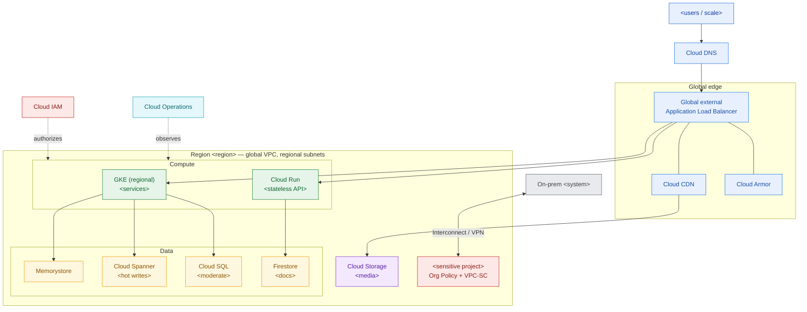

# GCP Reference Architecture — Design Template

> Fill this in when you translate a workload onto Google Cloud. It produces the artifact you attach to a proposal or RFP: a defensible service map, sized from stated assumptions, with residency pinned and the Google-specific bets called out. An executive should grasp the diagram; an engineer should trust the tables.

**Customer:** `<company>`  ·  **Industry:** `<industry>`  ·  **Prepared by:** `<SA name>`  ·  **Date:** `<YYYY-MM-DD>`
**Opportunity:** `<deal / RFP name>`  ·  **Primary region:** `<e.g. asia-southeast2 (Jakarta)>`  ·  **Version:** `<v0.1 draft>`

**Legend:** *SoR* = system of record · *HPA* = Horizontal Pod Autoscaler · *LB* = load balancer · *VPC-SC* = VPC Service Controls · *CUD* = committed-use discount.

---

## How to use this template

Work the tiers **outside-in**: land the account, then edge → compute → data → residency. Do not start from a service list — start from the workload's numbers and drivers, then attach GCP services that answer them.

1. **Drivers & constraints** — capture cost / lock-in / elasticity / residency / compliance in the customer's words.
2. **Assumptions & sizing** — derive every load figure from a *stated ratio*; give ranges, never a magic number.
3. **Landing zone** — org → folders → projects → Shared VPC → regions/zones; residency policy.
4. **Service selection by tier** — edge, compute, data, observability, identity.
5. **Draw the map** — fill the Mermaid skeleton and the ASCII fallback.
6. **Run the Architecture Framework checklist** — one row per pillar.
7. **State the trade-offs** — why *this* service over the alternative, and the "it depends".

---

## 1. Drivers & constraints (the customer's words)

| Driver | What they said | Architectural implication |
|---|---|---|
| Cost | `<quote>` | `<CUDs, scale-to-zero, CDN offload…>` |
| Lock-in / portability | `<quote>` | `<GKE vs managed-proprietary; open formats>` |
| Elasticity | `<quote, e.g. Nx spike>` | `<autoscaling target; edge absorption>` |
| Data residency | `<quote>` | `<region pin + Org Policy + VPC-SC>` |
| Compliance | `<quote>` | `<Assured Workloads? audit logging?>` |

## 2. Assumptions & sizing (state the ratios, show the range)

> Start from the hard numbers the customer gave you. Derive everything else from a ratio you can defend. Give a range so a reviewer challenges the *ratio*, not a fabricated number.

| # | Assumption (confirm) | Value / range | Drives |
|---|---|---|---|
| A1 | `<baseline, e.g. writes/day ÷ 86,400>` | `<~ /s average>` | `<DB write baseline>` |
| A2 | `<diurnal peak factor ×?>` | `<~ /s normal peak>` | `<primary sizing>` |
| A3 | `<spike factor ×?>` | `<~ /s at spike>` | `<distributed-DB decision>` |
| A4 | `<read : write ratio>` | `<~ req/s normal; ~ at spike>` | `<CDN + read tier + cache>` |
| A5 | `<concurrency % of users>` | `<~ concurrent sessions>` | `<cache + CDN sizing>` |

## 3. Landing zone (isolation & residency first)

- **Organization:** `<org / domain>`
- **Folders:** `<prod / non-prod / shared / regulated…>`
- **Projects:** `<net-host (Shared VPC)>` · `<workload-prod>` · `<sensitive-prod>` · `<data-prod>`
- **Regions / zones:** primary `<region>` (zones `<-a/-b/-c>`); secondary `<region>` for `<DR / analytics>`.
- **Residency control:** Organization Policy `constraints/gcp.resourceLocations` locking `<project>` to `<region>`; **VPC-SC** perimeter around `<sensitive project>`. `<Assured Workloads if regulated>`.

## 4. Service selection by tier

| Tier | Concern | GCP service(s) | Why / config note |
|---|---|---|---|
| **Edge / global** | DNS, TLS, global entry | Cloud DNS + **global external Application Load Balancer** | 1 anycast IP; TLS termination |
| | Cache / offload | Cloud CDN (on the LB) | Offloads `<A4>` read traffic |
| | Static / media | Cloud Storage (`<region>`) behind CDN | Region-pinned if residency applies |
| | Edge security | Cloud Armor | WAF + **rate-limiting** for spikes/bots |
| **Compute** | Portable services | **GKE** (Standard / Autopilot), regional | HPA + Cluster Autoscaler for `<Ax spike>` |
| | Spiky stateless | Cloud Run | Scale-to-zero → burst; per-request price |
| | Full-control / lift-shift | Compute Engine (MIG) | `<only if OS control / GPUs needed>` |
| | Event glue | Cloud Functions | `<webhooks, thumbnails, callbacks>` |
| **Data** | Hot / high-write relational | **Cloud Spanner** | Strong consistency, no re-sharding at spike |
| | Moderate relational | Cloud SQL (regional HA) | `<accounts, ledgers>` |
| | Flexible / high-read docs | Firestore | `<catalog, profiles>` |
| | High-throughput events | Bigtable | `<clickstream, time-series>` |
| | Cache / session / counters | Memorystore (Redis) | Shields DB during spike |
| | Analytics warehouse | BigQuery | `<reporting, ML features>` |
| **Connectivity** | On-prem link | Cloud Interconnect / Cloud VPN | Private path to `<on-prem systems>` |
| | Private service access | Private Service Connect / Private Google Access | Managed DBs off the public internet |
| **Identity** | AuthN/Z | Cloud IAM (service accounts, Workload Identity) | Least-privilege per project |
| **Observability** | Monitor / log / trace | Cloud Operations (Monitoring, Logging, Trace, Error Reporting) | SLOs on `<critical path>` |

## 5. The reference architecture (Mermaid skeleton)

> Replace placeholders. Keep the global edge on top, the region box in the middle (with compute + data subgroups), on-prem/identity/observability to the side. Delete tiers you don't need.



### ASCII fallback (for docs/email that can't render Mermaid)

```
   IDENTITY: Cloud IAM (service accounts / Workload Identity)  ── spans every tier
   ────────────────────────────────────────────────────────────────────────────
   EDGE      Cloud DNS -> global external Application LB -> Cloud CDN -> Cloud Armor
             static/media: Cloud Storage (<region>)
   ────────────────────────────────────────────────────────────────────────────
   COMPUTE   GKE (regional, HPA + autoscaler)   |   Cloud Run (scale-to-zero)
             [Compute Engine only if OS control needed]   [Cloud Functions = glue]
   ────────────────────────────────────────────────────────────────────────────
   DATA      Memorystore -> Cloud Spanner (hot writes) | Cloud SQL (moderate)
             Firestore (docs) | Bigtable (events) | BigQuery (analytics)
   ────────────────────────────────────────────────────────────────────────────
   REGION/RESIDENCY  <region> (zones -a/-b/-c); Org Policy + VPC-SC on <sensitive>
   ON-PREM   <system> <-- Cloud Interconnect / VPN --> VPC (Private Service Connect)
   OBSERVABILITY  Cloud Operations: Monitoring / Logging / Trace / Error Reporting
```

## 6. Architecture Framework checklist (one row per pillar)

| Pillar | How this design answers it | Gap / follow-up |
|---|---|---|
| Operational excellence | `<SLOs, rollout strategy, dashboards>` | `<…>` |
| Security, privacy & compliance | `<residency pin, VPC-SC, IAM least-priv>` | `<…>` |
| Reliability | `<regional GKE, HA DB, autoscale to spike>` | `<…>` |
| Cost optimization | `<scale-to-zero, CUDs, CDN offload>` | `<…>` |
| Performance optimization | `<global LB + CDN, cache in front of DB>` | `<…>` |

## 7. Trade-offs & the "it depends"

- **Compute:** `<GKE vs Cloud Run vs Compute Engine — why the primary>`.
- **Database:** `<Cloud SQL vs Spanner — the spike ceiling / cost trade>`.
- **Where GCP leads for this customer:** `<GKE portability / global network / Spanner / BigQuery>`.
- **When you'd choose otherwise:** `<the AWS/Azure gravity that would flip the call>`.

**One-line design statement (fill in):**
> On GCP, `<workload>` runs `<compute primary>` in `<region>`, stores hot writes in `<DB>` and reads in `<DB>`, absorbs a `<Nx>` spike at the `<edge/autoscale>`, and pins `<sensitive data>` to `<region>` enforced by Org Policy + VPC-SC — chosen because `<the decisive GCP strength>`.

---

*Worked example: see `example-pasarkita-gcp-reference-architecture.md` in this folder.*
