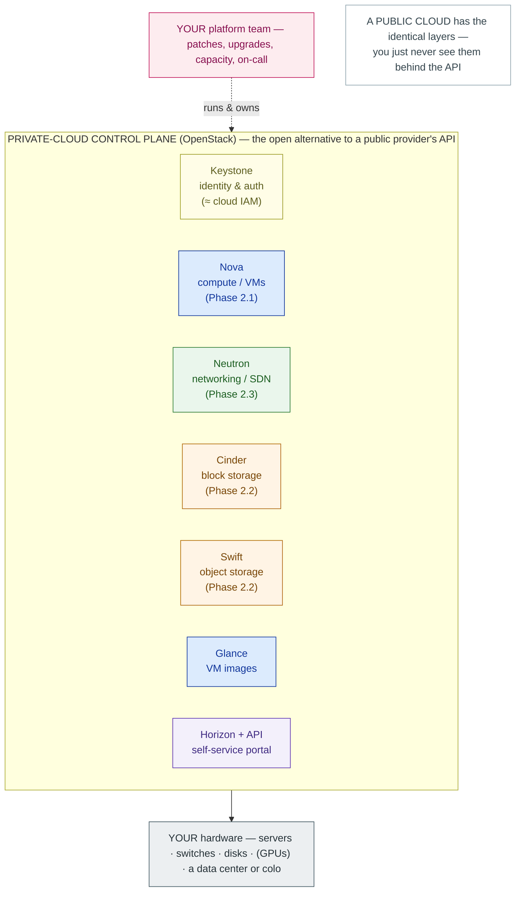
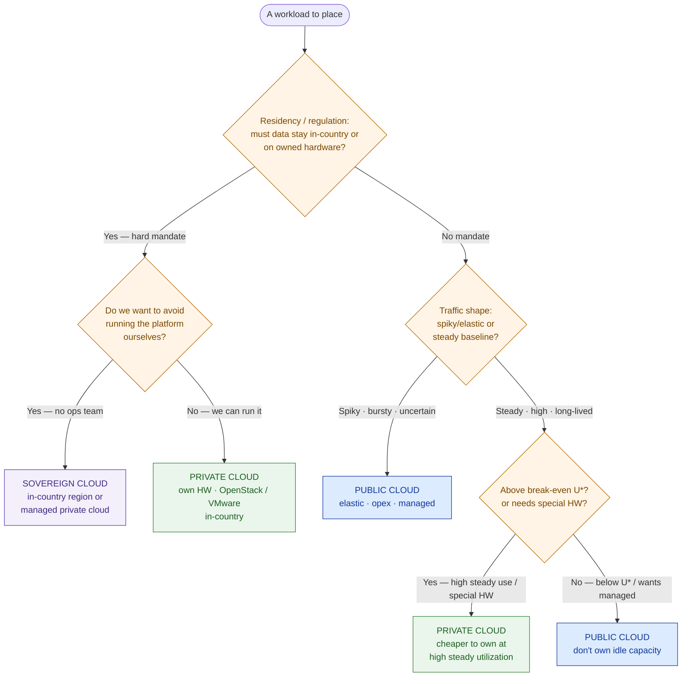
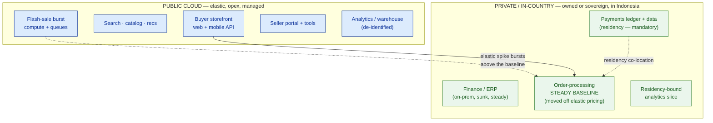

# OpenStack & Private Cloud

> "Cloud" is a decision, not a destination. Place each workload where the evidence sends it — not where the reflex does.

**Type:** Learn
**Track:** AI, Data & Infrastructure Solution Architect (Presales)
**Prerequisites:** [3.4 GCP for Architects](../../04-gcp-for-architects/docs/en.md) · builds on [0.4 Cloud & Virtualization Literacy](../../../00-foundations/04-cloud-and-virtualization-literacy/docs/en.md)
**Time:** ~5h
**Lab:** DevStack sandbox (stand up a single-node private-cloud control plane to *see* it — [`lab/`](../lab/README.md))
**Ship It:** Private-vs-Public Decision Matrix

## The Problem

You are in a steering-committee room at **PasarKita**, an Indonesian e-commerce marketplace: ~15M active buyers, ~200,000 sellers, ~2M orders a day, and flash sales that spike traffic ~10×. Two years ago they made the decision every fast-growing company makes on reflex — *"go cloud"* — and moved everything to a single public cloud. It worked. It also produced the invoice now sitting in front of the CFO, who opens the meeting with the only sentence that matters to her: **"This bill is our number-one problem, and it grows every quarter whether we sell more or not."** Across the table, the head of engineering shrugs: *"Cloud is cloud. Where else would it run?"* And in the corner, the ops lead who kept the old data center alive mutters that they should *"just bring it all back on-prem like the old days."*

Every person in that room is reasoning from a reflex, and each reflex is expensive in its own direction. "Cloud = public cloud" is the costliest one, because it quietly rents *steady-state* capacity — the order-processing core that never sleeps, running 2M orders a day at a baseline that barely moves — at prices designed for *elastic* capacity you spin up and throw away. Meanwhile the payments data has a hard constraint nobody has priced: it must **stay in Indonesia** by regulation. And the finance/ERP system is still on-prem, working fine, a sunk asset nobody wants to re-platform. The opposite reflex — "bring it all home" — is just as wrong: it would hand the flash-sale spike to a fixed pile of hardware that sits 90% idle for 360 days a year so it can survive the ten days it can't.

The solution architect is the only person whose job is to *refuse the reflex*. Your work here is **placement on evidence**: for each workload, decide whether it belongs in public cloud, in a private cloud (often built on **OpenStack**), or on a **sovereign / in-country** platform — and defend every call with a driver the CFO and the regulator both accept. Get it right and PasarKita's next architecture is a deliberate **hybrid**: elastic things rented, steady and regulated things owned, and a bill that finally tracks the business instead of outrunning it. This lesson gives you the reasoning and the deliverable — a decision matrix — that turns "cloud is cloud" into a placement map you can put your name on. That map is the seed the next lesson ([3.6 Hybrid, Multi-Cloud & Migration](../../06-hybrid-multicloud-and-migration/docs/en.md)) grows into a full hybrid target, and it feeds **Capstone C**.

## The Concept

Back in [Phase 0](../../../00-foundations/04-cloud-and-virtualization-literacy/docs/en.md) you learned the line that most of this room forgot: **cloud is a *model* — self-service, elastic, pooled, metered — not an *address*.** Public and private are two **deployment models** of that same model; they are an axis independent of the IaaS/PaaS/SaaS service ladder. A bank running its own cluster on hardware it owns is doing cloud — *private* cloud. This lesson is where that distinction stops being trivia and starts being a cost, a compliance posture, and a defensible recommendation.

### 1. What a private cloud is — and what OpenStack provides

A **private cloud** is the cloud model delivered on infrastructure dedicated to one organization: your servers (in your data center or a colo), your tenancy, your control plane. The magic of a public cloud isn't the building — it's the **control plane**: the software that turns a rack of anonymous servers into a self-service API where a developer types one command and gets a VM, a network, and a disk in seconds. To have a private cloud, you need that control plane too. **OpenStack** is the leading open-source one.

OpenStack is not a product you operate as an SA — at architect altitude you decide *to use it* and size what it runs on; a platform team runs it. What you must know is what it *provides*, because it maps one-to-one onto the infrastructure primitives you already sized in Phase 2:



Read it as: **OpenStack gives you compute, networking, storage, and identity — the same four primitives every public cloud sells — but on hardware you own.** Nova schedules VMs onto your hypervisors (the KVM/ESXi layer from 2.1); Neutron is the software-defined networking from 2.3; Cinder and Swift are the block and object storage from 2.2; Keystone is the IAM. That's the whole point of naming it here: a private cloud is not "the old data center" — it's the *same cloud model*, self-run. The bill you don't get from a public provider is replaced by two you do: **the hardware (capex)** and **the platform team (opex, and the one everyone underestimates)**.

**Private cloud ≠ legacy virtualization.** A rack of VMware ESXi hosts where an admin hand-carves a VM on ticket request is *virtualization*, not a private cloud — it has no self-service, no elastic pool, no metering. Bolt a control plane on top (VMware's own vCloud/vRealize, or OpenStack) and the *same hardware* becomes a private cloud: a developer requests capacity through an API and gets it in seconds, usage is metered back to a team, and the pool grows and shrinks. The test is identical to Phase 0's cloud test — self-service, elastic, pooled, metered — applied to owned infrastructure. When a customer says "we already have private cloud," ask whether developers self-serve or file tickets; the answer tells you whether they have a cloud or a virtualized data center wearing the label.

### 2. The economics — rent vs own, and the break-even

Everything hard about this lesson is one graph. Public cloud is **rent**: near-zero fixed cost, and you pay a metered rate for every hour of capacity you actually use. Private cloud is **own**: a large fixed cost (hardware + facility + a team) that you pay *whether the box is busy or idle*, plus a small marginal cost per hour. That single difference decides who is cheaper — and it flips at a **break-even utilization**.

```
 monthly cost
    ▲
    │                                             ╱ RENT (public): pay $/hr for every
    │                                          ╱    hour used → rises with sustained use
    │   OWN (private) ───────────────────╳──────────  ← BREAK-EVEN  (utilization U*)
    │   flat: capex + team amortized,  ╱   │
    │   paid whether idle or busy   ╱      │
    │                            ╱         │
    │                         ╱            │
    │                      ╱               │
    │                   ╱                  │
    └────────────────────────────────────────────────▶  sustained utilization / hours-run →
      low, spiky use            U*             high, steady, 24×7 baseline
      ┌──────────────────────────┼──────────────────────────┐
      │        RENT wins         │          OWN wins         │
      │ (only pay when you use)  │ (idle-proof: you'd pay    │
      │                          │  for the box anyway)      │
      └──────────────────────────┴──────────────────────────┘
```

The intuition: **below U*** — spiky, bursty, low-utilization work — renting wins because you pay for nothing while idle, and the owned box would sit expensive and unused. **Above U*** — steady, high, always-on baseline — owning wins because you've amortized the fixed cost across so many busy hours that the per-hour cost drops below the rental rate (which carries a margin *and* a premium for the elasticity you're not using). The napkin formula:

```
Own is cheaper when:   C_fixed_per_month
                       ─────────────────────  <  P_rent_per_hour
                       hours_used_per_month

where  C_fixed = amortized hardware + facility/power + platform-team cost
       P_rent  = public on-demand price for equivalent capacity
```

**State the assumptions, never a magic number.** Two levers move U*: *sustained utilization* (a 24×7 baseline at high load is the strongest own-case) and *time horizon* (you must run long enough — typically 3+ years — to amortize the hardware). As a **sanity-check range**, steady workloads running around the clock at high utilization for multiple years commonly favor owning, while anything spiky, short-lived, or below roughly half-utilization favors renting — but the exact crossover depends on the customer's cost of capital, the *real* ops-team cost, and whatever committed-use discount the public provider is offering. Show the curve and the formula; give a range; refuse the single number. (Illustrative unit economics only — never PasarKita's real invoice.)

**And economics can be overruled.** Residency, regulation, and specialized hardware are *constraints*, not costs — if payments data legally must stay in-country, no break-even math moves it to a region that doesn't exist locally. Constraints decide first; economics decides what's left.

### 3. When private/sovereign wins vs when public wins

| Reach for **private / sovereign** when… | Reach for **public** when… |
|---|---|
| **Data residency** — data must stay in-country or on owned hardware (payments, PII under local law) | **Spiky / elastic** — flash sales, seasonal peaks, unpredictable growth (the textbook rent case) |
| **Regulated / sovereign** — a regulator demands physical control or in-country operation | **Global reach** — users in many geographies needing low latency you can't build yourself |
| **Steady heavy baseline** — high, sustained 24×7 utilization above the break-even | **Managed services** — undifferentiated heavy lifting (managed DB, queues, AI) you shouldn't run |
| **Special hardware** — specific GPUs, licensed-per-socket appliances, deterministic latency | **Speed & uncertainty** — new/experimental workloads, no procurement lead time, demand you can't forecast |

Between the two sits a middle path worth naming, because customers like PasarKita reach for it constantly: the **sovereign cloud**. This is a public-cloud *experience* — self-service, managed services, elasticity — operated **in-country** to satisfy residency, either by a hyperscaler's in-country/sovereign region or by a local provider running OpenStack/VMware for you. It buys you residency and managed convenience *without owning the metal or the ops team*. In Indonesia that means hyperscaler Jakarta regions, local cloud providers, and sovereign offerings — the option that often resolves a residency mandate without dragging you all the way back to a self-run data center.

Putting the drivers together gives the decision tree an architect walks per workload:



The two-axis version of the same logic — the **workload placement matrix** you'll actually sketch on a whiteboard — collapses it to residency × traffic shape:

```
                          RESIDENCY / REGULATION
                    none / global          must stay in-country
                 ┌──────────────────────┬──────────────────────────┐
   spiky /       │  PUBLIC CLOUD        │  SOVEREIGN / IN-COUNTRY   │
   elastic       │  flash-sale web,     │  in-country public region │
   (rent)        │  search, burst       │  or managed private       │
                 ├──────────────────────┼──────────────────────────┤
   steady /      │  PRIVATE *or* public │  PRIVATE (own)            │
   high 24×7     │  — run the break-    │  payments ledger, finance │
   baseline      │  even math (U*)      │  /ERP, regulated core     │
                 └──────────────────────┴──────────────────────────┘
        Constraints (residency) pick the COLUMN first;
        economics (shape + U*) pick the row's answer SECOND.
```

### 4. The split: baseline vs burst is a placement decision, not just a workload

The most valuable move in this whole lesson is realizing that **a single workload can have two placement answers.** Almost every real system is a **steady baseline** (the floor of demand that is always there) with an **elastic burst** riding on top (the spikes). The reflex is to place the *whole thing* by its peak — so a system that spikes 10× gets rented entirely on public cloud, and you pay elastic prices for the 90% of it that never moves. Splitting the two is the lever:

```
demand
  ▲          ╭╮   flash sale  ╭╮
  │         ╱  ╲             ╱  ╲        ← BURST  → public cloud (rent the spike, pay only when it fires)
  │   ╭╮  ╱     ╲   ╭╮   ╭╮ ╱     ╲
  │  ╱  ╲╱       ╲ ╱  ╲ ╱  ╲       ╲
  ├─────────────────────────────────────  ← the always-on floor
  │█████████████████████████████████████  ← BASELINE → private/owned (steady 24×7, above break-even)
  └────────────────────────────────────────▶ time
```

Rent the burst; own (or sovereign-host) the baseline. This is the pattern that resolves PasarKita's central tension — the flash-sale spike genuinely needs public elasticity, *and* the steady order floor is exactly the always-on capacity that's cheaper to own. You don't have to choose one address for the workload; you choose one per *layer of the demand curve*. Hold this idea — it's the seed of the hybrid target in 3.6.

## Design It

Let's place PasarKita's estate. The goal is not to draw the hybrid network yet — that's [3.6](../../06-hybrid-multicloud-and-migration/docs/en.md) — it's to produce the **placement verdict per workload** with a driver behind each one, so the CFO's cost problem and the regulator's residency mandate are both answered on evidence. The artifact you're building here is the **Private-vs-Public Decision Matrix** from Ship It; these five steps are how you fill it in front of the customer. Work it in order.

### Step 1 — Inventory the workloads and tag their drivers

List every workload and tag the five drivers that decide placement: **residency/regulation**, **elasticity (traffic shape)**, **cost/utilization (is there a steady baseline?)**, **scale/reach**, and **managed-need (do we want the provider to run it?)**. Everything here comes from PasarKita's known shape — 15M buyers, 200k sellers, 2M orders/day, 10× flash sales, in-country payments, on-prem finance/ERP — no invented numbers.

| Workload | Residency | Traffic shape | Steady baseline? | Managed-need |
|---|---|---|---|---|
| Buyer storefront web + mobile API (15M buyers) | None | **Spiky** (10× flash sales) | Partial | High |
| Search · catalog · recommendations | None | **Spiky**, read-heavy | Partial | High |
| Flash-sale burst compute + queues | None | **Extremely spiky** (10×, ephemeral) | No | High |
| Seller portal + tools (200k sellers) | None | Moderate, business-hours-ish | Yes | Medium |
| Core order-processing services (2M orders/day) | None (data may) | **Steady, 24×7** + spikes | **Yes — large** | Medium |
| **Payments / transaction ledger + data** | **In-country (mandatory)** | Steady | Yes | Medium |
| Finance / ERP (already on-prem) | In-country / owned | Steady | Yes | Low |
| Analytics / data warehouse + BI | Depends on data class | Batch | Yes | High |

### Step 2 — Score each workload against the decision tree

Now run each row through the tree from The Concept: residency first (does it pick the column?), then traffic shape and break-even (which row's answer?).

- **Payments ledger + data** → the residency mandate fires immediately. It *must* stay in Indonesia. It is steady and regulated → **PRIVATE / in-country** (owned, or sovereign if PasarKita won't run the platform).
- **Finance / ERP** → already on-prem, steady, a system of record, sunk asset → **PRIVATE (stays on-prem)**. Re-platforming it buys nothing.
- **Buyer storefront, search, flash-sale burst** → no residency mandate, violently spiky (the 10× flash sale is the archetypal rent case) → **PUBLIC**. Owning enough hardware to survive the spike means paying for 90% idle metal the rest of the year.
- **Seller portal** → no mandate, moderate and steadier, but not a strong own-case on its own → **PUBLIC** (managed), with a note that it *could* consolidate onto private baseline capacity later if one is built.
- **Core order-processing baseline** → the pivotal call. No residency mandate on the *compute*, but it carries a **large, steady, 24×7 baseline** that public cloud is renting at elastic prices — exactly the CFO's runaway cost. Verdict: **SPLIT** — keep the elastic burst on public, and evaluate moving the *steady baseline* to private/in-country if it clears the break-even. This split is the hybrid seed.
- **Analytics / warehouse** → **PUBLIC managed** for de-identified analytics; any slice that carries payment/PII data subject to residency stays **in-country/sovereign** with the payments data. Placement follows the *data class*, not the tool.

### Step 3 — Apply the break-even to the one workload that turns on it

Only the order-processing baseline turns on economics; the rest were decided by constraints or traffic shape. Apply the formula from The Concept: PasarKita's baseline is high, sustained, 24×7, and long-lived (this business isn't going away) — precisely the profile *above* U* where owning beats renting. The recommendation writes itself: **carve the steady baseline off the elastic tier and place it on in-country private capacity**, keeping public for the spikes. Two wins in one move — it attacks the CFO's #1 problem (steady capacity stops being rented at elastic prices) *and* it co-locates with the in-country footprint the payments data already requires. State the assumption explicitly in the deliverable: this holds *if* the sustained utilization and 3+ year horizon clear the break-even for PasarKita's actual costs — a number the FinOps work in [3.7](../../07-cloud-security-and-finops/docs/en.md) will pin down.

### Step 4 — Assemble the placement map (the hybrid seed)

The verdicts assemble into the map that 3.6 turns into a hybrid target and Capstone C builds on:



### Step 5 — Sanity-check against the two things that lose the deal

Before this becomes a recommendation, test it against the two questions PasarKita's committee will ask:

1. **Does it fix the CFO's problem?** Yes — the largest steady cost (the always-on baseline) moves off rented elastic capacity onto owned/in-country capacity where 24×7 utilization is an *advantage*, while the genuinely spiky tiers stay public so PasarKita never owns idle metal for the flash sale. The bill starts tracking the business.
2. **Does it satisfy residency?** Yes — payments data (and any residency-bound analytics) is explicitly in-country, decided by the constraint *before* any cost argument. If the committee asks "can we just keep payments in public to save effort?", you point at the column: residency picks the column first; economics never gets a vote on that cell.

Two questions that *don't* have clean answers yet — who operates the private cloud (PasarKita's team, or a sovereign provider?) and how the two halves connect — are deliberately deferred to [3.6](../../06-hybrid-multicloud-and-migration/docs/en.md). The placement map is the honest, defensible output of *this* lesson.

> **Hand-off:** the finished matrix and placement map are not the end — they are the *input* to the hybrid target. Lesson 3.6 takes this exact split (public burst / in-country baseline / on-prem ERP) and designs the network, data boundary, and operating model that connect the halves; Capstone C turns the whole thing into a priced, defensible enterprise architecture. Ship the matrix so those two have something concrete to build on.

## Compare It

Once a workload's verdict is "private," the customer's next question is *how* — and the wrong answer here is treating "private cloud" as a single product. It isn't. Whether you build on open-source OpenStack, licensed VMware, or hand the whole thing to a sovereign provider changes the cost, the risk, and the size of the team far more than the placement decision did.

"Build private" is not one choice — it's a menu, and the differences are mostly about *who runs it* and *what it costs beyond hardware*. The four ways to get the cloud model:

| Option | What it is | Cost shape | Who runs it | Reach for it when… |
|---|---|---|---|---|
| **OpenStack** | Open-source IaaS control plane (Nova/Neutron/Cinder/Keystone…) | Hardware + a skilled platform team; **no licence** | **You do** | You want no licence lock-in and have (or will hire) the ops skill; telco/sovereign scale; large steady fleets |
| **VMware** (vSphere/vCloud) | Enterprise private-cloud stack, rich tooling | Hardware + **per-socket/subscription licence**; easier ops | You do (smaller team) | The DC already runs VMware; you want maturity over openness — but watch post-Broadcom licence cost turmoil |
| **Public cloud** (AWS/Azure/GCP) | Rent everything via API | Opex, metered; premium for elasticity | The provider | Spiky, global, managed-service-heavy, uncertain demand |
| **Managed / sovereign private** | Someone operates OpenStack/VMware **for you**, in-country | Opex, in-country; no ops team of your own | A sovereign / local provider | Residency required *and* you don't want to run a platform team |

The honest summary is **own vs rent vs hybrid**: own when it's steady, regulated, or specialized and you can amortize it; rent when it's spiky, global, or managed; go hybrid — almost every enterprise's real answer — when different workloads have different verdicts, which is exactly PasarKita's case.

The **"it depends" a customer always asks: "If we build private, who runs it?"** This is where reflexive private-cloud enthusiasm dies. OpenStack has *no licence bill*, which makes it look free next to VMware — but the hidden cost is a **platform team on-call 24×7** to patch, upgrade, and firefight the control plane. That team is often the single biggest line item and the real reason a mid-size company chooses a **managed/sovereign** private cloud (someone else runs it) over a **self-run** one. As the SA, you surface that cost *before* the customer falls in love with "free open source" — the break-even in The Concept must include the team, or the whole recommendation is a fiction. The mirror-image trap on the public side is assuming the metered bill is the whole story; it isn't, but at least it's visible. Private cloud's real cost is the part that doesn't show up on an invoice.

## Ship It

This lesson ships a **Private-vs-Public Decision Matrix** — the artifact that converts "cloud is cloud" into a per-workload placement verdict a committee can approve and a regulator can accept. It's a table with one row per workload and one column per driver, ending in a **verdict** and a **one-line rationale**, plus the placement map the verdicts assemble into. Both files live in [`outputs/`](../outputs/):

- **[`template-private-vs-public-matrix.md`](../outputs/template-private-vs-public-matrix.md)** — the fill-in-the-blank matrix: workload × drivers (residency / elasticity / cost-utilization / scale / managed-need) × verdict × rationale, plus a placement-map skeleton and a break-even worksheet. Reusable on any deal.
- **[`example-pasarkita-private-vs-public-matrix.md`](../outputs/example-pasarkita-private-vs-public-matrix.md)** — the matrix fully worked for PasarKita, so the skeleton isn't abstract. It is the artifact you'd attach to the placement recommendation and hand straight into 3.6 and **Capstone C**.

The point of shipping this: a placement matrix is the cheapest way to end a religious war. Nobody argues "public vs private" once every workload has a named driver next to its verdict — the argument dissolves into evidence, which is exactly where an SA wants it.

## Exercises

1. **(Easy)** Take PasarKita's placement matrix and, for the **flash-sale burst compute** and the **payments ledger**, name the single dominant driver that decides each one and explain in one sentence why the *other* drivers don't get a vote. Then state, in one sentence each, what would have to change for the burst to move to private and for the payments data to move to public.

2. **(Medium)** Re-run the matrix for a **different customer: a national digital bank** whose regulator requires *all* customer financial data on hardware the bank physically controls, but which also runs a public-facing marketing site and a mobile app with unpredictable sign-up spikes. Place at least five workloads across public / private / sovereign, and identify the one workload where residency and elasticity *conflict* — then say how you resolve it (hint: sovereign cloud, or a split like PasarKita's baseline).

3. **(Hard)** Extend PasarKita toward the hybrid target. (a) For the **steady order-processing baseline**, write the break-even argument as a short paragraph: state the assumptions (sustained utilization, time horizon, and that the ops-team cost is included), show the formula, and give a sanity-check range — no single magic number. (b) Then name the **two open questions** this placement map deliberately leaves for [3.6](../../06-hybrid-multicloud-and-migration/docs/en.md) (who operates the private cloud, and how the halves connect) and take a first position on each. Save it beside your worked example; you'll reuse this reasoning in Capstone C.

## Key Terms

| Term | What people say | What it actually means |
|------|-----------------|------------------------|
| Private cloud | "The old data center" | The **cloud model** (self-service, elastic, pooled, metered) run on infrastructure dedicated to one org. Same model as public — a different address and tenancy, not a downgrade to legacy IT. |
| OpenStack | "Open-source AWS" | The leading **open-source IaaS control plane** — Nova (compute), Neutron (network), Cinder/Swift (storage), Keystone (identity). It turns your hardware into a self-service cloud. No licence; the cost is the platform team. |
| Sovereign cloud | "A local data center" | A public-cloud *experience* operated **in-country** (a hyperscaler's sovereign region or a local provider) to satisfy residency — managed convenience without owning the metal. The middle path between rent and own. |
| Break-even utilization (U*) | "Cloud is cheaper" / "Own is cheaper" | The sustained-utilization point where **owning** capacity beats **renting** it. Below it (spiky/low use) rent wins; above it (steady/24×7 baseline) own wins. Depends on utilization *and* time horizon — never one number. |
| Capex vs opex | "Buying vs subscribing" | Own = **capex** (fixed cost paid whether idle or busy) + a platform team. Rent = **opex** (metered, elastic). The *shape* of the cost, not just its size, is what decides placement. |
| Data residency | "Keep data local" | A legal/regulatory requirement that data physically stay in a jurisdiction (or on owned hardware). A **constraint**, not a cost — it picks the deployment column *before* any economics. |
| VMware | "The virtualization we have" | The mature commercial private-cloud stack (vSphere/vCloud). Easier ops than OpenStack, but **licensed** — and its cost is in flux post-Broadcom, which is now a live migration driver toward OpenStack. |
| Workload placement | "Where it runs" | The SA's core decision: for each workload, choosing public / private / sovereign on **evidence** (residency, traffic shape, break-even, managed-need) rather than reflex. The output is a placement map. |

## Further Reading

- [OpenStack — What is OpenStack?](https://www.openstack.org/software/) — the canonical description of the control-plane projects (Nova, Neutron, Cinder, Swift, Keystone); skim it once so you can name what a private cloud is *made of* on a whiteboard.
- [NIST SP 800-145, *The NIST Definition of Cloud Computing*](https://csrc.nist.gov/pubs/sp/800/145/final) — the two-page source for "cloud is a model, not an address" and the public/private/hybrid deployment models; the definition that ends the "is private cloud really cloud?" argument.
- [FinOps Foundation — What is FinOps?](https://www.finops.org/introduction/what-is-finops/) — how mature teams reason about rent-vs-own and committed use; the discipline behind the break-even curve, and the frame for PasarKita's CFO.
- [Google Cloud — Sovereign Cloud](https://cloud.google.com/sovereign-cloud) and [Microsoft — Sovereignty in the cloud](https://www.microsoft.com/en-us/industry/sovereignty/cloud) — two hyperscaler takes on the in-country / residency middle path; read one page of each so you recognize the sovereign option when a residency mandate appears.
- [DevStack — OpenStack quickstart](https://docs.openstack.org/devstack/latest/) — the single-node install used in this lesson's lab to *see* a private-cloud control plane; you'll stand it up once, not operate it.
- [Indonesia Personal Data Protection Law (UU PDP) overview](https://www.dataguidance.com/notes/indonesia-data-protection-overview) — the kind of data-protection/residency regime that makes PasarKita's payments-in-country mandate real, not hypothetical.
