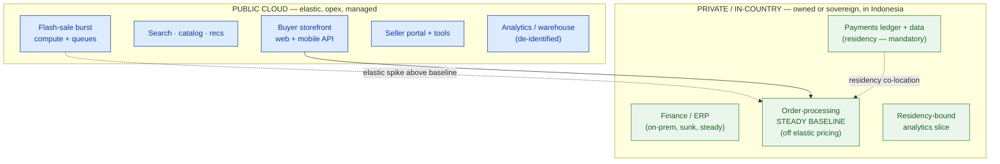

# Private-vs-Public Decision Matrix — PasarKita (worked example)

> This is `template-private-vs-public-matrix.md` filled in for the running Phase 3 customer. It shows what "good" looks like: every workload placed on evidence, the CFO's runaway-cost problem attacked at its root (steady baseline), and the residency mandate honored before any economics. This artifact is the direct input to lesson 3.6 (hybrid target) and Capstone C.

**Customer:** PasarKita (fictional)  ·  **Industry:** E-commerce marketplace (Indonesia)
**Prepared by:** SA — Presales  ·  **Date:** 2026-07-05  ·  **Opportunity:** "Cost + Residency" cloud re-architecture  ·  **Version:** v0.2

**Company shape:** ~15M active buyers · ~200,000 sellers · ~2M orders/day · flash sales ~10× · currently single public cloud (bill overrunning) + on-prem finance/ERP.
**The ask (verbatim):** *"Our cloud bill is our number-one problem and it grows whether we sell more or not — and our payments data must stay in Indonesia. We think we want hybrid."*

---

## 1. Workload inventory (tag the drivers)

| Workload | Residency | Traffic shape | Steady baseline? | Scale/reach | Managed-need |
|---|---|---|---|---|---|
| Buyer storefront web + mobile API (15M buyers) | None | Spiky (10× flash sales) | Partial | Regional | High |
| Search · catalog · recommendations | None | Spiky, read-heavy | Partial | Regional | High |
| Flash-sale burst compute + queues | None | Extremely spiky (10×, ephemeral) | No | Regional | High |
| Seller portal + tools (200k sellers) | None | Moderate, business-hours-ish | Yes | Regional | Medium |
| Core order-processing services (2M orders/day) | None (data may) | Steady 24×7 + spikes | **Yes — large** | Regional | Medium |
| **Payments / transaction ledger + data** | **In-country (mandatory)** | Steady | Yes | Single | Medium |
| Finance / ERP (already on-prem) | In-country / owned | Steady | Yes | Single | Low |
| Analytics / data warehouse + BI | Depends on data class | Batch | Yes | Regional | High |

## 2. The decision matrix (driver → verdict → rationale)

| Workload | Dominant driver | Verdict | One-line rationale |
|---|---|---|---|
| Buyer storefront web + mobile API | Elasticity | **PUBLIC** | 10× flash-sale spikes — owning peak hardware means paying for 90% idle metal 360 days/yr. |
| Search · catalog · recommendations | Managed-need + elasticity | **PUBLIC** | Undifferentiated, spiky, read-heavy — a managed elastic service scales with the sale. |
| Flash-sale burst compute + queues | Elasticity | **PUBLIC** | The archetypal rent case: ephemeral 10× burst, near-zero baseline. Never own this. |
| Seller portal + tools | Managed-need | **PUBLIC** | Moderate, steadier, but no strong own-case alone; note as a candidate to consolidate onto baseline later. |
| Core order-processing services | Cost / utilization | **SPLIT** | Large steady 24×7 baseline is being rented at elastic prices (the CFO's #1 cost) — move baseline to owned/in-country, keep burst public. |
| Payments / transaction ledger + data | **Residency** | **PRIVATE / in-country** | Legal mandate: data must stay in Indonesia. Constraint overrides all economics. |
| Finance / ERP | Residency + sunk asset | **STAYS (private, on-prem)** | System of record, steady, already owned — re-platforming buys nothing. |
| Analytics / data warehouse + BI | Data class | **PUBLIC (managed) + SPLIT** | De-identified analytics → public managed; any payment/PII slice stays in-country with the ledger. |

*Note the ordering:* payments and ERP were decided by **residency** (column first); storefront/search/burst by **traffic shape**; only the order-processing baseline was decided by **economics** — the one row the break-even worksheet exists for.

## 3. Break-even worksheet (order-processing steady baseline)

> The only workload whose verdict turns on cost, not a constraint. PasarKita's baseline is high, sustained, 24×7, and long-lived.

```
Own is cheaper when:   C_fixed_per_month
                       ─────────────────────  <  P_rent_per_hour
                       hours_used_per_month

  C_fixed = amortized hardware + facility/power + PLATFORM-TEAM cost   (paid whether idle or busy)
  P_rent  = public on-demand price for equivalent capacity            (metered, elastic premium)
```

| Assumption | Value / range | Note |
|---|---|---|
| Sustained utilization | High, 24×7 (baseline never drops to zero) | 2M orders/day never sleeps — strong own-case |
| Time horizon | ≥3 years (business is durable) | Long enough to amortize hardware |
| Platform-team cost included? | **Must be** — see open question below | Excluding it would fake the result |
| Committed-use discount available? | Likely on public side | Would move U* right; check the current offer |

**Verdict of the worksheet:** *own (borderline-to-clear)* — **sanity-check range:** the steady baseline favors owning **if** sustained utilization stays high across a 3+ year horizon **and** the fully-loaded platform-team cost is counted; if PasarKita can't staff/operate a private cloud, the same residency+cost outcome is achieved with a **sovereign/managed** private cloud instead. No single dollar figure here — FinOps (3.7) pins the actual number.

## 4. The placement map (the hybrid seed)



### ASCII fallback

```
                          RESIDENCY / REGULATION
                    none / global          must stay in-country
                 ┌──────────────────────┬──────────────────────────┐
   spiky /       │  PUBLIC              │  SOVEREIGN / IN-COUNTRY   │
   elastic       │  storefront, search, │  (residency-bound        │
                 │  flash-sale burst    │   elastic — none today)  │
                 ├──────────────────────┼──────────────────────────┤
   steady /      │  seller portal,      │  payments ledger,        │
   high 24×7     │  de-id analytics;    │  finance/ERP,            │
                 │  ORDER BASELINE ─────┼─▶ moved here (own/sovereign)
                 └──────────────────────┴──────────────────────────┘
   The order-processing baseline is the SPLIT: burst stays top-left (public),
   baseline moves bottom-right (private/in-country). That move is the whole deal.
```

## 5. Findings & open questions (what goes downstream)

| # | Finding / constraint | Driver | Implication | Severity |
|---|---|---|---|---|
| 1 | Payments data must stay in Indonesia | Residency | In-country private/sovereign — non-negotiable, decided before cost | **High** |
| 2 | Large steady baseline rented at elastic prices | Cost | Move baseline to owned/in-country capacity → attacks CFO's #1 problem | **High** |
| 3 | No confirmed platform team for self-run OpenStack/VMware | Managed-need | Choose sovereign/managed private, or budget a 24×7 platform team | **High** |
| 4 | ERP already on-prem, steady, a system of record | Residency + sunk | Leave it; don't re-platform for its own sake | Medium |
| 5 | Analytics mixes de-identified + residency-bound data | Data class | Split the warehouse by data class, not by tool | Medium |

**Open questions deliberately deferred to hybrid design (3.6):**
- **Who operates the private/in-country cloud?** PasarKita's own platform team (owned OpenStack/VMware) *or* a sovereign/local provider (managed). This choice changes the break-even and the org, not the placement.
- **How do the halves connect?** Where the network/data boundary sits between public (burst, storefront) and in-country (baseline, payments), and how burst traffic reaches the baseline securely.

**One-line placement statement:**
> PasarKita's estate is a **hybrid**: the storefront, search, flash-sale burst, seller portal, and de-identified analytics stay **public** for elasticity; payments and finance/ERP are **private/in-country** for residency; and the order-processing core is **split** — burst public, steady baseline owned/in-country — which is the single biggest lever on both the CFO's runaway bill *and* the residency mandate.

**So what (the pivot this map buys you):** instead of the room's three reflexes ("cloud is cloud", "keep it all public", "bring it all home"), you hand the committee one defensible hybrid: rent the spikes, own the steady and the regulated. The CFO sees the cost lever (baseline off elastic pricing), the regulator sees residency honored first, and lesson 3.6 has exactly what it needs to draw the connected hybrid target and price it in Capstone C.
