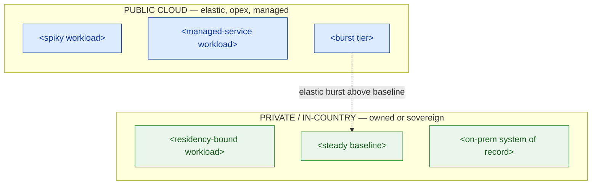

# Private-vs-Public Decision Matrix — Template

> Fill this in to decide **where each workload belongs** — public cloud, private cloud (owned), or sovereign/in-country — on evidence, not reflex. The output is a placement map a committee can approve and a regulator can accept. It is the direct input to the hybrid target design (lesson 3.6) and to Capstone C.

**Customer:** `<company>`  ·  **Industry:** `<industry>`  ·  **Prepared by:** `<SA name>`  ·  **Date:** `<YYYY-MM-DD>`
**Engagement / opportunity:** `<deal or project name>`  ·  **Version:** `<v0.1 draft>`

---

## How to use this template

Decide **column before row**: a residency/regulatory constraint picks the deployment column first; economics (traffic shape + break-even) only decides what's left. Work these steps:

1. **Inventory** every workload (§1) and tag the five drivers.
2. **Score** each workload against the decision tree (§2) → a verdict.
3. **Break-even** — for any workload whose verdict turns on cost, run the worksheet (§3).
4. **Assemble** the placement map (§4) — the seed of the hybrid target.
5. **Findings** — record the constraints and the open questions handed downstream (§5).

**The five drivers** (columns of the matrix):

| Driver | Question it answers | Pushes toward… |
|---|---|---|
| **Residency / regulation** | Must the data stay in-country or on owned hardware? | private / sovereign (hard override) |
| **Elasticity (traffic shape)** | Spiky/bursty, or steady? | spiky → public · steady → maybe private |
| **Cost / utilization** | Is there a large, sustained 24×7 baseline above break-even? | high steady use → private |
| **Scale / reach** | Global low-latency reach, or single-geography? | global → public |
| **Managed-need** | Do we want the provider to run it (no ops team)? | high → public / sovereign |

**Verdict vocabulary:** `PUBLIC` · `PRIVATE` (owned) · `SOVEREIGN` (in-country managed) · `SPLIT` (baseline private, burst public) · `STAYS` (already placed, don't move).

---

## 1. Workload inventory (tag the drivers)

> List every meaningful workload. Everything the customer runs should appear as a row.

| Workload | Residency | Traffic shape | Steady baseline? | Scale/reach | Managed-need |
|---|---|---|---|---|---|
| `<workload>` | `<none / in-country / owned>` | `<spiky / steady / batch>` | `<yes-large / partial / no>` | `<global / regional / single>` | `<high / med / low>` |
| `<workload>` | | | | | |
| `<…>` | | | | | |

## 2. The decision matrix (driver → verdict → rationale)

> One row per workload. The rationale is one line an executive and a regulator both accept.

| Workload | Dominant driver | Verdict | One-line rationale |
|---|---|---|---|
| `<workload>` | `<the driver that decides it>` | `<PUBLIC / PRIVATE / SOVEREIGN / SPLIT / STAYS>` | `<why — in the language of the driver>` |
| `<workload>` | | | |
| `<…>` | | | |

*Rule:* if **residency** is set, it is the dominant driver — economics does not get a vote on that cell.

## 3. Break-even worksheet (only for workloads whose verdict turns on cost)

> Use this for any `steady/high-baseline` workload with no residency mandate — the only place economics, not a constraint, decides. Never present a single magic number; show the formula and a range.

```
Own is cheaper when:   C_fixed_per_month
                       ─────────────────────  <  P_rent_per_hour
                       hours_used_per_month

  C_fixed = amortized hardware + facility/power + PLATFORM-TEAM cost   (paid whether idle or busy)
  P_rent  = public on-demand price for equivalent capacity            (metered, elastic premium)
```

| Assumption | Value / range | Note |
|---|---|---|
| Sustained utilization | `<% of capacity, 24×7?>` | high + steady = strong own-case |
| Time horizon | `<years — need ≥3 to amortize>` | short horizon → rent |
| Platform-team cost included? | `<yes/no>` | if "no", the analysis is fiction |
| Committed-use discount available? | `<yes/no + rough %>` | lowers P_rent, moves U* right |

**Verdict of the worksheet:** `<own / rent / borderline>` — **sanity-check range:** `<state the range and the caveat, e.g. "own if sustained utilization stays high over 3+ yrs; else rent">`.

## 4. The placement map (Mermaid skeleton)

> Two buckets: what stays/goes **public** vs what is **private/in-country**. Mark any `SPLIT` workload in both, with the burst→baseline relationship. This is the seed of the hybrid target (lesson 3.6).



### ASCII fallback (for docs/email that can't render Mermaid)

```
                          RESIDENCY / REGULATION
                    none / global          must stay in-country
                 ┌──────────────────────┬──────────────────────────┐
   spiky /       │  PUBLIC              │  SOVEREIGN / IN-COUNTRY   │
   elastic       │  <workloads…>        │  <workloads…>            │
                 ├──────────────────────┼──────────────────────────┤
   steady /      │  PRIVATE *or* public │  PRIVATE (own)           │
   high 24×7     │  <run break-even>    │  <workloads…>            │
                 └──────────────────────┴──────────────────────────┘
```

## 5. Findings & open questions (what goes downstream)

| # | Finding / constraint | Driver | Implication | Severity |
|---|---|---|---|---|
| 1 | `<e.g. payments data must stay in-country>` | Residency | `<in-country private/sovereign — non-negotiable>` | `<H/M/L>` |
| 2 | `<e.g. steady baseline rented at elastic prices>` | Cost | `<move baseline to owned capacity if U* clears>` | `<…>` |
| 3 | `<e.g. no ops team for a self-run private cloud>` | Managed-need | `<sovereign/managed private, or hire a platform team>` | `<…>` |

**Open questions deliberately deferred to hybrid design (3.6):**
- **Who operates the private cloud?** `<own platform team / sovereign provider / managed>`
- **How do the halves connect?** `<VPN / interconnect / where the data boundary sits>`

**One-line placement statement (fill in):**
> `<Customer>`'s estate is a **hybrid**: `<list public workloads>` stay **public** for elasticity; `<list private workloads>` are **private/in-country** for `<residency / steady-cost>`; and `<the split workload>` is **split** — burst public, baseline owned — which is the single biggest lever on `<the cost/residency problem>`.

---

*Worked example: see `example-pasarkita-private-vs-public-matrix.md` in this folder.*
