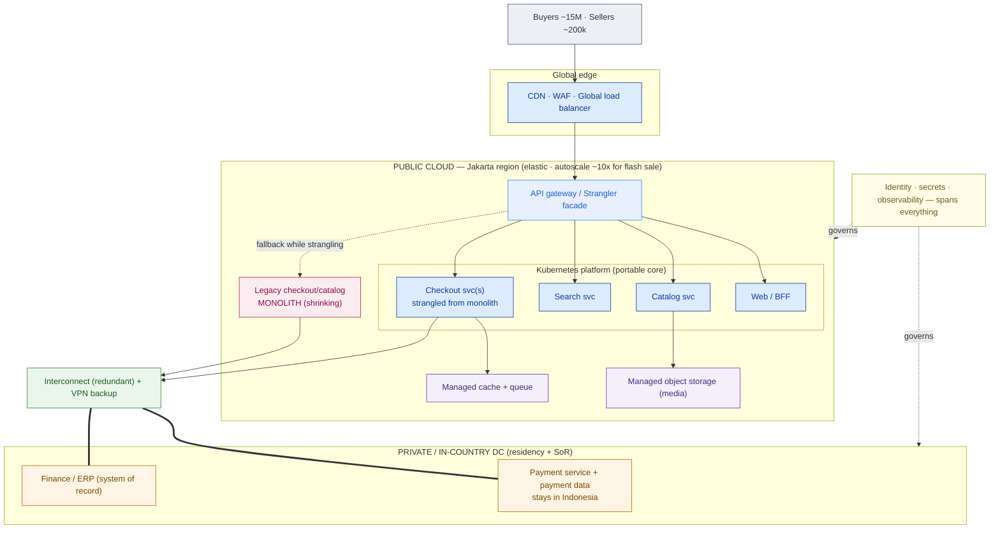

# Hybrid, Multi-Cloud & Migration

> "Multi-cloud" is not a strategy — it's a bill you choose to pay. Design the hybrid target and the path to it, or inherit the mess by accident.

**Type:** Design
**Track:** AI, Data & Infrastructure Solution Architect (Presales)
**Prerequisites:** 3.5 OpenStack & Private Cloud (and the landing zone from 3.1, the three public clouds from 3.2–3.4)
**Time:** ~5h
**Lab:** —
**Ship It:** Migration strategy + wave plan

## The Problem

PasarKita's board just got two bad surprises in the same month. First, the public-cloud bill for their single provider crossed a line nobody budgeted for — the checkout/catalog **monolith** scales by cloning whole VMs to survive a flash sale, so a ~10× traffic spike means ~10× the compute for a few hours and a permanent fear of the next sale. Second, a provider-region blip during a promo scared everyone about being "locked in to one cloud." The CTO walks out of that meeting and hands you, the SA, a one-line brief: *"Make us multi-cloud and hybrid. Portable. Not locked in."* Everyone nods. It sounds like strategy.

It is not strategy — it's three buzzwords, and taken literally they produce a worse system than the one PasarKita has now. Chase "multi-cloud" as an end in itself and you design to the **lowest common denominator**: only the features every cloud shares, wrapped in a bespoke abstraction layer so nothing is "cloud-specific." You throw away the managed databases, queues, and autoscalers that were the whole reason to be on cloud; you now run more undifferentiated plumbing yourself; you double the on-call surface; and you are locked in worse than before — to an in-house abstraction nobody else on earth understands or supports. Meanwhile the actual move gets waved through as "just lift-and-shift everything." The fragile monolith lands on a second cloud exactly as fragile as before, now more expensive, and the first flash sale melts it. During the move, someone attempts a big-bang checkout cutover on a Saturday, it goes sideways, there is no rollback, and the **99.95% checkout uptime** commitment is gone for the quarter.

The failure underneath all of this is that nobody separated the two jobs the SA actually owns. Job one: design a **real hybrid target** — decide, per workload, what stays private and in-country (payment data must stay in Indonesia; finance/ERP is a system of record) versus what runs elastic on public cloud, and buy *exactly* as much portability as a real requirement demands, no more. Job two: design a **defensible migration path** — give every workload a disposition, sequence them into waves, strangle the monolith incrementally instead of forklifting it, and cut over in a way the SLA can survive. This lesson is where the three clouds (3.2–3.4), the landing zone (3.1), and the private-vs-public call (3.5) come together into one plan. It is the direct rehearsal for Capstone C.

## The Concept

Start by refusing the buzzwords and naming what they actually are. **Hybrid** and **multi-cloud** are two independent axes, not one thing:

- **Hybrid cloud** = private/on-prem **and** public cloud, wired to work as one estate. The axis is *where the compute lives* (your DC vs someone's cloud).
- **Multi-cloud** = **two or more public clouds** (AWS + Azure + GCP, in any mix). The axis is *how many public providers* you depend on.

They are orthogonal. You can be neither, either, or both. PasarKita will end up **hybrid** (in-country private DC + public cloud) and will make a *deliberate, minimal* choice on the multi-cloud axis — not "spread everything across two clouds," but "keep a portable core so a second cloud is a decision we can make, not a rebuild."

```
                 SINGLE public cloud            TWO+ public clouds
              ┌──────────────────────────┬──────────────────────────┐
   ALL cloud  │  Single-cloud            │  Multi-cloud             │
  (no on-prem)│  (simplest; max managed  │  (residency across geos, │
              │   services; portability  │   best-of-breed, DR, or  │
              │   is a *option* you buy) │   ...gratuitous sprawl)  │
              ├──────────────────────────┼──────────────────────────┤
   Private +  │  Hybrid                  │  Hybrid + multi-cloud    │
   public     │  (residency, DR, sunk    │  (the most complex; only │
              │   DC, low-latency to SoR)│   if a real driver forces│
              │  ◀── PasarKita lands here │   both) ◀ PasarKita's edge│
              └──────────────────────────┴──────────────────────────┘
```

### Legitimate reasons vs anti-patterns

The reasons that *justify* crossing an axis are specific and defensible. The reasons that don't are the ones that sound like strategy in a boardroom.

| Axis | Legitimate reasons (design for these) | Anti-patterns (say no to these) |
|---|---|---|
| **Hybrid** | Data residency / sovereignty (payment data in Indonesia); latency to an on-prem system of record; sunk-cost DC still depreciating; regulated workload; DR to owned kit | "Cloud is scary" — keeping prod on-prem out of fear while paying for cloud too |
| **Multi-cloud** | Residency in a country only one provider serves; a genuinely best-of-breed managed service; provider-independent DR/BCP; M&A inheritance; **negotiating leverage** at renewal | **Gratuitous multi-cloud** — spreading one app across clouds "for resilience," which multiplies the failure surface and the ops burden; **LCD abstraction** — designing to the intersection of all clouds so you can use none of their good parts |

The two anti-patterns are worth memorizing because customers ask for them by name. *Gratuitous multi-cloud* increases availability risk (now two providers can take you down, plus the glue between them) while claiming to reduce it. The *lowest-common-denominator abstraction* trades a vendor's supported managed service for your own unsupported one — you pay in velocity and headcount forever, and you are still locked in, just to yourself.

### Connectivity: what makes hybrid actually work

Hybrid is only real if the private side and the public side can talk with predictable performance. Two mechanisms, and you pick per requirement:

- **Site-to-site VPN** — an encrypted tunnel over the public internet. Cheap, fast to stand up, but latency and throughput ride the open internet and vary. Fine for management traffic, low-volume integration, or as a **backup** path.
- **Dedicated interconnect** — a private circuit into the provider: **AWS Direct Connect**, **Azure ExpressRoute**, **GCP Cloud Interconnect** (or a partner/Megaport-style hand-off). Consistent latency, committed bandwidth, an SLA, and traffic that never touches the public internet — at a higher, committed cost. This is what a residency-bound, latency-sensitive hybrid needs for its production path.

The architect's rule: **interconnect for the production data path, VPN as the redundant backup.** A single link, of either kind, is a single point of failure for the whole hybrid.

### The portability spectrum — the real trade-off

"Portable" is not a yes/no; it's a dial, and every notch costs velocity. Containers and Kubernetes are the portable layer of the modern stack: a workload packaged as containers and scheduled by K8s runs substantially the same on any cloud (or on-prem). But **data has gravity** and managed services don't move — a cloud's IAM, its managed database, its queue, its object store, and the egress cost of moving terabytes all anchor you where you are, no matter how portable the compute is.

```
 MORE PORTABLE  ◀─────────────────────────────────────────────▶  MORE MANAGED / FASTER
 (move it anywhere, you run more)                 (velocity + scale, you're anchored)

 [Self-run OSS      [Containers on       [K8s + a thin        [Deep managed svc:
  on VMs]            K8s (portable        managed layer]       DynamoDB, BigQuery,
                     core)]                                    cloud-native IAM, ...]
   │                   │                    │                     │
   └─ you carry all ───┴── the sweet spot ──┴── convenience, ─────┴─ maximum lock-in,
      the ops             for a portable       some anchoring        maximum leverage of
                          core                                        the platform
```

There is no "correct" point — there is the point a real requirement forces. The honest SA framing: **run the portable core (stateless compute) on K8s so a move is possible, and consume deep managed services deliberately where velocity matters more than portability — knowing each one is a chain you chose.**

### The migration 6 R's

Every workload gets exactly one **disposition**. The canonical set (Gartner's 5 R's, extended by AWS to 6):

| R | Name | What you do | Reach for it when… |
|---|---|---|---|
| **Rehost** | "Lift-and-shift" | Move as-is to cloud VMs, no code change | Speed matters, the app is fine, you'll optimize later; tools automate this well |
| **Replatform** | "Lift-and-reshape" | Small changes — swap to a managed DB, containerize, managed queue | You can get a big managed-service win for a small, bounded change |
| **Refactor / Re-architect** | Rebuild | Re-architect for cloud-native (decompose, event-driven) | The current shape (a scaling-hostile monolith) is the problem itself |
| **Repurchase** | "Drop and shop" | Replace with a SaaS/product | A commodity (email, CRM, analytics) is cheaper to buy than to run |
| **Retire** | Turn it off | Decommission — it's dead or duplicated | Discovery finds no owner or a superseded system |
| **Retain** | Leave it (revisit) | Keep it where it is, for now | Residency/SoR/latency/cost says don't move it — payment data, ERP |

The disposition table is the spine of a migration plan. It converts a vague "move to cloud" into a per-workload decision you can defend line by line.

### Waves and the strangler-fig

You do not migrate everything at once. You group workloads into **waves** — batches sequenced by *dependency* and *risk*. Low-risk, low-dependency, stateless things go **first** to build the pipeline and the team's muscle; the crown-jewel workload goes **last**, and never in one shot.

For the monolith specifically, the pattern is the **strangler-fig** (Martin Fowler's name, after the vine that grows around a tree and slowly replaces it). You put a **facade** (an API gateway / router) in front of the monolith, then peel off one capability at a time into a new service behind the facade. The facade routes that capability to the new service and everything else still to the monolith. Repeat until the monolith is empty, then retire it. Crucially, **the monolith stays live as the fallback the whole time** — which is exactly how you migrate a 99.95%-SLA checkout without a heart-stopping big-bang cutover.

### The landing zone is the prerequisite

You migrate **into** a prepared **landing zone** (3.1), not into an empty account. The landing zone is the org/accounts (or subscriptions/projects) structure, the network foundation (VPCs, subnets, the interconnect), the IAM and guardrails, and the central logging — set up *before* the first workload arrives. Wave 0 of any plan is "build the landing zone and connectivity." Skip it and every later wave improvises its own security and networking, which is how estates rot.

## Design It

Your task: produce a **migration strategy + wave plan** for PasarKita. Work it in five steps; the output of each step is a section of the deliverable.

**PasarKita, recapped:** Indonesian e-commerce marketplace · ~15M active buyers · ~200,000 sellers · ~2M orders/day · flash sales ~10× · checkout/catalog **monolith** plus some microservices on a **single public cloud** (cost overrunning) · **on-prem finance/ERP** · wants portability/multi-cloud + hybrid · **payment data stays in Indonesia** · **99.95% checkout uptime** · **K8s-standardized platform team**.

### Step 1 — Define the hybrid target (placement first)

Before any move, decide the *destination shape*. Placement is driven by residency, systems of record, and elasticity — not by which cloud has the nicest console.

- **Stays private, in-country:** **payment service + payment data** (residency: must stay in Indonesia) and **finance/ERP** (system of record, no elasticity need, not worth moving). These live in the private/on-prem DC from 3.5.
- **Goes elastic on public cloud (Jakarta region):** the **web, catalog, search, and checkout services** — everything that must absorb the ~10× flash-sale spike. These run on the platform team's **Kubernetes** so the compute is portable.
- **Multi-cloud stance (deliberate, minimal):** *portable core on K8s, one primary public cloud for managed services, a documented second-source.* PasarKita does **not** spread checkout across two clouds — that is gratuitous multi-cloud. It keeps the core portable (K8s + open data formats) so a second cloud is a *decision*, not a rebuild, and so renewal negotiations have teeth. The negotiating-leverage and DR benefits are captured **without** paying the LCD tax.

Now draw the target. This is the diagram both an engineer and the CTO must be able to read.



Read it: elastic front on public cloud, crown-jewel payment/ERP retained in-country, one redundant connectivity spine between them, and the monolith drawn as *shrinking* — because the plan strangles it, not forklifts it.

### Step 2 — Disposition every workload (the 6 R's)

Inventory the estate and give each workload exactly one R with a one-line rationale. This is the table you defend in front of the customer.

```
WORKLOAD                     DISPOSITION      WHY (one line)
──────────────────────────────────────────────────────────────────────────────────────────
Checkout/catalog MONOLITH    Refactor         Crown jewel; scaling-hostile shape IS the problem
                                              — strangle incrementally, never forklift it
Existing microservices       Rehost →         Already containerized; move onto the K8s landing
  (already on cloud)           Replatform      zone as-is, tune to managed cache/queue after
Search                       Replatform       Swap to a managed/self-hosted engine on K8s;
                                              no application rewrite needed
Media / product images       Replatform       Move to managed object storage + CDN origin
Payment service + data       Retain           Residency: stays in-country private DC (Indonesia)
Finance / ERP                Retain           System of record; residency; no elasticity need
Analytics / warehouse        Repurchase       Adopt a managed analytics service; stop self-running
Email / SMS notifications    Repurchase       Commodity; move to a SaaS provider, drop mail infra
Duplicated legacy batch      Retire           Superseded by event-driven services; delete
──────────────────────────────────────────────────────────────────────────────────────────
Rule: exactly ONE disposition per workload. "Retain" is a decision, not a cop-out.
```

Note what the table forces into the open: the monolith is **Refactor**, not Rehost — lifting a cost-overrunning, spike-fragile monolith to a new cloud just relocates the problem. And two of the biggest workloads (payment, ERP) are **Retain**, which is the residency requirement doing its job.

### Step 3 — Sequence into waves (low-risk first, crown jewel last)

Group the dispositions into waves ordered by dependency and risk. Stateless and low-blast-radius first; the checkout writes last and incrementally.

```
WAVE  NAME                  CONTENTS                                    RISK   SLA EXPOSURE
─────────────────────────────────────────────────────────────────────────────────────────────
 0    Foundation           Landing zone · accounts/VPCs · interconnect  Low    None
                           + VPN · K8s platform · CI/CD · observability         (no prod traffic)
 1    Prove the pipeline   Rehost 2-3 stateless edge microservices       Low    Behind facade,
                           (already containerized)                              canary %
 2    Strangle the reads   Peel Catalog + Search off the monolith        Med    Read path;
                           behind the facade                                    instant rollback
 3    Strangle the writes  Peel Checkout services (cart → order →         High   Canary %, freeze
                           payment-call) off the monolith, one at a time         on flash-sale days
 4    Data & decommission  Replatform analytics · Repurchase email/SMS   Med    Monolith already
                           · RETIRE the drained monolith                        drained; low
─────────────────────────────────────────────────────────────────────────────────────────────
 THROUGHOUT:  Payment service + Finance/ERP are RETAINED in-country, reached over the
              interconnect. They never enter a migration wave — only the connectivity to them does.
```

The sequence is the whole point: Wave 1 exists to *prove the machinery* on something safe. By the time you touch checkout writes in Wave 3, the pipeline, the facade, the observability, and the rollback drill are all battle-tested. You spend your riskiest move last, on a system whose fallback (the monolith) is still running.

### Step 4 — Connectivity design

The hybrid stands or falls on the link between public cloud and the in-country DC.

- **Production path:** a **dedicated interconnect** (Direct Connect / ExpressRoute / Cloud Interconnect, depending on the primary cloud) from the private DC into the Jakarta region — consistent latency and committed bandwidth for the checkout-to-payment call and the ERP integration.
- **Redundancy:** **two interconnect circuits** (diverse paths) with a **site-to-site VPN** as automatic backup. One link is a single point of failure for the entire hybrid; the SLA cannot rest on it.
- **Residency enforcement:** the payment service and its data live only in the in-country DC; the public-cloud checkout service *calls* it over the interconnect but never stores payment data in the cloud region. Private DNS and network policy keep that boundary real, not aspirational.
- **The strangler facade** sits at the cloud edge (API gateway) and owns the routing decision — new service vs monolith — per capability, so cutover is a routing change, not a redeploy.

### Step 5 — Cutover and rollback under 99.95%

The uptime commitment is a hard budget, so do the arithmetic before you design the cutover:

```
99.95% checkout uptime  →  downtime budget
  Month (30 d = 43,200 min):   43,200 × 0.0005 = 21.6 min / month
  Year  (525,600 min):        525,600 × 0.0005 = 262.8 min ≈ 4.38 h / year
  Implication: one botched big-bang cutover can burn a whole quarter's budget in an afternoon.
  → No big-bang. Ever, for checkout.
```

So the cutover mechanics are built around never betting the budget on a single switch:

1. **Canary behind the facade.** Route 1% → 5% → 25% → 100% of a capability's traffic to the new service, watching error rate and latency at each step. The monolith serves the rest.
2. **The monolith is the rollback.** Rollback = shift the facade weight back to 0% new / 100% monolith. It's a config change measured in seconds, not a restore.
3. **Freeze windows.** No checkout-path cutover during or near a flash sale. The calendar is part of the design.
4. **Define "healthy" up front.** Each wave has explicit go/no-go metrics (checkout success rate, p99 latency, payment-call error rate) and an owner who can call the rollback.
5. **Error-budget gating.** If a wave has already spent a chunk of the month's 21.6 minutes, the next risky step waits. The budget governs the pace.

The result is a plan the customer's SRE lead can sign: elastic where it needs to be, in-country where the law requires, portable at the core, and moved one safe capability at a time with the old system always ready to catch a fall.

## Compare It

**Hybrid vs multi-cloud vs single-cloud-with-portability** — the three shapes a customer will confuse, and when each is the right call.

| Shape | What it buys | What it costs | Pick it when… |
|---|---|---|---|
| **Single cloud** | Simplicity, max managed services, one skill set, best discounts | Concentration risk; renewal leverage is weak | No residency/DR driver forces otherwise — the sane default |
| **Single cloud + portable core** | The single-cloud simplicity **plus** a credible exit / leverage; K8s + open formats | A little velocity (you avoid the deepest lock-in services on the hot path) | You want negotiating leverage and optionality without ops sprawl — **PasarKita's choice** |
| **Hybrid** | Residency, low-latency to on-prem SoR, use of a sunk DC | Connectivity to build and run; two operating models | Data/law/latency pins some workloads on-prem — **also PasarKita** |
| **Multi-cloud (active)** | True provider independence; best-of-breed per workload | Highest complexity; glue, identity, and data-movement tax; more failure surface | A real driver forces it (geo residency, a unique service, mandated BCP) — rarely, and never "just in case" |

**Deep managed services vs portability** — the trade you make per workload, not once for the whole estate.

| | Deep managed service (e.g. a cloud-native DB/queue) | Portable on K8s (containers + open engines) |
|---|---|---|
| Velocity | High — the provider runs it | Lower — your platform team runs it |
| Scale/ops | Provider's problem | Your problem (but your team is K8s-standardized) |
| Lock-in | High — this is the chain | Low — moves with the cluster |
| Right for | Commodity, non-differentiating, high-scale needs | The differentiating core you want to keep movable |

**Migration tooling — the architect chooses strategy, tools execute mechanics.** The 6 R's disposition and the wave plan are *your* judgment calls. The vendor tools automate the muscle work of the *rehost* and *replatform* rows:

| Tool | Cloud | Good at | Weak at |
|---|---|---|---|
| **AWS Application Migration Service (MGN)** | AWS | Block-level server replication → cutover (Rehost) | Refactor — it moves the machine, not the architecture |
| **Azure Migrate** | Azure | Discovery, assessment, VM + DB rehost/replatform | Deciding *which* R — that's still you |
| **GCP Migrate to VMs / Migrate to Containers** | GCP | Rehost to VMs, or auto-containerize onto GKE | Judgment about dependency order and risk |
| **Terraform / GitOps (Argo, Flux) / Cluster tooling** | Any | Building the landing zone; making K8s portable and reproducible | Nothing decides the *strategy* for you |

The line to hold with a customer: *a tool can lift-and-shift a server in an afternoon; it cannot tell you that the server shouldn't be lifted at all.* MGN, Azure Migrate, and Migrate-to-VMs are excellent at Rehost and decent at Replatform. **Refactor is human architecture work** — the strangler-fig plan for PasarKita's monolith is exactly the part no tool will hand you.

## Ship It

This lesson ships a reusable **Migration Strategy + Wave Plan** — the artifact that turns "move us to cloud" into a defensible, sequenced program, and the backbone of Capstone C. Both files live in [`outputs/`](../outputs/):

- **[`template-migration-strategy-wave-plan.md`](../outputs/template-migration-strategy-wave-plan.md)** — a fill-in-the-blank template: hybrid target topology (Mermaid skeleton), the 6 R's disposition table, the wave sequence, the connectivity design, and the cutover/rollback plan with the SLA math. A colleague can run a migration-planning workshop straight from it.
- **[`example-pasarkita-migration-strategy.md`](../outputs/example-pasarkita-migration-strategy.md)** — the template fully worked for PasarKita, so the skeleton isn't abstract. It's the plan you'd carry into the capstone.

The point of shipping this: a migration plan that names a disposition for every workload, sequences the risk, and shows the SLA arithmetic is what separates an SA who *has a plan* from one who has a hope. It is the difference between winning the transformation and owning the outage.

## Exercises

1. **(Easy)** Take five PasarKita-adjacent workloads not in the worked table — the **image-resize service**, a **seller-analytics dashboard**, the **legacy on-prem SFTP that partners upload catalogs to**, a **home-grown feature-flag service**, and **the corporate email system**. Give each exactly one of the 6 R's with a one-line rationale. For at least one, argue why **Retain** or **Retire** is the honest answer rather than a reflexive Rehost.

2. **(Medium)** Re-run the target + first two waves for a **different customer**: an **Indonesian digital bank** under strict regulator (OJK) residency and a mandated DR requirement. All customer and transaction data must stay in-country, and the regulator expects a tested failover. Draw the hybrid target (what's private/in-country vs public, and where DR lives), disposition six workloads with the 6 R's, and define **Wave 0 and Wave 1**. Then decide: does the DR mandate justify a **second cloud**, or is a second in-country **region/DC** the right answer? Defend the call in two sentences — and name which anti-pattern the wrong call would be.

3. **(Hard — combines prior lessons)** Extend PasarKita's plan into an end-to-end **connectivity + cutover section**, reusing the landing-zone structure from 3.1 and the private-vs-public matrix from 3.5. Then inject a real second-cloud driver: the product team wants a **best-of-breed managed AI service that only one provider offers** for search ranking. Decide whether adopting it makes PasarKita genuinely **multi-cloud** or is a contained best-of-breed exception, show how the portable core lets you say yes without a rebuild, and write the two-paragraph recommendation. Save it beside your worked example — you will drop this straight into **Capstone C**.

## Key Terms

| Term | What people say | What it actually means |
|------|-----------------|------------------------|
| Hybrid cloud | "On-prem plus cloud" | Private/on-prem **and** public cloud wired to work as one estate; chosen for residency, latency to a system of record, a sunk DC, or DR — not out of fear. |
| Multi-cloud | "Not locked in" | Two or more **public** clouds. Justified only by a real driver (geo residency, best-of-breed, mandated BCP, leverage). Doing it "just in case" multiplies risk and ops. |
| LCD abstraction | "Cloud-agnostic" | Designing to the **lowest common denominator** — only features every cloud shares. Trades a supported managed service for your own unsupported one; still lock-in, just to yourself. |
| Data gravity | "Move the data too" | Data (and its egress cost, managed DB, and IAM) resists moving even when compute is portable. It's why "portable" compute doesn't make the whole system portable. |
| Portability spectrum | "Make it portable" | Portability is a dial, not a switch. Containers/K8s buy a portable *core*; each deep managed service you adopt is a deliberate notch toward lock-in and velocity. |
| The 6 R's | "Migrate it" | Rehost, Replatform, Refactor, Repurchase, Retire, Retain — the disposition you assign to **every** workload. The table is the spine of a migration plan. |
| Strangler-fig | "Rewrite the monolith" | Put a facade in front of the monolith and peel off one capability at a time into new services, monolith live as fallback, until it's empty — then retire it. No big-bang. |
| Migration wave | "Phase 1, phase 2…" | A batch of workloads sequenced by dependency and risk. Low-risk/stateless first to prove the pipeline; the crown jewel last and incrementally. |
| Landing zone | "The cloud account" | The pre-built accounts, network, IAM, guardrails, and logging you migrate **into**. Wave 0 builds it; skipping it makes every later wave improvise security. |
| Interconnect | "The VPN" | A dedicated private circuit (Direct Connect / ExpressRoute / Cloud Interconnect) with committed bandwidth and consistent latency for the production hybrid path; VPN is the cheaper backup. |
| Error budget | "The SLA" | The downtime an SLA *allows* — 99.95% = ~21.6 min/month. It's a budget you spend; it forbids big-bang cutovers and paces the risky waves. |

## Further Reading

- [AWS — 6 Strategies for Migrating Applications to the Cloud (the "6 R's")](https://aws.amazon.com/blogs/enterprise-strategy/6-strategies-for-migrating-applications-to-the-cloud/) — the canonical disposition framework this lesson's table is built on; read it once and you'll use the vocabulary in every migration deal.
- [Martin Fowler — Strangler Fig Application](https://martinfowler.com/bliki/StranglerFigApplication.html) — the original pattern for retiring a monolith incrementally without a big-bang cutover; the exact move for PasarKita's checkout.
- [AWS Direct Connect](https://aws.amazon.com/directconnect/) · [Azure ExpressRoute](https://learn.microsoft.com/azure/expressroute/expressroute-introduction) · [Google Cloud Interconnect](https://cloud.google.com/network-connectivity/docs/interconnect/concepts/overview) — the three dedicated-interconnect products; skim one so you can size a hybrid production path with real numbers.
- [Gregor Hohpe — Multi-Cloud: The Good, the Bad, and the Ugly](https://architectelevator.com/cloud/multicloud-elevator/) — a clear-eyed take on when multi-cloud is leverage versus when it's gratuitous sprawl; inoculation against the boardroom buzzword.
- [Google Cloud — Migration to Google Cloud: choosing an approach](https://cloud.google.com/architecture/migration-to-gcp-getting-started) and [Azure Cloud Adoption Framework — Migrate](https://learn.microsoft.com/azure/cloud-adoption-framework/migrate/) — two vendor migration methodologies; read the *assess → plan → migrate → optimize* shape, which mirrors the wave plan you just built.
- [CNCF — Kubernetes as the portability layer](https://www.cncf.io/) — background on why containers + K8s are the industry's answer to "portable core," and where that portability stops (data, networking, IAM).
