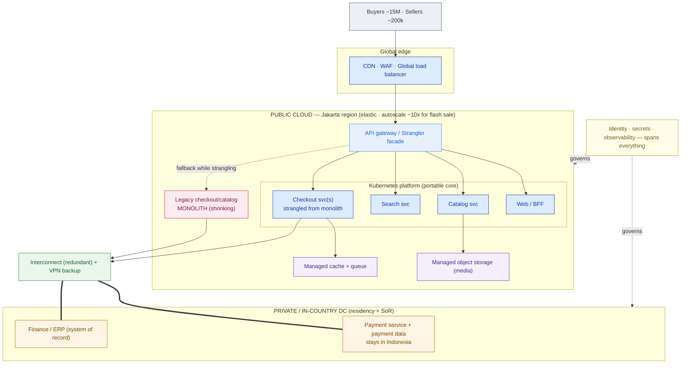

# Migration Strategy + Wave Plan — PasarKita (worked example)

> This is `template-migration-strategy-wave-plan.md` filled in for the running Phase 3 customer. It shows what "good" looks like: a hybrid target you can draw, a disposition for every workload, four waves that spend risk last, and a cutover the 99.95% SLA can survive. It is the plan you would carry directly into **Capstone C: Hybrid Cloud Enterprise Architecture**.

**Customer:** PasarKita (fictional)  ·  **Industry:** E-commerce marketplace (Indonesia)
**Prepared by:** SA — Presales  ·  **Date:** 2026-07-05  ·  **Opportunity:** "Portable Hybrid + Cost Reset" migration program  ·  **Version:** v0.2
**Primary public cloud:** one primary (Jakarta region)  ·  **Private/on-prem:** in-country DC + private cloud (from 3.5)  ·  **Region:** Jakarta

**Company shape:** ~15M active buyers · ~200,000 sellers · ~2M orders/day · flash sales ~10× baseline.
**Today:** checkout/catalog **monolith** + some microservices on a **single public cloud (cost overrunning)** + **on-prem finance/ERP**. Platform team is **Kubernetes-standardized**.

**Hard constraints (these drove every decision):**
- **Residency:** **payment data stays in Indonesia.**
- **Availability SLA:** **99.95% checkout uptime** → budget: **~21.6 min/month**, **~4.38 h/year**.
- **Spike profile:** flash sales **~10×** baseline — elasticity is mandatory on the front end.
- **Platform standard:** Kubernetes.  **Systems of record to retain:** finance/ERP; payment service.

Legend: **SoR** = system of record · **6 R's** = Rehost / Replatform / Refactor / Repurchase / Retire / Retain · **facade** = strangler-fig router in front of the monolith.

---

## 1. Hybrid target + multi-cloud stance

**Placement decisions**

| Workload group | Placement | Driver |
|---|---|---|
| Payment service + payment data | Private / in-country DC | **Residency** — must stay in Indonesia |
| Finance / ERP | Private / on-prem | **System of record**; no elasticity need; not worth moving |
| Web · catalog · search · checkout services | Public cloud, Jakarta (elastic, on K8s) | **Spike absorption** — autoscale for ~10× flash sale |
| Media / product images | Public cloud (managed object storage + CDN) | Scale + cost; commodity storage |
| Analytics / warehouse | Public cloud (managed service) | Stop self-running; elastic query |

**Multi-cloud stance (stated explicitly):**
> **Portable core on Kubernetes, ONE primary public cloud for managed services, a documented second-source.** PasarKita does **not** spread checkout across two clouds — that is gratuitous multi-cloud, and it would multiply the failure surface while breaching the very SLA it claims to protect. It does **not** build a lowest-common-denominator abstraction — that would throw away the managed services that fix the cost problem. Keeping the core portable (K8s + open data formats) makes a second cloud a *decision*, not a rebuild, and gives real leverage at renewal. That captures the CTO's "portable / not locked in" ask **without** the ops tax.

**Target topology**



---

## 2. Workload disposition — the 6 R's

```
WORKLOAD                     DISPOSITION      WHY (one line)
──────────────────────────────────────────────────────────────────────────────────────────
Checkout/catalog MONOLITH    Refactor         Crown jewel; scaling-hostile shape IS the cost +
                                              fragility problem — strangle it, never forklift
Existing microservices       Rehost →         Already containerized; move onto the K8s landing
  (already on cloud)           Replatform      zone as-is, then tune to managed cache/queue
Search                       Replatform       Swap to a managed/self-hosted engine on K8s;
                                              no application rewrite
Media / product images       Replatform       Managed object storage + CDN origin
Payment service + data       Retain           Residency: stays in-country private DC (Indonesia)
Finance / ERP                Retain           System of record; residency; no elasticity need
Analytics / warehouse        Repurchase       Adopt a managed analytics service; stop self-running
Email / SMS notifications    Repurchase       Commodity; move to a SaaS provider, drop mail infra
Duplicated legacy batch      Retire           Superseded by event-driven services; delete
──────────────────────────────────────────────────────────────────────────────────────────
```

| Disposition | Count | Tool-assisted? |
|---|---|---|
| Rehost / Replatform | 3 | Yes — MGN / Azure Migrate / Migrate to VMs/Containers (mechanical lift) |
| Refactor | 1 (the monolith) | **No — architecture work (strangler-fig)** |
| Repurchase / Retire / Retain | 5 | N/A |

**What the table forces into the open:** the monolith is **Refactor**, not Rehost — lifting a cost-overrunning, spike-fragile monolith to a new cloud just relocates the pain. And the two heaviest workloads (payment, ERP) are **Retain**, which is the residency requirement doing its job — no amount of "cloud-first" enthusiasm moves payment data out of Indonesia.

---

## 3. Wave plan

```
WAVE  NAME                CONTENTS                                    RISK   SLA EXPOSURE
─────────────────────────────────────────────────────────────────────────────────────────────
 0    Foundation         Landing zone (3.1): accounts/VPCs · IAM ·    Low    None (no prod traffic)
                         guardrails · logging · redundant
                         interconnect + VPN · K8s platform · CI/CD ·
                         observability
 1    Prove the pipeline Rehost 2-3 stateless edge microservices      Low    Behind facade, canary %
                         (already containerized) onto the platform
 2    Strangle the reads Peel Catalog + Search off the monolith       Med    Read path; instant
                         behind the facade                                   rollback to monolith
 3    Strangle the       Peel Checkout writes off the monolith one    High   Canary %, freeze on
      writes             capability at a time: cart → order →                flash-sale days
                         payment-call (payment call crosses the
                         interconnect to the in-country service)
 4    Data & decommiss.  Replatform analytics · Repurchase email/SMS  Med    Monolith already
                         · RETIRE the drained monolith                       drained; low
─────────────────────────────────────────────────────────────────────────────────────────────
 THROUGHOUT:  Payment service + Finance/ERP RETAINED in-country, reached over the interconnect.
              They never enter a wave — only the connectivity to them does.
```

| Wave | Entry (go) | Exit (done) | Rollback trigger |
|---|---|---|---|
| 0 | Landing-zone design signed off; interconnect ordered | Connectivity + K8s + observability smoke-tested end-to-end | n/a — no prod traffic |
| 1 | Wave 0 exit met | 2–3 services stable at 100% behind the facade for 2 weeks | Error rate or p99 latency past threshold |
| 2 | Facade + canary tooling proven in Wave 1 | Catalog + Search served fully by new services; monolith read-idle | Any checkout read regression → weight back to monolith |
| 3 | Reads stable; freeze calendar agreed with the business | Checkout writes served by new services; monolith write-idle | Checkout success rate / payment-call error breach → instant rollback |
| 4 | Monolith drained (no live traffic) | Monolith retired; analytics on managed service | Low — nothing left to fall back from |

---

## 4. Connectivity design

- **Production path:** dedicated **interconnect** (Direct Connect / ExpressRoute / Cloud Interconnect, per the chosen primary cloud) from the **in-country DC** into the **Jakarta region** — committed bandwidth and consistent latency for the checkout→payment call and the ERP integration.
- **Redundancy:** **two diverse interconnect circuits** with a **site-to-site VPN** as automatic backup. A single link is a single point of failure for the entire hybrid and would put the 99.95% SLA at the mercy of one circuit.
- **Residency enforcement:** the payment service and its data live **only** in the in-country DC. The public-cloud checkout service *calls* it over the interconnect but never persists payment data in the cloud region; private DNS + network policy make that boundary real, not a slide-deck promise.
- **Strangler facade:** an API gateway at the cloud edge owns the new-vs-monolith routing decision **per capability**, so each cutover is a weighted-routing change — not a redeploy.
- **Identity/security spine:** corporate SSO for humans; a **cross-boundary service identity** lets the cloud checkout service authenticate to the in-country payment service; secrets centralized; all of it stood up in Wave 0.

---

## 5. Cutover & rollback (respect 99.95%)

**Error-budget math:**

```
99.95% checkout uptime  →  downtime budget
  Month (30 d = 43,200 min):   43,200 × 0.0005 = 21.6 min / month
  Year  (525,600 min):        525,600 × 0.0005 = 262.8 min ≈ 4.38 h / year
  Implication: one botched big-bang cutover can burn a whole quarter's budget in an afternoon.
  → No big-bang for checkout. Ever.
```

**Cutover mechanics:**
1. **Canary behind the facade:** route each capability 1% → 5% → 25% → 100% to the new service, watching checkout success rate, p99 latency, and payment-call error at every step. The monolith serves the remainder.
2. **The monolith is the rollback:** rollback = shift the facade weight to 0% new / 100% monolith — a config change measured in seconds, not a restore.
3. **Freeze windows:** no checkout-path cutover during or near a flash sale. The promo calendar is an input to the plan, not an afterthought.
4. **Go/no-go per wave:** explicit thresholds (e.g. checkout success ≥ baseline, p99 ≤ target, payment-call error ≤ target) with a named owner empowered to call the rollback.
5. **Error-budget gating:** if a wave has already spent a chunk of the month's 21.6 minutes, the next risky step waits. The budget paces the program.

---

## 6. Anti-patterns avoided & open risks

| # | Anti-pattern / risk | How this plan handles it | Severity |
|---|---|---|---|
| 1 | Gratuitous multi-cloud | One primary cloud; portable K8s core, not apps spread across providers | High (avoided) |
| 2 | LCD "cloud-agnostic" abstraction | Managed services consumed deliberately; K8s for the differentiating core only | High (avoided) |
| 3 | Forklift the monolith | Monolith is **Refactor** via strangler-fig, not Rehost | High (avoided) |
| 4 | Big-bang cutover vs 99.95% | Canary + monolith-as-rollback + freeze windows + budget gating | High (avoided) |
| 5 | Single connectivity link | Redundant interconnect + VPN backup | Medium (avoided) |
| 6 | Payment data leaks to cloud region | Payment service retained in-country; private DNS + network policy enforce it | High (mitigated) |
| 7 | Cost overrun persists post-move | Elastic K8s + managed services replace VM-cloning; FinOps review after Wave 1 (see 3.7) | Medium (open) |

**One-line strategy statement:**
> PasarKita's target is a **hybrid** estate — **payment and finance/ERP retained private and in-country** for residency and system-of-record integrity, **web/catalog/search/checkout elastic on one primary public cloud** with a **portable Kubernetes core** (leverage and optionality without multi-cloud sprawl) — reached by a **redundant interconnect + VPN backup**, migrated in **four waves** (foundation → prove-the-pipeline → strangle reads → strangle writes → decommission), the monolith **strangled last** capability by capability, and cut over by **canary with the monolith as rollback** inside a **99.95% (~21.6 min/month) error budget**.

**So what (the pivot this plan buys):** instead of "lift-and-shift to a second cloud and hope," PasarKita gets a defensible program that fixes the cost problem (elastic instead of VM-cloning), honors the law (payment data in Indonesia), delivers the CTO's "portable / not locked in" *without* the LCD tax, and touches the crown-jewel checkout **last**, incrementally, with the old system always ready to catch a fall. That plan is exactly what Capstone C asks you to build.
